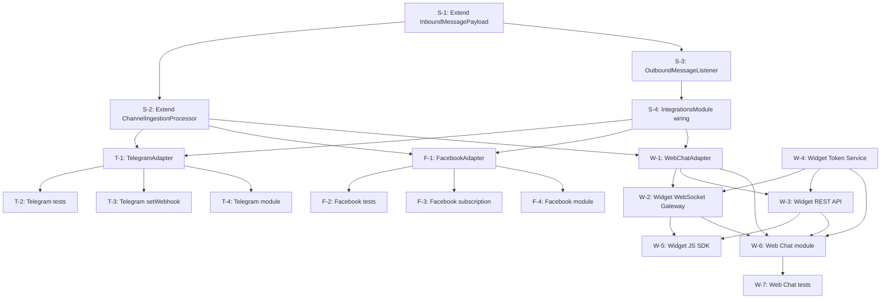

# Epic 1.6: Channel Integrations — Task Breakdown

> **Mục tiêu**: Break down 3 features (Telegram, Facebook, Web Chat) thành các task nhỏ, rõ ràng để AI coding agent implement được tốt.
> **Thứ tự triển khai**: Telegram → Facebook → Web Chat (đơn giản → phức tạp).

---

## 📋 Tổng quan kiến trúc & Design Decisions

### Grill Session Decisions Summary

| # | Decision | Kết quả |
|---|----------|---------|
| Q1 | Thứ tự triển khai | Telegram → Facebook → Web Chat |
| Q2 | Widget SDK approach | Vanilla JS SDK (`packages/widget-sdk`), Vite library mode, Socket.IO client |
| Q3 | Facebook Token management | Admin nhập Page Access Token thủ công, defer OAuth flow |
| Q4 | Outbound message flow | Event-driven: `message.created` → listener → adapter `sendMessage()` |
| Q5 | Media file handling | Download trong ChannelIngestionProcessor → upload MinIO → tạo Attachment |
| Q6 | Telegram webhook secret | URL secret path: `/webhooks/telegram/{channelId}` + verify bot_token |
| Q7 | Outbound listener placement | `integrations/outbound-message.listener.ts` chung cho tất cả channels |
| Q8 | Delivery/Read receipts | Xử lý trong adapter, trả DeliveryStatusPayload, Processor update Message |
| Q9 | Widget WebSocket | Namespace `/widget` riêng, auth bằng widget_token + contactId |
| Q10 | Telegram setWebhook | Auto gọi khi tạo Channel TELEGRAM |
| Q11 | Testing | Unit test adapter methods với mock HTTP |
| Q12 | Data flow | Tất cả 6 flows đều implement |
| Q13 | InboundPayload extension | Thêm `eventKind: 'message' \| 'delivery_status'` + DeliveryStatusInfo |
| Q14 | Widget SDK location | `packages/widget-sdk` trong monorepo |

### Data Flow Overview

```text
┌─────────────────────────────────────────────────────────────────────┐
│                      INBOUND FLOW (Webhook → Message)               │
│                                                                     │
│  External Provider                                                  │
│       │                                                             │
│       ▼                                                             │
│  WebhooksController (POST /webhooks/:channelType/:channelId)        │
│       │                                                             │
│       ▼                                                             │
│  WebhooksService.handleInboundWebhook()                             │
│       ├── adapter.verifyWebhook() ── HMAC/token validation          │
│       ├── ChannelEvent dedup                                        │
│       └── BullMQ enqueue                                            │
│           │                                                         │
│           ▼                                                         │
│  ChannelIngestionProcessor.process()                                │
│       ├── adapter.parseInboundPayload() ── normalize                │
│       │       ├── eventKind: 'message' → InboundMessagePayload      │
│       │       └── eventKind: 'delivery_status' → DeliveryStatusInfo │
│       ├── [message] ContactResolution → Conversation → Message      │
│       ├── [message] Download media files → upload MinIO → Attachment│
│       └── [delivery_status] Update Message.deliveryStatus           │
└─────────────────────────────────────────────────────────────────────┘

┌─────────────────────────────────────────────────────────────────────┐
│                     OUTBOUND FLOW (Agent Reply → Provider)           │
│                                                                     │
│  Agent sends reply via API                                          │
│       │                                                             │
│       ▼                                                             │
│  MessagesService.create() → save Message (OUTGOING)                 │
│       │                                                             │
│       ▼ EventEmitter2                                               │
│  Event: 'message.created'                                           │
│       │                                                             │
│       ▼                                                             │
│  OutboundMessageListener (@OnEvent('message.created'))              │
│       ├── Check messageType === OUTGOING                            │
│       ├── Resolve ChannelAdapter from Registry                      │
│       └── adapter.sendMessage(channelContext, outboundPayload)      │
│           └── Update Message.externalId, deliveryStatus             │
└─────────────────────────────────────────────────────────────────────┘
```

---

## 🏗️ Shared Infrastructure Tasks (Trước khi implement channels cụ thể)

> Các task chuẩn bị cơ sở hạ tầng chung, apply cho tất cả channel adapters.

---

### Task S-1: Mở rộng `InboundMessagePayload` — Support delivery status events

**Objective**: Mở rộng type system để adapter có thể trả về cả message events và delivery status events.

**Files cần sửa**:
- [channel-adapter.types.ts](file:///d:/workspace/Sales%20Copilot/apps/server/src/integrations/channel-adapter.types.ts)

**Chi tiết thay đổi**:
```typescript
// Thêm vào channel-adapter.types.ts

export type InboundEventKind = 'message' | 'delivery_status';

export interface DeliveryStatusInfo {
  externalMessageId: string;
  status: DeliveryStatus; // from shared-contracts: SENT, DELIVERED, READ, FAILED
  timestamp: Date;
  errorMessage?: string;
}

// Mở rộng InboundMessagePayload
export interface InboundMessagePayload {
  eventKind?: InboundEventKind; // NEW — default 'message'
  // ... existing fields ...
  deliveryStatusInfo?: DeliveryStatusInfo; // NEW — only when eventKind === 'delivery_status'
}
```

**Acceptance Criteria**:
- [x] `InboundMessagePayload` có field `eventKind` với default `'message'`
- [x] `DeliveryStatusInfo` interface được export
- [x] Existing code không bị break (backward compatible — `eventKind` default 'message')

**Estimated complexity**: 🟢 Low (~20 LOC)

---

### Task S-2: Mở rộng `ChannelIngestionProcessor` — Handle delivery status events + Media download

**Objective**: Processor phân biệt message vs delivery_status events và xử lý tương ứng. Thêm media download logic.

**Files cần sửa**:
- [channel-ingestion.processor.ts](file:///d:/workspace/Sales%20Copilot/apps/server/src/infrastructure/queue/channel-ingestion.processor.ts)

**Chi tiết thay đổi**:

1. **Phân loại events**: Sau `adapter.parseInboundPayload()`, tách `inboundMessages` thành 2 nhóm:
   - `eventKind === 'message'` → xử lý như hiện tại (contact resolution → conversation → message)
   - `eventKind === 'delivery_status'` → lookup Message by `externalId`, update `deliveryStatus`

2. **Media download**: Cho messages có `attachments` với `fileUrl` external:
   - Download file từ external URL (Telegram getFile, Facebook CDN)
   - Upload lên MinIO qua `StorageService`
   - Replace `fileUrl` bằng MinIO path trước khi tạo Attachment record

**Acceptance Criteria**:
- [x] Delivery status events update `Message.deliveryStatus` chính xác
- [x] Media files được download và upload lên MinIO
- [x] Nếu download fail, log warning nhưng vẫn tạo Message (graceful degradation)
- [x] Existing message flow không bị break

**Dependencies**: Task S-1

**Estimated complexity**: 🟡 Medium (~80 LOC)

**Chatwoot Reference**: 
- [telegram/incoming_message_service.rb](file:///d:/workspace/Sales%20Copilot/.docs/references/chatwoot/source/app/services/telegram/incoming_message_service.rb) — `attach_files`, `attach_location` methods (lines 56-66, 144-166)

---

### Task S-3: Tạo `OutboundMessageListener` — Event-driven outbound delivery

**Objective**: Listener lắng nghe `message.created` event, nếu message OUTGOING thì resolve adapter và gọi `sendMessage()`.

**Files mới**:
- `apps/server/src/integrations/outbound-message.listener.ts` [NEW]
- `apps/server/src/integrations/outbound-message.listener.spec.ts` [NEW]

**Chi tiết**:
```typescript
@Injectable()
export class OutboundMessageListener {
  @OnEvent('message.created')
  async handleOutboundMessage(payload: MessageCreatedEvent) {
    // 1. Check messageType === OUTGOING & senderType !== CONTACT
    // 2. Load conversation → inbox → channel
    // 3. Decrypt channel credentials
    // 4. Resolve adapter from ChannelAdapterRegistry
    // 5. Build OutboundMessagePayload (recipientExternalId from ChannelIdentity)
    // 6. Call adapter.sendMessage()
    // 7. Update message.externalId and deliveryStatus
    // 8. Error handling: update deliveryStatus = FAILED, log error
  }
}
```

**Acceptance Criteria**:
- [x] Outgoing messages trigger sendMessage() qua adapter tương ứng
- [x] Message.externalId được cập nhật sau khi gửi thành công
- [x] deliveryStatus được update (SENT on success, FAILED on error)
- [x] Incoming messages bị skip (chỉ xử lý OUTGOING)
- [x] Channel không có adapter registered → log warning, skip
- [x] Unit test cover success, failure, skip cases

**Dependencies**: `ChannelAdapterRegistry`, `ChannelCredentialService`, `MessagesService`

**Estimated complexity**: 🟡 Medium (~100 LOC + ~80 LOC test)

**Chatwoot Reference**:
- [facebook/send_on_facebook_service.rb](file:///d:/workspace/Sales%20Copilot/.docs/references/chatwoot/source/app/services/facebook/send_on_facebook_service.rb) — error handling pattern (lines 16-19, 114-119)
- [channel/telegram.rb](file:///d:/workspace/Sales%20Copilot/.docs/references/chatwoot/source/app/models/channel/telegram.rb) — `send_message_on_telegram` method (lines 38-42)

---

### Task S-4: Update `IntegrationsModule` — Register listener + export providers

**Objective**: Wire up `OutboundMessageListener` trong module system.

**Files cần sửa**:
- [integrations.module.ts](file:///d:/workspace/Sales%20Copilot/apps/server/src/integrations/integrations.module.ts)
- [index.ts](file:///d:/workspace/Sales%20Copilot/apps/server/src/integrations/index.ts)

**Acceptance Criteria**:
- [x] OutboundMessageListener được register trong providers của IntegrationsModule
- [x] OutboundMessageListener và ChannelAdapterRegistry được export đầy đủ
- [x] Barrel export index.ts export tất cả types, interfaces, registry, listener và module
- [x] Toàn bộ build, test và typecheck vượt qua 100%

**Estimated complexity**: 🟢 Low (~15 LOC)

---

## 📦 Feature F-1.6.3: Telegram Bot Channel — 🟡 Medium

> **Triển khai FIRST** — API đơn giản nhất, validate adapter pattern sớm.

---

### Task T-1: Tạo `TelegramAdapter` — Core adapter implementation

**Objective**: Implement `ChannelAdapter` interface cho Telegram Bot API.

**Files mới**:
- `apps/server/src/integrations/telegram/telegram.adapter.ts` [NEW]

**Chi tiết implementation**:

#### `verifyWebhook()`
- Verify bằng URL secret path pattern: channelId trong URL path
- Ngoài ra, verify `X-Telegram-Bot-Api-Secret-Token` header nếu có (Telegram native)
- Chatwoot không verify signature riêng cho Telegram webhooks (dùng bot_token trong URL path)

```typescript
verifyWebhook(request: WebhookVerificationRequest, credentials?: Record<string, unknown>): boolean {
  // Telegram doesn't send HMAC signatures like Facebook.
  // Verification is done via URL secret path (channelId in URL) 
  // and optionally X-Telegram-Bot-Api-Secret-Token header
  const secretToken = request.headers['x-telegram-bot-api-secret-token'];
  if (secretToken && credentials?.webhookSecret) {
    return secretToken === credentials.webhookSecret;
  }
  // URL-based verification: if request reaches this handler, 
  // channelId in URL already verified by WebhooksService
  return true;
}
```

#### `parseInboundPayload()`
- Parse Telegram Update object → `InboundMessagePayload[]`
- Support message types: text, photo, video, audio, document, voice, sticker
- Extract: chat_id, from.id, message_id, text/caption, file_id
- Cho media: dùng `getFile` API URL pattern nhưng chỉ trả về file_id (download sẽ xảy ra ở Processor)
- Set `eventKind: 'message'`
- Handle `callback_query` (inline keyboard responses)

```typescript
// Telegram Update object structure (from Chatwoot param_helpers.rb):
// params.message.text, params.message.photo, params.message.document, etc.
// params.message.from.id → externalContactId
// params.message.chat.id → chatId (stored in conversation metadata)
// params.message.message_id → externalMessageId
```

#### `sendMessage()`
- Gọi Telegram Bot API: `POST /bot{token}/sendMessage`
- Support text messages (`sendMessage`)
- Support media: `sendPhoto`, `sendDocument`, `sendVideo`, `sendAudio`
- Return `SendMessageResult` with `message_id` from response

#### `getChannelInfo()`
- Gọi `GET /bot{token}/getMe` → bot username, name

**Acceptance Criteria**:
- [x] `channelType` = `ChannelType.TELEGRAM`
- [x] `verifyWebhook()` validates secret token header hoặc pass-through URL auth
- [x] `parseInboundPayload()` normalize text message → InboundMessagePayload
- [x] `parseInboundPayload()` normalize media messages (photo, video, document, audio, voice)
- [x] `parseInboundPayload()` handle callback_query
- [x] `parseInboundPayload()` ignore non-private messages (group chats)
- [x] `sendMessage()` gọi Telegram API thành công cho text
- [x] `sendMessage()` gọi Telegram API thành công cho media
- [x] `getChannelInfo()` trả về bot info
- [x] Adapter registered thành công trong `ChannelAdapterRegistry`

**Estimated complexity**: 🟡 Medium (~200 LOC)

**Chatwoot Reference**:
- [channel/telegram.rb](file:///d:/workspace/Sales%20Copilot/.docs/references/chatwoot/source/app/models/channel/telegram.rb) — send_message, message_request, get_telegram_file_path (lines 38-42, 55-59, 104-114, 157-169)
- [telegram/incoming_message_service.rb](file:///d:/workspace/Sales%20Copilot/.docs/references/chatwoot/source/app/services/telegram/incoming_message_service.rb) — perform, set_contact, set_conversation, file parsing (lines 9-36, 124-166, 194-221)
- [telegram/param_helpers.rb](file:///d:/workspace/Sales%20Copilot/.docs/references/chatwoot/source/app/services/telegram/param_helpers.rb) — param extraction helpers (lines 1-104)

---

### Task T-2: Tạo `TelegramAdapter` unit tests

**Files mới**:
- `apps/server/src/integrations/telegram/__tests__/telegram.adapter.spec.ts` [NEW]

**Test cases**:
1. `verifyWebhook()`:
   - Secret token header match → true
   - Secret token header mismatch → false
   - No secret token header → true (URL auth fallback)
2. `parseInboundPayload()`:
   - Text message → correct InboundMessagePayload
   - Photo message → correct attachments with file_id
   - Document message → correct attachments
   - Video/audio/voice messages
   - Callback query → correct payload
   - Group message → empty array (ignored)
   - Unknown/malformed payload → empty array
3. `sendMessage()`:
   - Text message → mock HTTP 200 → correct SendMessageResult
   - With attachment → mock HTTP 200
   - API error → throw/handle error
4. `getChannelInfo()`:
   - Mock getMe response → correct ChannelInfo

**Estimated complexity**: 🟡 Medium (~250 LOC)

---

### Task T-3: Telegram `setWebhook` automation khi tạo Channel

**Objective**: Khi admin tạo Channel với `channelType=TELEGRAM`, tự động gọi Telegram API `setWebhook` và `getMe` để validate bot token.

**Files cần sửa**:
- `apps/server/src/integrations/telegram/telegram.adapter.ts` hoặc tạo `telegram.lifecycle.ts` [NEW]
- Cần hook vào channel creation flow (event `channel.created`)

**Chi tiết**:
1. Listen event `channel.created` (hoặc `inbox.created`)
2. Check if channelType === TELEGRAM
3. Decrypt credentials → extract `bot_token`
4. Call `getMe` → validate token, get bot username
5. Call `deleteWebhook` → `setWebhook` with URL `{BASE_URL}/webhooks/telegram/{channelId}`
6. Optionally set `secret_token` for extra security
7. Update channel metadata (bot_name, etc.)

**Acceptance Criteria**:
- [x] Channel creation triggers setWebhook automatically
- [x] Invalid bot_token → error returned, channel creation may proceed with warning
- [x] Webhook URL correctly points to our server
- [x] Bot info (username) stored in channel metadata

**Estimated complexity**: 🟡 Medium (~80 LOC)

**Chatwoot Reference**:
- [channel/telegram.rb](file:///d:/workspace/Sales%20Copilot/.docs/references/chatwoot/source/app/models/channel/telegram.rb) — `ensure_valid_bot_token` (lines 85-93), `setup_telegram_webhook` (lines 95-102)

---

### Task T-4: Telegram module wiring & registration

**Objective**: Wire TelegramAdapter vào NestJS module system, register trong `ChannelAdapterRegistry`.

**Files mới/sửa**:
- `apps/server/src/integrations/telegram/telegram.module.ts` [NEW]
- `apps/server/src/integrations/telegram/index.ts` [NEW]
- Update [integrations.module.ts](file:///d:/workspace/Sales%20Copilot/apps/server/src/integrations/integrations.module.ts)

**Chi tiết**:
```typescript
@Module({
  imports: [HttpModule], // for Telegram API calls
  providers: [TelegramAdapter],
  exports: [TelegramAdapter],
})
export class TelegramModule implements OnModuleInit {
  constructor(
    private readonly adapter: TelegramAdapter,
    private readonly registry: ChannelAdapterRegistry,
  ) {}

  onModuleInit() {
    this.registry.register(this.adapter);
  }
}
```

**Estimated complexity**: 🟢 Low (~30 LOC)

---

## 📦 Feature F-1.6.2: Facebook Messenger Channel — 🔴 High

> **Triển khai SECOND** — Phức tạp hơn Telegram: HMAC-SHA256, PSID mapping, delivery receipts.

---

### Task F-1: Tạo `FacebookAdapter` — Core adapter implementation

**Objective**: Implement `ChannelAdapter` interface cho Facebook Messenger Platform API.

**Files mới**:
- `apps/server/src/integrations/facebook/facebook.adapter.ts` [NEW]

**Chi tiết implementation**:

#### `verifyWebhook()`
- **GET request (Challenge)**: Handled by `WebhooksService.verifyChallenge()` — đã implement!
- **POST request (Payload)**: Verify HMAC-SHA256 signature
  ```typescript
  // Header: X-Hub-Signature-256: sha256=<hash>
  // Hash = HMAC-SHA256(app_secret, rawBody)
  const expectedSignature = crypto
    .createHmac('sha256', credentials.appSecret as string)
    .update(request.rawBody as string)
    .digest('hex');
  const headerSignature = (request.headers['x-hub-signature-256'] as string)?.replace('sha256=', '');
  return crypto.timingSafeEqual(
    Buffer.from(expectedSignature),
    Buffer.from(headerSignature)
  );
  ```

#### `parseInboundPayload()`
- Parse Facebook webhook body structure:
  ```json
  { "object": "page", "entry": [{ "messaging": [{ "sender": {"id": "PSID"}, "message": {...} }] }] }
  ```
- **Message events** → `eventKind: 'message'`
  - `messaging.message.text` → text content
  - `messaging.message.attachments[]` → media attachments
  - `messaging.message.mid` → externalMessageId
  - `messaging.sender.id` → externalContactId (PSID)
- **Delivery events** → `eventKind: 'delivery_status'`
  - `messaging.delivery.mids[]` → externalMessageIds, status = DELIVERED
- **Read events** → `eventKind: 'delivery_status'`
  - `messaging.read.watermark` → timestamp, status = READ
- **Echo events** → skip (our own messages echoed back)

#### `sendMessage()`
- POST `https://graph.facebook.com/v19.0/me/messages`
- Headers: `Authorization: Bearer {page_access_token}`
- Body: 
  ```json
  { "recipient": {"id": "PSID"}, "message": {"text": "..."}, "messaging_type": "RESPONSE" }
  ```
- Media: `{ "message": { "attachment": { "type": "image", "payload": { "url": "..." } } } }`
- Return `SendMessageResult` with `message_id`

#### `getChannelInfo()`
- GET `https://graph.facebook.com/v19.0/me?fields=name,picture&access_token={token}`
- Return page name + avatar URL

**Acceptance Criteria**:
- [x] `channelType` = `ChannelType.FACEBOOK_MESSENGER`
- [x] HMAC-SHA256 signature verification works correctly
- [x] Invalid signature → return false (401 thrown by WebhooksService)
- [x] Text message parsing → correct InboundMessagePayload
- [x] Media message parsing (image, video, audio, file) → correct attachments
- [x] Delivery receipt → eventKind 'delivery_status', status DELIVERED
- [x] Read receipt → eventKind 'delivery_status', status READ
- [x] Echo messages → skipped
- [x] sendMessage() text → Facebook Send API success
- [x] sendMessage() media → Facebook attachment API
- [x] getChannelInfo() → page name + avatar

**Estimated complexity**: 🔴 High (~280 LOC)

**Chatwoot Reference**:
- [channel/facebook_page.rb](file:///d:/workspace/Sales%20Copilot/.docs/references/chatwoot/source/app/models/channel/facebook_page.rb) — subscribe/unsubscribe, create_contact_inbox (lines 41-67)
- [facebook/send_on_facebook_service.rb](file:///d:/workspace/Sales%20Copilot/.docs/references/chatwoot/source/app/services/facebook/send_on_facebook_service.rb) — perform_reply, fb_text_message_params, fb_attachment_message_params, merge_human_agent_tag (lines 8-112)

---

### Task F-2: Tạo `FacebookAdapter` unit tests

**Files mới**:
- `apps/server/src/integrations/facebook/__tests__/facebook.adapter.spec.ts` [NEW]

**Test cases**:
- [x] `verifyWebhook()`: Valid HMAC-SHA256, invalid signature, missing signature header, empty/null body, challenge verification
- [x] `parseInboundPayload()`: Text messages, image/video/audio/file/location attachments, multiple messaging entries, delivery receipts (mids & watermark), read receipts, echo events filter, non-page objects filter, standby events
- [x] `sendMessage()`: Text replies, media attachments (image/video/audio/file), HUMAN_AGENT tag, missing parameters error, API error handling
- [x] `getChannelInfo()`: Graph API /me metadata parsing, API error handling
- [x] Helper utilities: User profile fetching, app subscription/unsubscription, sender actions (typing indicators)

**Acceptance Criteria**:
- [x] 100% test pass rate with full branch coverage for `FacebookAdapter`
- [x] Mock HTTP responses verify Graph API request headers, auth tokens, endpoints, and JSON bodies
- [x] Tests run quickly via Node native test runner and `@swc-node/register`

**Estimated complexity**: 🟡 Medium (~300 LOC)


---

### Task F-3: Facebook Page subscription management

**Objective**: Khi tạo Channel FACEBOOK_MESSENGER, subscribe Facebook page webhook. Khi xóa, unsubscribe.

**Files mới**:
- `apps/server/src/integrations/facebook/facebook.lifecycle.ts` [NEW]

**Chi tiết**:
1. Listen event `channel.created` where channelType === FACEBOOK_MESSENGER
2. Call Facebook Graph API: `POST /me/subscribed_apps` with `subscribed_fields=messages,message_deliveries,message_reads`
3. Listen event `channel.deleted` → Call `DELETE /me/subscribed_apps`

**Acceptance Criteria**:
- [x] Channel creation → auto subscribe page webhooks
- [x] Channel deletion → auto unsubscribe
- [x] API error → log warning, don't block channel creation

**Estimated complexity**: 🟡 Medium (~60 LOC)

**Chatwoot Reference**:
- [channel/facebook_page.rb](file:///d:/workspace/Sales%20Copilot/.docs/references/chatwoot/source/app/models/channel/facebook_page.rb) — `subscribe` (lines 49-60), `unsubscribe` (lines 62-67)

---

### Task F-4: Facebook module wiring & registration

**Files mới/sửa**:
- `apps/server/src/integrations/facebook/facebook.module.ts` [NEW]
- `apps/server/src/integrations/facebook/index.ts` [NEW]
- Update [integrations.module.ts](file:///d:/workspace/Sales%20Copilot/apps/server/src/integrations/integrations.module.ts)

**Acceptance Criteria**:
- [x] `FacebookModule` encapsulates `FacebookAdapter` and `FacebookLifecycleService`
- [x] `FacebookAdapter` is automatically registered into `ChannelAdapterRegistry` on module initialization (`onModuleInit`)
- [x] `IntegrationsModule` imports and exports `FacebookModule`
- [x] Barrel export `facebook/index.ts` exports `FacebookAdapter`, `FacebookLifecycleService`, and `FacebookModule`
- [x] Full unit test coverage for `FacebookModule` lifecycle and registry integration

**Estimated complexity**: 🟢 Low (~30 LOC)


---

## 📦 Feature F-1.6.1: Web Chat Widget Channel — 🔴 High

> **Triển khai LAST** — Phức tạp nhất: WebSocket bidirectional, SDK JS, visitor identification.

---

### Task W-1: Tạo `WebChatAdapter` — Core adapter implementation

**Objective**: Implement `ChannelAdapter` interface cho Web Chat Widget.

**Files mới**:
- `apps/server/src/integrations/web-chat/web-chat.adapter.ts` [NEW]

**Chi tiết implementation**:

> [!IMPORTANT]
> Web Chat khác biệt cơ bản với Facebook/Telegram: **không dùng webhook**, mà dùng **WebSocket bidirectional** + REST API cho widget.

#### `verifyWebhook()`
- Verify `widget_token` (website_token trong Chatwoot)
- Lookup channel bằng widget_token, check token validity
- Dùng cho REST API widget calls (không phải webhook POST)

#### `parseInboundPayload()`
- Parse widget message format (đã normalize sẵn từ SDK):
  ```json
  { "content": "Hello", "contentType": "TEXT", "contactToken": "...", "attachments": [] }
  ```
- Simpler than Facebook/Telegram vì payload đã controlled by our SDK

#### `sendMessage()`
- **Không gọi external API** — push message qua WebSocket namespace `/widget`
- Emit event `widget:message` tới contact's socket room
- Return `SendMessageResult` with internal message ID

#### `getChannelInfo()`
- Return widget configuration: greeting message, color theme, business hours
- Data từ channel settings/credentials (stored in DB)

**Acceptance Criteria**:
- [x] `channelType` = `ChannelType.WEB_CHAT`
- [x] Widget token verification hoạt động
- [x] parseInboundPayload() normalize widget message format
- [x] sendMessage() push qua WebSocket thay vì HTTP API
- [x] getChannelInfo() return widget config

**Estimated complexity**: 🟡 Medium (~150 LOC)

**Chatwoot Reference**:
- [channel/web_widget.rb](file:///d:/workspace/Sales%20Copilot/.docs/references/chatwoot/source/app/models/channel/web_widget.rb) — web_widget_script, validate_pre_chat_options, create_contact_inbox (lines 34-109)

---

### Task W-2: Tạo Widget WebSocket Gateway — Namespace `/widget`

**Objective**: WebSocket gateway riêng cho widget visitors, tách biệt với agent namespace.

**Files mới**:
- `apps/server/src/integrations/web-chat/web-chat.gateway.ts` [NEW]

**Chi tiết**:
```typescript
@WebSocketGateway({ namespace: '/widget' })
export class WebChatGateway implements OnGatewayConnection, OnGatewayDisconnect {
  
  // Authentication: widget_token + optional contactToken
  async handleConnection(client: Socket) {
    // 1. Extract widget_token from handshake query/auth
    // 2. Lookup Channel by widget_token
    // 3. Resolve or create anonymous Contact
    // 4. Join room: `widget:${channelId}:${contactId}`
    // 5. Send greeting message if first visit
  }

  // Handle incoming messages from widget
  @SubscribeMessage('widget:send_message')
  async handleSendMessage(client: Socket, payload: WidgetMessagePayload) {
    // 1. Validate widget_token + contactId
    // 2. Find/create conversation
    // 3. Create Message via MessagesService
    // 4. Emit confirmation back to widget
  }

  // Handle visitor identification (setUser)
  @SubscribeMessage('widget:identify')
  async handleIdentify(client: Socket, payload: IdentifyPayload) {
    // 1. Extract { identifier, email, name }
    // 2. Call ContactResolutionService to merge/identify contact
    // 3. Update socket room membership
  }

  // Handle typing indicators
  @SubscribeMessage('widget:typing')
  async handleTyping(client: Socket, payload: { typing: boolean }) {
    // Broadcast to agent room
  }
}
```

**Acceptance Criteria**:
- [x] Widget connects via Socket.IO namespace `/widget`
- [x] Authentication via widget_token
- [x] Anonymous visitor → auto-create Contact + ChannelIdentity
- [x] `widget:send_message` → creates Message in conversation
- [x] `widget:identify` → trigger contact identification/merge
- [x] Agent reply → push to widget via WebSocket
- [x] Connection/disconnection handled gracefully
- [x] Cross-origin support (CORS)

**Estimated complexity**: 🔴 High (~250 LOC)

---

### Task W-3: Widget REST API endpoints

**Objective**: REST API endpoints cho widget SDK (config, history, typing).

**Files mới**:
- `apps/server/src/integrations/web-chat/web-chat.controller.ts` [NEW]

**Endpoints**:

| Method | Path | Purpose |
|--------|------|---------|
| GET | `/api/v1/widget/config?website_token=xxx` | Get widget configuration (greeting, colors, features) |
| POST | `/api/v1/widget/contact` | Create/get anonymous contact + auth token |
| GET | `/api/v1/widget/conversations` | List contact's conversations |
| GET | `/api/v1/widget/conversations/:id/messages` | Get conversation messages (history) |

**Auth**: Widget token + Contact JWT (issued on first contact creation)

**Acceptance Criteria**:
- [x] Config endpoint returns widget customization (color, greeting, position)
- [x] Contact endpoint creates anonymous contact and returns JWT
- [x] Conversations endpoint lists contact's active conversations
- [x] Messages endpoint returns conversation history with pagination
- [x] CORS headers allow cross-origin requests

**Estimated complexity**: 🟡 Medium (~150 LOC)

**Chatwoot Reference**:
- [widgets_controller.rb](file:///d:/workspace/Sales%20Copilot/.docs/references/chatwoot/source/app/controllers/widgets_controller.rb) — set_web_widget, token generation, CORS handling
- [widget/token_service.rb](file:///d:/workspace/Sales%20Copilot/.docs/references/chatwoot/source/app/services/widget/token_service.rb) — JWT token generation for widget contacts

---

### Task W-4: Widget Contact Token Service

**Objective**: Issue và verify JWT tokens cho widget contacts (visitor identification).

**Files mới**:
- `apps/server/src/integrations/web-chat/widget-token.service.ts` [NEW]

**Chi tiết**:
- Generate JWT token với payload: `{ contactId, channelId, widgetToken }`
- Token expiry: configurable (default 180 days, tương tự Chatwoot)
- Verify token trên WebSocket connection và REST API calls
- HMAC validation cho `setUser()` (prevent identity spoofing)

**Acceptance Criteria**:
- [x] Generate JWT cho anonymous visitors
- [x] Verify JWT trên incoming requests
- [x] HMAC identity verification cho setUser()
- [x] Token expiry configurable

**Estimated complexity**: 🟡 Medium (~80 LOC)

**Chatwoot Reference**:
- [widget/token_service.rb](file:///d:/workspace/Sales%20Copilot/.docs/references/chatwoot/source/app/services/widget/token_service.rb) — JWT encode, expiry logic (lines 1-27)

---

### Task W-5: Widget JS SDK (`packages/widget-sdk`)

**Objective**: Tạo embeddable JavaScript SDK cho website owners.

**Files mới**:
- `packages/widget-sdk/package.json` [NEW]
- `packages/widget-sdk/vite.config.ts` [NEW]
- `packages/widget-sdk/src/index.ts` [NEW]
- `packages/widget-sdk/src/widget.ts` [NEW]
- `packages/widget-sdk/src/socket.ts` [NEW]
- `packages/widget-sdk/src/api.ts` [NEW]
- `packages/widget-sdk/src/types.ts` [NEW]

**Chi tiết SDK API**:
```javascript
// Embed snippet (generated by server):
<script>
  (function(d,t) {
    var BASE_URL = "https://app.salescopilot.com";
    var g = d.createElement(t), s = d.getElementsByTagName(t)[0];
    g.src = BASE_URL + "/widget/sdk.js";
    g.async = true;
    s.parentNode.insertBefore(g, s);
    g.onload = function() {
      window.SalesCopilotWidget.init({
        websiteToken: 'xxx',
        baseUrl: BASE_URL
      });
    }
  })(document, "script");
</script>

// SDK public API:
window.SalesCopilotWidget.init({ websiteToken, baseUrl })
window.SalesCopilotWidget.setUser({ identifier, email, name })
window.SalesCopilotWidget.toggle()  // open/close widget
window.SalesCopilotWidget.sendMessage(content)
window.SalesCopilotWidget.on('message', callback) // listen for agent replies
```

**SDK internal flow**:
1. `init()` → Fetch config (GET `/api/v1/widget/config`) → render widget UI
2. Contact creation → POST `/api/v1/widget/contact` → get JWT → connect WebSocket
3. WebSocket events: `widget:send_message`, `widget:message`, `widget:typing`
4. `setUser()` → `widget:identify` via WebSocket

> [!WARNING]
> Widget UI rendering (chat bubble, message list, input box) cần HTML/CSS inject vào host page. Dùng Shadow DOM để tránh CSS conflicts.

**Acceptance Criteria**:
- [x] Embed code works cross-origin trên bất kỳ website
- [x] Widget hiển thị chat bubble + expandable chat window
- [x] Greeting message hiển thị khi mở lần đầu
- [x] Messages gửi/nhận realtime qua WebSocket
- [x] `setUser()` trigger contact identification
- [x] Widget UI không conflict với host page CSS (Shadow DOM)
- [x] Build output: single `sdk.js` file (~50-100KB gzipped)
- [x] Widget customizable: color, position (left/right), greeting text

**Estimated complexity**: 🔴 High (~500+ LOC)

**Chatwoot Reference**:
- [channel/web_widget.rb](file:///d:/workspace/Sales%20Copilot/.docs/references/chatwoot/source/app/models/channel/web_widget.rb) — `web_widget_script` embed code (lines 64-82), widget customization fields (lines 34-40)

---

### Task W-6: Web Chat module wiring & registration

**Files mới/sửa**:
- `apps/server/src/integrations/web-chat/web-chat.module.ts` [NEW]
- `apps/server/src/integrations/web-chat/index.ts` [NEW]
- Update [integrations.module.ts](file:///d:/workspace/Sales%20Copilot/apps/server/src/integrations/integrations.module.ts)

**Chi tiết**: Register WebChatAdapter, WebChatGateway, WebChatController, WidgetTokenService.

**Estimated complexity**: 🟢 Low (~40 LOC)

---

### Task W-7: Web Chat unit tests

**Files mới**:
- `apps/server/src/integrations/web-chat/__tests__/web-chat.adapter.spec.ts` [NEW]
- `apps/server/src/integrations/web-chat/__tests__/web-chat.gateway.spec.ts` [NEW]
- `apps/server/src/integrations/web-chat/__tests__/widget-token.service.spec.ts` [NEW]

**Test coverage**:
1. WebChatAdapter: verifyWebhook, parseInboundPayload, sendMessage, getChannelInfo
2. WebChatGateway: connection auth, send_message, identify, typing
3. WidgetTokenService: generate, verify, expiry, HMAC

**Estimated complexity**: 🟡 Medium (~300 LOC)

---

## 📊 Task Summary & Dependency Graph

### Implementation Order

```text
Phase 1: Shared Infrastructure
  S-1 → S-2 → S-3 → S-4

Phase 2: Telegram Bot (validate pattern)
  T-1 → T-2 → T-3 → T-4

Phase 3: Facebook Messenger
  F-1 → F-2 → F-3 → F-4

Phase 4: Web Chat Widget
  W-1 → W-2 → W-3 → W-4 → W-5 → W-6 → W-7
```

### Dependency Graph



### Complexity Summary

| Task | Description | Complexity | Est. LOC |
|------|-------------|:----------:|:--------:|
| S-1 | Extend InboundMessagePayload | 🟢 Low | ~20 |
| S-2 | Extend ChannelIngestionProcessor | 🟡 Med | ~80 |
| S-3 | OutboundMessageListener | 🟡 Med | ~180 |
| S-4 | IntegrationsModule wiring | 🟢 Low | ~15 |
| T-1 | TelegramAdapter | 🟡 Med | ~200 |
| T-2 | Telegram tests | 🟡 Med | ~250 |
| T-3 | Telegram setWebhook | 🟡 Med | ~80 |
| T-4 | Telegram module | 🟢 Low | ~30 |
| F-1 | FacebookAdapter | 🔴 High | ~280 |
| F-2 | Facebook tests | 🟡 Med | ~300 |
| F-3 | Facebook subscription | 🟡 Med | ~60 |
| F-4 | Facebook module | 🟢 Low | ~30 |
| W-1 | WebChatAdapter | 🟡 Med | ~150 |
| W-2 | Widget WebSocket Gateway | 🔴 High | ~250 |
| W-3 | Widget REST API | 🟡 Med | ~150 |
| W-4 | Widget Token Service | 🟡 Med | ~80 |
| W-5 | Widget JS SDK | 🔴 High | ~500+ |
| W-6 | Web Chat module | 🟢 Low | ~40 |
| W-7 | Web Chat tests | 🟡 Med | ~300 |
| **Total** | | | **~2,995** |

---

## 🔑 Key Implementation Notes for AI Coding Agent

1. **Adapter pattern đã có sẵn**: Interface [ChannelAdapter](file:///d:/workspace/Sales%20Copilot/apps/server/src/integrations/channel-adapter.interface.ts) và [ChannelAdapterRegistry](file:///d:/workspace/Sales%20Copilot/apps/server/src/integrations/channel-adapter.registry.ts) đã implement ở Epic 1.3. Chỉ cần implement concrete adapters.

2. **Webhook pipeline đã có sẵn**: [WebhooksService](file:///d:/workspace/Sales%20Copilot/apps/server/src/modules/webhooks/webhooks.service.ts) đã handle: signature verification → dedup → BullMQ enqueue. [ChannelIngestionProcessor](file:///d:/workspace/Sales%20Copilot/apps/server/src/infrastructure/queue/channel-ingestion.processor.ts) đã handle: adapter parsing → contact resolution → conversation → message creation.

3. **Multi-tenancy bắt buộc**: Mọi query PHẢI có `workspaceId` trong WHERE clause.

4. **Credentials encryption**: Channel credentials PHẢI qua `ChannelCredentialService` để encrypt/decrypt. KHÔNG BAO GIỜ log plaintext tokens.

5. **HTTP client**: Dùng NestJS `HttpModule` (`@nestjs/axios`) cho external API calls (Telegram Bot API, Facebook Graph API).

6. **YAGNI**: KHÔNG tạo abstract base adapter class cho 1-2 adapters. Direct implementation.
