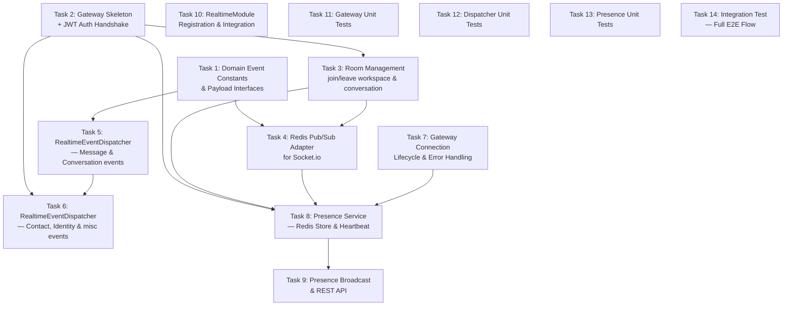

# Epic 1.7: Realtime Engine & Presence — Task Breakdown

Phân tích và break down 5 Features của Epic 1.7 thành **14 tasks** cho AI coding agent, dựa trên kiến trúc hiện tại và hành vi tham khảo từ Chatwoot.

---

## Tổng quan kiến trúc & Phân tích Chatwoot

### Cách Chatwoot triển khai Realtime

```text
Chatwoot Rails Architecture:
┌──────────────────────────────────────────────────┐
│  Business Logic (Services, Callbacks, Controllers)│
│   └── Rails.configuration.dispatcher.dispatch()   │
│        ├── SyncDispatcher                         │
│        │   ├── ActionCableListener (WebSocket)    │
│        │   └── AgentBotListener                   │
│        └── AsyncDispatcher (via ActiveJob)        │
│            ├── WebhookListener                    │
│            ├── AutomationRuleListener             │
│            ├── NotificationListener               │
│            └── ReportingEventListener             │
└──────────────────────────────────────────────────┘
```

**Key patterns từ Chatwoot cần translate:**

| Chatwoot (Rails) | Sales Copilot (NestJS) | Notes |
|:---|:---|:---|
| `Dispatcher.dispatch(event_name, timestamp, data)` | `EventEmitter2.emit(event_name, payload)` | Đã có sẵn trong codebase |
| `ActionCableListener` — sync broadcast | `RealtimeEventDispatcher` + `@OnEvent()` | Listener dùng NestJS decorator |
| `user.pubsub_token` — per-user channel | `user_{userId}` room | Socket.io rooms thay vì channels |
| `account_${id}` token — per-account broadcast | `workspace_{workspaceId}` room | Multi-tenant scoping |
| `ActionCableBroadcastJob` — async broadcast | `server.to(room).emit()` — sync broadcast | Socket.io tự handle, không cần queue |
| Chatwoot KHÔNG có presence tracking phức tạp | Redis-based presence (F-1.7.4) | Feature mới, không có reference Chatwoot |

---

## Thứ tự triển khai (Dependency Graph)



---

## Design Decisions (Aligned)

> [!IMPORTANT]
> Các quyết định sau đã được align qua interactive review:

1. **Dual Gateway**: `/widget` (visitor, widget_token — đã có) + `/realtime` (agent dashboard, JWT) — riêng biệt, không chồng chéo
2. **Event Types**: Tạo trong `packages/shared-contracts/src/realtime/` — cả backend và frontend dùng
3. **Presence**: Redis HSET per workspace + TTL-based per-user keys — heartbeat renew TTL, hết TTL = OFFLINE
4. **Dispatcher Pattern**: Một `RealtimeEventDispatcher` service dùng `@OnEvent()` — mỗi event type một method riêng
5. **Redis Adapter**: Triển khai cùng lúc với Gateway — dùng `@socket.io/redis-adapter`, Redis client riêng
6. **Auth**: Gateway tự validate JWT trong `handleConnection()` bằng `TokenService.verifyAccessToken()`, query workspace memberships, gắn vào `socket.data`
7. **Multi-workspace**: Client gửi `join_workspace` event kèm `workspaceId` → server validate membership → join room. Cho phép join nhiều workspace cùng lúc
8. **Conversation Room**: `conversation_{conversationId}` — join khi mở, leave khi đóng tab. Server validate workspace ownership

---

## Task Breakdown

---

### Task 1: Domain Event Constants & Typed Payload Interfaces

**Feature**: F-1.7.1 (Domain Event Bus & Typed Events)
**Complexity**: 🟢 Low
**Estimated scope**: ~2 files, ~150-200 lines

#### Objective

Chuẩn hóa tất cả domain event names và payload interfaces trong `shared-contracts` để backend và frontend đều type-safe.

#### Chatwoot Reference

Chatwoot dùng `Events::Types` module ([action_cable_listener.rb:L2](file:///d:/workspace/Sales%20Copilot/.docs/references/chatwoot/source/app/listeners/action_cable_listener.rb#L2)) với constants `MESSAGE_CREATED`, `CONVERSATION_CREATED`, v.v. Mỗi listener method nhận `event` object chứa `event.data[:message]`, `event.data[:conversation]`.

#### Scope

##### [MODIFY] [schemas.ts](file:///d:/workspace/Sales%20Copilot/packages/shared-contracts/src/realtime/schemas.ts)

Mở rộng `WsServerEvent` enum thêm các events mới:

```typescript
export enum WsServerEvent {
  // --- Existing ---
  CONVERSATION_CREATED = 'conversation.created',
  CONVERSATION_UPDATED = 'conversation.updated',
  CONVERSATION_STATUS_CHANGED = 'conversation.status_updated',
  CONVERSATION_ASSIGNED = 'conversation.assigned',
  MESSAGE_CREATED = 'message.created',
  MESSAGE_UPDATED = 'message.updated',
  PRESENCE_UPDATE = 'presence.updated',
  TYPING_START = 'typing.start',
  TYPING_STOP = 'typing.stop',
  // --- New ---
  MESSAGE_DELETED = 'message.deleted',
  MESSAGE_DELIVERY_STATUS_UPDATED = 'message.delivery_status_updated',
  CONVERSATION_LABELS_UPDATED = 'conversation.labels_updated',
  CONVERSATION_PRIORITY_UPDATED = 'conversation.priority_updated',
  CONVERSATION_REOPENED = 'conversation.reopened',
  CONTACT_CREATED = 'contact.created',
  CONTACT_UPDATED = 'contact.updated',
  CONTACT_DELETED = 'contact.deleted',
  CONTACT_MERGED = 'contact.merged',
  CHANNEL_IDENTITY_CREATED = 'channel_identity.created',
  CHANNEL_IDENTITY_DELETED = 'channel_identity.deleted',
}
```

##### [NEW] [event-payloads.ts](file:///d:/workspace/Sales%20Copilot/packages/shared-contracts/src/realtime/event-payloads.ts)

Tạo typed payload interfaces cho **mỗi domain event** (dựa trên [websocket-contract.md](file:///d:/workspace/Sales%20Copilot/.docs/api/websocket-contract.md)):

```typescript
// Domain event enum (internal, used by @OnEvent())
export enum DomainEvent {
  MESSAGE_CREATED = 'message.created',
  MESSAGE_UPDATED = 'message.updated',
  MESSAGE_DELETED = 'message.deleted',
  MESSAGE_DELIVERY_STATUS_UPDATED = 'message.delivery_status_updated',
  CONVERSATION_CREATED = 'conversation.created',
  CONVERSATION_STATUS_UPDATED = 'conversation.status_updated',
  CONVERSATION_REOPENED = 'conversation.reopened',
  CONVERSATION_ASSIGNED = 'conversation.assigned',
  CONVERSATION_PRIORITY_UPDATED = 'conversation.priority_updated',
  CONVERSATION_LABELS_UPDATED = 'conversation.labels_updated',
  CONTACT_CREATED = 'contact.created',
  CONTACT_UPDATED = 'contact.updated',
  CONTACT_DELETED = 'contact.deleted',
  CONTACT_MERGED = 'contact.merged',
  CHANNEL_IDENTITY_CREATED = 'channel_identity.created',
  CHANNEL_IDENTITY_DELETED = 'channel_identity.deleted',
  PRESENCE_UPDATED = 'presence.updated',
}

// Base event payload — all domain events include workspaceId
export interface BaseDomainEventPayload {
  workspaceId: string;
}

// Message events
export interface MessageCreatedEvent extends BaseDomainEventPayload {
  message: { id: string; conversationId: string; /* ... fields from contract */ };
}

// Conversation events
export interface ConversationCreatedEvent extends BaseDomainEventPayload {
  conversation: { id: string; /* ... */ };
}

export interface ConversationAssignedEvent extends BaseDomainEventPayload {
  conversationId: string;
  assigneeId: string | null;
  previousAssigneeId: string | null;
  teamId: string | null;
}

// Contact events (reference websocket-contract.md sections 3.4-3.7)
// Channel identity events (reference websocket-contract.md sections 3.8-3.9)
// Presence events
```

> [!NOTE]
> Payload interface fields phải match 1:1 với `websocket-contract.md`. Tham khảo cách Chatwoot `push_event_data` serialize model data cho broadcast.

##### [MODIFY] [index.ts](file:///d:/workspace/Sales%20Copilot/packages/shared-contracts/src/realtime/index.ts)

Export thêm `event-payloads.ts`.

#### Acceptance Criteria

- [x] `DomainEvent` enum chứa tất cả event names đang emit trong codebase
- [x] Mỗi event name có typed payload interface
- [x] Payload interfaces match `websocket-contract.md`
- [x] Exports từ `@sales-copilot/shared-contracts`
- [x] Không break existing imports

#### Dependencies

- Không có dependency — task độc lập đầu tiên

---

### Task 2: WebSocket Gateway Skeleton + JWT Authentication Handshake

**Feature**: F-1.7.2 (WebSocket Gateway & Room Architecture)
**Complexity**: 🟡 Medium
**Estimated scope**: ~3 files, ~200-250 lines

#### Objective

Tạo `RealtimeGateway` trên namespace `/realtime` với JWT authentication trong handshake. Client connect → verify JWT → lưu user context vào `socket.data` → emit `connected` event.

#### Chatwoot Reference

Chatwoot dùng ActionCable với `pubsub_token` per-user. Mỗi user connect bằng token riêng, server tự map token → user → account. Khác biệt: chúng ta dùng JWT (đã có `TokenService`) và room-based routing thay vì per-user channels.

#### Scope

##### [NEW] [realtime.gateway.ts](file:///d:/workspace/Sales%20Copilot/apps/server/src/modules/realtime/realtime.gateway.ts)

```typescript
@Injectable()
@WebSocketGateway({
  namespace: '/realtime',
  cors: { origin: '*', credentials: true },
})
export class RealtimeGateway implements OnGatewayInit, OnGatewayConnection, OnGatewayDisconnect {
  @WebSocketServer() server!: Server;

  constructor(
    private readonly tokenService: TokenService,
    private readonly prisma: PrismaService,
  ) {}

  afterInit(server: Server) {
    // Log initialization
  }

  async handleConnection(client: Socket) {
    // 1. Extract JWT from handshake: client.handshake.auth.token
    // 2. Verify via TokenService.verifyAccessToken()
    // 3. If invalid/expired → emit error + disconnect
    // 4. Store user context in socket.data:
    //    { userId, email, role, connectedAt }
    // 5. Auto-join user personal room: user_{userId}
    // 6. Emit 'connected' acknowledgement
  }

  handleDisconnect(client: Socket) {
    // Cleanup, log
  }
}
```

**Key details:**
- Socket data interface: `RealtimeSocketData { userId: string; email: string; role: PlatformRole; workspaceIds: string[]; connectedAt: Date }`
- Namespace: `/realtime` (khác với `/widget` đã có)
- JWT từ `auth: { token }` trong handshake options

##### [NEW] [realtime.types.ts](file:///d:/workspace/Sales%20Copilot/apps/server/src/modules/realtime/realtime.types.ts)

Interfaces cho socket data, room names, etc.

##### [NEW] [realtime.module.ts](file:///d:/workspace/Sales%20Copilot/apps/server/src/modules/realtime/realtime.module.ts)

Module registration — import AuthModule (TokenService), DatabaseModule.

#### Acceptance Criteria

- [x] Gateway listens on `/realtime` namespace
- [x] Valid JWT → connection accepted, `socket.data` populated
- [x] Invalid/expired JWT → `error` event emitted, client disconnected
- [x] Auto-join `user_{userId}` room on connect
- [x] Disconnect cleanup: log, leave rooms

#### Dependencies

- Depends on [TokenService](file:///d:/workspace/Sales%20Copilot/apps/server/src/modules/auth/token.service.ts) (EPIC-1.1 — already implemented)

---

### Task 3: Room Management — Join/Leave Workspace & Conversation

**Feature**: F-1.7.2 (WebSocket Gateway & Room Architecture)
**Complexity**: 🟡 Medium
**Estimated scope**: ~1 file modified, ~150 lines

#### Objective

Implement `@SubscribeMessage` handlers cho `join_workspace`, `leave_workspace`, `join_conversation`, `leave_conversation` với membership validation.

#### Chatwoot Reference

Chatwoot `ActionCableListener` dùng `user_tokens(account, conversation.inbox.members)` ([action_cable_listener.rb:L202-L205](file:///d:/workspace/Sales%20Copilot/.docs/references/chatwoot/source/app/listeners/action_cable_listener.rb#L202-L205)) — collect tokens của agents thuộc inbox + account admins. Pattern của chúng ta: thay vì collect tokens rồi broadcast, dùng rooms để server push trực tiếp.

#### Scope

##### [MODIFY] [realtime.gateway.ts](file:///d:/workspace/Sales%20Copilot/apps/server/src/modules/realtime/realtime.gateway.ts)

Thêm các message handlers:

```typescript
@SubscribeMessage('join_workspace')
async handleJoinWorkspace(client: Socket, payload: { workspaceId: string }) {
  const socketData = client.data as RealtimeSocketData;
  // 1. Validate user is member of workspace (query WorkspaceMember)
  // 2. If not member → emit error, return
  // 3. client.join(`workspace_${workspaceId}`)
  // 4. Track joined workspace in socketData.workspaceIds
  // 5. Return { success: true, room: `workspace_${workspaceId}` }
}

@SubscribeMessage('leave_workspace')
handleLeaveWorkspace(client: Socket, payload: { workspaceId: string }) {
  // client.leave(`workspace_${workspaceId}`)
  // Remove from socketData.workspaceIds
}

@SubscribeMessage('join_conversation')
async handleJoinConversation(client: Socket, payload: { conversationId: string }) {
  const socketData = client.data as RealtimeSocketData;
  // 1. Find conversation by ID
  // 2. Validate conversation.workspaceId is in socketData.workspaceIds
  // 3. client.join(`conversation_${conversationId}`)
  // 4. Return { success: true }
}

@SubscribeMessage('leave_conversation')
handleLeaveConversation(client: Socket, payload: { conversationId: string }) {
  // client.leave(`conversation_${conversationId}`)
}
```

**Tenant isolation critical path:**
- `join_workspace`: MUST query `WorkspaceMember.findFirst({ where: { userId, workspaceId } })`
- `join_conversation`: MUST verify conversation belongs to a workspace the user has joined

#### Acceptance Criteria

- [x] `join_workspace` chỉ thành công nếu user là member
- [x] `join_conversation` chỉ thành công nếu conversation thuộc workspace đã join
- [x] `leave_workspace` tự động leave tất cả conversation rooms thuộc workspace đó
- [x] Error responses cho invalid requests
- [x] Room names đúng format: `workspace_{id}`, `conversation_{id}`, `user_{id}`

#### Dependencies

- Task 2 (Gateway skeleton)

---

### Task 4: Redis Pub/Sub Adapter for Socket.io

**Feature**: F-1.7.3 (Redis Pub/Sub Adapter)
**Complexity**: 🟢 Low
**Estimated scope**: ~2 files, ~50-80 lines

#### Objective

Cấu hình `@socket.io/redis-adapter` để Socket.io broadcasts hoạt động across multiple NestJS server instances.

#### Chatwoot Reference

Chatwoot dùng `ActionCableBroadcastJob` → ActiveJob → Redis Pub/Sub ([action_cable_listener.rb:L230](file:///d:/workspace/Sales%20Copilot/.docs/references/chatwoot/source/app/listeners/action_cable_listener.rb#L230)). Socket.io Redis Adapter là giải pháp tương đương nhưng transparent — không cần explicit job.

#### Scope

##### [MODIFY] [realtime.gateway.ts](file:///d:/workspace/Sales%20Copilot/apps/server/src/modules/realtime/realtime.gateway.ts)

Trong `afterInit()`, configure Redis adapter:

```typescript
import { createAdapter } from '@socket.io/redis-adapter';
import { createClient } from 'redis';

afterInit(server: Server) {
  // 1. Read REDIS_URL from ConfigService
  // 2. Create pub/sub Redis clients (separate from main RedisService)
  // 3. server.adapter(createAdapter(pubClient, subClient))
  // 4. Handle Redis connection errors gracefully (fallback to single-server)
}
```

##### Package installation

```bash
pnpm add @socket.io/redis-adapter redis
```

> [!WARNING]
> `@socket.io/redis-adapter` cần **2 Redis connections riêng** (pub + sub), khác với `RedisService` hiện tại (ioredis, single connection). Dùng `redis` package (node-redis) theo đúng docs của socket.io.

#### Acceptance Criteria

- [x] Redis adapter connected successfully khi REDIS_URL available
- [x] Graceful fallback nếu Redis connection fails (single-server mode)
- [x] Messages broadcast từ server A được nhận bởi clients on server B
- [x] Log message khi adapter connected/disconnected

#### Dependencies

- Task 2 (Gateway skeleton) — cần `afterInit()` hook
- [RedisService](file:///d:/workspace/Sales%20Copilot/apps/server/src/infrastructure/redis/redis.service.ts) — tham khảo config pattern, nhưng tạo client riêng

---

### Task 5: RealtimeEventDispatcher — Message & Conversation Events

**Feature**: F-1.7.5 (Realtime Event Dispatcher)
**Complexity**: 🟡 Medium
**Estimated scope**: ~1 file, ~200-250 lines

#### Objective

Tạo `RealtimeEventDispatcher` service — listen domain events từ `EventEmitter2` → broadcast typed payloads tới đúng Socket.io rooms.

#### Chatwoot Reference

Chatwoot `ActionCableListener` xử lý mỗi event type trong method riêng ([action_cable_listener.rb:L41-L183](file:///d:/workspace/Sales%20Copilot/.docs/references/chatwoot/source/app/listeners/action_cable_listener.rb#L41-L183)):

```ruby
# Chatwoot pattern per event:
def message_created(event)
  message, account = extract_message_and_account(event)
  conversation = message.conversation
  tokens = user_tokens(account, conversation.inbox.members)
  broadcast(account, tokens, MESSAGE_CREATED, message.push_event_data)
end
```

**Translate sang NestJS:**
- `extract_*` → payload đã có đủ data từ service emit
- `user_tokens(account, inbox.members)` → `server.to(room).emit()`
- `broadcast()` → emit tới rooms, không cần collect tokens

#### Scope

##### [NEW] [realtime-event.dispatcher.ts](file:///d:/workspace/Sales%20Copilot/apps/server/src/modules/realtime/realtime-event.dispatcher.ts)

```typescript
@Injectable()
export class RealtimeEventDispatcher {
  private readonly logger = new Logger(RealtimeEventDispatcher.name);

  constructor(
    @Inject(forwardRef(() => RealtimeGateway))
    private readonly gateway: RealtimeGateway,
  ) {}

  // --- Message Events ---

  @OnEvent(DomainEvent.MESSAGE_CREATED)
  handleMessageCreated(payload: MessageCreatedEvent) {
    const { workspaceId, message } = payload;
    const wsPayload = { event: WsServerEvent.MESSAGE_CREATED, data: message };
    // Broadcast to conversation room + workspace room
    this.broadcastSafe(`conversation_${message.conversationId}`, wsPayload);
    this.broadcastSafe(`workspace_${workspaceId}`, wsPayload);
  }

  @OnEvent(DomainEvent.MESSAGE_UPDATED)
  handleMessageUpdated(payload: MessageUpdatedEvent) {
    // Similar: conversation + workspace rooms
  }

  // --- Conversation Events ---

  @OnEvent(DomainEvent.CONVERSATION_CREATED)
  handleConversationCreated(payload: ConversationCreatedEvent) {
    // Broadcast to workspace room only
    this.broadcastSafe(`workspace_${payload.workspaceId}`, ...);
  }

  @OnEvent(DomainEvent.CONVERSATION_STATUS_UPDATED)
  handleConversationStatusUpdated(payload: ConversationStatusUpdatedEvent) {
    // Broadcast to conversation + workspace rooms
  }

  @OnEvent(DomainEvent.CONVERSATION_ASSIGNED)
  handleConversationAssigned(payload: ConversationAssignedEvent) {
    // Broadcast to workspace room
    // + user_{assigneeId} room (direct notification)
    // + user_{previousAssigneeId} room (if changed)
  }

  // --- Error Isolation ---
  private broadcastSafe(room: string, payload: unknown) {
    try {
      this.gateway.server?.to(room).emit('event', payload);
    } catch (err) {
      this.logger.error(`Failed to broadcast to room ${room}`, err);
      // NEVER crash event pipeline
    }
  }
}
```

**Event-to-Room routing (Phase 1 — đã align):**

| Domain Event | Target Rooms |
|:---|:---|
| `message.created` | `conversation_{id}` + `workspace_{id}` |
| `message.updated` | `conversation_{id}` + `workspace_{id}` |
| `conversation.created` | `workspace_{id}` |
| `conversation.status_updated` | `conversation_{id}` + `workspace_{id}` |
| `conversation.assigned` | `user_{assigneeId}` + `user_{prevAssigneeId}` + `workspace_{id}` |

#### Acceptance Criteria

- [x] Mỗi domain event type có `@OnEvent()` method riêng
- [x] Events broadcast đúng rooms theo routing map
- [x] Assignment events notify cả old và new assignee
- [x] WebSocket payload format: `{ event: WsServerEvent, data: {...} }`
- [x] Failed broadcasts KHÔNG crash event processing pipeline (try/catch isolation)

#### Dependencies

- Task 1 (Typed event definitions)
- Task 2 (Gateway — cần `server` instance để broadcast)

---

### Task 6: RealtimeEventDispatcher — Contact, Identity & Misc Events

**Feature**: F-1.7.5 (Realtime Event Dispatcher) — phần còn lại
**Complexity**: 🟢 Low
**Estimated scope**: ~1 file modified, ~100-120 lines thêm

#### Objective

Bổ sung event handlers cho contact/channel_identity events vào `RealtimeEventDispatcher`.

#### Chatwoot Reference

Chatwoot broadcast contact events tới `account_token(account)` ([action_cable_listener.rb:L155-L176](file:///d:/workspace/Sales%20Copilot/.docs/references/chatwoot/source/app/listeners/action_cable_listener.rb#L155-L176)) — tương đương broadcast tới `workspace_{id}` room. Contact delete cần handle đặc biệt vì entity đã bị xóa.

#### Scope

##### [MODIFY] [realtime-event.dispatcher.ts](file:///d:/workspace/Sales%20Copilot/apps/server/src/modules/realtime/realtime-event.dispatcher.ts)

Thêm handlers:

```typescript
// --- Contact Events ---

@OnEvent(DomainEvent.CONTACT_CREATED)
handleContactCreated(payload: ContactCreatedEvent) {
  this.broadcastSafe(`workspace_${payload.workspaceId}`, {
    event: WsServerEvent.CONTACT_CREATED,
    data: payload.contact,
  });
}

@OnEvent(DomainEvent.CONTACT_UPDATED)
handleContactUpdated(payload: ContactUpdatedEvent) { /* workspace room */ }

@OnEvent(DomainEvent.CONTACT_DELETED)
handleContactDeleted(payload: ContactDeletedEvent) { /* workspace room */ }

@OnEvent(DomainEvent.CONTACT_MERGED)
handleContactMerged(payload: ContactMergedEvent) { /* workspace room */ }

// --- Channel Identity Events ---

@OnEvent(DomainEvent.CHANNEL_IDENTITY_CREATED)
handleChannelIdentityCreated(payload: ChannelIdentityCreatedEvent) { /* workspace room */ }

@OnEvent(DomainEvent.CHANNEL_IDENTITY_DELETED)
handleChannelIdentityDeleted(payload: ChannelIdentityDeletedEvent) { /* workspace room */ }
```

**Event-to-Room routing (Contact & Identity):**

| Domain Event | Target Rooms |
|:---|:---|
| `contact.created` | `workspace_{id}` |
| `contact.updated` | `workspace_{id}` |
| `contact.deleted` | `workspace_{id}` |
| `contact.merged` | `workspace_{id}` |
| `channel_identity.created` | `workspace_{id}` |
| `channel_identity.deleted` | `workspace_{id}` |

#### Acceptance Criteria

- [x] Tất cả contact events broadcast tới workspace room
- [x] Tất cả channel_identity events broadcast tới workspace room
- [x] Payload format match `websocket-contract.md` (sections 3.4-3.9)

#### Dependencies

- Task 5 (Dispatcher — message & conversation phần đầu)
- Task 1 (Typed event payloads)

---

### Task 7: Gateway Connection Lifecycle & Error Handling

**Feature**: F-1.7.2 (WebSocket Gateway & Room Architecture)
**Complexity**: 🟢 Low
**Estimated scope**: ~1 file modified, ~60-80 lines

#### Objective

Bổ sung connection lifecycle handling: reconnect, disconnect cleanup (leave all rooms, update presence), và robust error handling.

#### Scope

##### [MODIFY] [realtime.gateway.ts](file:///d:/workspace/Sales%20Copilot/apps/server/src/modules/realtime/realtime.gateway.ts)

```typescript
handleDisconnect(client: Socket) {
  const data = client.data as RealtimeSocketData;
  if (!data?.userId) return;

  // 1. Leave all rooms (Socket.io does this automatically on disconnect)
  // 2. Emit presence offline event (delegate to PresenceService — Task 8)
  // 3. Log disconnect with metadata
  this.logger.log(`Agent disconnected: userId=${data.userId}`);
}
```

Thêm global error handling trong `afterInit()`:

```typescript
afterInit(server: Server) {
  // Socket.io middleware for request logging
  server.use((socket, next) => {
    // Log connection attempt
    next();
  });

  // Handle server-level errors
  server.engine.on('connection_error', (err) => {
    this.logger.error(`Socket.io connection error: ${err.message}`);
  });
}
```

#### Acceptance Criteria

- [x] Disconnect cleanup: log user info, trigger presence update
- [x] Connection errors logged with context
- [x] No unhandled promise rejections from socket operations

#### Dependencies

- Task 2 (Gateway skeleton)

---

### Task 8: Agent Presence Service — Redis Store & Heartbeat

**Feature**: F-1.7.4 (Agent Online Presence Tracking)
**Complexity**: 🟡 Medium
**Estimated scope**: ~2 files, ~250-300 lines

#### Objective

Redis-based presence tracking: ONLINE/OFFLINE/AWAY statuses, heartbeat mechanism (client gửi mỗi 30s), idle detection (AWAY sau 5 phút).

#### Chatwoot Reference

Chatwoot KHÔNG có complex presence system — presence chủ yếu dựa trên ActionCable connection state. Feature này là **mới hoàn toàn**, tham khảo pattern từ Discord/Slack presence systems.

#### Scope

##### [NEW] [presence.service.ts](file:///d:/workspace/Sales%20Copilot/apps/server/src/modules/realtime/presence.service.ts)

```typescript
export enum PresenceStatus {
  ONLINE = 'ONLINE',
  OFFLINE = 'OFFLINE',
  AWAY = 'AWAY',
}

export interface PresenceEntry {
  userId: string;
  status: PresenceStatus;
  lastSeenAt: string; // ISO timestamp
}

@Injectable()
export class PresenceService {
  private readonly PRESENCE_HASH_KEY = 'presence:workspace'; // presence:workspace:{wsId}
  private readonly PRESENCE_USER_KEY = 'presence:user';       // presence:user:{userId}:{wsId}
  private readonly HEARTBEAT_TTL = 90;     // seconds (miss 2 × 30s heartbeats = stale)
  private readonly AWAY_TIMEOUT = 5 * 60;  // 5 minutes

  constructor(private readonly redis: RedisService) {}

  /**
   * Mark user ONLINE in a workspace. Set TTL on user presence key.
   */
  async setOnline(workspaceId: string, userId: string): Promise<void> {
    const entry: PresenceEntry = {
      userId,
      status: PresenceStatus.ONLINE,
      lastSeenAt: new Date().toISOString(),
    };
    // HSET presence:workspace:{wsId} {userId} → JSON entry
    await this.redis.hset(
      `${this.PRESENCE_HASH_KEY}:${workspaceId}`,
      userId,
      JSON.stringify(entry),
    );
    // SET presence:user:{userId}:{wsId} → "ONLINE" with TTL
    await this.redis.setex(
      `${this.PRESENCE_USER_KEY}:${userId}:${workspaceId}`,
      this.HEARTBEAT_TTL,
      PresenceStatus.ONLINE,
    );
  }

  /**
   * Mark user OFFLINE in a workspace.
   */
  async setOffline(workspaceId: string, userId: string): Promise<void> {
    // Update HSET entry → status OFFLINE
    // DEL presence:user:{userId}:{wsId}
  }

  /**
   * Heartbeat: renew TTL, update lastSeenAt.
   */
  async heartbeat(workspaceId: string, userId: string): Promise<void> {
    // Renew TTL on presence:user:{userId}:{wsId}
    // Update lastSeenAt in HSET
  }

  /**
   * Get all online/away agents in a workspace.
   */
  async getWorkspacePresence(workspaceId: string): Promise<PresenceEntry[]> {
    // HGETALL presence:workspace:{wsId}
    // Parse JSON entries, filter by status !== OFFLINE
  }

  /**
   * Scheduled cleanup: check stale entries, mark AWAY/OFFLINE.
   * Runs via @Cron() every 60 seconds.
   */
  @Cron(CronExpression.EVERY_MINUTE)
  async cleanupStalePresence(): Promise<void> {
    // 1. Scan all presence:workspace:* hashes
    // 2. For each entry:
    //    - If presence:user:{userId}:{wsId} TTL expired → mark OFFLINE
    //    - If lastSeenAt > 5 minutes ago but TTL not expired → mark AWAY
    // 3. Emit 'presence.updated' event for status changes
  }
}
```

**Redis data structure:**

```text
presence:workspace:{wsId}           → HASH { userId1: JSON, userId2: JSON, ... }
presence:user:{userId}:{wsId}       → STRING "ONLINE" | "AWAY"  (TTL = 90s)
```

##### [MODIFY] [realtime.gateway.ts](file:///d:/workspace/Sales%20Copilot/apps/server/src/modules/realtime/realtime.gateway.ts)

Thêm heartbeat handler:

```typescript
@SubscribeMessage('heartbeat')
async handleHeartbeat(client: Socket) {
  const data = client.data as RealtimeSocketData;
  for (const wsId of data.workspaceIds) {
    await this.presenceService.heartbeat(wsId, data.userId);
  }
  return { success: true };
}
```

#### Acceptance Criteria

- [x] Agent connect → `setOnline()` → status ONLINE
- [x] Agent disconnect → `setOffline()` → status OFFLINE
- [x] Client gửi heartbeat mỗi 30s → server renew TTL
- [x] Miss 2 heartbeats (90s) → scheduled cleanup marks OFFLINE
- [x] Idle > 5 minutes → status AWAY
- [x] Presence data scoped by workspace (tenant isolation)
- [x] Redis TTL auto-cleanup stale entries

#### Dependencies

- Task 2 (Gateway — heartbeat message handler)
- [RedisService](file:///d:/workspace/Sales%20Copilot/apps/server/src/infrastructure/redis/redis.service.ts) (đã có)

---

### Task 9: Presence Broadcast & REST API Endpoint

**Feature**: F-1.7.4 (Agent Online Presence Tracking)
**Complexity**: 🟢 Low
**Estimated scope**: ~2 files, ~80-120 lines

#### Objective

Broadcast `presence.updated` events qua WebSocket khi status thay đổi, và expose REST API `GET /api/v1/workspaces/:workspaceId/presence` cho initial load.

#### Scope

##### [MODIFY] [realtime-event.dispatcher.ts](file:///d:/workspace/Sales%20Copilot/apps/server/src/modules/realtime/realtime-event.dispatcher.ts)

Thêm presence event handler:

```typescript
@OnEvent(DomainEvent.PRESENCE_UPDATED)
handlePresenceUpdated(payload: PresenceUpdatedEvent) {
  this.broadcastSafe(`workspace_${payload.workspaceId}`, {
    event: WsServerEvent.PRESENCE_UPDATE,
    data: {
      userId: payload.userId,
      status: payload.status,
      lastSeenAt: payload.lastSeenAt,
    },
  });
}
```

##### [NEW] [presence.controller.ts](file:///d:/workspace/Sales%20Copilot/apps/server/src/modules/realtime/presence.controller.ts)

```typescript
@Controller('workspaces/:workspaceId/presence')
@UseGuards(JwtAuthGuard, WorkspaceGuard)
export class PresenceController {
  constructor(private readonly presenceService: PresenceService) {}

  @Get()
  async getPresence(
    @Param('workspaceId') workspaceId: string,
  ): Promise<PresenceEntry[]> {
    return this.presenceService.getWorkspacePresence(workspaceId);
  }
}
```

#### Acceptance Criteria

- [x] `presence.updated` event broadcast tới `workspace_{id}` room khi status thay đổi
- [x] `GET /api/v1/workspaces/:workspaceId/presence` trả về danh sách agents online/away
- [x] REST endpoint protected by JwtAuthGuard + WorkspaceGuard
- [x] Response format: `{ success: true, data: [{ userId, status, lastSeenAt }] }`

#### Dependencies

- Task 8 (Presence service)
- Task 5 (Dispatcher — broadcastSafe method)

---

### Task 10: RealtimeModule Registration & App Integration

**Feature**: Cross-cutting
**Complexity**: 🟢 Low
**Estimated scope**: ~2 files modified, ~30-50 lines

#### Objective

Wire up tất cả realtime components vào NestJS dependency injection: `RealtimeModule` chứa Gateway, Dispatcher, PresenceService, PresenceController. Register trong `AppModule`.

#### Scope

##### [MODIFY] [realtime.module.ts](file:///d:/workspace/Sales%20Copilot/apps/server/src/modules/realtime/realtime.module.ts)

```typescript
@Module({
  imports: [
    AuthModule,        // TokenService for JWT validation
    DatabaseModule,    // PrismaService for membership queries
    RedisModule,       // RedisService for presence
  ],
  providers: [
    RealtimeGateway,
    RealtimeEventDispatcher,
    PresenceService,
  ],
  controllers: [
    PresenceController,
  ],
  exports: [
    RealtimeGateway,   // Allow other modules to access server for broadcasting
    PresenceService,   // Allow other modules to query presence
  ],
})
export class RealtimeModule {}
```

##### [MODIFY] [app.module.ts](file:///d:/workspace/Sales%20Copilot/apps/server/src/app.module.ts)

Thêm `RealtimeModule` vào imports.

##### [MODIFY] [index.ts](file:///d:/workspace/Sales%20Copilot/apps/server/src/modules/realtime/index.ts)

Barrel exports.

#### Acceptance Criteria

- [x] App compiles và starts successfully với RealtimeModule
- [x] Socket.io server starts on `/realtime` namespace
- [x] Presence REST endpoint accessible
- [x] No circular dependency errors

#### Dependencies

- Tasks 2, 3, 5, 6, 7, 8, 9 — tất cả components

---

### Task 11: WebSocket Gateway Unit Tests

**Feature**: F-1.7.2 Testing
**Complexity**: 🟡 Medium
**Estimated scope**: ~1 file, ~200-300 lines

#### Objective

Unit tests cho `RealtimeGateway`: authentication, room join/leave, heartbeat.

#### Scope

##### [NEW] [\_\_tests\_\_/realtime.gateway.spec.ts](file:///d:/workspace/Sales%20Copilot/apps/server/src/modules/realtime/__tests__/realtime.gateway.spec.ts)

**Test cases:**

1. **Connection Authentication**
   - Valid JWT → connection accepted, socket.data populated
   - Invalid JWT → connection rejected, client disconnected
   - Expired JWT → connection rejected
   - Missing token → connection rejected

2. **Room Management**
   - `join_workspace` with valid membership → success, joined room
   - `join_workspace` without membership → error response
   - `join_conversation` with valid workspace → success
   - `join_conversation` without workspace access → error
   - `leave_workspace` → leaves workspace + all conversation rooms in it

3. **Heartbeat**
   - Heartbeat handler calls `presenceService.heartbeat()`
   - Returns `{ success: true }`

#### Testing pattern

Tham khảo [web-chat.gateway.spec.ts](file:///d:/workspace/Sales%20Copilot/apps/server/src/integrations/web-chat/__tests__/web-chat.gateway.spec.ts) cho Socket mock patterns hiện có.

#### Acceptance Criteria

- [x] Tất cả test cases pass
- [x] Mock TokenService, PrismaService, PresenceService
- [x] Coverage cho happy path + error paths
- [x] Không test implementation details (method calls), test behavior

#### Dependencies

- Tasks 2, 3, 7, 8 (Gateway + Room + Lifecycle + Presence)

---

### Task 12: RealtimeEventDispatcher Unit Tests

**Feature**: F-1.7.5 Testing
**Complexity**: 🟡 Medium
**Estimated scope**: ~1 file, ~250-350 lines

#### Objective

Unit tests cho `RealtimeEventDispatcher`: verify correct room routing, payload transformation, và error isolation.

#### Scope

##### [NEW] [\_\_tests\_\_/realtime-event.dispatcher.spec.ts](file:///d:/workspace/Sales%20Copilot/apps/server/src/modules/realtime/__tests__/realtime-event.dispatcher.spec.ts)

**Test cases:**

1. **Message events**
   - `message.created` → broadcast tới `conversation_{id}` AND `workspace_{id}`
   - `message.updated` → broadcast tới `conversation_{id}` AND `workspace_{id}`

2. **Conversation events**
   - `conversation.created` → broadcast tới `workspace_{id}` only
   - `conversation.status_updated` → broadcast tới `conversation_{id}` AND `workspace_{id}`
   - `conversation.assigned` → broadcast tới `workspace_{id}` + `user_{newAssignee}` + `user_{oldAssignee}`

3. **Contact events**
   - `contact.created/updated/deleted/merged` → broadcast tới `workspace_{id}` only

4. **Error isolation**
   - Gateway `server.to().emit()` throws → error logged, no exception propagated
   - Gateway `server` is null → no error thrown

5. **Presence events**
   - `presence.updated` → broadcast tới `workspace_{id}`

#### Acceptance Criteria

- [x] Tất cả event types covered
- [x] Verify room routing correctness (đúng rooms)
- [x] Verify payload format matches WebSocket contract
- [x] Error isolation: failed broadcast does NOT crash

#### Dependencies

- Tasks 5, 6 (Dispatcher implementations)

---

### Task 13: Presence Service Unit Tests

**Feature**: F-1.7.4 Testing
**Complexity**: 🟡 Medium
**Estimated scope**: ~1 file, ~200-250 lines

#### Objective

Unit tests cho `PresenceService`: online/offline/away lifecycle, heartbeat, cleanup, tenant isolation.

#### Scope

##### [NEW] [\_\_tests\_\_/presence.service.spec.ts](file:///d:/workspace/Sales%20Copilot/apps/server/src/modules/realtime/__tests__/presence.service.spec.ts)

**Test cases:**

1. **Online/Offline lifecycle**
   - `setOnline()` → Redis HSET + SETEX with TTL
   - `setOffline()` → update HSET entry + DEL user key
   - `heartbeat()` → renew TTL

2. **Workspace presence query**
   - `getWorkspacePresence()` → returns ONLINE/AWAY entries only
   - Empty workspace → returns `[]`

3. **Cleanup cron**
   - Expired TTL entries → marked OFFLINE
   - Entries with lastSeenAt > 5 min but valid TTL → marked AWAY
   - Status change → `eventEmitter.emit('presence.updated', ...)` called

4. **Tenant isolation**
   - Presence data scoped per workspace
   - Cannot see other workspace's presence

#### Acceptance Criteria

- [x] All lifecycle states covered
- [x] Redis operations mocked correctly
- [x] Cron cleanup logic verified
- [x] Tenant isolation verified

#### Dependencies

- Task 8 (Presence service)

---

### Task 14: Integration Test — Full E2E Realtime Flow

**Feature**: Cross-cutting integration verification
**Complexity**: 🟡 Medium
**Estimated scope**: ~1 file, ~200-300 lines

#### Objective

Integration test: Domain event emitted → EventEmitter2 → RealtimeEventDispatcher → Gateway broadcasts to rooms. Verify full pipeline.

#### Scope

##### [NEW] [\_\_tests\_\_/realtime-integration.spec.ts](file:///d:/workspace/Sales%20Copilot/apps/server/src/modules/realtime/__tests__/realtime-integration.spec.ts)

**Test scenarios:**

1. **Message broadcast flow**
   - Emit `message.created` event via EventEmitter2
   - Verify `server.to('conversation_xxx').emit()` called with correct payload
   - Verify `server.to('workspace_xxx').emit()` called

2. **Conversation assignment flow**
   - Emit `conversation.assigned` event
   - Verify broadcasts to `workspace_{id}`, `user_{newAssignee}`, `user_{oldAssignee}`

3. **Presence flow**
   - Call `presenceService.setOnline()`
   - Verify `presence.updated` event emitted
   - Verify broadcast to `workspace_{id}` room

> [!NOTE]
> Integration test dùng NestJS `Test.createTestingModule()` với real `EventEmitter2` nhưng mocked `Server` (Socket.io). Mục tiêu: verify event pipeline, không cần actual WebSocket connections.

#### Acceptance Criteria

- [x] Full event pipeline verified: service emit → dispatcher listen → gateway broadcast
- [x] Payload transformation correct
- [x] Room routing correct
- [x] Error isolation works end-to-end

#### Dependencies

- Tasks 10 (Module registration) — cần full module wired up

---

## Verification Plan

### Automated Tests
```bash
# Unit tests
pnpm nx run server:test -- --testPathPattern="realtime"

# Lint
pnpm nx run server:lint

# Build
pnpm nx run server:build

# Shared contracts build
pnpm nx run shared-contracts:build
```

### Manual Verification
- Connect Socket.io client tới `/realtime` với valid JWT → verify connection
- Join workspace room → verify broadcasts received
- Trigger domain events (create message, assign conversation) → verify WebSocket events

---

## File Summary

| # | File | Action | Task |
|:--|:--|:--|:--|
| 1 | `packages/shared-contracts/src/realtime/event-payloads.ts` | NEW | Task 1 |
| 2 | `packages/shared-contracts/src/realtime/schemas.ts` | MODIFY | Task 1 |
| 3 | `packages/shared-contracts/src/realtime/index.ts` | MODIFY | Task 1 |
| 4 | `apps/server/src/modules/realtime/realtime.gateway.ts` | NEW | Tasks 2, 3, 4, 7 |
| 5 | `apps/server/src/modules/realtime/realtime.types.ts` | NEW | Task 2 |
| 6 | `apps/server/src/modules/realtime/realtime.module.ts` | NEW | Tasks 2, 10 |
| 7 | `apps/server/src/modules/realtime/realtime-event.dispatcher.ts` | NEW | Tasks 5, 6 |
| 8 | `apps/server/src/modules/realtime/presence.service.ts` | NEW | Task 8 |
| 9 | `apps/server/src/modules/realtime/presence.controller.ts` | NEW | Task 9 |
| 10 | `apps/server/src/modules/realtime/index.ts` | NEW | Task 10 |
| 11 | `apps/server/src/app.module.ts` | MODIFY | Task 10 |
| 12 | `apps/server/src/modules/realtime/__tests__/realtime.gateway.spec.ts` | NEW | Task 11 |
| 13 | `apps/server/src/modules/realtime/__tests__/realtime-event.dispatcher.spec.ts` | NEW | Task 12 |
| 14 | `apps/server/src/modules/realtime/__tests__/presence.service.spec.ts` | NEW | Task 13 |
| 15 | `apps/server/src/modules/realtime/__tests__/realtime-integration.spec.ts` | NEW | Task 14 |

**Total: 10 new files + 4 modified files = 14 files across 14 tasks**
