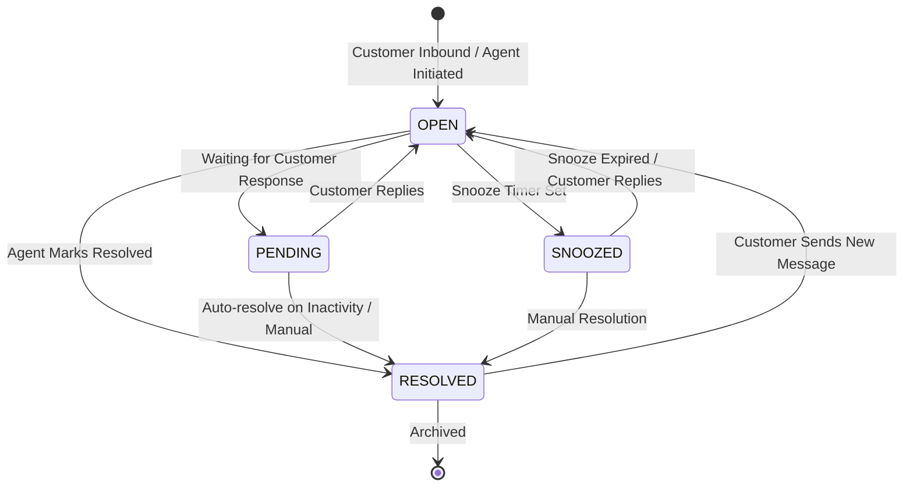

# 04. Conversation State Machine & Assignment

## 1. Conversation Lifecycle State Machine

A Conversation transitions through 4 primary lifecycle states:



### State Semantics:
1. **`OPEN`**: Active conversation requiring agent action or in active discussion.
2. **`PENDING`**: Agent has replied and is waiting for customer response.
3. **`SNOOZED`**: Temporarily hidden from active queue until `snoozedUntil` timestamp or until customer replies.
4. **`RESOLVED`**: Conversation completed. If the customer messages again, the conversation is automatically reopened to `OPEN`.

---

## 2. Conversation Priority Hierarchy

- **`URGENT`**: Critical SLA breach risk or high-priority VIP customer.
- **`HIGH`**: Time-sensitive inquiry or VIP customer.
- **`MEDIUM`**: Default priority.
- **`LOW`**: General inquiry or low-priority queue.

---

## 3. Assignment & Routing Engine

### A. Auto-Assignment Strategy (Round-Robin with Presence)
When a new conversation arrives or is unassigned in an Inbox where `Inbox.isAutoAssignmentEnabled = true`:

```text
[New Inbound Conversation]
          │
          ▼
Is Inbox.isAutoAssignmentEnabled == true?
          │
     ┌────┴────┐
    YES        NO ──► Leave unassigned (assigneeId = null)
     │
     ▼
Get Inbox Members (InboxMember where user.isActive = true)
     │
     ▼
Filter by Online/Available Presence (Redis Presence Set: `presence:workspace_{wsId}`)
     │
     ▼
Find Agent with Least Active OPEN Conversations (or Next in Round-Robin Pointer)
     │
     ▼
Assign: Conversation.assigneeId = selectedUserId
     │
     ▼
Publish Domain Event: `ConversationAssigned` ──► Notify Agent via Realtime WebSocket
```

### B. Manual Assignment & Re-assignment
- **Direct Assignment**: Agents with `AGENT`, `ADMIN`, or `OWNER` role can assign a conversation to themselves or team members.
- **Team Assignment**: Conversations can be routed to a specific `Team` (`Conversation.teamId`), allowing team members to claim them.

---

## 4. Message Delivery State Machine

Messages sent by agents or system follow delivery states:

```text
[Agent clicks Send]
       │
       ▼
    PENDING   (Message written to DB, queued for channel adapter)
       │
       ├── Channel API success ──► SENT
       │                              │
       │                              ├── Provider delivery receipt ──► DELIVERED
       │                              │                                    │
       │                              │                                    ├── Customer read receipt ──► READ
       │                              │
       └── Channel API error   ──► FAILED (Eligible for retry)
```
