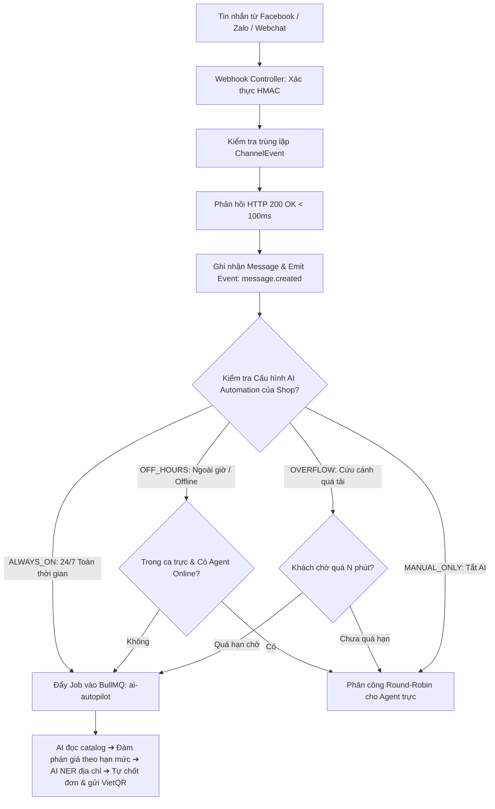
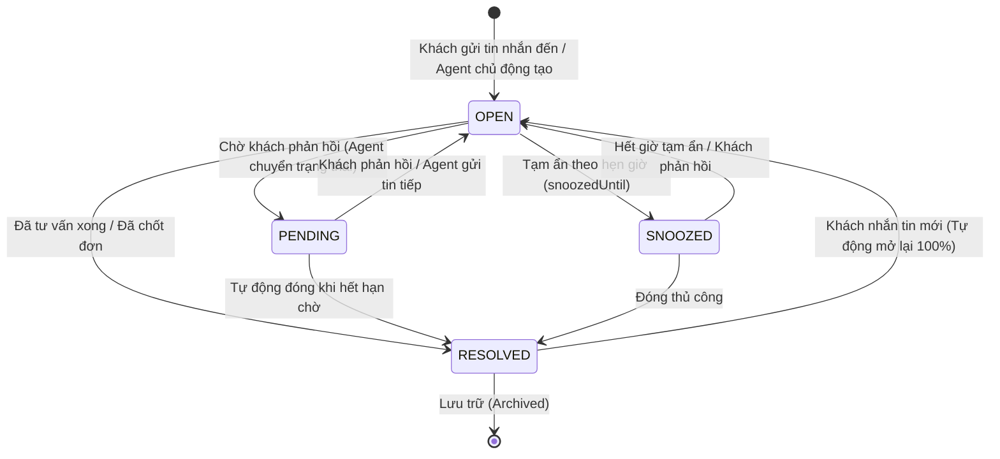

# Kiến Trúc Hệ Thống, Phân Rã Module & An Ninh (System Architecture)

> **Tài liệu**: Bản Đặc Tả Tổng Quan Kiến Trúc Nền Tảng (System Blueprint)\
****Dự án**: Sales Copilot Platform\
****Vị trí file**: `docs/architecture/01-system-architecture.md`\
****Trạng thái**: Đã phê duyệt (Approved Baseline)

---

## 1. Triết Lý Thiết Kế & Nguyên Tắc Cốt Lõi

Sales Copilot Platform được kiến trúc theo mô hình **Pragmatic Modular Monolith (Nguyên khối theo Module Thực dụng)**, hướng sự kiện (Event-Driven) và tối ưu hóa cho thương mại hội thoại D2C:

1. **Hội Thoại Là Điểm Chuyển Đổi (Conversation-First)**: Mọi tương tác bán hàng, tư vấn sản phẩm, tạo đơn hàng và thanh toán đều xoay quanh trải nghiệm chat thời gian thực.
2. **Cô Lập Đa Người Thuê Tuyệt Đối (Strict Multi-Tenancy)**: Mọi tài nguyên, truy vấn dữ liệu và phòng WebSocket bắt buộc phải kẹp mã `workspaceId`. Tuyệt đối không cho phép rò rỉ dữ liệu giữa các tenant.
3. **Thực Dụng, Chống Đẻ Mã Thừa (Anti-Overengineering / YAGNI & KISS)**:
   - Sử dụng trực tiếp NestJS Services (`*.service.ts`) với Prisma Client. Không tạo interface đơn thừa thãi (`IUserService`, `IOrderService`).
   - Sử dụng Zod pipes (`@ZodBody()`, `@ZodQuery()`) xác thực input một tầng trực tiếp, trả về Prisma model hoặc typed response object.
   - Nguyên tắc Co-location: Gom các file liên quan theo module thay vì tạo các tầng folder rườm rà.
4. **Không Gây Nghẽn (Asynchronous Non-blocking Ingestion)**: Inbound webhook từ các kênh mạng xã hội phải phản hồi HTTP 200 trong `< 100ms`. Toàn bộ tác vụ AI, xử lý đơn hàng và giao vận được đẩy vào hàng đợi BullMQ chạy nền.

---

## 2. Sơ Đồ Kiến Trúc Tổng Thể (System Topology)

```text
┌─────────────────────────────────────────────────────────────────────────────────────────────┐
│                            TẦNG GIAO DIỆN (NEXT.JS 16 APP ROUTER)                           │
│  ┌───────────────────────┬───────────────────────┬───────────────────┬───────────────────┐  │
│  │   Agent Chat Center   │ In-Chat Quick Order   │ Kho & Đơn Hàng    │ Super Admin Portal│  │
│  │ (/conversations)      │ ( in Chat)            │ (/products,/order)│ (/admin)          │  │
│  └───────────────────────┴───────────────────────┴───────────────────┴───────────────────┘  │
└──────────────────────────────────────────────┬──────────────────────────────────────────────┘
                                               │ HTTP REST / WebSocket (Socket.io)
┌──────────────────────────────────────────────▼──────────────────────────────────────────────┐
│                    TẦNG BACKEND ỨNG DỤNG: MODULAR MONOLITH (NESTJS 11)                      │
│                                                                                             │
│  [HTTP Controllers / Guards / Zod Pipes] ──► [Public Services] ──► [Prisma Database Client] │
│                                                      │                                      │
│                     ┌────────────────────────────────┴────────────────────────────────┐     │
│                     │ In-Process Events (EventEmitter2)                               │     │
│                     │ Async Background Queues (BullMQ Workers)                        │     │
│                     └────────────────────────────────┬────────────────────────────────┘     │
└──────────────────────────────────────────────────────┼──────────────────────────────────────┘
                                                       │
                               ┌───────────────────────┴───────────────────────┐
                               ▼                                               ▼
┌───────────────────────────────────────────────────────┐  ┌──────────────────────────────────┐
│             LƯU TRỮ CHÍNH: POSTGRESQL 16              │  │      BỘ NHỚ & BỘ ĐỆM: REDIS 7    │
│  • Bảng dữ liệu nghiệp vụ (Multi-tenant scoped)       │  │  • WebSocket Pub/Sub Multi-node  │
│  • ACID Transactions (Khóa tồn kho nguyên tử)         │  │  • Distributed Locks (lock:order)│
│  • Sổ cái bất biến (InventoryTransaction, AuditLog)   │  │  • 2-Tier Cache & BullMQ Queues  │
└───────────────────────────────────────────────────────┘  └──────────────────────────────────┘
```

---

## 3. Ranh Giới 7 Bounded Contexts & Cấu Trúc Module (NestJS 11)

Hệ thống backend (`apps/server/src/modules/`) được quy hoạch chặt chẽ thành **7 Bounded Contexts** chuẩn Domain-Driven Design:

| Phân hệ (Bounded Context) | Thư mục & Submodules | Module Khởi Tạo | Trách nhiệm chính | Public Services Export |
| :--- | :--- | :--- | :--- | :--- |
| **1. Identity (`identity`)** | `auth/`, `workspaces/`, `teams/`, `audit-logs/` | `IdentityModule` | Đăng nhập/JWT, quản lý Workspace, thành viên, phân quyền RBAC và ghi nhật ký kiểm toán workspace. | `AuthService`, `WorkspacesService`, `TeamsService`, `AuditLogService`, `TokenService` |
| **2. Omnichannel (`omnichannel`)** | `conversations/`, `messages/`, `contacts/`, `inboxes/`, `labels/`, `canned-responses/`, `integrations/` | `OmnichannelModule` | Kết nối Facebook, Telegram, Webchat; vòng đời hội thoại (`OPEN`, `RESOLVED`), gửi/nhận tin nhắn, phân giải danh tính khách hàng 3NF, tin nhắn mẫu `/`. | `ConversationsService`, `MessagesService`, `ContactsService`, `InboxesService`, `ChannelCredentialService`, `AutoAssignmentService`, `LabelsService`, `CannedResponsesService`, `ChannelAdapterRegistry` |
| **3. Commerce (`commerce`)** | `products/`, `orders/`, `payments/`, `shipping/`, `inventory/`, `automation/`, `presence/`, `reconciliation/`, `listeners/`, `webhooks/` | `CommerceModule` | Khung lên đơn trong chat, quản lý danh mục & biến thể SKU, khóa giữ tồn kho nguyên tử (3 trạng thái), VietQR động & gạch nợ tự động SePay/Casso, khóa chống đè sửa đơn 30s. | `ProductsService`, `OrdersService`, `VietQrService`, `ShippingService`, `CommercePresenceService`, `CommerceReconciliationProcessor`, `OrderExtractorService` |
| **4. Automation (`automation`)** | `automation-rules/`, `webhooks/` | `AutomationModule` | Động cơ quy tắc tự động hóa IF-THEN (phân loại nhãn, phân bổ) và Outbound Webhooks dispatch kèm retry cơ chế BullMQ. | `AutomationRulesService`, `AutomationExecutorService`, `WebhooksService`, `WebhookSubscriptionsService` |
| **5. Intelligence (`intelligence`)** | `llm-gateway/` | `IntelligenceModule` | Cổng LLM Gateway đa mô hình (Gemini, OpenAI), trích xuất thực thể NER địa chỉ 3 cấp hành chính Việt Nam, Circuit Breaker & Rate Limiter. | `LlmGatewayService`, `StructuredOutputService`, `CircuitBreakerService`, `RateLimiterService` |
| **6. Realtime (`realtime`)** | `realtime/` | `RealtimeModule` | WebSocket Gateway (`/realtime`), đồng bộ trạng thái hội thoại thời gian thực, Presence trực tuyến của nhân viên, Redis Pub/Sub đa node. | `RealtimeGateway`, `RealtimeEventDispatcher`, `PresenceService` |
| **7. Platform Admin (`platform-admin`)** | `workspaces/`, `settings/`, `audit-logs/`, `metrics/`, `guards/`, `decorators/` | `PlatformAdminModule` | Cổng Super Admin Portal: Quản lý tenant toàn sàn, cấu hình Feature Flags, hạn mức Quota và Platform Audit Trail. | `SystemSettingsService`, `PlatformWorkspacesService`, `PlatformAuditLogsService`, `PlatformMetricsService`, `PlatformRolesGuard` |

### ⛔ Quy Tắc Giao Tiếp Liên Module Bất Biến:

1. **Cấm đột biến trực tiếp CSDL module khác**: Module A không được tự ý query hoặc update bảng thuộc quyền sở hữu của Module B. Mọi thao tác bắt buộc phải gọi qua **Public Service** của module đó hoặc phát tán qua **Domain Event**.
2. **Giao tiếp bất đồng bộ & Event-Driven**:
   - Tác vụ cục bộ trong tiến trình: Dùng `EventEmitter2` (`@OnEvent('conversation.created')`).
   - Tác vụ nặng hoặc cần retry: Dùng **BullMQ** (AI reasoning, Webhook retry).

---

## 4. Đường Ống Tiếp Nhận & Điều Phối AI Automation



- **Chế độ 1 (**`ALWAYS_ON`**)**: AI tự động trả lời, tư vấn và chốt đơn 24/7 cả ngày lẫn đêm (dành cho shop nhỏ, solo merchant hoặc kênh vệ tinh).
- **Chế độ 2 (**`OFF_HOURS`**)**: Ban ngày người trực dùng Khung lên đơn; ngoài giờ hoặc khi Agent Offline thì AI tự động tiếp quản.
- **Chế độ 3 (**`OVERFLOW`**)**: Khi tin nhắn dồn ứ quá $N$ phút mà chưa có nhân viên nhận, AI nhảy vào tiếp quản.
- **Chế độ 4 (**`MANUAL_ONLY`**)**: 100% người vận hành.
- **Vệ sĩ Ẩn Bình Luận (Anti-theft Comment Guard)**: Quét bình luận chứa SĐT trên bài viết/livestream trong `< 1s`, ẩn bình luận và gửi tin nhắn riêng kéo khách vào Inbox.

---

## 5. Ma Trận Phân Quyền 2 Tầng (2-Tier RBAC) & Audit Trail

Hệ thống phân định quyền hạn rạch ròi thành 2 tầng:

```text
┌─────────────────────────────────────────────────────────────┐
│ TẦNG 1: QUYỀN NỀN TẢNG (PlatformRole - Cấp Hệ Thống)        │
│   • SUPER_ADMIN: Quản trị toàn sàn, cấu hình Feature Flags,  │
│                  xem mọi Workspace, tra cứu Platform Audit.  │
│   • USER: Người dùng thông thường của các doanh nghiệp.     │
└──────────────────────────────┬──────────────────────────────┘
                               │
┌──────────────────────────────▼──────────────────────────────┐
│ TẦNG 2: QUYỀN DOANH NGHIỆP (WorkspaceRole - Cấp Workspace)   │
│   • OWNER: Chủ sở hữu doanh nghiệp, quản lý thanh toán/gói. │
│   • ADMIN: Quản lý nhân sự, kênh, cấu hình kho và đơn hàng.  │
│   • AGENT: Trực chat, lên đơn, gửi VietQR cho khách.│
│   • VIEWER: Chỉ xem báo cáo, không nhắn tin, không sửa kho. │
└─────────────────────────────────────────────────────────────┘
```

| Hành động / Thao tác | SUPER_ADMIN | OWNER | ADMIN | AGENT | VIEWER |
| --- | --- | --- | --- | --- | --- |
| **Cấu hình Feature Flags & Quota sàn** | ✅ | ❌ | ❌ | ❌ | ❌ |
| **Khóa / Mở khóa Workspace** | ✅ | ❌ | ❌ | ❌ | ❌ |
| **Quản lý Thành viên Workspace & Vai trò** | ❌ | ✅ | ✅ | ❌ | ❌ |
| **Quản lý Sản phẩm, Nhập kho & Kiểm kê** | ❌ | ✅ | ✅ | ❌ | ❌ |
| **Lên đơn trong Chat & Gửi VietQR** | ❌ | ✅ | ✅ | ✅ | ❌ |
| **Hủy đơn hàng & Hoàn tồn kho** | ❌ | ✅ | ✅ | ❌ | ❌ |
| **Xem báo cáo doanh số & danh sách đơn** | ❌ | ✅ | ✅ | ✅ | ✅ |

### Cơ Chế Ghi Nhật Ký Kiểm Toán (Dual Audit Trail):

1. `PlatformAuditLog`: Ghi vết mọi can thiệp của `SUPER_ADMIN` (bật tắt module, chỉnh quota, đổi cấu hình sàn) kèm IP, user ID và payload diff.
2. `AuditLog` **(Workspace)**: Ghi vết các hành động nhạy cảm trong doanh nghiệp (thêm/xóa thành viên, điều chỉnh cân bằng kho, hủy đơn hàng).

---

## 6. Chuẩn Giao Tiếp REST API & Realtime WebSocket

### 6.1. Chuẩn REST API & Tài Liệu Tự Động (Swagger)

Toàn bộ endpoint RESTful được tự động quét và sinh tài liệu tương tác qua NestJS Swagger UI:
- **Tài liệu Swagger UI**: `http://localhost:8000/docs` (Endpoint dev/staging tự động sinh từ Decorators)
- **Base URL**: `/api/v1`
- **Xác thực**: Header `Authorization: Bearer <JWT_TOKEN>` (hoặc Cookie `auth_token` trên trình duyệt)

#### Định Dạng Phản Hồi Chuẩn (Standard Response Envelope):
1. **Phản hồi thành công (`TransformInterceptor`)**:
   ```json
   {
     "success": true,
     "data": { ... },
     "meta": { "page": 1, "limit": 20, "total": 100, "hasMore": true }
   }
   ```
2. **Phản hồi lỗi (`HttpExceptionFilter`)**:
   ```json
   {
     "success": false,
     "error": {
       "code": "VALIDATION_FAILED",
       "message": "Dữ liệu đầu vào không hợp lệ",
       "details": [{ "field": "email", "message": "Email không đúng định dạng" }]
     }
   }
   ```

---

### 6.2. Chuẩn Realtime WebSocket (Socket.io)

Hạ tầng Realtime phục vụ đồng bộ tức thì giữa hội thoại, gạch nợ thanh toán và phân bổ nhân sự:
- **Gateway Endpoint**: `/realtime` (Namespace: `/realtime`)
- **Transport**: `websocket` (Socket.io Client)
- **Xác thực**: Handshake Auth qua JWT token `{ auth: { token: 'jwt_token' } }`

#### Cấu Trúc Phân Phòng (Rooms Architecture):
| Tên Phòng (Room) | Phạm vi (Scope) | Đối tượng đăng ký lắng nghe (Subscriber) |
| :--- | :--- | :--- |
| `workspace_${workspaceId}` | Toàn bộ Workspace | Mọi Agent/Admin thuộc Workspace (nghe tin mới, gạch nợ đơn hàng) |
| `conversation_${conversationId}` | Hội thoại cụ thể | Agent đang mở cửa sổ chat đó |
| `user_${userId}` | Cá nhân Agent | Người dùng cụ thể (nhận thông báo được gán hội thoại) |

#### Bảng Danh Mục Sự Kiện Realtime (Event Catalog):
| Sự kiện (Event) | Kênh phát (Room) | Thời điểm kích hoạt (Trigger) | Dữ liệu chính (Payload) |
| :--- | :--- | :--- | :--- |
| `message.created` | `workspace_*` / `conversation_*` | Khi có tin nhắn mới (Inbound/Outbound) | `id`, `conversationId`, `senderType`, `content`, `attachments` |
| `conversation.status_updated` | `workspace_*` | Trạng thái hội thoại thay đổi | `conversationId`, `previousStatus`, `newStatus`, `updatedByUserId` |
| `conversation.assigned` | `workspace_*` / `user_*` | Gán người phụ trách (Round-Robin/thủ công) | `conversationId`, `assigneeId`, `teamId` |
| `contact.updated` | `workspace_*` | Cập nhật thông tin khách hàng / phân giải danh tính | `contactId`, `name`, `phoneNumber`, `email` |
| `order.paid` | `workspace_*` | Gạch nợ thành công sau khi khớp Webhook chuyển khoản | `orderId`, `orderCode`, `amount`, `paymentMethod`, `paidAt` |

---

## 7. Quy Tắc Nghiệp Vụ Hội Thoại & Phân Bổ (Domain Rules)

### 7.1. State Machine Vòng Đời Hội Thoại (Conversation Lifecycle)

Mỗi cuộc hội thoại (`Conversation`) vận hành qua 4 trạng thái cốt lõi:



#### Quy Tắc Chuyển Trạng Thái Cốt Lõi:
1. **Tự động mở lại 100% (`RESOLVED` ➔ `OPEN`)**: Bất cứ khi nào khách hàng gửi tin nhắn mới vào một cuộc hội thoại đã đóng, hệ thống **bắt buộc phải tự động chuyển về `OPEN`** và tăng biến đếm `unreadMessagesCount`.
2. **Khách chờ phục vụ (`OPEN` ➔ `PENDING`)**: Áp dụng khi Agent đã tư vấn xong giá/kích cỡ và đang chờ khách kiểm tra hoặc chuyển khoản.
3. **Reset Unread Messages Counter**: Khi Agent mở hội thoại hoặc gửi phản hồi thành công, `unreadMessagesCount` được gán về `0`.

---

### 7.2. Thuật Toán Phân Bổ Tự Động (Round-Robin with Redis Presence)

Khi một hội thoại mới đến hoặc chưa có người phụ trách trong Inbox bật `isAutoAssignmentEnabled = true`:

```text
[Hội thoại mới đổ về Inbox]
             │
             ▼
    Kiểm tra Inbox.isAutoAssignmentEnabled == true?
             │
        ┌────┴────┐
       CÓ        KHÔNG ──► Để trống (assigneeId = null)
        │
        ▼
    Lấy danh sách thành viên Inbox đang kích hoạt (user.isActive = true)
        │
        ▼
    Lọc danh sách theo trạng thái Online (Redis Set: presence:workspace_{wsId})
        │
        ▼
    Chọn Agent có ít hội thoại OPEN nhất (Round-Robin pointer)
        │
        ▼
    Gán: Conversation.assigneeId = selectedUserId
        │
        ▼
    Phát Domain Event ➔ Bắn WebSocket: conversation.assigned tới user_{userId}
```