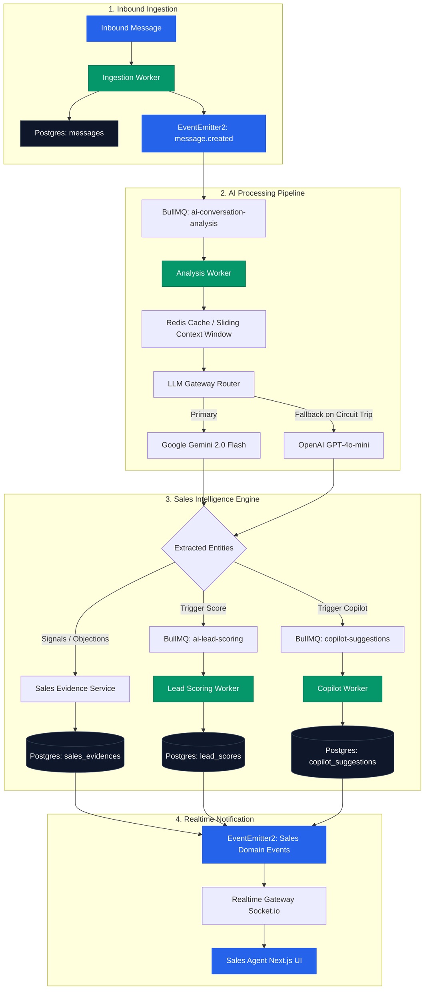
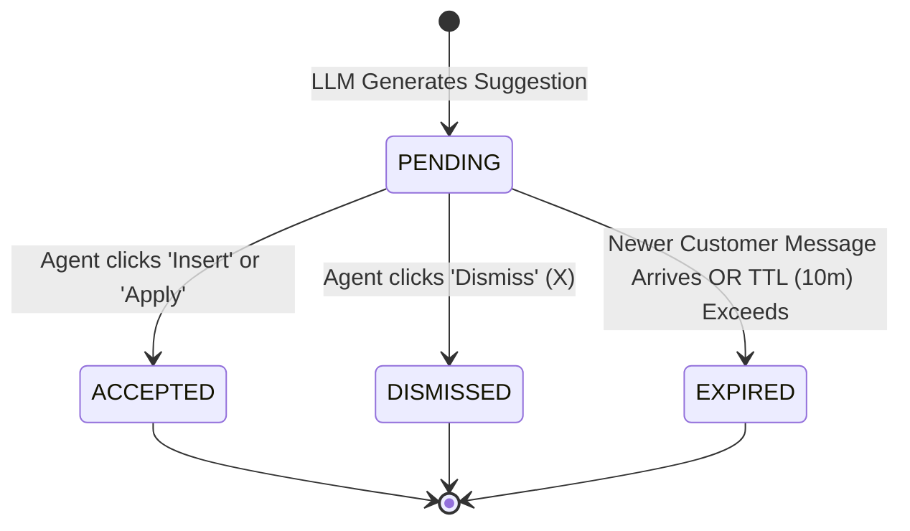

# Phase 2 System Architecture: Sales Intelligence & AI Copilot

## 1. Executive Summary & Architecture Principles

### 1.1. Mission & Vision
Phase 2 extends the Sales Copilot Platform from an omnichannel communication core (Phase 1) into an **Intelligent Sales Acceleration Platform**. By streaming conversations through asynchronous AI pipelines, the platform extracts buying signals, calculates real-time lead readiness scores, detects deal objections, and provides sales representatives with instantaneous Next Best Actions (NBA) and context-aware draft replies.

```text
┌─────────────────────────────────────────────────────────────────────────────────────────┐
│                                 SALES COPILOT PLATFORM                                  │
├───────────────────────────────────────────┬─────────────────────────────────────────────┤
│        PHASE 1: CONVERSATION CORE         │        PHASE 2: SALES INTELLIGENCE          │
│         (Omnichannel Foundation)          │             (Revenue & AI Layer)            │
├───────────────────────────────────────────┼─────────────────────────────────────────────┤
│ • Inbound Webhook Ingestion & Deduplication│ • Multi-Provider LLM Gateway (Gemini/OpenAI)│
│ • Contact & Channel Identity Resolution   │ • Conversation Intelligence (Intent/Signals)│
│ • Unified Threading, Messages, Attachments│ • Sales Evidence & Activity Timeline        │
│ • Round-Robin Assignment & Presence       │ • AI-Driven Lead Scoring Engine with Decay  │
│ • Canned Responses, Labels, Automations   │ • In-Conversation Copilot (NBA/Draft Reply) │
│ • Realtime WebSocket Fanout               │ • Lead & Opportunity Pipeline Management    │
└───────────────────────────────────────────┴─────────────────────────────────────────────┘
```

### 1.2. Non-Negotiable Architecture Directives (AGENTS.md Compliance)
1. **Pragmatic Modular Monolith**: Phase 2 is built inside the same NestJS monolith (`apps/server`) as distinct modules. No microservices, no Kafka, no gRPC overhead.
2. **KISS & YAGNI**: No speculative abstractions or layered single-implementation interfaces. Direct NestJS Services (`*.service.ts`) combined with Prisma queries.
3. **Decoupled Asynchrony**: Inbound customer messages MUST NOT block on LLM inference. Ingestion acknowledges in `< 100ms`; AI extraction executes asynchronously via Redis BullMQ queues.
4. **Strict Multi-Tenancy**: Every entity, query, cache key, BullMQ job payload, and WebSocket broadcast MUST be explicitly scoped by `workspaceId`.
5. **Phase 1 Runtime Immobility**: Zero changes to Phase 1 database tables or runtime migrations during Phase 2 design. Integration is mediated strictly via public Application Services and domain events.

---

## 2. Module Boundaries & Bounded Contexts

### 2.1. Bounded Context Map

```text
┌────────────────────────────────────────────────────────────────────────────────────────┐
│                              CONVERSATION CORE CONTEXT (Phase 1)                       │
│                                                                                        │
│   [Identity Module]       [Omnichannel Module]          [Conversation Module]          │
│   - User, Workspace       - Channel, Inbox              - Conversation, Message        │
│   - WorkspaceMember       - Contact, ChannelIdentity    - Attachment, Label            │
└───────────────────────────────────────┬────────────────────────────────────────────────┘
                                        │ Domain Events (EventEmitter2)
                                        │ • message.created
                                        │ • conversation.status_changed
                                        ▼
┌────────────────────────────────────────────────────────────────────────────────────────┐
│                              SALES INTELLIGENCE CONTEXT (Phase 2)                      │
│                                                                                        │
│   ┌────────────────────────────────────────────────────────────────────────────────┐   │
│   │                              LLM GATEWAY MODULE                                │   │
│   │  - Multi-Provider Router (Gemini, OpenAI)   - Token Tracking & Budgeting       │   │
│   │  - Resilient Retry & Circuit Breaker        - Prompt Template Rendering Engine │   │
│   └───────────────────────────────────┬────────────────────────────────────────────┘   │
│                                       │                                                │
│         ┌─────────────────────────────┴─────────────────────────────┐                  │
│         ▼                                                           ▼                  │
│   ┌──────────────────────────────────┐        ┌──────────────────────────────────┐     │
│   │    SALES INTELLIGENCE MODULE     │        │          COPILOT MODULE          │     │
│   │  - Lead & Opportunity Lifecycles │        │  - Next Best Action (NBA) Engine │     │
│   │  - Sales Evidence Ledger         │        │  - Contextual Draft Replies      │     │
│   │  - Hybrid Lead Scoring Engine    │        │  - Objection Handling Generator  │     │
│   │  - Time-Decay Cron Scheduler     │        │  - Suggestion Feedback Tracker   │     │
│   └──────────────────────────────────┘        └──────────────────────────────────┘     │
└───────────────────────────────────────┬────────────────────────────────────────────────┘
                                        │ Realtime Events (EventEmitter2)
                                        │ • lead.score_updated
                                        │ • sales_evidence.detected
                                        │ • copilot.suggestion_generated
                                        ▼
┌────────────────────────────────────────────────────────────────────────────────────────┐
│                              REALTIME & PRESENTATION LAYER                             │
│                                                                                        │
│   [Realtime Gateway] ───────── WebSocket ─────────► [Next.js 16 Web Dashboard]         │
│   (Room: workspace_{id})                            (Copilot Drawer, Score Widget)     │
└────────────────────────────────────────────────────────────────────────────────────────┘
```

### 2.2. Module Specification & Contracts

| Module | Owned Entities / Models | Exported Services | Inbound Events Subscribed | Outbound Events Emitted |
| :--- | :--- | :--- | :--- | :--- |
| **`llm-gateway`** | `PromptTemplate`, `LlmUsageLog` | `LlmGatewayService`, `PromptTemplateService` | None (Direct Service Calls) | `llm.token_consumed`, `llm.circuit_breaker_tripped` |
| **`sales-intelligence`** | `Lead`, `Opportunity`, `OpportunityStageHistory`, `SalesEvidence`, `LeadScore`, `LeadScoreHistory` | `LeadService`, `OpportunityService`, `SalesEvidenceService`, `LeadScoringService` | `message.created`, `conversation.resolved`, `contact.updated` | `lead.created`, `lead.stage_changed`, `lead.score_updated`, `sales_evidence.detected`, `opportunity.stage_changed` |
| **`copilot`** | `CopilotSuggestion`, `SuggestionFeedback` | `CopilotService`, `NextBestActionService` | `message.created`, `sales_evidence.detected`, `lead.score_updated` | `copilot.suggestion_generated`, `copilot.suggestion_acted` |

### 2.3. Inter-Module Dependency Invariants
1. **Unidirectional Dependency**: `copilot` and `sales-intelligence` depend on `llm-gateway`. `llm-gateway` has ZERO dependencies on sales or conversation domain models.
2. **Read-Only Cross-Context Access**: When `sales-intelligence` needs conversation context, it queries `ConversationService.getRecentMessages(conversationId, limit)` or reads data encapsulated inside the `MessageCreatedEvent`. It never invokes Prisma directly across boundaries.
3. **No Distributed Transactions**: State updates between Conversation and Sales Intelligence are eventually consistent via BullMQ queue retries.

---

## 3. End-to-End Realtime Event-Driven Data Flow

### 3.1. Architectural Sequence Diagram

The following sequence illustrates the complete lifecycle: from an external customer message arrival to AI extraction, score calculation, and real-time frontend delivery.

```mermaid
sequenceDiagram
    autonumber
    actor Customer as External Customer (FB/Zalo/Telegram/Web)
    participant Webhook as WebhookController (Omnichannel)
    participant IngestionQ as BullMQ (inbound-events)
    participant ConvSvc as ConversationService
    participant EventBus as EventEmitter2
    participant AnalysisQ as BullMQ (ai-conversation-analysis)
    participant AIWorker as ConversationAnalysisWorker
    participant LLMGateway as LlmGatewayService
    participant UpstreamLLM as Google Gemini / OpenAI
    participant EvidenceSvc as SalesEvidenceService
    participant ScoringQ as BullMQ (ai-lead-scoring)
    participant ScoringWorker as LeadScoringWorker
    participant CopilotQ as BullMQ (copilot-suggestions)
    participant CopilotWorker as CopilotWorker
    participant RealtimeGW as RealtimeGateway (Socket.io)
    actor Agent as Sales Agent (Next.js Web Client)

    Customer->>Webhook: Inbound Message Payload
    Webhook->>IngestionQ: Enqueue Verified Event
    Webhook-->>Customer: 200 OK (Immediate Ack)
    
    IngestionQ->>ConvSvc: Persist Message & Update LastActivity
    ConvSvc->>EventBus: emit('message.created', { workspaceId, conversationId, messageId, content, senderType: 'CONTACT' })
    
    par Parallel Dispatch to AI Queues
        EventBus->>AnalysisQ: Enqueue Analysis Job (debounced)
        EventBus->>RealtimeGW: Broadcast 'message.created' to Room: workspace_{id}
    end
    RealtimeGW-->>Agent: Render Incoming Bubble in Chat
    
    Note over AnalysisQ,AIWorker: Asynchronous Background Processing
    AnalysisQ->>AIWorker: Process 'analyze-inbound-message'
    AIWorker->>ConvSvc: Fetch Last 10 Messages for Context Window
    AIWorker->>LLMGateway: generateStructuredOutput(PromptTemplate: CONV_INTELLIGENCE_V1)
    
    LLMGateway->>UpstreamLLM: POST /v1/chat/completions (JSON Schema Mode)
    UpstreamLLM-->>LLMGateway: Structured JSON (Intent, Sentiment, Signals)
    LLMGateway-->>AIWorker: Parsed Analysis Result
    
    opt Buying Signals or Objections Detected
        AIWorker->>EvidenceSvc: Record Sales Evidence Entries (Append-only)
        EvidenceSvc->>EventBus: emit('sales_evidence.detected', { workspaceId, leadId, evidenceList })
        EventBus->>RealtimeGW: Broadcast 'sales_evidence.detected'
        RealtimeGW-->>Agent: Highlight Evidence Badge on UI Timeline
        
        AIWorker->>ScoringQ: Enqueue 'recalculate-lead-score'
        AIWorker->>CopilotQ: Enqueue 'generate-copilot-suggestions'
    end

    Note over ScoringQ,ScoringWorker: Lead Score Recalculation
    ScoringQ->>ScoringWorker: Process 'recalculate-lead-score'
    ScoringWorker->>ScoringWorker: Calculate Hybrid Score (Fit + Engagement - Decay)
    ScoringWorker->>EventBus: emit('lead.score_updated', { leadId, currentScore: 85, tier: 'HOT' })
    EventBus->>RealtimeGW: Broadcast 'lead.score_updated'
    RealtimeGW-->>Agent: Update Lead Score Gauge & Hot Badge

    Note over CopilotQ,CopilotWorker: Copilot Suggestion Generation
    CopilotQ->>CopilotWorker: Process 'generate-copilot-suggestions'
    CopilotWorker->>LLMGateway: generateStructuredOutput(PromptTemplate: COPILOT_NBA_V1)
    LLMGateway->>UpstreamLLM: Request NBA & Draft Reply
    UpstreamLLM-->>LLMGateway: Next Best Action + Draft Reply
    CopilotWorker->>CopilotWorker: Persist CopilotSuggestion (Status: PENDING)
    CopilotWorker->>EventBus: emit('copilot.suggestion_generated', { suggestionId, draftReply, nba })
    EventBus->>RealtimeGW: Broadcast 'copilot.suggestion_generated'
    RealtimeGW-->>Agent: Render Floating Copilot Card ("1-Click Insert Draft")
```



### 3.2. Detailed Data Flowchart



---

## 4. Multi-Provider LLM Gateway Architecture

### 4.1. Architectural Goals & Design Pattern
The LLM Gateway isolates the application core from third-party AI provider quirks, SDK changes, outages, and rate limits. It provides:
1. **Normalized Provider Contract**: Single polymorphic interface for chat completions and structured JSON schema output.
2. **Provider Failover & Circuit Breaking**: Primary routing to **Google Gemini 2.0 Flash** (cost-efficient, high speed, large context) with automatic failover to **OpenAI GPT-4o-mini** when error thresholds are exceeded.
3. **Token Usage Accounting**: Transparent cost attribution and quota enforcement per workspace.
4. **Dynamic Prompt Templating**: Parameterized system and user prompts with workspace-level overrides and version control.

```text
                     ┌──────────────────────────────────────┐
                     │          LlmGatewayService           │
                     └──────────────────┬───────────────────┘
                                        │
           ┌────────────────────────────┼────────────────────────────┐
           ▼                            ▼                            ▼
┌──────────────────────┐     ┌──────────────────────┐     ┌──────────────────────┐
│  RateLimiter (Redis) │     │ TokenTracker (Usage) │     │ PromptTemplateEngine │
└──────────────────────┘     └──────────────────────┘     └──────────────────────┘
                                        │
                                        ▼
                             ┌──────────────────────┐
                             │    CircuitBreaker    │
                             └──────────┬───────────┘
                                        │
                       ┌────────────────┴────────────────┐
                       │                                 │
              [State: CLOSED]                   [State: OPEN / TRIP]
                       │                                 │
                       ▼                                 ▼
           ┌──────────────────────┐          ┌──────────────────────┐
           │    GeminiAdapter     │          │    OpenAIAdapter     │
           │  (Primary Provider)  │          │  (Fallback Provider) │
           └──────────┬───────────┘          └──────────┬───────────┘
                      ▼                                 ▼
             Google Gemini API                     OpenAI API
```

### 4.2. Core TypeScript Interfaces

```typescript
// apps/server/src/modules/llm-gateway/interfaces/llm-gateway.interface.ts

export interface LlmMessage {
  role: 'system' | 'user' | 'assistant';
  content: string;
}

export interface LlmCompletionRequest {
  workspaceId: string;
  templateCode: string;
  templateVariables: Record<string, any>;
  conversationHistory?: LlmMessage[];
  preferredModel?: string;
  temperature?: number;
  maxTokens?: number;
}

export interface LlmStructuredRequest<T> extends LlmCompletionRequest {
  jsonSchema: Record<string, any>; // JSON Schema standard
  schemaName: string;
}

export interface LlmUsageMetrics {
  promptTokens: number;
  completionTokens: number;
  totalTokens: number;
  latencyMs: number;
  estimatedCostUsd: number;
  provider: 'GEMINI' | 'OPENAI';
  model: string;
}

export interface LlmStructuredResponse<T> {
  data: T;
  metrics: LlmUsageMetrics;
}

export interface LlmProviderAdapter {
  readonly providerName: 'GEMINI' | 'OPENAI';
  generateStructuredOutput<T>(
    messages: LlmMessage[],
    schema: Record<string, any>,
    options?: { model?: string; temperature?: number; maxTokens?: number },
  ): Promise<{ data: T; usage: Omit<LlmUsageMetrics, 'latencyMs'> }>;
}
```

### 4.3. Resiliency: Circuit Breaker & Exponential Backoff
Upstream LLM calls are wrapped in a 3-state Circuit Breaker per provider:

| State | Condition | Action |
| :--- | :--- | :--- |
| **`CLOSED`** | Failure rate $< 30\%$ over rolling 60s window. | Route all requests to primary provider (Gemini). |
| **`OPEN`** | Failure rate $\ge 30\%$ or 5 consecutive 5xx / timeout errors. | Trip circuit; immediately route requests to fallback provider (OpenAI) for 30s reset cooldown. |
| **`HALF_OPEN`**| 30s cooldown expired. | Route canary request (10% traffic) to primary. If successful, transition to `CLOSED`; if failed, re-open for 60s. |

**Retry Policy with Exponential Jittered Backoff**:
```typescript
delay = min(maxBackoffMs, initialDelayMs * pow(backoffFactor, attempt) + randomJitterMs);
```
- `initialDelayMs`: 400ms
- `backoffFactor`: 2.0
- `maxBackoffMs`: 5000ms
- `maxRetries`: 3 attempts (on HTTP 429 Rate Limit or 503 Service Unavailable)

### 4.4. Rate Limiting & Token Quota (Redis Token Bucket)
- **Tenant Rate Limit**: Enforced in Redis using a rolling Token Bucket algorithm:
  - Free Tier: 30 requests/minute, 100k tokens/day.
  - Standard Tier: 120 requests/minute, 1M tokens/day.
  - Enterprise Tier: 500 requests/minute, Custom token quota.
- Redis Key: `ws:{workspaceId}:llm:rate_limit:{provider}:{minuteBucket}`.

---

## 5. AI Engine Architecture & Capabilities

The AI Engine is partitioned into three specialized functional processors:

```text
┌────────────────────────────────────────────────────────────────────────────────────────┐
│                                   AI ENGINE MODULES                                    │
├───────────────────────────────┬───────────────────────────────┬────────────────────────┤
│   CONVERSATION INTELLIGENCE   │       AI LEAD SCORING         │   SALES COPILOT        │
│          PROCESSOR            │            ENGINE             │     ASSISTANT          │
├───────────────────────────────┼───────────────────────────────┼────────────────────────┤
│ • Intent Classification       │ • Deterministic Fit Score     │ • Next Best Actions    │
│ • Sentiment & Urgency Polarity│ • Behavioral Signal Weights   │ • Context Draft Reply  │
│ • Buying Signal Extraction    │ • Inactivity Decay Mechanics  │ • Objection Handling   │
│ • Objection & Risk Detection  │ • Tier Transition Triggers    │ • Canned Suggestion    │
│ • Competitor Extraction       │ • Score Audit Snapshot        │ • Agent Telemetry      │
└───────────────────────────────┴───────────────────────────────┴────────────────────────┘
```

### 5.1. Conversation Intelligence Processor

#### A. Structured Output Schema (`CONV_INTELLIGENCE_V1`)
Every incoming contact message is processed with its surrounding conversational context (sliding window of last 10 messages) using this validated JSON schema:

```json
{
  "type": "object",
  "properties": {
    "primaryIntent": {
      "type": "string",
      "enum": [
        "PRICING_INQUIRY",
        "PRODUCT_INFO",
        "DEMO_REQUEST",
        "DISCOUNT_NEGOTIATION",
        "FEATURE_INQUIRY",
        "OBJECTION_RAISED",
        "TECHNICAL_SUPPORT",
        "GENERAL_CHITCHAT"
      ]
    },
    "sentiment": {
      "type": "object",
      "properties": {
        "polarity": { "type": "string", "enum": ["POSITIVE", "NEUTRAL", "NEGATIVE"] },
        "score": { "type": "number", "minimum": -1.0, "maximum": 1.0 },
        "urgency": { "type": "string", "enum": ["LOW", "MEDIUM", "HIGH", "CRITICAL"] }
      },
      "required": ["polarity", "score", "urgency"]
    },
    "detectedSignals": {
      "type": "array",
      "items": {
        "type": "object",
        "properties": {
          "signalType": {
            "type": "string",
            "enum": ["BUYING_SIGNAL", "RISK_SIGNAL", "OBJECTION", "COMPETITOR_MENTION", "COMMITMENT"]
          },
          "signalCategory": { "type": "string" },
          "confidence": { "type": "number", "minimum": 0.0, "maximum": 1.0 },
          "rawExcerpt": { "type": "string" },
          "reasoning": { "type": "string" }
        },
        "required": ["signalType", "signalCategory", "confidence", "rawExcerpt", "reasoning"]
      }
    }
  },
  "required": ["primaryIntent", "sentiment", "detectedSignals"]
}
```

#### B. Confidence Filter & Deduplication
- **Confidence Gate**: Signals with `confidence < 0.65` are dropped immediately to eliminate hallucinated noise.
- **Sliding Window Deduplication**: If an identical `(leadId, signalType, signalCategory)` was recorded within the last 15 minutes, the new entry is deduplicated to prevent score inflation during repetitive conversations.

---

### 5.2. AI-Driven Lead Scoring Engine

#### A. Hybrid Scoring Mathematical Formulation
The Lead Score is a bounded integer $S \in [0, 100]$ computed via a deterministic hybrid formula combining Profile Fit, Dynamic Behavior, and Inactivity Decay:

$$S(t) = \min\left(100, \max\left(0, S_{\text{fit}} + S_{\text{behavior}} - D(t)\right)\right)$$

Where:
1. **$S_{\text{fit}}$ (Profile Fit Score, max 30 points)**:
   - Email provided (corporate domain): $+15$ pts.
   - Email provided (generic gmail/yahoo): $+5$ pts.
   - Verified Phone Number: $+10$ pts.
   - Channel Origin weight (Web Chat: $+5$, Zalo/FB: $+3$).
2. **$S_{\text{behavior}}$ (Behavioral Engagement Score, max 70 points)**:
   - Base interaction points: $+2$ pts per customer turn (max $+10$).
   - High Intent (`DEMO_REQUEST`, `PRICING_INQUIRY`): $+15$ pts.
   - Verified `BUYING_SIGNAL` detected: $+10$ to $+20$ pts per signal.
   - Verified `COMMITMENT` detected (e.g. agreed to meeting): $+20$ pts.
   - Verified `OBJECTION` detected: $-10$ pts (restored upon objection resolution).
   - Verified `RISK_SIGNAL` (frustration, competitor preference): $-15$ pts.
3. **$D(t)$ (Inactivity Decay Penalty)**:
   - When a contact goes silent, the lead score decays to prevent stale leads remaining in the `HOT` queue.
   - Decay begins after **48 hours of inactivity** ($\Delta t > 48h$).
   - Stepwise Linear Decay: $-5$ points for every elapsed 24-hour block past the 48-hour threshold:
     $$D(t) = \max\left(0, \left\lfloor \frac{\Delta t - 48\text{h}}{24\text{h}} \right\rfloor \times 5\right)$$
   - Decay resets to $0$ immediately upon any new customer interaction (`message.created` with `senderType: 'CONTACT'`).

#### B. Score Classification Tiers & Actions

| Score Range | Tier Classification | Visual Indicator | Automated System Action |
| :--- | :--- | :--- | :--- |
| **80 – 100** | `HOT` 🔥 | Red Badge + Ping | Auto-prioritize in inbox, set conversation priority to `URGENT`, emit real-time sound/toast alert to assignee. |
| **50 – 79** | `WARM` ⚡ | Amber Badge | Normal sales nurturing, suggest demo or quotation Next Best Action. |
| **0 – 49** | `COLD` ❄️ | Slate Gray Badge | Automated re-engagement campaign or low-touch follow-up. |

---

### 5.3. Sales Copilot Assistant

#### A. Next Best Action (NBA) Engine
The Copilot analyzes current deal stage, conversation history, and latest objections to recommend concrete tactical steps:

```text
┌─────────────────────────────┬──────────────────────────────────────────┬─────────────────────────────┐
│ Trigger Context             │ Recommended Next Best Action             │ Suggested Resource / Tool   │
├─────────────────────────────┼──────────────────────────────────────────┼─────────────────────────────┤
│ Price Objection Raised      │ Offer Tiered Plan or Volume Discount     │ Link to ROI Calculator      │
│ Feature Gap Identified      │ Clarify Workaround or Share Roadmap      │ Attach Solution Brief       │
│ High Buying Intent Detected │ Propose 15-Minute Technical Demo Call    │ Open Calendar Booking Link  │
│ Competitor Mentioned        │ Present Differentiator Battlecard        │ Insert Competitor Matrix    │
│ Conversation Dormant 3 Days │ Send Non-Intrusive Re-Engagement Nudge   │ Canned Follow-up Template   │
└─────────────────────────────┴──────────────────────────────────────────┴─────────────────────────────┘
```

#### B. Contextual Draft Reply Generation
When generating draft replies, the Copilot constructs an enriched context payload:
- Customer name and historical channel notes.
- Summary of earlier turns in the conversation.
- Active objections and detected buying signals.
- Workspace canned responses relevant to the intent.

The generated reply is formatted in standard Markdown and returned via WebSocket directly into the agent's composer dock with a **"1-Click Insert"** or **"Tab to Accept"** keyboard shortcut.

#### C. Suggestion Lifecycle State Machine



---

## 6. BullMQ Queues & Job Specifications

All Phase 2 background jobs run on Redis-backed BullMQ with explicit concurrency, idempotency keys, and retry policies.

```text
┌────────────────────────────────────────────────────────────────────────────────────────┐
│                                   BULLMQ QUEUE MATRIX                                  │
├──────────────────────────┬──────────────┬─────────────┬───────────┬────────────────────┤
│ Queue Name               │ Default Rate │ Concurrency │ Attempts  │ Backoff Policy     │
├──────────────────────────┼──────────────┼─────────────┼───────────┼────────────────────┤
│ ai-conversation-analysis │ 50 jobs/sec  │ 10 workers  │ 3 retries │ Exponential (1s)   │
│ ai-lead-scoring          │ 30 jobs/sec  │ 5 workers   │ 3 retries │ Exponential (2s)   │
│ copilot-suggestions      │ 20 jobs/sec  │ 5 workers   │ 2 retries │ Fixed (500ms)      │
│ lead-score-decay         │ 100 jobs/sec │ 2 workers   │ 2 retries │ Fixed (5s)         │
└──────────────────────────┴──────────────┴─────────────┴───────────┴────────────────────┘
```

### 6.1. Job Payload Specifications

#### Job 1: `analyze-inbound-message` (`ai-conversation-analysis`)
- **Idempotency Key**: `job:analyze:${messageId}`
- **Payload**:
  ```typescript
  export interface AnalyzeInboundMessageJob {
    workspaceId: string;
    conversationId: string;
    messageId: string;
    contactId: string;
    content: string;
    channelType: string;
  }
  ```
- **Execution SLA**: Completed in $< 2.5$ seconds.

#### Job 2: `recalculate-lead-score` (`ai-lead-scoring`)
- **Idempotency Key / Debounce**: `job:score:${leadId}` with a **5-second debounce window** to prevent multiple recalculations during burst chat messaging.
- **Payload**:
  ```typescript
  export interface RecalculateLeadScoreJob {
    workspaceId: string;
    leadId: string;
    triggerReason: 'NEW_EVIDENCE' | 'STAGE_CHANGE' | 'PROFILE_UPDATE' | 'MANUAL_OVERRIDE';
  }
  ```

#### Job 3: `generate-copilot-suggestions` (`copilot-suggestions`)
- **Idempotency Key**: `job:copilot:${conversationId}:${messageId}`
- **Payload**:
  ```typescript
  export interface GenerateCopilotSuggestionsJob {
    workspaceId: string;
    conversationId: string;
    messageId: string;
    leadId?: string;
  }
  ```
- **Execution SLA**: Completed in $< 1.8$ seconds for snappy agent UI assistance.

#### Job 4: `apply-lead-score-decay` (`lead-score-decay`)
- **Schedule**: Recurring Cron job running every **1 hour** (`0 * * * *`).
- **Function**: Scans all active leads whose `lastActivityAt < now() - 48h` and applies decay steps in batched chunks of 200 records.

---

## 7. Caching, Security & Tenant Isolation

### 7.1. Redis Key Topology & Namespaces
To guarantee zero cross-tenant data leaks and high lookup performance, all Redis keys are partitioned using the standard convention:

```text
ws:{workspaceId}:{subsystem}:{entity}:{identifier}
```

- **LLM Rate Limiter**: `ws:{wsId}:llm:limiter:{provider}:{minuteBucket}` (TTL: 120s)
- **Prompt Template Cache**: `ws:{wsId}:prompt_tpl:{templateCode}:v{version}` (TTL: 1 hour)
- **Active Copilot Suggestion**: `ws:{wsId}:copilot:active:{conversationId}` (TTL: 10 minutes)
- **Lead Score Snapshot**: `ws:{wsId}:lead:{leadId}:score_cache` (TTL: 30 minutes)
- **Deduplication Lock**: `ws:{wsId}:dedup:signal:{leadId}:{signalHash}` (TTL: 15 minutes)

### 7.2. Context Window Truncation & Token Budgeting
LLM requests must be protected against context overflow and exorbitant token costs:
1. **Sliding Window Heuristic**: Only the last **10 to 15 conversation messages** are passed into the prompt context.
2. **Context Summarization**: For conversations exceeding 30 turns, an automated rolling summary is computed during inactivity periods and prepended as background context.
3. **Hard Token Cap**: Prompt context is truncated to a strict budget of **3,500 tokens** per completion call.

### 7.3. Enterprise Security & PII Protection
1. **At-Rest Encryption**: Workspace-provided BYOK (Bring-Your-Own-Key) LLM API keys are encrypted in the database using **AES-256-GCM**, matching Phase 1 Channel Credential security.
2. **PII Masking**: Inbound text is sanitized before leaving the network boundary. Credit card patterns (`\b\d{4}[ -]?\d{4}[ -]?\d{4}[ -]?\d{4}\b`) and Vietnamese Citizen ID numbers (12-digit patterns) are redacted to `[REDACTED_PII]`.
3. **Zero Data Retention**: LLM calls to Google Gemini and OpenAI are transmitted with zero-data-retention / do-not-train enterprise API flags.

---

## 8. Presentation Layer Integration (Web Dashboard)

In accordance with Phase 1 frontend foundations (Next.js 16 App Router, `@base-ui/react`, Tailwind CSS v4, and `@tanstack/react-query`):

### 8.1. Realtime WebSocket Events

| Event Name | Room Scope | Client Receiver & Action |
| :--- | :--- | :--- |
| `lead.score_updated` | `workspace_{wsId}` | Updates the lead score dial in the Conversation Header and Contact Sidebar. |
| `sales_evidence.detected` | `workspace_{wsId}` | Appends new signal pill onto the **Sales Evidence Timeline** tab without full page refetch. |
| `copilot.suggestion_generated` | `workspace_{wsId}` | Pops open the **Copilot Dock** above the message composer with animated highlight. |
| `opportunity.stage_changed` | `workspace_{wsId}` | Updates Kanban board column and deal value sums optimistically. |

### 8.2. UI Component Composition Architecture
- **Copilot Dock**: Composed using `@/components/ui/bubble` and `@/components/ui/button`.
- **Sales Evidence Timeline**: Composed using `@/components/ui/scroll-area` and `@/components/ui/badge`.
- **Lead Score Indicator**: Composed using `@/components/ui/progress` and semantic badges (`HOT`, `WARM`, `COLD`).
- **Single Source of Truth**: WebSocket events directly update TanStack Query cache (`queryClient.setQueryData`) to avoid multi-state synchronization bugs.
