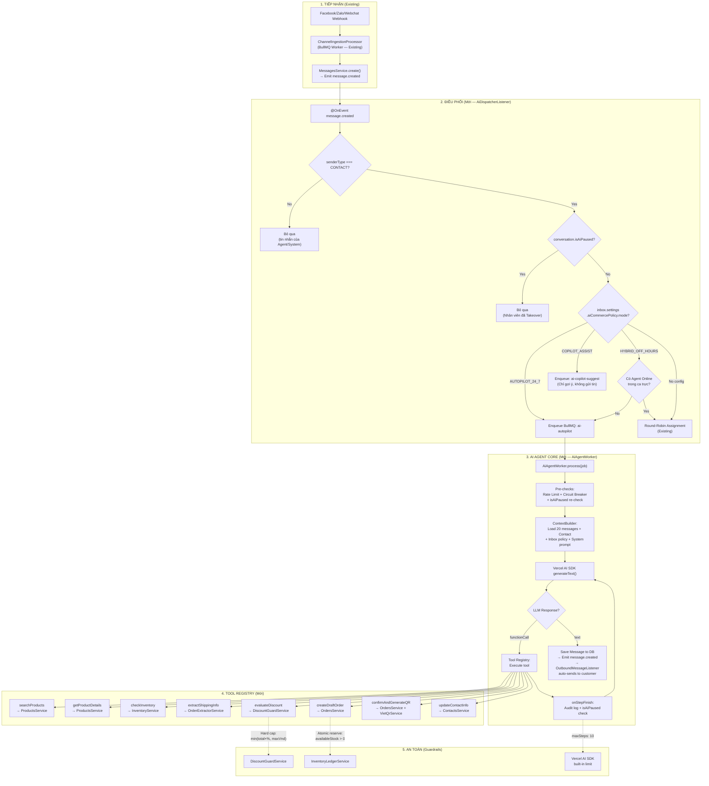
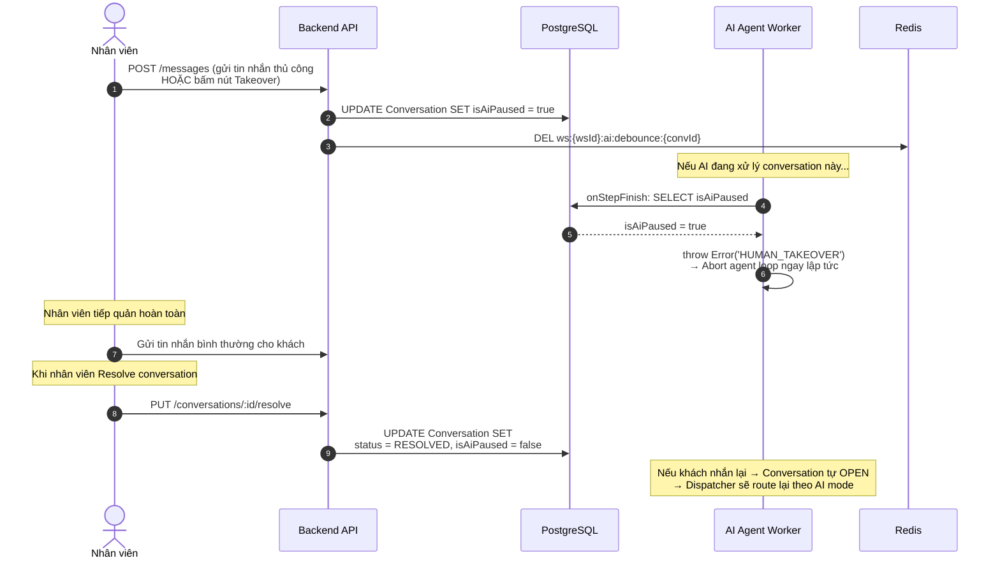
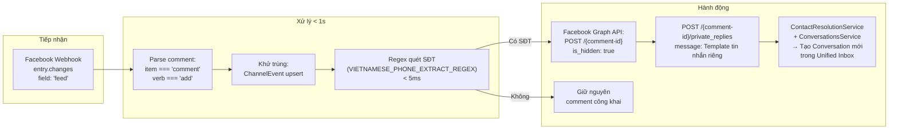

# RFC Kỹ Thuật: AI Agent Framework — Kiến Trúc AI Sales Agent

> **Tài liệu**: Đặc Tả Kiến Trúc Kỹ Thuật AI Agent Framework (Technical RFC)\
> **Dự án**: Sales Copilot Platform\
> **Vị trí file**: `docs/architecture/rfc-ai-agent-framework.md`\
> **Trạng thái**: ✅ Confirmed\
> **PRD đối ứng**: [`docs/product/prd-ai-agent-framework.md`](../product/prd-ai-agent-framework.md)\
> **Backlog**: [`Epic 3.0`](../backlog/epic-3.0-ai-legacy-cleanup.md) · [`3.1`](../backlog/epic-3.1-ai-agent-core.md) · [`3.2`](../backlog/epic-3.2-commerce-tool-registry.md) · [`3.3`](../backlog/epic-3.3-comment-guard.md) · [`3.4`](../backlog/epic-3.4-ai-settings-ui.md)

---

## 1. Tổng Quan & Quyết Định Kỹ Thuật

### 1.1. Mục tiêu

Thiết kế và xây dựng **AI Agent Framework** cho Sales Copilot — một bộ khung cho phép AI tự động vận hành toàn bộ quy trình bán hàng: tiếp nhận tin nhắn, tư vấn sản phẩm, đàm phán giảm giá, bóc tách địa chỉ, chốt đơn, gửi VietQR — thông qua cơ chế **LLM + Tool Calling**.

### 1.2. Quyết định công nghệ: Vercel AI SDK

| Quyết định | Chi tiết |
|---|---|
| **Framework chọn** | **Vercel AI SDK** (`ai` v7.x + `@ai-sdk/google` v4.x) |
| **Dependencies mới** | `ai`, `@ai-sdk/google` (2 packages) |
| **Dependencies xóa** | `@google/genai`, `openai` — Vercel AI SDK thay thế hoàn toàn |
| **Code xóa** | Toàn bộ `intelligence/llm-gateway/`, `commerce/automation/` (trừ `address-parser.util.ts`), `shared-contracts/intelligence/` |
| **Chế độ AI** | Chỉ AUTOPILOT (bật/tắt). COPILOT, HYBRID, OVERFLOW — Phase sau |

**Lý do kỹ thuật chọn Vercel AI SDK thay vì tự viết agent loop:**

```
Tự viết agent loop (~250 LOC):
┌─────────────────────────────────────────┐
│ while (true) {                          │
│   response = await gemini.generate()    │
│   if (response.functionCalls) {         │
│     result = await executeTool(...)     │
│     messages.push(functionResponse)     │
│   } else {                             │
│     break; // Text response → done     │
│   }                                    │
│ }                                      │
│                                        │
│ + Error handling mỗi step              │
│ + Max iterations guard                 │
│ + Streaming support (nếu cần)          │
│ + Multi-tool parallel execution        │
│ + Step lifecycle hooks                 │
│ + Token usage aggregation across steps │
│ + Abort signal / cancellation          │
│ = ~250-400 LOC, untested edge cases    │
└─────────────────────────────────────────┘

Vercel AI SDK (~30 LOC):
┌─────────────────────────────────────────┐
│ const result = await generateText({     │
│   model: google('gemini-2.5-flash'),    │
│   system: systemPrompt,                │
│   messages: conversationHistory,        │
│   tools: registeredTools,              │
│   maxSteps: 10,                        │
│   onStepFinish: auditAndGuard,         │
│ });                                    │
│                                        │
│ // Built-in: loop, error handling,     │
│ // parallel tool calls, abort signal,  │
│ // usage aggregation, streaming        │
│ = ~30 LOC, production-tested (18M/wk) │
└─────────────────────────────────────────┘
```

---

## 2. Kiến Trúc Tổng Thể

### 2.1. Sơ Đồ Luồng Dữ Liệu End-to-End



### 2.2. Module Layout trong Codebase

```
apps/server/src/modules/intelligence/
│
├── ai-agent/                       # ★ MỚI — AI Agent Framework (Vercel AI SDK)
│   ├── ai-agent.module.ts          # NestJS Module: import tools, export services
│   ├── ai-agent.service.ts         # Core: Vercel AI SDK generateText() wrapper
│   ├── ai-agent.worker.ts          # BullMQ Processor cho queue `ai-autopilot`
│   ├── ai-dispatcher.listener.ts   # @OnEvent('message.created') → route to AI/Human
│   ├── ai-context.builder.ts       # Build system prompt + conversation history
│   ├── ai-takeover.listener.ts     # @OnEvent('message.created') → set isAiPaused khi Agent gửi tin
│   ├── utils/
│   │   └── address-parser.util.ts  # Giữ lại từ commerce/automation — GSO 3 cấp
│   ├── tools/                      # Tool implementations (thin wrappers)
│   │   ├── search-products.tool.ts
│   │   ├── get-product-details.tool.ts
│   │   ├── check-inventory.tool.ts
│   │   ├── extract-shipping-info.tool.ts
│   │   ├── evaluate-discount.tool.ts
│   │   ├── create-draft-order.tool.ts
│   │   ├── confirm-and-generate-qr.tool.ts
│   │   ├── update-contact-info.tool.ts
│   │   ├── escalate-to-human.tool.ts
│   │   └── index.ts                # Export all tools
│   └── discount-guard.service.ts   # Guarded Discount Policy Engine
│
└── intelligence.module.ts          # Re-export IntelligenceModule
```

---

## 3. Chi Tiết Kỹ Thuật Từng Component

### 3.1. AI Agent Service (`ai-agent.service.ts`)

Wrapper mỏng quanh Vercel AI SDK `generateText()`, inject NestJS services vào tools:

```typescript
// Pseudocode — Minh họa kiến trúc, không phải code production

import { generateText, tool } from 'ai';
import { google } from '@ai-sdk/google';

@Injectable()
export class AiAgentService {
  constructor(
    private readonly contextBuilder: AiContextBuilder,
    private readonly rateLimiter: RateLimiterService,
    private readonly circuitBreaker: CircuitBreakerService,
    // ... inject services for tools
  ) {}

  async processConversation(
    workspaceId: string,
    conversationId: string,
    inboxId: string,
  ): Promise<AiAgentResult> {
    // 1. Pre-checks
    await this.rateLimiter.checkAndReserve(workspaceId, estimatedTokens);
    if (!this.circuitBreaker.canExecute('GEMINI')) throw new Error('Circuit open');

    // 2. Build context
    const { systemPrompt, messages, aiPolicy } = await this.contextBuilder.build(
      workspaceId, conversationId, inboxId,
    );

    // 3. Resolve API key (workspace BYOK or platform default)
    const apiKey = await this.resolveGeminiApiKey(workspaceId);

    // 4. Execute agent loop via Vercel AI SDK
    const result = await generateText({
      model: google('gemini-2.5-flash', { apiKey }),
      system: systemPrompt,
      messages,                    // CoreMessage[] from DB
      tools: this.buildTools(workspaceId, conversationId, aiPolicy),
      maxSteps: 10,
      temperature: 0.3,
      abortSignal: this.createAbortSignal(conversationId),

      onStepFinish: async ({ text, toolCalls, toolResults, usage }) => {
        // a. Check Human Takeover mid-loop
        const conv = await this.prisma.conversation.findFirst({
          where: { id: conversationId, workspaceId },
          select: { isAiPaused: true },
        });
        if (conv?.isAiPaused) {
          throw new Error('HUMAN_TAKEOVER');  // Abort agent loop
        }

        // b. Audit log each step
        this.logger.log({ step: 'agent_step', toolCalls, usage });
      },
    });

    // 5. Record success & token usage
    this.circuitBreaker.recordSuccess('GEMINI');
    await this.rateLimiter.recordActualUsage(workspaceId, result.usage.totalTokens);

    return { text: result.text, steps: result.steps, usage: result.usage };
  }

  private buildTools(workspaceId: string, conversationId: string, policy: AiPolicy) {
    // Closure captures workspaceId — LLM NEVER receives workspaceId as argument
    return {
      searchProducts: tool({
        description: 'Search products in the store catalog by name or keyword',
        parameters: z.object({ query: z.string().describe('Product name or keyword') }),
        execute: async ({ query }) =>
          this.productsService.search(workspaceId, query),
      }),
      extractShippingInfo: tool({
        description: 'Extract recipient name, phone, and shipping address from text',
        parameters: z.object({ text: z.string() }),
        execute: async ({ text }) =>
          this.orderExtractor.extractOrderFromMessage(workspaceId, conversationId, text),
      }),
      evaluateDiscount: tool({
        description: 'Check if a discount amount is allowed by shop policy',
        parameters: z.object({
          orderTotal: z.number(),
          requestedDiscount: z.number(),
        }),
        execute: async ({ orderTotal, requestedDiscount }) =>
          this.discountGuard.evaluate(workspaceId, orderTotal, requestedDiscount, policy),
      }),
      // ... more tools
    };
  }
}
```

**Điểm thiết kế quan trọng:**
- `workspaceId` được inject qua **closure**, KHÔNG BAO GIỜ truyền làm tool parameter → LLM không thể cross-tenant.
- `onStepFinish` kiểm tra `isAiPaused` mỗi vòng → Takeover tức thì giữa chừng.
- `abortSignal` cho phép cancel job nếu Takeover xảy ra từ bên ngoài.

### 3.2. AI Dispatcher Listener (`ai-dispatcher.listener.ts`)

```typescript
// Pseudocode minh họa

@Injectable()
export class AiDispatcherListener {
  @OnEvent('message.created')
  async handleInboundMessage(event: MessageCreatedEvent) {
    // 1. Chỉ xử lý tin nhắn từ khách (CONTACT)
    if (event.senderType !== 'CONTACT') return;

    // 2. Load conversation + inbox settings
    const conv = await this.prisma.conversation.findFirst({
      where: { id: event.conversationId, workspaceId: event.workspaceId },
      include: { inbox: { include: { channel: true } } },
    });
    if (!conv || conv.isAiPaused) return;

    // 3. Read AI mode from inbox settings
    const aiPolicy = conv.inbox.settings?.aiCommercePolicy;
    if (!aiPolicy) return; // No AI config → manual mode

    // 4. Route based on mode
    switch (aiPolicy.mode) {
      case 'AUTOPILOT_24_7':
        await this.aiQueue.add('process-message', {
          workspaceId, conversationId, messageId, inboxId,
        });
        break;

      case 'HYBRID_OFF_HOURS':
        const hasOnlineAgent = await this.presenceService.hasOnlineAgents(workspaceId);
        const isWithinWorkingHours = this.checkWorkingHours(conv.inbox.settings?.workingHours);
        
        if (!hasOnlineAgent || !isWithinWorkingHours) {
          await this.aiQueue.add('process-message', { ... });
        }
        // Else: let existing Round-Robin assignment handle it
        break;

      case 'COPILOT_ASSIST':
        // Copilot mode: run extraction only, emit suggestion event (no auto-reply)
        // This is handled by existing CommerceOrderAutomationProcessor
        break;
    }
  }
}
```

### 3.3. AI Agent Worker (`ai-agent.worker.ts`)

Chuẩn BullMQ Worker pattern (giống `ChannelIngestionProcessor` hiện có):

```typescript
// Pseudocode minh họa

@Processor(AI_AUTOPILOT_QUEUE, { concurrency: 5 })
@Injectable()
export class AiAgentWorker extends WorkerHost {
  async process(job: Job<AiAgentJobData>): Promise<AiAgentResult> {
    const { workspaceId, conversationId, inboxId } = job.data;

    // 1. Debounce check (tránh xử lý trùng khi khách gửi nhiều tin liên tiếp)
    const latestTimestamp = await this.redis.get(
      `ws:${workspaceId}:ai:debounce:${conversationId}`
    );
    if (latestTimestamp && Number(latestTimestamp) > job.data.scheduledAt) {
      return { skipped: true, reason: 'SUPERSEDED_BY_NEWER_MESSAGE' };
    }

    // 2. Re-check isAiPaused (có thể đã thay đổi từ lúc enqueue)
    const conv = await this.prisma.conversation.findFirst({
      where: { id: conversationId, workspaceId },
      select: { isAiPaused: true },
    });
    if (conv?.isAiPaused) {
      return { skipped: true, reason: 'HUMAN_TAKEOVER' };
    }

    // 3. Execute AI Agent
    const result = await this.aiAgentService.processConversation(
      workspaceId, conversationId, inboxId,
    );

    // 4. Save AI response as outbound message
    //    → OutboundMessageListener will auto-send via Channel Adapter
    await this.messagesService.create({
      conversationId,
      workspaceId,
      content: result.text,
      senderType: 'SYSTEM',        // Or 'USER' with isAiGenerated flag
      messageType: 'OUTGOING',
      metadata: {
        isAiGenerated: true,
        aiSteps: result.steps.length,
        aiTokenUsage: result.usage,
      },
    });

    return result;
  }
}
```

### 3.4. Context Builder (`ai-context.builder.ts`)

Chịu trách nhiệm tổng hợp toàn bộ ngữ cảnh cho LLM:

```
System Prompt = Template Persona
  + Shop-specific Instructions (customInstructions)
  + Discount Policy Rules (maxDiscountPercent, maxDiscountVnd)
  + Available Tools Description (auto-generated by Vercel AI SDK)

Messages = Last 20 messages from Conversation
  + Contact info (name, phone, previous orders)
  + Mapped to CoreMessage[] format (user/assistant/tool)
```

**Chiến lược quản lý context window:**
- Load tối đa **20 tin nhắn gần nhất** (đủ cho 1 conversation flow mua hàng)
- Tổng hợp `Contact.name`, `Contact.phoneNumber`, `Contact.customAttributes` vào system prompt
- Gemini 2.5 Flash context window: 1M tokens → dư sức cho use case này
- **Không cần external vector store / RAG** — catalog tra cứu qua Tool, không nhồi toàn bộ vào prompt

### 3.5. Tool Registry — Danh Sách Tools

Mỗi Tool là **thin wrapper** gọi vào Service đã có sẵn. Không chứa business logic:

| # | Tool Name | Mô tả cho LLM | Input Parameters | Service gọi | Read/Write |
|---|---|---|---|---|---|
| T1 | `searchProducts` | Tìm sản phẩm theo tên, từ khóa. Trả về tên, giá, tồn kho | `{ query: string }` | `ProductsService.search()` | Read |
| T2 | `getProductDetails` | Chi tiết sản phẩm + toàn bộ biến thể + ảnh | `{ productId: string }` | `ProductsService.findOne()` | Read |
| T3 | `checkInventory` | Kiểm tra tồn kho khả dụng cụ thể cho 1 variant | `{ variantId: string }` | `ProductsService.getVariant()` | Read |
| T4 | `extractShippingInfo` | Bóc tách tên, SĐT, địa chỉ 3 cấp từ text tự do | `{ text: string }` | `OrderExtractorService` | Read |
| T5 | `evaluateDiscount` | Kiểm tra hạn mức giảm giá cho phép | `{ orderTotal, requestedDiscount }` | `DiscountGuardService` | Read |
| T6 | `createDraftOrder` | Tạo đơn hàng DRAFT + khóa tạm tồn kho | `{ items[], shippingAddress, contactId }` | `OrdersService.createOrder()` | Write |
| T7 | `confirmAndGenerateQR` | Xác nhận đơn + sinh mã VietQR thanh toán | `{ orderId: string }` | `OrdersService.confirmOrder()` + `VietQrService` | Write |
| T8 | `updateContactInfo` | Cập nhật SĐT/tên/địa chỉ cho Contact | `{ name?, phone?, address? }` | `ContactsService.update()` | Write |

**Nguyên tắc Tool Design:**
1. **Mô tả rõ ràng, cụ thể** — Gemini dựa vào description để chọn tool
2. **Schema strict typing** — Zod schema với `.describe()` cho mỗi field
3. **10-20 tools max** — Không quá tải LLM context (Google recommendation)
4. **Graceful error** — Tool trả JSON error thay vì throw → LLM xử lý được
5. **workspaceId qua closure** — KHÔNG BAO GIỜ là tool parameter

### 3.6. Discount Guard Service (`discount-guard.service.ts`)

Logic thẩm định chính sách giảm giá an toàn:

```
evaluate(workspaceId, orderTotal, requestedDiscount, policy):
  maxAllowed = min(orderTotal × policy.maxDiscountPercent / 100, policy.maxDiscountVnd)
  
  if requestedDiscount <= maxAllowed:
    return { approved: true, discountAmount: requestedDiscount }
  else:
    return { approved: false, maxAllowed, reason: "Vượt hạn mức shop cho phép" }
```

- **Bất biến**: `discountAmount ≤ min(orderTotal × maxPercent, maxVnd)` — enforce ở tầng service, KHÔNG TIN LLM.
- Khi tool trả `{ approved: false }`, LLM sẽ tự động từ chối khéo léo dựa trên system prompt.

### 3.7. Human Takeover Mechanism



---

## 4. Comment Guard Pipeline (Module Độc Lập — Không LLM)



**Lý do tách riêng khỏi AI Agent:**
- Không cần LLM → chi phí = 0 token, latency < 1s
- Chạy 24/7 bất kể AI mode (kể cả MANUAL)
- Logic thuần deterministic: Regex → Graph API → Contact/Conversation creation

---

## 5. Thay Đổi Schema Dữ Liệu

### 5.1. Prisma Migration — Conversation

```sql
-- Migration: add_ai_takeover_fields_to_conversation
ALTER TABLE conversations ADD COLUMN "isAiPaused" BOOLEAN NOT NULL DEFAULT false;
ALTER TABLE conversations ADD COLUMN "lastAiMessageAt" TIMESTAMP;
```

### 5.2. Mở rộng Zod Schema `inboxAiCommercePolicyConfigSchema`

Thêm 3 fields mới vào JSON schema hiện có (không cần DB migration):

```typescript
export const inboxAiCommercePolicyConfigSchema = z.object({
  mode: aiCommerceOperatingModeSchema,
  maxDiscountPercent: z.number().min(0).max(100).optional(),
  maxDiscountVnd: z.number().min(0).optional(),
  personaTone: z.string().optional(),
  defaultWarehouseId: z.string().optional(),
  defaultBankAccountId: z.string().optional(),
  // ★ Thêm mới:
  customInstructions: z.string().max(2000).optional(),    // Hướng dẫn bán hàng riêng
  overflowMinutes: z.number().min(1).max(30).default(3),  // Ngưỡng phút cho OVERFLOW
  freeShipThreshold: z.number().min(0).default(0),        // Đơn từ X đ → freeship
});

// ★ Thêm mode OVERFLOW
export const aiCommerceOperatingModeSchema = z.enum([
  'COPILOT_ASSIST',
  'AUTOPILOT_24_7',
  'HYBRID_OFF_HOURS',
  'OVERFLOW',            // ★ Mới
]);
```

### 5.3. BullMQ Queue mới

```typescript
export const AI_AUTOPILOT_QUEUE = 'ai-autopilot';

// Job data interface
interface AiAgentJobData {
  workspaceId: string;
  conversationId: string;
  messageId: string;
  inboxId: string;
  scheduledAt: number;    // Timestamp for debounce check
}
```

---

## 6. Bảo Mật & Multi-Tenancy

### 6.1. Cách ly Tenant trong AI Agent

```
┌──────────────────────────────────────────────────────────┐
│ NGUYÊN TẮC: workspaceId KHÔNG BAO GIỜ là tool parameter │
│                                                          │
│ ✅ Đúng:                                                │
│   tool({ parameters: z.object({ query: z.string() }) })  │
│   execute: ({ query }) =>                                │
│     productsService.search(workspaceId_from_closure, q)  │
│                                                          │
│ ❌ Sai:                                                  │
│   tool({ parameters: z.object({                          │
│     workspaceId: z.string(), // LLM có thể bịa/đổi!     │
│     query: z.string()                                    │
│   }) })                                                  │
└──────────────────────────────────────────────────────────┘
```

### 6.2. API Key Management

- Workspace BYOK: `workspace.settings.llmCredentials[provider]` (AES-256-GCM encrypted)
- Platform default: `GEMINI_API_KEY` từ env
- Vercel AI SDK: `google('gemini-2.5-flash', { apiKey })` — inject per request

### 6.3. Dữ liệu khách hàng & LLM Privacy

- Tin nhắn khách gửi lên Gemini API (Google) — phải tuân thủ Google API Terms of Service
- Data processing agreement: Google cam kết không dùng dữ liệu API request để training model
- Option: Workspace có thể chọn Vertex AI endpoint (data residency) thay vì public Gemini API

---

## 7. Hiệu Năng & Khả Năng Mở Rộng

### 7.1. Latency Budget

```
Tin nhắn khách đến → AI phản hồi: Mục tiêu < 8 giây (p95)
├── Webhook nhận & enqueue: < 100ms
├── BullMQ pickup & pre-checks: < 200ms
├── Context build (DB queries): < 300ms
├── Gemini API round-trip (1 step): 1-3 giây
├── Tool execution (DB query): < 200ms/tool
├── Gemini API round-trip (2-3 steps): 2-6 giây
└── Save message & send outbound: < 200ms
```

### 7.2. Concurrency & Scaling

| Component | Concurrency | Scaling strategy |
|---|---|---|
| AI Autopilot Worker | `concurrency: 5` per instance | Horizontal scale: thêm worker instances |
| Rate Limiter | Per workspace tier | Redis-backed, atomic |
| Circuit Breaker | Per provider | In-memory, per instance (eventual consistency OK) |
| Tool execution | Bound by DB connection pool | Prisma connection pool size |

### 7.3. Cost Estimation

| Scenario | Steps | Input tokens | Output tokens | Cost (Gemini 2.5 Flash) |
|---|---|---|---|---|
| Hỏi tồn kho đơn giản | 2 | ~2,000 | ~200 | ~$0.0002 (~5đ) |
| Chốt đơn hoàn chỉnh | 5-6 | ~5,000 | ~800 | ~$0.0006 (~15đ) |
| Đàm phán + chốt đơn | 8-10 | ~8,000 | ~1,200 | ~$0.001 (~25đ) |

---

## 8. Tương Thích Ngược & Migration Path

### 8.1. Không ảnh hưởng chức năng hiện tại

| Chức năng hiện tại | Tác động |
|---|---|
| Nhân viên chat trực tiếp | ❌ Không ảnh hưởng — AI chỉ kích hoạt theo mode config |
| Khung lên đơn nhanh trong chat | ❌ Không ảnh hưởng — vẫn hoạt động bình thường |
| VietQR & đối soát thanh toán | ❌ Không ảnh hưởng — AI gọi cùng OrdersService |
| Outbound Webhooks | ❌ Không ảnh hưởng |
| Existing `OrderExtractorService` | ✅ Được tái sử dụng — expose thành Tool |
| Existing `LlmGatewayService` | ✅ Giữ nguyên — AI Agent dùng Vercel AI SDK song song |

### 8.2. Dependencies cần cài thêm

```bash
pnpm add ai @ai-sdk/google    # chỉ 2 packages
```

- `ai` v7.x — Core SDK (~300KB)
- `@ai-sdk/google` v4.x — Google Gemini provider (~50KB)
- Tổng dependency footprint: nhỏ, không bloat `node_modules`
