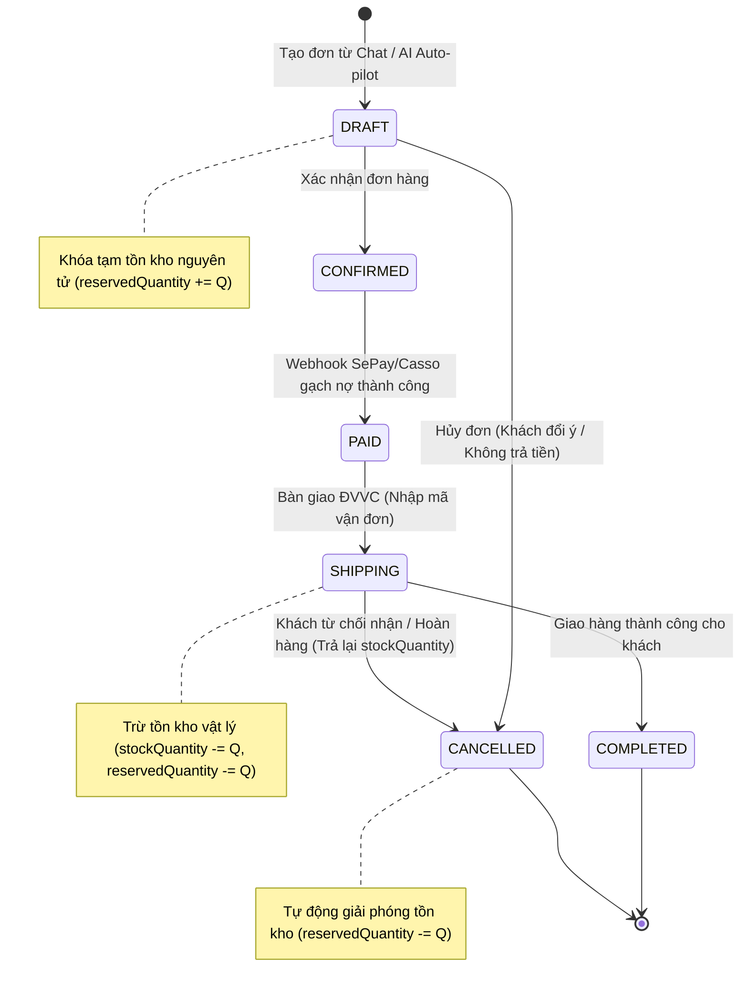
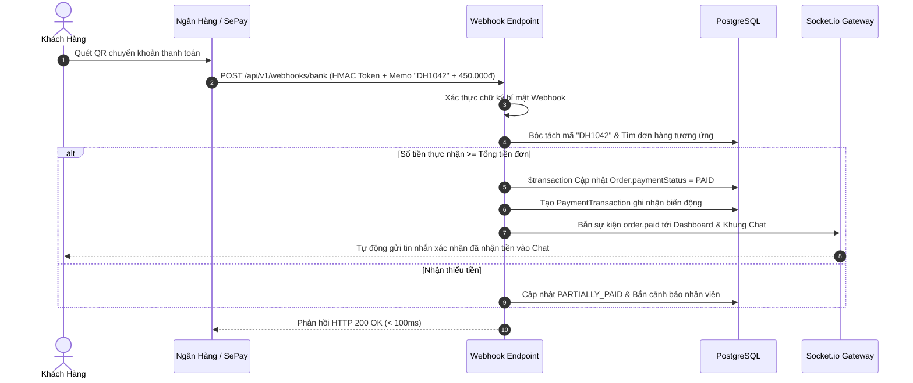

# RFC Kỹ Thuật: Phân Hệ Thương Mại D2C, Khóa Tồn Kho & VietQR

> **Tài liệu**: Đặc Tả Kiến Trúc Kỹ Thuật Lõi Thương Mại D2C (Commerce Technical RFC)\
> \*\***Dự án**: Sales Copilot Platform\
> \*\***Vị trí file**: `docs/architecture/rfc-commerce-and-orders.md`\
> \*\***Trạng thái**: Đã phê duyệt (Approved Baseline)\
> \*\***Tài liệu nghiệp vụ đối ứng**: `docs/product/prd-commerce-and-orders.md`

---

## 1. Tổng Quan Kiến Trúc Lõi Thương Mại (Commerce Core)

Phân hệ Thương Mại D2C (`CommerceSubsystem`) cung cấp một động cơ xử lý đơn hàng và tồn kho tập trung, phục vụ thống nhất cho 3 bề mặt nghiệp vụ:

1. **Khung Lên Đơn Nhanh Trong Chat**: Dành cho nhân viên tư vấn trực tiếp và AI Auto-pilot chốt đơn.
2. **Quản Trị Danh Mục & Kho Hàng (**`/products`**)**: Quản lý SKU, biến thể, nhập kho (`Stock In`) và kiểm kê (`Stock Adjustment`).
3. **Quản Lý Bán Hàng & Đơn Hàng (**`/orders`**)**: Quản trị danh sách đơn toàn workspace, xử lý giao vận và hủy đơn hoàn tồn.

---

## 2. Order State

---

## 4. Thuật Toán Khóa Tồn Kho Nguyên Tử 2 Tầng (Atomic Stock Reservation)

Để ngăn chặn triệt để tình trạng **bán vượt kho (Overselling)** và tránh lỗi **Deadlock CSDL (**`40P01`**)** khi nhiều nhân viên/AI cùng chốt đơn đồng thời:

$$\\text{Tồn kho Khả dụng (Available)} = \\text{Tồn kho Vật lý (Physical)} - \\text{Tồn kho Tạm giữ (Reserved)}$$

---

## 5. Quy Cách Thẻ Dynamic VietQR & Đối Soát Webhook

### 5.1. Định Dạng Mã VietQR Chuẩn EMVCo (NAPAS 247)

Mã VietQR được tạo động bằng thuật toán EMVCo Merchant-Presented Mode (MPM), kẹp mã đơn hàng và số tiền chính xác:

| Tag EMVCo | Tên trường | Giá trị thực tế mẫu | Ý nghĩa kỹ thuật |
| --- | --- | --- | --- |
| **00** | Format Indicator | `"01"` | Phiên bản chuẩn EMVCo |
| **01** | Initiation Method | `"12"` | QR động (Dynamic QR có kèm số tiền) |
| **38** | Merchant Account Info | Sub-tags: GUID + BIN + STK | GUID `"A000000727"`, BIN Ngân hàng (`"970422"` MBBank), Số tài khoản shop |
| **53** | Currency Code | `"704"` | Việt Nam Đồng (VND) |
| **54** | Transaction Amount | `"450000"` | Số tiền chính xác của đơn sau chiết khấu |
| **58** | Country Code | `"VN"` | Quốc gia Việt Nam |
| **62** | Additional Data (Memo) | `"DH1042"` | Mã nhận diện đơn hàng duy nhất |
| **63** | Checksum CRC-16 | `"E4F1"` | Mã kiểm tra toàn vẹn CRC-16 CCITT-FALSE |

### 5.2. Pipeline Đối Soát Webhook Ngân Hàng Tự Động (Instant Reconcile)

---

## 6. Khóa Chống Va Chạm Nhân Viên (Redis Sliding Lock)

- Khi nhân viên mở Khung Lên Đơn, client gửi Socket.io event `order.editing_started`.
- Backend tạo khóa trượt Redis: `lock:order:{workspaceId}:{conversationId}` với `TTL = 30 giây`.
- Nếu có nhân viên khác mở cùng hội thoại: Hệ thống hiển thị Banner cảnh báo đỏ và cung cấp nút **"Cướp quyền (Takeover)"** để chuyển quyền chỉnh sửa.
- Client gửi heartbeat mỗi 15 giây để duy trì khóa; tự động giải phóng khóa khi đóng khung hoặc sau 30 giây mất kết nối.