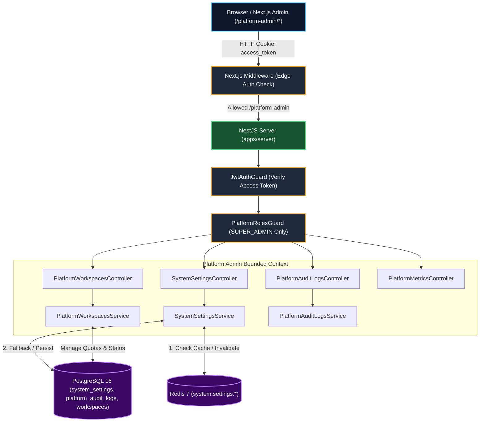

# RFC Kỹ Thuật: Cổng Super Admin Portal & Động Cơ Cấu Hình Động

| Siêu dữ liệu RFC | Giá trị |
| --- | --- |
| **Tiêu đề** | Cổng Super Admin Portal & Động Cơ Cấu Hình Động Toàn Sàn |
| **Trạng thái** | ĐÃ PHÊ DUYỆT (APPROVED BASELINE) |
| **Phân hệ phụ trách** | `apps/server` (`PlatformAdminModule`), `apps/web` (`(platform-admin)/platform-admin`), `packages/shared-contracts` |
| **Tài liệu liên quan** | [Super Admin PRD](../product/prd-super-admin.md), [Kiến Trúc Hệ Thống](./01-system-architecture.md), [AGENTS.md](../../AGENTS.md) |

---

## 1. Tổng Quan Kiến Trúc & Bối Cảnh

Sales Copilot hoạt động trên kiến trúc **Pragmatic Modular Monolith** đa người thuê (Multi-Tenancy). Ở cấp độ nghiệp vụ của người dùng cuối (Tenant Operations), mọi request đều bắt buộc phải kèm theo ngữ cảnh `workspaceId` được kiểm soát nghiêm ngặt bởi `WorkspaceGuard` và `x-workspace-id` header.

Tuy nhiên, đối với bộ phận quản trị nền tảng SaaS (Platform Administration), các tác vụ quản lý Workspaces, điều phối Quota, cấu hình Feature Flags, và theo dõi nhật ký kiểm toán mang tính chất **Cấp nền tảng (Cross-Tenant / Platform-Level)**.



---

## 2. Mô Hình Dữ Liệu Nền Tảng (Platform Data Models)

```prisma
// =============================================================================
// PLATFORM ADMINISTRATION MODELS
// =============================================================================

enum PlatformRole {
  SUPER_ADMIN // Quản trị viên toàn hệ thống
  USER        // Người dùng doanh nghiệp thông thường
}

enum SettingCategory {
  FEATURE_FLAGS // Cờ bật tắt module (commerce, ai, comment_masking)
  AI            // Cấu hình LLM mặc định (provider, model, temperature)
  BILLING       // Hạn mức quota mặc định theo gói
  SYSTEM        // Cấu hình bảo trì, thông báo toàn hệ thống
}

model SystemSetting {
  id          String          @id @default(uuid())
  key         String          @unique // Ví dụ: "feature.pos_vietqr_enabled"
  value       Json            // boolean, number, string, object
  category    SettingCategory
  description String?
  isPublic    Boolean         @default(false)
  updatedById String?
  updatedBy   User?           @relation("UserUpdatedSettings", fields: [updatedById], references: [id], onDelete: SetNull)
  createdAt   DateTime        @default(now())
  updatedAt   DateTime        @updatedAt

  @@index([category])
  @@map("system_settings")
}

model PlatformAuditLog {
  id         String   @id @default(uuid())
  actorId    String
  actor      User     @relation("PlatformAuditActor", fields: [actorId], references: [id], onDelete: Restrict)
  action     String   // Ví dụ: "setting.updated", "workspace.suspended"
  targetType String   // "SYSTEM_SETTING", "WORKSPACE", "USER"
  targetId   String?
  details    Json     @default("{}") // Payload diff: { old, new }
  ipAddress  String?
  userAgent  String?
  createdAt  DateTime @default(now())

  @@index([actorId])
  @@index([action])
  @@index([targetType, targetId])
  @@index([createdAt])
  @@map("platform_audit_logs")
}
```

---

## 3. Kiến Trúc Bộ Đệm 2 Tầng (2-Tier Dynamic Settings Engine)

Để đảm bảo hiệu năng tối đa, không gọi database PostgreSQL trên mỗi request kiểm tra Feature Flag:

```text
Request kiểm tra cờ (isFeatureEnabled)
  │
  ├──► Tầng 1: Kiểm tra Memory Cache / Redis (TTL 1 giờ)
  │      Key: system:settings:{key}
  │      Nếu HIT: Trả về kết quả ngay (< 1ms)
  │
  └──► Tầng 2: Cache MISS ➔ Truy vấn PostgreSQL
         Đồng thời ghi ngược lại Redis Cache
```

- **Vô hiệu hóa bộ đệm (Cache Invalidation)**: Khi `SUPER_ADMIN` cập nhật bất kỳ cấu hình nào qua API `PUT /platform-admin/settings/:key`, hệ thống sẽ cập nhật DB và phát lệnh xóa cache `system:settings:{key}` cùng `system:settings:all`.
- **Danh mục Settings Mặc định (Seed & Bootstrap)**:
  - `feature.pos_vietqr_enabled` (`boolean`): Bật/tắt thanh toán VietQR & Webhook tự động.
  - `feature.ai_autopilot_enabled` (`boolean`): Bật/tắt AI Auto-pilot chốt đơn 24/7.
  - `feature.comment_masking_enabled` (`boolean`): Bật/tắt ẩn bình luận chứa SĐT tự động.
  - `llm.default_provider` (`string`): Nhà cung cấp LLM mặc định (`"GEMINI"`).
  - `llm.default_model` (`string`): Model mặc định (`"gemini-2.5-flash"`).
  - `quotas.free.max_agents` (`number`): Số nhân sự tối đa gói Free (`2`).
  - `system.maintenance_mode` (`boolean`): Chế độ bảo trì hệ thống.

---

## 4. Thiết Kế Backend Module (`PlatformAdminModule`)

- **Bảo Vệ Đa Tầng**:
  - `JwtAuthGuard`: Xác thực token hợp lệ.
  - `PlatformRolesGuard`: Kiểm tra nghiêm ngặt `user.platformRole === 'SUPER_ADMIN'`.
- **API Endpoints Chuẩn**:
  - `GET /platform-admin/metrics`: Thống kê toàn sàn (tổng workspaces, active, đơn hàng, GMV).
  - `GET /platform-admin/workspaces`: Danh sách workspace, tìm kiếm, phân trang, lọc theo gói/trạng thái.
  - `PATCH /platform-admin/workspaces/:id/status`: Khóa hoặc mở khóa Workspace.
  - `GET /platform-admin/settings`: Danh sách cấu hình hệ thống theo category.
  - `PUT /platform-admin/settings/:key`: Cập nhật cấu hình & xóa cache Redis.
  - `GET /platform-admin/audit-logs`: Tra cứu nhật ký kiểm toán nền tảng.

---

## 5. Kiến Trúc Frontend (`apps/web/(platform-admin)/platform-admin`)

- **Cấu trúc Thư mục**:

  ```text
  apps/web/src/app/(platform-admin)/platform-admin/
  ├── layout.tsx              # Admin Master Layout (Sidebar + Header + Breadcrumb)
  ├── page.tsx                # Dashboard Metrics & Tổng quan
  ├── workspaces/page.tsx     # Bảng quản trị Workspaces
  ├── settings/page.tsx       # Bảng cấu hình động (Tabs: Feature Flags, AI, Quotas)
  └── audit-logs/page.tsx     # Bảng nhật ký kiểm toán nền tảng
  ```
- **Bảo vệ tại Edge (Next.js Middleware)**: Kiểm tra cookie `access_token` ở `/platform-admin/*`. Nếu không có hoặc `payload.role !== 'SUPER_ADMIN'`, chuyển hướng lập tức về trang chủ `/`.
- **Tái Sử Dụng Giao Diện**: 100% tái sử dụng 50+ Shadcn UI primitives.