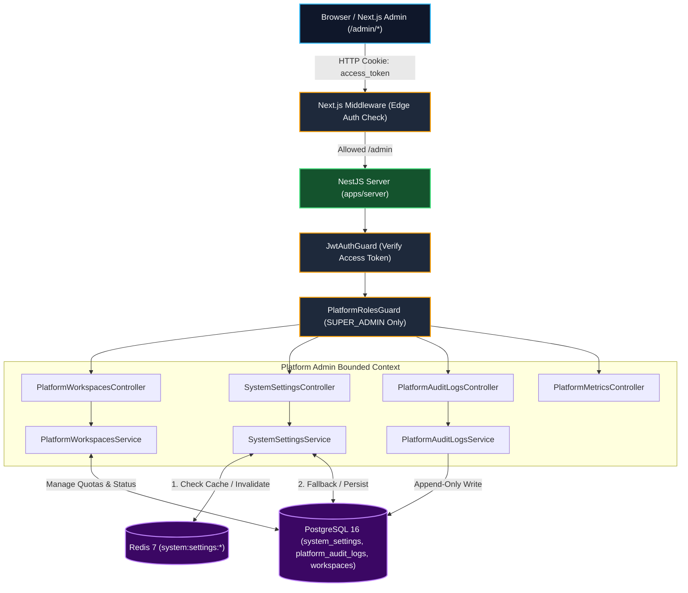
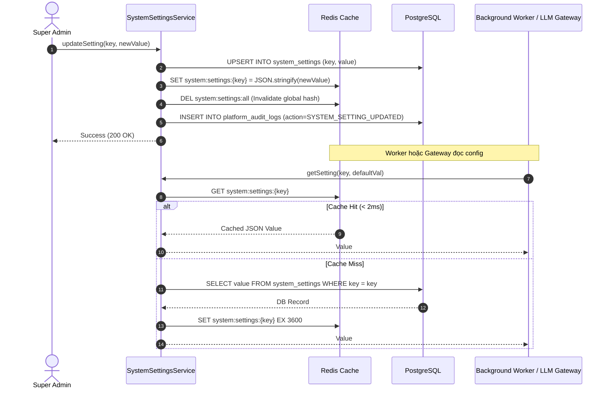

# Technical RFC: Super Admin Portal & Dynamic System Settings Engine

| RFC Metadata | Value |
| :--- | :--- |
| **RFC ID** | RFC-005 |
| **Title** | Super Admin Portal & Dynamic System Settings Engine |
| **Status** | 🟡 PROPOSED / APPROVED FOR IMPLEMENTATION |
| **Target Subsystems** | `apps/server` (`PlatformAdminModule`), `apps/web` (`(admin)/admin`), `packages/shared-contracts` |
| **Author** | Antigravity AI Platform Architect |
| **Related Documents** | [Super Admin PRD](../product/super-admin-prd.md), [System Architecture](./system-architecture.md), [AGENTS.md](../../AGENTS.md) |

---

## 1. Architectural Overview & Context

Sales Copilot hoạt động trên kiến trúc **Pragmatic Modular Monolith** đa người thuê (Multi-Tenancy). Ở cấp độ nghiệp vụ của người dùng cuối (Tenant Operations), mọi request đều bắt buộc phải kèm theo ngữ cảnh `workspaceId` được kiểm soát nghiêm ngặt bởi `WorkspaceGuard` và `x-workspace-id` header.

Tuy nhiên, đối với bộ phận quản trị nền tảng SaaS (Platform Administration), các tác vụ quản lý Workspaces, điều phối Quota, cấu hình Feature Flags, và theo dõi nhật ký kiểm toán mang tính chất **Cấp nền tảng (Cross-Tenant / Platform-Level)**.



---

## 2. Database Schema & Data Models

Bổ sung 2 models mới vào `apps/server/prisma/schema.prisma` và mở rộng model `Workspace` hiện hữu để hỗ trợ tạm khóa và kiểm toán.

### 2.1 Prisma Models Specification

```prisma
// =============================================================================
// PLATFORM ADMINISTRATION & DYNAMIC CONFIGURATION
// =============================================================================

model SystemSetting {
  key         String   @id
  value       Json
  category    String   @default("GENERAL") // GENERAL, FEATURE_FLAGS, AI, BILLING, SYSTEM
  description String?
  isEncrypted Boolean  @default(false)
  updatedBy   String?  // Super Admin User ID
  createdAt   DateTime @default(now())
  updatedAt   DateTime @updatedAt

  @@index([category])
  @@map("system_settings")
}

model PlatformAuditLog {
  id         String   @id @default(uuid())
  actorId    String   // Super Admin User ID
  actorEmail String   // Snapshot email at action time
  action     String   // WORKSPACE_SUSPENDED, WORKSPACE_ACTIVATED, QUOTA_UPDATED, PLAN_CHANGED, SYSTEM_SETTING_UPDATED
  targetType String   // WORKSPACE, SYSTEM_SETTING, USER
  targetId   String?  // Workspace ID, Setting Key, or User ID
  metadata   Json?    @default("{}") // oldValue, newValue, reason diff
  ipAddress  String?
  userAgent  String?
  createdAt  DateTime @default(now())

  @@index([actorId])
  @@index([action])
  @@index([targetType, targetId])
  @@index([createdAt])
  @@map("platform_audit_logs")
}
```

### 2.2 Mở rộng Model `Workspace`

```prisma
model Workspace {
  id              String          @id @default(uuid())
  name            String
  slug            String          @unique
  billingPlan     BillingPlanType @default(FREE)
  timezone        String          @default("Asia/Ho_Chi_Minh")
  defaultLanguage String          @default("vi")
  settings        Json            @default("{}")
  
  // Platform Administration Fields
  isSuspended     Boolean         @default(false)
  suspendedReason String?
  suspendedAt     DateTime?

  createdAt       DateTime        @default(now())
  updatedAt       DateTime        @updatedAt

  // ... relations remain unchanged ...
  @@map("workspaces")
}
```

> ⚠️ **In-Place Non-Breaking Invariant**: Việc thêm các trường `isSuspended`, `suspendedReason`, `suspendedAt` với giá trị `@default(false)` hoàn toàn tương thích ngược (Backward-Compatible) với toàn bộ dữ liệu hiện có trong Phase 1 và Phase 2.

---

## 3. Dynamic Configuration & 2-Tier Caching Architecture

### 3.1 Thiết kế Cache Redis (`SystemSettingsService`)

Mỗi khi hệ thống (Chat Engine, LLM Gateway, Throttler) truy vấn một giá trị cấu hình, việc truy vấn trực tiếp vào PostgreSQL trên mỗi tin nhắn đến sẽ gây thắt cổ chai hiệu năng. Do đó, giải pháp áp dụng **Bộ nhớ đệm 2 tầng (In-Memory + Redis)**:



### 3.2 Khóa Cache Redis & Danh mục Cấu hình
- **Key Pattern**:
  - `system:settings:{key}`: Lưu giá trị của 1 key cụ thể (TTL: 1 giờ, tự động làm mới khi write).
  - `system:settings:all`: Hash map chứa toàn bộ settings phục vụ render trang Settings Admin.
- **Danh mục Settings Mặc định (Seed & Bootstrap)**:

| Setting Key | Category | Kiểu dữ liệu | Giá trị mặc định | Mô tả |
| :--- | :--- | :--- | :--- | :--- |
| `feature.pos_vietqr_enabled` | `FEATURE_FLAGS` | `boolean` | `true` | Bật/tắt thanh toán VietQR & Webhook tự động |
| `feature.ai_autopilot_enabled` | `FEATURE_FLAGS` | `boolean` | `true` | Bật/tắt AI Auto-pilot chốt đơn 24/7 |
| `feature.comment_masking_enabled` | `FEATURE_FLAGS` | `boolean` | `true` | Bật/tắt ẩn bình luận chứa SĐT tự động |
| `feature.thermal_print_enabled` | `FEATURE_FLAGS` | `boolean` | `true` | Bật/tắt in phiếu gửi nhiệt K80/K58 |
| `llm.default_provider` | `AI` | `string` | `"GEMINI"` | Nhà cung cấp LLM mặc định |
| `llm.default_model` | `AI` | `string` | `"gemini-2.5-flash"` | Model mặc định cho tác vụ bán hàng |
| `llm.temperature_default` | `AI` | `number` | `0.3` | Nhiệt độ ngẫu nhiên đàm phán bán hàng |
| `quotas.free.max_agents` | `BILLING` | `number` | `2` | Số nhân sự tối đa cho gói FREE |
| `quotas.free.max_channels` | `BILLING` | `number` | `2` | Số kênh tối đa cho gói FREE |
| `quotas.free.storage_mb` | `BILLING` | `number` | `500` | Dung lượng lưu trữ tối đa gói FREE |
| `system.maintenance_mode` | `SYSTEM` | `boolean` | `false` | Chế độ bảo trì hệ thống |
| `system.banner_message` | `SYSTEM` | `string` | `""` | Thông báo nổi trên toàn hệ thống |

---

## 4. Backend Module Design (`PlatformAdminModule`)

### 4.1 Cơ chế Phân quyền (`PlatformRolesGuard`)

```typescript
// apps/server/src/modules/platform-admin/guards/platform-roles.guard.ts
@Injectable()
export class PlatformRolesGuard implements CanActivate {
  constructor(private readonly reflector: Reflector) {}

  canActivate(context: ExecutionContext): boolean {
    const requiredRoles = this.reflector.getAllAndOverride<PlatformRole[]>(
      PLATFORM_ROLES_KEY,
      [context.getHandler(), context.getClass()],
    );

    if (!requiredRoles || requiredRoles.length === 0) {
      return true;
    }

    const request = context.switchToHttp().getRequest<Request>();
    const user = request.user;

    if (!user || !user.role) {
      throw new ForbiddenException({
        code: 'PLATFORM_AUTH_REQUIRED',
        message: 'Platform authentication required to access this resource',
      });
    }

    if (!requiredRoles.includes(user.role)) {
      throw new ForbiddenException({
        code: 'INSUFFICIENT_PLATFORM_PERMISSIONS',
        message: 'Super administrator privileges required to access this resource',
      });
    }

    return true;
  }
}
```

### 4.2 Endpoints REST API Specification

Toàn bộ các endpoint đều có tiền tố `/platform-admin` và được bảo vệ bằng `@UseGuards(JwtAuthGuard, PlatformRolesGuard)` + `@PlatformRoles(PlatformRole.SUPER_ADMIN)`:

| Method | Endpoint | DTO Request | Response Code & Output | Mô tả chức năng |
| :--- | :--- | :--- | :--- | :--- |
| `GET` | `/platform-admin/metrics/overview` | - | `200` `{ totalWorkspaces, activeWorkspaces, suspendedWorkspaces, totalUsers, systemHealth }` | Thống kê tổng hợp vận hành |
| `GET` | `/platform-admin/workspaces` | `QueryWorkspacesDto` (page, limit, search, plan, status) | `200` `{ items: WorkspaceListItemDto[], meta: PaginationMeta }` | Danh sách Workspaces kèm pagination |
| `GET` | `/platform-admin/workspaces/:id` | - | `200` `WorkspaceDetailDto` | Chi tiết Workspace, Quotas, Usage |
| `PATCH`| `/platform-admin/workspaces/:id/plan` | `UpdateWorkspacePlanDto` (`billingPlan`, `quotas`) | `200` `WorkspaceDetailDto` | Cập nhật gói cước và quotas tùy chỉnh |
| `PATCH`| `/platform-admin/workspaces/:id/status` | `ToggleWorkspaceStatusDto` (`isSuspended`, `reason`) | `200` `WorkspaceDetailDto` | Tạm khóa hoặc mở khóa Workspace |
| `GET` | `/platform-admin/settings` | `QuerySettingsDto` (`category?`) | `200` `SystemSettingItemDto[]` | Danh sách cấu hình hệ thống |
| `PUT` | `/platform-admin/settings/:key` | `UpdateSystemSettingDto` (`value`, `description?`) | `200` `SystemSettingItemDto` | Cập nhật cấu hình & xóa cache Redis |
| `GET` | `/platform-admin/audit-logs` | `QueryAuditLogsDto` (page, limit, action, targetType) | `200` `{ items: PlatformAuditLogDto[], meta: PaginationMeta }` | Tra cứu nhật ký kiểm toán nền tảng |

---

## 5. Frontend Architecture (`apps/web`)

### 5.1 Next.js Route Hierarchy & Layout

```text
apps/web/src/app/(admin)/admin/
├── layout.tsx              # Admin Master Layout (AdminSidebar + Header + Breadcrumb)
├── page.tsx                # Dashboard Overview (KPI Metrics Cards + Health Status)
├── workspaces/
│   ├── page.tsx            # Workspaces Table + Search/Filter + Actions
│   └── [id]/page.tsx       # Workspace Detail (Metadata, Quota Usage, Members)
├── settings/
│   └── page.tsx            # Categorized Settings (Tabs: Feature Flags, AI, Quotas, System)
└── audit-logs/
    └── page.tsx            # Audit Trail Table + JSON Diff Dialog
```

### 5.2 Next.js Middleware Protection (`apps/web/src/middleware.ts`)

```typescript
// Trích đoạn logic bảo vệ trong middleware.ts
if (pathname.startsWith('/admin')) {
  const accessToken = request.cookies.get('access_token')?.value;
  if (!accessToken) {
    const loginUrl = new URL('/login', request.url);
    loginUrl.searchParams.set('redirect', pathname);
    return NextResponse.redirect(loginUrl);
  }

  try {
    // Decode JWT payload không verify signature ở Edge để đảm bảo latency < 1ms
    // Signature được verify tuyệt đối ở Backend API
    const base64Payload = accessToken.split('.')[1];
    const payload = JSON.parse(Buffer.from(base64Payload, 'base64').toString());

    if (payload.role !== 'SUPER_ADMIN') {
      // Người dùng không phải SUPER_ADMIN -> chặn và chuyển hướng về trang chủ
      return NextResponse.redirect(new URL('/', request.url));
    }
  } catch {
    return NextResponse.redirect(new URL('/login', request.url));
  }
}
```

---

## 6. Security, Invariants & Anti-Over-Engineering Checklist

1. ⛔ **Bảo vệ Multi-tenancy Phase 1**: Tuyệt đối không thay đổi logic `where: { id, workspaceId }` ở các controller thông thường.
2. 🔒 **Strict Role Elevation Guard**: Không có endpoint nào cho phép user tự nâng quyền lên `SUPER_ADMIN`. Quyền `SUPER_ADMIN` chỉ được gán trong database seed hoặc bởi một `SUPER_ADMIN` hiện hữu.
3. 📦 **Shadcn UI Reuse**: Toàn bộ UI Admin Portal tái sử dụng 52 primitives trong `apps/web/src/components/ui/` (`Table`, `Card`, `Switch`, `Badge`, `Tabs`, `Dialog`, `AlertDialog`). Không thêm thư viện UI bên ngoài.
4. 🚀 **Zero-Downtime Hot Reload**: Thay đổi setting kích hoạt ngay lập tức trên memory cache của server, không gây rớt socket connection của người dùng cuối.
