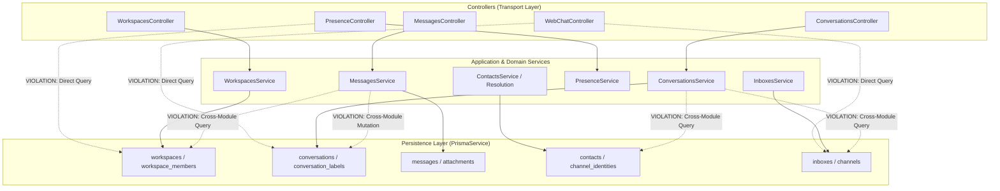

# Phase 2 — Architecture & Boundaries Audit Report

> **Document Status**: COMPLETED AUDIT REPORT  
> **Auditor**: Senior Backend Architect & Independent Code Reviewer  
> **Audit Phase**: Phase 2 — Architecture & Module Boundaries  
> **Target Scope**: Modular Monolith Architecture, Module Encapsulation, Dependency Direction, Layer Leakages, Circular Dependencies, God Classes (`apps/server/src/`)  
> **Execution Date**: August 27, 2026

---

## 1. Executive Summary & Architectural Verdict

A comprehensive architectural evaluation was conducted across all NestJS modules, controllers, application services, integration adapters, and infrastructure wrappers in `apps/server/src/`. The evaluation measured the active codebase against the architecture specifications in `docs/01-architecture-overview.md`, `docs/02-module-boundaries.md`, and the anti-over-engineering principles in `AGENTS.md`.

```text
                        ARCHITECTURE COMPLIANCE SUMMARY
                                       │
         ┌─────────────────────────────┼─────────────────────────────┐
         ▼                             ▼                             ▼
  STRENGTHS                     BOUNDARY LEAKS                COUPLING SMELLS
  • Zero Single-Impl Interfaces • Controller ➔ Prisma Bypass  • Cross-Module DB Mutations
  • Clean Adapter Isolation     • Transport ➔ DB in Gateway   • forwardRef in WebChatModule
  • Pure Event-Driven Decouple  • Route Header Inconsistency  • God Service in Conversations
```

### Key Architectural Strengths:
1. **Strict Adherence to Anti-Interface Explosion (`AGENTS.md` Rule 2.3)**: Zero single-implementation interfaces (`IUserService`, `IConversationService`, etc.) exist. Services are concrete `@Injectable()` classes, avoiding boilerplate indirection.
2. **Exemplary External Integration Isolation (Adapter Pattern)**: Third-party vendor SDKs and APIs (`@aws-sdk/client-s3`, Facebook Graph API, Telegram Bot API) are 100% encapsulated inside their respective adapters (`StorageService`, `FacebookAdapter`, `TelegramAdapter`). Zero vendor types leak into core domain services.
3. **No Transport Leakage into Domain Services**: Express `Request` and `Response` types are strictly confined to Controllers, Guards, Filters, and Interceptors. No `*.service.ts` file imports Express or Socket.io transport objects.
4. **Clean Event-Driven Side-Effect Decoupling**: Realtime WebSocket broadcasting, outbound webhook delivery, and automation rule evaluation are completely decoupled from core CRUD flows via `EventEmitter2`.

### Architectural Violations & Risks Identified:
1. **Controller ➔ Prisma Bypass (`FINDING-P2-01`)**: `PresenceController` and `WebChatController` directly inject `PrismaService` and execute raw queries, bypassing domain service boundaries.
2. **Cross-Module Direct Database Mutations (`FINDING-P2-02`)**: `MessagesService` directly updates the `conversation` table (mutating status, unread counts, and timestamps) bypassing `ConversationsService`. `ConversationsService` directly queries `contact`, `inbox`, `channelIdentity`, and `team` tables via Prisma instead of injecting their respective services.
3. **Circular Dependencies & `forwardRef` in WebChat (`FINDING-P2-03`)**: `WebChatModule` uses `forwardRef()` for `ContactsModule`, `MessagesModule`, and `ConversationsModule` due to tangled `@Global()` module scoping in `IntegrationsModule`.
4. **Transport-to-Database Leakage in Gateway (`FINDING-P2-04`)**: `RealtimeGateway` directly queries Prisma to check conversation existence and user workspace membership during socket room joins.
5. **God Service Smells (`FINDING-P2-05`)**: `ConversationsService` (822 lines) accumulates lifecycle state transitions, assignment, priority, unread counts, complex text search, and M:N junction management for labels with N+1 query loops.

---

## 2. Module Boundary & Dependency Direction Map

The following diagram illustrates the intended vs actual dependency directions across bounded contexts:



---

## 3. Detailed Architecture Findings

### [FINDING-P2-01] Controller-to-Database Direct Bypass in Presence and WebChat Controllers

- **Severity**: **HIGH**
- **Category**: Architecture & Separation of Concerns
- **Location**: `apps/server/src/modules/realtime/presence.controller.ts:21, 37, 98-105`, `apps/server/src/integrations/web-chat/web-chat.controller.ts:24, 68, 207-224, 252-267, 299-338`
- **Requirement Reference**: `AGENTS.md` Section 2.2, `docs/02-module-boundaries.md`

#### 1. Evidence
In `apps/server/src/modules/realtime/presence.controller.ts`:
```typescript
@Controller('workspaces/:workspaceId/presence')
export class PresenceController {
  constructor(
    private readonly presenceService: PresenceService,
    private readonly prisma: PrismaService, // ❌ Direct DB injection into controller
  ) {}

  private async verifyWorkspaceMembership(workspaceId: string, userId: string): Promise<void> {
    // ❌ Direct raw DB query in controller private helper
    const member = await this.prisma.getClient().workspaceMember.findFirst({
      where: { workspaceId, userId },
      select: { workspaceId: true },
    });

    if (!member) {
      throw new ForbiddenException({ code: 'FORBIDDEN', message: '...' });
    }
  }
}
```

In `apps/server/src/integrations/web-chat/web-chat.controller.ts`:
```typescript
@Controller('widget')
export class WebChatController {
  constructor(
    private readonly prisma: PrismaService, // ❌ Direct DB injection
    // ...
  ) {}

  @Get('conversations')
  async getVisitorConversations(@Req() req: Request) {
    const tokenPayload = this.authenticateVisitor(req);
    const client = this.prisma.getClient();

    // ❌ Direct raw DB query on conversation table in controller
    const conversations = await client.conversation.findMany({
      where: {
        workspaceId: tokenPayload.workspaceId,
        inboxId: tokenPayload.inboxId,
        contactId: tokenPayload.contactId,
      },
      // ...
    });
    return { items: conversations, ... };
  }
}
```

#### 2. Problem Description
Controllers are transport handlers responsible strictly for request validation, parameter unpacking, calling domain services, and returning response envelopes. Directly injecting `PrismaService` into controllers violates the layered architecture:
- Database query logic and business checks are embedded inside controllers.
- Unit testing controllers requires mocking Prisma client primitives instead of service contracts.
- In `PresenceController`, it also bypasses the standard `WorkspaceGuard`, creating architectural inconsistency across the REST API.

#### 3. Impact Analysis
High coupling between HTTP transport and database schema. Changes to database models or caching strategies will break controllers directly.

#### 4. Expected Behavior
Controllers must only interact with application/domain services. `PresenceController` should rely on `WorkspaceGuard` (or call `WorkspacesService.findMember`). `WebChatController` should delegate conversation queries to `ConversationsService`.

#### 5. Recommended Fix
1. Refactor `PresenceController` to use `@UseGuards(JwtAuthGuard, WorkspaceGuard)` and remove `PrismaService`.
2. Introduce a `listVisitorConversations` method in `ConversationsService` and inject `ConversationsService` into `WebChatController`.

#### 6. Verification Method
Verify that `grep -rn "PrismaService" apps/server/src/**/*.controller.ts` returns 0 results.

---

### [FINDING-P2-02] Cross-Module Direct Database Mutations Bypassing Aggregate Root & Domain Service

- **Severity**: **HIGH**
- **Category**: Domain & Module Boundaries
- **Location**: `apps/server/src/modules/messages/messages.service.ts:51-63, 86-98, 202-230`, `apps/server/src/modules/conversations/conversations.service.ts:81-148`
- **Requirement Reference**: `AGENTS.md` Section 4 ("Inter-Module Rules")

#### 1. Evidence
In `apps/server/src/modules/messages/messages.service.ts`:
```typescript
// 6d. Update Conversation Side-effects directly in MessagesService
const conversationUpdate: Record<string, unknown> = {
  lastActivityAt: now,
};

if (senderType === SenderType.CONTACT) {
  conversationUpdate.unreadMessagesCount = { increment: 1 };

  // Auto-reopen if RESOLVED or SNOOZED
  if (
    conversation.status === ConversationStatus.RESOLVED ||
    conversation.status === ConversationStatus.SNOOZED
  ) {
    conversationUpdate.status = ConversationStatus.OPEN;
    conversationUpdate.snoozedUntil = null;
    reopened = true;
  }
}

// ❌ MessagesService mutates Conversation table directly:
await trx.conversation.update({
  where: { id: conversationId },
  data: conversationUpdate,
});
```

In `apps/server/src/modules/conversations/conversations.service.ts`:
```typescript
// ❌ ConversationsService directly queries tables belonging to Contacts, Inboxes, and Teams modules:
const contact = await client.contact.findFirst({ where: { id: dto.contactId, workspaceId } });
const inbox = await client.inbox.findFirst({ where: { id: dto.inboxId, workspaceId } });
const identity = await client.channelIdentity.findFirst({ where: { id: dto.channelIdentityId, ... } });
const inboxMember = await client.inboxMember.findUnique({ where: { inboxId_userId: { ... } } });
const team = await client.team.findFirst({ where: { id: dto.teamId, workspaceId } });
```

#### 2. Problem Description
`AGENTS.md` Section 4 explicitly dictates:
> *"❌ DO NOT: Directly query or mutate another module's internal Prisma models without going through that module's exported service."*

Here, `MessagesService` bypasses `ConversationsService` and mutates `conversation` state directly. This causes:
- **Duplicated Domain Logic**: The auto-reopen state transition (`RESOLVED`/`SNOOZED` ➔ `OPEN`) is implemented in two separate places (`ConversationsService.updateStatus` and `MessagesService.create`).
- **Bypassing Domain Events**: `ConversationsService.updateStatus` emits `conversation.reopened` and `conversation.status_updated`. When `MessagesService` updates the status directly, it manually reconstructs only `conversation.reopened`, risking inconsistent event streams.
- **Tight Coupling**: `ConversationsService` acts as an unencapsulated client for 5 different modules' database tables instead of consuming exported service interfaces.

#### 3. Impact Analysis
If conversation lifecycle invariants or caching layers are modified in `ConversationsService`, `MessagesService` will silently bypass them, leading to corrupted state (e.g. unread count desynchronization, missed metrics, broken webhooks).

#### 4. Expected Behavior
`MessagesService` should delegate conversation mutations to a dedicated method on `ConversationsService` (e.g. `conversationsService.registerInboundMessageSideEffects(...)` or via domain events). `ConversationsService` should call `contactsService.findById()`, `inboxesService.getInboxById()`, etc.

#### 5. Recommended Fix
Export a clean method from `ConversationsService`:
```typescript
async onMessageReceived(
  workspaceId: string,
  conversationId: string,
  senderType: SenderType,
  tx?: any,
): Promise<{ reopened: boolean }>
```
And call this method from `MessagesService`.

#### 6. Verification Method
Verify that `MessagesService` contains no direct calls to `trx.conversation.update()`.

---

### [FINDING-P2-03] Circular Dependencies & Premature `forwardRef` in WebChatModule

- **Severity**: **MEDIUM**
- **Category**: Architecture & Module Wiring
- **Location**: `apps/server/src/integrations/web-chat/web-chat.module.ts:21-24`, `apps/server/src/integrations/integrations.module.ts:10-22`
- **Requirement Reference**: `AGENTS.md` Section 2.6 & Section 4

#### 1. Evidence
In `apps/server/src/integrations/web-chat/web-chat.module.ts`:
```typescript
@Module({
  imports: [
    DatabaseModule,
    InboxesModule,
    forwardRef(() => ContactsModule),      // ❌ forwardRef circular dependency workaround
    forwardRef(() => MessagesModule),      // ❌ forwardRef circular dependency workaround
    forwardRef(() => ConversationsModule), // ❌ forwardRef circular dependency workaround
  ],
  controllers: [WebChatController],
  providers: [WebChatAdapter, WebChatGateway, WidgetTokenService],
  exports: [WebChatAdapter, WebChatGateway, WidgetTokenService],
})
export class WebChatModule implements OnModuleInit { ... }
```

In `apps/server/src/integrations/integrations.module.ts`:
```typescript
@Global() // ❌ Global module exporting feature modules
@Module({
  imports: [DatabaseModule, InboxesModule, TelegramModule, FacebookModule, WebChatModule],
  providers: [ChannelAdapterRegistry, OutboundMessageListener],
  exports: [ChannelAdapterRegistry, OutboundMessageListener, TelegramModule, FacebookModule, WebChatModule],
})
export class IntegrationsModule {}
```

#### 2. Problem Description
`WebChatModule` uses three `forwardRef()` constructs to import `ContactsModule`, `MessagesModule`, and `ConversationsModule`.
This circular knot was introduced because:
1. `IntegrationsModule` is decorated with `@Global()` and exports `WebChatModule`.
2. `QueueModule` (also `@Global()`) runs `ChannelIngestionProcessor`, which requires `ConversationsService` and `MessagesService`.
3. `WebChatModule` directly exposes visitor REST endpoints and needs services from core modules.
When NestJS compiles the dependency graph at startup, global module scoping and cross-imports trigger circular dependency resolution errors, forcing the use of `forwardRef()`.

#### 3. Impact Analysis
`forwardRef()` increases application startup time, obscures real architectural dependency cycles, and makes isolated unit/integration testing of modules difficult.

#### 4. Expected Behavior
A clean dependency graph without circular imports:
`Core Domain Modules (Contacts, Inboxes, Conversations, Messages)` ➔ consumed by ➔ `Integrations / Ingestion Layer`.
Modules should communicate via cleanly exported services without `@Global()` propagation or circular `forwardRef` loops.

#### 5. Recommended Fix
Break the circular reference by:
1. Removing `@Global()` from `IntegrationsModule`; explicitly import `IntegrationsModule` only where needed.
2. Isolating `WebChatController` (which requires core modules) from `WebChatAdapter` (which only provides the channel adapter implementation).

#### 6. Verification Method
Remove `forwardRef()` from `web-chat.module.ts` and ensure `pnpm nx run server:serve` starts without circular dependency warnings.

---

### [FINDING-P2-04] Transport-to-Database Leakage in RealtimeGateway

- **Severity**: **MEDIUM**
- **Category**: Layer Boundary & Separation of Concerns
- **Location**: `apps/server/src/modules/realtime/realtime.gateway.ts:24, 62, 211-215, 339-343, 495-498`
- **Requirement Reference**: `docs/05-realtime-and-events.md`, `AGENTS.md` Section 8

#### 1. Evidence
In `apps/server/src/modules/realtime/realtime.gateway.ts`:
```typescript
@WebSocketGateway({ namespace: '/realtime', ... })
export class RealtimeGateway implements ... {
  constructor(
    private readonly tokenService: TokenService,
    private readonly prisma: PrismaService, // ❌ Direct DB injection into WebSocket Gateway
    // ...
  ) {}

  // In handleConnection:
  const memberships = await this.prisma.getClient().workspaceMember.findMany({
    where: { userId: payload.sub },
    select: { workspaceId: true },
  });

  // In handleJoinWorkspace:
  const isMember = await this.prisma.getClient().workspaceMember.findFirst({
    where: { userId: socketData.userId, workspaceId },
  });

  // In handleJoinConversation:
  const conversation = await this.prisma.getClient().conversation.findFirst({
    where: { id: conversationId },
    select: { id: true, workspaceId: true },
  });
```

#### 2. Problem Description
`RealtimeGateway` is a Transport Layer component (handling Socket.io connection lifecycle, socket rooms, and Redis adapter clustering). It directly queries Prisma database models (`workspaceMember`, `conversation`) to verify user membership and resource existence.
- The transport layer bypasses application services (`WorkspacesService`, `ConversationsService`).
- If authorization or tenancy checks change, `RealtimeGateway` must be updated alongside HTTP guards, violating DRY.

#### 3. Impact Analysis
Couples WebSocket gateway lifecycle to database connection pooling and schema structure. In distributed high-connection scenarios, each socket handshake directly queries the database instead of leveraging service caching.

#### 4. Expected Behavior
`RealtimeGateway` should inject `WorkspacesService` and `ConversationsService`, calling domain methods like `workspacesService.findUserWorkspaceIds(userId)` and `conversationsService.verifyWorkspaceAccess(conversationId, workspaceId)`.

#### 5. Recommended Fix
Replace `this.prisma.getClient().*` calls in `RealtimeGateway` with calls to `WorkspacesService` and `ConversationsService`.

#### 6. Verification Method
Verify `PrismaService` is no longer imported or injected in `realtime.gateway.ts`.

---

### [FINDING-P2-05] God Service Smells in ConversationsService & RealtimeGateway

- **Severity**: **MEDIUM**
- **Category**: Code Complexity & Single Responsibility
- **Location**: `apps/server/src/modules/conversations/conversations.service.ts` (822 lines), `apps/server/src/modules/realtime/realtime.gateway.ts` (809 lines)
- **Requirement Reference**: `AGENTS.md` Section 2.2 ("KISS & Direct Implementations")

#### 1. Evidence
In `apps/server/src/modules/conversations/conversations.service.ts`:
Accumulates **12 distinct responsibilities**:
1. Creation & cross-entity existence validation (lines 73–175)
2. State machine transitions & snooze validation (lines 177–281)
3. Agent & team assignment (lines 287–370)
4. Priority updates (lines 375–423)
5. Unread counter reset (lines 428–461)
6. Active contact/inbox lookup (lines 466–488)
7. Find or create conversation (lines 493–533)
8. By-ID retrieval with nested includes (lines 538–554)
9. Complex filtering, sorting, and ILIKE search with pagination (lines 559–644)
10. Label assignment with sequential N+1 query loop (lines 649–725)
11. Label removal (lines 730–790)
12. Label list retrieval (lines 795–821)

#### 2. Problem Description
While `AGENTS.md` encourages direct implementations over micro-folder sprawl, `ConversationsService` has grown into a God Service. In particular, managing `ConversationLabel` junction records (with loop queries) and complex search filtering can be cleanly separated without creating over-engineered layers.

#### 3. Impact Analysis
High cognitive load, merge conflict risks in collaborative sprints, and higher likelihood of regression when updating state machine logic.

#### 4. Expected Behavior
`ConversationsService` should focus on the Conversation aggregate root (Lifecycle, Status transitions, Assignment). Label junction operations should live in a cohesive `ConversationLabelsService` or be delegated to `LabelsService`.

#### 5. Recommended Fix
Extract label junction operations (`assignLabels`, `removeLabel`, `getLabels`) into `ConversationLabelsService` within the same `conversations` module folder (preserving co-location).

#### 6. Verification Method
Verify `conversations.service.ts` line count is reduced under 500 lines while all 863 tests continue to pass.

---

### [FINDING-P2-06] Route Consistency: URL Parameter vs Header for Workspace Resolution

- **Severity**: **LOW**
- **Category**: API & Transport Consistency
- **Location**: `apps/server/src/modules/realtime/presence.controller.ts:31` vs all other controllers
- **Requirement Reference**: `docs/07-api-and-contracts.md`

#### 1. Evidence
In `PresenceController`:
```typescript
@Controller('workspaces/:workspaceId/presence') // ❌ Uses URL param :workspaceId
export class PresenceController { ... }
```
In all other 10 workspace-scoped controllers (`ConversationsController`, `MessagesController`, `ContactsController`, `InboxesController`, `TeamsController`, etc.):
```typescript
@Controller('conversations')
@UseGuards(JwtAuthGuard, WorkspaceGuard, RolesGuard)
@ApiHeader({ name: 'X-Workspace-Id', required: true }) // ✅ Uses standard header
export class ConversationsController { ... }
```

#### 2. Problem Description
Across the entire platform, workspace-scoped tenant resolution is standardized on the `X-Workspace-Id` HTTP header via `WorkspaceGuard`. `PresenceController` is the sole exception, placing `:workspaceId` in the URL route path and bypassing `WorkspaceGuard`.

#### 3. Impact Analysis
Frontend API client SDK must maintain special-case routing logic specifically for presence endpoints instead of relying on the global HTTP interceptor that automatically attaches `X-Workspace-Id`.

#### 4. Expected Behavior
Route should be `@Controller('presence')`, protected by `WorkspaceGuard`, reading tenant context from `request.workspace.workspaceId`.

#### 5. Recommended Fix
Refactor `PresenceController` to `@Controller('presence')` with `@UseGuards(JwtAuthGuard, WorkspaceGuard)`.

#### 6. Verification Method
Verify that calling `GET /api/v1/presence` with `X-Workspace-Id` header succeeds.

---

## 4. Anti-Over-Engineering Assessment (`AGENTS.md` Principles)

| Rule | Requirement | Codebase Implementation | Evaluation |
| :--- | :--- | :--- | :---: |
| **Rule 2.1: YAGNI** | No speculative generality or unused toggles. | No premature features found; models strictly restricted to Phase 1. | ✅ **Pass** |
| **Rule 2.2: KISS** | Direct implementations over clean architecture layers. | Direct Prisma queries in services; minimal indirection layers. | ✅ **Pass** |
| **Rule 2.3: Anti-Interface** | No single-implementation interfaces. | 0 single-implementation interfaces. Concrete classes used directly. | ✅ **Pass** |
| **Rule 2.4: Anti-DTO Pipeline** | No Entity ➔ Domain ➔ Application ➔ Presenter mapping. | Single Zod schema per operation; direct DTO return via mappers. | ✅ **Pass** |
| **Rule 2.5: Rule of Three** | Do not abstract on first or second use. | Adapters extracted only because Facebook, Telegram, WebChat exist (3 implementations). | ✅ **Pass** |
| **Rule 2.6: Co-location** | Group related code cohesive in module folders. | Flat feature folders: controller, service, mapper, spec co-located. | ✅ **Pass** |

---

## 5. Phase 2 Architecture Sign-Off Assessment

| Dimension | Standard | Audit Result | Status |
| :--- | :--- | :--- | :---: |
| **Module Encapsulation** | Modules communicate via public services or events | 2 cross-module bypasses (`Messages` ➔ `Conversation` DB; `Conversations` ➔ `Contacts` DB). | 🟡 **Needs Hardening** |
| **Layered Separation** | Controllers do not query DB directly | 2 controllers inject `PrismaService` (`Presence`, `WebChat`). | 🟡 **Needs Hardening** |
| **Dependency Direction** | Clean DAG without circular imports | 3 `forwardRef()` calls in `WebChatModule`. | 🟡 **Needs Hardening** |
| **Third-Party Isolation** | Vendor SDKs behind adapters | 100% isolated (`Facebook`, `Telegram`, `MinIO S3`). | ✅ **Pass** |
| **Anti-Over-Engineering** | No bloated layers or fake interfaces | 100% compliant with `AGENTS.md` guidelines. | ✅ **Pass** |

### Summary Recommendation for Phase 2:
The architecture adheres remarkably well to the **Pragmatic Modular Monolith** principles of `AGENTS.md`. The code is readable, direct, and avoids over-engineering traps. 

The primary architectural debts are **boundary bypasses** where services and controllers directly query other modules' Prisma models rather than calling exported services. These issues should be queued for remediation in **Phase 10 (Hardening Sprint)**.
