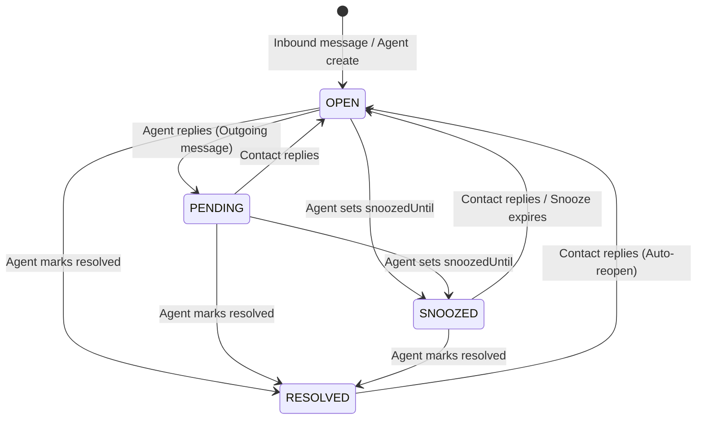

# Phase 3 — Domain & Business Logic Audit Report

> **Document Status**: COMPLETED AUDIT REPORT  
> **Auditor**: Senior Backend Architect & Independent Code Reviewer  
> **Audit Phase**: Phase 3 — Domain Model & Business Logic Invariants  
> **Target Scope**: Domain Rules (`docs/domain/business-rules.md`), State Machines (`ConversationsService`), Auto-Assignment (`AutoAssignmentService`), Contact Resolution & Merge (`ContactResolutionService`, `ContactMergeService`), Message Invariants (`MessagesService`), Automation Engine (`AutomationExecutorService`)  
> **Execution Date**: August 27, 2026

---

## 1. Executive Summary & Domain Health Verdict

A thorough and rigorous audit was performed against all domain models, business rules, lifecycle state machines, and aggregate invariants defined in `docs/domain/business-rules.md` and `docs/domain/domain-model.md`.

```text
                       DOMAIN INVARIANTS AUDIT MATRIX
                                       │
         ┌─────────────────────────────┼─────────────────────────────┐
         ▼                             ▼                             ▼
  LIFECYCLE & STATE MACHINE     ASSIGNMENT & WORKLOAD         CONTACT RESOLUTION
  • State Machine Matrix Solid  • Redis Distributed Lock      • Multi-Tier Match Working
  • Reopen Invariants Honored   • Silent Drop on Lock Clashing• Inbox Collision on Merge
  • Loop Guard Flawed in Rules  • Orphaned Assignees on Remove• Private Note Invariant Hole
```

### Domain Strengths:
1. **Strict Conversation State Transitions (BR-4.1)**: `ConversationsService.updateStatus` enforces an explicit lookup matrix (`ALLOWED_STATUS_TRANSITIONS`). Disallowed status jumps (e.g. `RESOLVED` directly to `PENDING` or `SNOOZED`) are properly rejected with `400 Bad Request`.
2. **Double-Checked Locking in Auto-Assignment (BR-4.2)**: `AutoAssignmentService` implements the double-checked locking pattern across Redis distributed locks to verify conversation eligibility before and after acquiring the lock.
3. **Multi-Tiered Contact Identification & Deduplication (BR-3.1 - BR-3.2)**: `ContactResolutionService` cleanly orchestrates identity lookup (`ChannelIdentity` ➔ `identifier` ➔ `email` ➔ `phoneNumber` ➔ atomic create).
4. **Sender Polymorphism Enforcement (BR-5.1)**: `MessagesService.create` strictly validates sender polymorphism constraints (`CONTACT` requires matching contactId, `USER` requires active workspace membership, `SYSTEM` requires null).

### Domain Invariant Deficiencies & Risks Identified:
1. **Flawed Automation Loop Guard (`FINDING-P3-01`)**: `AutomationRulesListener` checks `payload.performedBy?.type === 'AUTOMATION_RULE'`, but `ConversationsService.updateStatus` does not accept or emit `performedBy`, allowing event feedback loops when automation rules mutate status.
2. **Silent Drop & Starvation in Auto-Assignment Concurrency (`FINDING-P3-02`)**: When two inbound webhooks for the same inbox arrive simultaneously, the second call fails to acquire the Redis distributed lock and immediately returns `null`. Without a retry or queue, the second conversation is silently abandoned as unassigned.
3. **Invariant Violation on Member Removal (`FINDING-P3-03`)**: When an agent is removed from an inbox, active conversations remain assigned to that agent, violating the fundamental domain rule: *"Assignee must be an active member of the conversation's Inbox"*.
4. **Duplicate Active Conversations per Contact on Merge (`FINDING-P3-04`)**: Merging two contacts with active conversations on the same inbox creates multiple `OPEN` conversations for a single contact, turning older active conversations into unreachable ghost threads.
5. **Private Note Sender Invariant Hole (`FINDING-P3-05`)**: Contacts can submit messages with `isPrivate = true`, which is permitted by input validation.
6. **Unread Count Invariant on Resolved Conversations (`FINDING-P3-06`)**: Marking a conversation as `RESOLVED` does not clear `unreadMessagesCount`, leaving unread badges on closed tickets.

---

## 2. Business Rules & Invariants Verification Matrix

| Rule ID | Stated Rule Invariant | Implementation Location | Compliance | Audit Remarks |
| :--- | :--- | :--- | :---: | :--- |
| **BR-1.1** | Every operational record scoped to `workspaceId`. | All Services & Prisma Schemas | ✅ **Compliant** | Verified across all controllers and services. |
| **BR-1.2** | User must be an active `WorkspaceMember`. | `WorkspaceGuard`, `RolesGuard` | ✅ **Compliant** | Role hierarchy and membership verified. |
| **BR-1.3** | `InboxMember` must belong to the same Workspace. | `InboxesService.addMember` | ✅ **Compliant** | Explicitly validated before adding member. |
| **BR-2.1** | Inbox to Channel is strictly 1:1. | `schema.prisma:269` (`@unique`) | ✅ **Compliant** | Database-level unique constraint enforced. |
| **BR-2.2** | Inbound webhook idempotency by `(channelId, externalEventId)`. | `WebhooksService.handleInboundWebhook` | ⚠️ **Partial** | Race condition identified in Phase 1 & 4 (`FINDING-P1-04`). |
| **BR-2.3** | Channel credentials encrypted at rest. | `ChannelCredentialService` | ⚠️ **Partial** | Fallback key vulnerability identified in Phase 1 (`FINDING-P1-03`). |
| **BR-3.1** | Inbound Contact Resolution Chain. | `ContactResolutionService` | ✅ **Compliant** | 4-step resolution chain properly implemented. |
| **BR-3.2** | `Contact.identifier` unique per workspace. | `schema.prisma:205` | ✅ **Compliant** | Enforced by compound unique constraint. |
| **BR-3.3** | Contact Merge transfers identities & conversations. | `ContactMergeService.merge` | ⚠️ **Partial** | Leaves multiple active conversations on same inbox (`FINDING-P3-04`). |
| **BR-4.1** | Conversation State Machine transitions. | `ConversationsService.updateStatus` | ✅ **Compliant** | `ALLOWED_STATUS_TRANSITIONS` strictly enforced. |
| **BR-4.2** | Round-Robin Auto-Assignment to least-loaded online agent. | `AutoAssignmentService.assignConversation` | ⚠️ **Partial** | Lock collision causes silent abandonment (`FINDING-P3-02`). |
| **BR-4.3** | Unread count increment on incoming; reset on agent view. | `MessagesService.create`, `ConversationsService.resetUnreadCount` | ⚠️ **Partial** | Not reset when conversation is marked `RESOLVED` (`FINDING-P3-06`). |
| **BR-5.1** | Sender polymorphism validation. | `MessagesService.create:66-108` | ✅ **Compliant** | Strict validation of `CONTACT`, `USER`, `SYSTEM`. |
| **BR-5.2** | Content nullable if attachments exist. | `MessagesService.create:110-149` | ✅ **Compliant** | Rejects empty messages without attachments. |

---

## 3. State Machine Transition Verification (BR-4.1)



### Transition Validation Rules:
- **`OPEN` ➔ `PENDING`**: Permitted. Automatically executed when an agent sends an outgoing non-private message (`messages.service.ts:232`).
- **`OPEN` ➔ `SNOOZED`**: Permitted. Requires future `snoozedUntil` timestamp (`conversations.service.ts:227`).
- **`OPEN` ➔ `RESOLVED`**: Permitted.
- **`PENDING` ➔ `OPEN`**: Permitted. Automatically executed when contact sends a new inbound message.
- **`PENDING` ➔ `RESOLVED`**: Permitted.
- **`SNOOZED` ➔ `OPEN`**: Permitted. Clears `snoozedUntil` to null.
- **`RESOLVED` ➔ `OPEN`**: Permitted. Emits `conversation.reopened` event.
- **`RESOLVED` ➔ `PENDING`**: ❌ **Rejected with 400 Bad Request** (Correct).
- **`RESOLVED` ➔ `SNOOZED`**: ❌ **Rejected with 400 Bad Request** (Correct).

---

## 4. Detailed Domain Findings

### [FINDING-P3-01] Flawed Recursion Guard in Automation Rules Engine

- **Severity**: **HIGH**
- **Category**: Business Logic & Event Recursion
- **Location**: `apps/server/src/modules/automation-rules/automation-rules.listener.ts:118-120`, `apps/server/src/modules/conversations/conversations.service.ts:254-260`
- **Requirement Reference**: `F-1.9.1`, `F-1.9.2`

#### 1. Evidence
In `apps/server/src/modules/automation-rules/automation-rules.listener.ts`:
```typescript
@OnEvent('conversation.status_updated', { async: true })
async handleConversationStatusUpdated(payload: {
  workspaceId: string;
  conversationId: string;
  conversation?: ConversationResponseDto;
  performedBy?: { type: string; id?: string };
}): Promise<void> {
  // Loop prevention check:
  if (payload.performedBy?.type === 'AUTOMATION_RULE') {
    return; // ❌ Guard relies on performedBy being present
  }
  // Evaluates trigger CONVERSATION_STATUS_UPDATED...
}
```

In `apps/server/src/modules/conversations/conversations.service.ts`:
```typescript
async updateStatus(workspaceId: string, id: string, dto: UpdateConversationStatusDto, ...): Promise<ConversationResponseDto> {
  // ...
  this.eventEmitter.emit('conversation.status_updated', {
    workspaceId,
    conversationId: id,
    previousStatus: currentStatus,
    currentStatus: targetStatus,
    conversation: conversationDto,
    // ❌ DOES NOT PASS performedBy!
  });
}
```

#### 2. Problem Description
When an automation rule executes a `CHANGE_STATUS` action:
1. `AutomationExecutorService` calls `this.conversationsService.updateStatus(...)`.
2. `ConversationsService.updateStatus` emits `conversation.status_updated` without passing any `performedBy` metadata.
3. `AutomationRulesListener.handleConversationStatusUpdated` receives the event. Because `payload.performedBy` is `undefined`, the guard condition `payload.performedBy?.type === 'AUTOMATION_RULE'` evaluates to `false`.
4. The listener re-evaluates all active automation rules listening to `conversation.status_updated`, potentially triggering cascading rule executions or infinite feedback loops.

#### 3. Impact Analysis
If an organization configures two rules modifying conversation statuses (e.g. Rule A: "If priority is HIGH, set status to OPEN", Rule B: "If status is OPEN, evaluate and update"), the system enters an infinite loop, spamming events, audit logs, and consuming CPU/DB resources.

#### 4. Expected Behavior
`updateStatus` and other mutating methods must accept an optional `performedBy?: { type: string; id?: string }` parameter and forward it in all emitted domain events.

#### 5. Recommended Fix
Update `ConversationsService.updateStatus`:
```typescript
async updateStatus(
  workspaceId: string,
  id: string,
  dto: UpdateConversationStatusDto,
  tx?: any,
  performedBy?: { type: string; id?: string },
): Promise<ConversationResponseDto> {
  // ...
  this.eventEmitter.emit('conversation.status_updated', {
    workspaceId,
    conversationId: id,
    previousStatus: currentStatus,
    currentStatus: targetStatus,
    conversation: conversationDto,
    performedBy,
  });
}
```
And pass `{ type: 'AUTOMATION_RULE', id: rule.id }` from `AutomationExecutorService`.

#### 6. Verification Method
Configure an automation rule triggered on `CONVERSATION_STATUS_UPDATED` that executes `CHANGE_STATUS` and verify that execution terminates cleanly after 1 iteration.

---

### [FINDING-P3-02] Silent Drop & Starvation in Auto-Assignment Concurrency

- **Severity**: **HIGH**
- **Category**: Concurrency & Invariant Enforcement
- **Location**: `apps/server/src/modules/conversations/auto-assignment.service.ts:84-93`
- **Requirement Reference**: `BR-4.2`

#### 1. Evidence
In `apps/server/src/modules/conversations/auto-assignment.service.ts`:
```typescript
// 2. Acquire Redis distributed lock per inbox
const lockKey = `${this.LOCK_PREFIX}:${conversation.inboxId}`;
const lockToken = await this.redis.acquireLock(lockKey, this.LOCK_TTL_MS);

if (!lockToken) {
  this.logger.warn(
    `Could not acquire auto-assignment lock for inbox '${conversation.inboxId}' (in-flight assignment in progress)`,
  );
  return null; // ❌ Immediately gives up and returns null!
}
```
In `apps/server/src/modules/conversations/auto-assignment.listener.ts`:
```typescript
@OnEvent('conversation.created', { async: true })
async handleConversationCreated(payload: { workspaceId: string; conversation: ConversationResponseDto }): Promise<void> {
  // Fire-and-forget:
  await this.autoAssignmentService.assignConversation(payload.workspaceId, payload.conversation.id);
  // ❌ If lock fails, error is logged and nothing is retried.
}
```

#### 2. Problem Description
Auto-assignment uses a distributed lock with TTL 3000ms to ensure least-loaded counts and round-robin circular queues are calculated without race conditions.
However, when two conversations arrive simultaneously on the same inbox:
- Conversation A acquires the lock and begins assignment.
- Conversation B attempts to acquire the lock, fails, logs a warning, and **immediately returns `null`**.
- There is no BullMQ queue, no delayed retry, and no background worker to re-evaluate unassigned conversations.
- Conversation B remains in `OPEN` status with `assigneeId = null` indefinitely, even though qualified online agents are available.

#### 3. Impact Analysis
In active customer support environments with bursty traffic, new customer conversations are silently dropped from auto-assignment, remaining unseen by agents unless manually refreshed or triaged.

#### 4. Expected Behavior
When lock acquisition fails due to concurrent in-flight assignment, the system should either:
1. Retry lock acquisition with exponential jitter (e.g. up to 3 attempts with 200ms backoff), OR
2. Dispatch an auto-assignment job to a BullMQ queue with automatic retries.

#### 5. Recommended Fix
Implement lock retry with backoff in `AutoAssignmentService`:
```typescript
let lockToken: string | null = null;
for (let attempt = 1; attempt <= 3; attempt++) {
  lockToken = await this.redis.acquireLock(lockKey, this.LOCK_TTL_MS);
  if (lockToken) break;
  await new Promise(res => setTimeout(res, 200 * attempt));
}
if (!lockToken) return null;
```

#### 6. Verification Method
Dispatch two simultaneous `conversation.created` events for the same inbox and verify that both conversations are successfully assigned to agents.

---

### [FINDING-P3-03] Invariant Violation: Conversations Retain Assignees After Removal from Inbox

- **Severity**: **HIGH**
- **Category**: Domain Model & Referential Invariants
- **Location**: `apps/server/src/modules/inboxes/inboxes.service.ts:586-606`
- **Requirement Reference**: `BR-1.3`, `BR-4.2`

#### 1. Evidence
In `apps/server/src/modules/inboxes/inboxes.service.ts`:
```typescript
async removeMember(workspaceId: string, inboxId: string, userId: string) {
  // ...
  const existing = await client.inboxMember.findFirst({
    where: { inboxId, userId },
  });
  // ...
  await client.inboxMember.delete({
    where: { id: existing.id },
  });
  // ❌ Deletes membership, but does nothing to conversations currently assigned to userId in this inbox!
  return { success: true, message: 'Member removed from inbox successfully' };
}
```
In `apps/server/src/modules/conversations/conversations.service.ts:313-326`:
```typescript
// Assignment invariant:
const inboxMember = await client.inboxMember.findUnique({
  where: { inboxId_userId: { inboxId: existing.inboxId, userId: dto.assigneeId } },
});
if (!inboxMember) {
  throw new BadRequestException({ code: 'ASSIGNEE_NOT_IN_INBOX', ... });
}
```

#### 2. Problem Description
The platform enforces a strict domain invariant during assignment: **An agent cannot be assigned to a conversation unless they are an active member of that conversation's Inbox**.
However, when an administrator removes an agent from an inbox (`removeMember`):
1. The `InboxMember` record is deleted.
2. All conversations currently assigned to that agent in that inbox **remain assigned to that agent**.
3. The domain state becomes invalid: conversations are assigned to an agent who is not an inbox member.
4. Furthermore, because `assigneeId !== null`, auto-assignment will never reassign these tickets. The tickets become "orphaned" under a deactivated agent.

#### 3. Impact Analysis
Removed or transferred agents retain ownership of active customer conversations in inboxes they no longer have access to, causing customer messages to go unanswered.

#### 4. Expected Behavior
When removing an agent from an inbox:
1. All `OPEN` or `PENDING` conversations assigned to that agent in that inbox must be unassigned (`assigneeId = null`), AND
2. Emit an event or trigger auto-assignment to re-route those conversations to remaining active inbox members.

#### 5. Recommended Fix
In `InboxesService.removeMember`, execute inside a transaction:
```typescript
await tx.conversation.updateMany({
  where: {
    workspaceId,
    inboxId,
    assigneeId: userId,
    status: { in: [ConversationStatus.OPEN, ConversationStatus.PENDING] },
  },
  data: { assigneeId: null },
});
```

#### 6. Verification Method
Assign a conversation to Agent A in Inbox 1, remove Agent A from Inbox 1, and verify that the conversation's `assigneeId` is reset to `null`.

---

### [FINDING-P3-04] Contact Merge Duplicates Active Conversations on Same Inbox

- **Severity**: **MEDIUM**
- **Category**: Domain Integrity & Aggregate Invariants
- **Location**: `apps/server/src/modules/contacts/contact-merge.service.ts:84-89`
- **Requirement Reference**: `BR-3.3`

#### 1. Evidence
In `apps/server/src/modules/contacts/contact-merge.service.ts`:
```typescript
// 3. Transfer Conversations from mergee to base
await tx.conversation.updateMany({
  where: { contactId: mergeeContactId, workspaceId },
  data: { contactId: baseContactId },
});
```
In `apps/server/src/modules/conversations/conversations.service.ts:466-488`:
```typescript
async findActiveByContactAndInbox(workspaceId: string, contactId: string, inboxId: string): Promise<ConversationResponseDto | null> {
  const active = await client.conversation.findFirst({
    where: {
      workspaceId,
      contactId,
      inboxId,
      status: { in: [ConversationStatus.OPEN, ConversationStatus.PENDING, ConversationStatus.SNOOZED] },
    },
    orderBy: { lastActivityAt: 'desc' }, // ❌ Picks only the newest conversation!
  });
  return active ? mapConversationToDto(active) : null;
}
```

#### 2. Problem Description
If Contact A has an active `OPEN` conversation on Inbox 1, and Contact B also has an active `OPEN` conversation on Inbox 1:
When Contact B is merged into Contact A, `updateMany` updates `contactId` on all conversations.
As a result:
- Contact A now has **two simultaneous `OPEN` conversations on Inbox 1**.
- When Contact A sends a new message on Inbox 1, `findActiveByContactAndInbox` picks only the one with the latest `lastActivityAt`.
- The second active conversation is left abandoned as a ghost conversation, never receiving updates.

#### 3. Impact Analysis
Confusing split conversation histories, fragmentation of customer context, and cluttering the agent inbox with duplicate open tickets for the same user.

#### 4. Expected Behavior
During contact merge, check if both contacts have an active conversation on the same inbox:
- If so, resolve the older active conversation with an explanatory private note: *"Automatically resolved due to contact merge with Contact #${baseContactId}"*, or merge message histories into the primary conversation.

#### 5. Recommended Fix
In `ContactMergeService`, detect duplicate active conversations on identical inboxes and transition the secondary active conversation to `RESOLVED`.

#### 6. Verification Method
Merge two contacts each having an `OPEN` conversation in the same inbox and verify that only 1 conversation remains in `OPEN` status.

---

### [FINDING-P3-05] Missing Validation: External Contacts Can Submit "Private Notes"

- **Severity**: **MEDIUM**
- **Category**: Domain Invariants & Validation
- **Location**: `apps/server/src/modules/messages/messages.service.ts:65-108, 156`
- **Requirement Reference**: `BR-5.1`, `FR-4.4`

#### 1. Evidence
In `apps/server/src/modules/messages/messages.service.ts`:
```typescript
async create(workspaceId: string, conversationId: string, dto: CreateMessageDto, ...): Promise<MessageResponseDto> {
  // ...
  const isPrivate = dto.isPrivate ?? false;
  // ❌ No check that isPrivate is false when senderType === SenderType.CONTACT!
```

#### 2. Problem Description
Private notes (`isPrivate = true`) represent confidential, agent-only internal communication (e.g. agent mentions, internal checklists, manager instructions). They are never visible to contacts.
However, `MessagesService.create` does not validate that `isPrivate === true` is restricted strictly to `senderType === SenderType.USER`.
If an API caller submits a message with `senderType = 'CONTACT'` and `isPrivate = true`, the system saves the customer's message as a private note.

#### 3. Impact Analysis
Customer messages flagged as private will be completely hidden from the customer widget and will bypass normal auto-reopen triggers (`messages.service.ts:223`), causing customer inquiries to be missed.

#### 4. Expected Behavior
Enforce invariant: `if (senderType === SenderType.CONTACT && isPrivate) throw new BadRequestException(...)`.

#### 5. Recommended Fix
Add validation in `MessagesService.create`:
```typescript
if (senderType === SenderType.CONTACT && isPrivate) {
  throw new BadRequestException({
    code: 'INVALID_PRIVATE_NOTE',
    message: 'Contacts cannot author private notes',
  });
}
```

#### 6. Verification Method
Send a request with `senderType: 'CONTACT'` and `isPrivate: true` and verify that the API returns `400 Bad Request`.

---

### [FINDING-P3-06] Resolved Conversations Retain Unread Counter If Unviewed

- **Severity**: **LOW**
- **Category**: Domain Invariants & Lifecycle
- **Location**: `apps/server/src/modules/conversations/conversations.service.ts:243-250`
- **Requirement Reference**: `BR-4.3`

#### 1. Evidence
In `apps/server/src/modules/conversations/conversations.service.ts`:
```typescript
// In updateStatus:
const updated = await client.conversation.update({
  where: { id },
  data: {
    status: targetStatus,
    snoozedUntil: snoozedUntilDate,
    // ❌ unreadMessagesCount is NOT reset to 0 when targetStatus === RESOLVED!
  },
  include: CONVERSATION_STANDARD_INCLUDE,
});
```

#### 2. Problem Description
Under `BR-4.3`, unread counters should be cleared when tickets are resolved.
If a conversation has 3 unread messages and an agent marks it as `RESOLVED` directly from a list view or via an automation rule, `updateStatus` transitions the status to `RESOLVED` but leaves `unreadMessagesCount = 3`.

#### 3. Impact Analysis
The "Resolved" inbox folder displays unread notification badges, confusing agents into thinking action is required on closed tickets.

#### 4. Expected Behavior
Transitioning to `RESOLVED` should reset `unreadMessagesCount: 0`.

#### 5. Recommended Fix
In `ConversationsService.updateStatus`, add:
```typescript
data: {
  status: targetStatus,
  snoozedUntil: snoozedUntilDate,
  ...(targetStatus === ConversationStatus.RESOLVED && { unreadMessagesCount: 0 }),
}
```

#### 6. Verification Method
Mark a conversation with unread messages as `RESOLVED` and verify that `unreadMessagesCount` is `0`.

---

## 5. Phase 3 Domain Sign-Off Assessment

| Dimension | Standard | Audit Result | Status |
| :--- | :--- | :--- | :---: |
| **State Machine Integrity** | Strict status transition guards | Fully enforced via `ALLOWED_STATUS_TRANSITIONS`. | ✅ **Pass** |
| **Auto-Assignment Fairness** | Round-robin least-loaded with lock | Lock clashing drops requests without retry (`FINDING-P3-02`). | 🟡 **Needs Hardening** |
| **Member Removal Invariant** | Conversations unassigned when member removed | Conversations retain deleted inbox members (`FINDING-P3-03`). | 🔴 **Critical Action Required** |
| **Contact Deduplication** | Merge preserves integrity | Active conversation collision on merge (`FINDING-P3-04`). | 🟡 **Needs Hardening** |
| **Message Polymorphism** | Strict sender & privacy rules | Contact can send private notes (`FINDING-P3-05`). | 🟡 **Needs Hardening** |
| **Automation Rule Loops** | Recursion prevention guards | Event loop guard broken due to missing payload metadata (`FINDING-P3-01`). | 🔴 **Critical Action Required** |

### Summary Recommendation for Phase 3:
The core domain model demonstrates strong architectural discipline with clear state transitions, proper polymorphic sender checks, and clean contact identification. 

The primary business logic risks are **lifecycle side-effects** (removing an inbox member leaving orphaned assignees, automation rule event loop guard failure, and concurrent auto-assignment drops). These findings should be queued for remediation in **Phase 10 (Hardening Sprint)**.
