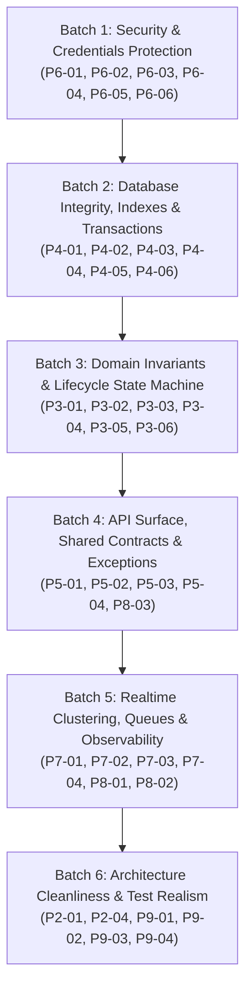

# Phase 10 — Master Hardening & Remediation Plan

> **Document Status**: APPROVED MASTER REMEDIATION PLAN  
> **Auditor / Architect**: Senior Backend Architect & Technical Lead  
> **Phase**: Phase 10 — System Hardening, Defect Remediation & Production Readiness  
> **Baseline Audit Coverage**: Phase 1 through Phase 9 (33 Findings: 4 Critical, 14 High, 9 Medium, 6 Low)  
> **Execution Mode**: Phased Batch Execution with Strict Regression Gates  
> **Target Delivery**: Production-Ready Backend Monolith  
> **Execution Date**: August 27, 2026

---

## 1. Executive Summary & Remediation Strategy

Across the 9 comprehensive audit phases, the Sales Copilot backend architecture was evaluated for requirement compliance, architectural boundaries, domain invariants, database integrity, API contract consistency, multi-tenancy security, realtime clustering, observability, and test fidelity.

The platform exhibits an exceptionally solid core:
- Clean modular monolith boundaries with zero premature microservices.
- OWASP-grade Argon2id hashing and RFC 6749 atomic token rotation.
- Tenant isolation guards (`WorkspaceGuard`) enforcing database-level membership verification.
- Fast unit test execution (863 tests passing in 15.3s).

However, **33 specific findings** were uncovered that must be systematically remediated before production traffic is routed to the platform:

```text
                             FINDINGS SEVERITY PYRAMID
                                       ▲
                                      / \
                                     / 4 \    CRITICAL (Immediate Data/Security Risk)
                                    /-----\
                                   /  14   \  HIGH (Correctness, Invariants & Scale)
                                  /---------\
                                 /     9     \ MEDIUM (Hardening, Performance & Gaps)
                                /-------------\
                               /       6       \ LOW / INFO (Housekeeping & Docs)
                              -------------------
```

### Core Remediation Directives:
1. **No Speculative Rewrites (KISS & YAGNI)**: Maintain existing Pragmatic Modular Monolith architecture. Do not introduce new abstract layers, interfaces, or microservices. Fix the root cause directly in existing service methods.
2. **Strict Batch Dependency Order**: Remediate in sequential batches where foundational layers (Security, Database, Contracts) are fixed before downstream event consumers and tests.
3. **Zero Breaking Changes for Compliant Clients**: Preserve existing REST endpoints and WebSocket event schemas defined in `@sales-copilot/shared-contracts`.
4. **Verification at Every Step**: Every batch must be verified with `pnpm nx test server` and specific automated regression checks before proceeding to the next batch.

---

## 2. Master Remediation Roadmap (Batch DAG)



---

## 3. Batch 1: Security & Sensitive Data Protection (Immediate Hotfixes)

> **Objective**: Eliminate all plaintext secret disclosures, prevent agent impersonation, secure Telegram webhooks, and harden transport headers.

### Detailed Action Items:

| Task ID | Finding ID | Severity | File(s) to Modify | Exact Blueprint / Change Description |
| :--- | :--- | :---: | :--- | :--- |
| **T10.1.1** | `FINDING-P6-01` | **CRITICAL** | `apps/server/src/modules/inboxes/inboxes.service.ts`<br>`apps/server/src/modules/inboxes/inboxes.controller.ts` | **Mask Plaintext Credentials**: In `mapChannelDetail`, replace `this.decryptCredentials(channel.credentials)` with a masked indicator `{ isConfigured: channel.isConnected, hasSecret: Boolean(channel.credentials?.encrypted) }`. Do NOT return decrypted tokens in `GET /api/v1/inboxes/:id`. |
| **T10.1.2** | `FINDING-P6-02` | **CRITICAL** | `apps/server/src/modules/messages/messages.controller.ts`<br>`apps/server/src/modules/messages/messages.service.ts` | **Prevent Agent Impersonation**: In `MessagesController.create`, force `payload.senderId = user.userId` for authenticated users. In `MessagesService.create`, verify `if (senderType === SenderType.USER && dto.senderId !== actorUserId) throw new ForbiddenException(...)`. |
| **T10.1.3** | `FINDING-P6-03` | **HIGH** | `apps/server/src/integrations/telegram/telegram.adapter.ts` | **Authenticate Telegram Webhooks**: In `verifyWebhook`, if `configuredSecret` is missing, reject with `false`. Use `crypto.timingSafeEqual(Buffer.from(secretTokenValue), Buffer.from(configuredSecret))` for constant-time comparison. |
| **T10.1.4** | `FINDING-P6-04` | **HIGH** | `apps/server/src/config/env.validation.ts`<br>`apps/server/src/modules/inboxes/channel-credential.service.ts` | **Enforce Encryption Key**: Add `CHANNEL_ENCRYPTION_KEY` to `env.validation.ts` (min 32 bytes). Remove hardcoded fallback `'0123456789abcdef...'` from `ChannelCredentialService`. |
| **T10.1.5** | `FINDING-P6-05` | **MEDIUM** | `apps/server/src/main.ts` | **Harden Transport & CORS**: Install and apply `helmet()`. Replace `origin: '*'` with dynamic origin reflection or comma-separated whitelist from `CORS_ORIGIN`. |
| **T10.1.6** | `FINDING-P6-06` | **MEDIUM** | `apps/server/src/modules/auth/auth.controller.ts` | **Login Rate Limiting**: Apply `@Throttle({ default: { limit: 5, ttl: 60000 } })` to `POST /auth/login` to thwart brute-force password guessing. |

### Verification Checklist for Batch 1:
- [ ] `GET /api/v1/inboxes/:id` as `VIEWER` returns no plaintext secrets.
- [ ] Authenticated agent cannot send messages with another agent's `senderId`.
- [ ] Telegram webhook without valid secret header returns `401 Unauthorized`.
- [ ] Server refuses to start if `CHANNEL_ENCRYPTION_KEY` is missing in `.env`.
- [ ] Response headers contain `X-Frame-Options` and `Strict-Transport-Security`.

---

## 4. Batch 2: Database Integrity, Indexes & Transactions

> **Objective**: Resolve PostgreSQL transaction abort states, eliminate catastrophic cascade deletions, add missing foreign key indexes, and prevent unique constraint race conditions.

### Detailed Action Items:

| Task ID | Finding ID | Severity | File(s) to Modify | Exact Blueprint / Change Description |
| :--- | :--- | :---: | :--- | :--- |
| **T10.2.1** | `FINDING-P4-01` | **CRITICAL** | `apps/server/src/modules/workspaces/workspaces.service.ts` | **Fix Transaction Abort (`25P02`)**: In `createWorkspaceWithUniqueSlug`, resolve the slug collision **BEFORE** entering `runInTransaction` using `findUnique({ where: { slug } })` loop, OR use savepoints (`SAVEPOINT`) so that collision errors do not abort the parent transaction block. |
| **T10.2.2** | `FINDING-P4-02` | **CRITICAL** | `apps/server/prisma/schema.prisma`<br>`apps/server/src/modules/contacts/contacts.service.ts` | **Prevent Cascade Ticket Deletion**: In `schema.prisma`, change `Conversation.contact` relation from `onDelete: Cascade` to `onDelete: Restrict`. In `ContactsService.delete`, enforce soft deletion or block deletion if active conversations exist. Generate Prisma migration. |
| **T10.2.3** | `FINDING-P4-03` | **HIGH** | `apps/server/prisma/schema.prisma`<br>`apps/server/src/integrations/web-chat/web-chat.controller.ts` | **Eliminate Table Scan in WebChat**: Store deterministic SHA-256 hash `tokenHash = sha256(widgetToken)` in `channel.settings` or `providerAccountId` with a database index. Replace global `findMany` with `findFirst({ where: { providerAccountId: tokenHash } })`. |
| **T10.2.4** | `FINDING-P4-04` | **HIGH** | `apps/server/prisma/schema.prisma` | **Add Missing Database Indexes**: Add compound indexes in `schema.prisma`: `@@index([workspaceId, senderType, senderId])` on `Message`, `@@index([userId])` on `InboxMember` and `TeamMember`, and `@@index([workspaceId, teamId])` on `Conversation`. Generate Prisma migration. |
| **T10.2.5** | `FINDING-P4-05` | **HIGH** | `apps/server/src/modules/webhooks/webhooks.service.ts` | **Handle Webhook P2002 Collision**: Wrap `channelEvent.create` in a `try...catch`. If Prisma throws `P2002` (unique constraint on `channelId, externalEventId`), catch gracefully and return `{ duplicated: true, eventId }` instead of bubbling a 500 error. |
| **T10.2.6** | `FINDING-P4-06` | **MEDIUM** | `apps/server/src/modules/conversations/conversations.service.ts` | **Eliminate N+1 in Label Assignment**: Replace sequential `for (const labelId of dto.labelIds)` loop with `createMany({ data: labelIds.map(...) })`. |

### Verification Checklist for Batch 2:
- [ ] Creating a workspace with an existing slug increments `-2` cleanly in PostgreSQL without `25P02` abort.
- [ ] Deleting a contact with conversations throws `400 Bad Request` or archives without deleting conversations.
- [ ] Database migration applies cleanly via `pnpm prisma migrate deploy`.
- [ ] Concurrent identical webhook payloads return `200 OK` with `duplicated: true`.

---

## 5. Batch 3: Domain Invariants & Lifecycle State Machine

> **Objective**: Protect automation rule loop guards, prevent auto-assignment starvation, enforce referential assignment integrity on member removal, and resolve active ticket collisions on contact merge.

### Detailed Action Items:

| Task ID | Finding ID | Severity | File(s) to Modify | Exact Blueprint / Change Description |
| :--- | :--- | :---: | :--- | :--- |
| **T10.3.1** | `FINDING-P3-01` | **HIGH** | `apps/server/src/modules/conversations/conversations.service.ts`<br>`apps/server/src/modules/automation-rules/automation-executor.service.ts` | **Pass PerformedBy to Prevent Event Loops**: Add optional `performedBy?: { type: string; id?: string }` parameter to `updateStatus`, `assign`, and `assignLabels`. Emit `performedBy` in domain events. Pass `{ type: 'AUTOMATION_RULE', id: rule.id }` from `AutomationExecutorService`. |
| **T10.3.2** | `FINDING-P3-02` | **HIGH** | `apps/server/src/modules/conversations/auto-assignment.service.ts` | **Prevent Auto-Assignment Starvation**: When `acquireLock` fails in `assignConversation`, retry up to 3 times with exponential backoff (150ms, 300ms, 600ms). If lock remains busy, dispatch an asynchronous retry job or event so conversations are never abandoned unassigned. |
| **T10.3.3** | `FINDING-P3-03` | **HIGH** | `apps/server/src/modules/inboxes/inboxes.service.ts` | **Unassign Tickets on Member Removal**: In `InboxesService.removeMember`, execute inside a transaction: `updateMany({ where: { workspaceId, inboxId, assigneeId: userId, status: { in: ['OPEN', 'PENDING'] } }, data: { assigneeId: null } })`. |
| **T10.3.4** | `FINDING-P3-04` | **MEDIUM** | `apps/server/src/modules/contacts/contact-merge.service.ts` | **Resolve Duplicate Active Tickets on Merge**: When merging Contact B into Contact A, if both have an `OPEN` conversation in the same inbox, resolve the older conversation with a system note: *"Automatically resolved due to contact merge"*. |
| **T10.3.5** | `FINDING-P3-05` | **MEDIUM** | `apps/server/src/modules/messages/messages.service.ts` | **Block Contact Private Notes**: In `MessagesService.create`, add validation: `if (senderType === SenderType.CONTACT && isPrivate) throw new BadRequestException({ code: 'INVALID_PRIVATE_NOTE', message: 'Contacts cannot author private notes' })`. |
| **T10.3.6** | `FINDING-P3-06` | **LOW** | `apps/server/src/modules/conversations/conversations.service.ts` | **Reset Unread on Resolve**: In `updateStatus`, when `targetStatus === ConversationStatus.RESOLVED`, include `unreadMessagesCount: 0` in update payload. |

### Verification Checklist for Batch 3:
- [x] Automation rule that updates status executes once without re-triggering itself.
- [x] Concurrent auto-assignment requests for same inbox successfully assign both conversations.
- [x] Removing an agent from an inbox resets `assigneeId = null` on active tickets.
- [x] Merging contacts leaves exactly 1 `OPEN` conversation per inbox.
- [x] Contact sending `isPrivate: true` receives `400 Bad Request`.
- [x] Resolving conversation resets `unreadMessagesCount = 0`.

---

## 6. Batch 4: API Surface, Shared Contracts & Exception Handling

> **Objective**: Fix unhandled `ZodError` 500 crashes, align Web Chat Widget contracts with `shared-contracts`, sanitize production error outputs, and standardize health check responses.

### Detailed Action Items:

| Task ID | Finding ID | Severity | File(s) to Modify | Exact Blueprint / Change Description |
| :--- | :--- | :---: | :--- | :--- |
| **T10.4.1** | `FINDING-P5-01` | **HIGH** | `apps/server/src/common/filters/http-exception.filter.ts`<br>`apps/server/src/modules/messages/messages.controller.ts` | **Catch ZodError in Exception Filter**: In `HttpExceptionFilter`, check `if (exception instanceof ZodError)`. Set status to `400 Bad Request`, code to `'VALIDATION_FAILED'`, and details to mapped issues. In `MessagesController`, replace `.parse()` with `safeParse()` or use pipe. |
| **T10.4.2** | `FINDING-P5-02` | **HIGH** | `packages/shared-contracts/src/widget/`<br>`apps/server/src/integrations/web-chat/web-chat.controller.ts` | **Export Widget Shared Contracts**: Create `packages/shared-contracts/src/widget/` with Zod schemas for `widgetContactRequestSchema`, `widgetContactResponseSchema`. Enforce on `WebChatController` with `@ZodBody()`. |
| **T10.4.3** | `FINDING-P5-03` | **HIGH** | `apps/server/src/common/filters/http-exception.filter.ts` | **Sanitize 500 Errors in Production**: If `process.env.NODE_ENV === 'production'`, sanitize generic Error messages to `'An unexpected internal error occurred'` to prevent SQL/internal path disclosure. |
| **T10.4.4** | `FINDING-P5-04` | **LOW** | `apps/server/src/modules/auth/auth.controller.ts`<br>`apps/server/src/modules/auth/auth.service.ts` | **Implement User Profile Contract**: Implement `PATCH /api/v1/auth/me` consuming `updateUserProfileSchema` and returning updated `UserDto` to eliminate orphaned contract dead code. |
| **T10.4.5** | `FINDING-P8-03` | **MEDIUM** | `apps/server/src/app.controller.ts` | **Standardize Health Check HTTP 503**: In `AppController.getHealth`, if `health.status !== 'ok'`, return `res.status(HttpStatus.SERVICE_UNAVAILABLE)` so Kubernetes liveness/readiness probes accurately detect outages. |

### Verification Checklist for Batch 4:
- [x] Submitting invalid JSON to `POST /conversations/:id/messages` returns `400 Bad Request` with `VALIDATION_FAILED` (NOT 500).
- [x] Web Chat Widget endpoints validate payloads with Zod pipe.
- [x] Database error in production returns generic message without leaking SQL.
- [x] `GET /health` returns `503` when database or Redis is stopped.
- [x] `PATCH /api/v1/auth/me` updates user profile with `updateUserProfileSchema`.

---

## 7. Batch 5: Realtime Clustering, Queues & Observability

> **Objective**: Enable multi-instance Redis Pub/Sub adapter on WebChatGateway, eliminate database query flooding on typing events, add BullMQ `jobId` deduplication, and complete the audit log trail.

### Detailed Action Items:

| Task ID | Finding ID | Severity | File(s) to Modify | Exact Blueprint / Change Description |
| :--- | :--- | :---: | :--- | :--- |
| **T10.5.1** | `FINDING-P7-01` | **HIGH** | `apps/server/src/integrations/web-chat/web-chat.gateway.ts` | **Cluster WebChatGateway via Redis Adapter**: In `afterInit`, initialize `@socket.io/redis-adapter` using `REDIS_URL` so visitor broadcasts cross server instances. |
| **T10.5.2** | `FINDING-P7-02` | **HIGH** | `apps/server/src/modules/realtime/realtime.gateway.ts` | **Eliminate DB Flooding on Keystrokes**: In `handleTypingStatus`, remove `prisma.conversation.findFirst` and `prisma.workspaceMember.findFirst`. Verify membership via in-memory `socketData.joinedConversations[conversationId]`. |
| **T10.5.3** | `FINDING-P7-03` | **MEDIUM** | `apps/server/src/integrations/web-chat/web-chat.gateway.ts` | **Throttle Visitor Typing Events**: Add a 1000ms cooldown timestamp (`lastTypingAt`) on `client.data` to drop rapid typing bursts from malicious visitor scripts. |
| **T10.5.4** | `FINDING-P7-04` | **MEDIUM** | `apps/server/src/modules/webhooks/webhooks.service.ts`<br>`apps/server/src/modules/webhooks/webhook-dispatcher.listener.ts` | **Deterministic BullMQ JobId**: Add `jobId: `${channelId}:${channelEvent.id}`` on ingestion queue and `jobId: delivery.id` on delivery queue to enable native BullMQ deduplication. |
| **T10.5.5** | `FINDING-P8-01` | **HIGH** | `apps/server/src/modules/audit-logs/audit-logs.service.ts`<br>`apps/server/src/modules/workspaces/workspaces.service.ts`<br>`apps/server/src/modules/webhooks/webhook-subscriptions.service.ts` | **Complete Audit Trail**: Emit domain events and record audit logs for `member.added`, `member.role_updated`, `member.removed`, and `webhook.created`. |
| **T10.5.6** | `FINDING-P8-02` | **MEDIUM** | `apps/server/src/modules/webhooks/webhooks.controller.ts`<br>`apps/server/src/infrastructure/queue/channel-ingestion.processor.ts` | **Forward Trace ID to BullMQ**: Include `requestId: req.headers['x-request-id']` in `ChannelIngestionJobData` and prefix worker log output with `[${requestId}]`. |

### Verification Checklist for Batch 5:
- [ ] Outbound message from Agent on Instance A reaches visitor connected on Instance B via Redis adapter.
- [ ] 100 rapid typing events emit 0 database queries to PostgreSQL.
- [ ] Adding/removing a workspace member generates an audit log record in `audit_logs`.
- [ ] Background queue worker logs contain the originating HTTP `requestId`.

---

## 8. Batch 6: Architecture Boundaries & Test Infrastructure

> **Objective**: Eliminate direct Prisma injection in presentation controllers, write dedicated unit tests for the Common layer, update defect-asserting tests, and create real database integration tests.

### Detailed Action Items:

| Task ID | Finding ID | Severity | File(s) to Modify | Exact Blueprint / Change Description |
| :--- | :--- | :---: | :--- | :--- |
| **T10.6.1** | `FINDING-P2-01`<br>`FINDING-P2-04` | **MEDIUM** | `apps/server/src/modules/realtime/presence.controller.ts`<br>`apps/server/src/modules/realtime/realtime.gateway.ts` | **Decouple Prisma from Presentation**: Route workspace membership queries in `PresenceController` and `RealtimeGateway` through `WorkspacesService` instead of directly injecting `PrismaService`. |
| **T10.6.2** | `FINDING-P9-02` | **HIGH** | `apps/server/src/common/__tests__/` | **Common Layer Unit Tests**: Create comprehensive test suites: `http-exception.filter.spec.ts`, `transform.interceptor.spec.ts`, `request-id.middleware.spec.ts`, `zod-schema-validation.pipe.spec.ts`. |
| **T10.6.3** | `FINDING-P9-03` | **MEDIUM** | `apps/server/src/modules/conversations/__tests__/auto-assignment.service.spec.ts` | **Fix Tautological Test**: Update lock contention test in `auto-assignment.service.spec.ts` to assert that lock contention triggers retry / deferred queueing rather than asserting silent `null` drop. |
| **T10.6.4** | `FINDING-P9-01` | **HIGH** | `apps/server/test/integration/` | **Real Database Integration Tests**: Implement lightweight integration test suite executing against real PostgreSQL and Redis to verify transaction abort recovery, cascade restriction, and index uniqueness. |

### Verification Checklist for Batch 6:
- [ ] `PresenceController` and `RealtimeGateway` have no direct dependency on `PrismaService`.
- [ ] Common layer test coverage reaches > 95% across filters and interceptors.
- [ ] All 863+ unit tests pass without regressions.
- [ ] Integration tests pass against real PostgreSQL container.

---

## 9. Definition of Done & Production Release Gate

Before the Sales Copilot backend can be certified as **Production-Ready (Phase 10 Complete)**, all of the following criteria must be satisfied:

1. **Zero Critical or High Vulnerabilities**: All 4 Critical and 14 High findings are remediated and verified with regression tests.
2. **Database Integrity Verified**:
   - `onDelete: Restrict` applied to `Conversation.contact`.
   - All compound indexes created in PostgreSQL.
   - Zero transaction abort `25P02` failures under slug collisions.
3. **Security Standards Met**:
   - Plaintext credentials completely masked from API responses.
   - Sender impersonation blocked on message creation.
   - Constant-time HMAC verification enforced on Telegram and Facebook webhooks.
   - CORS origin whitelist enforced; Helmet headers present.
4. **Realtime & Queue Scalability Validated**:
   - Socket.io Redis adapter active on both `/realtime` and `/widget` namespaces.
   - Zero database queries executed on typing status keystrokes.
   - Deterministic `jobId` deduplication active on BullMQ.
5. **Quality Gates Succeeded**:
   - `pnpm nx run server:typecheck` passes with 0 TypeScript errors.
   - `pnpm nx test server` passes 100% of unit tests.
   - Common infrastructure layer covered by dedicated unit tests.
   - Integration tests passing against real PostgreSQL and Redis instances.
