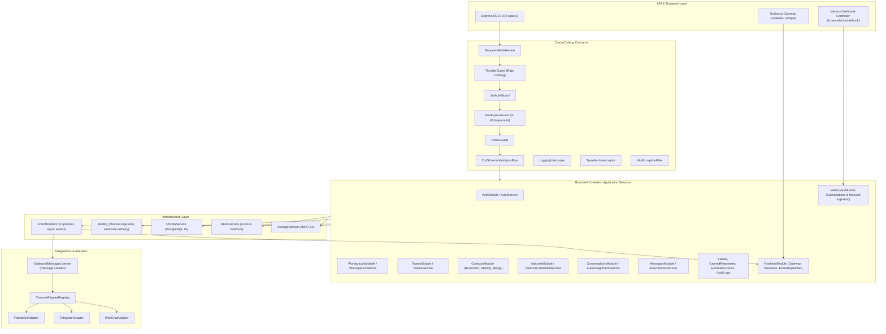

# Sales Copilot Platform — Comprehensive Backend Audit Plan

> **Document Status**: DRAFT / AUDIT PLAN SPECIFICATION  
> **Target System**: Sales Copilot Platform — Backend Monolith (`apps/server`, `packages/shared-contracts`)  
> **Auditor Role**: Senior Backend Architect & Independent Code Reviewer  
> **Operating Principle**: Strictly read-only analysis. **NO code modifications, NO refactoring, NO new features, NO test additions** during the audit planning and execution phases. Pass/Fail judgements are deferred until formal audit execution with verified evidence.

---

## Table of Contents

1. [Audit Objective](#1-audit-objective)
2. [Current Backend Scope & Phasing Context](#2-current-backend-scope--phasing-context)
3. [Architecture Map & System Topology](#3-architecture-map--system-topology)
4. [Audit Principles & Standards](#4-audit-principles--standards)
5. [Audit Phases Overview](#5-audit-phases-overview)
6. [Phase 1 — Requirement Traceability Audit Strategy](#6-phase-1--requirement-traceability-audit-strategy)
7. [Phase 2 — Architecture & Boundary Audit Strategy](#7-phase-2--architecture--boundary-audit-strategy)
8. [Phase 3 — Domain & Business Logic Audit Strategy](#8-phase-3--domain--business-logic-audit-strategy)
9. [Phase 4 — Database & Persistence Audit Strategy](#9-phase-4--database--persistence-audit-strategy)
10. [Phase 5 — API & Shared Contract Audit Strategy](#10-phase-5--api--shared-contract-audit-strategy)
11. [Phase 6 — Security, Multi-Tenancy & Webhook Audit Strategy](#11-phase-6--security-multi-tenancy--webhook-audit-strategy)
12. [Phase 7 — Behavioral Test Coverage Audit Strategy](#12-phase-7--behavioral-test-coverage-audit-strategy)
13. [Phase 8 — Static Analysis & Code Quality Strategy](#13-phase-8--static-analysis--code-quality-strategy)
14. [Phase 9 — Architectural Fitness & Extensibility Scenarios](#14-phase-9--architectural-fitness--extensibility-scenarios)
15. [Phase 10 — Hardening & Remediation Strategy](#15-phase-10--hardening--remediation-strategy)
16. [Finding Severity Model & Classification](#16-finding-severity-model--classification)
17. [Evidence Requirements & Finding Format](#17-evidence-requirements--finding-format)
18. [Audit Execution Order & Phasing Matrix](#18-audit-execution-order--phasing-matrix)
19. [Expected Deliverables](#19-expected-deliverables)
20. [Backend Sign-Off Criteria (Frontend/Integration Readiness)](#20-backend-sign-off-criteria-frontendintegration-readiness)
21. [Open Questions & Unknowns (Needs Verification)](#21-open-questions--unknowns-needs-verification)

---

## 1. Audit Objective

The primary objective of this audit is to conduct an exhaustive, evidence-based technical evaluation of the **Sales Copilot Platform Backend Server** (`apps/server`) and its shared contract interface (`packages/shared-contracts`). 

This audit determines:
1. Whether the backend implementation accurately fulfills the functional, operational, and architectural requirements established in `.docs/`, `docs/`, and `AGENTS.md`.
2. Whether multi-tenant isolation, authorization controls, cryptographic secrets handling, and webhook security are bulletproof against data leakage and privilege escalation.
3. Whether domain entities, state machines, and business rules are enforced strictly in domain/service boundaries rather than casually delegated to controllers or frontend assumptions.
4. Whether persistence guarantees, transactional boundaries, concurrency controls (distributed locks, idempotency keys), and schema integrity protect against race conditions and data corruption.
5. Whether the codebase is clean, decoupled, and architecturally resilient enough to transition confidently into the **Frontend Integration Phase** without risking massive backend rewrites.

---

## 2. Current Backend Scope & Phasing Context

The Sales Copilot platform architecture is bifurcated into two distinct phases defined in `AGENTS.md` and `.docs/product/scope.md`:

```text
                        Sales Copilot Platform
                                   │
                      ┌────────────┴────────────┐
                      │                         │
               Conversation Core          Sales Intelligence
               (PHASE 1 - ACTIVE)        (PHASE 2 - FUTURE)
                      │                         │
               ┌──────┴──────┐          ┌───────┴────────┐
               │             │          │                │
           Channels      Messaging   Lead/Opportunity    AI
           Contacts      Inbox       Scoring             Copilot
           Conversation  Teams       Buying Signals      Actions
           Assignment    Labels      Sales Evidence      ...
           Webhooks      Automation
```

### 2.1. Phase 1: Omnichannel Conversation Platform Core (Active Target)
- **Multi-Tenancy**: Tenant isolation boundary by `workspaceId`. Roles: `PlatformRole` (`SUPER_ADMIN`, `USER`), `WorkspaceRole` (`OWNER`, `ADMIN`, `AGENT`, `VIEWER`). Teams and team memberships.
- **Omnichannel Ingestion**: 1:1 Inbox-to-Channel relationship (Web Chat, Facebook Messenger, Telegram, Zalo, Email). Inbound webhook reception, HMAC signature verification, cryptographic credential storage via AES-256-GCM.
- **Contact & Identity Resolution**: Unified `Contact` per workspace, multi-channel identity mapping (`ChannelIdentity`), contact enrichment and duplicate merging.
- **Conversation & Messaging**: Conversation lifecycle aggregate (`OPEN`, `PENDING`, `RESOLVED`, `SNOOZED`), round-robin auto-assignment with Redis distributed locking and presence checks, messaging aggregate, attachments on MinIO S3, private internal notes, conversation labels.
- **Operations & Realtime**: Canned responses with shortcodes, automation rules engine, outbound webhooks with BullMQ delivery retries, audit logs, Socket.io WebSocket Gateway with Redis Pub/Sub clustering.

### 2.2. Phase 2: Sales Intelligence & AI Copilot (Scope Guardrail Status)
- **Scope**: Lead entity, Lead lifecycle stages, AI scoring, buying signals extraction, AI copilot decision engine.
- **Project Rule in `AGENTS.md`**: *"⛔ CRITICAL RULE: Do NOT create models, DTOs, tables, or services for Phase 2 during Phase 1."*
- **Audit Requirement**: The auditor must rigorously verify whether the codebase strictly preserved this boundary, whether any "shadow" Lead or AI abstractions prematurely leaked into Phase 1, or conversely, whether any core contracts lack the necessary extension hooks (clean seams) for Phase 2.

---

## 3. Architecture Map & System Topology



### 3.1. Detailed Layer Inventory

| Layer | Physical Location | Core Responsibilities |
| :--- | :--- | :--- |
| **Application Entry** | `apps/server/src/main.ts`, `apps/server/src/app.module.ts` | Bootstrap, global middleware, pipes, filters, interceptors, OpenAPI setup, module wiring. |
| **Shared Contracts** | `packages/shared-contracts/src/` | Pure TypeScript interfaces, DTOs, Zod validation schemas, enums, error codes, WebSocket events. |
| **Cross-Cutting** | `apps/server/src/common/` | `HttpExceptionFilter`, `TransformInterceptor`, `LoggingInterceptor`, `ZodSchemaValidationPipe`, `RequestIdMiddleware`. |
| **Identity & Tenancy** | `apps/server/src/modules/auth`, `workspaces`, `teams`, `users` | User auth (Argon2, JWT), Workspace isolation, WorkspaceMember RBAC, Teams. *(Note: `users` module directory state needs verification).* |
| **Omnichannel & Inboxes** | `apps/server/src/modules/inboxes`, `integrations/` | Inbox lifecycle, Channel credentials encryption (AES-256-GCM), Telegram, Facebook, WebChat adapters. |
| **Contact Management** | `apps/server/src/modules/contacts/` | Deduplication, resolution (`resolveFromChannel`), identification (`identify`), merging (`mergeContacts`). |
| **Conversation Core** | `apps/server/src/modules/conversations/`, `messages/` | Conversation lifecycle, priority, status transitions, unread counter, round-robin auto-assignment, message delivery. |
| **Operations Engine** | `apps/server/src/modules/labels`, `canned-responses`, `automation-rules`, `webhooks`, `audit-logs` | Canned response shortcodes, automation rules evaluation, outbound webhooks dispatcher, audit trail. |
| **Realtime Dispatcher** | `apps/server/src/modules/realtime/` | Socket.io gateway (`/realtime`), Redis adapter clustering, agent presence tracking, room management (`workspace_{id}`, `conversation_{id}`). |
| **Infrastructure** | `apps/server/src/infrastructure/` | `PrismaService` (PostgreSQL 16), `RedisService` (distributed lock & cache), `QueueModule` (BullMQ workers), `StorageService` (MinIO S3). |

---

## 4. Audit Principles & Standards

The audit must strictly observe these guiding tenets:

1. **Evidence-First Rule**: No statement, issue, or compliance check may be declared without referencing concrete file paths, line numbers, and relevant code excerpts.
2. **Zero-Assumption / Needs Verification**: Never assume code works simply because a test suite passes or TypeScript compiles. Explicitly flag unverified behavior as `"Needs verification"`.
3. **Negative & Boundary Path Priority**: Audit failure cases, race conditions, malicious inputs, unauthorized access, cross-tenant leaks, replayed webhooks, and process crashes with higher intensity than happy paths.
4. **Tenant Isolation Invariant**: No workspace resource query, mutation, or event dispatch may ever execute without explicit `workspaceId` enforcement.
5. **Anti-Over-Engineering Adherence**: Measure code against `AGENTS.md` rules (KISS, YAGNI, no single-implementation interfaces, no DTO pipeline explosion, Rule of Three for abstractions).

---

## 5. Audit Phases Overview

| Phase | Title | Scope | Primary Focus | Complexity |
| :---: | :--- | :--- | :--- | :---: |
| **P1** | **Requirement Traceability** | Docs ↔ Spec ↔ Code | Backlog/Doc coverage, Phase 1 vs 2 boundary, missing endpoints. | **High** |
| **P2** | **Architecture & Boundaries** | Modules & Layers | Dependency direction, layer leakage, coupling, God classes. | **Medium** |
| **P3** | **Domain & Business Logic** | Entities & State Machines | State machine validity, invariants, assignment rules, idempotency. | **High** |
| **P4** | **Database & Persistence** | Schema, Queries & Tx | Constraints, indexes, cascade rules, N+1 queries, race conditions. | **High** |
| **P5** | **API & Shared Contracts** | REST & DTOs | Request/response schemas, envelope integrity, error format, validation. | **Medium** |
| **P6** | **Security & Multi-Tenancy** | Auth, RBAC, Webhooks | Tenant isolation, HMAC verification, secret protection, replay attacks. | **High** |
| **P7** | **Behavioral Test Coverage** | Test Suites (`node --test`) | Behavior testing vs mock assertion, missing tests, edge cases. | **Medium** |
| **P8** | **Static Quality & Health** | ESLint, TSC, Code Smell | Unused vars, dead code, `any` usage, circular deps, exception swallowing. | **Low** |
| **P9** | **Architectural Fitness** | Change Scenarios 1–6 | Impact of WhatsApp, new LLM, Lead state, new role, new event. | **Medium** |
| **P10**| **Hardening & Sign-off** | Action Matrix | Prioritized remediation plan, readiness gating for frontend. | **Low** |

---

## 6. Phase 1 — Requirement Traceability Audit Strategy

### 6.1. Objective
Map every functional requirement from `.docs/product/`, `.docs/domain/business-rules.md`, and `.docs/backlog/backlog.md` to concrete backend implementations (Controllers, Services, DB Models, and Test Suites). Identify unimplemented requirements, orphaned code, and verify Phase 1 vs Phase 2 scope compliance.

### 6.2. Scope & Target Files
- Documentation: `.docs/product/scope.md`, `.docs/backlog/backlog.md`, `.docs/domain/business-rules.md`, `docs/01-07`.
- Source Code: All controller, service, listener, and processor files in `apps/server/src/modules/` and `apps/server/src/integrations/`.
- Test Suites: All spec files in `apps/server/src/**/__tests__/*.spec.ts`.

### 6.3. Audit Verification Steps
1. **Core Feature Traceability Matrix**: Build a line-by-line traceability table:
   `Feature ID -> Requirement Document -> Implementation Service/Method -> API Endpoint -> Automated Test Spec`.
2. **Phase 1 vs Phase 2 Boundary Verification**:
   - Verify whether any `Lead`, `Opportunity`, `Deal`, or `AIScore` models/tables exist in `prisma/schema.prisma` or `shared-contracts`.
   - If present: Flag as a violation of Phase 1 Scope Guardrail (`AGENTS.md` Section 1).
   - If absent: Verify whether the design provides clean extension hooks (e.g. Contact metadata, conversation event stream) for Phase 2 without requiring structural refactoring.
3. **Omnichannel Channels Implementation Check**:
   - Check status of all 5 defined channel types: `FACEBOOK_MESSENGER`, `TELEGRAM`, `WEB_CHAT`, `ZALO`, `EMAIL`.
   - Determine whether `Zalo` and `Email` adapters are implemented or represent empty directories in `apps/server/src/integrations/zalo` and `apps/server/src/integrations/email`.
4. **User Profile Management Completeness**:
   - Check if `apps/server/src/modules/users` is empty.
   - Trace whether `updateUserProfileSchema` from `packages/shared-contracts/src/users/schemas.ts` has a corresponding controller endpoint (`PATCH /api/v1/users/me` or `/api/v1/auth/profile`).

### 6.4. Expected Deliverable / Matrix Format
```text
| Capability ID | Requirement Source | Controller / Method | Service Implementation | DB Model | Test Spec | Status (Implemented / Partial / Missing / Phase-2 Deferred) |
```

---

## 7. Phase 2 — Architecture & Boundary Audit Strategy

### 7.1. Objective
Assess the physical and logical structure of the backend against the Pragmatic Modular Monolith architecture defined in `AGENTS.md` and `docs/02-module-boundaries.md`. Detect dependency rule violations, layer leakages, circular dependencies, God services, and inappropriate coupling.

### 7.2. Scope & Target Files
- All NestJS Modules (`*.module.ts`) in `apps/server/src/modules/` and `apps/server/src/integrations/`.
- Controller files (`*.controller.ts`).
- Service files (`*.service.ts`).
- Infrastructure wrappers (`apps/server/src/infrastructure/`).

### 7.3. Architecture Anti-Pattern Checks

| Anti-Pattern | Check Description | Search / Verification Pattern |
| :--- | :--- | :--- |
| **Controller ➔ Prisma Bypass** | Controllers querying Prisma directly instead of through domain services. | Inspect imports in `*.controller.ts` for `PrismaService`. |
| **Cross-Module DB Mutation** | Service A directly mutating tables owned by Module B without calling Module B's service. | Search for `this.prisma.contact.*` inside `ConversationsService`, `MessagesService`, etc. |
| **Transport Leakage into Service** | Services accepting Express `Request`/`Response`, Socket.io `Socket`, or HTTP headers directly. | Inspect method signatures in `*.service.ts` for `Request`, `Response`, `Socket`, `Headers`. |
| **God Service Detection** | Services exceeding 500 lines of code or accumulating more than 6 injected dependencies. | Analyze `conversations.service.ts` (822 lines), `realtime.gateway.ts` (809 lines), `inboxes.service.ts`. |
| **Circular Module Imports** | Modules referencing each other via circular `forwardRef()` constructs. | Grep for `forwardRef(` across all `*.module.ts` files. |
| **Over-Engineering Violations** | Premature interfaces with only 1 implementation (violating `AGENTS.md` 2.3). | Check for `IUserService`, `IConversationService`, etc. |
| **External Vendor Leakage** | Third-party vendor SDK types (Facebook Graph, Telegram API) leaking into core services. | Ensure vendor types stay strictly inside `apps/server/src/integrations/*`. |

---

## 8. Phase 3 — Domain & Business Logic Audit Strategy

### 8.1. Objective
Examine all core domain aggregates, business invariants, state transition rules, auto-assignment algorithms, and deduplication logic to ensure business integrity is uncompromised.

### 8.2. Target Domains & Files
- **Conversation State Machine**: `apps/server/src/modules/conversations/conversations.service.ts`, `docs/04-conversation-state-machine.md`.
- **Auto-Assignment & Round-Robin**: `apps/server/src/modules/conversations/auto-assignment.service.ts`.
- **Contact Deduplication & Identity Resolution**: `apps/server/src/modules/contacts/contact-resolution.service.ts`, `contact-identify.service.ts`, `contact-merge.service.ts`.
- **Inbound Event Processing**: `apps/server/src/infrastructure/queue/channel-ingestion.processor.ts`.
- **Outbound Message Routing**: `apps/server/src/integrations/outbound-message.listener.ts`.

### 8.3. Verification Checks

#### A. Conversation Lifecycle Transition Matrix
Audit the enforcement of `ALLOWED_STATUS_TRANSITIONS` in `ConversationsService.updateStatus`:

| Current State | Target Action / State | Allowed? | Required Conditions / Invariants | Audit Verification Point |
| :--- | :--- | :---: | :--- | :--- |
| `OPEN` | `PENDING` | ✅ Yes | None. | Check event `conversation.status_updated`. |
| `OPEN` | `SNOOZED` | ✅ Yes | `snoozedUntil` must be a valid future ISO datetime. | Verify exception if `snoozedUntil` is missing or past. |
| `OPEN` | `RESOLVED` | ✅ Yes | None. | Check event emission. |
| `PENDING` | `OPEN` | ✅ Yes | None. | Manual agent reopen. |
| `PENDING` | `SNOOZED` | ✅ Yes | `snoozedUntil` future datetime required. | Verify validation logic. |
| `PENDING` | `RESOLVED` | ✅ Yes | None. | Check transition. |
| `SNOOZED` | `OPEN` | ✅ Yes | Auto-reopen on timer or incoming message or manual. | Verify `conversation.reopened` event dispatch. |
| `SNOOZED` | `RESOLVED` | ✅ Yes | None. | Direct resolve allowed. |
| `SNOOZED` | `PENDING` | ❌ No | Disallowed by transition matrix. | Must throw `BadRequestException(INVALID_STATUS_TRANSITION)`. |
| `RESOLVED` | `OPEN` | ✅ Yes | Incoming customer message or explicit manual reopen. | Must emit `conversation.reopened`. |
| `RESOLVED` | `PENDING` | ❌ No | Disallowed by transition matrix. | Must throw `BadRequestException(INVALID_STATUS_TRANSITION)`. |
| `RESOLVED` | `SNOOZED` | ❌ No | Disallowed by transition matrix. | Must throw `BadRequestException(INVALID_STATUS_TRANSITION)`. |

#### B. Auto-Assignment Concurrency & Invariants
- **Distributed Locking**: Verify `AutoAssignmentService.assignConversation` acquires `lock:auto_assign:inbox:{inboxId}` with TTL 3000ms. Check whether lock release is guaranteed in a `finally` block.
- **State Re-verification Under Lock**: Verify that after acquiring the Redis lock, the conversation state is re-fetched from the database to prevent duplicate assignment under race conditions.
- **Presence & Workload Scoring**: Check how offline agents are filtered via `PresenceService.isOnline` and how least-loaded tiebreakers are rotated via Redis circular queues.

#### C. Contact Resolution & Identity Linking
- **Three-Tier Resolution**: Trace `ContactResolutionService.resolveFromChannel`:
  1. Lookup by `ChannelIdentity` (`channelId`, `externalContactId`).
  2. Fallback lookup by `Contact.identifier` within `workspaceId`.
  3. Fallback lookup by normalized `email` or `phoneNumber` within `workspaceId`.
- **Atomicity**: Verify whether creating a new `Contact` and `ChannelIdentity` runs within a Prisma `$transaction` to prevent orphaned contacts upon partial failure.

---

## 9. Phase 4 — Database & Persistence Audit Strategy

### 9.1. Objective
Audit the PostgreSQL 16 schema (`schema.prisma`), migration history, indexes, foreign key cascading constraints, transactional boundaries, query efficiency (N+1 risks), and race condition mitigations.

### 9.2. Scope & Target Files
- Prisma Schema: `apps/server/prisma/schema.prisma`.
- Seed file: `apps/server/prisma/seed.ts`.
- Migrations: `apps/server/prisma/migrations/`.
- Repository & Service Queries: All service files using `prismaClient`.

### 9.3. Key Database Checks

| Inspection Area | Specific Audit Checks | Potential Failure Modes |
| :--- | :--- | :--- |
| **Tenant Isolation Indexes** | Ensure every model with `workspaceId` has compound indexes prefixed by `workspaceId` (e.g. `[workspaceId, status]`, `[workspaceId, createdAt]`). | Full table scans on multi-tenant queries; cross-tenant query contamination. |
| **Unique Constraints** | Verify `@@unique([workspaceId, identifier])` on `Contact`, `@@unique([channelId, externalEventId])` on `ChannelEvent`, `@@unique([conversationId, externalId])` on `Message`. | Duplicate contact creation or duplicate webhook ingestion during concurrent bursts. |
| **Foreign Key Cascades** | Verify `onDelete: Cascade` vs `onDelete: SetNull` for `Conversation.assigneeId`, `teamId`, `channelIdentityId`. | Deleting an agent user accidentally deleting entire conversation histories instead of unassigning. |
| **N+1 Query Detection** | Check `conversations.service.ts` list queries, `inboxes.service.ts`, and `teams.service.ts` for queries executing inside loops. | Query volume exploding linearly with result count (`findMany` followed by `.map(async item => ...)`). |
| **Unbounded In-Memory Scans** | Check `WebChatController.resolveChannelByToken`: inspect why it executes `client.channel.findMany({ where: { channelType: WEB_CHAT } })` and decrypts credentials in memory. | Massive CPU and memory spike when scaling to hundreds of workspaces. |
| **Transaction Scopes** | Audit Prisma `$transaction` usage in `ContactMergeService`, `ConversationsService.create`, `WorkspacesService.create`. | Incomplete rollbacks on intermediate failures; deadlocks due to overly broad transactions. |

---

## 10. Phase 5 — API & Shared Contract Audit Strategy

### 10.1. Objective
Audit the REST API surface, DTO schemas, Zod validation pipelines, OpenAPI/Swagger specifications, and response envelopes for consistency between `apps/server` and `@sales-copilot/shared-contracts`.

### 10.2. Target Files
- Contracts: `packages/shared-contracts/src/**/schemas.ts`, `packages/shared-contracts/src/**/index.ts`.
- Controllers: All `*.controller.ts` files in `apps/server/src/modules/` and `apps/server/src/integrations/`.
- Pipes & Interceptors: `apps/server/src/common/pipes/zod-schema-validation.pipe.ts`, `apps/server/src/common/interceptors/transform.interceptor.ts`.

### 10.3. Specific Contract Checks
1. **Validation Pipe Configuration**:
   - In `apps/server/src/main.ts`, `app.useGlobalPipes(new ValidationPipe({ whitelist: true, ... }))` is registered globally.
   - Controllers use `@ZodBody(schema)`, `@ZodQuery(schema)`.
   - **Audit Check**: Does NestJS's default `ValidationPipe` conflict with `@ZodBody()`, or strip fields from Zod-validated payloads when class-validator decorators are absent?
2. **Standard Response Envelope (`TransformInterceptor`)**:
   - Verify that all endpoints return either `{ success: true, data: T }` or `{ success: true, data: T[], meta: PaginationMeta }`.
   - Verify that controller methods do not double-wrap responses in `{ success: true, data: ... }`.
3. **Standard Error Envelope (`HttpExceptionFilter`)**:
   - Verify that all HTTP errors produce `{ success: false, error: { code: string, message: string, details: unknown } }`.
   - Verify that unhandled standard `Error` instances do not leak stack traces or internal database error messages to public clients in production.
4. **Database Model Exposure**:
   - Ensure controllers return DTOs mapped via mappers (`conversations.mapper.ts`, `messages.mapper.ts`) and never directly return raw Prisma models containing password hashes, raw credential blobs, or internal tokens.

---

## 11. Phase 6 — Security, Multi-Tenancy & Webhook Audit Strategy

### 11.1. Objective
Conduct an exhaustive security audit covering Authentication, Authorization (RBAC), Tenant Isolation, Cryptographic Secrets, Webhook HMAC Verification, Replay Attacks, and Attack Boundary Protections.

### 11.2. Target Files
- Auth & Guards: `apps/server/src/modules/auth/`, `apps/server/src/modules/workspaces/guards/workspace.guard.ts`, `roles.guard.ts`.
- Encryption: `apps/server/src/modules/inboxes/channel-credential.service.ts`.
- Inbound Webhook Processing: `apps/server/src/modules/webhooks/webhooks.service.ts`, `webhooks.controller.ts`.
- Outbound Webhook Security: `apps/server/src/modules/webhooks/webhook-signer.ts`, `webhook-dispatcher.listener.ts`.
- Public Widgets: `apps/server/src/integrations/web-chat/web-chat.controller.ts`, `widget-token.service.ts`.

### 11.3. Security Inspection Areas & Threat Vectors

```text
Threat Vector 1: Cross-Tenant Access
├── Missing X-Workspace-Id header
├── Forged X-Workspace-Id header (user is not a member)
└── SQL/Prisma query omitting workspaceId in where clause

Threat Vector 2: Privilege Escalation
├── AGENT or VIEWER attempting to invite members, update roles, or access audit logs
├── ADMIN attempting to modify or demote workspace OWNER
└── Anonymous visitor attempting to view private agent notes

Threat Vector 3: Inbound Webhook Forgery & Replay
├── Webhook payload missing or failing HMAC-SHA256 signature
├── Identical webhook event submitted concurrently (race condition on idempotency check)
└── Replayed webhook with expired timestamp

Threat Vector 4: Cryptographic Key Weakness
├── Hardcoded fallback encryption keys in ChannelCredentialService
├── Predictable IVs or missing GCM authentication tags
└── Plaintext credentials exposed in application logs or API responses
```

#### Detailed Security Verification Checklist
- [ ] **Tenant Isolation in Guards**: Verify `WorkspaceGuard` validates that `request.user.userId` has an active `WorkspaceMember` record for the requested `x-workspace-id`.
- [ ] **Tenant Scoping in Service Queries**: Inspect every Prisma query across all services to verify that `where: { id, workspaceId }` is enforced, preventing IDOR (Insecure Direct Object Reference) vulnerabilities.
- [ ] **Hardcoded Fallback Secret Detection**: In `ChannelCredentialService` line 13, check if `'0123456789abcdef0123456789abcdef0123456789abcdef0123456789abcdef'` is used as a fallback if `CHANNEL_ENCRYPTION_KEY` is not set in `.env`. Evaluate production risk.
- [ ] **Webhook Concurrency & Idempotency**: In `WebhooksService.handleInboundWebhook`, audit the window between `findUnique(channelId_externalEventId)` and `create(...)`. Verify whether concurrent duplicate requests can throw uncaught `P2002` Prisma unique constraint errors instead of returning a clean 200 OK duplicate acknowledgement.
- [ ] **Web Chat Visitor Isolation**: In `WebChatController.getConversationMessages`, verify whether a visitor possessing a valid token for Contact A can access messages from Contact B's conversation (object-level authorization).
- [ ] **Private Note Protection**: Verify that when `isAgent === false` (e.g. Web Chat API), messages with `isPrivate === true` are strictly filtered out from database queries.

---

## 12. Phase 7 — Behavioral Test Coverage Audit Strategy

### 12.1. Objective
Evaluate the test suites not merely by code coverage statistics, but by **behavioral correctness**. Identify brittle mock tests, missing negative path tests, unverified state transitions, and concurrency edge cases.

### 12.2. Current Test Landscape
- Test Runner: Node.js Native Test Runner (`node -r @swc-node/register --test`).
- Total Test Specs: ~863 tests across 273 test suites in `apps/server/src/**/__tests__/*.spec.ts`.

### 12.3. Test Gap Analysis Strategy
The auditor will assess tests against critical business behaviors and compile a **Test Gap Matrix**:

| Feature Area | Critical Behavior | Expected Test Type | Current Test Status | Gap Assessment |
| :--- | :--- | :---: | :---: | :--- |
| **Conversation Lifecycle** | Invalid state transitions throw `400 Bad Request` | Unit / Integration | Needs verification | Check if all 8 invalid transitions in matrix are asserted. |
| **Conversation Lifecycle** | Setting `SNOOZED` without `snoozedUntil` or with past date throws `400` | Unit | Needs verification | Check boundary condition for past timestamps. |
| **Auto-Assignment** | Concurrent assignment requests lock properly without double-assigning | Concurrency / Integration | Needs verification | Check if Redis lock contention is simulated in tests. |
| **Contact Merging** | Merging Contact A into B moves conversations, identities, and deletes A | Integration / Service | Needs verification | Check transactional rollback on failure. |
| **Inbound Webhook** | Concurrent identical webhooks handled idempotently without `500` error | Integration | Needs verification | Check P2002 collision handling test. |
| **Outbound Message** | External channel HTTP failure marks message `FAILED` without crashing server | Integration / Event | Needs verification | Check `OutboundMessageListener` error handling. |
| **Tenant Isolation** | Agent from Workspace 1 attempting to read Conversation from Workspace 2 | Security / Controller | Needs verification | Check cross-tenant 403/404 assertions. |
| **Web Chat Widget** | Visitor token tampering or expired token rejection | Security / Guard | Needs verification | Check JWT expiration and signature verification. |

---

## 13. Phase 8 — Static Analysis & Code Quality Strategy

### 13.1. Objective
Identify code smells, hidden type unsafety (`any`), unused dependencies, dead code, circular imports, and unhandled promises without modifying source code.

### 13.2. Automated Execution Commands (Non-Modifying)
- Typecheck Monorepo: `pnpm nx run-many -t typecheck`
- ESLint: `pnpm run lint` (or `npx eslint .`)
- Dependency Graph: `pnpm nx graph --file=dist/graph.json`

### 13.3. Static Smell Checklist
- [ ] **TypeScript `any` Usage**: Grep for `: any` and `as any` across `apps/server/src/`. Identify places where types are unsafely cast instead of using Zod or Prisma generated types.
- [ ] **Unused Variables & Warnings**: Analyze the 34 ESLint warnings detected during preliminary checks (e.g. Unused variables in `webhook-delivery.processor.ts`, `facebook.adapter.ts`, `contact-merge.service.ts`).
- [ ] **Empty / Dead Directories**: Confirm status of `apps/server/src/modules/users`, `apps/server/src/integrations/zalo`, and `apps/server/src/integrations/email`.
- [ ] **Swallowed Exceptions**: Search for empty `catch (err) {}` or `catch { /* ignore */ }` blocks where errors are suppressed without logging or metric recording.
- [ ] **TODO / FIXME / HACK Audit**: Grep for `TODO`, `FIXME`, `HACK`, `XXX` across the codebase to identify unfinished logic.

---

## 14. Phase 9 — Architectural Fitness & Extensibility Scenarios

### 14.1. Objective
Evaluate whether the backend architecture is truly modular, decoupled, and extensible by simulating 6 hypothetical future change scenarios without writing implementation code.

### 14.2. Hypothetical Scenarios Evaluation

```text
Scenario 1: Add a New Channel (e.g. WhatsApp Cloud API)
├── Question: Does adding WhatsApp require modifying core Conversation or Contact modules?
├── Expected: Only create WhatsAppAdapter implementing ChannelAdapter, register in IntegrationsModule.
└── Evaluation: Check if any switch/case statements in core modules hardcode ChannelType.

Scenario 2: Add an LLM Provider / AI Integration (Phase 2 Preparation)
├── Question: Can an AI provider (e.g. Anthropic/OpenAI) be introduced without polluting core domain entities?
├── Expected: AI service consumes EventEmitter events (message.created) or listens via webhook/queue.
└── Evaluation: Check if Conversation or Message entities have clean seams for AI metadata/tags.

Scenario 3: Change AI Scoring Algorithm
├── Question: If lead scoring or conversation priority scoring algorithm changes, what breaks?
├── Expected: Core database schemas remain intact; score changes emit domain events.
└── Evaluation: Check how priority updates currently propagate through EventEmitter.

Scenario 4: Add a New Conversation Lifecycle State (e.g. ESCALATED or ARCHIVED)
├── Question: How many files must change to add a new state?
├── Expected: Update schema.prisma enum, shared-contracts enum, ALLOWED_STATUS_TRANSITIONS matrix.
└── Evaluation: Check for scattered if (status === 'OPEN') checks throughout the codebase.

Scenario 5: Add a New Workspace Role (e.g. SUPERVISOR or BILLING_MANAGER)
├── Question: Does adding a role require database schema migration or code refactoring across all controllers?
├── Expected: Update WorkspaceRole enum, adjust controller @Roles() decorator where appropriate.
└── Evaluation: Check if roles are hardcoded in services or cleanly evaluated in RolesGuard.

Scenario 6: Add a New Realtime Event Type
├── Question: How clean is the contract between Backend and Web consumers for new socket events?
├── Expected: Add typed payload in shared-contracts, dispatch via RealtimeEventDispatcher.
└── Evaluation: Check RealtimeEventDispatcher coupling to Socket.io gateway.
```

---

## 15. Phase 10 — Hardening & Remediation Strategy

### 15.1. Objective
Aggregate all findings from Phases 1 through 9 into an actionable, prioritized remediation plan to be executed systematically during the backend hardening sprint.

### 15.2. Remediation Rules
- Fix all **CRITICAL** issues before any frontend integration begins.
- Fix all **HIGH** issues before staging deployment.
- Plan **MEDIUM** refactoring tasks according to architectural impact.
- Document accepted risks for any deferred items.

---

## 16. Finding Severity Model & Classification

All audit findings identified during subsequent execution must be classified under the following unified severity standard:

| Severity | Criteria | Example | Remediation Window |
| :---: | :--- | :--- | :---: |
| **CRITICAL** | Security breach, cross-tenant data leakage, credential compromise, data corruption, uncaught fatal crash in core ingestion. | Missing `workspaceId` check allowing user from Workspace A to view Workspace B's conversations; unauthenticated webhook ingestion. | Must fix immediately. Blocks Frontend Integration. |
| **HIGH** | Major business rule violation, broken state transition, race condition causing duplicate assignment, missing core requirement. | Assigning conversation to agent not in inbox; concurrent webhook bursts throwing unhandled 500 error; missing user profile update API. | Must fix before staging/production deployment. |
| **MEDIUM** | Architectural boundary violation, performance bottleneck (N+1, unbounded table scan), missing test for key edge case, high code duplication. | Scanning all channels in memory in WebChat controller; missing unit test for `SNOOZED` expiration; 800-line God service. | Fix during hardening sprint. |
| **LOW** | Minor quality issue, naming inconsistency, dead code, ESLint unused variable warning. | Unused variable warning in test file; minor comment typos; non-standard parameter naming. | Cleanup when convenient. |
| **INFO** | Observation, architectural improvement opportunity, documentation note. | Suggestion for Redis connection pool tuning; recommendation for future BullMQ job dashboard. | Consider for future enhancements. |

---

## 17. Evidence Requirements & Finding Format

Every finding documented in audit execution reports must strictly adhere to the following standard template:

```markdown
### [FINDING-<PHASE>-<NUMBER>] <Short Descriptive Title>

- **Severity**: CRITICAL | HIGH | MEDIUM | LOW | INFO
- **Category**: Security | Multi-Tenancy | Domain Correctness | Architecture | Database | Contract | Test Gap | Performance
- **Location**: `apps/server/src/path/to/file.ts:lineStart-lineEnd`
- **Requirement Reference**: `.docs/...` or `AGENTS.md Section ...`

#### 1. Evidence
```typescript
// Exact code excerpt from the active repository demonstrating the issue
```

#### 2. Problem Description
Detailed explanation of why this code is incorrect, insecure, or violates architectural principles.

#### 3. Impact Analysis
Real-world consequence if this issue is triggered in production (e.g. data leak, race condition, denial of service).

#### 4. Expected Behavior
What the specification, business rule, or architectural standard requires.

#### 5. Recommended Fix
Specific, minimal, anti-over-engineering remediation guidance.

#### 6. Verification Method
Concrete test scenario or automated command to prove the issue is resolved.
```

---

## 18. Audit Execution Order & Phasing Matrix

To maximize efficiency and respect logical dependencies between audit layers, execution should proceed according to the following matrix:

```text
┌─────────────────────────────────────────────────────────────┐
│ P1: Requirement Traceability (Establishes Expected Scope)   │
└──────────────────────────────┬──────────────────────────────┘
                               │
            ┌──────────────────┴──────────────────┐
            ▼                                     ▼
┌───────────────────────────────┐   ┌───────────────────────────────┐
│ P2: Architecture & Boundaries │   │ P4: Database & Persistence    │
│ (Component coupling & leaks)  │   │ (Schema, Indexes & Transact.) │
└───────────────┬───────────────┘   └───────────────┬───────────────┘
                │                                   │
                └─────────────────┬─────────────────┘
                                  │
                                  ▼
┌─────────────────────────────────────────────────────────────┐
│ P3: Domain & Business Logic (State Machines & Invariants)   │
└──────────────────────────────┬──────────────────────────────┘
                               │
            ┌──────────────────┴──────────────────┐
            ▼                                     ▼
┌───────────────────────────────┐   ┌───────────────────────────────┐
│ P5: API & Shared Contracts    │   │ P6: Security & Multi-Tenancy  │
│ (REST, DTOs & Validation)     │   │ (Auth, RBAC, HMAC & Tenant)   │
└───────────────┬───────────────┘   └───────────────┬───────────────┘
                │                                   │
                └─────────────────┬─────────────────┘
                                  │
                                  ▼
┌─────────────────────────────────────────────────────────────┐
│ P7: Behavioral Test Coverage (Test Gaps & Assertions)       │
└──────────────────────────────┬──────────────────────────────┘
                               │
                               ▼
┌─────────────────────────────────────────────────────────────┐
│ P8: Static Analysis & Code Quality (ESLint, TSC & Dead Code)│
└──────────────────────────────┬──────────────────────────────┘
                               │
                               ▼
┌─────────────────────────────────────────────────────────────┐
│ P9: Architectural Fitness (Extensibility Scenarios 1–6)     │
└──────────────────────────────┬──────────────────────────────┘
                               │
                               ▼
┌─────────────────────────────────────────────────────────────┐
│ P10: Hardening & Remediation Plan (Readiness Sign-Off)      │
└─────────────────────────────────────────────────────────────┘
```

### Phasing Schedule & Dependencies

| Phase | Phase Name | Execution Mode | Prerequisite Phases | Complexity | Estimated Effort |
| :---: | :--- | :--- | :--- | :---: | :---: |
| **P1** | Requirement Traceability | Sequential (First) | None | **High** | 1.0 day |
| **P2** | Architecture & Boundaries | Parallel Stream A | P1 | **Medium** | 0.5 day |
| **P4** | Database & Persistence | Parallel Stream B | P1 | **High** | 0.75 day |
| **P3** | Domain & Business Logic | Sequential | P2, P4 | **High** | 1.0 day |
| **P5** | API & Contracts | Parallel Stream C | P3 | **Medium** | 0.5 day |
| **P6** | Security & Multi-Tenancy | Parallel Stream D | P3, P4 | **High** | 1.0 day |
| **P7** | Behavioral Test Coverage | Sequential | P3, P5, P6 | **Medium** | 0.75 day |
| **P8** | Static Quality & Health | Fast Sequential | None (can run early) | **Low** | 0.25 day |
| **P9** | Architectural Fitness | Sequential | P2, P3, P4 | **Medium** | 0.5 day |
| **P10**| Hardening Plan & Sign-Off| Final Sequential | All (P1–P9) | **Low** | 0.5 day |

---

## 19. Expected Deliverables

Upon completion of the audit execution, the following formal artifacts must be generated:

1. **`docs/audit/01-requirement-traceability-report.md`**: Feature traceability matrix, missing capability log, Phase 1 vs 2 compliance audit.
2. **`docs/audit/02-architecture-and-boundaries-report.md`**: Module coupling analysis, layer leakages, God class review.
3. **`docs/audit/03-domain-and-business-logic-report.md`**: Conversation state machine verification, auto-assignment review, contact deduplication analysis.
4. **`docs/audit/04-database-and-persistence-report.md`**: Schema and index verification, N+1 query findings, transaction boundary analysis.
5. **`docs/audit/05-api-and-contracts-report.md`**: Endpoint audit, DTO mapping review, validation pipe verification.
6. **`docs/audit/06-security-and-multitenancy-report.md`**: Tenant isolation verification, HMAC signature review, encryption key review, attack boundary report.
7. **`docs/audit/07-test-coverage-and-gaps-report.md`**: Behavioral test gap matrix, mock quality review, missing negative path test log.
8. **`docs/audit/08-static-quality-and-code-smells.md`**: Lint/typecheck assessment, dead code catalog, exception swallowing log.
9. **`docs/audit/09-architectural-fitness-report.md`**: Impact evaluation for Scenarios 1–6.
10. **`docs/audit/10-backend-sign-off-recommendation.md`**: Executive summary, finding tally by severity, formal GO / NO-GO decision for Frontend Phase.

---

## 20. Backend Sign-Off Criteria (Frontend/Integration Readiness)

To issue a formal **GO** decision permitting the team to proceed to the Frontend Integration Phase, the backend must meet 100% of the following mandatory gates:

```text
                           BACKEND SIGN-OFF GATES
                                     │
     ┌───────────────────┬───────────┴───────────┬───────────────────┐
     ▼                   ▼                       ▼                   ▼
 Gate 1: Security   Gate 2: Tenancy         Gate 3: Core API    Gate 4: Quality
 0 Critical/High    100% Queries Tenant-    All Phase 1 REST    Build & Typecheck
 Security Flaws     Scoped (workspaceId)    & WS Contracts Pass Clean (0 Errors)
```

- [ ] **Gate 1: Zero Critical or High Security Vulnerabilities**: No cross-tenant access leaks, no webhook verification bypasses, no hardcoded production cryptographic secrets.
- [ ] **Gate 2: Strict Multi-Tenant Enforcement**: 100% of Prisma queries and mutations on tenant resources include `workspaceId` in the `where` clause.
- [ ] **Gate 3: Core API Contract Integrity**: All Phase 1 REST endpoints, WebSocket events, and DTO contracts defined in `@sales-copilot/shared-contracts` return stable envelopes (`TransformInterceptor`) and consistent error codes (`HttpExceptionFilter`).
- [ ] **Gate 4: Clean Build & Typecheck**: `pnpm nx run-many -t typecheck` exits with 0 errors across all projects (`server`, `shared-contracts`, `widget-sdk`, `web`).
- [ ] **Gate 5: Passing Behavioral Test Suite**: All existing test suites pass with 0 failures (`863 tests passing`), and newly identified critical behavioral test gaps are covered.
- [ ] **Gate 6: Resilient Ingestion & Concurrency**: Inbound webhooks handle duplicate deliveries and bursts idempotently without throwing uncaught 500 exceptions.
- [ ] **Gate 7: Clean Scope Boundaries**: Strict isolation of Phase 1 Core from Phase 2 AI/Lead extensions, with well-defined extension seams.

---

## 21. Open Questions & Unknowns (Needs Verification)

The following items are identified during preliminary inspection and must be formally verified during audit execution:

1. **User Profile Endpoint Location (`Needs verification`)**:
   - `packages/shared-contracts/src/users/schemas.ts` defines `updateUserProfileSchema`, but `apps/server/src/modules/users` is currently an empty directory.
   - *Question for Audit*: Is user profile modification implemented in `AuthModule`, `WorkspacesModule`, or is this endpoint completely missing from the API surface?
2. **Empty Integration Directories (`Needs verification`)**:
   - `apps/server/src/integrations/zalo` and `apps/server/src/integrations/email` are empty folders, while `ChannelType` supports `ZALO` and `EMAIL`.
   - *Question for Audit*: Were Zalo and Email adapters planned for Phase 1 or intentionally postponed as future channel plugins?
3. **Channel Ingestion In-Memory Scan in WebChat (`Needs verification`)**:
   - `WebChatController.resolveChannelByToken` loads all web chat channels into memory and decrypts credentials in a loop if `providerAccountId` does not match.
   - *Question for Audit*: What is the performance impact when multiple web chat inboxes exist across many tenants?
4. **Outbound Message Delivery Durability (`Needs verification`)**:
   - Outbound messages to Facebook and Telegram are dispatched via in-process `EventEmitter2` in `OutboundMessageListener` rather than a persistent BullMQ queue.
   - *Question for Audit*: What happens to message delivery status if an external provider's API is temporarily unavailable or if the server restarts during dispatch?
5. **Global ValidationPipe vs ZodBody Pipe Coexistence (`Needs verification`)**:
   - `main.ts` sets up `app.useGlobalPipes(new ValidationPipe({ whitelist: true }))` while controllers use `@ZodBody()`.
   - *Question for Audit*: Does `ValidationPipe` strip any fields from plain JavaScript objects validated through Zod?
