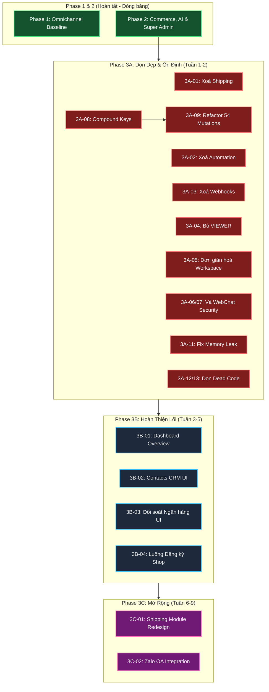

# Sales Copilot Platform — Master Backlog & AI Orchestration Playbook

Chào mừng bạn đến với **Trung tâm Quản trị Kế hoạch & Điều phối AI Coding Agent (Backlog Master Hub)** của dự án Sales Copilot Platform.

---

## 📌 1. Lộ Trình Phân Kỳ & Ma Trận Tiến Độ (Master Tracking Matrix)

### Tầm nhìn sản phẩm sau tái cấu trúc (09/2026):
> **Nền tảng SaaS đơn giản giúp shop nhỏ bán hàng tự động qua chat đa kênh với AI Copilot.**
> - 1 account = 1 shop (ẩn khái niệm workspace)
> - AI Copilot là trái tim sản phẩm
> - 3 kênh: Web Chat, Facebook Messenger, Telegram (+ Zalo OA tương lai)

### Lịch sử phân kỳ:

| Phase | Trạng thái | Mô tả |
|:------|:---:|:------|
| **Phase 1: Omnichannel Baseline** | ✅ Hoàn tất | Hội thoại, tin nhắn, kênh, liên hệ & WebSocket |
| **Phase 2: Commerce & AI** | ✅ Hoàn tất | Kho & SKU, OMS, VietQR, Super Admin, AI Autopilot, Comment Guard |
| **Phase 3A: Dọn dẹp & Ổn định** | ✅ Hoàn tất | Xoá Shipping/Automation/Webhooks/VIEWER, sửa 106 Prisma queries, đơn giản hoá workspace |
| **Phase 3B: Hoàn thiện Lõi** | ⏳ Sẵn sàng | Dashboard Overview, Contacts CRM UI, Đối soát Ngân hàng UI, Luồng đăng ký shop |
| **Phase 3C: Mở rộng** | ⏳ Chờ 3B | Thiết kế lại Shipping module, Zalo OA integration |

### Bảng nhiệm vụ Phase 3 (Tái cấu trúc):

| Milestone | Epic ID | Tên Epic (Tài liệu chi tiết) | Phạm vi & Trọng tâm | Trạng thái |
|:---|:---|:---|:---|:---:|
| **Phase 3A**<br>*(Dọn dẹp - Ưu tiên 1)* | **[Phase 3A](./phase-3a-cleanup-and-stabilization.md)** | **Dọn Dẹp & Ổn Định** | Xoá module thừa (Shipping, Automation, Webhooks), bỏ VIEWER, đơn giản hoá workspace, vá 106 lỗ hổng multi-tenancy, fix memory leak | ✅ Hoàn tất |
| **Phase 3B**<br>*(Hoàn thiện - Ưu tiên 2)* | **[Phase 3B](./phase-3b-core-feature-completion.md)** | **Hoàn Thiện Tính Năng Lõi** | Dashboard Overview, Contacts CRM UI, Đối soát Ngân hàng UI, Luồng đăng ký shop & tạo nhân viên | ⏳ Sẵn sàng |
| **Phase 3C**<br>*(Mở rộng - Ưu tiên 3)* | **[Phase 3C](./phase-3c-expansion.md)** | **Mở Rộng & Nâng Cao** | Thiết kế lại Shipping module từ đầu, Tích hợp Zalo OA | ⏳ Chờ 3B |

---

## 🗺️ 2. Sơ Đồ Phụ Thuộc Triển Khai (Execution Dependency Graph)



---

## 🤖 3. Cẩm Nang Điều Phối AI Coding Agent (Orchestration Playbook)

### 3.1. Nguyên Lý Phân Vai Giữa Người Điều Phối & AI Agent
Để tránh việc tài liệu bị "bội thực kỹ thuật vi mô" và bị lệch so với thực tế codebase:
- **Tài liệu Backlog (Bạn - PO/Architect)**: Tập trung định nghĩa **LÀM CÁI GÌ (WHAT)**, **TẠI SAO (WHY)**, **QUY TẮC NGHIỆP VỤ BẮT BUỘC (BUSINESS RULES)**, **ĐIỀU CẤM (OUT-OF-SCOPE)** và **TIÊU CHÍ NGHIỆM THU (AC)**. Tuyệt đối không phỏng đoán trước tên file hay viết mã thô.
- **Kế Hoạch Thực Thi (AI Agent - `implementation_plan.md`)**: Khi nhận task, AI Agent có trách nhiệm **tự khảo sát codebase** (`find_by_name`, `grep_search`, `view_file`), tìm hiểu các pattern hiện hữu, và tự đề xuất chi tiết **LÀM NHƯ THẾ NÀO (HOW)**: Danh sách file cụ thể (`[NEW]`, `[MODIFY]`), schema fields, DTO signatures, UI components và test cases.


### 3.2. Cấu Trúc Chuẩn 5 Đề Mục Của 1 Feature
Mỗi Feature trong Backlog được chuẩn hóa thành 5 đề mục sắc bén:
1. **Mục tiêu & Trải nghiệm Người dùng (User Journey & Value)**: Luồng thao tác trực quan của người dùng từ đầu đến cuối.
2. **Quy tắc nghiệp vụ & Bất biến (Business Rules & Invariants)**: Các công thức, điều kiện validation, logic nghiệp vụ bắt buộc mà AI không được tự bịa.
3. **Ranh giới & Điều cấm (Constraints & Out-of-Scope)**: Ràng buộc kỹ thuật cốt lõi (multi-tenancy, locking) và ranh giới chặn đứng việc AI phát triển thừa thãi.
4. **Tài liệu tham chiếu (References)**: Trỏ trực tiếp tới section tương ứng trong PRD và Architecture RFC.
5. **Tiêu chí nghiệm thu (Acceptance Criteria & Definition of Done)**: Bộ checklist kiểm thử đo lường được (Happy path, Edge cases, Typecheck, Test suite).

---

### 📋 3.3. Mẫu Prompt Chuẩn Giao Việc:

#### 1. Mẫu Giao Feature Mới (Khép kín Lát cắt dọc End-to-End):
> *"Hãy thực thi **Feature 3A.X** trong tài liệu `docs/backlog/phase-3a-cleanup-and-stabilization.md`.
> - Đây là lát cắt dọc khép kín: bao gồm từ Schema Prisma, Contracts DTO, NestJS API đến giao diện Next.js UI và Kiểm thử.
> - Tuân thủ nghiêm ngặt các nguyên tắc trong `AGENTS.md` (KISS, YAGNI, tenant scoping `workspaceId`, không tạo interface đơn lẻ, không chia nhỏ micro-folder).
> - Hãy khảo sát codebase hiện hữu, đối chiếu với Business Rules và Out-of-Scope trong tài liệu.
> - Lập `implementation_plan.md` chi tiết (bao gồm Target Files, Schema, DTO, Test Plan) và dừng lại chờ tôi phê duyệt trước khi sửa code."*

#### 2. Mẫu Kết Hợp Lệnh `/boost`:
> *"/boost Hãy phân tích và lập kế hoạch triển khai cho **Feature 3B.2: Hoàn thiện Contacts CRM UI** trong `docs/backlog/phase-3b-core-feature-completion.md`. Xuất kết quả vào `implementation_plan.md` để tôi duyệt."*

#### 3. Mẫu Kết Hợp Lệnh `/teamwork-preview`:
> *"/teamwork-preview Tôi muốn triển khai đồng thời **Feature 3A.1** (Xoá Shipping) và **Feature 3A.2** (Xoá Automation). Đây là 2 lát cắt dọc độc lập."*

#### 4. Mẫu Sửa Lỗi / Điều Chỉnh:
> *"Khi kiểm tra Feature 3A.X trên UI, phát sinh vấn đề: [Mô tả lỗi]. Hãy phân tích nguyên nhân gốc rễ, cập nhật `implementation_plan.md` và chờ tôi xác nhận."*

#### 5. Mẫu Yêu Cầu Tự Kiểm Tra:
> *"Hãy tự động chạy bộ kiểm tra toàn diện (`pnpm typecheck`, `pnpm nx run server:test`, `pnpm nx run web:test`), sau đó cập nhật kết quả vào `walkthrough.md`."*

---

## 📁 4. Cấu Trúc Thư Mục `docs/backlog/`

```text
docs/backlog/
├── README.md                                     # Master Hub & AI Playbook này
├── phase-3a-cleanup-and-stabilization.md         # Phase 3A: Dọn dẹp & Ổn định
├── phase-3b-core-feature-completion.md           # Phase 3B: Hoàn thiện tính năng lõi
├── phase-3c-expansion.md                         # Phase 3C: Mở rộng & Nâng cao
├── archive/                                       # Kho lưu trữ lịch sử
│   ├── phase-1/                                   # 12 Epics Phase 1 đã hoàn tất 100%
│   └── phase-2/                                   # Epics Phase 2 (sẽ chuyển vào khi Phase 3 bắt đầu)
├── epic-2.1-inventory-and-catalog.md             # (Sẽ archive)
├── epic-2.2-commerce-and-orders.md               # (Sẽ archive)
├── epic-2.3-vietqr-and-reconciliation.md         # (Sẽ archive)
├── epic-2.4-super-admin-portal.md                # (Sẽ archive)
├── epic-3.0-ai-legacy-cleanup.md                 # (Sẽ archive)
├── epic-3.1-ai-agent-core.md                     # (Sẽ archive)
├── epic-3.2-commerce-tool-registry.md            # (Sẽ archive)
├── epic-3.3-comment-guard.md                     # (Sẽ archive)
└── epic-3.4-ai-settings-ui.md                    # (Sẽ archive)
```
