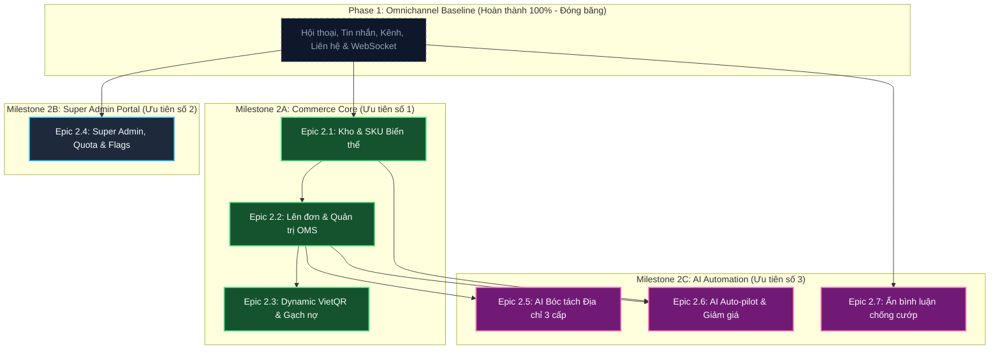
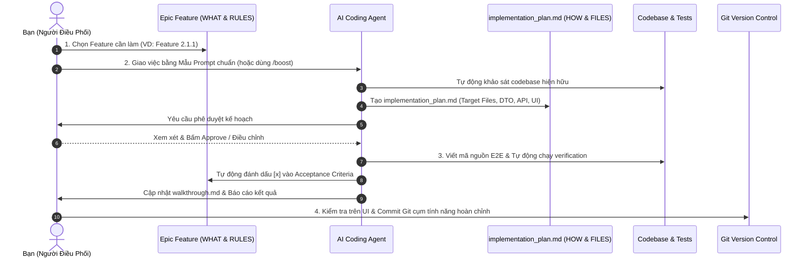

# Sales Copilot Platform — Master Backlog & AI Orchestration Playbook

Chào mừng bạn đến với **Trung tâm Quản trị Kế hoạch & Điều phối AI Coding Agent (Backlog Master Hub)** của dự án Sales Copilot Platform.

---

## 📌 1. Lộ Trình Phân Kỳ & Ma Trận Tiến Độ (Master Tracking Matrix)

Toàn bộ các yêu cầu của **Phase 2: D2C Conversational Commerce, Inventory & AI Auto-pilot** được tổ chức thành 3 Milestone chiến lược với 7 Epics độc lập:

| Milestone | Epic ID | Tên Epic (Tài liệu chi tiết) | Phạm vi & Trọng tâm kỹ thuật | Độ phức tạp | Trạng thái |
| :--- | :--- | :--- | :--- | :---: | :---: |
| **Milestone 2A**<br>*(Commerce Core - Ưu tiên 1)* | **[Epic 2.1](./epic-2.1-inventory-and-catalog.md)** | **Quản Lý Kho & Biến Thể SKU** | CRUD Sản phẩm, Biến thể SKU (Màu/Size), Tồn kho 3 trạng thái (`Available = Physical - Reserved`), Phiếu nhập/kiểm kho, Sổ cái `InventoryTransaction`. | 🔴 High | ⏳ Sẵn sàng |
| | **[Epic 2.2](./epic-2.2-in-chat-pos-and-orders.md)** | **Khung Lên Đơn & Quản Trị OMS** | Tạo đơn, Tìm kiếm SKU < 50ms, Order State Machine, Khóa kho nguyên tử 2 tầng (`$transaction`), Redis 30s lock chống va chạm nhân viên. | 🔴 High | ⏳ Sẵn sàng |
| | **[Epic 2.3](./epic-2.3-vietqr-and-reconciliation.md)** | **Dynamic VietQR & Gạch Nợ Tự Động** | Dynamic VietQR NAPAS 247 (EMVCo Tag 00-63 CRC-16, memo `DH{code}`), Webhook Casso/SePay xử lý idempotency, gạch nợ `PAID` < 1s, Bắn realtime `order.paid`. | 🔴 High | ⏳ Sẵn sàng |
| **Milestone 2B**<br>*(Super Admin - Ưu tiên 2)* | **[Epic 2.4](./epic-2.4-super-admin-portal.md)** | **Cổng Super Admin & Cấu Hình Động** | Layout `/admin`, `PlatformRolesGuard`, Quản lý Workspaces, Hạn mức Quota, Feature Flags, 2-tier Cache Redis, Platform Audit Log. | 🟡 Medium | ⏳ Sẵn sàng |
| **Milestone 2C**<br>*(AI Automation - Ưu tiên 3)* | **[Epic 2.5](./epic-2.5-ai-address-ner.md)** | **AI NER Bóc Tách Địa Chỉ 3 Cấp** | Regex bóc tách SĐT 10 số, Chuẩn hóa Tỉnh - Huyện - Xã theo CSDL Tổng cục Thống kê kết hợp Trie cache, Điền đơn hàng. | 🟡 Medium | ⏳ Chờ M2A |
| | **[Epic 2.6](./epic-2.6-ai-autopilot-discount.md)** | **AI Auto-pilot 24/7 & Discount Engine** | 4 chế độ AI (`ALWAYS_ON`, `OFF_HOURS`, `OVERFLOW`, `MANUAL`), Đàm phán giảm giá có kiểm soát qua `DiscountPolicyEngine`, Chốt đơn nửa đêm (Midnight Checkout). | 🔴 High | ⏳ Chờ M2A |
| | **[Epic 2.7](./epic-2.7-comment-guard.md)** | **Ẩn Bình Luận Chống Cướp Khách** | Webhook Facebook/TikTok, Quét SĐT < 1s, Tự động ẩn bình luận công khai, Gửi tin nhắn riêng (Private Message) kéo khách vào hộp thư. | 🟡 Medium | ⏳ Chờ M2A |

---

## 🗺️ 2. Sơ Đồ Phụ Thuộc Triển Khai (Execution Dependency Graph)



---

## 🤖 3. Cẩm Nang Điều Phối AI Coding Agent (Orchestration Playbook)

### 3.1. Nguyên Lý Phân Vai Giữa Người Điều Phối & AI Agent
Để tránh việc tài liệu bị "bội thực kỹ thuật vi mô" và bị lệch so với thực tế codebase:
- **Tài liệu Backlog (Bạn - PO/Architect)**: Tập trung định nghĩa **LÀM CÁI GÌ (WHAT)**, **TẠI SAO (WHY)**, **QUY TẮC NGHIỆP VỤ BẮT BUỘC (BUSINESS RULES)**, **ĐIỀU CẤM (OUT-OF-SCOPE)** và **TIÊU CHÍ NGHIỆM THU (AC)**. Tuyệt đối không phỏng đoán trước tên file hay viết mã thô.
- **Kế Hoạch Thực Thi (AI Agent - `implementation_plan.md`)**: Khi nhận task, AI Agent có trách nhiệm **tự khảo sát codebase** (`find_by_name`, `grep_search`, `view_file`), tìm hiểu các pattern hiện hữu, và tự đề xuất chi tiết **LÀM NHƯ THẾ NÀO (HOW)**: Danh sách file cụ thể (`[NEW]`, `[MODIFY]`), schema fields, DTO signatures, UI components và test cases.



### 3.2. Cấu Trúc Chuẩn 5 Đề Mục Của 1 Feature
Mỗi Feature trong Backlog được chuẩn hóa thành 5 đề mục sắc bén:
1. **Mục tiêu & Trải nghiệm Người dùng (User Journey & Value)**: Luồng thao tác trực quan của người dùng từ đầu đến cuối.
2. **Quy tắc nghiệp vụ & Bất biến (Business Rules & Invariants)**: Các công thức, điều kiện validation, logic nghiệp vụ bắt buộc mà AI không được tự bịa.
3. **Ranh giới & Điều cấm (Constraints & Out-of-Scope)**: Ràng buộc kỹ thuật cốt lõi (multi-tenancy, locking) và ranh giới chặn đứng việc AI phát triển thừa thãi.
4. **Tài liệu tham chiếu (References)**: Trỏ trực tiếp tới section tương ứng trong PRD và Architecture RFC.
5. **Tiêu chí nghiệm thu (Acceptance Criteria & Definition of Done)**: Bộ checklist kiểm thử đo lường được (Happy path, Edge cases, Typecheck, Test suite).

---

### 📋 3.3. Mẫu Prompt Chuẩn Giao Việc:

#### 1. Mẫu Giao Feature Mới (Khép kín Lát cắt dọc End-to-End):
> *"Hãy thực thi **Feature 2.1.X** trong tài liệu `docs/backlog/epic-2.1-inventory-and-catalog.md`.
> - Đây là lát cắt dọc khép kín: bao gồm từ Schema Prisma, Contracts DTO, NestJS API đến giao diện Next.js UI và Kiểm thử.
> - Tuân thủ nghiêm ngặt các nguyên tắc trong `AGENTS.md` (KISS, YAGNI, tenant scoping `workspaceId`, không tạo interface đơn lẻ, không chia nhỏ micro-folder).
> - Hãy khảo sát codebase hiện hữu, đối chiếu với Business Rules và Out-of-Scope trong tài liệu.
> - Lập `implementation_plan.md` chi tiết (bao gồm Target Files, Schema, DTO, Test Plan) và dừng lại chờ tôi phê duyệt trước khi sửa code."*

#### 2. Mẫu Kết Hợp Lệnh `/boost` (Lập Kế Hoạch Đa Chiều & Phân Tích Sâu):
> *"/boost Hãy phân tích và lập kế hoạch triển khai cho **Feature 2.2.1: Khung Lên Đơn Nhanh & Khóa Kho Nguyên Tử** trong `docs/backlog/epic-2.2-in-chat-pos-and-orders.md`. Hãy đánh giá kỹ lưỡng các góc nhìn: kiến trúc CSDL & transaction, tính toàn vẹn đa luồng (race condition/deadlock), trải nghiệm phím tắt UX của nhân viên chat, và các ca kiểm thử biên. Xuất kết quả vào `implementation_plan.md` để tôi duyệt."*

#### 3. Mẫu Kết Hợp Lệnh `/teamwork-preview` (Phân Công Nhiều Subagents Chạy Song Song):
> *"/teamwork-preview Tôi muốn triển khai đồng thời **Feature 2.1.1** (Quản lý Danh mục & Biến thể) và **Feature 2.4.1** (Quản trị Workspaces Super Admin). Đây là 2 lát cắt dọc độc lập. Hãy lên kế hoạch phân chia cho 2 subagents phụ trách độc lập và preview cách điều phối."*

#### 4. Mẫu Sửa Lỗi / Điều Chỉnh:
> *"Khi kiểm tra Feature 2.1.X trên UI, phát sinh vấn đề: [Mô tả lỗi hoặc hành vi mong muốn]. Hãy phân tích nguyên nhân gốc rễ, cập nhật `implementation_plan.md` và chờ tôi xác nhận."*

#### 5. Mẫu Yêu Cầu Tự Kiểm Tra (Self-Verification):
> *"Hãy tự động chạy bộ kiểm tra toàn diện (`pnpm typecheck`, `pnpm nx run server:test`, `pnpm nx run web:test`), sau đó cập nhật kết quả vào `walkthrough.md` và đánh dấu `[x]` vào các tiêu chí nghiệm thu của Feature tương ứng trong backlog."*

---

## 📁 4. Cấu Trúc Thư Mục `docs/backlog/`

```text
docs/backlog/
├── README.md                              # Master Hub & AI Playbook này
├── epic-2.1-inventory-and-catalog.md      # Epic Quản lý Kho & SKU
├── epic-2.2-in-chat-pos-and-orders.md     # Epic Lên đơn & Quản trị OMS
├── epic-2.3-vietqr-and-reconciliation.md  # Epic VietQR & Đối soát ngân hàng
├── epic-2.4-super-admin-portal.md         # Epic Super Admin & Dynamic Settings
├── epic-2.5-ai-address-ner.md             # Epic AI bóc tách địa chỉ 3 cấp
├── epic-2.6-ai-autopilot-discount.md      # Epic AI Auto-pilot 24/7 & Giảm giá
├── epic-2.7-comment-guard.md              # Epic Ẩn bình luận chống cướp khách
└── archive/                               # Kho lưu trữ lịch sử
    └── phase-1/                           # 12 Epics Phase 1 đã hoàn tất 100%
```
