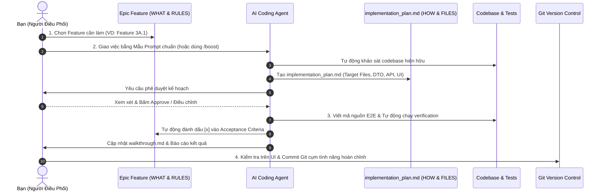

# Sales Copilot Platform — Master Backlog & AI Orchestration Playbook

Chào mừng bạn đến với **Trung tâm Quản trị Kế hoạch & Điều phối AI Coding Agent (Backlog Master Hub)** của dự án Sales Copilot Platform.

---

## Cẩm Nang Điều Phối AI Coding Agent (Orchestration Playbook)

### Nguyên Lý Phân Vai Giữa Người Điều Phối & AI Agent
Để tránh việc tài liệu bị "bội thực kỹ thuật vi mô" và bị lệch so với thực tế codebase:
- **Tài liệu Backlog (Bạn - PO/Architect)**: Tập trung định nghĩa **LÀM CÁI GÌ (WHAT)**, **TẠI SAO (WHY)**, **QUY TẮC NGHIỆP VỤ BẮT BUỘC (BUSINESS RULES)**, **ĐIỀU CẤM (OUT-OF-SCOPE)** và **TIÊU CHÍ NGHIỆM THU (AC)**. Tuyệt đối không phỏng đoán trước tên file hay viết mã thô.
- **Kế Hoạch Thực Thi (AI Agent - `implementation_plan.md`)**: Khi nhận task, AI Agent có trách nhiệm **tự khảo sát codebase** (`find_by_name`, `grep_search`, `view_file`), tìm hiểu các pattern hiện hữu, và tự đề xuất chi tiết **LÀM NHƯ THẾ NÀO (HOW)**: Danh sách file cụ thể (`[NEW]`, `[MODIFY]`), schema fields, DTO signatures, UI components và test cases.

```mermaid
sequenceDiagram
    autonumber
    actor User as Bạn (Người Điều Phối)
    participant Backlog as Epic Feature (WHAT & RULES)
    participant Agent as AI Coding Agent
    participant Plan as implementation_plan.md (HOW & FILES)
    participant Code as Codebase & Tests
    participant Git as Git Version Control

    User->>Backlog: 1. Chọn Feature cần làm (VD: Feature 3A.1)
    User->>Agent: 2. Giao việc bằng Mẫu Prompt chuẩn (hoặc dùng /boost)
    Agent->>Code: Tự động khảo sát codebase hiện hữu
    Agent->>Plan: Tạo implementation_plan.md (Target Files, DTO, API, UI)
    Agent->>User: Yêu cầu phê duyệt kế hoạch
    User-->>Agent: Xem xét & Bấm Approve / Điều chỉnh
    Agent->>Code: 3. Viết mã nguồn E2E & Tự động chạy verification
    Agent->>Backlog: Tự động đánh dấu [x] vào Acceptance Criteria
    Agent->>User: Cập nhật walkthrough.md & Báo cáo kết quả
    User->>Git: 4. Kiểm tra trên UI & Commit Git cụm tính năng hoàn chỉnh
```

### Cấu Trúc Chuẩn 5 Đề Mục Của 1 Feature
Mỗi Feature trong Backlog được chuẩn hóa thành 5 đề mục sắc bén:
1. **Mục tiêu & Trải nghiệm Người dùng (User Journey & Value)**: Luồng thao tác trực quan của người dùng từ đầu đến cuối.
2. **Quy tắc nghiệp vụ & Bất biến (Business Rules & Invariants)**: Các công thức, điều kiện validation, logic nghiệp vụ bắt buộc mà AI không được tự bịa.
3. **Ranh giới & Điều cấm (Constraints & Out-of-Scope)**: Ràng buộc kỹ thuật cốt lõi (multi-tenancy, locking) và ranh giới chặn đứng việc AI phát triển thừa thãi.
4. **Tài liệu tham chiếu (References)**: Trỏ trực tiếp tới section tương ứng trong PRD và Architecture RFC.
5. **Tiêu chí nghiệm thu (Acceptance Criteria & Definition of Done)**: Bộ checklist kiểm thử đo lường được (Happy path, Edge cases, Typecheck, Test suite).

---

## Phân Kỳ Hiện Tại

| Phase | Tên | Trạng Thái | Tài Liệu |
|:------|:----|:----------:|:---------|
| Phase 1 | Foundation & Omnichannel | ✅ Done | [archive/phase-1/](archive/phase-1/) |
| Phase 2 | Commerce & Orders | ✅ Done | [archive/phase-2/](archive/phase-2/) |
| Phase 3 | AI Agent & Cleanup | ✅ Done | [archive/phase-3/](archive/phase-3/) |
| Phase 3C | Expansion (Shipping v2, Zalo) | 📋 Planned | [phase-3c-expansion.md](phase-3c-expansion.md) |
| **Phase 4** | **Comprehensive Codebase Audit** | **📋 Planned** | **[phase-4-codebase-audit.md](phase-4-codebase-audit.md)** |
| AI Backlog | AI Chatbot Hardening | 📋 Ongoing | [ai-chatbot-backlog.md](ai-chatbot-backlog.md) |

