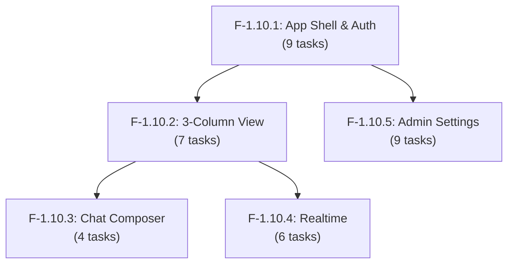

# Epic 1.10: Frontend Dashboard (Next.js) — Task Breakdown

Phân tích và break down 5 Features của Epic 1.10 thành **35 tasks** cho AI coding agent, dựa trên kiến trúc backend đã implement (Epic 1.0–1.9) và shared contracts có sẵn.

---

## Backend Readiness Assessment

Trước khi break down frontend, đây là trạng thái backend và các API sẵn sàng:

| Epic | Status | Key APIs Available |
|------|--------|--------------------|
| 1.0 Foundation | ✅ Done | Prisma 21 models, Docker dev env |
| 1.1 Identity & Tenancy | ✅ Done | `POST /auth/login`, `POST /auth/refresh`, `POST /auth/logout`, `GET /auth/me`, `PATCH /auth/me`, Workspace CRUD, Members, Teams, RBAC Guards |
| 1.2 Contact Management | ✅ Done | Contact CRUD, search, custom attributes |
| 1.3 Channel Platform | ✅ Done | Channel/Inbox CRUD, InboxMember, Webhook Pipeline |
| 1.4 Contact Identity | ✅ Done | ChannelIdentity, Contact Resolution, Contact Merge |
| 1.5 Conversation & Messaging | ✅ Done | Conversations CRUD + filters, Messages CRUD, Attachments (MinIO), Labels |
| 1.6 Channel Integrations | ✅ Done | Web Chat Widget, Facebook, Telegram adapters |
| 1.7 Realtime Engine | ✅ Done | Socket.io Gateway `/realtime`, Presence, Realtime Event Dispatcher, all `WsServerEvent` types |
| 1.8 Assignment & Operations | ✅ Done | Auto-assignment, Canned Responses, Audit Logging |
| 1.9 Automation & Webhooks | 🟡 Ready | Automation Rules Engine, Webhook Subscriptions & Delivery |

**Shared Contracts Available** ([`@sales-copilot/shared-contracts`](file:///d:/workspace/Sales%20Copilot/packages/shared-contracts/src/index.ts)):
Tất cả TypeScript DTOs, Zod schemas, enums, và event payload types đã defined cho: Auth, Workspaces, Users, Teams, Inboxes, Contacts, Conversations, Messages, Labels, Canned Responses, Automation Rules, Webhooks, Realtime events.

**Current Web App State** ([`apps/web`](file:///d:/workspace/Sales%20Copilot/apps/web)):
- Next.js 16 (App Router), React 19, Tailwind CSS v4
- Shadcn v4 initialized (`base-mira` style) — chỉ có 1 Button component
- Placeholder home page, basic root layout với Inter font
- Chưa có: data fetching, auth, routing, state management, WebSocket

---

## Thứ tự triển khai (Dependency Graph)



---

## Design Decisions (Aligned)

> [!IMPORTANT]
> Các quyết định sau đã được align qua interactive review:

| # | Decision | Choice | Rationale |
|---|----------|--------|-----------|
| 1 | Data Fetching | **TanStack Query** + thin `fetch`-based API client dùng `shared-contracts` types | Không cần Axios, type-safe end-to-end |
| 2 | UI Components | **Shadcn/ui** (`base-mira` style, đã init) — add via CLI khi cần | Co-located, accessible, customizable |
| 3 | Auth Flow | **Cookie-based** auth: httpOnly cookies, Next.js middleware route protection | An toàn nhất cho Next.js, chống XSS |
| 4 | Routing | **Route groups**: `(auth)/login`, `(dashboard)/[workspaceSlug]/conversations` | Bookmarkable, multi-tab, human-readable URLs |
| 5 | WebSocket | **Custom `useSocket` hook** + singleton pattern + TanStack Query cache integration | Full control, server state trong 1 nơi |
| 6 | Default Theme | **Dark mode default** + light mode toggle, professional dark palette | Agent dashboard, giảm mỏi mắt |
| 7 | 3-Column Layout | **Resizable panels** (`react-resizable-panels`), collapsible detail panel | Agents customize workflow |
| 8 | Execution Order | F-1.10.1 → F-1.10.2 → F-1.10.3 → F-1.10.4 → F-1.10.5 | Theo dependency graph |
| 9 | Code Organization | `src/lib/api/`, `src/lib/hooks/`, `src/lib/socket/`, `src/features/{domain}/` | Co-location, AGENTS.md YAGNI |
| 10 | Pagination | **Infinite scroll** via `useInfiniteQuery` + Intersection Observer | UX chuẩn cho conversation lists |

---

## Target Directory Structure

```text
apps/web/src/
├── app/
│   ├── (auth)/
│   │   ├── login/page.tsx
│   │   └── layout.tsx                 # Centered auth layout
│   ├── (dashboard)/
│   │   ├── [workspaceSlug]/
│   │   │   ├── layout.tsx             # Dashboard shell (sidebar + main)
│   │   │   ├── conversations/
│   │   │   │   ├── page.tsx           # 3-column conversation view
│   │   │   │   └── [conversationId]/page.tsx  # Deep link to conversation
│   │   │   ├── contacts/
│   │   │   │   └── page.tsx
│   │   │   └── settings/
│   │   │       ├── layout.tsx         # Settings sidebar layout
│   │   │       ├── page.tsx           # General workspace settings
│   │   │       ├── inboxes/page.tsx
│   │   │       ├── teams/page.tsx
│   │   │       ├── members/page.tsx
│   │   │       ├── labels/page.tsx
│   │   │       ├── canned-responses/page.tsx
│   │   │       ├── automation-rules/page.tsx
│   │   │       └── webhooks/page.tsx
│   │   └── layout.tsx                 # Auth-protected wrapper
│   ├── globals.css
│   ├── layout.tsx                     # Root layout (providers)
│   └── page.tsx                       # Redirect to login or dashboard
├── components/
│   └── ui/                            # Shadcn components (auto-generated)
├── features/
│   ├── auth/                          # Login form, auth context
│   ├── conversations/                 # Conversation list, thread, detail
│   ├── composer/                      # Chat composer, canned responses
│   ├── contacts/                      # Contact panel components
│   └── settings/                      # All admin settings components
├── lib/
│   ├── api/                           # API client, typed endpoints
│   ├── hooks/                         # Shared hooks
│   ├── providers/                     # React Query, Theme providers
│   ├── socket/                        # Socket.io client, useSocket
│   └── utils.ts
└── middleware.ts                       # Auth middleware
```

---

## Feature F-1.10.1: App Shell & Authentication — 🟡 Medium

---

### Task 1: Install Core Dependencies

**Feature**: F-1.10.1 (App Shell & Authentication)
**Complexity**: 🟢 Low
**Estimated scope**: 1 file, package installs only

#### Objective

Install runtime và dev dependencies cần thiết cho data fetching và WebSocket realtime. (Lưu ý: `date-fns`, `next-themes`, `react-resizable-panels` và các Shadcn Base UI components đã được cài sẵn).

#### Scope

##### [MODIFY] [package.json](file:///d:/workspace/Sales%20Copilot/apps/web/package.json)

Install các packages:

```bash
pnpm add @tanstack/react-query @tanstack/react-query-devtools socket.io-client
```

| Package | Purpose |
|---------|---------|
| `@tanstack/react-query` | Server state management & cache sync |
| `@tanstack/react-query-devtools` | Dev tools overlay |
| `socket.io-client` | WebSocket client cho namespace `/realtime` |

*(Toast notification sử dụng trực tiếp `@base-ui/react/toast` có sẵn trong `src/components/ui/toast.tsx`, không cần cài thêm `sonner`).*

#### Acceptance Criteria

- [x] `pnpm install` succeeds
- [x] `pnpm nx build web` succeeds
- [x] TypeScript không báo lỗi package imports

#### Dependencies

- Không có dependency — task độc lập đầu tiên

---

### Task 2: Review & Verify Shadcn UI Components

**Feature**: F-1.10.1 (App Shell & Authentication)
**Complexity**: 🟢 Low
**Estimated scope**: 0 files to create (Đã hoàn thành sinh sẵn 38 components trong `src/components/ui/`)

#### Objective

Kiểm tra và verify toàn bộ 38 UI components sinh bởi Shadcn (Base UI variant) sẵn sàng sử dụng: `alert-dialog`, `avatar`, `badge`, `button`, `dialog`, `dropdown-menu`, `input`, `input-otp`, `pagination`, `progress`, `resizable`, `scroll-area`, `select`, `separator`, `sheet`, `sidebar`, `skeleton`, `switch`, `table`, `tabs`, `textarea`, `toast`, `tooltip`, v.v.

#### Scope

- Verify imports trong `src/components/ui/`
- Thiết lập global `ToastProvider` và `ToastViewport` trong layout root

#### Acceptance Criteria

- [x] Tất cả components import không lỗi
- [x] Build succeeds

#### Dependencies

- Task 1 (dependencies installed)

---

### Task 3: Design System — Theme & CSS Variables

**Feature**: F-1.10.1 (App Shell & Authentication)
**Complexity**: 🟡 Medium
**Estimated scope**: 2 files, ~150–200 lines

#### Objective

Configure dark-mode-first design system với CSS variables, professional palette, và dashboard-specific tokens.

#### Scope

##### [MODIFY] [globals.css](file:///d:/workspace/Sales%20Copilot/apps/web/src/app/globals.css)

Dark-mode-first CSS variable palette:

```css
:root {
  /* Base palette — dark mode default */
  --background: 222 15% 8%;        /* Deep gray, not pure black */
  --foreground: 210 20% 95%;
  --card: 222 15% 12%;
  --card-foreground: 210 20% 95%;
  --muted: 222 15% 18%;
  --muted-foreground: 215 15% 60%;
  --border: 222 15% 18%;
  --accent: 245 58% 56%;           /* Indigo-violet — distinctive */
  --accent-foreground: 210 20% 98%;
  --primary: 245 58% 56%;
  --primary-foreground: 210 20% 98%;
  --destructive: 0 72% 51%;
  --ring: 245 58% 56%;

  /* Status colors */
  --status-open: 142 71% 45%;     /* Green */
  --status-pending: 38 92% 50%;   /* Amber */
  --status-resolved: 217 91% 60%; /* Blue */
  --status-snoozed: 262 83% 58%;  /* Purple */

  /* Priority colors */
  --priority-urgent: 0 72% 51%;
  --priority-high: 25 95% 53%;
  --priority-medium: 38 92% 50%;
  --priority-low: 142 71% 45%;
  --priority-none: 215 15% 50%;

  /* Dashboard layout tokens */
  --sidebar-width-collapsed: 64px;
  --sidebar-width-expanded: 240px;
  --header-height: 56px;
  --panel-min-width: 280px;
}

.light {
  --background: 0 0% 100%;
  --foreground: 222 47% 11%;
  --card: 0 0% 98%;
  --card-foreground: 222 47% 11%;
  --muted: 210 40% 96%;
  --muted-foreground: 215 16% 47%;
  --border: 214 32% 91%;
  /* ... matching light variants */
}
```

Typography scale dùng Inter (đã loaded):
- Display: 24px / semibold
- Heading: 18px / medium
- Body: 14px / regular
- Caption: 12px / regular
- Mono: 13px / regular (code, shortcodes)

##### [MODIFY] [tailwind.config.ts](file:///d:/workspace/Sales%20Copilot/apps/web/tailwind.config.ts)

Extend theme với custom status/priority colors nếu cần.

#### Frontend Design Notes

> [!TIP]
> - Accent color: **indigo-violet** (`hsl(245, 58%, 56%)`) — distinctive, không phải default Shadcn blue
> - Dark palette: avoid pure black — dùng `hsl(222, 15%, 8%)` cho depth
> - Type hierarchy rõ ràng: display > heading > body > caption

#### Acceptance Criteria

- [x] Dark mode visually polished và premium
- [x] Light mode consistent và readable
- [x] Status/priority colors defined và accessible (WCAG AA contrast)
- [x] Dashboard layout tokens work

#### Dependencies

- Task 2 (Shadcn components use CSS variables)

---

### Task 4: API Client Foundation

**Feature**: F-1.10.1 (App Shell & Authentication)
**Complexity**: 🟡 Medium
**Estimated scope**: 4 files, ~200–250 lines

#### Objective

Create typed API client sử dụng native `fetch` và types từ `@sales-copilot/shared-contracts`.

#### Scope

##### [NEW] `src/lib/api/client.ts`

Typed API client wrapper:

```typescript
const API_BASE = process.env.NEXT_PUBLIC_API_URL || 'http://localhost:8000/api/v1';

interface ApiResponse<T> {
  success: boolean;
  data: T;
  meta?: { page: number; limit: number; total: number; hasMore: boolean };
}

interface ApiError {
  success: false;
  error: { code: string; message: string; details?: unknown };
}

export async function fetchApi<T>(
  endpoint: string,
  options?: RequestInit,
): Promise<ApiResponse<T>> {
  const res = await fetch(`${API_BASE}${endpoint}`, {
    ...options,
    credentials: 'include', // Send cookies
    headers: {
      'Content-Type': 'application/json',
      ...options?.headers,
    },
  });

  if (!res.ok) {
    const errorBody: ApiError = await res.json().catch(() => ({
      success: false,
      error: { code: 'NETWORK_ERROR', message: res.statusText },
    }));
    throw new ApiClientError(res.status, errorBody.error);
  }

  return res.json();
}

export class ApiClientError extends Error {
  constructor(
    public status: number,
    public error: { code: string; message: string; details?: unknown },
  ) {
    super(error.message);
    this.name = 'ApiClientError';
  }
}
```

##### [NEW] `src/lib/api/types.ts`

Re-export relevant types từ `@sales-copilot/shared-contracts`:

```typescript
export type {
  LoginDto, LoginResponseDto, AuthTokensDto, UserDto,
  WorkspaceDto, UserWorkspaceDto, WorkspaceMemberDto,
  ConversationResponseDto, ConversationListQueryDto,
  MessageResponseDto, ContactDto,
  // ... other types used by frontend
} from '@sales-copilot/shared-contracts';
```

##### [NEW] `src/lib/api/auth.ts`

Auth API endpoints:

```typescript
export const authApi = {
  login: (dto: LoginDto) => fetchApi<LoginResponseDto>('/auth/login', { method: 'POST', body: JSON.stringify(dto) }),
  refresh: (refreshToken: string) => fetchApi<AuthTokensDto>('/auth/refresh', { method: 'POST', body: JSON.stringify({ refreshToken }) }),
  logout: (refreshToken?: string) => fetchApi<{ loggedOut: boolean }>('/auth/logout', { method: 'POST', body: JSON.stringify({ refreshToken }) }),
  me: () => fetchApi<UserDto>('/auth/me'),
  updateProfile: (dto: UpdateUserProfileDto) => fetchApi<UserDto>('/auth/me', { method: 'PATCH', body: JSON.stringify(dto) }),
};
```

##### [NEW] `src/lib/api/workspaces.ts`

Workspace API endpoints:

```typescript
export const workspacesApi = {
  list: () => fetchApi<UserWorkspaceDto[]>('/workspaces'),
  getCurrent: () => fetchApi<WorkspaceDto>('/workspaces/current'),
  update: (dto: UpdateWorkspaceDto) => fetchApi<WorkspaceDto>('/workspaces/current', { method: 'PATCH', body: JSON.stringify(dto) }),
  getMembers: (params?: { page?: number; limit?: number }) => fetchApi<WorkspaceMemberDto[]>('/workspaces/members', { ... }),
};
```

#### Vercel Best Practices

> [!NOTE]
> - `async-parallel`: Dùng `Promise.all()` cho independent API calls
> - `bundle-barrel-imports`: Import specific types từ shared-contracts, không `import * from`

#### Acceptance Criteria

- [x] TypeScript compiles với end-to-end type safety
- [x] Error handling covers: network errors, 401, 403, 404, 422, 500
- [x] Không dùng Axios — pure `fetch`
- [x] `ApiClientError` class typed đúng

#### Dependencies

- Task 1 (shared-contracts dependency available)

---

### Task 5: TanStack Query Provider Setup

**Feature**: F-1.10.1 (App Shell & Authentication)
**Complexity**: 🟢 Low
**Estimated scope**: 3 files, ~80–100 lines

#### Objective

Setup TanStack Query provider với sensible defaults và global error handling.

#### Scope

##### [NEW] `src/lib/providers/query-provider.tsx`

```typescript
'use client';

import { QueryClient, QueryClientProvider } from '@tanstack/react-query';
import { ReactQueryDevtools } from '@tanstack/react-query-devtools';
import { useState } from 'react';
import { ApiClientError } from '@/lib/api/client';

export function QueryProvider({ children }: { children: React.ReactNode }) {
  const [queryClient] = useState(() => new QueryClient({
    defaultOptions: {
      queries: {
        staleTime: 30_000,  // 30s
        retry: 1,
        refetchOnWindowFocus: true,
      },
      mutations: {
        onError: (error) => {
          if (error instanceof ApiClientError && error.status === 401) {
            window.location.href = '/login';
          }
        },
      },
    },
  }));

  return (
    <QueryClientProvider client={queryClient}>
      {children}
      <ReactQueryDevtools initialIsOpen={false} />
    </QueryClientProvider>
  );
}
```

##### [NEW] `src/lib/providers/app-providers.tsx`

Compose tất cả providers (sử dụng Toast component từ Base UI):

```typescript
'use client';

import { ThemeProvider } from 'next-themes';
import { QueryProvider } from './query-provider';
import { ToastProvider, ToastViewport } from '@/components/ui/toast';

export function AppProviders({ children }: { children: React.ReactNode }) {
  return (
    <ThemeProvider attribute="class" defaultTheme="dark" enableSystem={false}>
      <QueryProvider>
        <ToastProvider>
          {children}
          <ToastViewport />
        </ToastProvider>
      </QueryProvider>
    </ThemeProvider>
  );
}
```

##### [MODIFY] [layout.tsx](file:///d:/workspace/Sales%20Copilot/apps/web/src/app/layout.tsx)

Wrap `<body>` children với `<AppProviders>`.

#### Vercel Best Practices

> [!NOTE]
> - `server-serialization`: Providers là client components — minimize data passed
> - `rerender-no-inline-components`: Providers defined trong separate files, không inline

#### Acceptance Criteria

- [x] TanStack Query Devtools visible trong development
- [x] 401 responses globally redirect tới login
- [x] Theme provider defaults tới dark mode
- [x] Toast notifications work

#### Dependencies

- Task 4 (API client for error types)

---

### Task 6: Authentication — Login Page

**Feature**: F-1.10.1 (App Shell & Authentication)
**Complexity**: 🟡 Medium
**Estimated scope**: 4 files, ~200–250 lines

#### Objective

Xây dựng Login page với email/password form, client-side validation, và cookie-based auth flow.

#### Scope

##### [NEW] `src/app/(auth)/layout.tsx`

Centered auth layout:

```typescript
export default function AuthLayout({ children }: { children: React.ReactNode }) {
  return (
    <div className="min-h-screen flex items-center justify-center bg-background">
      {children}
    </div>
  );
}
```

##### [NEW] `src/app/(auth)/login/page.tsx`

Login page wrapper — renders `LoginForm` component.

##### [NEW] `src/features/auth/login-form.tsx`

Client component với:
- **Shadcn form components**: `FieldGroup` + `Field` + `FieldLabel` cho form layout, `Input` cho email/password, `Button` + `Spinner` + `data-icon` cho submit loading state
- Client-side validation reuse `loginSchema` từ `@sales-copilot/shared-contracts`
- Validation errors: dùng `data-invalid` on `Field` + `aria-invalid` on `Input` + `FieldDescription` cho error message
- Submit → call Server Action → `POST /auth/login`
- On success → set cookies (httpOnly, secure, sameSite) → redirect tới `/{workspaceSlug}/conversations`
- Error states: invalid credentials, account disabled, rate limited
- Loading state: `<Button disabled><Spinner data-icon="inline-start" />Signing in...</Button>`
- Visual: `Card` + `CardHeader` + `CardTitle` + `CardContent` với app logo/name, clean dark form

##### [NEW] `src/features/auth/actions.ts`

Next.js Server Actions cho cookie management:

```typescript
'use server';

import { cookies } from 'next/headers';
import { redirect } from 'next/navigation';

export async function loginAction(formData: { email: string; password: string }) {
  const res = await fetch(`${API_BASE}/auth/login`, {
    method: 'POST',
    headers: { 'Content-Type': 'application/json' },
    body: JSON.stringify(formData),
  });

  if (!res.ok) {
    const error = await res.json();
    return { error: error.error };
  }

  const data = await res.json();
  const { tokens, user } = data.data;

  const cookieStore = await cookies();
  cookieStore.set('access_token', tokens.accessToken, {
    httpOnly: true,
    secure: process.env.NODE_ENV === 'production',
    sameSite: 'lax',
    maxAge: tokens.expiresIn,
    path: '/',
  });
  cookieStore.set('refresh_token', tokens.refreshToken, {
    httpOnly: true,
    secure: process.env.NODE_ENV === 'production',
    sameSite: 'lax',
    maxAge: 30 * 24 * 60 * 60, // 30 days
    path: '/',
  });

  // Redirect tới workspace đầu tiên của user
  redirect(`/${user.workspaceSlug || 'default'}/conversations`);
}
```

#### Acceptance Criteria

- [x] Login form validates input trước khi submit
- [x] Successful login stores tokens trong httpOnly cookies
- [x] Redirects tới `/{workspaceSlug}/conversations` sau login
- [x] Error messages rõ ràng và specific
- [x] Loading state hiển thị khi submitting

#### Dependencies

- Task 4 (API client)
- Task 5 (providers wrapping)
- Task 3 (dark theme for styling)

---

### Task 7: Auth Middleware & Route Protection

**Feature**: F-1.10.1 (App Shell & Authentication)
**Complexity**: 🟡 Medium
**Estimated scope**: 2 files, ~100–150 lines

#### Objective

Create Next.js middleware để protect `(dashboard)` routes và handle transparent token refresh.

#### Scope

##### [NEW] `src/middleware.ts`

```typescript
import { NextRequest, NextResponse } from 'next/server';

const PUBLIC_PATHS = ['/login', '/api'];

export async function middleware(request: NextRequest) {
  const { pathname } = request.nextUrl;

  // Skip public paths
  if (PUBLIC_PATHS.some(p => pathname.startsWith(p))) {
    return NextResponse.next();
  }

  const accessToken = request.cookies.get('access_token')?.value;
  const refreshToken = request.cookies.get('refresh_token')?.value;

  // No tokens → redirect to login
  if (!accessToken && !refreshToken) {
    return NextResponse.redirect(new URL('/login', request.url));
  }

  // If access token exists, proceed
  if (accessToken) {
    // Forward token to API calls via cookie (already httpOnly)
    return NextResponse.next();
  }

  // Access token missing but refresh token exists → attempt refresh
  if (refreshToken) {
    try {
      const res = await fetch(`${API_BASE}/auth/refresh`, {
        method: 'POST',
        headers: { 'Content-Type': 'application/json' },
        body: JSON.stringify({ refreshToken }),
      });

      if (res.ok) {
        const data = await res.json();
        const response = NextResponse.next();
        response.cookies.set('access_token', data.data.accessToken, { ... });
        response.cookies.set('refresh_token', data.data.refreshToken, { ... });
        return response;
      }
    } catch {
      // Refresh failed
    }

    // Refresh failed → redirect to login
    return NextResponse.redirect(new URL('/login', request.url));
  }

  return NextResponse.redirect(new URL('/login', request.url));
}

export const config = {
  matcher: ['/((?!_next/static|_next/image|favicon.ico).*)'],
};
```

##### [MODIFY] `src/features/auth/actions.ts`

Add logout Server Action:

```typescript
export async function logoutAction() {
  const cookieStore = await cookies();
  const refreshToken = cookieStore.get('refresh_token')?.value;

  // Call backend logout API
  if (refreshToken) {
    await fetch(`${API_BASE}/auth/logout`, {
      method: 'POST',
      headers: { 'Content-Type': 'application/json' },
      body: JSON.stringify({ refreshToken }),
    }).catch(() => {});
  }

  cookieStore.delete('access_token');
  cookieStore.delete('refresh_token');
  redirect('/login');
}
```

#### Acceptance Criteria

- [x] Unauthenticated users redirected tới login
- [x] Expired tokens transparently refreshed
- [x] Refresh failed → redirect tới login
- [x] Logout clears cookies và redirects
- [x] Public paths (login) accessible without auth

#### Dependencies

- Task 6 (login flow sets cookies)

---

### Task 8: Dashboard Shell Layout — Sidebar + Header

**Feature**: F-1.10.1 (App Shell & Authentication)
**Complexity**: 🟡 Medium
**Estimated scope**: 7 files, ~350–450 lines

#### Objective

Xây dựng dashboard layout với sidebar navigation, header bar, user menu, và theme toggle.

#### Scope

##### [NEW] `src/app/(dashboard)/layout.tsx`

Auth-protected wrapper — renders children only nếu authenticated.

##### [NEW] `src/app/(dashboard)/[workspaceSlug]/layout.tsx`

Dashboard shell layout:

```typescript
export default function DashboardLayout({ children, params }: {
  children: React.ReactNode;
  params: { workspaceSlug: string };
}) {
  return (
    <div className="flex h-screen overflow-hidden bg-background">
      <Sidebar workspaceSlug={params.workspaceSlug} />
      <main className="flex-1 flex flex-col overflow-hidden">
        <Header />
        <div className="flex-1 overflow-hidden">
          {children}
        </div>
      </main>
    </div>
  );
}
```

##### [NEW] `src/components/sidebar.tsx`

Left sidebar:
- Fixed width: ~64px collapsed, ~240px expanded
- App logo/icon at top
- Navigation items: Conversations (MessageSquare), Contacts (Users), Settings (Settings icon)
- Active state indicator: vertical accent stripe bên trái
- Collapse/expand toggle
- Workspace switcher ở trên
- User avatar ở bottom (Slack-style)

##### [NEW] `src/components/header.tsx`

Top header bar (trong main content area):
- Workspace name
- Breadcrumb (nếu cần)
- Theme toggle

##### [NEW] `src/components/user-menu.tsx`

User dropdown menu:
- Avatar + name + email
- Profile link
- Logout action

##### [NEW] `src/components/theme-toggle.tsx`

Dark/Light mode toggle:
- Dùng `next-themes` `useTheme()`
- Sun/Moon icon switch
- Persist preference (localStorage + cookie for SSR)

##### [NEW] `src/features/auth/use-current-user.ts`

Hook dùng TanStack Query:

```typescript
export function useCurrentUser() {
  return useQuery({
    queryKey: ['auth', 'me'],
    queryFn: () => authApi.me(),
    staleTime: 5 * 60 * 1000, // 5 min
  });
}
```

#### Frontend Design Notes

> [!TIP]
> - Sidebar: **minimal và precise** — thin icon-only default với subtle hover expand
> - Active nav item: vertical accent stripe hoặc subtle glow, không phải heavy highlight box
> - User avatar ở bottom sidebar (Slack-style), không phải trong header

#### Acceptance Criteria

- [x] Sidebar navigates between sections
- [x] Active route highlighted trong sidebar
- [x] User menu shows name, email, avatar
- [x] Theme toggle persists preference
- [x] Layout visually polished và premium
- [x] Responsive (minimum 1280px)

#### Dependencies

- Task 6 (auth flow complete)
- Task 7 (middleware protects routes)
- Task 5 (TanStack Query for user data)

---

### Task 9: Workspace Switcher

**Feature**: F-1.10.1 (App Shell & Authentication)
**Complexity**: 🟢 Low–Medium
**Estimated scope**: 3 files, ~100–150 lines

#### Objective

Workspace switcher dropdown cho phép user chuyển giữa các workspaces.

#### Scope

##### [NEW] `src/components/workspace-switcher.tsx`

Dropdown/popover trong sidebar:
- Fetch user's workspaces
- Hiển thị danh sách với workspace name + role
- Current workspace highlighted
- Click → navigate tới `/{newWorkspaceSlug}/conversations`

##### [NEW] `src/lib/hooks/use-workspaces.ts`

```typescript
export function useWorkspaces() {
  return useQuery({
    queryKey: ['workspaces'],
    queryFn: () => workspacesApi.list(),
    staleTime: 5 * 60 * 1000,
  });
}
```

##### [MODIFY] `src/components/sidebar.tsx`

Integrate workspace switcher vào top of sidebar.

#### Acceptance Criteria

- [x] Lists tất cả workspaces user belongs to
- [x] Switch workspace changes URL và reload data context
- [x] Current workspace visually indicated

#### Dependencies

- Task 8 (sidebar component exists)

---

## Feature F-1.10.2: 3-Column Conversation View — 🔴 High

---

### Task 10: API Client — Conversations & Messages

**Feature**: F-1.10.2 (3-Column Conversation View)
**Complexity**: 🟢 Low
**Estimated scope**: 4 files, ~150–200 lines

#### Objective

Create typed API endpoint modules cho conversations, messages, contacts, và labels.

#### Scope

##### [NEW] `src/lib/api/conversations.ts`

```typescript
export const conversationsApi = {
  list: (params: ConversationListQueryDto) =>
    fetchApi<ConversationResponseDto[]>(`/conversations?${buildQuery(params)}`),
  get: (id: string) =>
    fetchApi<ConversationResponseDto>(`/conversations/${id}`),
  updateStatus: (id: string, dto: UpdateConversationStatusDto) =>
    fetchApi<ConversationResponseDto>(`/conversations/${id}/status`, { method: 'PATCH', body: JSON.stringify(dto) }),
  assign: (id: string, dto: AssignConversationDto) =>
    fetchApi<ConversationResponseDto>(`/conversations/${id}/assign`, { method: 'PATCH', body: JSON.stringify(dto) }),
  updatePriority: (id: string, dto: UpdateConversationPriorityDto) =>
    fetchApi<ConversationResponseDto>(`/conversations/${id}/priority`, { method: 'PATCH', body: JSON.stringify(dto) }),
  assignLabels: (id: string, dto: AssignLabelsDto) =>
    fetchApi<ConversationResponseDto>(`/conversations/${id}/labels`, { method: 'POST', body: JSON.stringify(dto) }),
  removeLabel: (id: string, labelId: string) =>
    fetchApi<void>(`/conversations/${id}/labels/${labelId}`, { method: 'DELETE' }),
};
```

##### [NEW] `src/lib/api/messages.ts`

##### [NEW] `src/lib/api/contacts.ts`

##### [NEW] `src/lib/api/labels.ts`

#### Acceptance Criteria

- [x] Tất cả API functions typed với shared-contracts DTOs
- [x] Build succeeds

#### Dependencies

- Task 4 (API client foundation)

---

### Task 11: 3-Column Layout Shell with Resizable Panels

**Feature**: F-1.10.2 (3-Column Conversation View)
**Complexity**: 🟡 Medium
**Estimated scope**: 2 files, ~100–150 lines

#### Objective

Create conversation page với `react-resizable-panels` cho 3-column layout.

#### Scope

##### [NEW] `src/app/(dashboard)/[workspaceSlug]/conversations/page.tsx`

Page wrapper renders `ConversationLayout`.

##### [NEW] `src/features/conversations/conversation-layout.tsx`

> [!IMPORTANT]
> Dùng Shadcn `Resizable` wrapper (`@/components/ui/resizable`) thay vì import trực tiếp từ `react-resizable-panels`. Shadcn wrapper đã styled sẵn resize handles.

```typescript
import { ResizablePanelGroup, ResizablePanel, ResizableHandle } from '@/components/ui/resizable';

export function ConversationLayout() {
  const [detailOpen, setDetailOpen] = useState(true);

  return (
    <ResizablePanelGroup direction="horizontal" autoSaveId="conversation-panels">
      <ResizablePanel defaultSize={25} minSize={20} maxSize={35}>
        <ConversationList />
      </ResizablePanel>
      <ResizableHandle />
      <ResizablePanel minSize={30}>
        <MessageThread />
      </ResizablePanel>
      {detailOpen && (
        <>
          <ResizableHandle />
          <ResizablePanel defaultSize={25} minSize={20} maxSize={35}>
            <DetailPanel onClose={() => setDetailOpen(false)} />
          </ResizablePanel>
        </>
      )}
    </ResizablePanelGroup>
  );
}
```

- Panel sizes persist trong localStorage via `autoSaveId`
- Resize handles với subtle visual indicator
- Detail panel collapsible via toggle button

#### Acceptance Criteria

- [x] 3 panels render correctly
- [x] Resize handles work smoothly
- [x] Detail panel collapses/expands
- [x] Panel sizes persist across page reloads
- [x] Empty state khi no conversation selected

#### Dependencies

- Task 8 (dashboard layout wrapping)

---

### Task 12: Conversation List — Data Hook & Filters

**Feature**: F-1.10.2 (3-Column Conversation View)
**Complexity**: 🟡 Medium
**Estimated scope**: 2 files, ~150–200 lines

#### Objective

Create data hooks cho conversation list với infinite scroll và filters.

#### Scope

##### [NEW] `src/features/conversations/hooks/use-conversations.ts`

```typescript
export function useConversations(filters: ConversationFilters) {
  return useInfiniteQuery({
    queryKey: ['conversations', filters],
    queryFn: ({ pageParam = 1 }) =>
      conversationsApi.list({ ...filters, page: pageParam, limit: 20 }),
    getNextPageParam: (lastPage) =>
      lastPage.meta?.hasMore ? (lastPage.meta.page + 1) : undefined,
    initialPageParam: 1,
  });
}
```

##### [NEW] `src/features/conversations/hooks/use-conversation-filters.ts`

Filter state management (URL search params hoặc React state):
- Status tabs: Open, Pending, Resolved, Snoozed
- Assignment: mine (assigneeId = currentUser), unassigned, all
- Search input (debounced 300ms)
- Inbox filter (optional)

#### Vercel Best Practices

> [!NOTE]
> - `rerender-use-deferred-value`: Dùng `useDeferredValue` cho search input
> - `rerender-derived-state`: Derive filter state từ URL params, không sync

#### Acceptance Criteria

- [x] Conversations load với infinite scroll
- [x] Filters update và refetch
- [x] Debounced search works (300ms)
- [x] Query key changes khi filters change

#### Dependencies

- Task 10 (conversations API)

---

### Task 13: Conversation List — UI Component

**Feature**: F-1.10.2 (3-Column Conversation View)
**Complexity**: 🟡 Medium
**Estimated scope**: 4 files, ~300–400 lines

#### Objective

Create conversation list UI với filter tabs, search, conversation cards, và infinite scroll.

#### Scope

> [!IMPORTANT]
> **Shadcn Component Audit**: Task này PHẢI dùng các Shadcn primitives:
> - `Tabs` + `TabsList` + `TabsTrigger` cho status filter tabs
> - `ToggleGroup` + `ToggleGroupItem` cho Mine | Unassigned | All filter
> - `InputGroup` + `InputGroupInput` + `InputGroupAddon` cho search input với icon
> - `ScrollArea` cho scrollable list container
> - `Avatar` + `AvatarFallback` cho contact avatars
> - `Badge` cho unread count và priority indicators
> - `Skeleton` cho loading states (inline, KHÔNG tạo file riêng)
> - `Separator` giữa các sections

##### [NEW] `src/features/conversations/conversation-list.tsx`

- `Tabs` + `TabsList` + `TabsTrigger` cho status filters (Open | Pending | Resolved | Snoozed)
- `ToggleGroup` cho secondary filters: Mine | Unassigned | All
- `InputGroup` + `InputGroupInput` + `InputGroupAddon` cho search input với search icon (`data-icon`)
- `ScrollArea` với `IntersectionObserver` cho infinite scroll
- Loading state: dùng `Skeleton` component inline (không tạo file riêng)
- Empty states: "No conversations", "No results for search"

##### [NEW] `src/features/conversations/conversation-card.tsx`

Mỗi card hiển thị:
- `Avatar` + `AvatarFallback` cho contact (initials fallback)
- Contact name + last message preview (`truncate` shorthand)
- Timestamp (relative: "2m ago", "1h ago", "Yesterday")
- `Badge` cho unread count
- `Badge` variant cho priority indicator
- Inbox icon nhỏ
- Labels as small `Badge` colored chips
- Active state (highlighted khi selected)

##### [NEW] `src/features/conversations/conversation-list-filters.tsx`

Filter tabs UI component dùng `Tabs` + `ToggleGroup`.

~~##### [NEW] `src/features/conversations/conversation-list-skeleton.tsx`~~

~~Skeleton loading state cho cards.~~ → **Đã gộp vào `conversation-list.tsx`** dùng `Skeleton` component inline.

#### Frontend Design Notes

> [!TIP]
> - Cards: subtle left border color cho priority, không heavy background
> - Unread: bold contact name + `Badge` count (không chỉ dot)
> - Hover: very subtle background shift
> - Selected: left accent border + slightly elevated background
> - Spacing: dùng `gap-*`, KHÔNG `space-y-*`

#### Acceptance Criteria

- [x] Conversation cards show tất cả required info (dùng `Avatar`, `Badge`)
- [x] Active conversation visually highlighted
- [x] Infinite scroll loads more items
- [x] `Skeleton` loading state while fetching (inline, không file riêng)
- [x] Empty states render đúng
- [x] Filter tabs dùng Shadcn `Tabs` + `ToggleGroup`

#### Dependencies

- Task 12 (data hooks)
- Task 11 (layout shell)

---

### Task 14: Message Thread — Data Hook

**Feature**: F-1.10.2 (3-Column Conversation View)
**Complexity**: 🟢 Low–Medium
**Estimated scope**: 2 files, ~80–120 lines

#### Objective

Create data hooks cho message list và single conversation detail.

#### Scope

##### [NEW] `src/features/conversations/hooks/use-messages.ts`

```typescript
export function useMessages(conversationId: string | null) {
  return useInfiniteQuery({
    queryKey: ['messages', conversationId],
    queryFn: ({ pageParam = 1 }) =>
      messagesApi.list(conversationId!, { page: pageParam, limit: 30 }),
    getNextPageParam: (lastPage) =>
      lastPage.meta?.hasMore ? (lastPage.meta.page + 1) : undefined,
    initialPageParam: 1,
    enabled: !!conversationId,
  });
}
```

- Reverse chronological — load older messages on scroll up
- Date grouping logic cho date separators

##### [NEW] `src/features/conversations/hooks/use-conversation.ts`

```typescript
export function useConversation(conversationId: string | null) {
  return useQuery({
    queryKey: ['conversation', conversationId],
    queryFn: () => conversationsApi.get(conversationId!),
    enabled: !!conversationId,
  });
}
```

#### Acceptance Criteria

- [x] Messages load cho selected conversation
- [x] Older messages load on scroll up
- [x] Disabled khi no conversationId
- [x] Date grouping logic correct

#### Dependencies

- Task 10 (messages API)

---

### Task 15: Message Thread — UI Components (Shadcn Chat Primitives)

**Feature**: F-1.10.2 (3-Column Conversation View)
**Complexity**: 🔴 High
**Estimated scope**: 2 files, ~300–400 lines

#### Objective

Create message thread UI bằng cách **compose từ Shadcn Chat primitives** có sẵn: `MessageScroller`, `Message`, `Bubble`, `Attachment`, `Marker`. KHÔNG tự build bubble divs, scroll containers, hay date separators.

> [!CAUTION]
> **Shadcn Audit — PHẢI dùng components có sẵn:**
> - `MessageScrollerProvider` + `MessageScroller` + `MessageScrollerViewport` + `MessageScrollerContent` + `MessageScrollerItem` + `MessageScrollerButton` → thay cho custom scroll container + scroll-to-bottom button
> - `Message` + `MessageAvatar` + `MessageContent` + `MessageHeader` + `MessageFooter` + `MessageGroup` → thay cho custom message row layout
> - `Bubble` + `BubbleContent` → thay cho custom `message-bubble.tsx` với hand-styled divs
> - `Attachment` + `AttachmentMedia` + `AttachmentContent` + `AttachmentTitle` + `AttachmentDescription` + `AttachmentActions` + `AttachmentGroup` → thay cho custom `attachment-preview.tsx`
> - `Marker` (variant `separator`) + `MarkerContent` → thay cho custom `date-separator.tsx`
> - `Avatar` + `AvatarFallback` → cho sender avatars
> - `Badge` → cho status, delivery indicators

#### Scope

##### [NEW] `src/features/conversations/message-thread.tsx`

Container component compose Shadcn Chat primitives:

```typescript
import { MessageScrollerProvider, MessageScroller, MessageScrollerViewport,
  MessageScrollerContent, MessageScrollerItem, MessageScrollerButton } from '@/components/ui/message-scroller';
import { Message, MessageAvatar, MessageContent, MessageHeader, MessageFooter } from '@/components/ui/message';
import { Bubble, BubbleContent } from '@/components/ui/bubble';
import { Marker, MarkerContent } from '@/components/ui/marker';
import { Attachment, AttachmentMedia, AttachmentContent, AttachmentTitle,
  AttachmentDescription, AttachmentActions, AttachmentAction, AttachmentGroup } from '@/components/ui/attachment';
import { Avatar, AvatarImage, AvatarFallback } from '@/components/ui/avatar';
import { Badge } from '@/components/ui/badge';
```

Structure:
- Thread header: contact name, `Badge` cho conversation status, quick action buttons
- `MessageScrollerProvider` (autoScroll) wrapping:
  - `MessageScroller` > `MessageScrollerViewport` > `MessageScrollerContent`
  - Each message as `MessageScrollerItem` containing composed `Message` + `Bubble`
  - Date separators: `Marker variant="separator"` + `MarkerContent`
  - `MessageScrollerButton` cho "scroll to bottom" (built-in, auto-shows khi scrolled up)

Message rendering by type (inside `MessageScrollerItem`):
- **Inbound** (contact): `<Message align="start">` + `<Bubble variant="muted">` + `<BubbleContent>`
- **Outbound** (agent): `<Message align="end">` + `<Bubble variant="default" align="end">` + `<BubbleContent>`
- **System/activity**: `<Marker>` + `<MarkerContent>` (centered, muted text)
- **Private notes**: `<Message align="start">` + `<Bubble variant="tinted">` + lock icon + "Note" label
- Sender info: `<MessageAvatar>` + `<Avatar>` + `<AvatarFallback>` cho inbound
- Timestamps: `<MessageFooter>` dưới mỗi bubble
- Delivery status: `Badge` variant cho sent ✓, delivered ✓✓, read ✓✓

Attachments (inside `BubbleContent` hoặc sau `Bubble`):
- Image: `<Attachment>` + `<AttachmentMedia variant="image">` + ``
- File: `<Attachment>` + `<AttachmentMedia variant="icon">` + `<AttachmentContent>` + `<AttachmentTitle>` + `<AttachmentDescription>` + `<AttachmentActions>`
- Multiple: wrap in `<AttachmentGroup>`

##### [NEW] `src/features/conversations/message-thread-header.tsx`

Thread header (tách cho clean component):
- Contact name
- Conversation status `Badge`
- Quick actions: toggle detail panel, resolve conversation

~~##### [NEW] `src/features/conversations/message-bubble.tsx`~~ → **REMOVED: Dùng Shadcn `Bubble` + `BubbleContent`**
~~##### [NEW] `src/features/conversations/attachment-preview.tsx`~~ → **REMOVED: Dùng Shadcn `Attachment` + `AttachmentGroup`**
~~##### [NEW] `src/features/conversations/date-separator.tsx`~~ → **REMOVED: Dùng Shadcn `Marker variant="separator"`**
~~##### [NEW] `src/features/conversations/scroll-to-bottom.tsx`~~ → **REMOVED: Dùng Shadcn `MessageScrollerButton` (built-in)**

#### Frontend Design Notes

> [!TIP]
> - Dùng `Bubble` variants: `default` (outbound), `muted` (inbound), `tinted` (private notes)
> - `MessageScrollerButton` tự hiện khi scroll up — không cần custom logic
> - `Marker variant="separator"` cho date separators — không cần custom divider component
> - `AttachmentGroup` cho multiple attachments — auto layout
> - Spacing: dùng `gap-*`, KHÔNG `space-y-*`

#### Acceptance Criteria

- [x] Messages render correctly by type dùng `Message` + `Bubble` (inbound, outbound, system, note)
- [x] Attachments display dùng `Attachment` + `AttachmentGroup` (images inline, files as cards)
- [x] Auto-scroll works via `MessageScrollerProvider autoScroll`
- [x] Date separators dùng `Marker variant="separator"`
- [x] "Scroll to bottom" via `MessageScrollerButton` (no custom implementation)
- [x] ❌ KHÔNG có custom bubble divs, scroll containers, hay date separators

#### Dependencies

- Task 14 (data hooks)
- Task 11 (layout panel)

---

### Task 16: Contact & Conversation Detail Panel

**Feature**: F-1.10.2 (3-Column Conversation View)
**Complexity**: 🟡 Medium
**Estimated scope**: 5 files, ~350–450 lines

#### Objective

Create detail panel (right column) với contact info, conversation actions, labels, và previous conversations.

#### Scope

##### [NEW] `src/features/conversations/detail-panel.tsx`

Container component with sections:

> [!IMPORTANT]
> **Shadcn Component Audit**: Task này PHẢI dùng:
> - `Select` + `SelectGroup` + `SelectItem` cho status, priority, assignee, team dropdowns
> - `Badge` cho status display, priority indicators
> - `Popover` + `Command` cho label search picker
> - `Badge` cho removable label chips
> - `Avatar` + `AvatarFallback` cho contact avatar
> - `Card` + `CardHeader` + `CardContent` cho section containers
> - `Separator` cho section dividers
> - `AlertDialog` cho destructive confirmations

##### [NEW] `src/features/conversations/contact-info.tsx`

- Large avatar with initials fallback
- Name (editable inline)
- Email, phone (clickable `mailto:` / `tel:` links)
- Custom attributes (key-value pairs)

##### [NEW] `src/features/conversations/conversation-actions.tsx`

- Status badge with dropdown to change (`OPEN` → `PENDING` → `RESOLVED` → `SNOOZED`)
- Priority selector (dropdown)
- Assignee selector (dropdown of workspace members)
- Team selector (dropdown of teams)

##### [NEW] `src/features/conversations/label-manager.tsx`

- Current labels as removable chips (click X to remove)
- "Add label" button → popover with workspace labels list
- Color swatch next to label name

##### [NEW] `src/features/conversations/hooks/use-conversation-mutations.ts`

```typescript
export function useUpdateConversationStatus(conversationId: string) {
  const queryClient = useQueryClient();
  return useMutation({
    mutationFn: (dto: UpdateConversationStatusDto) =>
      conversationsApi.updateStatus(conversationId, dto),
    onSuccess: (data) => {
      queryClient.setQueryData(['conversation', conversationId], data);
      queryClient.invalidateQueries({ queryKey: ['conversations'] });
    },
  });
}

// Similar hooks for assign, priority, labels
```

#### Acceptance Criteria

- [x] Contact info displays correctly
- [x] Status change → API call → UI updates
- [x] Assignment change → API call → UI updates
- [x] Labels add/remove works
- [x] Previous conversations listed (nếu API supports)
- [x] Channel identities displayed

#### Dependencies

- Task 14 (conversation data hook)
- Task 10 (contacts API)
- Task 11 (detail panel in layout)

---

## Feature F-1.10.3: Live Chat Composer — 🟡 Medium

---

### Task 17: Basic Composer — Text Input & Send

**Feature**: F-1.10.3 (Live Chat Composer)
**Complexity**: 🟡 Medium
**Estimated scope**: 2 files, ~150–200 lines

#### Objective

Create chat composer component với auto-resize textarea, send functionality, và optimistic updates.

#### Scope

##### [NEW] `src/features/composer/chat-composer.tsx`

- Auto-resizing textarea (grows với content, max 6 lines)
- Send button (disabled when empty)
- `Enter` sends, `Shift+Enter` new line
- `Cmd/Ctrl+Enter` send (alternative)

##### [NEW] `src/features/composer/hooks/use-send-message.ts`

```typescript
export function useSendMessage(conversationId: string) {
  const queryClient = useQueryClient();

  return useMutation({
    mutationFn: (dto: CreateMessageDto) =>
      messagesApi.create(conversationId, dto),
    onMutate: async (dto) => {
      // Cancel outgoing refetches
      await queryClient.cancelQueries({ queryKey: ['messages', conversationId] });

      // Snapshot previous value
      const previous = queryClient.getQueryData(['messages', conversationId]);

      // Optimistic update: add message with temp ID
      queryClient.setQueryData(['messages', conversationId], (old) => {
        // Prepend optimistic message
        return addOptimisticMessage(old, dto, tempId);
      });

      return { previous };
    },
    onError: (err, dto, context) => {
      // Rollback on error
      queryClient.setQueryData(['messages', conversationId], context?.previous);
    },
    onSettled: () => {
      queryClient.invalidateQueries({ queryKey: ['messages', conversationId] });
    },
  });
}
```

#### Acceptance Criteria

- [x] Message sends on Enter
- [x] Textarea auto-resizes
- [x] Optimistic update shows message immediately
- [x] Send button disabled when empty
- [x] Failed sends show error state

#### Dependencies

- Task 15 (message thread renders messages)
- Task 10 (messages API)

---

### Task 18: Private Note Toggle

**Feature**: F-1.10.3 (Live Chat Composer)
**Complexity**: 🟢 Low
**Estimated scope**: 1 file modified, ~30–50 lines

#### Objective

Add private note toggle vào composer.

#### Scope

##### [MODIFY] `src/features/composer/chat-composer.tsx`

- Toggle button trong composer toolbar: "Reply" ↔ "Note"
- `Cmd/Ctrl+Shift+Enter` shortcut to toggle
- Note mode: composer background tints amber, label hiển thị "Private Note"
- Sends message với `messageType: 'NOTE'` thay vì `'OUTGOING'`

#### Acceptance Criteria

- [x] Toggle switches giữa Reply và Note
- [x] Note mode có distinct visual treatment (amber tint)
- [x] Keyboard shortcut works
- [x] API sends correct message type

#### Dependencies

- Task 17 (basic composer exists)

---

### Task 19: Canned Response Picker

**Feature**: F-1.10.3 (Live Chat Composer)
**Complexity**: 🟡 Medium
**Estimated scope**: 3 files, ~150–200 lines

#### Objective

Create canned response picker triggered by `/` trong composer.

#### Scope

##### [NEW] `src/features/composer/canned-response-picker.tsx`

- Khi user gõ `/` → trigger search popup (Command palette style, dùng Shadcn `Command` component)
- Fetch canned responses từ `GET /canned-responses` (cached via TanStack Query)
- Search/filter as user types after `/`
- Select response → insert content vào textarea (replace the `/keyword`)
- Dismiss on `Escape` hoặc click outside
- Show shortcode + preview content trong dropdown items

##### [NEW] `src/lib/api/canned-responses.ts`

```typescript
export const cannedResponsesApi = {
  list: (params?: { search?: string }) =>
    fetchApi<CannedResponseDto[]>(`/canned-responses${params?.search ? `?search=${params.search}` : ''}`),
  create: (dto: CreateCannedResponseDto) => ...,
  update: (id: string, dto: UpdateCannedResponseDto) => ...,
  delete: (id: string) => ...,
};
```

##### [NEW] `src/features/composer/hooks/use-canned-responses.ts`

```typescript
export function useCannedResponses(search?: string) {
  return useQuery({
    queryKey: ['canned-responses', search],
    queryFn: () => cannedResponsesApi.list({ search }),
    staleTime: 5 * 60 * 1000,
  });
}
```

#### Acceptance Criteria

- [x] Gõ `/` triggers picker
- [x] Filtering works as user types
- [x] Select response inserts content vào textarea
- [x] Escape dismisses picker

#### Dependencies

- Task 17 (composer component)

---

### Task 20: File Upload with Preview & Clipboard Paste

**Feature**: F-1.10.3 (Live Chat Composer)
**Complexity**: 🟡 Medium
**Estimated scope**: 3 files, ~200–250 lines

#### Objective

Create file attachment upload với image preview, progress indicator, và hỗ trợ dán ảnh trực tiếp từ Clipboard (`Ctrl+V` / `Cmd+V`) như Chatwoot.

#### Scope

##### [NEW] `src/features/composer/file-upload.tsx`

- Attachment button → hidden file input + drag-and-drop zone
- Clipboard image paste handler: bắt sự kiện `onPaste` trên textarea, trích xuất `items[i].getAsFile()` khi type là `image/*`
- Support multiple files (images, pdfs, docs)
- File type detection & validation (size limit 10MB)

##### [NEW] `src/features/composer/attachment-preview-bar.tsx`

Bar hiển thị trên composer khi có attachments:

> [!IMPORTANT]
> **Shadcn Audit**: Dùng `Attachment` + `AttachmentGroup` từ `@/components/ui/attachment` cho preview bar.
> - Image files: `AttachmentMedia variant="image"` + thumbnail
> - Other files: `AttachmentMedia variant="icon"` + `AttachmentTitle` + `AttachmentDescription`
> - Upload progress: `Attachment state="uploading"` (built-in shimmer animation)
> - Remove button: `AttachmentActions` + `AttachmentAction`

##### [MODIFY] `src/features/composer/hooks/use-send-message.ts`

Extend to support multipart form data khi có attachments:

```typescript
// When attachments exist, use FormData instead of JSON
const formData = new FormData();
formData.append('content', dto.content);
dto.attachments?.forEach(file => formData.append('attachments', file));
```

#### Acceptance Criteria

- [x] File selection via button và drag-and-drop
- [x] Dán ảnh trực tiếp từ clipboard (`Cmd+V` / `Ctrl+V`) vào textarea hiển thị thumbnail preview
- [x] Image preview trước send
- [x] Upload progress visible
- [x] Remove attachment works
- [x] File + text message sends correctly

#### Dependencies

- Task 17 (composer component)

---

## Feature F-1.10.4: Realtime Integration — 🔴 High

---

### Task 21: Socket.io Client — Connection & Auth

**Feature**: F-1.10.4 (Realtime Integration)
**Complexity**: 🟡 Medium
**Estimated scope**: 3 files, ~200–250 lines

#### Objective

Create Socket.io client singleton, React Context provider, và connection management hooks.

#### Chatwoot Reference

Chatwoot frontend dùng ActionCable client kết nối qua `pubsub_token`. Chúng ta dùng Socket.io client kết nối namespace `/realtime` với JWT auth.

#### Scope

##### [NEW] `src/lib/socket/socket-client.ts`

Singleton Socket.io client:

```typescript
import { io, Socket } from 'socket.io-client';

let socket: Socket | null = null;

export function getSocket(token: string): Socket {
  if (socket?.connected) return socket;

  socket = io(`${SOCKET_URL}/realtime`, {
    auth: { token },
    autoConnect: true,
    reconnection: true,
    reconnectionAttempts: 10,
    reconnectionDelay: 1000,
    reconnectionDelayMax: 30000,
    transports: ['websocket'],
  });

  return socket;
}

export function disconnectSocket() {
  socket?.disconnect();
  socket = null;
}
```

##### [NEW] `src/lib/socket/socket-provider.tsx`

React Context:

```typescript
'use client';

const SocketContext = createContext<Socket | null>(null);

export function SocketProvider({ children }: { children: React.ReactNode }) {
  const [socket, setSocket] = useState<Socket | null>(null);

  useEffect(() => {
    // Get token from cookie (via API route) and connect
    const connect = async () => {
      const token = await getAccessToken(); // Server action or API route
      const s = getSocket(token);
      setSocket(s);

      s.on('connect', () => {
        // Join workspace room
        s.emit('join_workspace', { workspaceId: currentWorkspaceId });
      });
    };

    connect();
    return () => disconnectSocket();
  }, []);

  return (
    <SocketContext.Provider value={socket}>
      {children}
    </SocketContext.Provider>
  );
}
```

##### [NEW] `src/lib/socket/use-socket.ts`

```typescript
export function useSocket() {
  return useContext(SocketContext);
}

export function useSocketEvent<T>(event: string, handler: (data: T) => void) {
  const socket = useSocket();

  useEffect(() => {
    if (!socket) return;
    socket.on(event, handler);
    return () => { socket.off(event, handler); };
  }, [socket, event, handler]);
}
```

#### Acceptance Criteria

- [x] Socket connects với JWT auth
- [x] Joins workspace room on connect
- [x] Reconnects after network interruption
- [x] Connection state exposed to UI
- [x] Event listeners properly cleaned up on unmount

#### Dependencies

- Task 6 (auth cookies for JWT token)
- Task 5 (providers wrapping)

---

### Task 22: Realtime Event Handlers — Messages & Conversations

**Feature**: F-1.10.4 (Realtime Integration)
**Complexity**: 🔴 High
**Estimated scope**: 2 files, ~250–350 lines

#### Objective

Listen to WebSocket events và sync TanStack Query cache cho instant UI updates.

#### Scope

##### [NEW] `src/lib/socket/use-realtime-sync.ts`

Central hook that listens to all realtime events và updates TanStack Query cache:

```typescript
export function useRealtimeSync() {
  const queryClient = useQueryClient();
  const socket = useSocket();

  // message.created
  useSocketEvent<MessageCreatedEventData>(WsServerEvent.MESSAGE_CREATED, (data) => {
    // 1. Append message to messages query cache (if conversation is viewed)
    queryClient.setQueryData(['messages', data.message.conversationId], (old) => {
      if (!old) return old;
      // Check for duplicate (optimistic update already added)
      if (findMessageById(old, data.message.id)) return old;
      return appendMessage(old, data.message);
    });

    // 2. Update conversation's lastMessage and lastActivityAt in list
    queryClient.setQueryData(['conversations'], (old) => {
      return updateConversationInList(old, data.message.conversationId, {
        lastMessage: data.message,
        lastActivityAt: data.message.createdAt,
      });
    });

    // 3. Increment unreadMessagesCount if not current conversation
    // (handled by conversation list cache update)
  });

  // conversation.status_updated
  useSocketEvent(WsServerEvent.CONVERSATION_STATUS_UPDATED, (data) => {
    queryClient.setQueryData(['conversation', data.conversationId], (old) => ({
      ...old, status: data.currentStatus,
    }));
    queryClient.invalidateQueries({ queryKey: ['conversations'] });
  });

  // conversation.assigned
  useSocketEvent(WsServerEvent.CONVERSATION_ASSIGNED, (data) => {
    queryClient.setQueryData(['conversation', data.conversationId], (old) => ({
      ...old, assigneeId: data.newAssigneeId, teamId: data.teamId,
    }));
    queryClient.invalidateQueries({ queryKey: ['conversations'] });
  });

  // conversation.created — add to list
  // conversation.priority_updated — update priority
  // conversation.labels_updated — update labels
  // contact.updated — update contact in detail panel
}
```

##### [NEW] `src/lib/socket/use-conversation-room.ts`

Join/leave conversation room khi viewing:

```typescript
export function useConversationRoom(conversationId: string | null) {
  const socket = useSocket();

  useEffect(() => {
    if (!socket || !conversationId) return;

    socket.emit('join_conversation', { conversationId });

    return () => {
      socket.emit('leave_conversation', { conversationId });
    };
  }, [socket, conversationId]);
}
```

#### Vercel Best Practices

> [!NOTE]
> - `rerender-functional-setstate`: Dùng functional updates cho query cache mutations
> - `rerender-move-effect-to-event`: Socket event handlers trong event callbacks, không effects

#### Acceptance Criteria

- [x] New messages appear in real-time without polling
- [x] Conversation list updates in real-time
- [x] Status/assignment changes reflected immediately
- [x] Proper cleanup khi switching conversations
- [x] No duplicate messages

#### Dependencies

- Task 21 (socket connection)
- Task 12 (conversation hooks for cache structure)
- Task 14 (message hooks for cache structure)

---

### Task 23: Optimistic Updates & Reconciliation

**Feature**: F-1.10.4 (Realtime Integration)
**Complexity**: 🟡 Medium
**Estimated scope**: 2 files modified, ~80–120 lines

#### Objective

Ensure optimistic message sends không bị duplicate khi WebSocket event arrives.

#### Scope

##### [MODIFY] `src/features/composer/hooks/use-send-message.ts`

Enhance optimistic logic:
1. Add message với `status: 'sending'` + `tempId` (UUID)
2. Store `tempId` trong optimistic message metadata
3. On API success: replace temp message với server response (real ID, timestamp)
4. On error: mark message `status: 'failed'`, show retry

##### [MODIFY] `src/lib/socket/use-realtime-sync.ts`

Add dedup logic trong `message.created` handler:
1. Check if message already exists in cache (by server ID)
2. Check if there's an optimistic message matching by `tempId` in metadata
3. If match found → replace optimistic với server message
4. If no match → append as new message (from another user/source)

#### Acceptance Criteria

- [x] Sent messages appear instantly (no delay)
- [x] No duplicate messages khi WebSocket event arrives
- [x] Failed messages show retry option
- [x] Reconciled messages have correct server data (ID, timestamp)

#### Dependencies

- Task 17 (send message mutation)
- Task 22 (realtime sync)

---

### Task 24: Browser Notifications & Audio Chimes

**Feature**: F-1.10.4 (Realtime Integration)
**Complexity**: 🟢 Low–Medium
**Estimated scope**: 2 files, ~80–120 lines

#### Objective

Browser notifications và âm thanh chime (HTML5 Audio) khi có tin nhắn mới từ contact (tham khảo Chatwoot `audioNotificationAudio.js`).

#### Scope

##### [NEW] `src/lib/hooks/use-browser-notifications.ts`

```typescript
export function useBrowserNotifications() {
  const [permission, setPermission] = useState(Notification.permission);

  const requestPermission = async () => {
    const result = await Notification.requestPermission();
    setPermission(result);
  };

  const playNotificationSound = () => {
    try {
      const audio = new Audio('/sounds/ding.mp3');
      audio.play().catch(() => {});
    } catch {
      // Audio autoplay policy fallback
    }
  };

  const notify = (title: string, body: string, onClick?: () => void) => {
    playNotificationSound();

    if (permission !== 'granted' || document.hasFocus()) return;

    const notification = new Notification(title, { body, icon: '/icon.png' });
    if (onClick) {
      notification.onclick = () => {
        window.focus();
        onClick();
      };
    }
  };

  return { permission, requestPermission, notify, playNotificationSound };
}
```

##### [MODIFY] `src/lib/socket/use-realtime-sync.ts`

Trigger notification trong `message.created` handler:
- Only khi message is from contact (incoming)
- Notification content: contact name + message preview
- Phát âm thanh `playNotificationSound()`
- Click → focus tab + navigate to conversation

#### Acceptance Criteria

- [x] Notification shows khi tab inactive
- [x] Click notification focuses tab
- [x] Âm thanh chime phát khi có tin nhắn mới
- [x] User preference (localStorage) to enable/disable
- [x] Only incoming contact messages trigger notifications

#### Dependencies

- Task 22 (realtime sync handles events)

---

### Task 25: Presence Indicators

**Feature**: F-1.10.4 (Realtime Integration)
**Complexity**: 🟢 Low
**Estimated scope**: 2 files, ~60–80 lines

#### Objective

Show online/offline indicators cho agents.

#### Scope

##### [NEW] `src/lib/socket/use-presence.ts`

```typescript
export function usePresence() {
  const socket = useSocket();
  const [onlineUsers, setOnlineUsers] = useState<Set<string>>(new Set());

  useSocketEvent(WsServerEvent.PRESENCE_UPDATED, (data: { userId: string; status: 'online' | 'offline' }) => {
    setOnlineUsers(prev => {
      const next = new Set(prev);
      if (data.status === 'online') next.add(data.userId);
      else next.delete(data.userId);
      return next;
    });
  });

  // Send heartbeat mỗi 30s
  useEffect(() => {
    if (!socket) return;
    const interval = setInterval(() => {
      socket.emit('heartbeat');
    }, 30_000);
    return () => clearInterval(interval);
  }, [socket]);

  return { onlineUsers, isOnline: (userId: string) => onlineUsers.has(userId) };
}
```

##### [NEW] `src/components/online-indicator.tsx`

Small green dot component, rendered trên agent avatars.

#### Acceptance Criteria

- [x] Green dot on online agent avatars
- [x] Indicator updates in real-time
- [x] Own presence maintained via heartbeat

#### Dependencies

- Task 21 (socket connection)

---

### Task 26: Typing Indicators (Nice-to-have)

**Feature**: F-1.10.4 (Realtime Integration)
**Complexity**: 🟢 Low
**Estimated scope**: 2 files, ~60–80 lines

#### Objective

Show "X is typing..." indicators.

#### Scope

##### [NEW] `src/features/composer/use-typing-indicator.ts`

```typescript
export function useTypingIndicator(conversationId: string) {
  const socket = useSocket();
  const timeoutRef = useRef<NodeJS.Timeout>();

  const startTyping = useCallback(() => {
    socket?.emit('start_typing', { conversationId, isTyping: true });
    clearTimeout(timeoutRef.current);
    timeoutRef.current = setTimeout(() => {
      socket?.emit('stop_typing', { conversationId, isTyping: false });
    }, 3000);
  }, [socket, conversationId]);

  return { startTyping };
}
```

##### [NEW] `src/features/conversations/typing-indicator.tsx`

- Listen `typing.start` / `typing.stop` events từ other users
- Show "Agent Name is typing..." below message thread
- Animated dots (...) indicator

#### Acceptance Criteria

- [x] "X is typing..." appears khi another agent types
- [x] Disappears khi they stop (3s timeout)
- [x] Own typing emitted to others

#### Dependencies

- Task 21 (socket connection)
- Task 17 (composer component)

---

## Feature F-1.10.5: Workspace Administration — 🔴 High

---

### Task 27: Settings Layout & Navigation

**Feature**: F-1.10.5 (Workspace Administration)
**Complexity**: 🟢 Low–Medium
**Estimated scope**: 3 files, ~150–200 lines

#### Objective

Create settings layout với sidebar navigation và RBAC-based visibility.

#### Scope

##### [NEW] `src/app/(dashboard)/[workspaceSlug]/settings/layout.tsx`

Settings page layout:

> [!IMPORTANT]
> **Shadcn Component Audit**: Settings pages PHẢI dùng:
> - `Sidebar*` primitives từ `@/components/ui/sidebar` cho settings navigation (KHÔNG tự build sidebar)
> - `Table` + `TableHeader` + `TableBody` + `TableRow` + `TableCell` cho list views
> - `Dialog` + `DialogTitle` + `DialogHeader` cho create/edit forms
> - `AlertDialog` cho destructive confirmations (delete)
> - `FieldGroup` + `Field` + `FieldLabel` cho ALL form layouts
> - `Select` + `SelectGroup` + `SelectItem` cho dropdowns
> - `Combobox` cho searchable selects
> - `Switch` cho active/inactive toggles
> - `Badge` cho status badges
> - `Card` + `CardHeader` + `CardContent` cho section containers
> - `toast.success()` / `toast.error()` từ `sonner` cho notifications

- Left sidebar navigation (different from dashboard sidebar)
- Sections: General, Inboxes, Teams, Members, Labels, Canned Responses, Automation Rules, Webhooks
- Route-based active state

##### [NEW] `src/app/(dashboard)/[workspaceSlug]/settings/page.tsx`

Redirect tới General settings (hoặc first accessible section).

##### [NEW] `src/features/settings/settings-nav.tsx`

Settings sidebar navigation component:
- Navigation items với icons
- Active section highlighted
- RBAC visibility: ẩn sections mà user's role không có access
- Back button to return to main dashboard

#### Acceptance Criteria

- [x] Settings sidebar navigates between sections
- [x] Active section highlighted
- [x] RBAC ẩn unauthorized sections
- [x] Back button works
- [x] ADMIN/OWNER full access, AGENT limited, VIEWER redirect

#### Dependencies

- Task 8 (dashboard layout)

---

### Task 28: General Workspace Settings

**Feature**: F-1.10.5 (Workspace Administration)
**Complexity**: 🟢 Low
**Estimated scope**: 2 files, ~100–150 lines

#### Objective

Workspace general settings form.

#### Scope

##### [NEW] `src/app/(dashboard)/[workspaceSlug]/settings/general/page.tsx`

##### [NEW] `src/features/settings/workspace-settings-form.tsx`

Form fields:
- Workspace name (editable)
- Slug (readonly display)
- Timezone (select)
- Default language (select)
- Save button → `PATCH /workspaces/current`
- Success toast notification via `sonner`: `toast.success('Workspace settings updated')`

#### Acceptance Criteria

- [x] Form loads với current workspace data
- [x] Save updates workspace
- [x] Validation errors shown inline
- [x] Success toast on save

#### Dependencies

- Task 27 (settings layout)

---

### Task 29: Members & Roles Management

**Feature**: F-1.10.5 (Workspace Administration)
**Complexity**: 🟡 Medium
**Estimated scope**: 3 files, ~200–250 lines

#### Objective

Manage workspace members: list, invite, change role, remove.

#### Scope

##### [NEW] `src/app/(dashboard)/[workspaceSlug]/settings/members/page.tsx`

##### [NEW] `src/features/settings/members-table.tsx`

Table columns: Avatar, Name, Email, Role (dropdown), Status, Actions (remove)
- Role change: dropdown in row → confirmation → `PATCH /workspaces/members/:id/role`
- Remove: destructive confirmation dialog → `DELETE /workspaces/members/:id`
- ADMIN-only actions

##### [NEW] `src/features/settings/invite-member-dialog.tsx`

Dialog: email input + role selector → `POST /workspaces/members`

#### Acceptance Criteria

- [x] Members listed in table
- [x] Invite dialog sends email/adds user
- [x] Role change works with confirmation
- [x] Remove with destructive confirmation
- [x] Non-ADMIN cannot access

#### Dependencies

- Task 27 (settings layout)

---

### Task 30: Teams Management

**Feature**: F-1.10.5 (Workspace Administration)
**Complexity**: 🟢 Low
**Estimated scope**: 4 files, ~150–200 lines

#### Objective

Teams CRUD management.

#### Scope

##### [NEW] `src/app/(dashboard)/[workspaceSlug]/settings/teams/page.tsx`

##### [NEW] `src/features/settings/teams-list.tsx`

Teams list (cards hoặc table): name, description, member count, actions.

##### [NEW] `src/features/settings/team-form-dialog.tsx`

Create/edit dialog: name + description + member multi-select.

##### [NEW] `src/lib/api/teams.ts`

```typescript
export const teamsApi = {
  list: () => fetchApi<TeamDto[]>('/teams'),
  create: (dto: CreateTeamDto) => ...,
  update: (id: string, dto: UpdateTeamDto) => ...,
  delete: (id: string) => ...,
  addMember: (teamId: string, memberId: string) => ...,
  removeMember: (teamId: string, memberId: string) => ...,
};
```

#### Acceptance Criteria

- [ ] Teams CRUD works
- [ ] Member assignment works
- [ ] Destructive actions confirmed

#### Dependencies

- Task 27 (settings layout)

---

### Task 31: Labels Management

**Feature**: F-1.10.5 (Workspace Administration)
**Complexity**: 🟢 Low
**Estimated scope**: 3 files, ~120–150 lines

#### Objective

Labels CRUD management với color picker.

#### Scope

##### [NEW] `src/app/(dashboard)/[workspaceSlug]/settings/labels/page.tsx`

##### [NEW] `src/features/settings/labels-list.tsx`

Labels list với color swatches: title, color preview, actions (edit, delete).

##### [NEW] `src/features/settings/label-form-dialog.tsx`

Create/edit dialog:
- Title input
- Color picker: predefined palette (8–10 colors) + custom hex input
- Preview label chip

#### Acceptance Criteria

- [ ] Labels CRUD works
- [ ] Color picker shows predefined palette + custom hex input
- [ ] Destructive delete confirmed

#### Dependencies

- Task 27 (settings layout)

---

### Task 32: Canned Responses Management

**Feature**: F-1.10.5 (Workspace Administration)
**Complexity**: 🟢 Low
**Estimated scope**: 3 files, ~120–150 lines

#### Objective

Canned responses CRUD management.

#### Scope

##### [NEW] `src/app/(dashboard)/[workspaceSlug]/settings/canned-responses/page.tsx`

##### [NEW] `src/features/settings/canned-responses-list.tsx`

List: shortcode (monospace), content preview (truncated), actions.
- Search/filter by shortcode

##### [NEW] `src/features/settings/canned-response-form-dialog.tsx`

Create/edit dialog:
- Shortcode input (monospace, validated format)
- Content textarea (full response text)

#### Acceptance Criteria

- [ ] CRUD cho canned responses works
- [ ] Search by shortcode
- [ ] Destructive delete confirmed

#### Dependencies

- Task 27 (settings layout)
- Task 19 (canned responses API already created)

---

### Task 33: Inboxes & Channels Management

**Feature**: F-1.10.5 (Workspace Administration)
**Complexity**: 🔴 High
**Estimated scope**: 8 files, ~400–500 lines

#### Objective

Inboxes list và multi-step creation wizard cho different channel types.

> [!IMPORTANT]
> Channel credentials are encrypted on the backend. Frontend phải mask credential fields — show `••••••••` cho existing values, chỉ send new values khi changed.

#### Scope

##### [NEW] `src/app/(dashboard)/[workspaceSlug]/settings/inboxes/page.tsx`

##### [NEW] `src/features/settings/inboxes-list.tsx`

Inbox list: name, channel type icon, status badge (active/inactive), member count, actions.

##### [NEW] `src/features/settings/inbox-wizard/inbox-wizard.tsx`

Multi-step wizard container (step tracking, navigation, validation per step).

##### [NEW] `src/features/settings/inbox-wizard/step-select-channel.tsx`

Step 1: Select channel type:
- Web Chat (Globe icon)
- Facebook Messenger (Facebook icon)
- Telegram (Send icon)
- Email (Mail icon)

Card-based selection, click to proceed.

##### [NEW] `src/features/settings/inbox-wizard/step-credentials.tsx`

Step 2: Channel-specific credential forms:
- **Web Chat**: name, welcome message, widget color picker
- **Facebook**: Page Access Token, App ID, App Secret (all masked)
- **Telegram**: Bot Token (masked)
- **Email**: SMTP host/port/user/pass, IMAP settings

##### [NEW] `src/features/settings/inbox-wizard/step-review.tsx`

Step 3: Review configuration → confirm → create inbox + channel.

##### [NEW] `src/features/settings/inbox-edit-form.tsx`

Edit existing inbox: update settings, masked credentials, manage inbox members.

##### [NEW] `src/lib/api/inboxes.ts`

```typescript
export const inboxesApi = {
  list: () => fetchApi<InboxDto[]>('/inboxes'),
  get: (id: string) => fetchApi<InboxDto>(`/inboxes/${id}`),
  create: (dto: CreateInboxDto) => fetchApi<InboxDto>('/inboxes', { method: 'POST', ... }),
  update: (id: string, dto: UpdateInboxDto) => fetchApi<InboxDto>(`/inboxes/${id}`, { method: 'PATCH', ... }),
  delete: (id: string) => fetchApi<void>(`/inboxes/${id}`, { method: 'DELETE' }),
  getMembers: (id: string) => ...,
  addMember: (id: string, memberId: string) => ...,
  removeMember: (id: string, memberId: string) => ...,
};
```

#### Acceptance Criteria

- [ ] Inbox list hiển thị đúng
- [ ] Wizard guides through creation steps
- [ ] Channel-specific credential forms render đúng per type
- [ ] Credentials masked cho existing inboxes (`••••••••`)
- [ ] Inbox members manageable
- [ ] Delete with destructive confirmation

#### Dependencies

- Task 27 (settings layout)

---

### Task 34: Automation Rules Builder

**Feature**: F-1.10.5 (Workspace Administration)
**Complexity**: 🔴 High
**Estimated scope**: 6 files, ~400–500 lines

#### Objective

Visual automation rule builder (form-based, không drag-and-drop) tạo ra JSON structure compatible với backend's condition-matcher và executor.

> [!IMPORTANT]
> Backend đã có `automation-executor.service.ts` và `condition-matcher.ts`. Frontend cần build form produce cùng JSON condition/action structure.

#### Scope

##### [NEW] `src/app/(dashboard)/[workspaceSlug]/settings/automation-rules/page.tsx`

##### [NEW] `src/features/settings/automation-rules-list.tsx`

List: name, trigger type badge, status toggle (active/inactive), actions count, actions.

##### [NEW] `src/features/settings/automation-rule-builder/rule-builder.tsx`

Rule builder form container:
- Name + description inputs
- Trigger selector section
- Conditions builder section
- Actions builder section
- Save / Cancel buttons

##### [NEW] `src/features/settings/automation-rule-builder/condition-row.tsx`

Each condition row:
- Attribute selector dropdown (conversation status, priority, inbox, contact email, etc.)
- Operator dropdown (equals, not_equals, contains, etc.)
- Value input (text, select, hoặc multi-select depending on attribute)
- Remove row button
- AND/OR logic selector between rows

##### [NEW] `src/features/settings/automation-rule-builder/action-row.tsx`

Each action row:
- Action type selector (assign_agent, assign_team, add_label, change_status, send_webhook)
- Parameters (agent selector, team selector, label selector, status selector, webhook URL)
- Remove row button

##### [NEW] `src/lib/api/automation-rules.ts`

```typescript
export const automationRulesApi = {
  list: () => fetchApi<AutomationRuleDto[]>('/automation-rules'),
  get: (id: string) => fetchApi<AutomationRuleDto>(`/automation-rules/${id}`),
  create: (dto: CreateAutomationRuleDto) => ...,
  update: (id: string, dto: UpdateAutomationRuleDto) => ...,
  delete: (id: string) => ...,
  toggleActive: (id: string, active: boolean) => ...,
};
```

#### Acceptance Criteria

- [ ] Rules list with active/inactive toggle
- [ ] Builder produces valid condition/action JSON (matching backend format)
- [ ] Add/remove condition rows works
- [ ] Add/remove action rows works
- [ ] Dynamic parameter inputs based on action type
- [ ] Form validation before save

#### Dependencies

- Task 27 (settings layout)

---

### Task 35: Webhook Subscriptions & Delivery Logs

**Feature**: F-1.10.5 (Workspace Administration)
**Complexity**: 🟡 Medium
**Estimated scope**: 5 files, ~250–300 lines

#### Objective

Webhook subscriptions CRUD và delivery logs viewer.

#### Scope

##### [NEW] `src/app/(dashboard)/[workspaceSlug]/settings/webhooks/page.tsx`

##### [NEW] `src/features/settings/webhooks-list.tsx`

Subscriptions list: URL (truncated), event types badges, status, actions.

##### [NEW] `src/features/settings/webhook-form-dialog.tsx`

Create/edit dialog:
- URL input (validated URL format)
- Event types multi-select checklist (conversation.created, message.created, etc.)
- Secret (optional, masked)

##### [NEW] `src/features/settings/webhook-delivery-logs.tsx`

Per-subscription delivery logs:
- Table: timestamp, event type, HTTP status code badge, response time, attempts count
- Expandable row showing request/response payload (JSON formatted)
- Status badge: success (2xx → green), client error (4xx → amber), server error (5xx → red), pending (gray)

##### [NEW] `src/lib/api/webhooks.ts`

```typescript
export const webhooksApi = {
  listSubscriptions: () => fetchApi<WebhookSubscriptionDto[]>('/webhook-subscriptions'),
  createSubscription: (dto: CreateWebhookSubscriptionDto) => ...,
  updateSubscription: (id: string, dto: UpdateWebhookSubscriptionDto) => ...,
  deleteSubscription: (id: string) => ...,
  getDeliveryLogs: (subscriptionId: string, params?: PaginationParams) => ...,
};
```

#### Acceptance Criteria

- [ ] Webhook CRUD với event type picker
- [ ] Delivery logs show history với status badges
- [ ] Expandable rows cho payload details
- [ ] Destructive delete confirmed

#### Dependencies

- Task 27 (settings layout)

---

## Verification Plan

### Automated Tests

```bash
pnpm nx run web:build        # TypeScript compiles và Next.js builds
pnpm nx run web:lint         # Code style correct
```

### Manual Verification

Cho mỗi feature, verify trong browser tại `http://localhost:3000`:

1. **F-1.10.1**: Login → redirect → sidebar navigation → workspace switch → theme toggle → logout
2. **F-1.10.2**: Conversation list loads → filters work → click conversation → messages render → detail panel shows contact → actions work
3. **F-1.10.3**: Type message → send → canned response `/` trigger → file upload → private note toggle
4. **F-1.10.4**: Open two tabs → send message from one → appears in other real-time → browser notification khi tab inactive
5. **F-1.10.5**: Navigate Settings → each CRUD section works → Inbox wizard completes → Automation rule builder saves valid JSON → Webhook delivery logs render

---

## Summary

| Feature | Tasks | Task IDs | Estimate |
|---------|-------|----------|----------|
| F-1.10.1: App Shell & Auth | 9 | T1–T9 | ~10–14 hrs |
| F-1.10.2: 3-Column View | 7 | T10–T16 | ~12–17 hrs |
| F-1.10.3: Chat Composer | 4 | T17–T20 | ~3.5–5.5 hrs |
| F-1.10.4: Realtime | 6 | T21–T26 | ~6–9 hrs |
| F-1.10.5: Admin Settings | 9 | T27–T35 | ~12–16 hrs |
| **Total** | **35** | **T1–T35** | **~43.5–61.5 hrs** |

Mỗi task được thiết kế để **self-contained và independently implementable** bởi AI coding agent trong 1 session (30 min – 4 hrs max).
