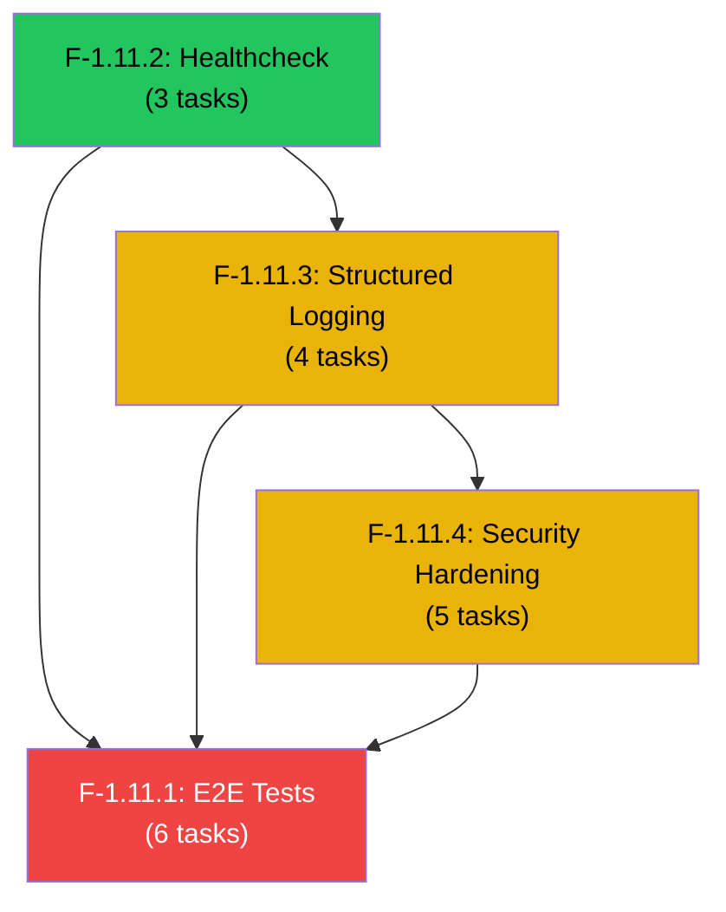

# Epic 1.11: Integration & Reliability

## 1. Overview

Thiết lập bộ kiểm thử tích hợp Vertical Slice End-to-End kiểm chứng toàn bộ chu trình sống của tin nhắn từ Webhook Inbound đến Realtime UI, các endpoint kiểm tra sức khỏe hệ thống (Healthchecks), Structured JSON Telemetry Logging, và security hardening trước khi chuyển sang Phase 2.

- **ID**: `EPIC-1.11`
- **Status**: 🟡 Ready
- **Dependencies**: Hoàn thành toàn bộ `EPIC-1.0` đến `EPIC-1.10`
- **References**:
  - `docs/references/chatwoot/source/tests/playwright/`

---

## 2. Features Summary

| Feature | Tên | Complexity | Lý do |
| :--- | :--- | :---: | :--- |
| **F-1.11.1** | Vertical Slice E2E Tests | 🔴 **High** | 5 test scenarios end-to-end, Docker test environment, multi-module integration, WebSocket assertion, database seed/cleanup |
| **F-1.11.2** | Healthcheck Endpoints | 🟢 **Low** | Simple dependency checks (DB, Redis, MinIO), standard response format |
| **F-1.11.3** | Structured Logging & Telemetry | 🟡 **Medium** | Pino integration, request ID correlation, sensitive data redaction, per-environment config |
| **F-1.11.4** | Security Hardening | 🟡 **Medium** | Rate limiting, CORS, Helmet headers, input sanitization review, JWT policy verification |

---

## 3. Feature Specifications

---

### 📦 Feature F-1.11.1: Vertical Slice E2E Tests — 🔴 High

#### Objective

Xây dựng bộ E2E tests kiểm chứng toàn bộ luồng nghiệp vụ chính từ đầu đến cuối, bao gồm tất cả các module tương tác với nhau.

#### Scope

- **Test Scenario 1 — Inbound Message Flow**:
  Webhook inbound → ChannelEvent dedup → Contact Resolution → Conversation creation → Message storage → WebSocket broadcast
- **Test Scenario 2 — Agent Reply Flow**:
  Agent gửi message → Message storage → Delivery status → Outbound channel send → WebSocket broadcast
- **Test Scenario 3 — Auto-Assignment Flow**:
  Conversation created → Auto-assignment evaluate → Agent assigned → WebSocket notification
- **Test Scenario 4 — Automation Rule Flow**:
  Message created → Automation rule evaluate → Conditions match → Actions execute (assign, label, webhook)
- **Test Scenario 5 — Contact Merge Flow**:
  Merge contacts → Transfer identities, conversations, messages → Audit log → WebSocket broadcast
- Test infrastructure: Docker Compose test environment, database seeding, cleanup

#### Acceptance Criteria

- [ ] Tất cả 5 test scenarios pass end-to-end
- [ ] Tests chạy trong isolated Docker environment
- [ ] Database được seed và cleanup sau mỗi test run
- [ ] WebSocket events được verify trong test assertions
- [ ] Tests có thể chạy trong CI pipeline

#### Dependencies

- Tất cả Epic 1.0–1.9

---

### 📦 Feature F-1.11.2: Healthcheck Endpoints — 🟢 Low

#### Objective

Cung cấp endpoint kiểm tra sức khỏe hệ thống cho monitoring và Kubernetes probes.

#### Scope

- `GET /health` — comprehensive health check:
  - PostgreSQL connectivity
  - Redis connectivity
  - MinIO connectivity
  - BullMQ queue status
- `GET /health/ready` — readiness probe (database migrations applied, services initialized)
- `GET /health/live` — liveness probe (process alive, not deadlocked)
- Response format: `{ status: 'ok' | 'degraded' | 'down', checks: { ... } }`

#### Acceptance Criteria

- [ ] `/health` trả về status và chi tiết từng dependency
- [ ] Database down → status `degraded` hoặc `down`
- [ ] Redis down → status `degraded`
- [ ] Kubernetes readiness/liveness probes hoạt động đúng
- [ ] Endpoints không yêu cầu authentication (public)

#### Dependencies

- `EPIC-1.0` (Foundation — database, Redis, MinIO)

---

### 📦 Feature F-1.11.3: Structured Logging & Telemetry — 🟡 Medium

#### Objective

Cấu hình structured JSON logging với Pino cho toàn bộ application, hỗ trợ request correlation và performance metrics.

#### Scope

- Pino logger integration với NestJS
- Structured JSON log format: timestamp, level, message, context, requestId, workspaceId
- Request correlation: `X-Request-Id` header → propagate through entire request lifecycle
- Performance logging: request duration, database query count
- Log levels configuration per environment (development: debug, production: info)
- Sensitive data redaction (passwords, tokens, credentials)

#### Acceptance Criteria

- [ ] Logs output structured JSON format
- [ ] Request ID correlation end-to-end (HTTP request → service → database)
- [ ] Sensitive data (passwords, tokens) NEVER appear in logs
- [ ] Log levels configurable via environment variable
- [ ] Request duration logged cho mỗi API call
- [ ] WorkspaceId included trong log context khi available

#### Dependencies

- `EPIC-1.0` (Foundation)

---

### 📦 Feature F-1.11.4: Security Hardening — 🟡 Medium

#### Objective

Áp dụng các biện pháp bảo mật cuối cùng trước production deployment.

#### Scope

- Rate limiting: `ThrottlerGuard` cho API endpoints (configurable per-route)
- CORS configuration: whitelist allowed origins
- Helmet security headers: X-Frame-Options, X-Content-Type-Options, Strict-Transport-Security, etc.
- Input sanitization review: ensure no XSS/injection vectors
- JWT token expiration review: access token 15m, refresh token 7d
- API documentation: Swagger/OpenAPI spec generation (optional)

#### Acceptance Criteria

- [ ] Rate limiting active: quá nhiều requests → `429 Too Many Requests`
- [ ] CORS chỉ cho phép whitelisted origins
- [ ] Security headers present trên tất cả responses
- [ ] No XSS vectors trong user-supplied content (sanitize HTML in message content)
- [ ] JWT expiration configured theo policy
- [ ] NFR-4 compliance verified

#### Dependencies

- `EPIC-1.0` (Foundation)

---

## 4. Task Breakdown

Phân tích và break down 4 Features thành **18 tasks** cho AI coding agent, dựa trên codebase hiện tại (Epic 1.0–1.10 Done).

---

### Existing Infrastructure Assessment

| Component | Status | Details |
|-----------|--------|---------|
| HttpExceptionFilter | ✅ Done | `@Catch()`, ZodError → 400, HttpException → mapped code, Unknown → 500 |
| TransformInterceptor | ✅ Done | `{ success: true, data, meta? }` envelope |
| RequestIdMiddleware | ✅ Done | `x-request-id` generate/propagate, forwarded to BullMQ jobs |
| LoggingInterceptor | ✅ Done | HTTP method, URL, status, response time — text format |
| `GET /health` | ✅ Partial | DB/Redis/MinIO ping, missing `/ready`, `/live`, BullMQ check |
| ThrottlerGuard | ✅ Done | Global 100 req/60s, Login 5 req/60s |
| Helmet + CORS | ✅ Done | `helmet()`, CORS origin whitelist from env |
| BullMQ Queues | ✅ Done | `channel-ingestion`, `webhook-delivery` with retry logic |
| WebSocket Gateway | ✅ Done | `/realtime` namespace, JWT auth, Redis adapter, presence heartbeat |
| Prisma Connection | ✅ Done | `pg.Pool` adapter, connection retry, pool config |
| Frontend Error Pages | ❌ Missing | No `error.tsx`, `not-found.tsx`, `global-error.tsx` |
| Structured JSON Logging | ❌ Missing | Using NestJS built-in text Logger |
| E2E Test Suite | ❌ Missing | Only unit + integration tests exist |

---

### Design Decisions (Aligned)

| # | Decision | Choice | Rationale |
|---|----------|--------|-----------|
| 1 | E2E Test Runner | `jest` + `supertest` + `@nestjs/testing` | NestJS ecosystem standard, rich utilities |
| 2 | Test Environment | Reuse `docker-compose.dev.yml`, separate DB `sales_copilot_test`, truncate tables | KISS, no extra Docker setup |
| 3 | WebSocket Assertion | `TestWebSocketClient` helper wrapping `socket.io-client` + `waitForEvent()` | True E2E WebSocket verification |
| 4 | E2E Scope | All 5 scenarios | Epic cuối Phase 1, cần full coverage |
| 5 | Healthcheck | Mở rộng `AppController` + `AppService` hiện tại | KISS, không tạo module mới |
| 6 | Logging | `nestjs-pino` package + `pino-pretty` dev | Auto HTTP logging, NestJS Logger compatible |
| 7 | Redaction | passwords, tokens, credentials, PII (email/phone), cookies, request bodies | Comprehensive sensitive data protection |
| 8 | XSS Sanitization | `sanitize-html` server-side | Lightweight, strip dangerous HTML, giữ safe tags |
| 9 | Swagger | Skip (YAGNI) | Không block epic, có `api-contract.md` |
| 10 | Frontend Error Pages | Có — `error.tsx`, `not-found.tsx`, `global-error.tsx` | Graceful error handling |
| 11 | Feature Order | F-1.11.2 → F-1.11.3 → F-1.11.4 → F-1.11.1 | Infra first, E2E tests cuối |
| 12 | Execution | Tuần tự | Tránh merge conflict, dễ kiểm soát |
| 13 | Task Detail | 5–10 dòng scope + AC checklist | Đủ context cho AI agent |

---

### Thứ tự triển khai (Dependency Graph)



> F-1.11.2 (Low) → F-1.11.3 (Medium) → F-1.11.4 (Medium) → F-1.11.1 (High)

---

### Feature F-1.11.2: Healthcheck Endpoints — Task Breakdown

---

#### Task 1: Readiness & Liveness Probes

**Feature**: F-1.11.2 · **Complexity**: 🟢 Low

**Objective**: Thêm `/health/ready` và `/health/live` endpoints vào `AppController` hiện tại.

**Scope**:
- **[MODIFY]** `apps/server/src/app.controller.ts`: Thêm 2 endpoints `@Public()`:
  - `GET /health/live` — liveness probe: trả `{ status: 'ok' }` nếu process alive (luôn trả 200 trừ khi deadlock).
  - `GET /health/ready` — readiness probe: kiểm tra database migrations applied (`prisma.$queryRaw` check schema version), services initialized. Trả 503 nếu chưa ready.
- **[MODIFY]** `apps/server/src/app.service.ts`: Thêm `getLiveness()` và `getReadiness()` methods.

**Acceptance Criteria**:
- [x] `GET /health/live` trả `200 { status: 'ok' }` khi server running
- [x] `GET /health/ready` trả `200` khi DB connected & migrations applied, `503` khi chưa ready
- [x] Cả 2 endpoints không yêu cầu authentication (`@Public()`)

---

#### Task 2: BullMQ Queue Health Check

**Feature**: F-1.11.2 · **Complexity**: 🟢 Low

**Objective**: Thêm BullMQ queue connectivity check vào `/health` comprehensive endpoint hiện tại.

**Scope**:
- **[MODIFY]** `apps/server/src/app.service.ts`: Trong `getHealth()`, thêm check cho mỗi registered queue (`channel-ingestion`, `webhook-delivery`) bằng `Queue.isReady()` hoặc `Queue.getJobCounts()`. Include kết quả trong `dependencies.queues`.
- **[MODIFY]** `apps/server/src/app.module.ts`: Inject `@InjectQueue()` cho 2 queues vào `AppService` (hoặc thông qua `QueueModule` export).

**Acceptance Criteria**:
- [x] `/health` response bao gồm `dependencies.queues: { channelIngestion: 'ok', webhookDelivery: 'ok' }`
- [x] Queue unavailable → status `degraded`
- [x] Không tạo module mới, inject queue references trực tiếp

---

#### Task 3: Healthcheck Unit Tests

**Feature**: F-1.11.2 · **Complexity**: 🟢 Low

**Objective**: Test healthcheck endpoints cover các scenarios: all healthy, DB down, Redis down, queue unavailable.

**Scope**:
- **[NEW]** `apps/server/src/__tests__/app.service.spec.ts`: Unit tests cho `getHealth()`, `getLiveness()`, `getReadiness()` với mocked dependencies. Test 4 scenarios: all OK → `ok`, DB down → `down`, Redis down → `degraded`, queue error → `degraded`.

**Acceptance Criteria**:
- [ ] ≥ 6 test cases covering healthy/degraded/down states
- [ ] Mock dependencies, không cần real DB/Redis
- [ ] Tests pass với `pnpm nx test server`

---

### Feature F-1.11.3: Structured Logging & Telemetry — Task Breakdown

---

#### Task 4: Install & Configure nestjs-pino

**Feature**: F-1.11.3 · **Complexity**: 🟢 Low

**Objective**: Cài đặt `nestjs-pino` + `pino-http` + `pino-pretty` và configure cơ bản trong `AppModule`.

**Scope**:
- Install: `pnpm add nestjs-pino pino-http pino-pretty --filter @sales-copilot/server`
- **[MODIFY]** `apps/server/src/app.module.ts`: Import `LoggerModule.forRootAsync()` với config:
  - `pinoHttp.level`: từ env `LOG_LEVEL` (default: `info`, dev: `debug`)
  - `pinoHttp.transport`: `pino-pretty` khi `NODE_ENV !== 'production'`
  - `pinoHttp.autoLogging`: `true` (auto-log HTTP requests)
  - `pinoHttp.serializers`: custom request/response serializers (log summary, not full body)
- **[MODIFY]** `apps/server/src/main.ts`: Set `bufferLogs: true`, call `app.useLogger(app.get(Logger))`. Xóa `LoggingInterceptor` khỏi `app.useGlobalInterceptors()` (nestjs-pino auto-logs HTTP).
- **[MODIFY]** `apps/server/.env.example`: Thêm `LOG_LEVEL=debug`.

**Acceptance Criteria**:
- [ ] Logs output structured JSON format trong production mode
- [ ] Logs output pretty-printed trong development mode
- [ ] HTTP requests tự động được log (method, url, status, responseTime)
- [ ] `LOG_LEVEL` env variable hoạt động
- [ ] `LoggingInterceptor` đã được remove (tránh duplicate logging)

---

#### Task 5: Request ID Correlation & Context Enrichment

**Feature**: F-1.11.3 · **Complexity**: 🟡 Medium

**Objective**: Propagate `x-request-id` và `workspaceId` vào mọi log entry thông qua Pino logger context.

**Scope**:
- **[MODIFY]** `nestjs-pino` config: Configure `pinoHttp.customProps` để extract `req.headers['x-request-id']` thành field `requestId`. Include `userId` và `workspaceId` từ request context khi authenticated.
- **Verify**: BullMQ processors log với `requestId` context từ job data.

**Acceptance Criteria**:
- [ ] Mọi log entry chứa `requestId` field
- [ ] Authenticated request logs chứa `userId`, `workspaceId`
- [ ] BullMQ processor logs có `requestId` từ original HTTP request
- [ ] Log format: `{ level, time, requestId, workspaceId?, userId?, msg, ... }`

---

#### Task 6: Sensitive Data Redaction

**Feature**: F-1.11.3 · **Complexity**: 🟢 Low

**Objective**: Configure Pino redaction để không bao giờ log plaintext sensitive data.

**Scope**:
- **[MODIFY]** Pino config: Thêm `pinoHttp.redact` với paths cho `authorization`, `cookie`, `password`, `accessToken`, `refreshToken`, `credentials`, `pageAccessToken`, `appSecret`, `webhookSecret`, `email`, `phone`, `set-cookie`. Censor: `[REDACTED]`.

**Acceptance Criteria**:
- [ ] Passwords, tokens, credentials NEVER appear in logs
- [ ] PII fields (email, phone) redacted
- [ ] Cookie & Authorization headers redacted
- [ ] Request body sensitive fields redacted

---

#### Task 7: Logging Tests & Verification

**Feature**: F-1.11.3 · **Complexity**: 🟢 Low

**Objective**: Unit tests verify redaction hoạt động đúng.

**Scope**:
- **[NEW]** `apps/server/src/common/__tests__/logging.spec.ts`: Test pino redaction config, verify sensitive fields replaced by `[REDACTED]`.

**Acceptance Criteria**:
- [ ] Test verify password, authorization, credentials redaction
- [ ] Tests pass với `pnpm nx test server`

---

### Feature F-1.11.4: Security Hardening — Task Breakdown

---

#### Task 8: Per-Route Rate Limiting Configuration

**Feature**: F-1.11.4 · **Complexity**: 🟢 Low

**Objective**: Fine-tune rate limits cho endpoint categories.

**Scope**:
- Auth endpoints: 5 req/min (đã có)
- Webhook inbound: `@Throttle({ default: { limit: 200, ttl: 60000 } })` — cao hơn cho Facebook batch
- File upload: `@Throttle({ default: { limit: 20, ttl: 60000 } })`
- Verify `ThrottlerBehindProxyGuard` cho Cloudflare Tunnel (trust `X-Forwarded-For`)

**Acceptance Criteria**:
- [ ] Webhook: 200 req/min, Upload: 20 req/min, General: 100 req/min
- [ ] Rate limit exceeded → `429 Too Many Requests`
- [ ] Correct client IP detection behind proxy

---

#### Task 9: CORS Strict Configuration & Verification

**Feature**: F-1.11.4 · **Complexity**: 🟢 Low

**Objective**: Verify và tighten CORS, đảm bảo chỉ whitelisted origins.

**Scope**:
- Review CORS config: `CORS_ORIGIN` parsing, `credentials: true`, explicit methods & headers.
- Document `CORS_ORIGIN` format trong `.env.example`.

**Acceptance Criteria**:
- [ ] Unlisted origins bị blocked
- [ ] Listed origins hoạt động (credentials, preflight)
- [ ] `CORS_ORIGIN` documented

---

#### Task 10: HTML Sanitization for Message Content

**Feature**: F-1.11.4 · **Complexity**: 🟡 Medium

**Objective**: Sanitize HTML trong message content trước khi lưu DB, ngăn XSS.

**Scope**:
- Install: `pnpm add sanitize-html @types/sanitize-html --filter @sales-copilot/server`
- **[NEW]** `apps/server/src/common/utils/html-sanitizer.ts`: `sanitizeMessageContent()` cho phép safe tags, strip `<script>`, `on*` handlers, `javascript:` URLs.
- **[MODIFY]** `messages.service.ts`: Gọi sanitize trước khi lưu message.
- **[NEW]** `apps/server/src/common/__tests__/html-sanitizer.spec.ts`: Tests.

**Acceptance Criteria**:
- [ ] `<script>` stripped, `onclick` removed, `javascript:` href removed
- [ ] Safe HTML preserved: `<b>`, `<a href="https://...">`, etc.
- [ ] Applied cho cả inbound messages và agent replies
- [ ] Unit tests pass

---

#### Task 11: Frontend Error Pages

**Feature**: F-1.11.4 · **Complexity**: 🟢 Low

**Objective**: Tạo graceful error pages cho Next.js app.

**Scope**:
- **[NEW]** `apps/web/src/app/global-error.tsx`: Root error boundary, "Something went wrong" + "Try Again"
- **[NEW]** `apps/web/src/app/not-found.tsx`: 404 page + "Go to Dashboard"
- **[NEW]** `apps/web/src/app/(dashboard)/[workspaceSlug]/error.tsx`: Dashboard error, giữ sidebar
- **[NEW]** `apps/web/src/app/(auth)/error.tsx`: Auth error + "Back to Login"
- Dùng Shadcn UI components, semantic Tailwind classes, dark-mode compatible.

**Acceptance Criteria**:
- [ ] Unhandled error → error page với "Try Again"
- [ ] Non-existent URL → 404 page
- [ ] Dark-mode compatible
- [ ] `pnpm nx build web` thành công

---

#### Task 12: JWT Policy & Security Headers Verification

**Feature**: F-1.11.4 · **Complexity**: 🟢 Low

**Objective**: Audit JWT policy, Helmet headers, tổng hợp security checklist.

**Scope**:
- Verify JWT: access 15m, refresh 7d, httpOnly, Secure, SameSite
- Verify Helmet: X-Frame-Options, X-Content-Type-Options, HSTS
- Thêm CSP header nếu thiếu
- **[NEW]** `apps/server/src/__tests__/security-headers.spec.ts`: Test security headers

**Acceptance Criteria**:
- [ ] JWT expiration configured đúng policy
- [ ] Cookies set with httpOnly, Secure, SameSite
- [ ] All Helmet security headers present
- [ ] Security headers test pass

---

### Feature F-1.11.1: Vertical Slice E2E Tests — Task Breakdown

---

#### Task 13: E2E Test Infrastructure Setup

**Feature**: F-1.11.1 · **Complexity**: 🟡 Medium

**Objective**: Setup Jest + Supertest cho E2E testing.

**Scope**:
- Install: `jest`, `@types/jest`, `ts-jest`, `supertest`, `@types/supertest`, `@nestjs/testing`
- **[NEW]** `apps/server/test/e2e/jest-e2e.config.ts`: Jest config, `testTimeout: 30000`
- **[NEW]** `apps/server/test/e2e/helpers/setup.ts`: `createTestApp()` — boot NestJS, override DB to `sales_copilot_test`
- **[NEW]** `apps/server/test/e2e/helpers/seed.ts`: `seedTestData()` + `cleanupTestData()`
- **[NEW]** `apps/server/test/e2e/helpers/auth.ts`: `loginAsAgent()`
- **[MODIFY]** `apps/server/project.json`: Thêm target `test:e2e`

**Acceptance Criteria**:
- [ ] `createTestApp()` boot full NestJS app
- [ ] `seedTestData()` / `cleanupTestData()` work
- [ ] `loginAsAgent()` return valid auth cookies
- [ ] `pnpm nx test:e2e server` target works

---

#### Task 14: TestWebSocketClient Helper

**Feature**: F-1.11.1 · **Complexity**: 🟡 Medium

**Objective**: WebSocket test utility wrapper cho E2E assertions.

**Scope**:
- **[NEW]** `apps/server/test/e2e/helpers/ws-client.ts`: Class `TestWebSocketClient` with `connect()`, `joinWorkspace()`, `waitForEvent<T>(eventName, timeout?, predicate?)`, `getReceivedEvents()`, `disconnect()`.

**Acceptance Criteria**:
- [ ] `connect()` authenticate với JWT token
- [ ] `waitForEvent()` resolve khi nhận event, reject on timeout
- [ ] `disconnect()` cleanup không leak

---

#### Task 15: E2E Scenario 1 — Inbound Message Flow

**Feature**: F-1.11.1 · **Complexity**: 🟡 Medium

**Objective**: Webhook inbound → Contact Resolution → Conversation → Message → WebSocket.

**Scope**:
- **[NEW]** `apps/server/test/e2e/inbound-message.e2e-spec.ts`: POST webhook → assert DB (Contact, ChannelIdentity, Conversation, Message) → assert WebSocket events.

**Acceptance Criteria**:
- [ ] Complete flow webhook → DB → WebSocket verified
- [ ] Contact deduplication working
- [ ] Conversation status = OPEN
- [ ] WebSocket events received by agent

---

#### Task 16: E2E Scenario 2 — Agent Reply Flow

**Feature**: F-1.11.1 · **Complexity**: 🟡 Medium

**Objective**: Agent gửi message → Message storage → WebSocket broadcast.

**Scope**:
- **[NEW]** `apps/server/test/e2e/agent-reply.e2e-spec.ts`: POST message → assert DB → assert WebSocket.

**Acceptance Criteria**:
- [ ] Agent reply saved in DB
- [ ] Message linked to conversation + agent
- [ ] WebSocket `message.created` broadcast

---

#### Task 17: E2E Scenario 3+4 — Auto-Assignment & Automation Rule

**Feature**: F-1.11.1 · **Complexity**: 🟡 Medium

**Objective**: Auto-assignment khi conversation created + automation rule execution.

**Scope**:
- **[NEW]** `apps/server/test/e2e/assignment-automation.e2e-spec.ts`: Scenario 3 (round-robin assignment) + Scenario 4 (rule conditions → actions execute).

**Acceptance Criteria**:
- [ ] Auto-assignment via round-robin
- [ ] WebSocket notification to assigned agent
- [ ] Automation rule evaluates + executes actions
- [ ] AuditLog records

---

#### Task 18: E2E Scenario 5 — Contact Merge Flow

**Feature**: F-1.11.1 · **Complexity**: 🟡 Medium

**Objective**: Merge contacts → transfer identities, conversations → audit → WebSocket.

**Scope**:
- **[NEW]** `apps/server/test/e2e/contact-merge.e2e-spec.ts`: POST merge → assert transfers → assert audit → assert WebSocket.

**Acceptance Criteria**:
- [ ] Identities transferred to primary contact
- [ ] Conversations transferred
- [ ] Messages preserved (no data loss)
- [ ] AuditLog + WebSocket event

---

### Verification Plan

```bash
# Regression check
pnpm nx test server
pnpm nx test web

# E2E tests (requires docker-compose running)
pnpm nx test:e2e server

# Build & lint
pnpm nx run-many -t build
pnpm nx run-many -t lint
```
