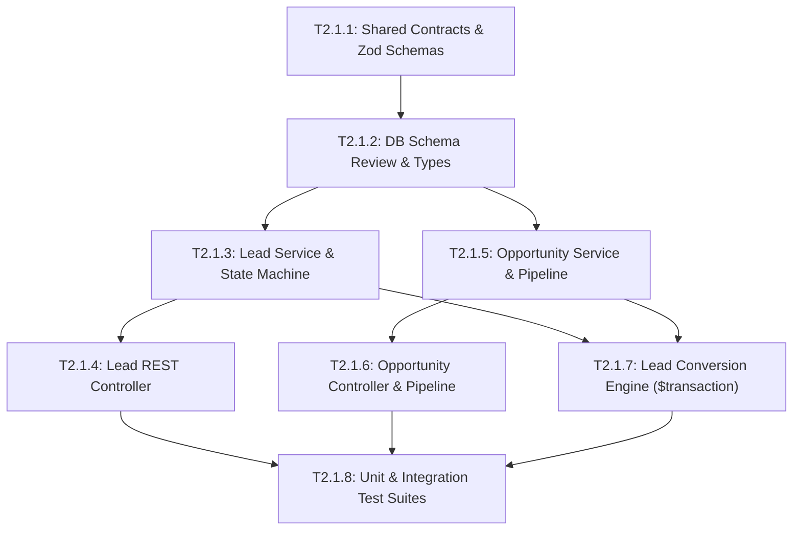

# Epic 2.1: Lead & Opportunity Management Core

## 1. Epic Overview

Epic 2.1 thiết lập tầng dữ liệu nghiệp vụ và máy trạng thái (State Machine) cốt lõi của Sales Intelligence, chịu trách nhiệm quản lý vòng đời từ Khách hàng tiềm năng (`Lead`) đến Cơ hội kinh doanh (`Opportunity`). Epic này kết nối chặt chẽ danh tính khách hàng đa kênh (`Contact`) của Phase 1 với các quy trình kinh doanh có cấu trúc, cho phép chuyển đổi một phiên hội thoại thông thường thành một thương vụ bán hàng có giá trị định lượng.

- **Epic ID**: `EPIC-2.1`
- **Title**: Lead & Opportunity Management Core
- **Technical Owner**: Backend Lead / Senior NestJS Engineer
- **Dependencies**: `EPIC-1.1` (Identity & Tenancy), `EPIC-1.2` (Contact Management), `EPIC-1.5` (Conversation & Messaging Core)
- **Target Milestone**: **Milestone 2A** (Foundation Layer)
- **Status**: 📋 Backlog (Ready for Development)

---

## 2. Technical Objectives & Architectural Scope

### 2.1. Architectural Scope
- **Module Boundaries**:
  - `apps/server/src/leads/`: Quản lý danh tính Lead, phân loại trạng thái, gán tư vấn viên, liên kết với Contact và Conversation.
  - `apps/server/src/opportunities/`: Quản lý phễu cơ hội kinh doanh (Pipeline Stages), giá trị dự kiến (Amount), xác suất thành công (Probability), và dự báo ngày chốt deal.
- **Data Models (Prisma Schema RFC)**:
  - `Lead`: id, workspaceId, contactId, status (`NEW`, `CONTACTED`, `QUALIFIED`, `UNQUALIFIED`, `CONVERTED`), score (default 0), stage, assignedUserId, estimatedValue, currency (default 'VND'), metadata (JSON), timestamps.
  - `Opportunity`: id, workspaceId, leadId, contactId, stage (`PROSPECTING`, `QUALIFICATION`, `PROPOSAL`, `NEGOTIATION`, `CLOSED_WON`, `CLOSED_LOST`), amount, currency, expectedCloseDate, probability (0-100), assignedUserId, timestamps.
- **State Machine Rules & Transition Guard**:
  - `Lead.status`: `NEW` ➔ `CONTACTED` ➔ `QUALIFIED` ➔ `CONVERTED` (hoặc ➔ `UNQUALIFIED` từ bất kỳ trạng thái nào).
  - Không thể chuyển `CONVERTED` ngược lại trạng thái cũ.
  - `Opportunity.stage`: Chuyển dịch có kiểm soát qua các bước của Sales Pipeline; chuyển sang `CLOSED_WON` hoặc `CLOSED_LOST` yêu cầu ghi nhận lý do kết thúc.
- **Atomic Conversion Engine**:
  - Thực thi trong Prisma Transaction (`$transaction`): Tạo `Opportunity`, cập nhật `Lead.status = 'CONVERTED'`, cập nhật `Contact.lifecycleStage = 'OPPORTUNITY'`, phát tán Domain Events: `lead.converted` và `opportunity.created`.
- **Tenant Isolation**:
  - 100% queries bắt buộc có `workspaceId` trong mệnh đề `where`.
  - Compound indexes tối ưu hóa: `@@index([workspaceId, status])`, `@@index([workspaceId, contactId])`, `@@index([workspaceId, stage])`.

---

## 3. Detailed User Stories & Gherkin Acceptance Criteria

### 📖 Story US-2.1.1: Automatic & Manual Lead Creation from Contact
> **As a** Sales Representative or System Event Handler,  
> **I want to** create a structured Lead record from an existing Contact or incoming conversation,  
> **so that** our sales team can track commercial interest without duplicating contact profile details.

#### Acceptance Criteria (Gherkin):
```gherkin
Feature: Lead Creation & Ingestion

  Background:
    Given a workspace "WS-01" exists with an active agent "agent@sales.com"
    And a verified Contact "contact-123" belongs to workspace "WS-01"

  Scenario: Successfully create a Lead manually via REST API
    When the agent sends POST "/api/v1/workspaces/WS-01/leads" with payload:
      """
      {
        "contactId": "contact-123",
        "estimatedValue": 50000000,
        "currency": "VND",
        "assignedUserId": "user-agent-1"
      }
      """
    Then the response status code should be 201
    And the response body should contain "id" matching a UUID
    And the returned lead should have "status" equal to "NEW"
    And the returned lead should have "workspaceId" equal to "WS-01"
    And a domain event "lead.created" should be emitted with "leadId" and "workspaceId"

  Scenario: Prevent cross-tenant Lead creation attack
    Given another workspace "WS-02" exists
    And a Contact "contact-999" belongs exclusively to "WS-02"
    When the agent of "WS-01" sends POST "/api/v1/workspaces/WS-01/leads" with payload:
      """
      {
        "contactId": "contact-999",
        "estimatedValue": 10000000
      }
      """
    Then the response status code should be 404
    And the error code should be "CONTACT_NOT_FOUND"
    And no Lead record should be created in the database

  Scenario: Reject Lead creation with invalid financial value
    When the agent sends POST "/api/v1/workspaces/WS-01/leads" with payload:
      """
      {
        "contactId": "contact-123",
        "estimatedValue": -5000
      }
      """
    Then the response status code should be 400
    And the error code should be "VALIDATION_ERROR"
```

---

### 📖 Story US-2.1.2: Lead Lifecycle State Machine & Re-assignment
> **As a** Sales Manager,  
> **I want to** update the status of a Lead and reassign it to an appropriate sales rep,  
> **so that** the lead transitions smoothly through our qualification criteria.

#### Acceptance Criteria (Gherkin):
```gherkin
Feature: Lead State Machine & Assignment

  Background:
    Given an existing Lead "lead-001" in workspace "WS-01" with status "NEW"

  Scenario: Valid state transition from NEW to CONTACTED
    When the sales rep updates Lead "lead-001" status to "CONTACTED"
    Then the database record should reflect status "CONTACTED"
    And the "updatedAt" timestamp should be refreshed
    And a domain event "lead.updated" should be published

  Scenario: Reject illegal state transition from CONVERTED to any prior state
    Given the Lead "lead-001" has been marked as "CONVERTED"
    When the sales rep attempts to update status to "QUALIFIED"
    Then the response status code should be 400
    And the error code should be "INVALID_STATUS_TRANSITION"
    And the message should state "Converted leads cannot be reverted to active qualification stages"

  Scenario: Reassign Lead to a user who is not a member of the workspace
    Given an external user "user-stranger" who does not belong to "WS-01"
    When the sales manager attempts to assign Lead "lead-001" to "user-stranger"
    Then the response status code should be 400
    And the error code should be "ASSIGNEE_NOT_IN_WORKSPACE"
```

---

### 📖 Story US-2.1.3: Atomic Lead Conversion to Opportunity
> **As a** Sales Representative,  
> **I want to** convert a qualified Lead into a commercial Opportunity in a single atomic action,  
> **so that** the sales deal moves into our active sales pipeline without data loss or inconsistent state.

#### Acceptance Criteria (Gherkin):
```gherkin
Feature: Atomic Lead Conversion

  Background:
    Given a qualified Lead "lead-100" in workspace "WS-01" with contact "contact-100"

  Scenario: Successfully convert Lead to Opportunity
    When the sales rep sends POST "/api/v1/workspaces/WS-01/leads/lead-100/convert" with payload:
      """
      {
        "dealName": "Enterprise Cloud Migration Deal",
        "amount": 120000000,
        "currency": "VND",
        "expectedCloseDate": "2026-12-31T00:00:00Z",
        "initialStage": "DISCOVERY"
      }
      """
    Then the response status code should be 200
    And the Lead "lead-100" status should be updated to "CONVERTED"
    And a new Opportunity record should be created with:
      | field        | value                             |
      | leadId       | lead-100                          |
      | contactId    | contact-100                       |
      | workspaceId  | WS-01                             |
      | stage        | DISCOVERY                         |
      | amount       | 120000000                         |
      | probability  | 25                                |
    And domain events "lead.converted" and "opportunity.created" should be emitted

  Scenario: Fail conversion atomically if deal amount is invalid
    When the sales rep sends POST "/api/v1/workspaces/WS-01/leads/lead-100/convert" with amount -1
    Then the response status code should be 400
    And the transaction should roll back completely
    And the Lead "lead-100" status should remain "QUALIFIED"
```

---

### 📖 Story US-2.1.4: Opportunity Pipeline Stage Tracking & Probability Management
> **As a** Account Executive,  
> **I want to** progress an Opportunity across pipeline stages with automatically mapped probabilities,  
> **so that** sales forecasts reflect realistic win ratios based on deal progress.

#### Acceptance Criteria (Gherkin):
```gherkin
Feature: Opportunity Stage Progression

  Background:
    Given an active Opportunity "opp-500" in workspace "WS-01" at stage "DISCOVERY"

  Scenario: Progress Opportunity to Proposal stage with default probability adjustment
    When the agent updates stage to "PROPOSAL" without explicit probability
    Then the Opportunity stage should become "PROPOSAL"
    And the probability should automatically default to 50
    And a domain event "opportunity.stage_updated" should be emitted

  Scenario: Close Opportunity as CLOSED_LOST requiring lost reason
    When the agent sends PATCH "/api/v1/workspaces/WS-01/opportunities/opp-500/stage" with:
      """
      {
        "stage": "CLOSED_LOST",
        "lostReason": "Competitor offered 30% lower license fee"
      }
      """
    Then the Opportunity stage should become "CLOSED_LOST"
    And the probability should drop to 0
    And the metadata should preserve the "lostReason"

  Scenario: Reject closing an Opportunity as CLOSED_LOST without a reason
    When the agent sends PATCH "/api/v1/workspaces/WS-01/opportunities/opp-500/stage" with:
      """
      {
        "stage": "CLOSED_LOST"
      }
      """
    Then the response status code should be 400
    And the error code should be "LOST_REASON_REQUIRED"
```

---

### 📖 Story US-2.1.5: Multi-Tenant Opportunity Pipeline Summary & Kanban View
> **As a** Sales Director,  
> **I want to** retrieve an aggregated pipeline summary grouped by stage with deal count and total deal volume,  
> **so that** I can review sales pipeline health without leaking data across workspace boundaries.

#### Acceptance Criteria (Gherkin):
```gherkin
Feature: Opportunity Pipeline Summary & Isolation

  Scenario: Retrieve pipeline summary for workspace
    Given workspace "WS-01" has:
      | Stage        | Deal Count | Total Amount |
      | DISCOVERY    | 3          | 150000000    |
      | PROPOSAL     | 2          | 200000000    |
      | CLOSED_WON   | 1          | 80000000     |
    When the director sends GET "/api/v1/workspaces/WS-01/pipeline"
    Then the response status code should be 200
    And the response data should contain array of stages with corresponding counts and total amounts
    And the sum of all stages should equal 430000000

  Scenario: Strict tenant isolation in pipeline aggregation
    Given workspace "WS-02" has 10 Opportunities totaling 1000000000
    When the director of "WS-01" sends GET "/api/v1/workspaces/WS-01/pipeline"
    Then the response should strictly exclude all data from workspace "WS-02"
```

---

## 4. Comprehensive Task Breakdown

| Task ID | Task Title & Component | Type | Description | Est. Points | Prerequisites |
| :--- | :--- | :---: | :--- | :---: | :--- |
| **T2.1.1** | Shared Contracts & DTOs for Leads & Opportunities<br/>`packages/shared-contracts/src/sales/` | `CONTRACT` | Tạo Zod schemas, TypeScript types cho `LeadCreateDto`, `LeadUpdateDto`, `LeadConvertDto`, `OpportunityStageUpdateDto`, `PipelineSummaryResponse`. | 2 SP | None |
| **T2.1.2** | Prisma Schema Integration Review & Database Migration Preparation<br/>`apps/server/prisma/` | `DATABASE` | Kiểm tra tính tương thích của Schema RFC với schema Phase 1; chuẩn bị migration script và seed scripts cho môi trường test độc lập. | 3 SP | T2.1.1 |
| **T2.1.3** | Lead Lifecycle Service & State Machine Guards<br/>`apps/server/src/leads/leads.service.ts` | `SERVICE` | Hiện thực CRUD cho Lead, logic kiểm tra chuyển trạng thái hợp lệ, tính điểm ban đầu, gán tư vấn viên với kiểm tra thành viên Workspace. | 5 SP | T2.1.1, T2.1.2 |
| **T2.1.4** | Lead REST Controller & Workspace Protection<br/>`apps/server/src/leads/leads.controller.ts` | `CONTROLLER` | Xây dựng REST endpoints cho Lead (`POST`, `GET`, `PATCH`), tích hợp `WorkspaceGuard`, `RolesGuard` và validation pipes. | 3 SP | T2.1.3 |
| **T2.1.5** | Opportunity Pipeline Service & Probability Logic<br/>`apps/server/src/opportunities/opportunities.service.ts` | `SERVICE` | Hiện thực logic quản lý Opportunity, tự động ánh xạ xác suất theo giai đoạn, bắt buộc lý do khi Closed Lost, emit domain events. | 5 SP | T2.1.1, T2.1.2 |
| **T2.1.6** | Opportunity REST Controller & Pipeline Aggregator<br/>`apps/server/src/opportunities/opportunities.controller.ts` | `CONTROLLER` | Xây dựng REST endpoints cho Opportunity và endpoint `GET .../pipeline` gom nhóm theo giai đoạn bán hàng (GROUP BY stage). | 3 SP | T2.1.5 |
| **T2.1.7** | Atomic Lead-to-Opportunity Conversion Engine<br/>`apps/server/src/leads/lead-conversion.service.ts` | `SERVICE` | Hiện thực giao dịch nguyên tử `$transaction` thực hiện chuyển đổi Lead sang Opportunity, cập nhật Contact lifecycleStage, phát sự kiện. | 5 SP | T2.1.3, T2.1.5 |
| **T2.1.8** | Lead & Opportunity Test Suites (Unit & E2E Slice)<br/>`apps/server/test/leads/` & `test/opportunities/` | `TEST` | Viết unit tests cho State Machine, conversion rollback khi có lỗi, và integration test kiểm tra cô lập đa người thuê. | 4 SP | T2.1.4, T2.1.6, T2.1.7 |

---

## 5. Intra-Epic Execution Dependency Graph (DAG)



---

## 6. Definition of Done & Verification Commands

### Verification Checklist:
- [ ] 100% Zod validation schemas được đóng gói trong `@sales-copilot/shared-contracts`.
- [ ] Tất cả các truy vấn Prisma đều có bộ lọc `workspaceId`.
- [ ] Giao dịch Lead Conversion rollback hoàn toàn nếu bất kỳ thao tác nào thất bại.
- [ ] State Machine ngăn chặn thành công các bước chuyển trạng thái trái phép (`400 Bad Request`).
- [ ] Test coverage tối thiểu 85% cho các Service nghiệp vụ.

### Command Execution:
```bash
# Run unit & service tests
pnpm nx test server --testFile="src/leads|src/opportunities"

# Run linter
pnpm nx lint server

# Verify TypeScript compilation
pnpm nx build server
```
