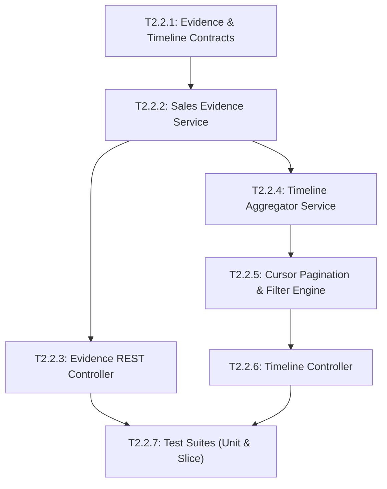

# Epic 2.2: Sales Evidence & Activity Timeline

## 1. Epic Overview

Epic 2.2 hiện thực hóa cơ chế lưu vết bằng chứng bán hàng (`SalesEvidence`) và dòng thời gian hoạt động bán hàng hợp nhất (`Sales Activity Timeline`). Thay vì lưu trữ những đánh giá cảm tính, hệ thống trích xuất các bằng chứng thương mại cụ thể (Budget, Authority, Need, Timeline, Pain Points, Objections) gắn liền với từng trích đoạn tin nhắn thực tế (`snippet`), cho phép kiểm toán và giải trình minh bạch. Đồng thời, Epic này tổng hợp đa luồng dữ liệu (tin nhắn, đổi trạng thái, phân công, ghi chú nội bộ và bằng chứng bán hàng) thành một dòng thời gian trực quan cho nhân viên kinh doanh.

- **Epic ID**: `EPIC-2.2`
- **Title**: Sales Evidence & Activity Timeline
- **Technical Owner**: Senior Backend Engineer
- **Dependencies**: `EPIC-2.1` (Lead & Opportunity Core), `EPIC-1.5` (Conversation & Messaging Core)
- **Target Milestone**: **Milestone 2B** (Intelligence & Scoring Layer)
- **Status**: 📋 Backlog (Ready for Development)

---

## 2. Technical Objectives & Architectural Scope

### 2.1. Architectural Scope
- **Module Boundaries**:
  - `apps/server/src/sales-evidence/`: Lưu trữ, xác thực và quản lý bằng chứng bán hàng gắn liền với Lead, Conversation, và Message.
  - `apps/server/src/activity-timeline/`: Dịch vụ tổng hợp phi tập trung (Aggregator Service), truy vấn dữ liệu từ nhiều bảng nguồn và trả về dòng thời gian hợp nhất có phân trang theo con trỏ (Cursor-based pagination).
- **Data Models (Prisma Schema RFC)**:
  - `SalesEvidence`: id, workspaceId, leadId (optional), conversationId, messageId, signalType (`BUDGET_CONFIRMED`, `AUTHORITY_IDENTIFIED`, `NEED_EXPRESSED`, `TIMELINE_STATED`, `PAIN_POINT`, `COMPETITOR_MENTION`, `OBJECTION_RAISED`, `POSITIVE_SENTIMENT`), confidence (float 0.00 - 1.00), snippet (string trích dẫn), reason (lý do suy luận), metadata (JSON), createdAt, updatedAt.
  - Indexes: `@@index([workspaceId, leadId])`, `@@index([workspaceId, conversationId])`, `@@index([workspaceId, signalType])`.
- **Unified Timeline Event Schema**:
  - Mỗi sự kiện trong Timeline là một polymorphic payload:
    ```typescript
    interface TimelineEvent {
      id: string;
      type: 'MESSAGE' | 'SALES_EVIDENCE' | 'STATUS_CHANGE' | 'ASSIGNMENT' | 'NOTE';
      timestamp: string; // ISO 8601
      actor: { id: string; name: string; type: 'CONTACT' | 'USER' | 'SYSTEM' };
      summary: string;
      payload: Record<string, any>;
    }
    ```
- **Auditing & False Positive Invalidation**:
  - Cho phép Sales Rep đánh dấu "False Positive" (bằng chứng sai) đối với một `SalesEvidence` do AI trích xuất; phát sự kiện `sales_evidence.invalidated` để kích hoạt chấm điểm lại.

---

## 3. Detailed User Stories & Gherkin Acceptance Criteria

### 📖 Story US-2.2.1: Structured Sales Evidence Ingestion with Verbatim Snippet & Confidence
> **As a** Conversation Intelligence Worker or Sales Agent,  
> **I want to** persist a structured Sales Evidence record linked to a specific message with verbatim text quotes and confidence score,  
> **so that** sales reps can verify why the AI identified a commercial signal without guessing.

#### Acceptance Criteria (Gherkin):
```gherkin
Feature: Sales Evidence Ingestion

  Background:
    Given an active workspace "WS-01"
    And a Lead "lead-01" exists associated with Conversation "conv-01"
    And Message "msg-01" in "conv-01" contains text "Ngân sách tối đa của bên mình cho dự án này là 200 triệu"

  Scenario: Successfully ingest a high-confidence budget signal
    When the system records Sales Evidence with payload:
      """
      {
        "leadId": "lead-01",
        "conversationId": "conv-01",
        "messageId": "msg-01",
        "signalType": "BUDGET_CONFIRMED",
        "confidence": 0.95,
        "snippet": "Ngân sách tối đa của bên mình cho dự án này là 200 triệu",
        "reason": "Khách hàng nêu rõ trần ngân sách dự toán là 200 triệu VND"
      }
      """
    Then the record should be saved with "workspaceId" equal to "WS-01"
    And the confidence should be stored as 0.95
    And a domain event "sales_evidence.detected" should be published to EventEmitter2

  Scenario: Reject Sales Evidence with confidence out of bounds
    When the system attempts to record Sales Evidence with confidence 1.25
    Then the validation should fail with error "Confidence must be between 0.0 and 1.0"
    And no record should be inserted

  Scenario: Prevent associating evidence with a message from another workspace
    Given workspace "WS-02" has Message "msg-99"
    When the ingestion attempts to link "msg-99" to workspace "WS-01"
    Then the response status code should be 404
    And the error code should be "MESSAGE_NOT_FOUND"
```

---

### 📖 Story US-2.2.2: Lead & Conversation Evidence Retrieval with Signal Filtering
> **As a** Sales Representative reviewing a deal,  
> **I want to** retrieve all detected Sales Evidence for a Lead or Conversation, filtered by signal type,  
> **so that** I can quickly inspect customer pain points and budget constraints before a sales call.

#### Acceptance Criteria (Gherkin):
```gherkin
Feature: Sales Evidence Retrieval & Filtering

  Background:
    Given Lead "lead-01" in "WS-01" has:
      | Signal Type          | Snippet                           | Confidence |
      | BUDGET_CONFIRMED     | Ngân sách 200 triệu               | 0.95       |
      | TIMELINE_STATED      | Cần triển khai xong trong tháng 10| 0.88       |
      | COMPETITOR_MENTION   | Đang cân nhắc giải pháp của bên B | 0.80       |

  Scenario: Retrieve all evidence for a Lead
    When the agent sends GET "/api/v1/workspaces/WS-01/leads/lead-01/evidence"
    Then the response status code should be 200
    And the response body should contain 3 evidence items
    And each item should include messageId, snippet, and confidence

  Scenario: Filter evidence by specific signal type
    When the agent sends GET "/api/v1/workspaces/WS-01/leads/lead-01/evidence?signalType=BUDGET_CONFIRMED"
    Then the response body should contain exactly 1 item with signalType "BUDGET_CONFIRMED"
```

---

### 📖 Story US-2.2.3: Chronological Unified Activity Timeline Aggregation
> **As a** Sales Account Executive,  
> **I want to** view a chronological stream combining chat messages, status changes, notes, and AI signals,  
> **so that** I get a complete 360-degree context of all customer interactions without jumping between tabs.

#### Acceptance Criteria (Gherkin):
```gherkin
Feature: Unified Activity Timeline

  Background:
    Given Lead "lead-01" in workspace "WS-01" has the following chronological events:
      | Timestamp            | Type           | Content Summary                |
      | 2026-09-01T10:00:00Z | MESSAGE        | Khách gửi tin nhắn mở đầu      |
      | 2026-09-01T10:05:00Z | SALES_EVIDENCE | AI phát hiện tín hiệu NEED     |
      | 2026-09-01T10:15:00Z | STATUS_CHANGE  | Chuyển trạng thái sang CONTACTED|
      | 2026-09-01T10:20:00Z | NOTE           | Ghi chú nội bộ của Agent       |

  Scenario: Fetch activity timeline sorted in reverse chronological order
    When the agent sends GET "/api/v1/workspaces/WS-01/leads/lead-01/timeline?limit=10"
    Then the response status code should be 200
    And the returned events array should have length 4
    And the first item should be the NOTE at "2026-09-01T10:20:00Z"
    And the last item should be the MESSAGE at "2026-09-01T10:00:00Z"

  Scenario: Cursor-based pagination on timeline
    When the agent sends GET "/api/v1/workspaces/WS-01/leads/lead-01/timeline?limit=2"
    Then the response should contain 2 items and a "nextCursor" token
    When the agent sends GET with cursor matching "nextCursor"
    Then the next 2 older items should be returned seamlessly
```

---

### 📖 Story US-2.2.4: Manual Evidence Annotation & False Positive Invalidation
> **As a** Sales Representative,  
> **I want to** invalidate an incorrect AI-detected signal or manually highlight a text snippet as evidence,  
> **so that** human judgment trains and corrects the intelligence data pipeline.

#### Acceptance Criteria (Gherkin):
```gherkin
Feature: Evidence Invalidation & Annotation

  Background:
    Given an AI-detected Sales Evidence "evi-99" in workspace "WS-01" with signal "BUDGET_CONFIRMED"

  Scenario: Sales rep invalidates a false positive evidence
    When the agent sends DELETE "/api/v1/workspaces/WS-01/sales-evidence/evi-99" with reason:
      """
      {
        "invalidationReason": "Khách hàng nói đùa, không phải ngân sách thật"
      }
      """
    Then the response status code should be 200
    And the evidence record should be flagged as invalidated or removed
    And a domain event "sales_evidence.invalidated" should be emitted with "leadId"
    And downstream lead scoring should receive the invalidation event

  Scenario: Reject invalidation from a non-member of the workspace
    Given a user "intruder" not part of "WS-01"
    When "intruder" sends DELETE "/api/v1/workspaces/WS-01/sales-evidence/evi-99"
    Then the response status code should be 403
    And the error code should be "FORBIDDEN"
```

---

## 4. Comprehensive Task Breakdown

| Task ID | Task Title & Component | Type | Description | Est. Points | Prerequisites |
| :--- | :--- | :---: | :--- | :---: | :--- |
| **T2.2.1** | Shared Contracts & DTOs for Evidence & Timeline<br/>`packages/shared-contracts/src/sales-evidence/` | `CONTRACT` | Định nghĩa Zod schemas cho `SalesEvidenceCreateDto`, `SalesEvidenceFilterDto`, `TimelineQueryDto`, `TimelineEventDto`. | 2 SP | None |
| **T2.2.2** | Sales Evidence Repository & Validation Service<br/>`apps/server/src/sales-evidence/sales-evidence.service.ts` | `SERVICE` | Hiện thực CRUD cho `SalesEvidence`, ràng buộc confidence 0.0-1.0, kiểm tra message và lead cùng workspace, emit domain events. | 4 SP | T2.2.1 |
| **T2.2.3** | Sales Evidence REST Controller & Workspace Scoping<br/>`apps/server/src/sales-evidence/sales-evidence.controller.ts` | `CONTROLLER` | Endpoints truy vấn evidence theo lead/conversation, tạo mới manual evidence và invalidate false positive. | 3 SP | T2.2.2 |
| **T2.2.4** | Unified Activity Timeline Aggregator Service<br/>`apps/server/src/activity-timeline/activity-timeline.service.ts` | `SERVICE` | Service truy vấn song song (`Promise.all`) Messages, Status Changes, Notes, Evidence; chuẩn hóa sang `TimelineEvent` và sắp xếp thời gian. | 5 SP | T2.2.2 |
| **T2.2.5** | Cursor-based Pagination & Event Filtering Engine<br/>`apps/server/src/activity-timeline/timeline-cursor.helper.ts` | `SERVICE` | Giải thuật con trỏ thời gian (ISO timestamp + ID composite cursor), hỗ trợ filter theo mảng loại sự kiện (`types=MESSAGE,NOTE`). | 3 SP | T2.2.4 |
| **T2.2.6** | Activity Timeline REST Controller<br/>`apps/server/src/activity-timeline/activity-timeline.controller.ts` | `CONTROLLER` | Endpoint `GET /api/v1/workspaces/:workspaceId/leads/:leadId/timeline` với query pipes và workspace security guard. | 3 SP | T2.2.5 |
| **T2.2.7** | Evidence & Timeline Aggregation Test Suites<br/>`apps/server/test/sales-evidence/` | `TEST` | Unit tests cho logic gom nhóm timeline, kiểm tra cursor pagination và test cô lập dữ liệu đa người thuê. | 4 SP | T2.2.3, T2.2.6 |

---

## 5. Intra-Epic Execution Dependency Graph (DAG)



---

## 6. Definition of Done & Verification Commands

### Verification Checklist:
- [ ] Mọi bản ghi `SalesEvidence` đều có đầy đủ trích đoạn (`snippet`), độ tin cậy (`confidence` từ 0.0 đến 1.0) và liên kết hợp lệ đến Message & Conversation.
- [ ] Timeline Aggregator truy vấn an toàn và không gây N+1 database queries.
- [ ] Phân trang con trỏ (Cursor pagination) hoạt động trơn tru cả khi có sự kiện cùng timestamp.
- [ ] Khi một Sales Evidence bị xóa/invalidate, phát tán `sales_evidence.invalidated` cho module Lead Scoring.

### Command Execution:
```bash
# Run sales evidence & timeline tests
pnpm nx test server --testFile="src/sales-evidence|src/activity-timeline"

# Run linter
pnpm nx lint server

# Verify TypeScript compilation
pnpm nx build server
```
