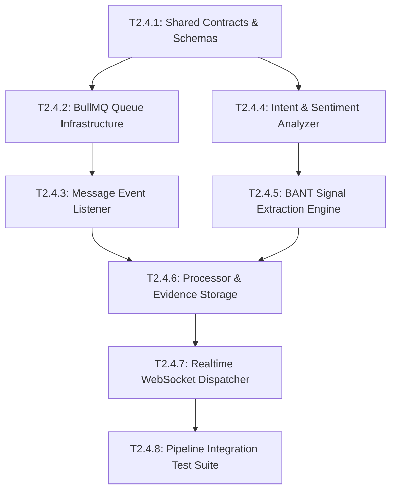

# Epic 2.4: Conversation Intelligence - Intent, Sentiment & Buying Signals

## 1. Epic Overview

Epic 2.4 hiện thực hóa cỗ máy phân tích hội thoại thông minh theo thời gian thực (Conversation Intelligence Engine). Hệ thống lắng nghe các luồng tin nhắn mới từ khách hàng (`CONTACT`), xử lý bất đồng bộ thông qua hàng đợi BullMQ (đảm bảo không ảnh hưởng đến tốc độ chuyển phát tin nhắn của Phase 1), sau đó gọi Cổng LLM Gateway (Epic 2.3) để phân tích Ý định (`Intent`), Sắc thái & Độ khẩn cấp (`Sentiment & Urgency`), và trích xuất các Tín hiệu mua hàng BANT (Budget, Authority, Need, Timeline). Các tín hiệu phát hiện có độ tin cậy cao được tự động lưu thành `SalesEvidence` (Epic 2.2) và bắn thông báo thời gian thực qua WebSocket đến màn hình tư vấn viên.

- **Epic ID**: `EPIC-2.4`
- **Title**: Conversation Intelligence - Intent, Sentiment & Buying Signals
- **Technical Owner**: AI Applied Engineer / Senior Backend Engineer
- **Dependencies**: `EPIC-2.2` (Sales Evidence), `EPIC-2.3` (Multi-Provider LLM Gateway), Phase 1 Core (`EventEmitter2`, BullMQ, WebSocket)
- **Target Milestone**: **Milestone 2B** (Intelligence & Scoring Layer)
- **Status**: 📋 Backlog (Ready for Development)

---

## 2. Technical Objectives & Architectural Scope

### 2.1. Architectural Scope
- **Module Boundaries**:
  - `apps/server/src/conversation-intelligence/`: Chứa event listener, BullMQ processor, pipeline phân tích tín hiệu, và bộ điều phối lưu bằng chứng.
- **Asynchronous Processing Pipeline**:
  - Lắng nghe domain event `message.created` phát ra từ `MessagesService` (Phase 1).
  - Chỉ xử lý tin nhắn của khách hàng (`senderType === 'CONTACT'`) và không phải là ghi chú nội bộ (`isPrivate === false`).
  - Đẩy công việc vào hàng đợi BullMQ `conversation-intelligence` với độ ưu tiên cao, kiểm soát concurrency và tự động retry (tối đa 3 lần với exponential backoff).
- **Classification & Extraction Taxonomy**:
  - **Intent**: `PRICING_INQUIRY`, `PRODUCT_DEMO`, `FEATURE_COMPARISON`, `TECHNICAL_SUPPORT`, `PURCHASE_INTENT`, `CHURN_RISK`, `GENERAL_INQUIRY`.
  - **Sentiment**: Điểm số từ `-1.0` (Rất tiêu cực) đến `+1.0` (Rất tích cực); phân nhóm `POSITIVE`, `NEUTRAL`, `NEGATIVE`.
  - **Urgency**: `LOW`, `MEDIUM`, `HIGH`, `CRITICAL`.
  - **BANT Signals**:
    * `BUDGET_CONFIRMED`: Số tiền cụ thể, khung ngân sách, khả năng chi trả.
    * `AUTHORITY_IDENTIFIED`: Vai trò người ra quyết định (Giám đốc, Trưởng phòng, Người đánh giá kỹ thuật).
    * `NEED_EXPRESSED`: Nỗi đau kinh doanh (Pain points), nhu cầu tính năng bắt buộc.
    * `TIMELINE_STATED`: Mốc thời gian chốt hợp đồng, hạn chót ra mắt.
  - **Signals bổ sung**: `COMPETITOR_MENTION` (đối thủ cạnh tranh đang được cân nhắc), `OBJECTION_RAISED` (rào cản về giá/tính năng).
- **Confidence Threshold & Deduplication**:
  - Ngưỡng tin cậy tối thiểu: `confidence >= 0.70` mới được lưu vào `SalesEvidence`.
  - Tránh trùng lặp: Nếu trong cùng một phiên chat đã phát hiện tín hiệu tương đương từ cùng một tin nhắn, bỏ qua không tạo bản ghi trùng lặp.
- **Realtime WebSocket Notification**:
  - Phát sự kiện WebSocket `sales_evidence.detected` tới room `workspace_${workspaceId}` và `conversation_${conversationId}` để cập nhật trực tiếp trên giao diện Agent.

---

## 3. Detailed User Stories & Gherkin Acceptance Criteria

### 📖 Story US-2.4.1: Asynchronous Message Ingestion via BullMQ Queue
> **As a** Platform Reliability Engineer,  
> **I want** customer messages to be queued into BullMQ asynchronously without blocking the message delivery pipeline,  
> **so that** LLM analysis latency (1-3s) never slows down the sub-50ms chat messaging experience for end users.

#### Acceptance Criteria (Gherkin):
```gherkin
Feature: Asynchronous Message Queueing

  Background:
    Given a customer sends a new message "Bên bạn có gói doanh nghiệp cho 50 user không?" in workspace "WS-01"

  Scenario: Inbound contact message is queued for intelligence processing
    When the message is saved in Phase 1 MessagesService
    And the domain event "message.created" is published
    Then the ConversationIntelligenceListener should intercept the event
    And a job should be enqueued into BullMQ queue "conversation-intelligence"
    And the HTTP response for message sending should return immediately without waiting for LLM analysis

  Scenario: Internal agent messages and private notes are ignored
    Given an agent writes a private note "Khách này hỏi nhiều nhưng chưa chắc mua"
    When the private note is created
    Then the listener should ignore the event
    And no job should be added to the queue
```

---

### 📖 Story US-2.4.2: Realtime Intent & Sentiment Classification
> **As a** Sales Agent,  
> **I want the** system to automatically classify customer intent and detect sentiment urgency,  
> **so that** I can prioritize frustrated leads and respond appropriately to commercial inquiries.

#### Acceptance Criteria (Gherkin):
```gherkin
Feature: Intent & Sentiment Classification

  Scenario: Detect high-urgency churn risk sentiment
    Given a queued message containing "Hệ thống lỗi cả buổi sáng, bên tôi đang cân nhắc hủy hợp đồng!"
    When the BullMQ worker processes the job
    Then the classified intent should be "CHURN_RISK"
    And the sentiment should be "NEGATIVE" (score <= -0.70)
    And the urgency level should be "CRITICAL"
    And a high-priority alert event should be broadcasted to workspace agents

  Scenario: Detect purchase intent with positive sentiment
    Given a queued message containing "Sản phẩm dùng rất mượt, mình muốn ký hợp đồng năm ngay tuần này"
    When the worker processes the job
    Then the intent should be "PURCHASE_INTENT"
    And the sentiment should be "POSITIVE" (score >= 0.80)
    And the urgency level should be "HIGH"
```

---

### 📖 Story US-2.4.3: BANT Buying Signal Extraction with Verbatim Snippet Matching
> **As a** Sales Representative,  
> **I want the** intelligence engine to extract concrete BANT buying signals with exact quoted sentences,  
> **so that** I can review verified deal qualification criteria directly in the CRM pipeline.

#### Acceptance Criteria (Gherkin):
```gherkin
Feature: BANT Buying Signal Extraction

  Scenario: Successfully extract Budget and Timeline signals
    Given a customer message "Bên anh đã duyệt ngân sách 150 triệu, dự kiến triển khai trước ngày 30/11"
    When the worker executes BANT extraction via LLM Gateway
    Then two distinct signals should be identified:
      | Signal Type      | Confidence | Quoted Snippet                                           |
      | BUDGET_CONFIRMED | >= 0.90    | Bên anh đã duyệt ngân sách 150 triệu                     |
      | TIMELINE_STATED  | >= 0.90    | dự kiến triển khai trước ngày 30/11                      |
    And two corresponding SalesEvidence records should be persisted
    And each evidence record should reference the exact messageId

  Scenario: Low-confidence signals below threshold are filtered out
    Given a vague customer message "Để anh xem lại sau nhé"
    When the worker processes the message
    And the model returns a signal with confidence 0.45
    Then no SalesEvidence record should be created
    And the low-confidence inference should be logged for model calibration
```

---

### 📖 Story US-2.4.4: Competitor & Objection Signal Detection
> **As a** Sales Strategy Manager,  
> **I want to** automatically flag mentions of competing solutions and price/feature objections,  
> **so that** we can equip sales reps with competitive battlecards and overcome objections.

#### Acceptance Criteria (Gherkin):
```gherkin
Feature: Competitor & Objection Detection

  Scenario: Flag competitor mention and price objection
    Given a customer message "Bên Chatwoot và Zendesk đang báo giá rẻ hơn 20%, tính năng cũng tương tự"
    When the intelligence pipeline runs
    Then the engine should extract:
      | Signal Type        | Snippet                               | Metadata Competitor |
      | COMPETITOR_MENTION | Bên Chatwoot và Zendesk đang báo giá  | Chatwoot, Zendesk   |
      | OBJECTION_RAISED   | rẻ hơn 20%, tính năng cũng tương tự   | Price Objection     |
    And the SalesEvidence records should be tagged with competitor metadata
```

---

### 📖 Story US-2.4.5: Realtime WebSocket Notification of High-Value Signals
> **As an** Active Sales Rep in a live conversation,  
> **I want to** receive an immediate visual badge when a customer reveals a crucial buying signal,  
> **so that** I can immediately steer the conversation toward closing the deal.

#### Acceptance Criteria (Gherkin):
```gherkin
Feature: Realtime Signal Notification

  Scenario: Push WebSocket notification upon evidence detection
    Given an agent is viewing conversation "conv-101" on Next.js Dashboard
    When a SalesEvidence "BUDGET_CONFIRMED" is saved for "conv-101"
    Then a WebSocket event "sales_evidence.detected" should be pushed to room "conversation_conv-101"
    And the payload should contain:
      """
      {
        "signalType": "BUDGET_CONFIRMED",
        "confidence": 0.95,
        "snippet": "Bên anh đã duyệt ngân sách 150 triệu",
        "messageId": "msg-555"
      }
      """
    And the frontend should display an animated signal pill next to the message
```

---

## 4. Comprehensive Task Breakdown

| Task ID | Task Title & Component | Type | Description | Est. Points | Prerequisites |
| :--- | :--- | :---: | :--- | :---: | :--- |
| **T2.4.1** | Shared Contracts & DTOs for Conversation Intelligence<br/>`packages/shared-contracts/src/conversation-intelligence/` | `CONTRACT` | Định nghĩa Zod schemas cho `IntentAnalysisResult`, `BantSignalResult`, `SentimentResult`, và WebSocket event payload. | 2 SP | None |
| **T2.4.2** | BullMQ Queue & Worker Infrastructure Setup<br/>`apps/server/src/conversation-intelligence/queues/` | `INFRA` | Cấu hình queue `conversation-intelligence`, định nghĩa job options (concurrency 5, backoff 2s, max attempts 3). | 3 SP | T2.4.1 |
| **T2.4.3** | Event Listener Wiring (`conversation-intelligence.listener.ts`)<br/>`apps/server/src/conversation-intelligence/` | `SERVICE` | Lắng nghe `message.created`, lọc bỏ private notes và tin nhắn từ agent, đẩy payload message vào queue. | 3 SP | T2.4.2 |
| **T2.4.4** | Intent & Sentiment Classification Pipeline<br/>`apps/server/src/conversation-intelligence/analyzers/intent.analyzer.ts` | `SERVICE` | Xây dựng prompt chuẩn và logic phân tích Intent/Sentiment, gọi LLM Gateway với Structured Output Zod schema. | 5 SP | T2.4.1, T2.3.2 |
| **T2.4.5** | BANT Buying Signal Extraction Engine<br/>`apps/server/src/conversation-intelligence/analyzers/bant.analyzer.ts` | `SERVICE` | Hiện thực logic trích xuất BANT signals, đối chiếu exact verbatim substring trong message body, lọc confidence >= 0.70. | 5 SP | T2.4.4 |
| **T2.4.6** | Automated Sales Evidence Storage & Linkage<br/>`apps/server/src/conversation-intelligence/conversation-intelligence.processor.ts` | `SERVICE` | Xử lý kết quả từ analyzers, tìm kiếm Lead liên kết với Conversation, lưu `SalesEvidence` (Epic 2.2), phát event `sales_evidence.detected`. | 4 SP | T2.4.5, T2.2.2 |
| **T2.4.7** | Realtime WebSocket Dispatcher Integration<br/>`apps/server/src/conversation-intelligence/intelligence-realtime.service.ts` | `SERVICE` | Nối với WebSocket Gateway của Phase 1, dispatch sự kiện `sales_evidence.detected` đến room của workspace và conversation. | 3 SP | T2.4.6 |
| **T2.4.8** | Async Intelligence Pipeline E2E Integration Test Suite<br/>`apps/server/test/conversation-intelligence/` | `TEST` | Test end-to-end từ lúc nhận `message.created`, worker chạy, mock LLM trả về BANT, lưu evidence và dispatch socket event. | 5 SP | T2.4.7 |

---

## 5. Intra-Epic Execution Dependency Graph (DAG)



---

## 6. Definition of Done & Verification Commands

### Verification Checklist:
- [ ] Thời gian xử lý tin nhắn bình thường của khách hàng không bị tăng thêm quá 10ms (nhờ cơ chế async BullMQ).
- [ ] Mọi trích đoạn (`snippet`) trong BANT signal bắt buộc phải là chuỗi con thực sự (exact substring) xuất hiện trong nội dung tin nhắn của khách hàng.
- [ ] Các tín hiệu có `confidence < 0.70` không được lưu vào cơ sở dữ liệu `SalesEvidence`.
- [ ] Sự kiện WebSocket `sales_evidence.detected` phát đúng room, không rò rỉ sang tenant khác.
- [ ] Worker tự động phục hồi và retry thành công nếu LLM Gateway tạm thời gặp lỗi kết nối.

### Command Execution:
```bash
# Run Conversation Intelligence tests
pnpm nx test server --testFile="src/conversation-intelligence"

# Run linter
pnpm nx lint server

# Verify TypeScript compilation
pnpm nx build server
```
