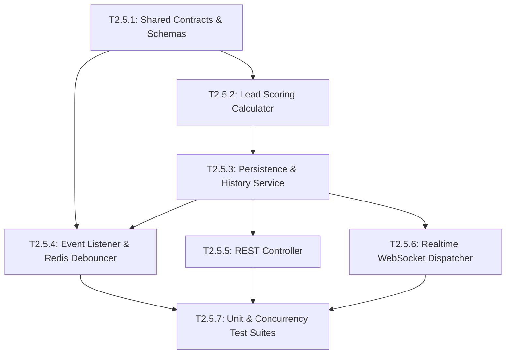

# Epic 2.5: AI-Driven Lead Scoring Engine

## 1. Epic Overview

Epic 2.5 xây dựng động cơ chấm điểm khách hàng tiềm năng đa chiều dựa trên AI và quy tắc nghiệp vụ (AI-Driven Lead Scoring Engine). Khác với các hệ thống CRM truyền thống chỉ chấm điểm dựa trên thuộc tính tĩnh (Static Demographics), Sales Copilot Platform kết hợp động học hội thoại (Engagement Velocity) và các bằng chứng bán hàng thực tế (`SalesEvidence` từ Epic 2.2 và Epic 2.4). Hệ thống tính toán điểm số tổng hợp từ 0 đến 100, phân loại thành các mức độ `HOT`, `WARM`, `COLD`, đồng thời cung cấp giải trình chi tiết từng yếu tố cấu thành (Explainable AI) và lưu giữ toàn bộ lịch sử biến động điểm số (`LeadScoreHistory`).

- **Epic ID**: `EPIC-2.5`
- **Title**: AI-Driven Lead Scoring Engine
- **Technical Owner**: Data & Algorithm Engineer / Senior Backend Engineer
- **Dependencies**: `EPIC-2.1` (Lead Core), `EPIC-2.2` (Sales Evidence), `EPIC-2.4` (Conversation Intelligence)
- **Target Milestone**: **Milestone 2B** (Intelligence & Scoring Layer)
- **Status**: 📋 Backlog (Ready for Development)

---

## 2. Technical Objectives & Architectural Scope

### 2.1. Architectural Scope
- **Module Boundaries**:
  - `apps/server/src/lead-scoring/`: Chịu trách nhiệm thực thi thuật toán tính điểm, quản lý lưu vết lịch sử, xử lý debounce sự kiện trên Redis và bắn thông báo realtime.
- **Scoring Formula & Multi-Factor Weights**:
  - Điểm tổng hợp được chuẩn hóa trong thang đo `[0, 100]`:
    $$\text{Total Score} = \min(100, \max(0, w_{\text{fit}} \cdot S_{\text{fit}} + w_{\text{vel}} \cdot S_{\text{vel}} + w_{\text{sig}} \cdot S_{\text{sig}}))$$
    * **Profile Fit ($S_{\text{fit}}$, Trọng số 25%)**: Mức độ hoàn thiện hồ sơ Contact/Lead (email doanh nghiệp, số điện thoại, tên công ty, chức vụ, kênh kết nối).
    * **Engagement Velocity ($S_{\text{vel}}$, Trọng số 25%)**: Tần suất nhắn tin, thời gian phản hồi của khách hàng (< 5 phút = điểm tối đa, > 24 giờ = giảm điểm), số lượng phiên tương tác trong 7 ngày gần nhất.
    * **Sales Signals ($S_{\text{sig}}$, Trọng số 50%)**: Tổng hòa các bằng chứng bán hàng:
      - Tín hiệu cộng: `BUDGET_CONFIRMED` (+25), `AUTHORITY_IDENTIFIED` (+20), `NEED_EXPRESSED` (+30), `TIMELINE_STATED` (+25), `POSITIVE_SENTIMENT` (+10).
      - Tín hiệu trừ: `OBJECTION_RAISED` (-15), `COMPETITOR_MENTION` (-20), `CHURN_RISK` (-40).
- **Grade Classification Matrix**:
  - `HOT`: Điểm từ 80 đến 100 (Khách hàng có nhu cầu cấp thiết, ngân sách sẵn sàng; cần tư vấn chốt ngay).
  - `WARM`: Điểm từ 50 đến 79 (Có nhu cầu tiềm năng, đang trong quá trình tìm hiểu; cần nuôi dưỡng).
  - `COLD`: Điểm từ 0 đến 49 (Mới tiếp cận hoặc chưa đủ thông tin thương mại).
- **Explainability & Factor Breakdown**:
  - Cung cấp trường JSON `scoreFactors` giải thích chi tiết:
    ```json
    {
      "fitScore": 20,
      "velocityScore": 22,
      "signalScore": 45,
      "breakdown": [
        { "factor": "BUDGET_CONFIRMED", "points": 25, "reason": "Xác nhận ngân sách 150M" },
        { "factor": "FAST_RESPONSE", "points": 10, "reason": "Khách phản hồi trong dưới 3 phút" },
        { "factor": "MISSING_PHONE", "points": -5, "reason": "Chưa có số điện thoại liên hệ" }
      ]
    }
    ```
- **Debounced Recalculation Engine (Redis)**:
  - Khi nhận các sự kiện: `sales_evidence.detected`, `sales_evidence.invalidated`, `message.created`, hệ thống áp dụng cửa sổ Debounce 30 giây trên Redis (`lead_score_debounce:${leadId}`).
  - Tránh tình trạng tính toán lại quá nhiều lần khi khách hàng gửi liên tiếp 5-10 câu chat trong một phút.
- **Data Models (Prisma Schema RFC)**:
  - `LeadScore`: id, workspaceId, leadId, score, grade (`HOT`, `WARM`, `COLD`), scoreFactors (JSON), calculatedAt, updatedAt.
  - `LeadScoreHistory`: id, workspaceId, leadId, previousScore, newScore, previousGrade, newGrade, reason, eventTrigger, createdAt.

---

## 3. Detailed User Stories & Gherkin Acceptance Criteria

### 📖 Story US-2.5.1: Multi-Factor Composite Lead Scoring Calculation
> **As a** Sales Director,  
> **I want the** system to score leads from 0 to 100 using a balanced formula of profile fit, engagement speed, and conversation signals,  
> **so that** our sales team focuses their limited time on prospects most likely to close.

#### Acceptance Criteria (Gherkin):
```gherkin
Feature: Composite Lead Scoring Calculation

  Background:
    Given a workspace "WS-01" with a Lead "lead-888"
    And the lead has corporate email "@company.com" (+15 fit) and phone number (+10 fit)
    And the lead responded within 2 minutes (+20 velocity)
    And the intelligence engine detected "BUDGET_CONFIRMED" (+25) and "NEED_EXPRESSED" (+30)

  Scenario: Calculate score and classify lead as HOT
    When the lead scoring recalculation is triggered for "lead-888"
    Then the computed score should be equal to 95
    And the grade should be assigned as "HOT"
    And the score should be clamped between 0 and 100
    And the Lead.score field in the database should be updated to 95
```

---

### 📖 Story US-2.5.2: Transparent Explainability & Factor Weight Breakdown
> **As a** Sales Representative,  
> **I want to** see a clear breakdown of why a lead received a particular score,  
> **so that** I understand the prospect's buying readiness before making contact.

#### Acceptance Criteria (Gherkin):
```gherkin
Feature: Explainable Lead Scoring

  Scenario: Retrieve explainability factors for a scored lead
    Given Lead "lead-888" has an active score of 95
    When the sales rep sends GET "/api/v1/workspaces/WS-01/leads/lead-888/score"
    Then the response status code should be 200
    And the response body should contain:
      """
      {
        "score": 95,
        "grade": "HOT",
        "scoreFactors": {
          "fitScore": 25,
          "velocityScore": 20,
          "signalScore": 50,
          "breakdown": [
            { "factor": "BUDGET_CONFIRMED", "points": 25 },
            { "factor": "NEED_EXPRESSED", "points": 30 }
          ]
        }
      }
      """
```

---

### 📖 Story US-2.5.3: Debounced Event-Driven Auto-Recalculation
> **As a** Backend Engineer,  
> **I want** lead score recalculation jobs to be debounced via Redis for 30 seconds,  
> **so that** rapid customer message bursts do not overwhelm the database and CPU resources.

#### Acceptance Criteria (Gherkin):
```gherkin
Feature: Redis Debounced Scoring Trigger

  Scenario: Multiple events within 30 seconds execute only once
    Given Lead "lead-500" receives 5 incoming messages within 15 seconds
    And 2 SalesEvidence records are detected during this burst
    When the scoring listener intercepts the events
    Then a Redis debounce timer of 30 seconds should be set for "lead-500"
    And exactly 1 scoring calculation job should be executed after the 30-second quiet period expires
    And the database should record only 1 new entry in LeadScoreHistory for the batch
```

---

### 📖 Story US-2.5.4: Historical Score Evolution & Audit Timeline
> **As a** Sales Operations Manager,  
> **I want to** review the historical score trajectory of a lead over time with associated trigger events,  
> **so that** we can identify when and why deals gained or lost momentum.

#### Acceptance Criteria (Gherkin):
```gherkin
Feature: Score History & Audit Trail

  Scenario: Query score history timeline
    Given Lead "lead-500" score changed:
      | Timestamp            | Previous | New | Trigger                 | Reason                           |
      | 2026-09-01T08:00:00Z | 0        | 30  | MESSAGE_RECEIVED        | Khởi tạo tương tác ban đầu       |
      | 2026-09-01T09:30:00Z | 30       | 75  | SALES_EVIDENCE_DETECTED | Phát hiện nhu cầu và ngân sách   |
      | 2026-09-02T14:00:00Z | 75       | 45  | SALES_EVIDENCE_DETECTED | Khách hàng nhắc tới đối thủ rẻ hơn|
    When the manager sends GET "/api/v1/workspaces/WS-01/leads/lead-500/score/history"
    Then the response should contain an array of 3 historical transitions
    And each transition should detail previousScore, newScore, and the trigger reason
```

---

## 4. Comprehensive Task Breakdown

| Task ID | Task Title & Component | Type | Description | Est. Points | Prerequisites |
| :--- | :--- | :---: | :--- | :---: | :--- |
| **T2.5.1** | Shared Contracts & DTOs for Lead Scoring<br/>`packages/shared-contracts/src/lead-scoring/` | `CONTRACT` | Định nghĩa Zod schemas cho `LeadScoreResponseDto`, `ScoreHistoryResponseDto`, `RecalculateScoreDto`, và WebSocket event payload. | 2 SP | None |
| **T2.5.2** | Lead Scoring Algorithm & Rule Matrix Engine<br/>`apps/server/src/lead-scoring/lead-scoring.calculator.ts` | `SERVICE` | Hiện thực thuật toán chấm điểm tổ hợp (Fit + Velocity + Signals), chuẩn hóa điểm 0-100, phân loại `HOT`/`WARM`/`COLD`, tạo breakdown explainability. | 4 SP | T2.5.1 |
| **T2.5.3** | LeadScore & History Persistence Service<br/>`apps/server/src/lead-scoring/lead-scoring.service.ts` | `SERVICE` | CRUD `LeadScore`, ghi log `LeadScoreHistory`, cập nhật ngược `Lead.score` trong transaction, emit domain event `lead_score.updated`. | 4 SP | T2.5.2 |
| **T2.5.4** | Event Listener & Redis Debounce Scheduler<br/>`apps/server/src/lead-scoring/lead-scoring.listener.ts` | `SERVICE` | Lắng nghe `sales_evidence.detected`, `sales_evidence.invalidated`, `message.created`; thiết lập Redis debounce key 30s trước khi trigger job. | 5 SP | T2.5.3 |
| **T2.5.5** | Lead Scoring REST Controller & Workspace Protection<br/>`apps/server/src/lead-scoring/lead-scoring.controller.ts` | `CONTROLLER` | Endpoints xem điểm chi tiết, xem lịch sử điểm, và endpoint cưỡng chế tính lại điểm thủ công (`POST .../recalculate`). | 3 SP | T2.5.3 |
| **T2.5.6** | Realtime WebSocket Dispatcher for Score Updates<br/>`apps/server/src/lead-scoring/lead-scoring-realtime.service.ts` | `SERVICE` | Bắn sự kiện `lead_score.updated` qua WebSocket Gateway tới workspace room khi điểm hoặc phân hạng thay đổi. | 3 SP | T2.5.3 |
| **T2.5.7** | Lead Scoring Algorithm & Debounce Concurrency Tests<br/>`apps/server/test/lead-scoring/` | `TEST` | Unit test công thức chấm điểm, test các trường hợp biên (điểm âm, vượt 100), và integration test cơ chế debounce trên Redis. | 4 SP | T2.5.4, T2.5.5, T2.5.6 |

---

## 5. Intra-Epic Execution Dependency Graph (DAG)



---

## 6. Definition of Done & Verification Commands

### Verification Checklist:
- [ ] Điểm số `LeadScore.score` luôn luôn nằm trong đoạn `[0, 100]`.
- [ ] Phân hạng (`HOT`, `WARM`, `COLD`) khớp 100% với ma trận điểm quy định.
- [ ] Mọi lần thay đổi điểm đều tạo một bản ghi `LeadScoreHistory` tương ứng với nguyên nhân rõ ràng.
- [ ] Cơ chế debounce trên Redis ngăn chặn hiệu quả các lượt tính toán thừa khi có message burst.
- [ ] Cập nhật điểm tự động phản ánh trên `Lead.score` và gửi thông báo WebSocket tức thì.

### Command Execution:
```bash
# Run Lead Scoring tests
pnpm nx test server --testFile="src/lead-scoring"

# Run linter
pnpm nx lint server

# Verify TypeScript compilation
pnpm nx build server
```
