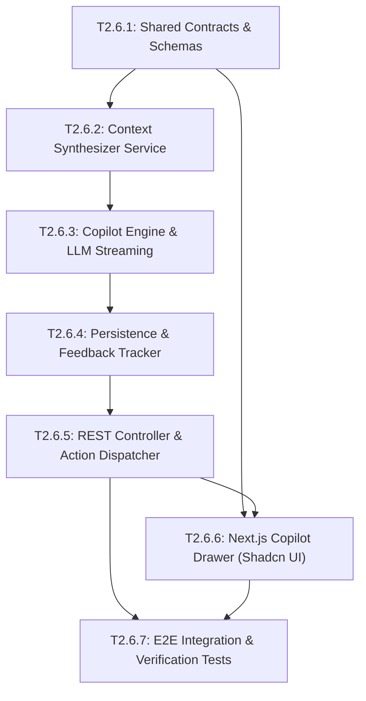

# Epic 2.6: Sales Copilot Assistant - Next Best Actions & Live Suggestions

## 1. Epic Overview

Epic 2.6 hiện thực hóa tầng trải nghiệm người dùng tối cao của Phase 2: Trợ lý Bán hàng Thông minh (Sales Copilot Assistant). Đồng hành cùng nhân viên kinh doanh ngay trong giao diện trò chuyện thời gian thực, Copilot liên tục tổng hợp ngữ cảnh phiên chat, hồ sơ khách hàng (`Contact`), trạng thái thương vụ (`Lead` / `Opportunity`), các bằng chứng bán hàng (`SalesEvidence`) và điểm số tiềm năng (`LeadScore`) để tự động đưa ra:
1. Bản thảo câu trả lời thông minh (Suggested Reply Drafts) phù hợp với giọng điệu khách hàng.
2. Đề xuất hành động tiếp theo tối ưu (Next Best Actions - e.g. Lên lịch demo, gửi báo giá, phân loại lại ngân sách).
3. Thẻ chỉ dẫn xử lý phản đối (Objection Handling Battlecards).

Giao diện được tích hợp trực tiếp vào Conversation App Shell của Next.js 16 bằng 100% linh kiện tái sử dụng từ Shadcn UI, hỗ trợ truyền nhận token qua WebSocket streaming và thao tác một chạm (One-Click Apply/Execute).

- **Epic ID**: `EPIC-2.6`
- **Title**: Sales Copilot Assistant - Next Best Actions & Live Suggestions
- **Technical Owner**: Full-Stack AI Engineer / Senior Frontend & Backend Engineer
- **Dependencies**: `EPIC-2.1` (Lead Core), `EPIC-2.3` (LLM Gateway), `EPIC-2.4` (Conversation Intelligence), `EPIC-2.5` (Lead Scoring), `EPIC-1.10` (Next.js Dashboard UI)
- **Target Milestone**: **Milestone 2C** (Copilot Assistant & UI Layer)
- **Status**: 📋 Backlog (Ready for Development)

---

## 2. Technical Objectives & Architectural Scope

### 2.1. Architectural Scope
- **Module Boundaries**:
  - Backend: `apps/server/src/copilot/` (Context synthesizer, suggestion engine, action executor, feedback tracker).
  - Frontend: `apps/web/src/features/copilot/` (Copilot drawer, suggested reply pill, streaming text view, action triggers).
- **Context Synthesis Engine**:
  - Gom nhóm dữ liệu thời gian thực trước khi gọi Prompt:
    * 10 tin nhắn gần nhất trong Conversation (`Message[]`).
    * Thông tin định danh và thuộc tính khách hàng (`Contact`).
    * Trạng thái và giá trị dự kiến của deal (`Lead` & `Opportunity`).
    * Danh sách bằng chứng mua hàng đã phát hiện (`SalesEvidence[]`).
    * Điểm số và phân hạng tiềm năng (`LeadScore`).
- **Suggestion Types & Data Schema**:
  - `CopilotSuggestion`: id, workspaceId, conversationId, leadId (optional), suggestionType (`REPLY_DRAFT`, `NEXT_BEST_ACTION`, `BATTLECARD`), content (nội dung text hoặc markdown), actionPayload (JSON chứa mã hành động và params: `{ action: 'SCHEDULE_DEMO', params: {...} }`), confidence (float), status (`PENDING`, `ACCEPTED`, `DISMISSED`, `APPLIED`), createdAt, resolvedAt.
  - Indexes: `@@index([workspaceId, conversationId, status])`.
- **WebSocket Streaming Experience**:
  - Token streaming qua WebSocket event `copilot.suggestion_chunk` giúp hiển thị từng từ ngữ xuất hiện tức thì trong vòng < 400ms.
- **Frontend UI Guidelines (Strict AGENTS.md Section 9 Compliance)**:
  - Tái sử dụng linh kiện sẵn có trong `apps/web/src/components/ui/`:
    * Drawer: `Sheet`, `SheetContent`, `SheetHeader`, `SheetTitle`.
    * Phân nhóm: `Tabs`, `TabsList`, `TabsTrigger`, `TabsContent`.
    * Trạng thái & Độ tin cậy: `Badge` (xanh/cam/đỏ theo confidence).
    * Nút thao tác: `Button` với `Spinner` khi đang thực thi, data-icon cho icons.
    * Phân cách: `Separator`.
  - Tuyệt đối không viết CSS thô hoặc custom modal overlays.
- **One-Click Execution Engine**:
  - Nút "Áp dụng câu trả lời" (Apply Reply): Tự động sao chép nội dung gợi ý vào khung soạn thảo tin nhắn (Chat Composer) để Agent rà soát và gửi.
  - Nút "Thực thi hành động" (Execute Action): Chuyển trạng thái Lead, tạo cuộc hẹn, hoặc mở dialog tạo Opportunity với dữ liệu điền sẵn.

---

## 3. Detailed User Stories & Gherkin Acceptance Criteria

### 📖 Story US-2.6.1: Realtime AI Reply Draft Generation with Streaming
> **As a** Sales Representative chatting with a customer,  
> **I want to** receive an AI-drafted reply tailored to the customer's question in real time with token streaming,  
> **so that** I can respond accurately and professionally in seconds without typing from scratch.

#### Acceptance Criteria (Gherkin):
```gherkin
Feature: AI Reply Draft Generation & Streaming

  Background:
    Given an agent is actively viewing conversation "conv-301" in workspace "WS-01"
    And the customer sent "Gói cước Enterprise có hỗ trợ kết nối SSO SAML không bạn?"

  Scenario: Generate contextual reply draft with streaming tokens
    When the Copilot Engine triggers a suggestion for "conv-301"
    Then the system should compile context with product capabilities and recent messages
    And the LLM Gateway should initiate token streaming
    And the client WebSocket should receive "copilot.suggestion_chunk" events incrementally
    And the complete suggestion should confirm SAML 2.0 support
    And a CopilotSuggestion record with type "REPLY_DRAFT" and status "PENDING" should be saved

  Scenario: One-click insertion into Chat Composer
    Given the agent sees the completed reply draft in the Copilot panel
    When the agent clicks "Use Draft in Composer"
    Then the draft text should be injected directly into the active Chat Composer input
    And the suggestion status should be updated to "APPLIED"
    And a domain event "copilot.suggestion_resolved" with action "APPLIED" should be emitted
```

---

### 📖 Story US-2.6.2: Actionable Next Best Action Recommendations & One-Click Execution
> **As a** Sales Representative,  
> **I want the** Copilot to recommend logical next steps (e.g. "Create Opportunity", "Book Technical Demo"),  
> **so that** deals do not stall due to missing follow-up actions.

#### Acceptance Criteria (Gherkin):
```gherkin
Feature: Next Best Action Execution

  Background:
    Given Lead "lead-777" has reached score 85 with status "QUALIFIED"
    And conversation "conv-301" has detected signals for Budget and Need

  Scenario: Suggest creating an Opportunity and execute via one-click
    When Copilot generates suggestions for "conv-301"
    Then a suggestion of type "NEXT_BEST_ACTION" should appear with label "Chuyển đổi thành Opportunity"
    And the actionPayload should contain:
      """
      {
        "action": "CONVERT_TO_OPPORTUNITY",
        "defaultAmount": 100000000,
        "recommendedStage": "DISCOVERY"
      }
      """
    When the agent clicks "Thực thi hành động"
    Then the Lead Conversion modal should pre-populate with defaultAmount and recommendedStage
    And upon confirmation the Lead should be converted successfully
    And the suggestion status should be updated to "ACCEPTED"
```

---

### 📖 Story US-2.6.3: Objection Handling Battlecards on Demand
> **As a** Junior Sales Agent,  
> **I want** battlecard snippets to automatically pop up when a customer mentions a competitor or objects to pricing,  
> **so that** I can confidently articulate our value proposition and counter objections.

#### Acceptance Criteria (Gherkin):
```gherkin
Feature: Objection Handling Battlecards

  Scenario: Surface competitive differentiation battlecard
    Given a customer message mentions "Đang so sánh với giải pháp của Competitor X"
    When the Copilot Engine detects the competitor mention
    Then a suggestion of type "BATTLECARD" should be generated
    And the content should highlight:
      - 3 key advantages over Competitor X (e.g. Omni-channel unification, Local support)
      - Recommended pivot questions to ask the prospect
    And the badge should indicate "Battlecard: Competitor X"
```

---

### 📖 Story US-2.6.4: Feedback Loop & Suggestion Resolution Tracking (Accept/Dismiss)
> **As an** AI Product Lead,  
> **I want to** capture whether agents accept, edit, or dismiss Copilot suggestions,  
> **so that** we can evaluate suggestion quality, calculate acceptance rates, and fine-tune system prompts.

#### Acceptance Criteria (Gherkin):
```gherkin
Feature: Suggestion Feedback Tracking

  Background:
    Given a pending CopilotSuggestion "sug-404" in workspace "WS-01"

  Scenario: Agent dismisses an unhelpful suggestion
    When the agent clicks "Dismiss" on "sug-404"
    And optionally provides reason "Not relevant to current topic"
    Then POST "/api/v1/workspaces/WS-01/copilot/suggestions/sug-404/dismiss" should be called
    And the database record status should update to "DISMISSED"
    And "resolvedAt" timestamp should be recorded
    And the item should disappear from the active suggestion list

  Scenario: Cross-tenant dismissal attempt is blocked
    Given an agent from another workspace "WS-02"
    When this agent attempts to dismiss suggestion "sug-404"
    Then the response status code should be 404
    And the error code should be "SUGGESTION_NOT_FOUND"
```

---

### 📖 Story US-2.6.5: Next.js Copilot Drawer Integration with Shadcn UI Primitives
> **As a** Sales Representative on the web dashboard,  
> **I want** the Copilot Assistant to be seamlessly accessible via a collapsible side panel,  
> **so that** it assists my workflow without occluding the conversation message history.

#### Acceptance Criteria (Gherkin):
```gherkin
Feature: Frontend Copilot Drawer UI

  Scenario: Open Copilot drawer in conversation panel
    Given the agent is on URL "/[workspaceSlug]/conversations/conv-301"
    When the agent toggles the Copilot Assistant button in the top action bar
    Then the Copilot Sheet component should slide in from the right edge
    And the drawer header should display "Sales Copilot" with a live status badge
    And the content area should feature Tabs for "Suggestions", "Actions", and "Timeline"
    And all UI components must reuse Shadcn primitives from "@/components/ui/"
    And the layout should be fully responsive and keyboard accessible (Escape closes sheet)
```

---

## 4. Comprehensive Task Breakdown

| Task ID | Task Title & Component | Type | Description | Est. Points | Prerequisites |
| :--- | :--- | :---: | :--- | :---: | :--- |
| **T2.6.1** | Shared Contracts & DTOs for Copilot Assistant<br/>`packages/shared-contracts/src/copilot/` | `CONTRACT` | Định nghĩa Zod schemas cho `CopilotSuggestionDto`, `SuggestionActionPayload`, `SuggestionFeedbackDto`, và WebSocket streaming events. | 2 SP | None |
| **T2.6.2** | Context Synthesizer & Prompt Assembly Service<br/>`apps/server/src/copilot/copilot-context.service.ts` | `SERVICE` | Tổng hợp tin nhắn, hồ sơ Lead, Sales Evidence, Lead Score thành context payload chuẩn hóa để đưa vào Prompt Template. | 4 SP | T2.6.1, T2.1.3, T2.2.2, T2.5.3 |
| **T2.6.3** | Copilot Suggestion Generation Engine & LLM Streaming<br/>`apps/server/src/copilot/copilot-engine.service.ts` | `SERVICE` | Xây dựng pipeline gọi LLM Gateway (Epic 2.3), sinh các loại gợi ý (Reply, Action, Battlecard), hỗ trợ WebSocket streaming token. | 5 SP | T2.6.2, T2.3.2 |
| **T2.6.4** | Copilot Suggestion Persistence & Feedback Tracker<br/>`apps/server/src/copilot/copilot.service.ts` | `SERVICE` | Lưu bản ghi `CopilotSuggestion`, xử lý logic cập nhật trạng thái `ACCEPTED`, `DISMISSED`, `APPLIED`, tính toán tỷ lệ tương tác. | 4 SP | T2.6.3 |
| **T2.6.5** | Copilot REST Controller & Action Dispatcher<br/>`apps/server/src/copilot/copilot.controller.ts` | `CONTROLLER` | Endpoints truy vấn danh sách gợi ý, trigger sinh lại gợi ý thủ công, accept/dismiss suggestion với `WorkspaceGuard`. | 3 SP | T2.6.4 |
| **T2.6.6** | Next.js Copilot Drawer & One-Click Composer Insertion<br/>`apps/web/src/features/copilot/components/` | `FRONTEND` | Xây dựng `CopilotDrawer`, `SuggestionCard`, `StreamingReplyView` bằng Shadcn UI (`Sheet`, `Tabs`, `Badge`, `Button`); tích hợp Zustand Chat Composer store. | 5 SP | T2.6.1, T2.6.5 |
| **T2.6.7** | End-to-End Copilot Integration & UI Verification Tests<br/>`apps/server/test/copilot/` & `apps/web/test/copilot/` | `TEST` | Test trọn vẹn luồng từ context assembly ➔ LLM suggestion ➔ WebSocket delivery ➔ Feedback recording ➔ UI injection. | 4 SP | T2.6.5, T2.6.6 |

---

## 5. Intra-Epic Execution Dependency Graph (DAG)



---

## 6. Definition of Done & Verification Commands

### Verification Checklist:
- [ ] Thời gian xuất hiện token đầu tiên (Time To First Token) khi streaming gợi ý dưới 600ms.
- [ ] Thao tác một chạm (One-click) chèn chính xác nội dung gợi ý vào khung Chat Composer mà không làm mất trạng thái đính kèm tệp hiện tại.
- [ ] Mọi phản hồi Accept / Dismiss đều được ghi nhận vào database phục vụ đánh giá chất lượng prompt.
- [ ] 100% linh kiện giao diện sử dụng các primitive có sẵn trong `apps/web/src/components/ui/`, tuân thủ thiết kế tối giản, hỗ trợ Dark Mode.
- [ ] Bảo đảm bảo mật đa người thuê: Không một nhân viên nào có thể xem gợi ý của Workspace khác.

### Command Execution:
```bash
# Run Copilot backend tests
pnpm nx test server --testFile="src/copilot"

# Run web frontend tests
pnpm nx test web --testFile="copilot"

# Run linters
pnpm nx lint server
pnpm nx lint web

# Verify build
pnpm nx build server
pnpm nx build web
```
