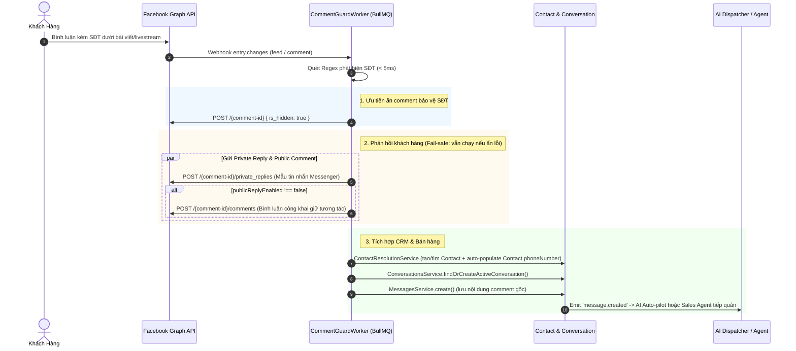

# Epic 3.3 — Comment Guard: Vệ Sĩ Ẩn Bình Luận & Kéo Khách Vào Inbox

> **Mục tiêu**: Xây dựng pipeline tự động quét bình luận Facebook chứa số điện thoại, ẩn comment bảo vệ thông tin khách hàng, tự động đăng comment phản hồi công khai, gửi Private Reply kéo khách vào Messenger, bóc tách SĐT cập nhật Contact CRM và mở Conversation để AI Auto-pilot hoặc nhân viên tư vấn chốt đơn.  
> **Tiên quyết**: Epic 3.1 (AI Agent Core) — `AiDispatcherListener` đã hoạt động để tự động tiếp nhận conversation mới  
> **Ước lượng**: 1-1.5 tuần  
> **Tham chiếu kiến trúc**: [RFC Commerce & Orders](../architecture/rfc-commerce-and-orders.md), [PRD Commerce & Orders](../product/prd-commerce-and-orders.md), [RFC AI Agent Framework](../architecture/rfc-ai-agent-framework.md)

---

## 1. Bối Cảnh Nghiệp Vụ & Tại Sao Cần Comment Guard (vs. Facebook Native)

### 1.1. Vấn nạn "Cướp khách / Cướp đơn" trong Social Commerce tại Việt Nam
Tại Việt Nam, hành vi mua sắm qua Facebook Post và Livestream có đặc thù:
- Khách hàng comment công khai cú pháp chốt đơn kèm SĐT: *"Lấy em 1 áo size L màu đen 0912345678"*.
- **Kẻ xấu / đối thủ "nằm vùng"** dùng tool bot quét SĐT công khai, lập tức gọi điện thoại mạo danh shop chính chủ: *"Em chào chị, bên shop gọi xác nhận đơn áo size L chị vừa comment..."*.
- Kẻ xấu gửi hàng giả, hàng lỗi hoặc rác qua ship COD giá rẻ. Khách hàng tin tưởng thanh toán, sau đó quay lại Fanpage bóc phốt, đánh giá 1 sao và hủy đơn thật của shop.
- **Hậu quả**: Shop vừa mất chi phí quảng cáo (CAC), vừa mất đơn hàng, vừa chịu hủy hoại uy tín thương hiệu nặng nề.

### 1.2. Tại sao công cụ tích hợp sẵn của Facebook Page (Moderation Assist) không giải quyết được?

| Tiêu chí | Facebook Page Native (Moderation Assist) | Sales Copilot Comment Guard |
|---|---|---|
| **Nhận diện số điện thoại** | ❌ Chỉ lọc theo từ khóa tĩnh (`keyword blocklist`). Không nhận diện được biểu thức Regex có biến thể dấu cách, chấm, gạch, mã quốc tế (`090 123 4567`, `090.xxx`, `+84...`). Không thể nhập 10 triệu số điện thoại vào bộ lọc. | ✅ Sử dụng `VIETNAMESE_PHONE_EXTRACT_REGEX` thuần tối ưu (< 5ms, 0 token LLM), bao phủ toàn bộ định dạng SĐT Việt Nam. |
| **Rủi ro ẩn nhầm (False Positive)** | ❌ Nếu chặn từ khóa `09`, `08`, `sdt`: Facebook sẽ ẩn nhầm cả bình luận hỏi giờ (`09:00`), hỏi ngày (`09/10`), hỏi giá (`09k`), hỏi size, làm giảm tương tác bài viết. | ✅ Chỉ kích hoạt khi phát hiện đúng chuỗi 10 số điện thoại hợp lệ; bình luận khen hoặc hỏi size không bị ẩn. |
| **Hành động phản hồi khách** | ❌ Chỉ ẩn comment dạng shadowban. Không thể gửi tin nhắn riêng cho khách hay thông báo gì thêm. | ✅ Thực hiện chuỗi hành động: Ẩn comment + Gửi Private Reply vào Messenger + Đăng bình luận trả lời công khai. |
| **Pipeline Thương mại & CRM** | ❌ Hoàn toàn tách rời bán hàng. Nhân viên phải vào Activity Log đọc thủ công từng comment bị ẩn. | ✅ Tự động bóc tách SĐT lưu vào `Contact.phoneNumber`, mở Conversation trong Unified Inbox để AI Auto-pilot hoặc Sales Agent chốt đơn bằng Dynamic VietQR. |

---

## 2. Quy Tắc Nghiệp Vụ Chi Tiết

### 2.1. Điều kiện kích hoạt & Phạm vi phát hiện
- **Sự kiện Webhook tiếp nhận**: Facebook Page webhook `entry.changes` với:
  - `field === 'feed'`
  - `value.item === 'comment'`
  - `value.verb === 'add' || value.verb === 'edited'` *(Hỗ trợ cả trường hợp khách sửa comment để thêm SĐT)*.
- **Phạm vi lọc**: Chỉ quét khi `channel.settings.commentGuard.enabled === true` cho Channel Facebook đó.
- **Loại trừ**: Bỏ qua comment do chính Page đăng (`from.id === channel.providerAccountId`).
- **Phát hiện SĐT (Regex thuần < 5ms)**:
  ```regex
  /(?:(?:\+84|84|0)[3|5|7|8|9])(?:\d{8}|\b(?:\d{2,3}[\s.-]?){3}\d)/g
  ```
  Bao phủ: `0912345678`, `+84912345678`, `091 234 5678`, `091-234-5678`, `091.234.5678`.
- **Phạm vi MVP**: Chỉ tập trung SĐT Việt Nam (chiếm > 95% trường hợp cần bảo vệ), không mở rộng sang CMND/Email cho v1.

### 2.2. Thứ tự hành động khi phát hiện SĐT



| Thứ tự | Hành động | Mục đích & Chi tiết | Fail-safe |
|---|---|---|---|
| **1** | **Ẩn bình luận (Hide Comment)** | Gọi `POST /{comment-id}` với `{ is_hidden: true }`. Comment biến mất khỏi mắt công chúng và đối thủ ngay lập tức. | Nếu thất bại (thiếu quyền `pages_manage_engagement`), ghi log cảnh báo và **vẫn tiếp tục** các bước tiếp theo để không làm mất lead. |
| **2** | **Gửi Private Reply (Messenger)** | Gọi `POST /{comment-id}/private_replies` với `{ message: privateReplyTemplate }`. Mở hội thoại 1-1 với khách hàng trên Messenger. | Áp dụng 1 lần duy nhất cho mỗi comment ID. |
| **3** | **Đăng bình luận phản hồi công khai** | Nếu `publicReplyEnabled !== false`, gọi `POST /{comment-id}/comments` với `{ message: publicReplyTemplate }`. Giúp khách an tâm đã được ghi nhận và giữ Social Proof cho bài post. | Nếu lỗi hoặc bị tắt, bỏ qua không ảnh hưởng luồng chính. |
| **4** | **Cập nhật Contact CRM** | `ContactResolutionService`: Tìm hoặc tạo Contact theo Facebook PSID. **Tự động gán SĐT bóc tách được vào `Contact.phoneNumber`**. | Không bắt nhân viên hay khách phải nhập lại SĐT. |
| **5** | **Mở Conversation trong Unified Inbox** | `ConversationsService.findOrCreateActiveConversation()`: Tạo hoặc nối tiếp hội thoại đang mở trong Inbox của Fanpage. | Đồng bộ tức thì lên màn hình chat của nhân viên. |
| **6** | **Lưu trữ tin nhắn gốc** | `MessagesService.create()`: Lưu toàn bộ nội dung comment ban đầu của khách (kèm metadata ID bài viết, link comment). | Đảm bảo ngữ cảnh đầy đủ khi nhân viên/AI mở xem. |
| **7** | **Điều phối AI / Nhân viên** | Bắn sự kiện `message.created`. `AiDispatcherListener` tự động tiếp quản nếu phòng chat bật `AUTOPILOT`, hoặc hiển thị tại danh sách chờ cho nhân viên nếu `AUTOPILOT` tắt. | Hoạt động thống nhất với toàn bộ hệ sinh thái Sales Copilot. |

### 2.3. Mẫu tin nhắn (Templates)
Hệ thống hỗ trợ 2 mẫu tin nhắn riêng biệt, cho phép quản trị viên tùy chỉnh linh hoạt từ giao diện:
1. **Private Reply Template (Tin nhắn riêng Messenger)**:
   ```text
   Dạ shop đã nhận thông tin của bạn rồi ạ 😊
   Shop sẽ tư vấn riêng cho bạn trong tin nhắn này nhé!
   ```
2. **Public Reply Template (Bình luận công khai)**:
   ```text
   Shop đã nhận thông tin và nhắn tin riêng cho bạn rồi nhé 😊
   ```

### 2.4. Chính sách lưu trữ & Vòng đời bình luận
- **Không tự động bỏ ẩn (No Auto-Unhide)**: Bình luận đã ẩn sẽ giữ trạng thái ẩn vĩnh viễn nhằm triệt để ngăn chặn đối thủ khai thác SĐT về sau. Tương tác của bài viết đã được bảo toàn thông qua bình luận trả lời công khai ở Bước 3.
- **Không quét hồi tố (No Backfill Scan)**: Chỉ áp dụng xử lý real-time đối với các bình luận mới phát sinh (`verb: add`) hoặc được chỉnh sửa (`verb: edited`) sau thời điểm bật tính năng.

---

## 3. Thiết Kế Kỹ Thuật

### 3.1. Cấu hình Channel Settings Schema
Lưu trực tiếp trong trường JSON `channel.settings.commentGuard` (không cần migration DB):

```typescript
export const commentGuardConfigSchema = z.object({
  enabled: z.boolean().default(false),
  privateReplyTemplate: z.string().optional(),
  publicReplyEnabled: z.boolean().default(true),
  publicReplyTemplate: z.string().optional(),
});

export type CommentGuardConfig = z.infer<typeof commentGuardConfigSchema>;
```

### 3.2. Quản lý Tải & Chống Rate Limit (BullMQ `comment-guard` Queue)
Facebook Graph API áp dụng giới hạn gọi API xấp xỉ **~200 calls/giờ/Page**. Trong các buổi Livestream bán hàng cao điểm, hàng trăm comment có thể đổ về đồng thời.
- **Webhook Non-blocking**: Webhook endpoint Facebook phản hồi `HTTP 200 OK` tức thì (< 100ms) sau khi xác thực HMAC và đẩy job vào BullMQ.
- **Hàng đợi `comment-guard`**:
  - Worker xử lý với cấu hình Rate Limiter đảm bảo không vượt ngưỡng 200 calls/giờ cho mỗi token Page.
  - Xử lý retry tự động với Exponential Backoff khi nhận mã lỗi `429 Too Many Requests` từ Graph API.
  - Deduplication: Dùng khóa idempotent `ChannelEvent [channelId, externalEventId]` với `externalEventId = comment_id` ngăn chặn xử lý trùng lặp khi Meta retry webhook.

### 3.3. Các hàm Facebook Graph API trong `FacebookAdapter`
Bổ sung các phương thức gọi Graph API:
- `hideComment(pageAccessToken: string, commentId: string): Promise<boolean>`
  - Endpoint: `POST https://graph.facebook.com/v26.0/{commentId}`
  - Body: `{ is_hidden: true }`
- `sendPrivateReply(pageAccessToken: string, commentId: string, message: string): Promise<{ id: string }>`
  - Endpoint: `POST https://graph.facebook.com/v26.0/{commentId}/private_replies`
  - Body: `{ message }`
- `sendPublicCommentReply(pageAccessToken: string, commentId: string, message: string): Promise<{ id: string }>`
  - Endpoint: `POST https://graph.facebook.com/v26.0/{commentId}/comments`
  - Body: `{ message }`

### 3.4. Giao diện Cấu hình (Web UI)
Tích hợp trực tiếp vào màn hình cấu hình hộp thư (`apps/web/src/features/omnichannel/inbox-detail/tab-configuration.tsx`) cho các hộp thư loại `FACEBOOK_MESSENGER`:
- Card riêng biệt: **"Vệ Sĩ Bình Luận (Comment Guard)"**.
- Switch bật/tắt toàn bộ tính năng Comment Guard cho Fanpage.
- Switch bật/tắt tính năng đăng bình luận công khai phản hồi.
- Textarea soạn thảo mẫu tin nhắn riêng tư (Private Reply).
- Textarea soạn thảo mẫu bình luận công khai (Public Reply).
- Nút lưu cấu hình tích hợp với `useUpdateInbox`.

---

## 4. Tiêu Chí Nghiệm Thu (Definition of Done)

### Detection & Processing Core
- [ ] Quét chính xác SĐT Việt Nam với các định dạng: `0912345678`, `+84912345678`, `091 234 5678`, `091-234-5678`, `091.234.5678`.
- [ ] Không nhận diện nhầm các cụm từ thông thường: "giá 350000đ", "quận 09", "ngày 09/10".
- [ ] Tốc độ bóc tách Regex < 5ms.
- [ ] Bỏ qua comment của chính Page (`from.id === page_id`).

### Facebook Graph API Actions
- [ ] Ẩn bình luận thành công qua Graph API (`is_hidden: true`).
- [ ] Gửi Private Reply thành công vào Messenger của khách hàng.
- [ ] Đăng bình luận công khai phản hồi thành công (khi bật `publicReplyEnabled`).
- [ ] Xử lý fail-safe: Nếu hành động ẩn thất bại (do phân quyền), vẫn tiếp tục gửi Private Reply và bình luận phản hồi.
- [ ] Bắt được cả sự kiện comment mới (`verb === 'add'`) và comment được chỉnh sửa (`verb === 'edited'`).

### CRM & Unified Inbox Flow
- [ ] Tự động cập nhật số điện thoại bóc tách vào `Contact.phoneNumber`.
- [ ] Tạo mới hoặc gán vào Conversation đang hoạt động trong Inbox tương ứng.
- [ ] Lưu nội dung comment ban đầu thành Message thuộc Conversation.
- [ ] Kích hoạt luồng `AiDispatcherListener` tự động tư vấn khi `AUTOPILOT` bật, hoặc hiển thị tại danh sách chờ nhân viên khi `AUTOPILOT` tắt.

### Resilience & Performance
- [ ] Webhook phản hồi HTTP 200 < 100ms.
- [ ] BullMQ xử lý hàng đợi có Rate Limiter và Retry Exponential Backoff khi gặp lỗi 429.
- [ ] Đảm bảo tính Idempotent: webhook gửi trùng không tạo nhiều conversation hay gửi tin nhắn lặp lại.

### UI Configuration
- [ ] Giao diện cấu hình hiển thị đầy đủ trong tab Configuration của Facebook Messenger Inbox.
- [ ] Lưu và nạp chính xác các trường cấu hình: `enabled`, `publicReplyEnabled`, `privateReplyTemplate`, `publicReplyTemplate`.
