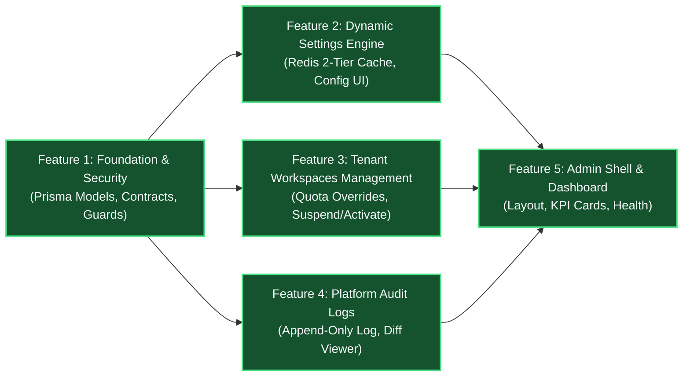

# Epic Breakdown: Super Admin Portal & Dynamic System Settings Engine

| Epic Metadata | Value |
| :--- | :--- |
| **Epic ID** | **EPIC-SA** |
| **Epic Title** | Super Admin Portal & Dynamic System Settings Engine |
| **Status** | 🟢 COMPLETED (100% DONE) |
| **Target Milestone** | Platform Governance & SaaS Operations |
| **Architectural RFC** | [Super Admin Technical RFC](../architecture/super-admin-technical-rfc.md) |
| **Product PRD** | [Super Admin PRD](../product/super-admin-prd.md) |
| **Estimated Features** | 5 Discrete Engineering Features |

---

## 1. Executive Summary & Phasing Strategy

Epic này thiết lập hệ thống quản trị cấp cao (**Super Admin**) và cơ chế cấu hình động (**Dynamic System Settings**) cho Sales Copilot. Toàn bộ tính năng được chia thành **5 Features kỹ thuật tuần tự**, tuân thủ nghiêm ngặt các nguyên tắc:
1. **Zero Tenant Data Leakage**: Chỉ quản lý siêu dữ liệu (Metadata-only), không xem nội dung tin nhắn của tenant.
2. **Zero-Downtime Hot Reloading**: Cấu hình hệ thống đồng bộ qua Redis cache 2 tầng, không cần restart server.
3. **Defense in Depth**: Bảo vệ 2 lớp từ Next.js Edge Middleware tới NestJS `PlatformRolesGuard`.
4. **Anti-Over-Engineering**: Tái sử dụng tối đa 52+ Shadcn UI primitives, không sinh abstraction thừa.

---

## 2. Feature Breakdown & Detailed Task List

---

### 🔹 Feature 1: Foundation, Database Models & Platform Security Guard

- **Mục tiêu**: Thiết lập nền móng dữ liệu trong PostgreSQL, bổ sung shared contracts và dựng rào chắn bảo mật 2 tầng (Edge Middleware + Backend Guard) để cô lập tuyệt đối các API và Route của Super Admin.
- **Độ phức tạp**: 🟡 **Medium** (2-3 ngày)
- **Dependencies**: Không có (Baseline).

#### Danh sách công việc (Work Breakdown):
1. **Task 1.1: Cập nhật Prisma Schema & Database Migration**:
   - Mở rộng model `Workspace` trong `apps/server/prisma/schema.prisma`: Thêm `isSuspended Boolean @default(false)`, `suspendedReason String?`, `suspendedAt DateTime?`.
   - Bổ sung model `SystemSetting`: Khóa chính `key String @id`, `value Json`, `category String`, `description String?`, `isEncrypted Boolean`, `updatedBy String?`, `createdAt`, `updatedAt`.
   - Bổ sung model `PlatformAuditLog`: `id`, `actorId`, `actorEmail`, `action`, `targetType`, `targetId`, `metadata Json?`, `ipAddress`, `userAgent`, `createdAt`.
   - Thực hiện migration database an toàn không gây downtime: `pnpm --filter @sales-copilot/server prisma db push`.
2. **Task 1.2: Xây dựng Module Shared Contracts (`packages/shared-contracts`)**:
   - Tạo thư mục `packages/shared-contracts/src/platform-admin/`:
     - `enums.ts`: `PlatformAuditAction`, `SystemSettingCategory`.
     - `workspaces.dto.ts`: Zod schemas cho truy vấn danh sách, cập nhật gói cước, điều chỉnh quota, toggle suspend.
     - `settings.dto.ts`: Zod schemas cho danh sách và cập nhật setting.
     - `audit-logs.dto.ts`: Zod schemas cho truy vấn audit logs.
     - `metrics.dto.ts`: Typed interfaces cho overview KPI metrics.
   - Export toàn bộ contracts qua `packages/shared-contracts/src/index.ts`.
3. **Task 1.3: Xây dựng Backend Platform Security Guard**:
   - Tạo decorator `@PlatformRoles(...roles: PlatformRole[])` trong `apps/server/src/modules/platform-admin/decorators/platform-roles.decorator.ts`.
   - Xây dựng `PlatformRolesGuard` trong `apps/server/src/modules/platform-admin/guards/platform-roles.guard.ts`.
   - Viết Unit Tests `platform-roles.guard.spec.ts`: Xác minh từ chối 403 Forbidden với mọi user có `role === 'USER'`, chấp thuận khi `role === 'SUPER_ADMIN'`.
4. **Task 1.4: Cập nhật Next.js Edge Middleware Protection**:
   - Sửa `apps/web/src/middleware.ts`: Bổ sung kiểm tra với đường dẫn bắt đầu bằng `/admin`:
     - Nếu không có cookie `access_token` ➔ Redirect `/login?redirect=/admin`.
     - Nếu có token nhưng JWT payload `role !== 'SUPER_ADMIN'` ➔ Chặn truy cập và redirect về trang chủ `/`.

#### Tiêu chí nghiệm thu (Definition of Done):

- [x] Schema Prisma biên dịch thành công, types generated đầy đủ.
- [x] Shared contracts biên dịch không có lỗi TypeScript (`pnpm nx run shared-contracts:typecheck`).
- [x] Unit test của `PlatformRolesGuard` đạt 100% test coverage.
- [x] User thường khi gõ trực tiếp URL `/admin` trên trình duyệt bị chuyển hướng về `/`.

---

### 🔹 Feature 2: Dynamic System Settings & 2-Tier Caching Engine (Khối B)

- **Mục tiêu**: Xây dựng động cơ quản lý cấu hình hệ thống thời gian thực với bộ nhớ đệm 2 tầng (PostgreSQL + Redis), cho phép Super Admin bật/tắt Feature Flags và đổi tham số hệ sinh thái có hiệu lực ngay lập tức.
- **Độ phức tạp**: 🔴 **High** (3-4 ngày)
- **Dependencies**: Feature 1.

#### Danh sách công việc (Work Breakdown):
1. **Task 2.1: Xây dựng `SystemSettingsService` (Backend Engine)**:
   - Tạo service `apps/server/src/modules/platform-admin/services/system-settings.service.ts`:
     - Method `getSetting<T>(key: string, defaultValue: T): Promise<T>`: Kiểm tra Redis key `system:settings:{key}` trước (độ trễ < 2ms), nếu miss đọc từ DB và set cache.
     - Method `getAllSettings(category?: string)`: Đọc danh sách cấu hình.
     - Method `updateSetting(key: string, value: any, actorId: string, actorEmail: string)`: Validate giá trị, cập nhật Postgres, cập nhật Redis key `system:settings:{key}`, xóa cache `system:settings:all`, tự động ghi bản ghi vào `PlatformAuditLog`.
     - Seed dữ liệu mặc định ban đầu: Kích hoạt các settings cốt lõi (`feature.pos_vietqr_enabled`, `feature.ai_autopilot_enabled`, `llm.default_provider`, v.v.).
2. **Task 2.2: Xây dựng `SystemSettingsController` (REST API)**:
   - `GET /platform-admin/settings`: Lấy danh sách settings theo category.
   - `PUT /platform-admin/settings/:key`: Cập nhật giá trị setting.
3. **Task 2.3: Viết Unit Tests cho `SystemSettingsService`**:
   - Kiểm tra hành vi cache-hit và cache-miss.
   - Kiểm tra logic cập nhật cache và ghi nhận audit log tương ứng.
4. **Task 2.4: Xây dựng Giao diện Quản lý Cấu hình (`apps/web`)**:
   - Tạo trang `apps/web/src/app/(admin)/admin/settings/page.tsx`:
     - Phân chia các tab rõ ràng: `🚩 Feature Flags`, `🤖 AI & LLM`, `⚖️ Hạn mức Mặc định`, `📢 Thông báo Hệ thống`.
     - Với Feature Flags: Sử dụng Shadcn `Switch` component bật/tắt trực quan.
     - Với tham số chuỗi/số: Sử dụng Shadcn `Input` và `Select` có validate.
     - Nút "Lưu thay đổi" gửi request tới API và hiển thị Sonner Toast thành công.

#### Tiêu chí nghiệm thu (Definition of Done):
- [x] Đọc cấu hình từ cache Redis đạt thời gian phản hồi `< 5ms`.
- [x] Khi Super Admin bấm tắt Feature Flag `feature.ai_autopilot_enabled` trên UI, Redis cache cập nhật ngay lập tức mà không cần restart server.
- [x] Thao tác lưu cấu hình sinh ra 1 bản ghi trong `platform_audit_logs`.

---

### 🔹 Feature 3: Platform Workspaces Management (Khối A)

- **Mục tiêu**: Xây dựng công cụ quản lý toàn diện vòng đời các khách hàng doanh nghiệp (Workspaces), cho phép điều chỉnh gói cước, ghi đè hạn mức quota và tạm khóa workspace vi phạm.
- **Độ phức tạp**: 🔴 **High** (3-4 ngày)
- **Dependencies**: Feature 1.

#### Danh sách công việc (Work Breakdown):
1. **Task 3.1: Xây dựng `PlatformWorkspacesService`**:
   - `getWorkspaces(query)`: Truy vấn danh sách workspaces có phân trang, tìm kiếm theo tên, slug, email owner; tính toán số lượng thành viên và số lượng kênh tích hợp.
   - `getWorkspaceDetail(id)`: Lấy chi tiết thông số cấu hình, quota limits, và thống kê sử dụng tài nguyên (Storage, Agents, Channels).
   - `updateWorkspacePlan(id, planDto, actor)`: Nâng/hạ gói cước (`BillingPlanType`), cập nhật hạn mức tùy chỉnh trong `Workspace.settings.quotas`, ghi audit log `PLAN_CHANGED` / `QUOTA_UPDATED`.
   - `toggleWorkspaceSuspension(id, statusDto, actor)`: Cập nhật `isSuspended`, `suspendedReason`, `suspendedAt`, ghi audit log `WORKSPACE_SUSPENDED` / `WORKSPACE_ACTIVATED`.
2. **Task 3.2: Xây dựng `PlatformWorkspacesController`**:
   - `GET /platform-admin/workspaces`: Danh sách có phân trang và bộ lọc.
   - `GET /platform-admin/workspaces/:id`: Chi tiết một workspace.
   - `PATCH /platform-admin/workspaces/:id/plan`: Cập nhật gói và quota.
   - `PATCH /platform-admin/workspaces/:id/status`: Khóa hoặc mở lại.
3. **Task 3.3: Bổ sung Cơ chế Kiểm tra Trạng thái Workspace vào `WorkspaceGuard`**:
   - Mở rộng `WorkspaceGuard`: Nếu workspace có `isSuspended: true`, lập tức chặn request với mã lỗi HTTP 403 `WORKSPACE_SUSPENDED` và trả về `suspendedReason` cho người dùng.
4. **Task 3.4: Xây dựng Giao diện Quản lý Workspaces (`apps/web`)**:
   - Tạo trang `apps/web/src/app/(admin)/admin/workspaces/page.tsx`:
     - Bảng dữ liệu Shadcn `Table` hiển thị: Tên shop, Slug, Gói cước (Badge), Số nhân sự, Số kênh, Trạng thái (Active / Suspended), Ngày tạo.
     - Thanh tìm kiếm và bộ lọc nhanh theo gói cước / trạng thái.
     - Shadcn `Dialog` "Chỉnh sửa Hạn mức & Gói cước": Cho phép sửa `maxAgents`, `maxChannels`, `storageLimitMb`, `aiMonthlyTokens`.
     - Shadcn `AlertDialog` "Tạm khóa Workspace": Bắt buộc nhập lý do tạm khóa trước khi bấm xác nhận.

#### Tiêu chí nghiệm thu (Definition of Done):
- [x] Tìm kiếm và lọc danh sách workspace mượt mà dưới 200ms.
- [x] Khi một workspace bị chuyển sang trạng thái Suspended, nhân viên của workspace đó khi gửi tin nhắn hoặc mở chat sẽ nhận thông báo tài khoản bị tạm khóa.
- [x] Thao tác thay đổi quota hoặc trạng thái được ghi lại đầy đủ trong audit log.

---

### 🔹 Feature 4: Platform Audit Logs & Security Tracing

- **Mục tiêu**: Cung cấp nhật ký kiểm toán bất biến (Append-Only) ghi lại mọi tác động quản trị từ Super Admin, hỗ trợ đối soát sự cố và theo dõi an ninh hệ thống.
- **Độ phức tạp**: 🟡 **Medium** (2 ngày)
- **Dependencies**: Feature 1, Feature 2, Feature 3.

#### Danh sách công việc (Work Breakdown):
1. **Task 4.1: Xây dựng `PlatformAuditLogsService` & Controller**:
   - Method `logAction(entry)`: Ghi nhận nhật ký phi đồng bộ không chặn luồng chính (Fire-and-forget hoặc in-process event).
   - Method `getAuditLogs(query)`: Truy vấn danh sách lịch sử có phân trang, hỗ trợ lọc theo loại hành động (`action`), ID đối tượng (`targetId`), hoặc tìm kiếm theo email quản trị viên.
   - Endpoint `GET /platform-admin/audit-logs`.
2. **Task 4.2: Xây dựng Giao diện Nhật ký Hoạt động (`apps/web`)**:
   - Tạo trang `apps/web/src/app/(admin)/admin/audit-logs/page.tsx`:
     - Bảng hiển thị: Thời gian, Quản trị viên (Email), Hành động (Badge theo màu), Loại đối tượng, ID đối tượng, Địa chỉ IP.
     - Nút "Xem chi tiết": Mở modal hiển thị JSON Diff giữa giá trị trước và sau khi thay đổi (`oldValue` vs `newValue`).

#### Tiêu chí nghiệm thu (Definition of Done):
- [x] Bảng `platform_audit_logs` không có API sửa (`UPDATE`) hay xóa (`DELETE`).
- [x] Mọi thao tác từ Feature 2 và Feature 3 đều hiển thị tức thì trên màn hình Audit Logs.

---

### 🔹 Feature 5: Super Admin Portal Shell, Dashboard Overview & Navigation

- **Mục tiêu**: Hoàn thiện khung giao diện tổng quan (Shell), thanh điều hướng chuyên biệt và trang Dashboard Overview cung cấp các chỉ số vận hành tổng hợp (KPI Metrics) cho toàn bộ nền tảng.
- **Độ phức tạp**: 🟡 **Medium** (2-3 ngày)
- **Dependencies**: Feature 1, 2, 3, 4.

#### Danh sách công việc (Work Breakdown):
1. **Task 5.1: Xây dựng `PlatformMetricsService` & REST API**:
   - [x] Endpoint `GET /platform-admin/metrics/overview`:
     - [x] Tính tổng số Workspaces (phân loại Active vs Suspended).
     - [x] Tính tổng số Người dùng (Users).
     - [x] Kiểm tra tình trạng kết nối tới PostgreSQL, Redis Cache.
2. **Task 5.2: Xây dựng Admin Master Layout & Navigation (`apps/web`)**:
   - [x] Tạo `apps/web/src/app/(admin)/admin/layout.tsx`:
     - [x] Sidebar độc lập dành riêng cho Super Admin:
       - [x] 📊 **Tổng quan (Overview)**
       - [x] 🏢 **Workspaces (Tenants & Quotas)**
       - [x] ⚙️ **Cấu hình Hệ thống (System Settings)**
       - [x] 🛡️ **Nhật ký Hoạt động (Audit Logs)**
     - [x] Header: Badge nhận diện "Platform Super Administrator", Dark/Light mode toggle, Nút "Quay lại Workspace thông thường".
3. **Task 5.3: Xây dựng Trang Dashboard Overview (`apps/web`)**:
   - [x] Tạo `apps/web/src/app/(admin)/admin/page.tsx`:
     - [x] Thẻ KPI hiển thị: Tổng số Workspaces, Tỷ lệ hoạt động, Tổng Users, Trạng thái Dịch vụ (Postgres: Connected, Redis: Connected).
     - [x] Lối tắt nhanh tới trang Quản lý Workspaces và Cấu hình Hệ thống.
4. **Task 5.4: Kiểm thử Tích hợp & Đóng gói Nghiệm thu (E2E Verification)**:
   - [x] Đăng nhập bằng `superadmin@salescopilot.io` ➔ Kiểm tra toàn bộ luồng thao tác.
   - [x] Chạy toàn bộ lint, type-check và build (`pnpm nx affected -t build,lint,test`).

#### Tiêu chí nghiệm thu (Definition of Done):
- [x] Giao diện Admin Portal hiển thị đồng bộ, chuẩn responsive, hoạt động tốt trên cả Dark Mode và Light Mode.
- [x] Toàn bộ 5 Features hoạt động gắn kết, không có lỗi console, không có memory leak.
