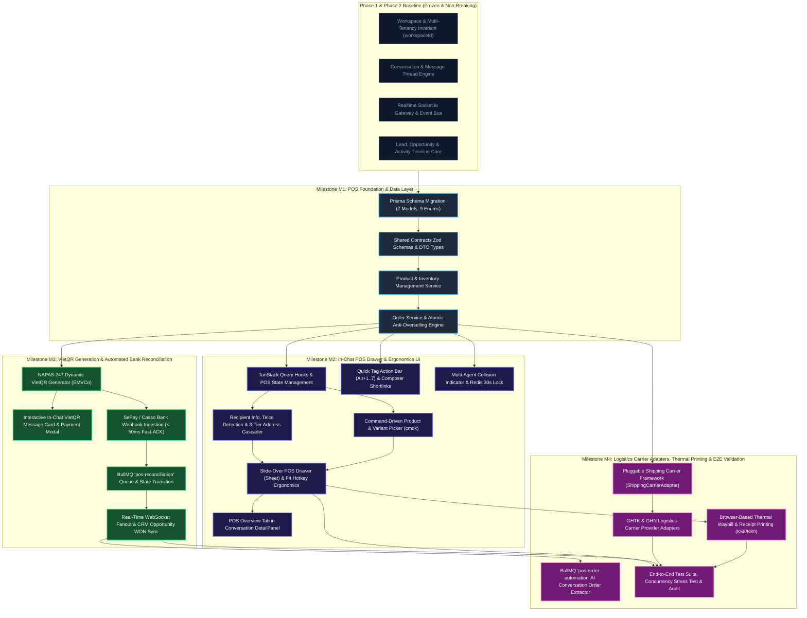

# In-Chat POS & Order Closing Automation: Phased Roadmap & Task Breakdown

**Document Title**: Phased Implementation Roadmap, Backlog & Engineering Task Breakdown  
**Subsystem**: In-Chat POS & Order Closing Automation (Phân hệ POS & Tự Động Hóa Chốt Đơn Trong Chat)  
**Platform**: Sales Copilot Omnichannel & Intelligence Platform  
**Target Runtime**: Next.js 14+ (App Router), NestJS 10+, PostgreSQL 16, Prisma ORM 7+, Redis 7, BullMQ 5+, Socket.io, Zod  
**Compliance Standards**: `AGENTS.md` (Strict Multi-Tenancy Scoping, Anti-Over-Engineering, Non-Breaking Phase 1 & 2 Baseline, Mandatory Shadcn UI Primitive Reuse, High-Value Testing & Definition of Done)  
**Target File**: `docs/backlog/in-chat-pos-roadmap.md`  
**Status**: APPROVED / PUBLICATION-READY SPECIFICATION  
**Document Version**: 1.0.0  
**Date**: 2026-09-08  
**Author**: Roadmap & Backlog Author Worker  

---

## 1. Strategic Overview & Phased Architecture

### 1.1. Context & Business Imperative
In Southeast Asian and Vietnamese social commerce (Facebook Messenger, Zalo OA, Web Chat, and Telegram), more than 65% of online retail orders are closed directly inside chat conversations. Traditional workflows force sales representatives to alt-tab between the customer chat thread and external ERP/POS systems (e.g., KiotViet, Sapo, Excel). This introduces a **1.5 to 3 minute latency penalty per transaction**, stalls customer enthusiasm, creates severe data entry typos in Vietnamese addresses (resulting in **15–25% return/delivery failure rates**), and exposes merchants to multi-agent collision and fraudulent payment screenshots.

The **In-Chat POS & Order Closing Automation** subsystem collapses the entire product consultation, inventory reservation, order formulation, payment collection, and shipping label generation workflow directly into the Sales Copilot conversation view.

```text
┌────────────────────────────────────────────────────────────────────────────────────────────────────────┐
│                                   SALES COPILOT WORKSPACE PLATFORM                                     │
├───────────────────────────────────┬───────────────────────────────────┬────────────────────────────────┤
│    PHASE 1: CONVERSATION CORE     │    PHASE 2: SALES INTELLIGENCE    │    IN-CHAT POS SUBSYSTEM       │
│     (Omnichannel Baseline)        │     (Revenue & AI Engine)         │     (Closing & Fulfillment)    │
├───────────────────────────────────┼───────────────────────────────────┼────────────────────────────────┤
│ • Omnichannel Ingestion Webhooks  │ • Multi-Provider LLM Gateway      │ • Fast Catalog Search (< 50ms) │
│ • Unified Contact & Identity Graph│ • Real-time Buying Signal Ledger  │ • Atomic Stock Lock (Anti-OOS) │
│ • Conversation & Message Models   │ • Multi-Factor Lead Scoring       │ • Dynamic VietQR (NAPAS 247)   │
│ • Realtime WebSocket Gateway      │ • Copilot Suggestion Drawer (NBA) │ • Bank Webhook Auto-Reconcile  │
│ • RBAC & Workspace Tenancy Guards │ • CRM Opportunities & Pipelines   │ • K58/K80 Thermal Print Slips  │
└───────────────────────────────────┴───────────────────────────────────┴────────────────────────────────┘
```

---

### 1.2. Phased Architecture Decomposition (4 Milestones)

The implementation is structured into **4 sequential, independently testable milestones**:



---

### 1.3. Milestone Scope & Delivery Matrix

| Milestone | Target Scope | Key Technical Outcomes | Success Criteria / Verification |
| :--- | :--- | :--- | :--- |
| **M1: POS Foundation & Data Layer** | Data models, DTOs, Product & Order NestJS services, concurrency control | • 7 new Prisma models (`Product`, `ProductVariant`, `Order`, `OrderItem`, `ShippingAddress`, `PaymentTransaction`, `InventoryTransaction`).<br>• `@sales-copilot/shared-contracts` Zod validation.<br>• `$transaction` conditional predicate decrement (`stockQuantity >= requestedQuantity`). | `pnpm nx test server --testFile=orders.service.spec.ts` passes; 10 concurrent requests for 1 unit yields exactly 1 success and 9 `INSUFFICIENT_STOCK` rejections. |
| **M2: In-Chat POS Drawer & Ergonomics UI** | Web UI components, hotkey ergonomics, address normalizer, collision lock | • Dual-Mode integration: POS Tab in `DetailPanel` + Slide-over `Sheet` (F4).<br>• 100% Shadcn UI primitive reuse (`Sheet`, `Command`, `FieldGroup`, `Badge`).<br>• Regex Telco detector & 3-tier GSO cascading picker.<br>• Redis 30s sliding lock for multi-agent collision. | DevTools verifies F4 toggles drawer; `Alt+1..7` toggles tags; agent collision banner displays when 2 agents view same thread. |
| **M3: VietQR Generation & Automated Bank Reconciliation** | NAPAS 247 QR, SePay/Casso webhooks, BullMQ reconciliation | • EMVCo TLV string generator with CRC16-CCITT.<br>• In-chat interactive VietQR card with 1-click copy.<br>• Webhook receiver with HMAC-SHA256 & Redis `SETNX` idempotency.<br>• BullMQ `pos-reconciliation` worker auto-transitions orders to `PAID`. | Webhook ingestion returns HTTP 200 in `< 50ms`; order transitions to `PAID` in `< 1.5s`; Opportunity auto-shifts to `WON`. |
| **M4: Logistics Adapters, Thermal Printing & E2E Validation** | 3PL carriers, ESC/POS & CSS thermal slips, AI extractor, E2E audit | • Pluggable `ShippingCarrierAdapter` with GHTK & GHN adapters.<br>• Zero-margin browser thermal printing (58mm K58, 80mm K80) with Code128 barcodes.<br>• BullMQ `pos-order-automation` AI extractor.<br>• Monorepo test, lint, and build verification. | `pnpm nx run-many -t test,lint,build` passes with 0 errors; print layout renders crisp K80 receipt; zero unscoped Prisma queries. |

---

### 1.4. Traceability Matrix: PRD Core Use Cases & Features to Roadmap Tasks

| PRD Use Case / Capability | System Feature | Supporting Tasks in Roadmap |
| :--- | :--- | :--- |
| **UC1: Fast In-Chat Catalog & Stock Lookup** | F1: Fast Catalog & Inventory Lookup | `TASK-M1-03`, `TASK-M2-01`, `TASK-M2-03` |
| **UC2: AI Extraction of Recipient Info & Address** | F2: Recipient Info & AI Auto-Extraction | `TASK-M2-02`, `TASK-M4-04` |
| **UC3: 1-Click Order Creation & POS Drawer** | F3: 1-Click Order Creation & POS Drawer<br>F4: Order Lifecycle State Machine | `TASK-M1-02`, `TASK-M1-04`, `TASK-M2-04`, `TASK-M2-05` |
| **UC4: Dynamic VietQR Generation (NAPAS 247)** | F5: Dynamic VietQR Generation & Chat Card | `TASK-M3-01`, `TASK-M3-02` |
| **UC5: Automated Bank Webhook Reconciliation** | F6: Automated Bank Webhook Reconciliation<br>F12: Realtime Events & BullMQ Queues | `TASK-M3-03`, `TASK-M3-04`, `TASK-M3-05` |
| **UC6: Browser Thermal Printing (58mm/80mm)** | F8: Browser-Based Thermal Printing | `TASK-M4-03` |
| **Vietnam Telco Badge Detection** | F2: Telco Carrier Optimization | `TASK-M1-02`, `TASK-M2-02` |
| **Multi-Agent Collision Prevention** | F9: Multi-Agent Collision Detection | `TASK-M2-07` |
| **Quick Tag Action Bar** | F10: Quick Tag Action Bar | `TASK-M2-06` |
| **Pluggable Logistics Shipping Adapters** | F7: Shipping Carrier Framework | `TASK-M4-01`, `TASK-M4-02` |
| **Multi-Tenancy & Architectural Compliance** | F11: Strict Multi-Tenancy & Data Isolation | `TASK-M1-01`, `TASK-M1-04`, `TASK-M4-05` |

---

## 2. Granular Task Breakdown

### Milestone M1: POS Foundation & Data Layer

#### `TASK-M1-01`: Prisma Schema Extension & Migration
- **Feature Alignment**: F11 (Multi-Tenancy & Data Isolation), F4 (Order Lifecycle & State Machine).
- **Target File Paths**:
  - `apps/server/prisma/schema.prisma` (Modify: add 7 models, 9 enums, and non-breaking relation hooks).
  - `apps/server/prisma/migrations/20260908100000_add_pos_subsystem/migration.sql` (Create: migration SQL).
- **Technical Implementation Specification**:
  - Define 9 enums: `OrderStatus`, `PaymentStatus`, `FulfillmentStatus`, `DiscountType`, `PaymentMethod`, `PaymentGateway`, `PaymentTransactionStatus`, `CarrierProvider`, `CarrierNetwork`, `InventoryTransactionType`.
  - Define 7 models: `Product`, `ProductVariant`, `Order`, `OrderItem`, `ShippingAddress`, `PaymentTransaction`, `InventoryTransaction`.
  - Every model MUST include `workspaceId String` with relation `workspace Workspace @relation(fields: [workspaceId], references: [id], onDelete: Cascade)`.
  - Compound constraints: `@@unique([workspaceId, id])` across all 7 models (`Product`, `ProductVariant`, `Order`, `OrderItem`, `ShippingAddress`, `PaymentTransaction`, `InventoryTransaction`); `@@unique([workspaceId, sku])` and `@@unique([workspaceId, slug])` on `Product`; `@@unique([workspaceId, sku])` on `ProductVariant`; `@@unique([workspaceId, orderNumber])` and `@@unique([workspaceId, displayId])` on `Order`; `@@unique([workspaceId, idempotencyKey])` on `PaymentTransaction`.
  - Referential integrity: `InventoryTransaction.variant` relation must specify `onDelete: Restrict` to preserve immutable audit trail.
  - Non-breaking relation hooks on existing models:
    - `Workspace`: add `products`, `productVariants`, `orders`, `orderItems`, `shippingAddresses`, `paymentTransactions`, `inventoryTransactions`.
    - `User`: add `createdOrders`, `performedInventoryTransactions`.
    - `Conversation`: add `orders Order[]`.
    - `Contact`: add `orders Order[]`, `shippingAddresses ShippingAddress[]`.
    - `Lead`: add `orders Order[]`.
    - `Opportunity`: add `orders Order[]`.
  - Execute Prisma generation: `pnpm exec prisma generate --schema=apps/server/prisma/schema.prisma`.
- **Dependencies & Prerequisites**: None (Builds on frozen Phase 1 & 2 Prisma schema).
- **Definition of Done (DoD)**:
  1. `prisma validate` returns valid schema.
  2. Migration applies cleanly without data loss or breaking changes to existing tables.
  3. `pnpm nx run server:build` compiles successfully with generated client types.
  4. Zero unscoped models without `workspaceId` and all models provide compound `[workspaceId, id]` selectors.

---

#### `TASK-M1-02`: Shared Contracts Zod Schemas & DTO Types
- **Feature Alignment**: F1, F3, F4, F5, F6, F7, F11.
- **Target File Paths**:
  - `packages/shared-contracts/src/pos/pos-enums.ts` (Create: TypeScript string enums mirroring Prisma).
  - `packages/shared-contracts/src/pos/product.schemas.ts` (Create: Zod schemas for products & variants).
  - `packages/shared-contracts/src/pos/order.schemas.ts` (Create: Zod schemas for order creation, confirmation, updates).
  - `packages/shared-contracts/src/pos/payment.schemas.ts` (Create: Zod schemas for VietQR & payment transactions).
  - `packages/shared-contracts/src/pos/inventory.schemas.ts` (Create: Zod schemas for inventory transactions).
  - `packages/shared-contracts/src/pos/shipping.schemas.ts` (Create: Zod schemas for 3-tier address & shipping carrier).
  - `packages/shared-contracts/src/pos/address/address-trie.ts` (Create: Shared in-memory Administrative Trie for fuzzy search).
  - `packages/shared-contracts/src/pos/address/vn-administrative-units.json` (Create: GSO standard 63 Provinces, 705 Districts, Wards).
  - `packages/shared-contracts/src/pos/address/index.ts` (Create: Shared address module exports).
  - `packages/shared-contracts/src/pos/index.ts` (Create: Public barrel exports).
  - `packages/shared-contracts/src/index.ts` (Modify: Export `* from './pos'`).
- **Technical Implementation Specification**:
  - Implement `createProductSchema`, `updateProductSchema`, `listProductsQuerySchema`, `adjustInventorySchema`.
  - Implement `createOrderSchema`, `confirmOrderSchema`, `cancelOrderSchema`, `manualPayOrderSchema`, `listOrdersQuerySchema`.
  - Enforce `createOrderSchema` defaults `status` to `OrderStatus.DRAFT` and prevents clients from injecting arbitrary advanced statuses (`PAID`, `COMPLETED`).
  - Add `carrierMetadata` to `shippingAddress` schemas.
  - Implement `vietQrGenerateSchema`, `vietQrPayloadResponseSchema`.
  - Implement `shippingAddressSchema`, `carrierRateQuoteSchema`, `createShipmentSchema`.
  - Strictly enforce Vietnamese phone regex: `/^(0|\+84)[3|5|7|8|9][0-9]{8}$/`.
  - Derive inferred TypeScript types via `z.infer<typeof schema>`.
- **Dependencies & Prerequisites**: `TASK-M1-01`.
- **Definition of Done (DoD)**:
  1. `pnpm nx test shared-contracts` passes all schema validation tests.
  2. All schemas reject invalid numbers, negative quantities, and missing required fields.
  3. `pnpm nx build shared-contracts` emits valid CJS/ESM typings.

---

#### `TASK-M1-03`: Product Catalog & Variant Inventory Management Service
- **Feature Alignment**: F1 (Fast Catalog & Inventory Lookup), F11 (Multi-Tenancy).
- **Target File Paths**:
  - `apps/server/src/modules/pos/products/products.module.ts` (Create: NestJS module definition).
  - `apps/server/src/modules/pos/products/products.controller.ts` (Create: REST endpoints with `@ZodBody`, `@ZodQuery`).
  - `apps/server/src/modules/pos/products/products.service.ts` (Create: Core catalog & inventory logic).
  - `apps/server/src/modules/pos/products/products.service.spec.ts` (Create: Unit & tenancy tests).
- **Technical Implementation Specification**:
  - REST Endpoints under `/api/v1/workspaces/:workspaceId/products`:
    - `GET /` — List products with search, category filter, low-stock filter, pagination.
    - `GET /:id` — Get single product with active variants.
    - `POST /` — Create product with nested variants in `$transaction`.
    - `PUT /:id` — Update product details and pricing.
    - `DELETE /:id` — Soft-delete or archive product (`isActive: false`).
    - `POST /:id/variants/:variantId/inventory` — Manual stock adjustment (`STOCK_IN`, `STOCK_OUT`, `INVENTORY_AUDIT`).
  - Every Prisma call MUST include `workspaceId`:
    `this.prisma.product.findFirst({ where: { id, workspaceId }, include: { variants: true } })`.
  - Sub-50ms search implementation: compound index on `[workspaceId, barcode]`, `[workspaceId, sku]`, and `[workspaceId, name]` with case-insensitive `mode: 'insensitive'`.
  - Emit event `inventory.updated` via `EventEmitter2` on stock adjustments.
- **Dependencies & Prerequisites**: `TASK-M1-01`, `TASK-M1-02`.
- **Definition of Done (DoD)**:
  1. `pnpm nx test server --testFile=products.service.spec.ts` passes with > 90% branch coverage.
  2. Tenant isolation test confirms Workspace A cannot read or mutate Workspace B's products.
  3. Stock adjustments automatically append an audit entry into `InventoryTransaction`.

---

#### `TASK-M1-04`: Order Management Service & Atomic Anti-Overselling Engine
- **Feature Alignment**: F3 (1-Click Order Creation), F4 (Order Lifecycle State Machine), F11 (Multi-Tenancy).
- **Target File Paths**:
  - `apps/server/src/modules/pos/orders/orders.module.ts` (Create: NestJS orders module).
  - `apps/server/src/modules/pos/orders/orders.controller.ts` (Create: Order REST controller).
  - `apps/server/src/modules/pos/orders/orders.service.ts` (Create: Order service with atomic transaction logic).
  - `apps/server/src/modules/pos/orders/orders.service.spec.ts` (Create: Concurrency and state transition unit tests).
- **Technical Implementation Specification**:
  - Order endpoints under `/api/v1/workspaces/:workspaceId/orders`:
    - `POST /` — Create order (`DRAFT` status; stock not reserved).
    - `GET /` — List orders with filters (`conversationId`, `contactId`, `status`, `paymentStatus`).
    - `GET /:id` — Get order detail with items, shipping address, and payment transactions.
    - `POST /:id/confirm` — Atomically confirm order and reserve inventory.
    - `POST /:id/pay` — Record manual payment (Cash / Counter transfer).
    - `POST /:id/cancel` — Cancel order and release reserved stock.
  - **Two-Tier Anti-Overselling Implementation (Model A: Available = Physical - Reserved)** in `confirmOrder()`:
    - **Deadlock Avoidance (`40P01`)**: Prior to row-level locking, sort line items deterministically by `variantId` ascending (`items.sort((a, b) => a.variantId.localeCompare(b.variantId))`). This eliminates PostgreSQL circular wait conditions when concurrent checkouts contain overlapping carts in different sequences.
    - **Atomic Reservation Predicate**: Atomically increment `reservedQuantity` (do **NOT** decrement `stockQuantity` at confirmation; physical items remain in warehouse until sale commit):
      ```typescript
      // 1. Sort variants to prevent circular wait deadlocks (40P01)
      const sortedItems = [...order.items].sort((a, b) => a.variantId.localeCompare(b.variantId));

      for (const item of sortedItems) {
        // 2. Atomic conditional reservation checking available stock (stock_quantity - reserved_quantity)
        const count = await tx.$executeRaw`
          UPDATE product_variants
          SET reserved_quantity = reserved_quantity + ${item.quantity}, updated_at = NOW()
          WHERE id = ${item.variantId} AND workspace_id = ${workspaceId}
            AND (stock_quantity - reserved_quantity) >= ${item.quantity}
        `;
        if (count === 0) {
          throw new ConflictException({ code: 'INSUFFICIENT_STOCK' });
        }
      }
      ```
  - Record `InventoryTransactionType.RESERVATION` on confirm (preserving `stockQuantity`), `RELEASE_RESERVATION` on cancel, and `COMMIT_SALE` on paid/dispatched.
  - Emit domain events: `order.created`, `order.confirmed`, `order.cancelled`.
- **Dependencies & Prerequisites**: `TASK-M1-01`, `TASK-M1-02`, `TASK-M1-03`.
- **Definition of Done (DoD)**:
  1. Concurrency unit test simulates 10 concurrent requests to purchase 1 available unit. Exactly 1 succeeds and 9 fail with `INSUFFICIENT_STOCK`.
  2. Multi-item checkout test verifies zero `40P01` deadlocks when two orders lock items in inverted sequence.
  3. Order confirmation increments `reservedQuantity` without altering physical `stockQuantity`.
  4. Order cancellation restores `reservedQuantity` back to 0.
  5. Every database query includes `workspaceId`.

---

### Milestone M2: In-Chat POS Drawer & Ergonomics UI

#### `TASK-M2-01`: Client API Client & TanStack Query Hooks for POS
- **Feature Alignment**: F1 (Fast Catalog), F3 (Order Creation), F12 (Realtime Events).
- **Target File Paths**:
  - `apps/web/src/features/pos/api/pos-client.ts` (Create: Thin fetch wrappers using `@sales-copilot/shared-contracts`).
  - `apps/web/src/features/pos/hooks/use-pos-products.ts` (Create: TanStack Query hook for catalog search & caching).
  - `apps/web/src/features/pos/hooks/use-pos-orders.ts` (Create: Mutations for order lifecycle).
  - `apps/web/src/features/pos/hooks/use-active-conversation-order.ts` (Create: Fetch active draft/confirmed order).
  - `apps/web/src/features/pos/index.ts` (Create: Feature barrel exports).
- **Technical Implementation Specification**:
  - `usePosProducts(workspaceSlug, { search, category })`: `staleTime: 5 * 60 * 1000` (5 min catalog cache).
  - `useActiveConversationOrder(workspaceSlug, conversationId)`: queries `/api/v1/workspaces/:ws/orders?conversationId=:id&status=DRAFT,CONFIRMED`.
  - `useCreateOrderMutation()`: invalidates conversation order queries on success.
  - `useConfirmOrderMutation()`: triggers atomic reservation on backend, updates local cache optimistically.
- **Dependencies & Prerequisites**: `TASK-M1-02`, `TASK-M1-04`.
- **Definition of Done (DoD)**:
  1. Zero use of Axios or SWR (strict compliance with `AGENTS.md` Section 6).
  2. Hooks provide typed responses and loading/error states.
  3. Cache updates on mutation without page refresh.

---

#### `TASK-M2-02`: Recipient Info Form, Telco Detection & 3-Tier Address Cascader
- **Feature Alignment**: F2 (Recipient Info & Address Extraction).
- **Target File Paths**:
  - `apps/web/src/features/pos/components/recipient-info-form.tsx` (Create: Recipient details form).
  - `apps/web/src/features/pos/components/carrier-badge.tsx` (Create: Vietnamese carrier badge indicator).
  - `apps/web/src/features/pos/components/address-cascader.tsx` (Create: 3-tier GSO cascading selector).
  - `apps/web/src/features/pos/lib/vietnam-telco.ts` (Create: Carrier detection rules and prefix map).
  - `packages/shared-contracts/src/pos/address/address-trie.ts` (Create: In-memory Administrative Trie for fuzzy search, shared across frontend cascader and backend BullMQ AI extractor).
  - `packages/shared-contracts/src/pos/address/vn-administrative-units.json` (Create: GSO standard 63 Provinces, 705 Districts, Wards, shared across monorepo packages).
  - `packages/shared-contracts/src/pos/address/index.ts` (Create: Barrel export for shared administrative units and trie).
- **Technical Implementation Specification**:
  - `detectCarrierNetwork(phoneNumber)`: Maps prefixes to `VIETTEL`, `VINAPHONE`, `MOBIFONE`, `VIETNAMOBILE`, `WINTEL`, `ITEL`, `GMOBILE`.
  - `CarrierBadge`: Renders semantic styling:
    - Viettel: `bg-emerald-500/10 text-emerald-500 border-emerald-500/30`
    - Vinaphone: `bg-blue-500/10 text-blue-500 border-blue-500/30`
    - Mobifone: `bg-sky-500/10 text-sky-500 border-sky-500/30`
  - `AddressCascader`: Uses Shadcn `Combobox` / `Popover` + `Command` primitives:
    - Tier 1: Tỉnh / Thành phố (63 units)
    - Tier 2: Quận / Huyện (cascades on Tier 1 selection)
    - Tier 3: Phường / Xã (cascades on Tier 2 selection)
  - Layout built strictly with `FieldGroup`, `Field`, `FieldLabel`, `Input`, and `gap-*` spacing.
- **Dependencies & Prerequisites**: `TASK-M1-02`.
- **Definition of Done (DoD)**:
  1. Typing Vietnamese phone numbers immediately displays the correct carrier badge in `< 5ms`.
  2. Address cascader correctly limits district choices to selected province, and wards to selected district.
  3. No custom div primitives; 100% Shadcn primitive reuse.

---

#### `TASK-M2-03`: Command-Driven Product & Variant Picker (`cmdk`)
- **Feature Alignment**: F1 (Fast Catalog & Stock Lookup).
- **Target File Paths**:
  - `apps/web/src/features/pos/components/product-picker-command.tsx` (Create: High-speed product combobox).
  - `apps/web/src/features/pos/components/line-items-table.tsx` (Create: Editable order line items table).
  - `apps/web/src/features/pos/components/stock-status-badge.tsx` (Create: Realtime inventory indicator badge).
- **Technical Implementation Specification**:
  - Product search built using `apps/web/src/components/ui/command.tsx` (`cmdk`).
  - Search matches product name, SKU, and barcode with Vietnamese diacritics stripping.
  - Variant pills rendered beneath each product showing variant attributes and available stock:
    `Available = stockQuantity - reservedQuantity`.
  - Stock badge variants:
    - In Stock ($\ge 10$): `text-emerald-500 bg-emerald-500/10`
    - Low Stock ($1 \dots 9$): `text-amber-500 bg-amber-500/10`
    - Out of Stock ($= 0$): `text-destructive bg-destructive/10` (disabled unless pre-order allowed)
  - `LineItemsTable`: Built with `Table`, `TableRow`, `TableCell`, `Input` (quantity stepper `[- 1 +]`), unit price override, line item discount, and delete action.
- **Dependencies & Prerequisites**: `TASK-M2-01`.
- **Definition of Done (DoD)**:
  1. Client search filtering executes in `< 20ms` for catalogs up to 5,000 items.
  2. Keyboard navigation (Arrow Up/Down, Enter, Esc) selects products without mouse interaction.
  3. Real-time subtotal dynamically recalculates as quantities change.

---

#### `TASK-M2-04`: POS Overview Tab Integration in DetailPanel
- **Feature Alignment**: F3 (1-Click Order Creation), F4 (Order Lifecycle).
- **Target File Paths**:
  - `apps/web/src/features/conversations/detail-panel.tsx` (Modify: integrate 3-tab layout `Tabs`, `TabsList`, `TabsTrigger`, `TabsContent`).
  - `apps/web/src/features/pos/components/pos-detail-tab.tsx` (Create: POS overview tab content).
  - `apps/web/src/features/pos/components/order-status-badge.tsx` (Create: Order state badge).
  - `apps/web/src/features/pos/components/order-history-list.tsx` (Create: Past customer orders accordion).
- **Technical Implementation Specification**:
  - Convert `DetailPanel` header/body to Shadcn `Tabs` with 3 triggers:
    - Tab 1: "Khách hàng" (Existing contact info & identities).
    - Tab 2: "Đơn POS" (New POS overview).
    - Tab 3: "Sales AI" (Phase 2 Copilot BANT evidence & lead scoring).
  - `PosDetailTab` components:
    - Current Active Order Card: displays Order Number (`#DH1042`), status badge, line items summary, total amount, payment status.
    - Quick Action Bar: "In phiếu K80", "Gửi VietQR vào chat", "Chỉnh sửa đơn".
    - Primary CTA Button: `Button` with icon ⚡ "Tạo đơn hàng mới (F4)".
    - Order History Section: list of past orders for this customer (`Contact.orders`) with dates and totals.
- **Dependencies & Prerequisites**: `TASK-M2-01`, `TASK-M2-02`.
- **Definition of Done (DoD)**:
  1. Switching between Contact, POS, and Copilot tabs is instant with zero layout shift.
  2. If an active order exists for the conversation, its live status is displayed accurately.
  3. Clicking "Tạo đơn hàng mới" triggers the POS Drawer.

---

#### `TASK-M2-05`: High-Speed Slide-Over POS Drawer (`Sheet` & F4 Ergonomics)
- **Feature Alignment**: F3 (1-Click Order Creation), F4 (Order Lifecycle).
- **Target File Paths**:
  - `apps/web/src/features/pos/components/pos-drawer.tsx` (Create: Main slide-over POS drawer).
  - `apps/web/src/features/pos/components/order-financial-summary.tsx` (Create: Subtotal, discount, shipping calculations).
  - `apps/web/src/features/conversations/conversation-layout.tsx` (Modify: mount `PosDrawer` and global keyboard listener).
- **Technical Implementation Specification**:
  - Main container: Shadcn `Sheet` with `side="right"` and `className="sm:max-w-xl w-full"`.
  - Global Hotkey Listener: `useHotkeys('f4', () => setPosDrawerOpen(prev => !prev))` in `conversation-layout.tsx`.
  - Composes:
    - Header: Order mode (`DRAFT`), collision alert banner.
    - Section 1: `RecipientInfoForm` with AI Auto-fill pill.
    - Section 2: `ProductPickerCommand` (`Ctrl+K`).
    - Section 3: `LineItemsTable`.
    - Section 4: `OrderFinancialSummary`:
      - Shipping presets: Freeship (`0 ₫`), Đồng giá (`25.000 ₫`), Chuẩn (`30.000 ₫`), Hỏa tốc (`45.000 ₫`).
      - Discount toggles: Fixed VND (`₫`) vs Percentage (`%`), voucher code input.
      - Total calculation: `totalAmount = Math.max(0, subtotal - discountAmount + shippingFee)`.
      - Payment method radio: `COD`, `VIETQR`, `PARTIAL_DEPOSIT`.
    - Footer: "Hủy bỏ", "Lưu nháp", "In nhiệt K80", and Primary Button "⚡ Tạo đơn & Gửi VietQR" (`Ctrl+Enter`).
- **Dependencies & Prerequisites**: `TASK-M2-02`, `TASK-M2-03`, `TASK-M2-04`.
- **Definition of Done (DoD)**:
  1. Pressing `F4` opens and closes the drawer cleanly from anywhere in the conversation screen.
  2. Pressing `Ctrl+Enter` commits the order and triggers API mutation.
  3. Form errors are highlighted using Shadcn `FieldError`.

---

#### `TASK-M2-06`: Quick Tag Action Bar & Keyboard Shortcuts
- **Feature Alignment**: F10 (Quick Tag Action Bar).
- **Target File Paths**:
  - `apps/web/src/features/conversations/quick-tag-action-bar.tsx` (Create: Horizontal quick tag strip).
  - `apps/web/src/features/conversations/message-thread.tsx` (Modify: render `QuickTagActionBar` above message composer).
  - `apps/web/src/features/conversations/hooks/use-quick-tags.ts` (Create: Tag mutations and shortcut listener).
- **Technical Implementation Specification**:
  - Positioned directly above `ChatComposer` in `message-thread.tsx`.
  - Renders 7 standard Vietnamese commerce quick tags:
    - `Alt+1`: `#DA_CHUYEN_KHOAN` (Đã chuyển khoản VietQR)
    - `Alt+2`: `#CHO_GIAO` (Chờ đóng gói & giao hàng)
    - `Alt+3`: `#DANG_GIAO` (Đang giao hàng 3PL)
    - `Alt+4`: `#HET_HANG` (Hết hàng / Chờ nhập)
    - `Alt+5`: `#CAN_TU_VAN` (Khách cần tư vấn thêm)
    - `Alt+6`: `#CHO_KHACH_CHECK` (Chờ khách check size)
    - `Alt+7`: `#BOM_HANG` (Khách bom hàng)
  - Built with Shadcn `Badge` and `ToggleGroup` with optimistic cache update `< 20ms`.
  - Global hotkey handler intercepts `Alt+1` through `Alt+7` to toggle labels without losing composer focus.
- **Dependencies & Prerequisites**: Phase 1 Label module (`apps/server/src/modules/labels`).
- **Definition of Done (DoD)**:
  1. Clicking a quick tag or pressing `Alt+1..7` immediately toggles the badge state on the conversation.
  2. Conversation list filters immediately reflect the updated tag.

---

#### `TASK-M2-07`: Agent Collision Presence Indicator & Redis Sliding Lock
- **Feature Alignment**: F9 (Multi-Agent Collision Detection), F12 (Realtime Events).
- **Target File Paths**:
  - `apps/server/src/modules/pos/presence/pos-presence.service.ts` (Create: Redis 30-second lock manager).
  - `apps/server/src/modules/pos/presence/pos-presence.gateway.ts` (Create: WebSocket presence event handler).
  - `apps/web/src/features/pos/components/agent-collision-banner.tsx` (Create: Amber collision warning banner).
  - `apps/web/src/features/pos/hooks/use-pos-collision.ts` (Create: Collision detection & heartbeat ping hook).
- **Technical Implementation Specification**:
  - When agent opens POS Drawer, client emits `pos.editing_started` with `{ workspaceId, conversationId }`.
  - Backend writes Redis key: `SET lock:pos:editing:{workspaceId}:{conversationId} JSON.stringify({ userId, userName, avatarUrl, timestamp }) EX 30`.
  - Client sends heartbeat every 15 seconds to refresh TTL.
  - Backend broadcasts `pos.collision_status` to room `conversation_{conversationId}`.
  - If another agent opens drawer, `AgentCollisionBanner` renders:
    `Alert variant="warning"`: *"⚠️ [Avatar] Hoàng Nam đang soạn đơn hàng cho khách này lúc 10:24"*.
  - "Tạo đơn" button disables or displays a "Tiếp quản đơn hàng (Takeover)" confirmation dialog.
  - When drawer closes or user disconnects, key is deleted and collision clears.
- **Dependencies & Prerequisites**: Phase 1 Realtime Gateway (`apps/server/src/modules/realtime`).
- **Definition of Done (DoD)**:
  1. Opening POS Drawer in browser tab A displays collision banner in browser tab B within 200ms.
  2. Closing tab A clears the collision state after at most 30 seconds.
  3. No lingering locks in Redis after session termination.

---

### Milestone M3: VietQR Generation & Automated Bank Reconciliation

#### `TASK-M3-01`: NAPAS 247 Dynamic VietQR Generation Engine
- **Feature Alignment**: F5 (Dynamic VietQR Generation).
- **Target File Paths**:
  - `apps/server/src/modules/pos/payments/vietqr.service.ts` (Create: EMVCo QR string and image generator).
  - `apps/server/src/modules/pos/payments/vietqr.service.spec.ts` (Create: VietQR specification tests).
  - `apps/server/src/modules/pos/payments/vietqr.controller.ts` (Create: Dynamic QR generation endpoint).
- **Technical Implementation Specification**:
  - Implement EMVCo Tag-Length-Value (TLV) formatter:
    - Tag 00: `"01"` (Format Indicator)
    - Tag 01: `"12"` (Point of Initiation: Dynamic QR)
    - Tag 38: Sub-tag 00 (`"A000000727"`), Sub-tag 01 (Bank BIN 6 digits + Account Number), Sub-tag 02 (`"QRIBFTTA"`)
    - Tag 53: `"704"` (Currency: VND)
    - Tag 54: Integer order total amount (e.g., `"460000"`)
    - Tag 58: `"VN"`
    - Tag 62: Sub-tag 08 Purpose of Transaction (`"ORD {displayId}"`, e.g., `"ORD 1004"`)
    - Tag 63: CRC16-CCITT polynomial `0x1021` uppercase 4-digit hex checksum.
  - Generate VietQR image URL using official VietQR API template format (`https://img.vietqr.io/image/{bankBin}-{accountNumber}-compact2.png?...`) with in-process SVG/canvas QR generator fallback.
  - Bank BIN dictionary: MBBank (`970422`), Vietcombank (`970436`), Techcombank (`970407`), ACB (`970416`), VPBank (`970432`), etc.
- **Dependencies & Prerequisites**: `TASK-M1-04`.
- **Definition of Done (DoD)**:
  1. Generated EMVCo payload passes standard CRC-16 checksum validation.
  2. Scanning generated QR with Vietnamese banking app (VCB/MB/Techcombank) successfully pre-fills bank, account, exact amount, and transfer memo.
  3. `vietqr.service.spec.ts` passes with 100% test coverage on TLV and CRC calculations.

---

#### `TASK-M3-02`: Interactive In-Chat VietQR Message Card & Payment Modal
- **Feature Alignment**: F5 (Dynamic VietQR Generation & Chat Card).
- **Target File Paths**:
  - `apps/web/src/features/pos/components/vietqr-chat-card.tsx` (Create: Interactive in-chat QR card).
  - `apps/web/src/features/pos/components/vietqr-dialog.tsx` (Create: Popout high-resolution QR modal).
  - `apps/web/src/features/conversations/message-thread.tsx` (Modify: render `VietQrChatCard` for messages with order payload).
- **Technical Implementation Specification**:
  - Message renderer detects message metadata `metadata.type === 'VIETQR_PAYMENT'`.
  - `VietQrChatCard` displays:
    - Header: Bank name, bank logo, NAPAS 247 logo.
    - QR Code: High-contrast image with click-to-zoom in `VietQrDialog`.
    - Information Grid with 1-click copy buttons (`Copy` icon with toast confirmation):
      - Số tài khoản (Account Number)
      - Số tiền (Amount formatted in VND)
      - Nội dung chuyển khoản (Memo: `ORD {displayId}`)
    - Status Badge: Pulsing amber "Đang chờ thanh toán..." with 15-minute countdown timer.
    - Secondary button: "Đổi phương thức thanh toán / Hủy mã".
- **Dependencies & Prerequisites**: `TASK-M3-01`.
- **Definition of Done (DoD)**:
  1. Card renders cleanly inside customer message thread across desktop and mobile views.
  2. Clicking "Sao chép" copies text to clipboard and shows Sonner toast alert.
  3. Clicking QR code opens modal with full-size image.

---

#### `TASK-M3-03`: SePay & Casso Banking Webhook Controller & HMAC Verification
- **Feature Alignment**: F6 (Automated Bank Webhook Reconciliation).
- **Target File Paths**:
  - `apps/server/src/modules/pos/webhooks/payment-webhooks.controller.ts` (Create: Public banking webhook endpoints).
  - `apps/server/src/modules/pos/webhooks/payment-webhooks.guard.ts` (Create: HMAC & API key verification guard).
  - `apps/server/src/modules/pos/webhooks/payment-webhooks.service.ts` (Create: Fast-ACK & Redis idempotency filter).
  - `apps/server/src/modules/pos/webhooks/payment-webhooks.spec.ts` (Create: Webhook security and idempotency unit tests).
- **Technical Implementation Specification**:
  - Public route: `POST /api/v1/workspaces/:workspaceId/webhooks/payments/:gateway` (supports `:gateway = sepay` or `casso`).
  - Security Guard (`PaymentWebhooksGuard`):
    - Validates `x-api-key` or `Secure-Token` header against AES-256-GCM decrypted secret from `Workspace.settings`.
    - Validates HMAC-SHA256 signature in `x-signature` header when configured.
    - Unauthorized requests fail immediately with HTTP 401.
  - **Fast-ACK & Distributed Idempotency Pipeline (< 50ms)**:
    - Extracts unique transaction identifier `txId` via fallback (`payload.id || payload.transactionId || payload.referenceCode`).
    - Pushes job to BullMQ queue `pos-reconciliation` with `workspaceId` and BullMQ native `jobId: \`${gateway}:${txId}\`` for safe concurrency deduplication without dropping legitimate retry attempts.
    - Returns HTTP 200 `{ success: true, queued: true }` in `< 50ms`.
- **Dependencies & Prerequisites**: `TASK-M1-04`, `apps/server/src/infrastructure/redis`.
- **Definition of Done (DoD)**:
  1. Inbound webhook acknowledges in `< 50ms`.
  2. Webhook route is strictly scoped to `workspaceId`.
  3. Duplicate webhook deliveries are safely deduplicated without duplicate queue executions or dropped retries.
  4. Invalid API key or forged HMAC signature receives HTTP 401.

---

#### `TASK-M3-04`: BullMQ `pos-reconciliation` Queue & Real-Time State Transition
- **Feature Alignment**: F6 (Automated Bank Webhook Reconciliation), F12 (BullMQ Queues).
- **Target File Paths**:
  - `apps/server/src/modules/pos/processors/pos-reconciliation.processor.ts` (Create: BullMQ payment processor).
  - `apps/server/src/modules/pos/payments/payment-reconciliation.service.ts` (Create: Order matching and transaction service).
  - `apps/server/src/modules/pos/processors/pos-reconciliation.processor.spec.ts` (Create: Reconciliation processor tests).
- **Technical Implementation Specification**:
  - Queue `pos-reconciliation`, concurrency: 5 workers.
  - Processor logic:
    1. Parse transfer memo from `transactionContent` via regex: `/(?:ORD|DH)\s*(\d+)/i`.
    2. Query order strictly scoped by tenant: `where: { displayId, workspaceId }`. Verify receiving `accountNumber` matches workspace bank configuration.
    3. Acquire distributed lock `ws:{workspaceId}:order:{orderId}:reconcile` (10s TTL).
    4. Execute Prisma `$transaction`:
       - Insert record into `PaymentTransaction` with status `SUCCESS`. Handle SePay `code: null` via fallback: `idempotencyKey = \`${gateway}:${txId}\`` (using `rawPayload.id || rawPayload.transactionId || rawPayload.referenceCode`).
       - **Cumulative Payment Check for Split/Installment Transfers**:
         Evaluate cumulative balance: `order.paidAmount + amount >= order.totalAmount`.
       - If `order.paidAmount + amount >= order.totalAmount`:
         - Full payment received: update order with `status: OrderStatus.PAID`, `paymentStatus: PaymentStatus.PAID`, `paidAmount: { increment: amount }`, `paidAt: new Date()`.
         - Commit inventory (Model A):
           - If order was `CONFIRMED`: decrement both `stockQuantity` and `reservedQuantity` (`COMMIT_SALE`).
           - If order was `DRAFT`: decrement `stockQuantity` directly (`COMMIT_SALE`).
           - Query live balances to record authentic `previousStock`, `newStock`, `previousReserved`, and `newReserved` in `InventoryTransaction`.
         - Emit event `order.paid` (safely guarding `conversationId`).
       - If `order.paidAmount + amount < order.totalAmount`:
         - Partial payment received: update order with `paymentStatus: PaymentStatus.PARTIALLY_PAID`, `paidAmount: { increment: amount }`.
         - Emit event `order.partially_paid` with remaining balance.
- **Dependencies & Prerequisites**: `TASK-M1-04`, `TASK-M3-03`.
- **Definition of Done (DoD)**:
  1. Valid transfer memo causes order to transition to `PAID` in `< 1.5s` end-to-end.
  2. Split transfers (e.g. 200k followed by 340k for 540k total) accurately evaluate cumulative balance and transition to `PAID` on the second transaction.
  3. Underpaid transfers mark order as `PARTIALLY_PAID` without committing inventory.
  4. All database queries include `workspaceId`.

---

#### `TASK-M3-05`: Real-Time WebSocket Fanout & CRM Opportunity Synchronization
- **Feature Alignment**: F6, F12 (Realtime Events).
- **Target File Paths**:
  - `apps/server/src/modules/pos/listeners/pos-event.listener.ts` (Create: Event listener for POS domain events).
  - `apps/server/src/modules/realtime/realtime.gateway.ts` (Modify: add POS room dispatching).
  - `apps/web/src/features/pos/hooks/use-pos-realtime-sync.ts` (Create: Client WebSocket listener).
  - `apps/server/src/modules/opportunities/opportunities.service.ts` (Modify: handle auto-won on `order.paid`).
- **Technical Implementation Specification**:
  - `PosEventListener` listens to `order.paid`:
    - Broadcasts `order.paid` payload to `workspace_{workspaceId}` and `conversation_{conversationId}`.
    - If `order.opportunityId` exists: calls `OpportunitiesService.updateStage(workspaceId, opportunityId, 'WON')`.
    - Posts automated confirmation message into chat thread: *"Hệ thống đã ghi nhận thanh toán 460.000 ₫ qua VietQR. Cảm ơn quý khách!"*.
  - Client `usePosRealtimeSync`:
    - In-chat POS Drawer shifts badge to green `ĐÃ THANH TOÁN`.
    - Triggers Sonner toast alert with chime sound.
    - Triggers canvas confetti celebration animation on agent screen.
- **Dependencies & Prerequisites**: `TASK-M3-04`, Phase 1 Realtime Gateway, Phase 2 Opportunities.
- **Definition of Done (DoD)**:
  1. Receiving `order.paid` event immediately updates the UI without page refresh.
  2. Associated Phase 2 CRM Opportunity transitions to `WON` stage automatically.
  3. Automated confirmation message appears in the conversation thread.

---

### Milestone M4: Logistics Carrier Adapters, Thermal Printing & E2E Validation

#### `TASK-M4-01`: Pluggable Shipping Carrier Framework (`ShippingCarrierAdapter`)
- **Feature Alignment**: F7 (Shipping Carrier Framework).
- **Target File Paths**:
  - `apps/server/src/modules/pos/shipping/shipping.interface.ts` (Create: Polymorphic carrier adapter interface).
  - `apps/server/src/modules/pos/shipping/shipping.module.ts` (Create: Shipping NestJS module).
  - `apps/server/src/modules/pos/shipping/shipping.service.ts` (Create: Carrier factory and dispatcher service).
  - `apps/server/src/modules/pos/shipping/shipping.controller.ts` (Create: Shipping rate quote and dispatch endpoints).
- **Technical Implementation Specification**:
  - Define polymorphic interface `ShippingCarrierAdapter`:
    ```typescript
    export interface ShippingCarrierAdapter {
      calculateFee(input: FeeCalculationInput): Promise<FeeCalculationResult>;
      createShipment(input: CreateShipmentInput): Promise<ShipmentResult>;
      trackShipment(trackingCode: string, workspaceId: string): Promise<TrackingStatus>;
      cancelShipment(trackingCode: string, workspaceId: string): Promise<boolean>;
    }
    ```
  - `ShippingService`: Factory pattern resolves adapter based on `carrierProvider` (`GHTK`, `GHN`, `CUSTOM`) and decrypts carrier credentials via `ChannelCredentialService`.
  - Endpoints under `/api/v1/workspaces/:workspaceId/shipping`:
    - `POST /quote` — Calculate shipping fees across enabled carriers.
    - `POST /orders/:id/dispatch` — Create shipment order with carrier and retrieve tracking code.
- **Dependencies & Prerequisites**: `TASK-M1-04`.
- **Definition of Done (DoD)**:
  1. Interface conforms to anti-over-engineering rules (reserved only for polymorphic integrations).
  2. Unsupported carrier provider throws `BadRequestException({ code: 'UNSUPPORTED_CARRIER' })`.
  3. Carrier credentials decrypted securely via AES-256-GCM.

---

#### `TASK-M4-02`: GHTK & GHN Logistics Carrier Provider Adapters
- **Feature Alignment**: F7 (Shipping Carrier Framework).
- **Target File Paths**:
  - `apps/server/src/modules/pos/shipping/adapters/ghtk.adapter.ts` (Create: Giao Hàng Tiết Kiệm API adapter).
  - `apps/server/src/modules/pos/shipping/adapters/ghn.adapter.ts` (Create: Giao Hàng Nhanh API adapter).
  - `apps/server/src/modules/pos/shipping/adapters/ghtk.adapter.spec.ts` (Create: GHTK adapter unit tests).
  - `apps/server/src/modules/pos/shipping/adapters/ghn.adapter.spec.ts` (Create: GHN adapter unit tests).
- **Technical Implementation Specification**:
  - `GhtkAdapter`:
    - Endpoint: `https://services.giaohangtietkiem.vn/services/shipment/order`
    - Header: `Token: {encrypted_ghtk_token}`
    - Transforms order items, weight, COD amount, and address into GHTK JSON payload.
    - Maps response tracking code to `ShippingAddress.trackingCode`.
  - `GhnAdapter`:
    - Endpoint: `https://online-gateway.ghn.vn/shiip/public-api/v2/shipping-order/create`
    - Headers: `Token: {ghn_token}`, `ShopId: {ghn_shop_id}`
    - Maps 3-tier address to GHN `ProvinceID`, `DistrictID`, `WardCode`.
    - Handles dimension calculation ($L \times W \times H$) and insurance value.
- **Dependencies & Prerequisites**: `TASK-M4-01`.
- **Definition of Done (DoD)**:
  1. Unit tests mock GHTK and GHN HTTP responses and verify correct tracking code parsing.
  2. Address mapping handles edge cases (merged districts, historical codes) without throwing uncaught errors.
  3. API network errors are caught and returned as structured NestJS exceptions.

---

#### `TASK-M4-03`: Browser-Based Thermal Shipping Waybill & Receipt Printing
- **Feature Alignment**: F8 (Browser-Based Thermal Printing).
- **Target File Paths**:
  - `apps/web/src/features/pos/components/thermal-print-dialog.tsx` (Create: Print preview modal).
  - `apps/web/src/features/pos/components/thermal-waybill-k80.tsx` (Create: 80mm K80 packing waybill).
  - `apps/web/src/features/pos/components/thermal-receipt-k58.tsx` (Create: 58mm K58 compact receipt).
  - `apps/web/src/features/pos/styles/thermal-print.css` (Create: Pure CSS `@media print` rules).
  - `apps/server/src/modules/pos/orders/orders.controller.ts` (Modify: add `GET /:id/shipping-label`).
- **Technical Implementation Specification**:
  - Pure CSS print stylesheet (`thermal-print.css`):
    ```css
    @media print {
      @page { size: 80mm auto; margin: 0; }
      body * { visibility: hidden; }
      #thermal-printable-area, #thermal-printable-area * { visibility: visible; }
      #thermal-printable-area { position: absolute; left: 0; top: 0; width: 80mm; padding: 2mm; }
    }
    ```
  - Content structure:
    - Store header & hotline.
    - Code128 vector SVG barcode of Order Number (`#DH1042`) with SVG CSS `shape-rendering: crispEdges`.
      *203 DPI Thermal Printer Optimization*: Most commercial ESC/POS desktop waybill printers operate at 203 DPI (8 dots/mm). Applying `shape-rendering: crispEdges` disables anti-aliasing dithering on vertical bar edges, rendering pixel-perfect solid black and white lines aligned with thermal print-head dot pins, eliminating optical scanner read failures.
    - Masked customer phone (`098***4321`) with carrier badge (`Viettel`).
    - Standardized 3-tier delivery address.
    - Itemized product list with variants, quantities, and prices.
    - Financial totals (Subtotal, Discount, Shipping Fee).
    - **Prominent COD Box (18pt Bold Bordered)**:
      - If paid via VietQR: **`0 ₫ - ĐÃ THANH TOÁN VIETQR`**.
      - If COD: **`THU HỘ TIỀN MẶT (COD): 460.000 ₫`**.
    - Delivery instructions (*"Cho xem hàng, không cho thử"*).
  - Print trigger uses native `window.print()` after rendering preview in Shadcn `Dialog`.
- **Dependencies & Prerequisites**: `TASK-M2-04`, `TASK-M2-05`.
- **Definition of Done (DoD)**:
  1. Print dialog opens in `< 50ms` with zero margin misalignment.
  2. Switching paper size toggle dynamically adjusts between 80mm and 58mm formats.
  3. Barcode SVG includes `shape-rendering: crispEdges` and scans cleanly with standard USB/Bluetooth barcode scanner at 203 DPI without optical dithering errors.

---

#### `TASK-M4-04`: Asynchronous AI Conversation Order Extractor Worker
- **Feature Alignment**: F2 (AI Recipient & Order Extraction), F12 (BullMQ Queues).
- **Target File Paths**:
  - `apps/server/src/modules/pos/processors/pos-order-automation.processor.ts` (Create: BullMQ extractor worker).
  - `apps/server/src/modules/pos/automation/order-extractor.service.ts` (Create: NER and regex parsing engine).
  - `apps/server/src/modules/pos/automation/order-extractor.spec.ts` (Create: Extraction accuracy tests).
  - `apps/web/src/features/pos/components/ai-autofill-banner.tsx` (Create: UI banner for 1-click apply).
- **Technical Implementation Specification**:
  - BullMQ queue `pos-order-automation`, job `extract-order-details`.
  - Triggered by `message.created` domain event when customer sends a message.
  - Multi-stage extraction pipeline:
    1. Phone regex (`/(?:\+84|0)(3[2-9]|5[25689]|7[06-9]|8[1-9]|9[0-9])[0-9]{7}\b/`) extracts phone and detects telco (< 5ms).
    2. Administrative Trie resolves 3-tier address tokens (< 10ms).
    3. Lightweight LLM call extracts recipient name and desired product variants (< 1.2s).
  - If confidence score $\ge 80\%$, generates candidate draft order and emits WebSocket event `pos.draft_suggested`.
  - Frontend `AiAutofillBanner` displays:
    *"✨ AI Auto-fill: 15 Duy Tân, Cầu Giấy, HN - 0988123456 [ Áp dụng (Tab) ] [ Bỏ qua ]"*.
- **Dependencies & Prerequisites**: `TASK-M1-04`, Phase 2 LLM Gateway (`apps/server/src/modules/llm-gateway`).
- **Definition of Done (DoD)**:
  1. Message ingestion remains non-blocking (< 100ms ACK); extraction runs strictly in background.
  2. Extraction achieves $\ge 90\%$ accuracy on sample conversational Vietnamese address strings.
  3. Clicking "Áp dụng" populates all recipient fields into the POS Drawer.

---

#### `TASK-M4-05`: End-to-End Test Suite, Concurrency Stress Test & Audit
- **Feature Alignment**: F11 (Multi-Tenancy & Data Isolation), F13 (Roadmap & Quality Gates).
- **Target File Paths**:
  - `apps/server/test/pos/pos-e2e.spec.ts` (Create: Full lifecycle E2E integration test).
  - `apps/server/test/pos/pos-concurrency.spec.ts` (Create: High-concurrency race condition stress test).
  - `apps/server/test/pos/pos-multitenancy.spec.ts` (Create: Cross-tenant isolation verification test).
  - `scripts/verify-pos-subsystem.sh` (Create: Automated verification script).
- **Technical Implementation Specification**:
  - Integration Scenarios:
    1. **Full Order Lifecycle**: Create draft -> AI address autofill -> Confirm & lock stock -> Dynamic VietQR generation -> Webhook payment -> Shift to `PAID` -> Courier dispatch -> Thermal slip print.
    2. **Concurrency Race Condition**: 20 concurrent threads trying to purchase the last 2 units of stock. Verify exactly 2 orders confirmed and 18 rejected with `INSUFFICIENT_STOCK`. Verify stock equals 0 and reserved equals 2.
    3. **Multi-Tenancy Isolation**: Workspace B attempts to read, confirm, cancel, or pay Workspace A's orders. Verify 100% of attempts return `404 Not Found`.
    4. **Webhook Idempotency**: Send identical SePay webhook payload 5 times in parallel. Verify exactly 1 database write and 4 duplicate acknowledgments.
- **Dependencies & Prerequisites**: `TASK-M1-01` through `TASK-M4-04`.
- **Definition of Done (DoD)**:
  1. All test suites pass cleanly: `pnpm nx test server --testFile=pos-*.spec.ts`.
  2. Monorepo quality gates pass: `pnpm nx run-many -t test,lint,build`.
  3. Zero TypeScript or ESLint warnings across all new POS files.

---

## 3. End-to-End Execution Dependency Graph (DAG)

```mermaid
graph TD
    classDef m1 fill:#1e293b,stroke:#38bdf8,stroke-width:2px,color:#f8fafc;
    classDef m2 fill:#1e1b4b,stroke:#818cf8,stroke-width:2px,color:#f8fafc;
    classDef m3 fill:#14532d,stroke:#4ade80,stroke-width:2px,color:#f8fafc;
    classDef m4 fill:#701a75,stroke:#f472b6,stroke-width:2px,color:#f8fafc;

    %% Milestone 1 Tasks
    T1_1["TASK-M1-01: Prisma Schema Migration"]:::m1
    T1_2["TASK-M1-02: Shared Contracts Zod Schemas"]:::m1
    T1_3["TASK-M1-03: Products & Catalog Service"]:::m1
    T1_4["TASK-M1-04: Orders Service & Anti-Overselling"]:::m1

    T1_1 --> T1_2
    T1_2 --> T1_3
    T1_3 --> T1_4

    %% Milestone 2 Tasks
    T2_1["TASK-M2-01: POS Client & Query Hooks"]:::m2
    T2_2["TASK-M2-02: Recipient Info & 3-Tier Address"]:::m2
    T2_3["TASK-M2-03: Command Product Picker (cmdk)"]:::m2
    T2_4["TASK-M2-04: POS Tab in DetailPanel"]:::m2
    T2_5["TASK-M2-05: Slide-Over POS Drawer (F4)"]:::m2
    T2_6["TASK-M2-06: Quick Tag Action Bar"]:::m2
    T2_7["TASK-M2-07: Agent Collision Presence Lock"]:::m2

    T1_4 --> T2_1
    T1_2 --> T2_2
    T2_1 --> T2_3
    T2_1 --> T2_4
    T2_2 --> T2_5
    T2_3 --> T2_5
    T2_4 --> T2_5
    T1_4 --> T2_6
    T1_4 --> T2_7

    %% Milestone 3 Tasks
    T3_1["TASK-M3-01: NAPAS 247 Dynamic VietQR Engine"]:::m3
    T3_2["TASK-M3-02: Interactive In-Chat VietQR Card"]:::m3
    T3_3["TASK-M3-03: SePay/Casso Webhook Fast-ACK"]:::m3
    T3_4["TASK-M3-04: BullMQ Reconciliation Queue"]:::m3
    T3_5["TASK-M3-05: Realtime Fanout & CRM Sync"]:::m3

    T1_4 --> T3_1
    T3_1 --> T3_2
    T3_1 --> T3_3
    T3_3 --> T3_4
    T3_4 --> T3_5

    %% Milestone 4 Tasks
    T4_1["TASK-M4-01: Pluggable Shipping Carrier Framework"]:::m4
    T4_2["TASK-M4-02: GHTK & GHN Logistics Adapters"]:::m4
    T4_3["TASK-M4-03: Thermal Waybill & Receipt Printing"]:::m4
    T4_4["TASK-M4-04: AI Conversation Order Extractor"]:::m4
    T4_5["TASK-M4-05: End-to-End Suite & Concurrency Audit"]:::m4

    T1_4 --> T4_1
    T4_1 --> T4_2
    T2_5 --> T4_3
    T3_5 --> T4_4
    T2_5 --> T4_5
    T3_5 --> T4_5
    T4_2 --> T4_5
    T4_3 --> T4_5
    T4_4 --> T4_5

    %% Critical Path Highlighting
    linkStyle 0,1,2,3,9,11,19,20,27 stroke:#ef4444,stroke-width:3px;
```

### Critical Path Analysis
1. **Critical Path**: `TASK-M1-01` (Prisma) ➔ `TASK-M1-02` (Contracts) ➔ `TASK-M1-03` (Products) ➔ `TASK-M1-04` (Orders & Anti-Overselling) ➔ `TASK-M2-01` (Hooks) ➔ `TASK-M2-03` (Product Picker) ➔ `TASK-M2-05` (POS Drawer) ➔ `TASK-M3-01` (VietQR) ➔ `TASK-M3-04` (Reconciliation) ➔ `TASK-M4-05` (E2E Audit).
2. **Total Critical Path Tasks**: 10 tasks.
3. **Parallelizable Tracks**:
   - Track A (UI Ergonomics): `TASK-M2-02`, `TASK-M2-04`, `TASK-M2-06`, `TASK-M2-07` can proceed immediately after `TASK-M1-04`.
   - Track B (Payments & Banking): `TASK-M3-01`, `TASK-M3-02`, `TASK-M3-03` can proceed in parallel with UI tasks.
   - Track C (Logistics Adapters): `TASK-M4-01` and `TASK-M4-02` can develop independently against backend contracts.

---

## 4. Quality Gates & Non-Negotiable Invariants

### 4.1. The 5 Non-Negotiable Invariants (AGENTS.md Compliance)

1. **Mandatory Multi-Tenancy Scoping (`workspaceId`)**:
   - Every single database table introduced MUST contain `workspaceId`.
   - Every Prisma query, find, create, update, delete, or aggregate MUST include `workspaceId` in the `where` clause.
   - ❌ **Prohibited**: `prisma.order.findUnique({ where: { id } })`
   - ✅ **Mandatory**: `prisma.order.findFirst({ where: { id, workspaceId } })`
   - All compound unique constraints and indexes MUST prefix `workspaceId`.

2. **Anti-Over-Engineering (KISS & YAGNI Directives)**:
   - Idiomatic direct NestJS Services (`ProductsService`, `OrdersService`, `VietQrService`) directly calling Prisma client.
   - ❌ **Prohibited**: Single-implementation interfaces (`IOrderService`, `IProductService`, `IInventoryService`).
   - ❌ **Prohibited**: DTO mapping pipeline explosions (`Entity -> DomainModel -> ApplicationDTO -> Presenter -> ViewModel`).
   - ✅ **Mandatory**: Single Zod schema pipe (`@ZodBody()`, `@ZodQuery()`) returning Prisma models or typed response DTOs directly.
   - Interfaces are strictly reserved for polymorphic external adapters (`ShippingCarrierAdapter`, `PaymentGatewayAdapter`).

3. **Phase 1 & Phase 2 Non-Breaking Invariant**:
   - Zero destructive alterations to existing Phase 1 (`conversations`, `messages`, `contacts`) and Phase 2 tables (`leads`, `opportunities`, `sales_evidences`).
   - Relations to existing entities use non-blocking optional foreign keys (`onDelete: SetNull` or `onDelete: Restrict`).
   - Existing APIs and Socket.io events remain 100% backward compatible.

4. **Asynchronous Non-Blocking Execution Directive**:
   - Inbound chat message ingestion acknowledges in `< 100ms`. AI customer info extraction executes asynchronously in BullMQ `pos-order-automation`.
   - Inbound payment webhooks acknowledge in `< 50ms`. Bank memo matching and reconciliation execute asynchronously in BullMQ `pos-reconciliation`.
   - POS catalog search latency operates in `< 50ms`. Order confirmation executes in `< 100ms`.

5. **Mandatory Reuse of Shadcn UI Primitives**:
   - 100% of UI elements must reuse the existing primitives in `apps/web/src/components/ui/` (`Sheet`, `Tabs`, `Command`, `FieldGroup`, `Field`, `Badge`, `Button`, `Dialog`, `Table`, `ToggleGroup`).
   - Forms strictly follow `FieldGroup` + `Field` + `FieldLabel` + `FieldError` with `gap-*` spacing (never `space-y-*`).
   - No custom div-based UI reinventions.

---

### 4.2. Verification & Automated Quality Gate Commands

Every task and milestone must pass the following automated quality gates prior to merging:

```bash
# 1. Monorepo Unit & Integration Test Suites (Must pass with 0 failures)
pnpm nx run-many -t test --skip-nx-cache

# 2. Targeted POS Backend Spec Tests
pnpm nx test server --testFile=products.service.spec.ts
pnpm nx test server --testFile=orders.service.spec.ts
pnpm nx test server --testFile=vietqr.service.spec.ts
pnpm nx test server --testFile=pos-reconciliation.processor.spec.ts
pnpm nx test server --testFile=pos-concurrency.spec.ts
pnpm nx test server --testFile=pos-multitenancy.spec.ts

# 3. Targeted POS Frontend Spec Tests
pnpm nx test web --testFile=recipient-info-form.spec.tsx
pnpm nx test web --testFile=product-picker-command.spec.tsx
pnpm nx test web --testFile=pos-drawer.spec.tsx

# 4. Monorepo Static Analysis & Linting (Must exit code 0 with 0 errors)
pnpm nx run-many -t lint

# 5. Monorepo Production Build (Must compile cleanly across all projects)
pnpm nx run-many -t build
```

---

## 5. Risk Management & Operational Mitigation Matrix

| Risk ID | Risk Description | Severity | Likelihood | Technical Mitigation Strategy | Owner |
| :--- | :--- | :---: | :---: | :--- | :--- |
| **RSK-01** | **Overselling During Flash Sales (Race Condition)**: Multiple agents simultaneously confirm orders for the last remaining stock unit. | 🔴 **Critical** | **High** | Implement atomic conditional decrement inside `prisma.$transaction`: `UPDATE product_variants SET stock_quantity = stock_quantity - Q, reserved_quantity = reserved_quantity + Q WHERE id = :id AND workspace_id = :wsId AND stock_quantity >= Q`. PostgreSQL row-level locks serialize executions; insufficient stock queries return `count === 0` and trigger immediate transaction rollback with `409 Conflict`. | Backend Lead |
| **RSK-02** | **Bank Webhook Duplicate Delivery & Replay Attacks**: Casso/SePay retries delivery multiple times, potentially crediting an order twice. | 🔴 **Critical** | **Medium** | 1. Verify webhook HMAC-SHA256 signature / API token.<br>2. Distributed Redis lock `SET lock:webhook:{gateway}:{txId} "1" EX 86400 NX`. Redundant deliveries immediately acknowledge HTTP 200 `{ success: true, duplicated: true }`.<br>3. Database compound unique constraint `@@unique([workspaceId, idempotencyKey])` in `PaymentTransaction`. | Backend Lead |
| **RSK-03** | **Multi-Agent Collision & Double Ordering**: Two agents in a shared inbox formulate duplicate orders for the same customer. | 🟡 **High** | **High** | Implement Redis 30-second sliding lock `lock:pos:editing:{wsId}:{convId}` with 15s client heartbeat. Server broadcasts `pos.collision_status` via WebSockets. Other agents see an amber collision alert with the active editor's avatar, and the submit button is soft-locked with a takeover confirmation modal. | Fullstack Lead |
| **RSK-04** | **Vietnamese Address Typos & Carrier API Rejection**: Informal customer abbreviations (e.g., *"CG, HN"*) cause GHTK/GHN order creation rejection. | 🟡 **High** | **High** | Multi-tier normalization pipeline: fast regex for phone/carrier prefix, bottom-up administrative Trie resolution (Ward ➔ District ➔ Province) to disambiguate identical ward names, and pre-mapped carrier code dictionaries (GHN `WardCode`, `DistrictID`). POS cascader validates complete 3-tier address before allowing order dispatch. | Fullstack Lead |
| **RSK-05** | **Thermal Printer Formatting & Margin Incompatibility**: Misaligned print layouts across various desktop thermal printers (K80 vs K58). | 🟢 **Medium** | **Medium** | Use pure CSS `@media print` architecture with explicit millimeter dimensions (`@page { size: 80mm auto; margin: 0; }`). Isolate printable DOM tree (`#thermal-printable-area`) and suppress all other page elements. Provide dynamic UI toggle between 80mm (72mm printable width) and 58mm (48mm printable width). Provide ESC/POS JSON raw payload as fallback. | Frontend Lead |
| **RSK-06** | **Third-Party Logistics or Banking API Outages**: Downtime from bank webhook gateways (SePay/Casso) or carriers (GHTK/GHN). | 🟡 **High** | **Medium** | 1. BullMQ queues configure exponential backoff retries (3 attempts: 1s, 5s, 15s).<br>2. Manual fallback workflows: agents can manually verify payments via "Xác nhận chuyển khoản thủ công" or dispatch orders using `CUSTOM` courier mode.<br>3. Inbound webhooks queue jobs immediately (< 50ms) to prevent gateway timeout drops. | DevOps / Backend |
| **RSK-07** | **Cross-Tenant Data Leakage**: Malicious agent in Workspace A modifies or inspects orders/inventory belonging to Workspace B. | 🔴 **Critical** | **Low** | Strict enforcement of `workspaceId` in every Prisma query, update, delete, and find. Compound unique constraints enforced at the database level (`@@unique([workspaceId, orderNumber])`). Workspace authentication guards verify user membership and roles before invoking service methods. | Security Lead |

---

## 6. Definition of Done (DoD) Summary Checklist

Prior to marking any POS feature or milestone as completed, the engineering team must satisfy the following checklist:

- [ ] **Multi-Tenancy Isolation**: 100% of Prisma queries and mutations include `workspaceId` in the `where` clause. Zero unscoped `findUnique({ where: { id } })` calls.
- [ ] **Zero Over-Engineering**: Code uses direct NestJS services, single-pipeline Zod schemas, and no unnecessary abstraction layers.
- [ ] **Anti-Overselling Guard**: Concurrency stress tests confirm zero overselling under race conditions.
- [ ] **VietQR & Reconciliation**: EMVCo QR payloads validate against CRC-16 checksums; bank webhooks acknowledge in `< 50ms` and reconcile idempotently.
- [ ] **Shadcn UI Reuse**: Frontend strictly reuses primitives from `apps/web/src/components/ui/`; form layouts use `FieldGroup` + `Field` with `gap-*`.
- [ ] **Ergonomics & Hotkeys**: `F4` toggles POS Drawer; `Alt+1..7` toggles quick tags; `Ctrl+Enter` commits order.
- [ ] **Thermal Print Formatting**: 80mm and 58mm print layouts render with zero margins and readable Code128 barcodes.
- [ ] **Automated Test Coverage**: All unit, integration, and E2E tests pass (`pnpm nx run-many -t test --skip-nx-cache`).
- [ ] **Lint & Build Pass**: Linter passes with 0 errors (`pnpm nx run-many -t lint`); production build succeeds cleanly (`pnpm nx run-many -t build`).
- [ ] **Documentation**: Architecture and backlog documentation updated and synced with technical RFC.

---
*End of In-Chat POS & Order Closing Automation Phased Roadmap & Task Breakdown.*
