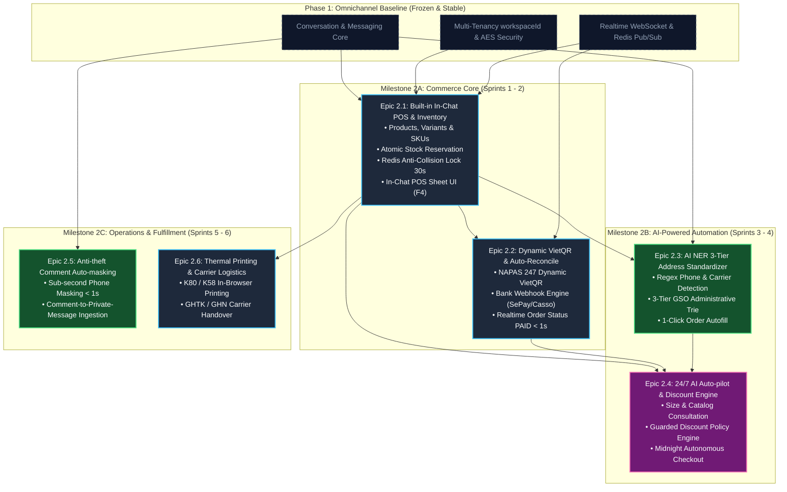

# Phase 2 Master Backlog: D2C Conversational Commerce & AI Auto-pilot POS

## 1. Strategic Vision & Executive Summary

Trong **Phase 1: Omnichannel Platform Core**, Sales Copilot Platform đã hoàn tất và đóng băng vững chắc hạ tầng hội thoại đa kênh (Facebook, Zalo, Telegram, Webchat), quản lý danh tính khách hàng 3NF, phân phối WebSocket thời gian thực và tự động phân công Round-Robin.

**Phase 2: D2C Conversational Commerce & AI Auto-pilot POS** tập trung 100% vào nghiệp vụ **Bán lẻ & Thương mại mạng xã hội (Social Selling)** theo triết lý **"Cuộc trò chuyện chính là Điểm bán hàng" (The Chat IS the Point of Sale)**:
1. **In-Chat POS & Zero-Context Switching**: Nhân viên chốt đơn ngay trong khung chat bằng phím tắt `F4`, tra cứu biến thể SKU khả dụng dưới 50ms, không bao giờ phải chuyển tab sang phần mềm ngoài.
2. **Dynamic VietQR & Triệt tiêu Bill giả**: Tự động sinh mã VietQR theo đơn hàng và gạch nợ tự động qua Webhook ngân hàng trong `< 1s`.
3. **AI NER Bóc tách Địa chỉ 3 cấp 1-Click**: Tự động nhận diện Tên, SĐT, nhà mạng và chuẩn hóa Tỉnh - Huyện - Xã từ tin nhắn văn bản không cấu trúc, giảm tỷ lệ bom hàng từ 25% xuống <8%.
4. **Autonomous AI Auto-pilot 24/7 & Discount Policy Engine**: Tự động tư vấn size, chốt đơn ban đêm (Midnight Checkout lúc 02:00 sáng) và đàm phán giảm giá/freeship có kiểm soát theo hạn mức an toàn của chủ shop.
5. **Chống cướp khách thời gian thực**: Tự động ẩn bình luận chứa SĐT `< 1s` trên bài viết Fanpage và tự động gửi tin nhắn riêng (Private Message) kéo khách vào hộp thư.

> ℹ️ *Ghi chú Lưu trữ*: Toàn bộ mã nguồn và tài liệu của mô hình B2B CRM trước đây đã được lưu trữ nguyên vẹn tại branch git: `archive/phase-2-b2b-leads`.

---

## 2. Phase 2 Epic Portfolio & Summary Table

Phase 2 bao gồm **6 Epics cốt lõi cho D2C Social Commerce**:

| Epic ID | Tên Epic (Epic Title) | Phạm vi kỹ thuật & Trách nhiệm (Scope & Responsibility) | Trọng tâm nghiệp vụ | Độ phức tạp | Target Milestone |
| :--- | :--- | :--- | :--- | :---: | :---: |
| **Epic 2.1** | **Built-in Inventory & In-Chat POS Drawer** | Quản lý sản phẩm, SKU biến thể (Màu/Size), tồn kho khả dụng (`Available = Physical - Reserved`), phím tắt `F4`, Redis Anti-Collision Lock 30s | Bán hàng tốc độ cao, ngăn chặn bán âm kho và chống nhân viên lên trùng đơn | 🔴 **High** | **Milestone 2A** (Foundation) |
| **Epic 2.2** | **Dynamic VietQR & Instant Bank Reconciliation** | Sinh mã Dynamic VietQR (NAPAS 247) có logo & memo `DH{code}`, Webhook Casso/SePay xử lý idempotency, tự chuyển đơn sang `PAID` <1s | Triệt tiêu 100% rủi ro bill chuyển khoản giả, tự động hóa dòng tiền | 🔴 **High** | **Milestone 2A** (Foundation) |
| **Epic 2.3** | **AI NER 3-Tier Address Extraction** | AI trích xuất SĐT, tên người nhận, badge nhà mạng và chuẩn hóa địa chỉ 3 cấp Quốc gia kết hợp Trie cache, điền đơn trong 1 cú click | Giảm thời gian nhập đơn từ 90s xuống 5s, giảm tỷ lệ hoàn hàng | 🟡 **Medium** | **Milestone 2B** (Automation) |
| **Epic 2.4** | **Autonomous AI Auto-pilot & Discount Engine** | LLM đọc bảng size, tồn kho để tư vấn; đàm phán mặc cả theo chính sách `DiscountPolicyEngine`; chốt đơn nửa đêm 24/7 | Chốt đơn tự động khi nhân viên ngủ, tăng doanh thu ban đêm | 🔴 **High** | **Milestone 2B** (Intelligence) |
| **Epic 2.5** | **Anti-theft Comment Auto-masking & Private Reply** | Lắng nghe webhook bình luận Facebook/TikTok, Regex bóc tách SĐT, ẩn bình luận `< 1s`, trigger tin nhắn riêng Private Message vào inbox | Bảo vệ 100% data khách hàng khỏi đối thủ quét cướp khách | 🟡 **Medium** | **Milestone 2C** (Growth) |
| **Epic 2.6** | **Browser Thermal Printing & Logistics Carriers** | In phiếu gửi nhiệt K80/K58 trực tiếp qua trình duyệt với CSS `@media print`; tích hợp API đơn vị vận chuyển (GHTK, GHN, Viettel Post) | Tự động hóa khâu đóng gói kho hàng và bàn giao đơn vị vận chuyển | 🟡 **Medium** | **Milestone 2C** (Fulfillment) |

---

## 3. End-to-End Execution Dependency Graph (DAG)

---

## 4. Phân kỳ Triển khai & Kế hoạch Milestones (Rollout Strategy)

### 🚩 Milestone 2A: Commerce Core (Sprints 1 - 2)
- **Trọng tâm**: Hoàn tất module POS trong khung chat và thanh toán VietQR tự động.
- **Nghiệm thu**:
  - Nhân viên chat bấm phím tắt `F4` mở ngay form lên đơn, tìm kiếm SKU `< 50ms`.
  - Khi mở form, kích hoạt Redis Sliding Lock 30s hiển thị "Nhân viên A đang soạn đơn", ngăn nhân viên B thao tác đè.
  - Tạo đơn nháp tự động render thẻ Dynamic VietQR; khi giả lập webhook ngân hàng bắn về, đơn tự động nhảy sang `PAID` và phát âm thanh thông báo qua WebSocket.

### 🚩 Milestone 2B: AI Automation & Midnight Checkout (Sprints 3 - 4)
- **Trọng tâm**: Tự động hóa bóc tách địa chỉ và kích hoạt AI Auto-pilot bán hàng ban đêm.
- **Nghiệm thu**:
  - Khách gửi địa chỉ viết tắt bất kỳ trong chat ➔ Nút "Áp dụng vào đơn" hiển thị với Tỉnh - Huyện - Xã chuẩn hóa.
  - Chế độ Auto-pilot tự động trò chuyện, gợi ý size, áp dụng mã giảm giá theo đúng hạn mức `DiscountPolicyEngine` và tự chốt đơn thành công lúc 02:00 sáng.

### 🚩 Milestone 2C: Anti-theft & Fulfillment (Sprints 5 - 6)
- **Trọng tâm**: Bảo vệ khách hàng trên bình luận và in phiếu gửi vận chuyển.
- **Nghiệm thu**:
  - Khách bình luận SĐT trên Fanpage ➔ Bình luận tự động ẩn trong `< 1s` và shop tự động gửi tin nhắn riêng cho khách.
  - Bấm in đơn hàng xuất phiếu in nhiệt chuẩn K80 (80mm) có mã vạch sẵn sàng dán gói hàng.

---

## 5. Tài liệu Đặc tả Tham chiếu
- **PRD Toàn diện**: [`docs/product/in-chat-pos-prd.md`](../product/in-chat-pos-prd.md)
- **RFC Kiến trúc Kỹ thuật**: [`docs/architecture/in-chat-pos-technical-rfc.md`](../architecture/in-chat-pos-technical-rfc.md)
- **Product Vision & Định vị**: [`docs/product/vision.md`](../product/vision.md)
- **Product Scope**: [`docs/product/scope.md`](../product/scope.md)
