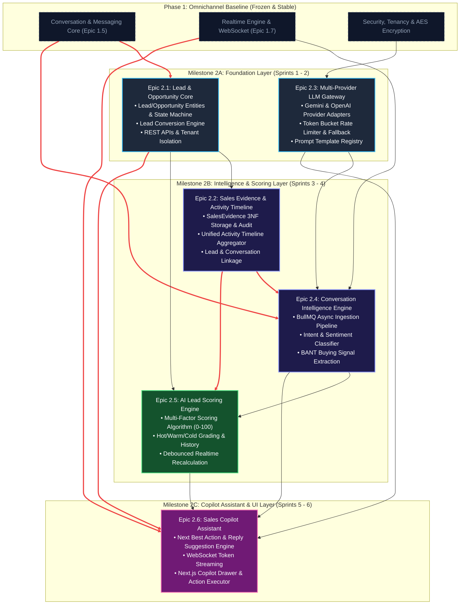

# Phase 2 Master Backlog: Sales Intelligence & AI Copilot

## 1. Strategic Vision & Executive Summary

Trong **Phase 1: Conversation Platform Core**, Sales Copilot Platform đã xây dựng thành công nền tảng giao tiếp đa kênh (Omnichannel Messaging Core), quản lý danh tính hợp nhất (`Contact`, `ChannelIdentity`), phiên hội thoại (`Conversation`, `Message`), định tuyến thông minh (Auto-assignment, Inbox/Team), tự động hóa quy trình (Automation Rules DSL) và phân phối sự kiện thời gian thực qua WebSocket Gateway.

**Phase 2: Sales Intelligence & AI Copilot** nâng cấp hệ thống từ một trung tâm hội thoại thuần túy (Omnichannel Inbox) thành một **hệ điều hành bán hàng thông minh (Intelligent Sales Operating System)**. Mục tiêu chiến lược của Phase 2 là:
1. **Chuyển hóa dữ liệu hội thoại tự nhiên thành tài sản bán hàng có cấu trúc**: Tự động phát hiện và quản lý vòng đời Khách hàng tiềm năng (`Lead`) và Cơ hội kinh doanh (`Opportunity`).
2. **Khai phá tín hiệu mua hàng theo thời gian thực (Real-time Conversation Intelligence)**: Lắng nghe không đồng bộ (Asynchronous Event Processing qua BullMQ) để trích xuất Ý định (`Intent`), Sắc thái cảm xúc (`Sentiment`) và Bằng chứng bán hàng (`SalesEvidence` theo khung BANT: Budget, Authority, Need, Timeline).
3. **Chấm điểm Lead minh bạch & giải trình được (Explainable Lead Scoring)**: Tính toán điểm số tiềm năng (0 - 100) kết hợp giữa hồ sơ khách hàng, tần suất tương tác và các tín hiệu mua hàng thực tế với lịch sử biến động minh bạch.
4. **Trợ lý Bán hàng Thời gian thực (Sales Copilot Assistant)**: Đồng hành cùng tư vấn viên (Sales Rep) trong từng phiên chat bằng cách gợi ý câu trả lời tối ưu (Next Best Reply), đề xuất hành động tiếp theo (Next Best Actions) và hỗ trợ xử lý từ chối (Objection Handling) với trải nghiệm streaming tốc độ cao.

---

## 2. Phase 2 Epic Portfolio & Summary Table

Phase 2 được phân rã thành **6 Epics cốt lõi**, bao gồm tổng cộng **28 User Stories** và **44 Technical Tasks**:

| Epic ID | Tên Epic (Epic Title) | Phạm vi kỹ thuật & Trách nhiệm (Scope & Responsibility) | User Stories | Tasks | Độ phức tạp (Complexity) | Target Milestone |
| :--- | :--- | :--- | :---: | :---: | :---: | :---: |
| **Epic 2.1** | **Lead & Opportunity Management Core** | Quản lý vòng đời Lead/Opportunity, State Machine, chuyển đổi (Conversion), liên kết đa kênh, REST APIs & Events | 5 Stories | 8 Tasks | 🔴 **High** | **Milestone 2A** (Foundation) |
| **Epic 2.2** | **Sales Evidence & Activity Timeline** | Trích xuất tín hiệu BANT, lưu trữ Sales Evidence có bằng chứng văn bản, dòng thời gian hoạt động bán hàng hợp nhất | 4 Stories | 7 Tasks | 🟡 **Medium** | **Milestone 2B** (Intelligence) |
| **Epic 2.3** | **Multi-Provider LLM Gateway & Prompt Registry** | Cổng giao tiếp LLM trừu tượng (Gemini / OpenAI), circuit breaker, rate limit, quota budget, Prompt Template management | 5 Stories | 7 Tasks | 🔴 **High** | **Milestone 2A** (Foundation) |
| **Epic 2.4** | **Conversation Intelligence Engine** | Xử lý tin nhắn bất đồng bộ qua BullMQ, phân tích Intent, Sentiment, trích xuất Buying Signals tự động emit Sales Evidence | 5 Stories | 8 Tasks | 🔴 **High** | **Milestone 2B** (Intelligence) |
| **Epic 2.5** | **AI-Driven Lead Scoring Engine** | Thuật toán chấm điểm Lead đa chiều (0-100, Hot/Warm/Cold), trọng số giải trình được (Explainability), event-driven debounce | 4 Stories | 7 Tasks | 🟡 **Medium** | **Milestone 2B** (Intelligence) |
| **Epic 2.6** | **Sales Copilot Assistant & Realtime UI** | Engine đề xuất Next Best Actions & Reply Drafts, WebSocket streaming, Copilot Drawer trên Next.js Dashboard, Action executor | 5 Stories | 7 Tasks | 🔴 **High** | **Milestone 2C** (Copilot & UI) |
| **TỔNG** | **6 Epics** | **Toàn diện nền tảng Sales Intelligence & Copilot** | **28 Stories** | **44 Tasks** | | **Sprints 1 - 6** |

---

## 3. End-to-End Execution Dependency Graph (DAG)

Quy trình phát triển tuân thủ nghiêm ngặt mô hình Đồ thị có hướng không chu trình (Directed Acyclic Graph - DAG). Các thành phần hạ tầng (Data Core, LLM Gateway) được triển khai song song trước, tạo tiền đề vững chắc cho tầng Intelligence, Scoring và cuối cùng là tầng Trải nghiệm người dùng (Copilot Assistant & UI):

### Critical Path Analysis
- **Critical Path**: `Phase 1 Core` ➔ `Epic 2.3 (LLM Gateway)` ➔ `Epic 2.4 (Conversation Intelligence)` ➔ `Epic 2.5 (Lead Scoring)` ➔ `Epic 2.6 (Sales Copilot Assistant)`.
- **Parallel Track**: `Epic 2.1 (Lead/Opportunity Core)` và `Epic 2.3 (LLM Gateway)` có thể phát triển hoàn toàn độc lập trong Sprint 1 và Sprint 2.
- **Merge Point**: `Epic 2.4` và `Epic 2.5` tích hợp dữ liệu từ cả Data Foundation (`Epic 2.1`, `Epic 2.2`) và AI Gateway (`Epic 2.3`).

---

## 4. Phân kỳ Triển khai & Chiến lược Milestones (Rollout Strategy)

### 🚩 Milestone 2A: Foundation Layer (Sprints 1 - 2)
- **Mục tiêu**: Thiết lập cấu trúc dữ liệu bán hàng chuẩn và cổng kết nối LLM an toàn, tin cậy.
- **Phạm vi hoàn thành**:
  - `Epic 2.1`: Hoàn tất Prisma models `Lead`, `Opportunity`; hoàn thiện state machines và CRUD REST API endpoints; hoàn thiện cơ chế Lead Conversion; kiểm tra 100% tenant isolation (`workspaceId`).
  - `Epic 2.3`: Hoàn tất `LlmGatewayModule`; hiện thực `GeminiAdapter` và `OpenAIAdapter` với cơ chế chuyển đổi dự phòng (failover); triển khai `PromptTemplateService` với quản lý phiên bản và mã hóa API keys an toàn.
- **Tiêu chí nghiệm thu Milestone 2A**:
  - Tất cả endpoints của Lead/Opportunity vượt qua bài kiểm tra phân quyền và cô lập tenant.
  - LLM Gateway thực hiện thành công các lệnh prompt test có kiểm soát token rate-limit và tự động chuyển đổi sang OpenAI khi Gemini gặp lỗi `429 Too Many Requests`.

---

### 🚩 Milestone 2B: Intelligence & Scoring Layer (Sprints 3 - 4)
- **Mục tiêu**: Kích hoạt khả năng thấu cảm hội thoại tự động và chấm điểm tiềm năng khách hàng theo thời gian thực mà không làm nghẽn tiến trình chat.
- **Phạm vi hoàn thành**:
  - `Epic 2.2`: Hiện thực hóa bảng lưu vết bằng chứng `SalesEvidence` và endpoint tổng hợp dòng thời gian `Activity Timeline`.
  - `Epic 2.4`: Tích hợp BullMQ worker lắng nghe `message.created`; chạy pipeline phân loại Intent/Sentiment và trích xuất BANT signals; tự động tạo bản ghi `SalesEvidence` và phát tín hiệu `sales_evidence.detected`.
  - `Epic 2.5`: Xây dựng thuật toán tính điểm kết hợp Fit Score + Velocity Score + Signal Score; lưu lịch sử `LeadScoreHistory`; kích hoạt tính năng tự động chấm điểm lại qua cơ chế debounce 30 giây trên Redis.
- **Tiêu chí nghiệm thu Milestone 2B**:
  - Khi một tin nhắn khách hàng chứa thông tin ngân sách hoặc nhu cầu gửi đến, trong vòng 3-5 giây hệ thống tự động ghi nhận `SalesEvidence` chính xác với trích đoạn câu thoại.
  - Điểm Lead tự động cập nhật và phát thông báo qua WebSocket đến Agent phụ trách.

---

### 🚩 Milestone 2C: Copilot Assistant & UI Experience (Sprints 5 - 6)
- **Mục tiêu**: Đưa trí tuệ nhân tạo vào tay nhân viên kinh doanh ngay trên giao diện bảng điều khiển Next.js.
- **Phạm vi hoàn thành**:
  - `Epic 2.6`: Xây dựng `CopilotEngineService` tổng hợp ngữ cảnh phiên chat, hồ sơ Lead và điểm số để sinh ra 3 loại gợi ý: câu trả lời tối ưu (Next Best Reply), hành động khuyến nghị (Next Best Action), và chiến thuật vượt qua phản đối (Objection Handling).
  - Tích hợp giao thức WebSocket streaming token hiển thị phản hồi mượt mà; hoàn thiện thành phần `CopilotDrawer` trên giao diện web Next.js tái sử dụng 100% primitive Shadcn UI.
  - Cung cấp nút hành động một chạm (One-Click Actions: Áp dụng câu trả lời vào Chat Composer, Tạo Opportunity, Lên lịch demo).
- **Tiêu chí nghiệm thu Milestone 2C**:
  - Nhân viên bán hàng nhìn thấy gợi ý hiển thị tức thì khi khách hàng phản hồi; click chọn gợi ý sẽ điền trực tiếp vào khung soạn thảo hoặc thực thi hành động tương ứng.

---

## 5. Definition of Ready (DoR) & Definition of Done (DoD)

### 📋 Definition of Ready (DoR) cho từng User Story
Một User Story chỉ được đưa vào Sprint Backlog khi đáp ứng đầy đủ các tiêu chuẩn sau:
1. **Mô tả người dùng chuẩn hóa**: Có cấu trúc rõ ràng `As a <Role>, I want <Feature>, so that <Benefit>`.
2. **Kịch bản nghiệm thu Gherkin**: Có tối thiểu 3 kịch bản Gherkin (`Scenario: Given ... When ... Then ...`) bao gồm luồng thành công (Happy path), trường hợp biên/lỗi (Edge cases/Error states) và ràng buộc cô lập dữ liệu đa người thuê (`workspaceId`).
3. **Đặc tả kỹ thuật & Hợp đồng**: Đã định danh các Prisma Model, REST Endpoints, WebSocket Events và Zod Schemas liên quan trong `docs/architecture/` và `docs/api/`.
4. **Phân tích phụ thuộc**: Xác định rõ ràng các task tiền đề (Prerequisites) và không có nút thắt kỹ thuật chưa được giải quyết.
5. **Ước lượng độ phức tạp**: Đã được đội ngũ kỹ thuật ước tính Story Points và kích thước task không vượt quá 3 ngày làm việc.

---

### ✅ Definition of Done (DoD) cho toàn bộ Phase 2 Epics
Một Epic hoặc Task chỉ được đánh dấu hoàn thành (Done) khi thỏa mãn:
1. **Tuân thủ Kiến trúc & Triết lý AGENTS.md**:
   - Tuân thủ nguyên tắc KISS và YAGNI; không tạo interface thừa cho các service đơn hình (`No single-implementation interfaces`).
   - Không lạm dụng chuỗi DTO mapping nhiều tầng; sử dụng Zod schema và trả về model trực tiếp.
   - Code được đóng gói trực tiếp và đồng vị trí (Co-location) trong feature module của NestJS (`apps/server/src/<feature>/`).
2. **Bảo mật & Cô lập Đa người thuê (Multi-Tenancy Isolation)**:
   - 100% các câu lệnh truy vấn Prisma (`findFirst`, `findMany`, `updateMany`, `deleteMany`) đều có mệnh đề `where: { workspaceId, ... }`. Tuyệt đối không dùng `findUnique({ where: { id } })` mà thiếu `workspaceId`.
   - Tất cả khóa API nhà cung cấp LLM đều được mã hóa bằng thuật toán `AES-256-GCM` trước khi lưu vào cơ sở dữ liệu và giải mã an toàn trong bộ nhớ runtime.
3. **Kiểm thử tự động & Chất lượng mã nguồn**:
   - Unit tests đạt độ bao phủ tối thiểu 80% logic nghiệp vụ của Service.
   - Integration tests kiểm tra thành công luồng xử lý liên module (Ví dụ: Inbound Message ➔ Queue ➔ Signal Detection ➔ Lead Score Update ➔ WebSocket Event).
   - Kiểm tra toàn diện monorepo:
     * Linter: `pnpm nx run-many -t lint` không có lỗi.
     * Typecheck: `pnpm nx run-many -t typecheck` không có lỗi biên dịch TypeScript.
     * Tests: `pnpm nx run-many -t test` pass 100%.
     * Build: `pnpm nx run-many -t build` build thành công cho cả `apps/server`, `apps/web` và `packages/shared-contracts`.
4. **Tài liệu & Hợp đồng**:
   - API Contracts trong `docs/api/` được cập nhật đồng bộ.
   - Không tồn tại mã giả mạo (no mock/dummy facade logic), không bypass kiểm tra bảo mật.

---

## 6. Directory Index của các tài liệu Epic chi tiết

Chi tiết từng Epic được bóc tách chuyên sâu trong các tài liệu sau:
- [📄 Epic 2.1: Lead & Opportunity Management Core](./epic-2.1.md)
- [📄 Epic 2.2: Sales Evidence & Activity Timeline](./epic-2.2.md)
- [📄 Epic 2.3: Multi-Provider LLM Gateway & Prompt Management](./epic-2.3.md)
- [📄 Epic 2.4: Conversation Intelligence - Intent, Sentiment & Buying Signals](./epic-2.4.md)
- [📄 Epic 2.5: AI-Driven Lead Scoring Engine](./epic-2.5.md)
- [📄 Epic 2.6: Sales Copilot Assistant - Next Best Actions & Live Suggestions](./epic-2.6.md)
