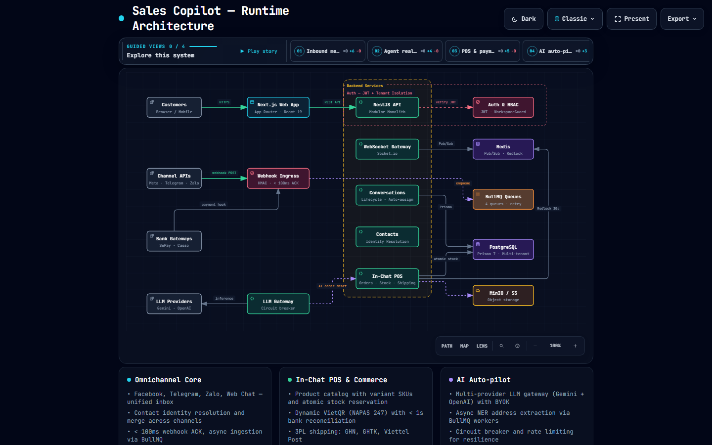

# Sales Copilot — System Diagrams

Thư mục này chứa toàn bộ các sơ đồ trực quan (Interactive Architecture, Workflows, Sequences, Lifecycles) của hệ thống **Sales Copilot**, được biên dịch và quản lý thông qua **[Archify](https://github.com/tt-a1i/archify)**.

---

## 📁 Cấu trúc thư mục

```text
docs/diagrams/
├── README.md                 # Mục lục và hướng dẫn
├── architecture/             # Sơ đồ kiến trúc tổng thể hệ thống (System & Runtime)
│   ├── sales-copilot.architecture.json   # [Source] File cấu hình JSON IR
│   ├── sales-copilot.architecture.html   # [Viewer] File HTML tự chứa mở trên trình duyệt
│   └── assets/                           # Ảnh preview (Dark & Light)
├── workflows/                # Quy trình nghiệp vụ (In-Chat POS, Anti-theft masking...)
├── sequences/                # Luồng API & Webhook (VietQR Instant Reconciliation, Ingestion...)
└── lifecycles/               # Vòng đời trạng thái (Order status, Conversation lifecycle...)
```

---

## 🗺️ Danh mục sơ đồ

### 1. Kiến trúc hệ thống (System Runtime Architecture)
- **Tập tin tương tác:** [`architecture/sales-copilot.architecture.html`](./architecture/sales-copilot.architecture.html)
- **Tập tin cấu hình:** [`architecture/sales-copilot.architecture.json`](./architecture/sales-copilot.architecture.json)
- **Mô tả:** Bao quát 17 module NestJS, kênh giao tiếp (Meta, Telegram, Zalo), tầng Ingress Webhook (< 100ms), 4 hàng đợi BullMQ, Redis (Pub/Sub & Redlock), MinIO, PostgreSQL và AI Gateway.
- **Preview:**
  
  

---

## 🚀 Hướng dẫn mở & Xem sơ đồ

Tất cả các file `.html` đều là **tập tin tự chứa (self-contained)**, không cần cài web server hay dependencies:
1. Kéo thả file `.html` vào bất kỳ trình duyệt web nào (Chrome, Edge, Firefox, Safari).
2. Hoặc mở nhanh từ PowerShell:
   ```powershell
   Start-Process "docs/diagrams/architecture/sales-copilot.architecture.html"
   ```

### Các tính năng tương tác trong Viewer:
- **Guided Views (01 - 04):** Bấm các nút ở thanh trên cùng hoặc nhấn `▶ Play story` để xem từng phân luồng kiến trúc.
- **Focus & Tracing:** Nhấp chuột vào bất kỳ component nào để sáng luồng liên kết (upstream / downstream).
- **Phím tắt:** Nhấn phím `?` để mở bảng trợ giúp phím tắt.
- **Export:** Xuất ảnh PNG, SVG vector, hoặc Share Card (1200x630) chất lượng cao.

---

## 🛠️ Biên dịch & Chỉnh sửa bằng Archify CLI

Khi cập nhật file JSON cấu hình, sử dụng công cụ Archify để kiểm tra và render lại:

```bash
# Đường dẫn Archify CLI
$ARCHIFY = "C:\Users\manhk\.agents\skills\archify\bin\archify.mjs"

# 1. Preview trực tiếp khi chỉnh sửa (live reload trên 127.0.0.1)
node $ARCHIFY preview architecture "docs/diagrams/architecture/sales-copilot.architecture.json" "docs/diagrams/architecture/preview.html"

# 2. Kiểm tra lỗi (Validate showcase quality)
node $ARCHIFY validate architecture "docs/diagrams/architecture/sales-copilot.architecture.json" --quality showcase --json

# 3. Xuất file HTML chính thức
node $ARCHIFY deliver architecture "docs/diagrams/architecture/sales-copilot.architecture.json" "docs/diagrams/architecture/sales-copilot.architecture.html" --quality showcase --json
```
