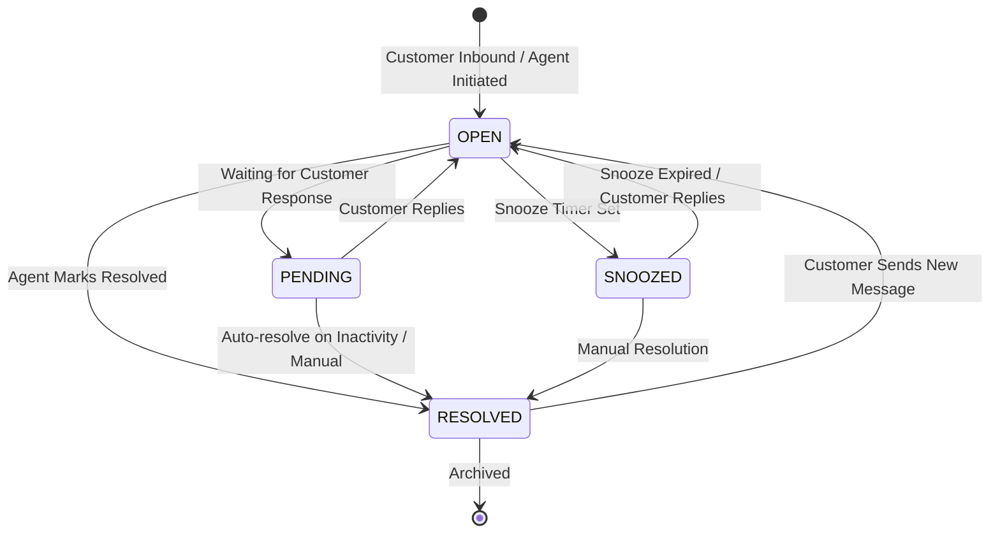

# Business Rules, Invariants & State Machines

## 1. Multi-Tenancy Invariants

- **BR-1.1 (Mandatory Tenant Scoping)**: Mọi bản ghi dữ liệu hoạt động (`Contact`, `Inbox`, `Channel`, `Conversation`, `Message`, `Label`, `AutomationRule`, `WebhookSubscription`, `Product`, `Order`) bắt buộc phải có `workspaceId`.
- **BR-1.2 (Membership Verification)**: Người dùng thực hiện thao tác trên tài nguyên phải là `WorkspaceMember` của Workspace đó và có vai trò (`WorkspaceRole`) hợp lệ.
- **BR-1.3 (Inbox Scoping)**: `InboxMember` chỉ được thêm những `User` đã là thành viên hợp lệ trong cùng `Workspace`.

---

## 2. Inbound Ingestion & Channel Invariants

- **BR-2.1 (1:1 Inbox-Channel Mapping)**: Mỗi `Inbox` chỉ liên kết với tối đa 1 `Channel` (`1:1 mapping`).
- **BR-2.2 (Idempotency)**: Webhook đến phải được kiểm tra `ChannelEvent` theo cặp `(channelId, externalEventId)`. Nếu đã tồn tại thì bỏ qua để tránh trùng lặp tin nhắn.
- **BR-2.3 (Credentials Security)**: Toàn bộ access tokens / app secrets của Channel phải được mã hóa AES-256-GCM trước khi lưu xuống database và giải mã khi gọi outbound API.

---

## 3. Contact & Identity Resolution Invariants

- **BR-3.1 (Resolution Order)**: Khi tin nhắn từ một kênh đổ về:
  1. Tìm `ChannelIdentity` theo `(channelId, externalContactId)`.
  2. Nếu chưa có, tạo mới `Contact` và tạo `ChannelIdentity` liên kết.
  3. Nếu đã có, lấy `Contact` tương ứng.
- **BR-3.2 (Tenant Uniqueness)**: `Contact.identifier` phải là duy nhất trong cùng một `Workspace` (`@@unique([workspaceId, identifier])`).
- **BR-3.3 (Contact Merge)**: Khi gộp 2 Contact (Merge), toàn bộ `ChannelIdentity` và `Conversation` của Contact phụ sẽ được chuyển sang Contact chính trong một database transaction, sau đó xóa Contact phụ và ghi `AuditLog`.

---

## 4. Conversation Lifecycle State Machine

A Conversation transitions through 4 primary lifecycle states:



### State Semantics:
- **`OPEN`**: Active conversation requiring agent action or currently in discussion.
- **`PENDING`**: Agent has replied and is waiting for customer response.
- **`SNOOZED`**: Temporarily hidden from active queue until `snoozedUntil` timestamp or until customer replies.
- **`RESOLVED`**: Conversation completed. If the customer messages again, the conversation is automatically reopened to `OPEN`.

### State Transition Triggers:
- `OPEN` ──► `PENDING`: Khi Agent gửi tin nhắn phản hồi ra ngoài.
- `OPEN` ──► `SNOOZED`: Khi Agent đặt lịch tạm ẩn (`snoozedUntil`).
- `OPEN` / `PENDING` / `SNOOZED` ──► `RESOLVED`: Khi Agent hoặc Automation Rule đánh dấu hoàn thành.
- `RESOLVED` / `SNOOZED` ──► `OPEN`: Tự động kích hoạt khi khách hàng gửi tin nhắn mới.

### Unread Messages Counter:
- Khi có tin nhắn mới từ `CONTACT`, tăng `unreadMessagesCount` lên 1.
- Khi Agent mở xem hoặc gửi tin nhắn phản hồi, reset `unreadMessagesCount = 0`.

---

## 5. Priority & Assignment Engine

### Conversation Priority Hierarchy
- **`URGENT`**: Critical SLA breach risk or high-priority VIP customer.
- **`HIGH`**: Time-sensitive inquiry or VIP customer.
- **`MEDIUM`**: Default priority.
- **`LOW`**: General inquiry or low-priority queue.

### Auto-Assignment Strategy (Round-Robin with Presence)
Khi hội thoại mới đến hoặc chưa có người phụ trách trong Inbox có `isAutoAssignmentEnabled = true`:

```text
[New Inbound Conversation]
          │
          ▼
Is Inbox.isAutoAssignmentEnabled == true?
          │
     ┌────┴────┐
    YES        NO ──► Leave unassigned (assigneeId = null)
     │
     ▼
Get Inbox Members (InboxMember where user.isActive = true)
     │
     ▼
Filter by Online/Available Presence (Redis Presence Set: `presence:workspace_{wsId}`)
     │
     ▼
Find Agent with Least Active OPEN Conversations (Round-Robin pointer)
     │
     ▼
Assign: Conversation.assigneeId = selectedUserId
     │
     ▼
Publish Domain Event: `ConversationAssigned` ──► Broadcast via WebSocket
```

### Manual & Team Assignment:
- **Direct Assignment**: Agent/Admin có thể tự nhận hoặc gán cho Agent khác trong cùng Inbox.
- **Team Routing**: Hội thoại có thể được gán cho một `Team` (`Conversation.teamId`), cho phép các thành viên trong Team nhận xử lý.

---

## 6. Message Polymorphism & Delivery State Machine

### Message Invariants:
- `senderType = CONTACT`: `senderId` bắt buộc trỏ về `Contact.id`.
- `senderType = USER`: `senderId` bắt buộc trỏ về `User.id`.
- `senderType = SYSTEM`: `senderId` là `null` (tin nhắn hệ thống / activity log).
- `Message.content` có thể `null` nếu tin nhắn chứa `Attachment` (ảnh, tệp, voice note).

### Message Delivery State Machine:

```text
[Agent clicks Send]
       │
       ▼
    PENDING   (Message written to DB, queued for channel adapter)
       │
       ├── Channel API success ──► SENT
       │                              │
       │                              ├── Provider delivery receipt ──► DELIVERED
       │                              │                                    │
       │                              │                                    ├── Customer read receipt ──► READ
       │                              │
       └── Channel API error   ──► FAILED (Eligible for retry)
```
