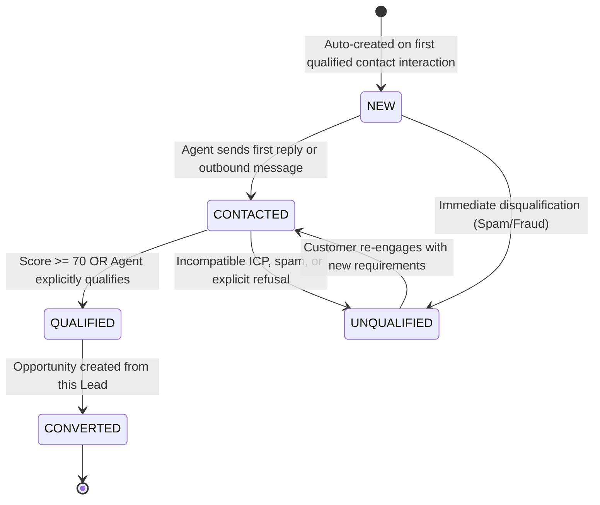
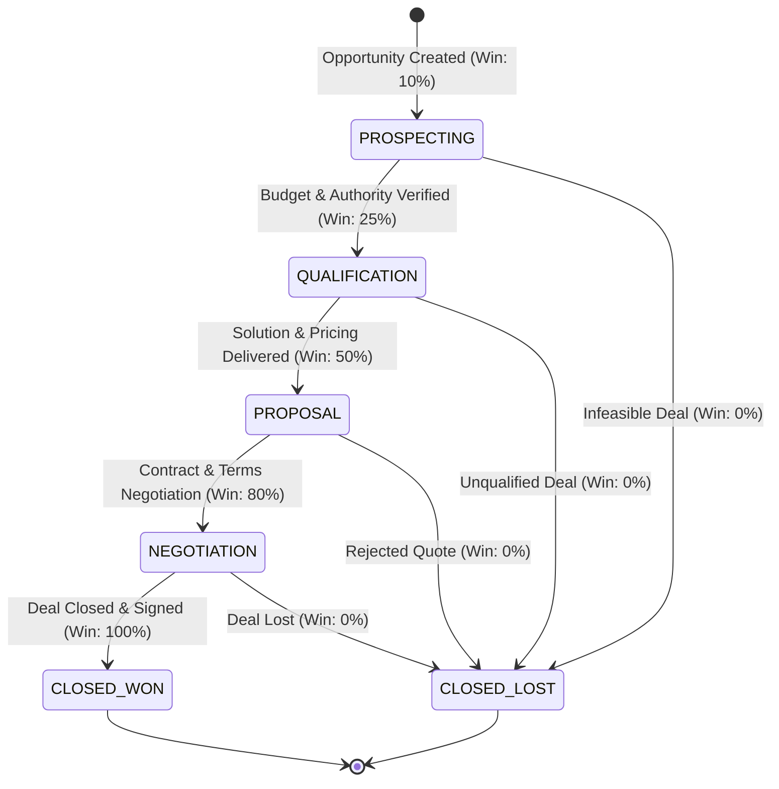

# Phase 2 Domain Model: Sales Intelligence & AI Copilot

## 1. Ubiquitous Language & Core Terminology

The following glossary defines the shared business vocabulary for Phase 2, binding domain experts, product owners, and engineers.

| Domain Term (English) | Thuật ngữ (Tiếng Việt) | Business Definition (Định nghĩa nghiệp vụ) |
| :--- | :--- | :--- |
| **Lead** | Đầu mối tiềm năng | Thực thể khách hàng tiềm năng gắn với một `Contact`, đại diện cho cơ hội kinh doanh đang được nuôi dưỡng và đánh giá sự phù hợp. |
| **Opportunity** | Cơ hội bán hàng | Giao dịch thương mại tiềm năng có giá trị tiền tệ dự kiến (`amount`), giai đoạn bán hàng cụ thể và ngày dự kiến hoàn tất (`expectedCloseDate`). |
| **Sales Evidence** | Bằng chứng bán hàng | Đoạn trích dẫn hoặc sự kiện cụ thể từ cuộc hội thoại thể hiện tín hiệu mua hàng, rào cản, hoặc cam kết của khách hàng. |
| **Buying Signal** | Tín hiệu mua hàng | Dấu hiệu tích cực cho thấy khách hàng sẵn sàng tiến tới mua hàng (ví dụ: hỏi bảng giá, hỏi thời gian giao hàng, xác nhận có ngân sách). |
| **Risk Signal** | Tín hiệu rủi ro | Dấu hiệu cảnh báo nguy cơ hủy giao dịch hoặc khách hàng bất mãn (ví dụ: phàn nàn giá quá đắt, so sánh bất lợi, cảnh báo rời bỏ). |
| **Objection** | Lời từ chối / Rào cản | Lý do khách hàng chưa sẵn sàng mua hàng (ví dụ: thiếu tính năng cốt lõi, ngân sách chưa được duyệt, đang dùng giải pháp đối thủ). |
| **Competitor Mention** | Nhắc tới đối thủ | Việc khách hàng đề cập trực tiếp hoặc gián tiếp đến sản phẩm, thương hiệu hoặc chính sách của nhà cung cấp cạnh tranh. |
| **Commitment** | Cam kết giao dịch | Tuyên bố hoặc thỏa thuận từ một trong hai phía về bước hành động tiếp theo (ví dụ: hẹn họp demo, hứa gửi hợp đồng, xác nhận thời gian gọi lại). |
| **Lead Score** | Điểm tiềm năng | Điểm số tổng hợp chuẩn hóa (0 – 100) phản ánh mức độ quan tâm, độ phù hợp hồ sơ và khả năng chuyển đổi thành giao dịch của Lead. |
| **Score Breakdown** | Phân rã điểm số | Chi tiết các cấu phần điểm tạo nên Lead Score, bao gồm Điểm phù hợp hồ sơ (Fit), Điểm hành vi (Behavior), và Điểm giảm trừ (Decay). |
| **Score Decay** | Hao mòn điểm số | Quy tắc tự động giảm điểm Lead theo thời gian khi khách hàng không có tương tác mới sau ngưỡng thời gian nhất định (48 giờ). |
| **Copilot Suggestion** | Gợi ý Copilot | Đề xuất thời gian thực do AI tạo ra trên giao diện tư vấn viên nhằm hỗ trợ chốt đơn nhanh hơn. |
| **Next Best Action (NBA)** | Hành động kế tiếp tối ưu | Gợi ý chiến thuật cụ thể tiếp theo tư vấn viên nên thực hiện (ví dụ: gửi tài liệu giải pháp, hẹn lịch demo, áp dụng chính sách giảm giá). |
| **Draft Reply** | Bản nháp phản hồi | Đoạn tin nhắn trả lời hoàn chỉnh được AI soạn sẵn theo ngữ cảnh hội thoại để tư vấn viên có thể gửi ngay hoặc chỉnh sửa bằng 1-click. |
| **Prompt Template** | Mẫu câu lệnh AI | Bản mẫu chỉ thị điều khiển mô hình ngôn ngữ lớn (LLM) được tham số hóa động và quản lý phiên bản theo Workspace. |
| **Win Probability** | Xác suất chốt đơn | Tỷ lệ phần trăm dự báo khả năng chốt đơn thành công của Cơ hội bán hàng (`probability`), phụ thuộc vào giai đoạn hiện tại (`OpportunityStage`). |

---

## 2. Aggregate Structure & Entity Relationships

The Phase 2 domain model seamlessly extends the Phase 1 modular monolith without altering Phase 1 core tables.

```text
┌────────────────────────────────────────────────────────────────────────────────────────┐
│                              PHASE 1 CORE CONTEXT (Read-Only)                          │
│                                                                                        │
│          [Workspace] 1 ──────────── N [Contact] 1 ──────────── N [Conversation]        │
│               │ 1                         │ 1                         │ 1              │
└───────────────┼───────────────────────────┼───────────────────────────┼────────────────┘
                │                           │                           │
                │                           │ 1                         │ 1
                │                           ▼ 1 (Active)                │
┌───────────────┼───────────────────────────────────────────────────────┼────────────────┐
│               │              SALES INTELLIGENCE AGGREGATES            │                │
│               │                                                       │                │
│               │                    ┌──────────────┐                   │                │
│               │       ┌───────────►│     Lead     │◄──────────────────┼────────────┐   │
│               │       │            └──────┬───────┘                   │            │   │
│               │       │                   │ 1                         │            │   │
│               │       │                   ├─────────────────┐ 1       │            │   │
│               │       │                   ▼ N               ▼ 1       ▼ N          │   │
│               │  [Opportunity]    [SalesEvidence]      [LeadScore] [Copilot       │   │
│               │       │ 1                                   │ 1     Suggestion]    │   │
│               │       ▼ N                                   ▼ N                    │   │
│               │ [OpportunityStageHistory]           [LeadScoreHistory]             │   │
│               │                                                                    │   │
│               │                    ┌──────────────────────┐                        │   │
│               └───────────────────►│    PromptTemplate    │                        │   │
│                                    └──────────────────────┘                        │   │
└────────────────────────────────────────────────────────────────────────────────────┘
```

---

## 3. Aggregate Roots & Entities Specification

### 3.1. `Lead` Aggregate Root

`Lead` represents a prospect identified through omnichannel conversations. It encapsulates the qualification lifecycle and acts as the anchor for sales intelligence data.

#### Attributes & Relations
- `id`: Unique identifier (UUIDv4).
- `workspaceId`: Tenant isolation boundary (Foreign Key to `Workspace.id`).
- `contactId`: Reference to Phase 1 `Contact.id` (1:1 with active lead per contact).
- `assignedUserId`: Assigned sales representative (`User.id`), nullable.
- `status`: Lifecycle enumeration (`LeadStatus`).
- `score`: Cached integer score (0 – 100) reflecting `LeadScore.currentScore`.
- `scoreTier`: Cached tier (`HOT`, `WARM`, `COLD`).
- `title`: Lead name or objective (e.g. "Nguyen Van A - Enterprise Plan Inquiry").
- `sourceChannel`: Origin channel type (`WEB_CHAT`, `FACEBOOK_MESSENGER`, `ZALO`, `TELEGRAM`, `EMAIL`).
- `customAttributes`: Structured key-value pairs (e.g. `estimatedBudget`, `industry`, `teamSize`).
- `disqualifiedReason`: Rationale if status moves to `UNQUALIFIED`.
- `convertedAt`: Timestamp when converted to an `Opportunity`.
- `lastActivityAt`: Timestamp of last two-way message interaction.
- `createdAt`, `updatedAt`: Audit timestamps.

#### Lifecycle States (`LeadStatus`)



#### State Transition Invariants
1. **`NEW` $\rightarrow$ `CONTACTED`**: Automatically triggered when a human agent or copilot-approved reply is sent to the contact.
2. **`CONTACTED` $\rightarrow$ `QUALIFIED`**: Requires meeting minimum qualification criteria (e.g. verified contact info and confirmed buying intent/score $\ge 70$).
3. **`QUALIFIED` $\rightarrow$ `CONVERTED`**: Can only occur simultaneously with the creation or linkage of an `Opportunity`. Upon conversion, the Lead becomes closed-converted.
4. **`*` $\rightarrow$ `UNQUALIFIED`**: Requires specifying `disqualifiedReason` from a predefined enum (`NO_BUDGET`, `NO_NEED`, `COMPETITOR_CHOSEN`, `SPAM`, `CANNOT_CONTACT`).

---

### 3.2. `Opportunity` Aggregate Root

`Opportunity` represents a committed sales pipeline deal with an assigned monetary value, expected closing date, and staged sales progression.

#### Attributes & Relations
- `id`: Unique identifier (UUIDv4).
- `workspaceId`: Tenant isolation boundary (Foreign Key to `Workspace.id`).
- `leadId`: Optional origin `Lead.id`.
- `contactId`: Primary customer contact (`Contact.id`).
- `assignedUserId`: Sales representative responsible for closing the deal (`User.id`).
- `title`: Deal title (e.g. "ACME Corp - 50 User Annual License").
- `amount`: Monetary amount in minor units or decimal (e.g. cents or integer VND / Decimal).
- `currency`: ISO-4217 Currency Code (`VND`, `USD`, `EUR`). Default: `USD`.
- `stage`: Current pipeline stage (`OpportunityStage`: `PROSPECTING`, `QUALIFICATION`, `PROPOSAL`, `NEGOTIATION`, `CLOSED_WON`, `CLOSED_LOST`).
- `probability`: Integer percentage (0 – 100) estimated for the stage.
- `expectedCloseDate`: Anticipated signing date.
- `actualCloseDate`: Timestamp when reached `CLOSED_WON` or `CLOSED_LOST`.
- `lostReason`: Rationale if deal was marked `CLOSED_LOST` (`PRICE_TOO_HIGH`, `MISSING_FEATURES`, `CHOSE_COMPETITOR`, `PROJECT_CANCELLED`, `GHOSTED`).
- `metadata`: Custom extension properties (contractType, paymentTerms, competitors).
- `createdAt`, `updatedAt`: Audit timestamps.

#### Lifecycle Stages (`OpportunityStage`) & Win Probabilities



#### Transition Invariants & Rules
1. **Monetary Non-Negativity**: `amount` must be $\ge 0$.
2. **Terminal Stage Immutability**: Once an opportunity transitions to `CLOSED_WON` or `CLOSED_LOST`, it cannot be edited or transitioned to another stage without `ADMIN` role privilege.
3. **Loss Accountability**: Moving to `CLOSED_LOST` requires a non-empty `lostReason`.
4. **Historical Audit**: Every stage change inserts a record into `OpportunityStageHistory`.

---

### 3.3. `SalesEvidence` Entity

`SalesEvidence` is an immutable evidence record extracted from omnichannel conversations by the AI Conversation Intelligence worker.

#### Attributes
- `id`: Unique identifier (UUIDv4).
- `workspaceId`: Tenant isolation boundary (`Workspace.id`).
- `leadId`: Associated `Lead.id`.
- `conversationId`: Source `Conversation.id`.
- `messageId`: Source `Message.id`.
- `signalType`: Primary classification (`SignalType`).
- `signalCategory`: Fine-grained categorization string.
- `confidence`: AI model confidence score (Float between 0.00 and 1.00).
- `rawExcerpt`: Verbatim message excerpt from the customer.
- `reasoning`: AI rationale explaining why this excerpt constitutes evidence.
- `metadata`: JSON payload containing entities (e.g. detected competitor names, budget figures, dates).
- `createdAt`: Timestamp when detected and persisted.

#### Signal Types & Categories

```text
┌──────────────────────┬─────────────────────────────┬────────────────────────────────────────────────────────┐
│ Signal Type          │ Common Categories           │ Concrete Conversation Excerpt Example                  │
├──────────────────────┼─────────────────────────────┼────────────────────────────────────────────────────────┤
│ BUYING_SIGNAL        │ BUDGET_CONFIRMED            │ "Ngân sách bên mình cho dự án này khoảng 100 triệu."    │
│                      │ TIMELINE_URGENT             │ "Bên mình cần triển khai gấp ngay trong tháng này."    │
│                      │ DECISION_MAKER_INVOLVED     │ "Tôi là Giám đốc vận hành, tôi sẽ quyết định chọn tool"│
├──────────────────────┼─────────────────────────────┼────────────────────────────────────────────────────────┤
│ RISK_SIGNAL          │ SLOW_RESPONSE_COMPLAINT     │ "Sao bên bạn phản hồi chậm thế, mình chờ cả buổi rồi." │
│                      │ DISSATISFACTION             │ "Tính năng này bên bạn hoạt động chập chờn quá."       │
│                      │ GHOSTING_RISK               │ "Để mình xem lại rồi khi nào cần sẽ tự liên hệ sau."   │
├──────────────────────┼─────────────────────────────┼────────────────────────────────────────────────────────┤
│ OBJECTION            │ PRICE_RESISTANCE            │ "Bên bạn báo giá cao hơn nhiều so với kỳ vọng của cty."│
│                      │ MISSING_INTEGRATION         │ "Bên mình bắt buộc phải có tích hợp ERP SAP."          │
│                      │ CONTRACT_RESTRICTION        │ "Công ty mình không được phép thanh toán theo năm."    │
├──────────────────────┼─────────────────────────────┼────────────────────────────────────────────────────────┤
│ COMPETITOR_MENTION   │ DIRECT_COMPARISON           │ "Bên Haravan đang có gói khuyến mãi tặng thêm 3 tháng." │
│                      │ INCUMBENT_REPLACEMENT       │ "Hiện tại bên mình đang dùng Lark Suite nhưng muốn đổi."│
├──────────────────────┼─────────────────────────────┼────────────────────────────────────────────────────────┤
│ COMMITMENT           │ DEMO_AGREED                 │ "Ok, sáng thứ Năm lúc 9h gửi link Google Meet cho mình"│
│                      │ CONTRACT_REVIEW_PROMISED    │ "Mình đã chuyển hợp đồng cho phòng Pháp chế xem rồi."  │
└──────────────────────┴─────────────────────────────┴────────────────────────────────────────────────────────┘
```

#### Immutability Invariant
`SalesEvidence` is strictly **append-only**. Once written, it cannot be updated or deleted. If a human agent flags a false-positive, an audit flag `isDisputed: true` is stored inside `metadata`, but the record remains in history for telemetry training.

---

### 3.4. `LeadScore` & `LeadScoreHistory` Entities

#### A. `LeadScore` Entity
Stores the current calculated readiness state of a `Lead`:
- `id`: Unique identifier (UUIDv4).
- `workspaceId`: Tenant isolation boundary.
- `leadId`: Unique 1:1 relation to `Lead.id`.
- `currentScore`: Integer from 0 to 100.
- `scoreTier`: Categorization (`HOT`, `WARM`, `COLD`).
- `demographicScore`: Profile fit points ($0 - 30$).
- `behavioralScore`: Engagement and signal points ($0 - 70$).
- `decayPenalty`: Accumulated inactivity penalty ($0 - 50$).
- `lastCalculatedAt`: Timestamp of last calculation run.
- `lastDecayedAt`: Timestamp of last applied decay step.
- `createdAt`, `updatedAt`.

#### B. `LeadScoreHistory` Entity
Provides an audit log of score fluctuations:
- `id`: Unique identifier (UUIDv4).
- `workspaceId`: Tenant boundary.
- `leadId`: Associated lead.
- `scoreBefore`: Score prior to change.
- `scoreAfter`: Score after recalculation.
- `delta`: Numerical change ($+15$, $-10$).
- `changeReason`: Trigger description (`NEW_BUYING_SIGNAL`, `OBJECTION_RAISED`, `SCHEDULED_DECAY`, `MANUAL_OVERRIDE`).
- `breakdownSnapshot`: Complete JSON snapshot of `ScoreBreakdown`.
- `createdAt`: Timestamp.

---

### 3.5. `CopilotSuggestion` Aggregate Root

Represents an in-line AI assistance proposition rendered to the sales agent.

#### Attributes & Relations
- `id`: Unique identifier (UUIDv4).
- `workspaceId`: Tenant isolation boundary.
- `conversationId`: Active `Conversation.id`.
- `leadId`: Target `Lead.id`, nullable.
- `messageId`: Triggering inbound `Message.id`.
- `type`: Suggestion classification (`SuggestionType`).
- `title`: Short display headline (e.g. "Gợi ý xử lý phản đối về giá").
- `content`: Generated body text (e.g. markdown draft reply or action instructions).
- `confidence`: Confidence score (0.00 – 1.00).
- `suggestedActions`: JSON array of quick-action buttons (e.g. `[{ action: 'INSERT_REPLY' }, { action: 'BOOK_MEETING' }]`).
- `status`: Suggestion lifecycle status (`SuggestionStatus`).
- `dismissedReason`: Agent's reason if dismissed (`IRRELEVANT`, `INCORRECT_FACTS`, `NOT_HELPFUL`).
- `expiresAt`: TTL expiration timestamp (default: 10 minutes from creation).
- `createdAt`, `updatedAt`.

#### Types & Statuses
- **`SuggestionType`**:
  - `NEXT_BEST_ACTION`: Recommends workflow step (schedule call, request supervisor approval, attach document).
  - `DRAFT_REPLY`: Full conversational message ready to send.
  - `OBJECTION_HANDLING`: Specific battlecard counter-argument addressing a raised objection.
- **`SuggestionStatus`**:
  - `PENDING`: Displayed on agent UI, awaiting decision.
  - `ACCEPTED`: Agent clicked Insert, Send, or Apply.
  - `DISMISSED`: Agent explicitly dismissed suggestion.
  - `EXPIRED`: Auto-invalidated because customer sent a new message or TTL lapsed.

---

### 3.6. `PromptTemplate` Entity

Represents manageable, version-controlled prompt definitions used by the LLM Gateway:
- `id`: Unique identifier (UUIDv4).
- `workspaceId`: Nullable for system-wide defaults, or specific `workspaceId` for custom enterprise overrides.
- `code`: Unique code key (e.g. `CONV_INTELLIGENCE_V1`, `COPILOT_DRAFT_REPLY_V2`, `LEAD_SCORING_EVAL_V1`).
- `name`: Human-readable name.
- `version`: Integer version counter ($1, 2, 3$).
- `systemPrompt`: System instruction defining AI persona, tone, and guardrails.
- `userPromptTemplate`: Parameterized template string with Handlebars placeholders (`{{customerName}}`, `{{recentMessages}}`).
- `inputVariables`: JSON schema describing expected template variables.
- `preferredModel`: Target LLM string (`gemini-2.0-flash`, `gpt-4o-mini`).
- `temperature`: Float setting (default: 0.2 for analytical extraction, 0.7 for draft replies).
- `isActive`: Boolean toggle.

---

## 4. Value Objects

Phase 2 relies on immutable, self-validating Value Objects to enforce business invariants:

### 4.1. `ScoreBreakdown`
Represents the structural breakdown of a lead's score:
```typescript
export class ScoreBreakdown {
  constructor(
    public readonly fitScore: number,          // 0 to 30
    public readonly behaviorScore: number,     // 0 to 70
    public readonly decayPenalty: number,      // >= 0
  ) {
    if (fitScore < 0 || fitScore > 30) throw new Error('Fit score must be in [0, 30]');
    if (behaviorScore < 0 || behaviorScore > 70) throw new Error('Behavior score must be in [0, 70]');
    if (decayPenalty < 0) throw new Error('Decay penalty must be >= 0');
  }

  get totalScore(): number {
    return Math.min(100, Math.max(0, this.fitScore + this.behaviorScore - this.decayPenalty));
  }

  get tier(): 'HOT' | 'WARM' | 'COLD' {
    const s = this.totalScore;
    if (s >= 80) return 'HOT';
    if (s >= 50) return 'WARM';
    return 'COLD';
  }
}
```

### 4.2. `CurrencyAmount`
Ensures exact financial amounts without floating-point rounding errors:
```typescript
export class CurrencyAmount {
  constructor(
    public readonly amount: bigint, // Amount in minor units (e.g. cents, VND dong)
    public readonly currency: string = 'VND', // ISO-4217
  ) {
    if (amount < 0n) throw new Error('Deal value amount cannot be negative');
    if (!/^[A-Z]{3}$/.test(currency)) throw new Error('Currency must be a 3-letter ISO code');
  }

  add(other: CurrencyAmount): CurrencyAmount {
    if (this.currency !== other.currency) throw new Error('Currency mismatch');
    return new CurrencyAmount(this.amount + other.amount, this.currency);
  }
}
```

### 4.3. `SignalConfidence`
Encapsulates statistical validity of AI inferences:
```typescript
export class SignalConfidence {
  public static readonly MIN_ACCEPTABLE_CONFIDENCE = 0.65;

  constructor(public readonly value: number) {
    if (value < 0.0 || value > 1.0 || Number.isNaN(value)) {
      throw new Error('Confidence must be a valid float between 0.0 and 1.0');
    }
  }

  isReliable(): boolean {
    return this.value >= SignalConfidence.MIN_ACCEPTABLE_CONFIDENCE;
  }
}
```

### 4.4. `StageTransition`
Encapsulates an atomic progression between stages:
```typescript
export class StageTransition {
  constructor(
    public readonly fromStage: string,
    public readonly toStage: string,
    public readonly transitionedByUserId: string,
    public readonly reason?: string,
    public readonly timestamp: Date = new Date(),
  ) {}
}
```

---

## 5. Domain Events Specification

Domain events decouple the system, allowing asynchronous handlers to react to business mutations without tight coupling.

```text
┌────────────────────────────────────────────────────────────────────────────────────────┐
│                                   PHASE 2 DOMAIN EVENTS                                │
├───────────────────────────────┬──────────────────────────┬─────────────────────────────┤
│ Event Name                    │ Emitting Aggregate       │ Triggering Condition        │
├───────────────────────────────┼──────────────────────────┼─────────────────────────────┤
│ lead.created                  │ Lead                     │ Initial prospect identified │
│ lead.stage_changed            │ Lead                     │ Lifecycle progression       │
│ lead.qualified                │ Lead                     │ Reached QUALIFIED state     │
│ lead.converted                │ Lead                     │ Converted to Opportunity    │
│ lead.score_updated            │ LeadScore                │ Recalculated total score    │
│ lead.score_decayed            │ LeadScore                │ Inactivity decay applied    │
│ sales_evidence.detected       │ SalesEvidence            │ Signal extracted from chat  │
│ opportunity.created           │ Opportunity              │ Deal entered into pipeline  │
│ opportunity.stage_changed     │ Opportunity              │ Deal moved between stages   │
│ opportunity.won               │ Opportunity              │ Deal marked CLOSED_WON      │
│ opportunity.lost              │ Opportunity              │ Deal marked CLOSED_LOST     │
│ copilot.suggestion_generated  │ CopilotSuggestion        │ AI advice ready for agent   │
│ copilot.suggestion_acted      │ CopilotSuggestion        │ Agent accepted or dismissed │
└───────────────────────────────┴──────────────────────────┴─────────────────────────────┘
```

### 5.1. Standard Event Payloads

#### `sales_evidence.detected`
```json
{
  "eventId": "evt_7f8a9b0c-1234-4567-89ab-cdef01234567",
  "eventType": "sales_evidence.detected",
  "workspaceId": "ws_99887766-aaaa-bbbb-cccc-ddddeeeeffff",
  "timestamp": "2026-09-06T07:15:00.000Z",
  "payload": {
    "evidenceId": "evi_11223344-5566-7788-99aa-bbccddeeff00",
    "leadId": "lead_a1b2c3d4-e5f6-7890-abcd-ef1234567890",
    "conversationId": "conv_98765432-10fe-dcba-9876-543210fedcba",
    "messageId": "msg_00112233-4455-6677-8899-aabbccddeeff",
    "signalType": "BUYING_SIGNAL",
    "signalCategory": "BUDGET_CONFIRMED",
    "confidence": 0.94,
    "rawExcerpt": "Bên mình đã chốt được ngân sách 150 triệu cho dự án này rồi nhé.",
    "reasoning": "Khách hàng khẳng định rõ ràng ngân sách 150 triệu đã được phê duyệt."
  }
}
```

#### `lead.score_updated`
```json
{
  "eventId": "evt_3a4b5c6d-7e8f-9012-3456-789abcdef012",
  "eventType": "lead.score_updated",
  "workspaceId": "ws_99887766-aaaa-bbbb-cccc-ddddeeeeffff",
  "timestamp": "2026-09-06T07:15:02.000Z",
  "payload": {
    "leadId": "lead_a1b2c3d4-e5f6-7890-abcd-ef1234567890",
    "scoreBefore": 68,
    "scoreAfter": 88,
    "delta": 20,
    "currentTier": "HOT",
    "previousTier": "WARM",
    "breakdown": {
      "fitScore": 25,
      "behaviorScore": 63,
      "decayPenalty": 0
    },
    "triggerReason": "NEW_BUYING_SIGNAL"
  }
}
```

#### `copilot.suggestion_generated`
```json
{
  "eventId": "evt_8899aabb-ccdd-eeff-0011-223344556677",
  "eventType": "copilot.suggestion_generated",
  "workspaceId": "ws_99887766-aaaa-bbbb-cccc-ddddeeeeffff",
  "timestamp": "2026-09-06T07:15:03.500Z",
  "payload": {
    "suggestionId": "sug_fedcba98-7654-3210-fedc-ba9876543210",
    "conversationId": "conv_98765432-10fe-dcba-9876-543210fedcba",
    "type": "NEXT_BEST_ACTION",
    "title": "Chốt lịch Demo giải pháp 1-1",
    "confidence": 0.91,
    "draftReply": "Tuyệt vời ạ! Em gửi anh link đăng ký lịch demo chi tiết tính năng quản lý ngân sách trong tuần này nhé: https://cal.salescopilot.io/demo",
    "suggestedActions": [
      { "action": "INSERT_REPLY", "label": "Chèn bản nháp (Tab)" },
      { "action": "SCHEDULE_MEETING", "label": "Mở lịch hẹn" }
    ],
    "expiresAt": "2026-09-06T07:25:03.500Z"
  }
}
```

---

## 6. Business Rules & Domain Invariants

### 6.1. Tenant Scoping & Isolation Invariants
- **BR-2.1.1**: Mọi truy vấn đọc, thêm, sửa, xóa trên các thực thể Phase 2 (`Lead`, `Opportunity`, `SalesEvidence`, `LeadScore`, `CopilotSuggestion`, `PromptTemplate`) **BẮT BUỘC** phải có điều kiện lọc theo `workspaceId`.
- **BR-2.1.2**: Không chấp nhận các câu lệnh update/delete chỉ dựa vào `id` đơn lẻ mà không kèm `workspaceId`.
- **BR-2.1.3**: Không cho phép tạo liên kết giữa `Lead` hoặc `Opportunity` với `Contact` thuộc hai Workspace khác nhau.

### 6.2. Lead & Opportunity Invariants
- **BR-2.2.1 (Active Lead Uniqueness)**: Mỗi `Contact` chỉ có thể có tối đa **MỘT (1)** Lead ở trạng thái hoạt động (`NEW`, `CONTACTED`, hoặc `QUALIFIED`) trong cùng một `Workspace`. Nếu khách hàng mở cuộc trò chuyện mới khi đã có active Lead, cuộc trò chuyện đó sẽ liên kết vào Lead đang hoạt động.
- **BR-2.2.2 (Conversion Prerequisite)**: Một Lead chỉ có thể chuyển sang trạng thái `CONVERTED` khi thỏa mãn đồng thời:
  1. Trạng thái hiện tại là `QUALIFIED`.
  2. Tạo mới thành công ít nhất một `Opportunity` tương ứng hoặc chỉ định một `Opportunity` đang mở.
- **BR-2.2.3 (Opportunity Stage Flow)**: Giai đoạn của `Opportunity` tuân thủ máy trạng thái hữu hạn có hướng. Một khi đã đạt trạng thái kết thúc (`CLOSED_WON` hoặc `CLOSED_LOST`), không được phép thay đổi sang giai đoạn khác trừ khi có quyền giám sát `ADMIN`.
- **BR-2.2.4 (Mandatory Loss Reason)**: Khi chuyển `Opportunity` sang `CLOSED_LOST`, trường `lostReason` bắt buộc không được rỗng.

### 6.3. Evidence Extraction & Deduplication Invariants
- **BR-2.3.1 (Confidence Threshold Filter)**: Mọi tín hiệu do AI trích xuất có `confidence < 0.65` đều bị loại bỏ ngay lập tức và không được lưu vào bảng `sales_evidences`.
- **BR-2.3.2 (Time-Window Deduplication)**: Không lưu bản ghi `SalesEvidence` nếu trong vòng 15 phút gần nhất đã tồn tại một bản ghi cùng `leadId`, cùng `signalType` và cùng `signalCategory` để tránh tình trạng thổi phồng điểm số trong các cuộc trò chuyện dồn dập.
- **BR-2.3.3 (Ledger Immutability)**: Dữ liệu `SalesEvidence` là bất biến (append-only), không cho phép chỉnh sửa nội dung trích dẫn gốc.

### 6.4. Lead Scoring & Decay Invariants
- **BR-2.4.1 (Score Boundary Clamp)**: Tổng điểm Lead Score luôn được giới hạn trong khoảng đóng $[0, 100]$.
- **BR-2.4.2 (Hot Tier Escalation)**: Khi điểm số chuyển từ $< 80$ lên $\ge 80$, hệ thống tự động:
  1. Gán nhãn `HOT` cho Lead.
  2. Tự động nâng mức độ ưu tiên của hội thoại liên kết lên `URGENT` nếu hội thoại đang `OPEN`.
  3. Bắn thông báo âm thanh và pop-up thời gian thực tới tư vấn viên phụ trách.
- **BR-2.4.3 (Decay Trigger & Inactivity Window)**:
  - Hao mòn điểm số chỉ kích hoạt khi khoảng thời gian từ lần tương tác cuối cùng của khách hàng (`lastActivityAt`) vượt quá **48 giờ**.
  - Mỗi 24 giờ tiếp theo không có phản hồi, trừ $5$ điểm (tối đa trừ $50$ điểm).
  - Khi khách hàng gửi tin nhắn mới, toàn bộ điểm giảm trừ `decayPenalty` được reset về $0$.

### 6.5. Copilot Lifecycle Invariants
- **BR-2.5.1 (Single Active Suggestion per Conversation)**: Trong mỗi cuộc hội thoại, tại một thời điểm chỉ tồn tại tối đa **MỘT (1)** bản ghi `CopilotSuggestion` ở trạng thái `PENDING`.
- **BR-2.5.2 (Auto-Expiration on Inbound Message)**: Nếu khách hàng gửi tin nhắn mới khi một gợi ý Copilot đang ở trạng thái `PENDING`, gợi ý đó lập tức chuyển sang trạng thái `EXPIRED` để tránh tư vấn viên gửi nhầm bản nháp không còn phù hợp với diễn biến hội thoại.
- **BR-2.5.3 (TTL Invalidation)**: Sau 10 phút kể từ khi tạo (`expiresAt`), nếu tư vấn viên không thao tác, gợi ý tự động chuyển sang `EXPIRED`.

---

## 7. Integration Contract with Phase 1 Entities

| Phase 2 Entity | Foreign Key to Phase 1 | Cardinality | Deletion / Cascade Policy | Business Impact |
| :--- | :--- | :--- | :--- | :--- |
| **`Lead`** | `workspaceId` $\rightarrow$ `Workspace.id` | N:1 | `CASCADE` | Xóa Workspace sẽ xóa toàn bộ dữ liệu bán hàng liên quan. |
| **`Lead`** | `contactId` $\rightarrow$ `Contact.id` | N:1 | `RESTRICT` | Không cho phép xóa Contact nếu đang có Lead hoạt động. |
| **`Lead`** | `assignedUserId` $\rightarrow$ `User.id` | N:1 | `SET NULL` | Nếu nhân viên nghỉ việc, Lead được đưa về hàng đợi chưa phân công. |
| **`Opportunity`** | `workspaceId` $\rightarrow$ `Workspace.id` | N:1 | `CASCADE` | Scoped theo tenant. |
| **`Opportunity`** | `contactId` $\rightarrow$ `Contact.id` | N:1 | `RESTRICT` | Bảo vệ tính toàn vẹn của lịch sử giao dịch. |
| **`Opportunity`** | `assignedUserId` $\rightarrow$ `User.id` | N:1 | `SET NULL` | Thuộc quyền tiếp quản của trưởng nhóm. |
| **`SalesEvidence`**| `conversationId` $\rightarrow$ `Conversation.id` | N:1 | `CASCADE` | Bằng chứng gắn chặt với cuộc hội thoại phát sinh. |
| **`SalesEvidence`**| `messageId` $\rightarrow$ `Message.id` | N:1 | `CASCADE` | Xóa tin nhắn sẽ xóa bằng chứng trích xuất từ tin nhắn đó. |
| **`CopilotSuggestion`**| `conversationId` $\rightarrow$ `Conversation.id`| N:1 | `CASCADE` | Gợi ý tự động dọn dẹp khi đóng/xóa hội thoại. |
