# Tầm Nhìn Sản Phẩm & Triết Lý Thiết Kế (Product Vision & Strategy)

> **Tài liệu**: Định hướng chiến lược & Tầm nhìn sản phẩm\
> \*\***Dự án**: Sales Copilot Platform\
> \*\***Vị trí file**: `docs/product/01-vision.md`\
> \*\***Trạng thái**: Đã phê duyệt (Approved Baseline)

---

## 1. Bối Cảnh Thị Trường & Vấn Đề Cốt Lõi

### 1.1. Bối cảnh Thương mại Hội thoại (Social Commerce) tại Việt Nam

Tại Việt Nam và Đông Nam Á, hơn **65% đơn hàng bán lẻ trực tuyến** phát sinh qua các kênh mạng xã hội và tin nhắn (Facebook Messenger, Zalo OA, Instagram Direct, TikTok Shop, Web Live Chat).

Khác với mô hình thương mại điện tử phương Tây (nơi người mua tự dạo web, tự bỏ vào giỏ hàng và tự thanh toán), người tiêu dùng Việt Nam có hành vi mua sắm mang tính chất **đàm thoại cao (Conversational-First)**:

- Cần nhân viên tư vấn size, chất liệu, xem ảnh/video thực tế.
- Mặc cả, thương lượng giảm giá, xin freeship hoặc tặng quà.
- Cung cấp số điện thoại và địa chỉ giao hàng không theo cấu trúc trong câu chat tự nhiên.
- Ưu tiên thanh toán tức thì bằng ứng dụng ngân hàng di động qua **mã QR động (VietQR / NAPAS 247)** hoặc yêu cầu giao hàng thu tiền tận nơi (COD).

### 1.2. Vấn đề cốt lõi: Cuộc trò chuyện chính là Điểm bán hàng

Trong môi trường này: **"The Chat Conversation IS the Point of Sale"**.

Mỗi giây trễ nải khi phản hồi, mỗi thao tác chuyển đổi qua lại giữa màn hình chat và phần mềm POS/ERP bên ngoài đều làm giảm trực tiếp tỷ lệ chốt đơn và doanh thu:

1. **Độ trễ chuyển đổi màn hình (Context Switching Friction)**: Nhân viên phải nhảy giữa ứng dụng chat và phần mềm quản lý bán hàng (KiotViet, Sapo, Excel), mất 1.5 - 3 phút cho mỗi đơn hàng.
2. **Sai lệch địa chỉ & Bom hàng**: Khách nhập địa chỉ viết tắt, không dấu (*"15 ngõ 45 phố Vọng, ĐT, HBT, HN"*). Nhân viên gõ lại thủ công dẫn đến sai sót Phường/Xã, khiến tỷ lệ giao hàng thất bại hoặc hoàn hàng lên tới **15% - 25%**.
3. **Thanh toán thủ công & Rủi ro Bill giả**: Nhắn tin số tài khoản dạng văn bản khiến khách phải tự mở app ngân hàng, gõ STK, gõ số tiền và nội dung. Quy trình ma sát này làm rớt **20% - 30%** giao dịch thanh toán chuyển khoản, đồng thời cửa hàng đối mặt với nạn làm giả ảnh chụp màn hình chuyển khoản ("fake bill").
4. **Va chạm nhân viên (Agent Collision)**: Nhiều nhân viên cùng trực chung một trang hoặc một hộp thư, dẫn đến tình trạng 2 người cùng tư vấn một khách, tạo trùng đơn hoặc báo giá mâu thuẫn.

---

## 2. Tuyên Ngôn Giá Trị Cốt Lõi (Value Proposition)

> **Sales Copilot Platform** kế thừa toàn bộ công thái học chốt đơn siêu tốc của các nền tảng social commerce hàng đầu (hộp thư gộp đa kênh, tạo và quản lý đơn hàng, chuẩn hóa địa chỉ 3 cấp, kết nối vận chuyển), đồng thời tạo bước nhảy vọt với **Trí Tuệ Nhân Tạo (AI-Native)**:

\*&gt; *Tự động tư vấn size, bóc tách địa chỉ 1-click, đàm phán giảm giá có kiểm soát và thu tiền tức thì qua Dynamic VietQR hoạt động 24/7 ngay cả khi toàn bộ nhân viên đang ngủ.*

---

## 3. 5 Nguyên Tắc Thiết Kế Sản Phẩm (Product Principles)

1. 🎯 **The Chat IS the Point of Sale (Hội thoại chính là Điểm bán)**: Mọi thao tác nghiệp vụ cốt lõi (tra cứu biến thể tồn kho, tư vấn bảng size, bóc tách địa chỉ, áp mã giảm giá, lên đơn và gửi mã QR thu tiền) phải diễn ra ngay bên trong khung chat, không bắt nhân viên chuyển tab.

2. 🤖 **AI-Native, Thay thế Chatbot cứng nhắc**: Không dùng kịch bản cây từ khóa cứng nhắc (Rule-based Chatbot) vốn gây ức chế cho khách hàng. Hệ thống sử dụng mô hình ngôn ngữ lớn (LLM) hiểu ngữ cảnh tiếng Việt đời thường, teencode, văn phong bán hàng thân thiện và tự động hóa xử lý đơn hàng lúc 02:00 sáng (Midnight Checkout).

3. 🛡️ **Tự động hóa có kiểm soát (Guarded Autonomy)**: AI được trao quyền đàm phán giảm giá, tặng voucher hoặc hỗ trợ phí vận chuyển cho khách, nhưng **bắt buộc phải tuân thủ nghiêm ngặt hạn mức an toàn** do chủ doanh nghiệp thiết lập tại `DiscountPolicyEngine`. Tuyệt đối không cho phép AI ảo tưởng.

4. 🔒 **Bảo mật Đa người thuê & Tôn trọng Dữ liệu (Multi-Tenancy & Data Privacy)**: Mỗi doanh nghiệp là một `Workspace` độc lập, dữ liệu khách hàng, tin nhắn, doanh thu và đơn hàng được cách ly tuyệt đối bằng mã `workspaceId`. Hệ thống quản trị cấp nền tảng tuân thủ chính sách **Metadata-Only**, không đọc trộm nội dung tin nhắn riêng tư của khách hàng.

---

## 4. Sơ Đồ Luồng Hoạt Động Tổng Thể (End-to-End Flow)

Hệ thống phân định linh hoạt thông qua **Cơ chế Cấu hình AI Automation (Configurable AI Automation Strategy)** kết hợp cùng **Vệ sĩ bảo vệ bình luận độc lập**, cho phép từng doanh nghiệp tùy biến chế độ vận hành phù hợp nhất với quy mô nhân sự và ngân sách:

```mermaid
flowchart TD
    %% Tiếp nhận Inbound
    Client[Khách hàng tương tác trên Facebook / Zalo / Webchat] --> InboundType{Loại tương tác?}

    %% Phân hệ Vệ sĩ Bình luận (Anti-theft Comment Guard)
    InboundType -->|Bình luận công khai bài viết| CommentGuard[Vệ sĩ Ẩn Bình Luận: Quét SĐT < 1s]
    CommentGuard --> HasPhone{Chứa SĐT / Chốt mua?}
    HasPhone -->|Có| MaskPost[Ẩn ngay bình luận trên Facebook trong < 1s]
    MaskPost --> SendPrivate[Tự động gửi tin nhắn riêng Private Reply kéo vào Inbox]
    SendPrivate --> UnifiedInbox[Hộp thư hợp nhất Unified Inbox]
    HasPhone -->|Không| NormalShow[Giữ bình luận hiển thị công khai]

    %% Phân hệ Tin nhắn vào Hộp thư
    InboundType -->|Tin nhắn riêng Inbox| IngestionPipeline[Ingestion Pipeline: Phản hồi Webhook < 100ms]
    IngestionPipeline --> Deduplicate[Khử trùng ChannelEvent & Phân giải Contact 3NF]
    Deduplicate --> UnifiedInbox

    %% Động cơ Quyết định Điều phối AI Automation
    UnifiedInbox --> AIStrategy{Cấu hình AI Automation của Inbox / Shop?}

    %% NHÁNH 1: NHÂN VIÊN TRỰC TIẾP (HUMAN-DRIVEN POS)
    AIStrategy -->|Thủ công / Trong ca trực có nhân viên| HumanOps[Ca trực Nhân viên: Phân công Round-Robin]
    HumanOps --> AgentChat[Agent tư vấn trực tiếp: Dùng phím tắt / chèn Canned Responses]
    AgentChat --> OpenPOS[Agent mở In-Chat POS < 50ms]
    OpenPOS --> FastSearch[Tìm kiếm SKU < 20ms & Khóa chống va chạm Redis 30s]
    FastSearch --> ManualForm[Agent chọn biến thể, combobox địa chỉ 3 cấp & bấm Tạo đơn]

    %% NHÁNH 2: AI AUTO-PILOT (24/7 HOẶC NGOÀI GIỜ / QUÁ TẢI)
    AIStrategy -->|24/7 Tự động / Ngoài giờ / Quá tải tin nhắn| AIAutoPilot[Kích hoạt AI Auto-pilot]
    AIAutoPilot --> AIConsult[AI đọc catalog: Tư vấn size, màu & kiểm tra tồn kho khả dụng]
    AIConsult --> BargainCheck{Khách mặc cả / Xin freeship?}
    BargainCheck -->|Có| DiscountEngine[Kiểm tra DiscountPolicyEngine: Hạn mức tối đa cho phép]
    DiscountEngine --> ApplyDiscount[Áp dụng giảm giá an toàn hoặc từ chối khéo léo]
    BargainCheck -->|Không| AIAddressNER
    ApplyDiscount --> AIAddressNER[AI NER: Tự động trích xuất SĐT & Chuẩn hóa Địa chỉ 3 cấp]
    AIAddressNER --> AutoCreateOrder[AI tự gọi API nội bộ tạo Đơn Hàng DRAFT]

    %% ĐIỂM HỘI TỤ CHUNG: TẠO ĐƠN, KHÓA KHO & THU TIỀN
    ManualForm --> FinalOrder[Khởi tạo Đơn Hàng Hoàn Tất]
    AutoCreateOrder --> FinalOrder

    FinalOrder --> AtomicReserve[Khóa tồn kho nguyên tử: Tăng reservedQuantity trong DB Tx]
    AtomicReserve --> DynamicVietQR[Sinh Thẻ Dynamic VietQR NAPAS 247 đúng số tiền & mã DH...]
    DynamicVietQR --> SendQRCard[Gửi ảnh thẻ QR kèm nút sao chép 1-chạm vào khung chat]

    %% THANH TOÁN & ĐỐI SOÁT TỰ ĐỘNG
    SendQRCard --> CustomerPays[Khách mở App Ngân hàng quét mã chuyển tiền]
    CustomerPays --> BankWebhook[Webhook Ngân hàng SePay/Casso bắn về trong < 1s]
    BankWebhook --> AutoReconcile{Khớp mã đơn & Số tiền?}
    AutoReconcile -->|Khớp| MarkPAID[Tự động gạch nợ sang trạng thái PAID]
    MarkPAID --> RealtimeAlert[Socket.io phát tín hiệu order.paid: Đổi badge xanh & Toast]
    MarkPAID --> PushLogistics[Tự động đẩy thông tin sang ĐVVC GHTK/GHN lấy mã vận đơn]
```

### Chi tiết 4 Chế Độ Cấu Hình AI Automation (Configurable AI Modes):

Chủ doanh nghiệp có thể cấu hình linh hoạt chế độ tự động hóa ở cấp **Workspace** hoặc thiết lập riêng cho từng **Inbox** (kênh bán hàng):

1. ⚡ **Chế độ 1: Tự động Toàn thời gian 24/7 (24/7 Full Autonomous Auto-pilot)**:
   - **Bối cảnh phù hợp**: Các shop bán lẻ quy mô nhỏ (Solo Merchant), đội ngũ ít người, các trang vệ tinh hoặc gian hàng bán sản phẩm tiêu chuẩn (thời trang basic, đồ gia dụng).
   - **Cơ chế**: AI chạy xuyên suốt cả ngày lẫn đêm. Bất kể khi nào khách nhắn tin, AI tự động tiếp nhận, đọc catalog tư vấn size/màu, kiểm tra kho thực tế, đàm phán giảm giá theo hạn mức an toàn và tự chốt đơn, gửi mã VietQR. Chủ shop chỉ việc đóng gói đơn đã thanh toán.

2. 🌙 **Chế độ 2: Tự động Ngoài giờ & Khi Vắng mặt (Off-Hours & Offline Auto-pilot)**:
   - **Bối cảnh phù hợp**: Các shop có đội ngũ tư vấn viên chuyên nghiệp trực giờ hành chính (ví dụ 08:00 – 22:00).
   - **Cơ chế**:
     - *Trong giờ làm việc (khi có nhân viên Online)*: 100% cuộc hội thoại được phân công cho nhân viên xử lý trực tiếp bằng công thái học bàn phím cao tốc (POS, `/` canned responses, combobox địa chỉ GSO). **Zero chi phí token AI, triệt tiêu hoàn toàn độ trễ LLM**.
     - *Ngoài giờ làm việc (hoặc toàn bộ nhân viên Offline)*: AI Auto-pilot tự động thức giấc tiếp quản (Midnight Checkout), đảm bảo không bỏ lỡ bất kỳ khách hàng nào nhắn tin lúc nửa đêm hay rạng sáng.

3. 🛟 **Chế độ 3: Hỗ trợ Khi Quá Tải (Overflow / Fallback Auto-pilot)**:
   - **Bối cảnh phù hợp**: Khung giờ cao điểm (Flash Sale, Livestream, bài quảng cáo viral) khi số lượng khách nhắn tin vượt quá khả năng xử lý của đội trực chat.
   - **Cơ chế**: Nhân viên vẫn là ưu tiên xử lý hàng đầu. Nếu một tin nhắn của khách chờ quá thời gian ngưỡng $N$ phút (ví dụ: > 3 phút) mà chưa có nhân viên nào nhận hoặc trả lời, AI Auto-pilot sẽ tự động nhảy vào tiếp quản để phục vụ khách ngay tức khắc, không để khách rời sang đối thủ.

4. 🚫 **Chế độ 4: Tắt Tự Động Hóa (Manual Only / Off)**:
   - 100% quy trình tư vấn và chốt đơn do nhân viên thực hiện thủ công qua In-Chat POS. AI Auto-pilot bị vô hiệu hóa hoàn toàn.

---

### Cơ chế Độc lập: Vệ sĩ Ẩn Bình Luận (Anti-theft Comment Guard):
- Chạy độc lập 24/7 trên các bài viết và livestream của Fanpage / TikTok Shop (không phụ thuộc vào ca trực của nhân viên).
- Quét regex và NLP phát hiện số điện thoại trong bình luận công khai, **tự động ẩn trong `< 1s`** chống đối thủ quét cướp khách, đồng thời gửi tin nhắn riêng Private Message kéo khách vào Inbox an toàn.

---
