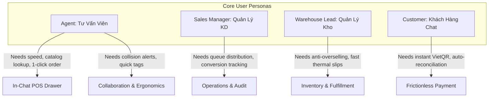
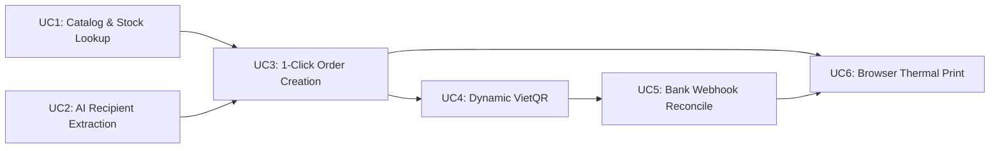
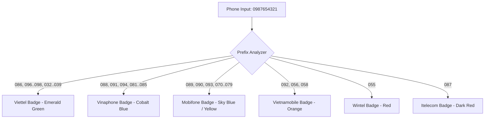
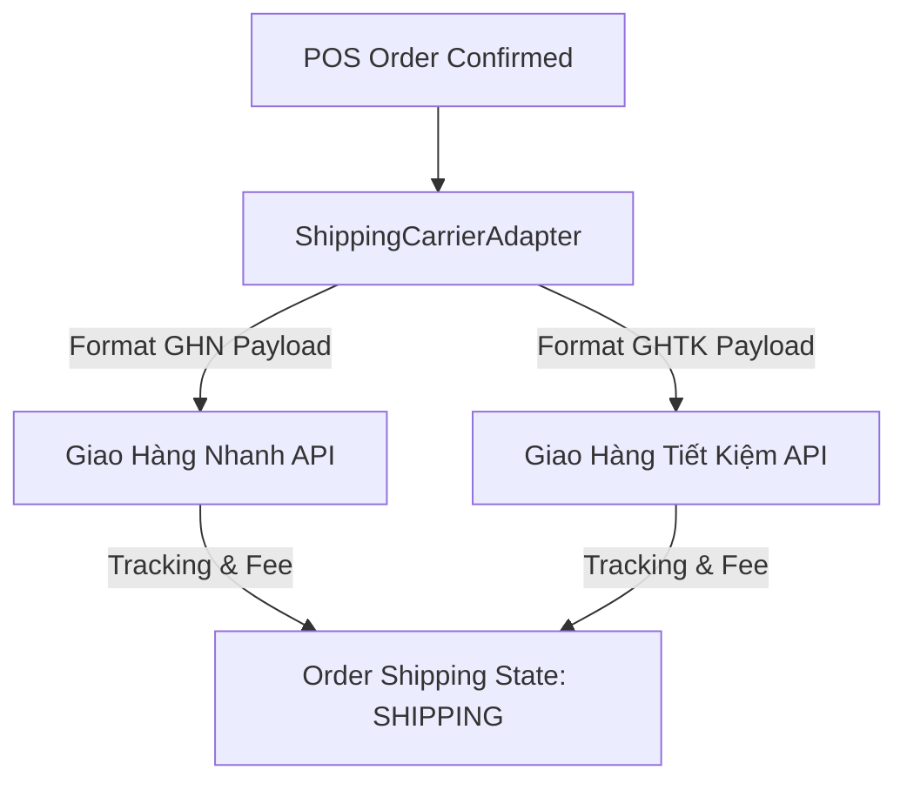
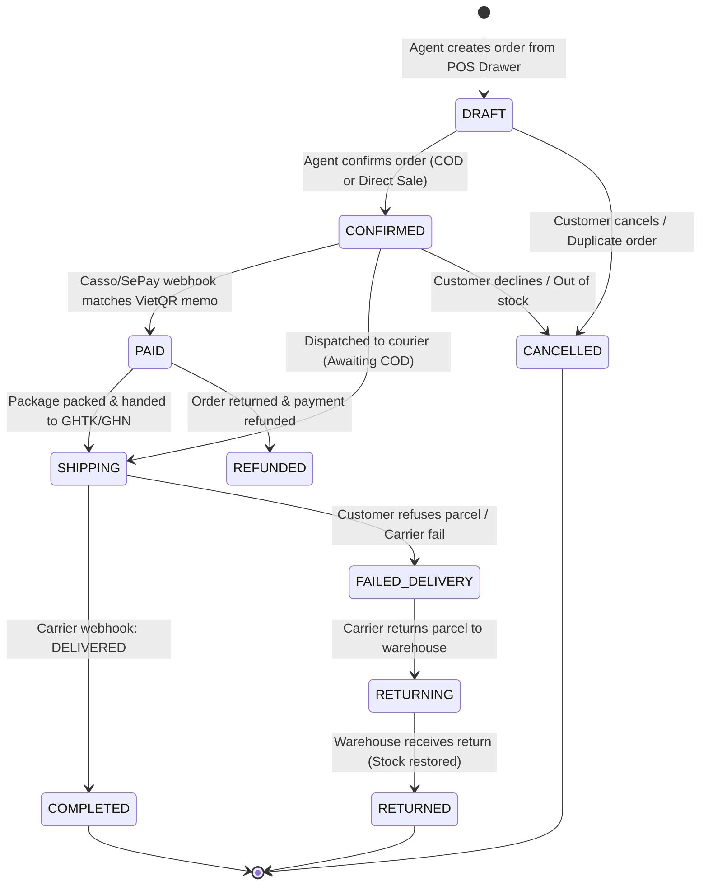
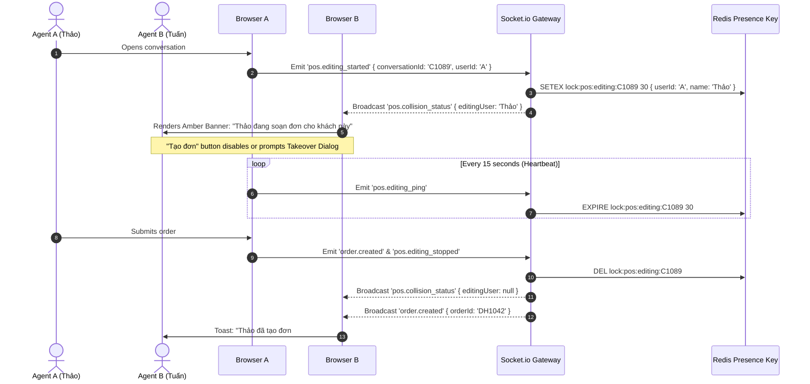

# Product Requirements Document (PRD) & UX Design Specifications
# In-Chat POS & Order Closing Automation

**Subsystem**: In-Chat POS & Order Closing Automation  
**Platform**: Sales Copilot Platform  
**Target File**: `docs/product/in-chat-pos-prd.md`  
**Document Version**: 1.0.0 (Publication-Ready)  
**Date**: 2026-09-08  
**Author**: PRD Author Worker  
**Status**: Approved Specification  
**Classification**: Core Feature Specification (Phase 2 Extension)  

---

## 1. Executive Summary & Business Need

### 1.1 Vietnamese Conversational Commerce Landscape
In Vietnam and Southeast Asia, conversational commerce (social selling via Facebook Messenger, Zalo OA, Instagram Direct, and Web Chat) represents more than 65% of all online retail orders. Unlike Western e-commerce where customers self-navigate a storefront, add items to a digital cart, and complete self-checkout, Vietnamese consumers demand real-time advisory chat:
- Inquiring about sizing, fabric quality, and real-life photos.
- Negotiating custom bundles, discounts, and shipping subsidies.
- Providing unstructured shipping addresses and phone numbers in free-form Vietnamese text.
- Paying via mobile banking app by scanning dynamic QR codes (VietQR / NAPAS 247) or selecting Cash on Delivery (COD).

In this environment, **the chat conversation IS the point of sale (POS)**. Every second of latency, context switching, or human error directly degrades conversion rates.

### 1.2 Benchmark Analysis: Pancake.vn (PosCake, Cake AI, Botcake)
Pancake.vn is the dominant social commerce platform in Vietnam, handling tens of millions of conversations monthly. Its market dominance stems from a tightly integrated operational philosophy:
1. **Zero-Context Switching**: Agents never leave the chat screen. Order creation, inventory lookup, customer tagging, and courier dispatch occur within the messaging workspace.
2. **High-Speed Keyboard Ergonomics**: Order forms open via hotkeys (`F4`), tags toggle via `Alt+1..7`, and catalog searches execute with sub-50ms latency.
3. **Hyper-Localized Workflows**: Built-in 3-tier administrative address trees (Tỉnh/Thành ➔ Quận/Huyện ➔ Phường/Xã), mobile carrier badge detection for telesales cost optimization, and thermal receipt printing (K58/K80).

However, Pancake possesses notable limitations:
- Lack of modern AI-driven conversational intelligence (it relies on rigid keyword rules rather than LLM semantic context).
- Disjointed payment reconciliation: many merchants still rely on manual screenshot checks or basic notifications rather than an automated, idempotent ledger.
- Monolithic, closed architecture with limited extensibility for modern omnichannel CRM and B2B pipelines.

### 1.3 Critical Operational Pain Points
Through extensive field research and operations surveys, four severe bottlenecks were identified in existing chat workflows:
1. **Context Switching Friction**: Agents toggle back and forth between chat windows and external ERP/POS tools (KiotViet, Sapo, Excel). This introduces a **1.5 to 3 minute latency penalty per order**, causing customer interest to cool and chat queues to stall during peak traffic (11:00–13:00 and 20:00–23:00).
2. **Manual Address Entry & High Return Rates ("Bom Hàng")**: Customers provide unstructured addresses with informal abbreviations (e.g., *"15 ngõ 45 Cầu Giấy, Quan Hoa, CG, HN"*). Manual retyping causes typos in ward or district codes, leading to courier rejection, misrouting, and delivery failure rates of **15% to 25%**.
3. **Payment Drop-Off & Manual Bank Reconciliation**: Requesting bank transfers by pasting raw bank account numbers requires customers to manually open their banking app, select the receiving bank, type the account number, type the exact amount, and transcribe an order code. This friction causes up to **30% payment drop-off** and leaves merchants vulnerable to fabricated payment receipt screenshots ("bill giả").
4. **Agent Collision & Duplicate Orders**: In high-velocity teams (5–30 agents sharing incoming queues), multiple agents frequently open the same conversation and simultaneously create duplicate draft orders or quote conflicting prices, causing inventory discrepancies and customer dissatisfaction.
5. **Delayed Packaging & Fulfillment**: Lack of integrated, browser-based thermal waybill printing (58mm/80mm) forces warehouse staff to manually re-enter order numbers into logistics portals, delaying same-day carrier handover.

### 1.4 The Sales Copilot In-Chat POS Solution
The **In-Chat POS & Order Closing Automation** subsystem bridges this gap by embedding a high-performance, AI-accelerated point-of-sale directly into the Sales Copilot conversation layout:
- **Instant Catalog & Variant Inventory Lookup (< 50ms)**: In-memory client search with keyboard-driven selection and live stock/reserved counts.
- **AI-Powered Information Extraction**: Deterministic regex (< 5ms) for phone and carrier detection combined with asynchronous LLM/NER (< 1.2s) and a 3-tier GSO administrative Trie for 1-click address autofill.
- **1-Click POS Drawer (`Sheet`)**: Rapid order assembly with real-time financial recalculation, line-item adjustments, and atomic stock reservation.
- **Dynamic VietQR (NAPAS 247 Standard)**: Instant generation of branded EMVCo QR cards embedded in the chat thread, pre-filled with exact amount and unique memo (`DH{orderCode}`).
- **Automated Webhook Bank Reconciliation (< 1s)**: Real-time matching against bank webhooks (Casso/SePay standard), transitioning orders to `PAID` and broadcasting updates via WebSockets.
- **Browser-Based Thermal Waybill Printing**: Direct K80 (80mm) and K58 (58mm) printing via `@media print` CSS with zero print dialog latency.
- **Multi-Agent Collision Prevention**: Real-time Redis 30-second sliding locks and presence indicators preventing duplicate edits.

### 1.5 Architectural Guardrails & Invariants (AGENTS.md Compliance)
To ensure long-term maintainability and system integrity, this subsystem strictly adheres to the core directives of `AGENTS.md`:
1. **Multi-Tenancy Isolation (Non-Negotiable)**: Every entity (`Product`, `ProductVariant`, `Order`, `OrderItem`, `ShippingAddress`, `PaymentTransaction`, `InventoryTransaction`) enforces tenant scoping via `workspaceId` in all database queries, mutations, and compound indexes. Cross-tenant queries are strictly prevented.
2. **Phase 1 & Phase 2 Non-Breaking Invariant**: Existing Phase 1 entities (`Conversation`, `Message`, `Contact`, `Channel`) and Phase 2 entities (`Lead`, `Opportunity`, `SalesEvidence`) remain intact. The POS module links to them cleanly via optional foreign keys (`conversationId`, `contactId`, `leadId`, `opportunityId`).
3. **Anti-Over-Engineering (KISS & YAGNI)**: Implementation uses direct, idiomatic NestJS Services with Prisma queries and Zod contracts. No unnecessary Clean Architecture abstraction layers, no single-implementation interfaces, and no DTO/Presenter pipeline explosions.
4. **Asynchronous Ingestion Directive**: Chat ingestion acknowledges incoming events in `< 100ms`. AI address extraction, carrier dispatch, and reconciliation execute asynchronously in BullMQ background queues.
5. **Mandatory Reuse of Shadcn UI Primitives**: 100% of UI elements are built from the 50+ existing components in `apps/web/src/components/ui/` (`Sheet`, `Tabs`, `FieldGroup`, `Field`, `Command`, `Badge`, `Button`, `Dialog`, etc.). No custom div-based UI reinventions.

---

## 2. User Personas & Jobs-To-Be-Done (JTBD)



### 2.1 Persona 1: Chat Sales Agent (Tư Vấn Viên / Telesales)
- **Demographics & Profile**: 20–28 years old; operates 15–40 concurrent chat conversations across Facebook Messenger, Zalo OA, and Web Chat during rush hours.
- **Work Environment**: Desktop web browser with dual monitors or high-resolution laptop. Highly commission-driven (evaluated on Gross Merchandise Value, Closed Orders, and First Response Time < 30s).
- **Core Goals**:
  1. Instantly check variant sizes, colors, and stock availability in `< 50ms` without switching windows.
  2. Extract customer phone and address from unstructured chat text with 1 click.
  3. Formulate and finalize draft orders in under 15 seconds.
  4. Send branded VietQR codes to chat and receive instant visual confirmation when payment lands.
  5. Avoid colliding with teammates working the same inbox.
- **Key Frustrations**:
  - Toggling to external ERP tools causes lag, missing customer replies, and losing impulse buyers.
  - Manual typing of complex Vietnamese administrative wards leads to mistakes and courier penalties.
  - Asking customers for payment screenshots and manually checking bank notifications.
- **Job-To-Be-Done (JTBD)**:
  > *"When a prospective customer indicates purchase intent in chat, I want to check variant stock in real time, autofill their address with 1 click, and send an exact VietQR card so that I can close the sale within 15 seconds without administrative overhead."*

### 2.2 Persona 2: Sales Manager (Quản Lý / Trưởng Nhóm Kinh Doanh)
- **Demographics & Profile**: 28–38 years old; manages a team of 5–30 sales agents across multiple brand inboxes and sales channels.
- **Work Environment**: Operations dashboard, queue monitor, conversion analytics.
- **Core Goals**:
  1. Track real-time funnel conversion rates (Conversations ➔ Draft Orders ➔ Paid Orders ➔ Shipped).
  2. Ensure fair conversation assignment via automated round-robin distribution with capacity limits.
  3. Eliminate agent collision and duplicate order creation on shared customer conversations.
  4. Audit discount overrides, price adjustments, and cancellation reasons.
- **Key Frustrations**:
  - Multiple agents clashing on high-value conversations or poaching leads.
  - Revenue leakages from unmonitored agent discounts.
  - Difficulty determining which marketing campaign or channel generated which revenue.
- **Job-To-Be-Done (JTBD)**:
  > *"When managing multi-agent chat queues, I want real-time collision prevention, transparent revenue attribution, and strict order status tracking so that our team maximizes closing rates and eliminates duplicate or lost orders."*

### 2.3 Persona 3: Warehouse & Fulfillment Lead (Quản Lý Kho & Đóng Gói)
- **Demographics & Profile**: 25–40 years old; oversees physical inventory levels, stock reservation, picking, packing, label printing, and 3PL courier handovers.
- **Work Environment**: Warehouse floor packing station equipped with thermal barcode printers (Xprinter K80/K58, 80mm/58mm) and handheld barcode scanners.
- **Core Goals**:
  1. Maintain strict inventory accuracy with atomic stock reservation to prevent overselling.
  2. Print high-contrast thermal packing slips and carrier waybills in 1 click directly from the browser.
  3. Push standardized 3-tier address payloads to logistics carriers (GHTK, GHN) without API rejections.
  4. Quickly identify paid orders versus COD collection amounts on physical waybills.
- **Key Frustrations**:
  - Agents selling items that are already out of stock or reserved for other orders.
  - Address typos causing carrier rejection at pickup, delaying dispatch by 24–48 hours.
  - Slow print dialogs or misaligned print layouts that slow down packing assembly lines.
- **Job-To-Be-Done (JTBD)**:
  > *"When an order is confirmed and paid in chat, I want inventory immediately locked, addresses standardized to carrier specifications, and waybills ready for zero-latency thermal printing so that my team can pack and dispatch orders accurately and rapidly."*

### 2.4 Persona 4: Social Commerce End-Customer (Khách Hàng Mua Sắm Qua Chat)
- **Demographics & Profile**: Mobile-first consumer purchasing via Facebook Messenger, Zalo, or Web Chat.
- **Work Environment**: Smartphone (iOS/Android) with mobile banking apps (Vietcombank, MB Bank, Techcombank, VPBank, etc.) installed.
- **Core Goals**:
  1. Receive rapid answers regarding product availability, size recommendations, and transparent pricing.
  2. Avoid repeating personal details already typed into the conversation.
  3. Complete payment in seconds by scanning a QR code with pre-filled amount and memo, eliminating manual account entry errors.
  4. Receive immediate, trustworthy confirmation that payment was acknowledged and the order is processing.
- **Key Frustrations**:
  - Having to wait minutes for an agent to check stock.
  - Having to manually copy bank account numbers, bank names, and order codes into banking apps.
  - Anxiety over whether their bank transfer was received by the shop.
- **Job-To-Be-Done (JTBD)**:
  > *"When I decide to buy a product in chat, I want an immediate order summary and an auto-filled VietQR code so that I can pay securely with one biometric tap and receive instant confirmation."*

### 2.5 Persona Summary Matrix

| Persona | Primary Metric / KPI | Key System Interaction | Performance SLA Target |
| :--- | :--- | :--- | :--- |
| **Agent** | Closed GMV, First Response Time (< 30s), Closing Rate | In-Chat POS Drawer (`Sheet`), Quick Tags, VietQR Trigger | Search `< 50ms`, Order Creation `< 100ms` |
| **Sales Manager** | Queue Velocity, Conversion Rate, Zero Collisions | Presence Monitor, Audit Log, Attribution Reports | Real-time presence sync `< 200ms` |
| **Warehouse Lead** | Picking Speed, Zero Overselling, Dispatch Accuracy | Stock Locking, Browser Thermal Print (K80), Carrier Push | Print Modal `< 50ms`, Zero Oversell (Atomic Tx) |
| **End-Customer** | Checkout Friction, Payment Security, Delivery Speed | Interactive VietQR Card in chat, Realtime Payment Receipt | Bank Webhook Reconcile `< 1s` |

---

## 3. 8-Stage End-to-End Customer Journey Map


### 3.1 Detailed 8-Stage Journey Breakdown

| Stage | Trigger & Customer Behavior | System & AI Behavior | Agent / Operator Action | SLA / Latency Target |
| :--- | :--- | :--- | :--- | :--- |
| **Stage 1: Intent Discovery** | Customer messages: *"Shop ơi áo polo đen size L còn không?"* | Ingestion acknowledges `< 100ms`. Inbound message routed to Inbox. BullMQ analyzes customer intent. Redis sets presence key. | Agent opens chat. Realtime collision indicator confirms no other agent is editing. | Ingestion `< 100ms`, First reply `< 30s` |
| **Stage 2: Consultation & Stock Lookup** | Customer asks about sizing, fit, and current promotional price. | Workspace product catalog cached in-memory. Variant stock computed: `Available = Stock - Reserved`. | Agent presses `F4` or searches `/sp polo` in POS Drawer. Live stock badge shows `Còn hàng: 18`. Agent confirms to customer. | Catalog search `< 50ms` |
| **Stage 3: Recipient Info Extraction** | Customer replies: *"Ok lấy cho anh 1 chiếc về 18 ngõ 45 phố Vọng, Đồng Tâm, Hai Bà Trưng, HN, sđt 0987654321 nhé"*. | Regex parses phone `0987654321` and maps `Viettel` badge (< 5ms). BullMQ NER + 3-tier GSO Trie extracts Street, Ward, District, Province (< 1.2s). | POS Drawer displays AI Auto-fill Banner with confidence score (98%). Agent clicks "Áp dụng" (`Tab`). | Regex `< 5ms`, Async NER `< 1.2s` |
| **Stage 4: 1-Click Order Formulation** | Customer agrees on total price (product + shipping). | System opens database transaction (`$transaction`), verifies available stock, increments `reservedQuantity`, and generates Order `#DH1042`. | Agent selects variant, applies 20k voucher, selects shipping preset (30k), and clicks "Tạo đơn hàng" (`Ctrl+Enter`). | Database Tx `< 100ms` |
| **Stage 5: Dynamic VietQR Generation** | Customer requests bank transfer details: *"Cho mình xin STK chuyển khoản"*. | System computes NAPAS 247 EMVCo payload with Bank BIN, Account, Amount (`350,000 ₫`), and unique memo `DH1042`. Renders branded card. | Agent clicks "Gửi mã VietQR vào Chat". Interactive card appears in customer's thread with 1-click copy buttons. | QR generation `< 80ms` |
| **Stage 6: Webhook Bank Reconciliation** | Customer scans QR on banking app (Vietcombank/MB) and confirms transfer. | Casso/SePay webhook received. HMAC validated, memo `DH1042` matched, amount verified. Order shifts to `PAID`. Socket.io broadcasts `order.paid`. | Drawer badge shifts to green `ĐÃ THANH TOÁN`. Sonner toast alerts agent. System posts automated payment receipt in chat. | Webhook processing `< 200ms`, E2E `< 2s` |
| **Stage 7: Courier Dispatch** | Order confirmed and paid. Ready for fulfillment. | Shipping Adapter maps 3-tier address to carrier codes (GHN `WardCode`, `DistrictID` or GHTK address). Pushes shipment API. Tracking code received. | System shifts order to `SHIPPING`. Tracking link sent to customer automatically. | Carrier API `< 800ms` |
| **Stage 8: Browser Thermal Waybill Printing** | Package packed in warehouse; ready for shipping label. | Generates pure CSS `@media print` layout for K80 (80mm) or K58 (58mm) with Code128 barcode and bold COD amount. | Warehouse clicks "In phiếu K80". Browser opens print dialog with exact width and zero margin. Label attached to parcel. | Print render `< 50ms` |

---

## 4. Detailed Specifications for 6 Core Use Cases



### 4.1 Use Case 1 (UC1): Fast In-Chat Catalog & Variant Inventory Lookup
- **Primary Actor**: Chat Sales Agent.
- **Goal**: Search and inspect product variants, prices, and available stock in under 50ms without leaving the conversation view.
- **Triggers**:
  1. Agent presses hotkey `Ctrl+K` or focuses the search bar in POS Drawer.
  2. Agent types slash command `/sp [từ khóa]` in the message composer.
- **Search Capabilities**:
  - **Full-Text Keyword Search**: Normalized search across product title, tags, and category with Vietnamese diacritics stripping (e.g., `ao khoac` matches `Áo khoác bomber`).
  - **SKU & Barcode Exact Match**: Immediate lookup by variant SKU (e.g., `POLO-BLK-L`) or barcode scan via USB/Bluetooth scanner.
- **Inventory Metrics & Formulas**:
  $$\text{Available Stock} = \text{Physical Stock} - \text{Reserved Stock}$$
  - `Physical Stock` (`stockQuantity`): Units physically present in warehouse.
  - `Reserved Stock` (`reservedQuantity`): Units allocated to active `DRAFT`, `CONFIRMED`, or `SHIPPING` orders awaiting dispatch.
  - `Available Stock`: True sellable quantity. Prevents overselling.
- **Visual Status Badges**:
  - `In Stock` (`Badge variant="outline"` text-emerald-500 bg-emerald-500/10): Available $\ge 10$ units.
  - `Low Stock` (`Badge variant="outline"` text-amber-500 bg-amber-500/10): Available $1 \dots 9$ units.
  - `Out of Stock` (`Badge variant="destructive"`): Available $= 0$ units. Disables addition unless "Cho phép đặt trước (Pre-order)" is enabled in workspace settings.
- **Performance Architecture**:
  - Product catalog cached on frontend via TanStack Query (`staleTime: 5 minutes`).
  - In-memory client filtering using `cmdk` primitive (`apps/web/src/components/ui/command.tsx`).
  - Search latency strictly `< 20ms` for catalogs up to 5,000 SKUs.
  - Real-time stock invalidation via WebSocket `inventory.updated` events.

### 4.2 Use Case 2 (UC2): AI Extraction of Recipient Info & 3-Tier Address
- **Primary Actor**: System AI Engine & Chat Sales Agent.
- **Goal**: Automatically extract customer phone number, name, and standardized 3-tier Vietnamese administrative address from raw chat messages.
- **Multi-Stage Processing Pipeline**:
  ```text
  Customer Message ➔ [1. Regex Phone & Telco Engine < 5ms]
                   ➔ [2. Asynchronous LLM NER Parser < 1.2s]
                   ➔ [3. 3-Tier GSO Administrative Trie Normalizer]
                   ➔ [4. Interactive UI Auto-Fill Banner]
  ```
  1. **Stage 1: Deterministic Phone & Telco Engine (< 5ms)**:
     - Regex pattern: `/(?:\+84|0)(3[2-9]|5[25689]|7[06-9]|8[1-9]|9[0-9])[0-9]{7}\b/g`.
     - Strips spaces, dots, dashes; normalizes to standard `0XXXXXXXXX`.
     - Maps network prefix to carrier: `Viettel`, `Vinaphone`, `Mobifone`, `Vietnamobile`, `Wintel`, `Gmobile`.
  2. **Stage 2: Asynchronous LLM NER Parser (BullMQ Worker < 1.2s)**:
     - Prompts lightweight LLM gateway to extract: `recipientName`, `rawStreet`, `rawWard`, `rawDistrict`, `rawProvince`.
     - Filters conversational fluff (*"em ơi ship cho anh về...", "người nhận là..."*).
  3. **Stage 3: 3-Tier GSO Administrative Trie Normalizer**:
     - Matches extracted text against official Vietnam General Statistics Office (GSO) database (63 Provinces, 705 Districts, 10,600+ Wards).
     - Resolves abbreviations: `HN` ➔ `Hà Nội`, `TPHCM` / `SG` ➔ `Hồ Chí Minh`, `Q1` ➔ `Quận 1`, `P. Bến Nghé` ➔ `Phường Bến Nghé`.
     - Employs bottom-up resolution (Ward ➔ District ➔ Province) to disambiguate identical ward names across different provinces.
  4. **Stage 4: Interactive Auto-Fill Banner**:
     - Renders a dismissible card above the POS form with confidence score.
     - Pressing `Tab` or clicking "Áp dụng" populates all address fields into the POS Drawer form immediately.

### 4.3 Use Case 3 (UC3): 1-Click Order Creation & POS Drawer
- **Primary Actor**: Chat Sales Agent.
- **Goal**: Assemble customer line items, configure discounts and shipping fees, and commit orders atomically within 15 seconds.
- **Dual-Mode Interaction Pattern**:
  - **Mode 1 (Persistent Overview)**: "Đơn POS" Tab located inside the right-hand `DetailPanel` (`conversation-layout.tsx`). Displays existing conversation orders, shipping progress, and lifetime order history.
  - **Mode 2 (High-Speed Slide-Over Drawer)**: High-speed order compose sheet (`Sheet side="right" w-full sm:max-w-xl`) triggered via `F4` or "Tạo đơn nhanh" button.
- **Order Formulation Capabilities**:
  - **Recipient Info Card**: Phone with carrier badge, name, cascading 3-tier address selectors.
  - **Line Items Table**: Product title, variant pill, quantity stepper (`- 1 +`), unit price, custom item discount.
  - **Financial Summary Engine**:
    - Subtotal calculation.
    - Discount toggles: Fixed VND amount (`₫`) vs Percentage (`%`), voucher code input.
    - Shipping fee presets: `Freeship (0 ₫)`, `Đồng giá (25k)`, `Tiêu chuẩn (30k)`, `Hỏa tốc (45k)`, or carrier real-time quote.
    - Total Payable calculation:
      $$\text{totalAmount} = \max(0, \text{subtotal} - \text{discountAmount} + \text{shippingFee})$$
  - **Payment Mode Selection**:
    - `COD`: Cash on delivery (default in VN retail). Displays exact COD collection amount.
    - `Chuyển khoản (VietQR)`: Triggers automated VietQR generation flow.
    - `Đặt cọc một phần`: E.g., 100k deposit via VietQR, remaining balance collected via COD.
- **Atomic Stock Reservation Invariant**:
  - Order creation wraps variant stock verification and reservation increment inside a PostgreSQL row-level locked transaction (`SELECT ... FOR UPDATE` via Prisma `$transaction`).
  - If $\text{stockQuantity} - \text{reservedQuantity} < \text{requestedQty}$, transaction aborts and returns `ConflictException({ code: 'OUT_OF_STOCK' })`. No overselling occurs.

### 4.4 Use Case 4 (UC4): Dynamic VietQR Generation (NAPAS 247 Standard)
- **Primary Actor**: Chat Sales Agent & End-Customer.
- **Goal**: Eliminate manual banking entry by generating a dynamic, scannable VietQR code embedding the exact payable amount and unique transfer memo.
- **NAPAS 247 / EMVCo Specification Conformance**:
  - **Payload Format Indicator (Tag 00)**: `01`
  - **Point of Initiation Method (Tag 01)**: `12` (Dynamic QR — amount and memo pre-coded)
  - **Merchant Account Information (Tag 38)**:
    - Sub-tag 00 (AID): `A000000727`
    - Sub-tag 01 (Beneficiary Bank BIN): 6-digit acquirer code (e.g., `970422` for MB Bank, `970436` for Vietcombank).
    - Sub-tag 02 (Account Number): Merchant bank account.
  - **Transaction Currency (Tag 53)**: `704` (VND)
  - **Transaction Amount (Tag 54)**: Exact integer value of order `totalAmount`.
  - **Country Code (Tag 58)**: `VN`
  - **Additional Data Field (Tag 62)**:
    - Sub-tag 08 (Transfer Purpose / Memo): `ORD {orderNumber}` or `DH{orderNumber}` (e.g., `DH1042`).
  - **CRC16-CCITT Checksum (Tag 63)**: 4-character uppercase hex checksum calculated over all prior bytes.
- **Chat Injection & Presentation**:
  - Agent clicks "Gửi mã VietQR vào Chat".
  - System generates high-contrast QR PNG and delivers an interactive message card into the chat thread.
  - Card displays:
    - Branded header with bank logo and NAPAS 247 symbol.
    - Scannable QR code image.
    - Bank Name, Account Holder Name, Account Number (with 1-click Copy button).
    - Transfer Amount formatted in VND (with 1-click Copy button).
    - Transfer Content / Memo: `DH1042` (with 1-click Copy button).
    - Awaiting payment pulse indicator with live 15-minute countdown.

### 4.5 Use Case 5 (UC5): Automated Webhook Bank Reconciliation
- **Primary Actor**: Banking Webhook Gateway (Casso.vn / SePay.vn) & System Engine.
- **Goal**: Automatically reconcile bank transfer transactions against outstanding orders, update order status to `PAID`, and alert the agent in real time (< 1s).
- **Inbound Webhook Specification**:
  - Providers: **Casso.vn** and **SePay.vn** (standard bank open-API webhooks in Vietnam).
  - Inbound Payload:
    ```json
    {
      "gateway": "MBBank",
      "transactionDate": "2026-09-08 10:25:30",
      "accountNumber": "09888889999",
      "subAccount": null,
      "amountIn": 460000,
      "amountOut": 0,
      "accumulated": 15420000,
      "code": null,
      "transactionContent": "MBVCB.123456789.DH1042.Chuyen tien mua dam hoa nhi",
      "referenceNumber": "FT26251098234821",
      "body": "MBVCB.123456789.DH1042..."
    }
    ```
- **Security & Idempotency Rules**:
  1. **HMAC Signature & Secure Token Verification**: Header `Secure-Token` or `X-Webhook-Signature` validated against AES-256-GCM encrypted credentials stored in `WorkspaceSettings`.
  2. **Distributed Idempotency Guard**: Unique constraint on `(workspaceId, referenceNumber)` in `PaymentTransaction` table combined with Redis distributed lock `lock:webhook:{workspaceId}:{referenceNumber}`. Redundant webhook retries return HTTP `200 OK` immediately without duplicate crediting.
- **Matching & State Transition Logic**:
  1. Regex parses memo from `transactionContent`: `/(?:DH|ORD|SO)[_-]?([0-9]{4,10})/i`.
  2. Queries active order matching `orderCode` and `workspaceId`.
  3. Verifies `amountIn`:
     - If $\text{amountIn} \ge \text{order.totalAmount}$: Shifts order status to `PAID`.
     - If $\text{amountIn} < \text{order.totalAmount}$: Shifts order status to `PARTIALLY_PAID`, records `paidAmount`, alerts agent to collect remaining balance.
     - If $\text{amountIn} > \text{order.totalAmount}$: Shifts order to `PAID`, logs excess customer credit.
- **Real-Time Notification & Broadcast**:
  - Emits WebSocket event `order.paid` to rooms `workspace_{workspaceId}` and `conversation_{conversationId}`.
  - In-chat POS Drawer shifts badge to green `ĐÃ THANH TOÁN`.
  - Sonner toast triggers on agent browser with celebration chime.
  - Automated confirmation message posted to customer in chat thread.

### 4.6 Use Case 6 (UC6): Browser-Based Thermal Printing (58mm & 80mm)
- **Primary Actor**: Warehouse Operator / Packing Lead.
- **Goal**: Generate high-contrast, zero-margin thermal shipping slips and packing invoices directly from the browser without third-party print drivers.
- **Supported Formats & Hardware**:
  - **80mm Roll Width (K80 / 72mm printable width / 576 dots)**: Standard size for retail packing slips.
  - **58mm Roll Width (K58 / 48mm printable width / 384 dots)**: Compact format for mini desktop printers.
  - Hardware: Compatible with Xprinter, Gprinter, Bixolon, Epson, HPRT, and any standard ESC/POS USB or LAN receipt printer.
- **Pure CSS Print Architecture (`@media print`)**:
  ```css
  @media print {
    @page {
      size: 80mm auto;
      margin: 0;
    }
    body * {
      visibility: hidden;
    }
    #thermal-printable-area, #thermal-printable-area * {
      visibility: visible;
    }
    #thermal-printable-area {
      position: absolute;
      left: 0;
      top: 0;
      width: 80mm;
      padding: 2mm 3mm;
      font-family: -apple-system, BlinkMacSystemFont, "Segoe UI", Roboto, monospace;
      color: #000 !important;
      background: #fff !important;
    }
  }
  ```
- **Slip Content Structure**:
  1. Store Name, Hotline, Warehouse Sender Address.
  2. Order Barcode (Code128 high-contrast vector) and Order Code (`#DH1042`).
  3. Recipient Name, Masked Phone (`098***4321`), Delivery Address (3-tier).
  4. Itemized Manifest: SKU, Product Title, Variant (Size/Color), Qty, Unit Price.
  5. Financial Breakdown: Subtotal, Discount, Shipping Fee.
  6. **COD Collection Highlight (18pt Bold Bordered Box)**:
     - If paid via VietQR: **`0 ₫ - ĐÃ THANH TOÁN VIETQR`**.
     - If COD: **`THU HỘ TIỀN MẶT (COD): 460.000 ₫`**.
  7. Delivery instructions (*"Cho xem hàng, không cho thử"*).

---

## 5. Vietnam-Specific E-Commerce Nuances

### 5.1 Telco Carrier Badge Detection & Cost Optimization
Vietnamese telesales operations rely heavily on outgoing mobile confirmation calls. Calling cross-network (e.g., from a Viettel SIM to a Mobifone subscriber) costs 3x to 5x more than calling on-net. Exposing the telco carrier badge immediately in the UI allows agents to select the matching VoIP SIP line or SIM slot on their desk phone.



#### Vietnamese Carrier Prefix Mapping Table

| Carrier | Prefixes (Đầu Số) | Visual Badge Styling |
| :--- | :--- | :--- |
| **Viettel** | `086`, `096`, `097`, `098`, `032`, `033`, `034`, `035`, `036`, `037`, `038`, `039` | `bg-emerald-500/10 text-emerald-500 border-emerald-500/30` |
| **Vinaphone** | `088`, `091`, `094`, `081`, `082`, `083`, `084`, `085` | `bg-blue-500/10 text-blue-500 border-blue-500/30` |
| **Mobifone** | `089`, `090`, `093`, `070`, `076`, `077`, `078`, `079` | `bg-sky-500/10 text-sky-500 border-sky-500/30` |
| **Vietnamobile** | `092`, `056`, `058` | `bg-orange-500/10 text-orange-500 border-orange-500/30` |
| **Wintel (Reddi)** | `055` | `bg-rose-500/10 text-rose-500 border-rose-500/30` |
| **Itelecom** | `087` | `bg-red-500/10 text-red-500 border-red-500/30` |

### 5.2 3-Tier Administrative Address Hierarchy & Normalization
Vietnam's administrative division consists of 3 strict tiers:
1. **Level 1**: Tỉnh / Thành phố trực thuộc Trung ương (63 units).
2. **Level 2**: Quận / Huyện / Thị xã / Thành phố thuộc tỉnh (705 units).
3. **Level 3**: Phường / Xã / Thị trấn (10,600+ units).

#### Address Normalization Challenges & Rules
- **Diacritics Variations**: Customers frequently omit Vietnamese tone marks (e.g., `dong da, ha noi`). The address engine normalizes text using a Trie lookup against the full diacritics dictionary.
- **Ambiguous Numeric Names**: Wards named by numbers (e.g., `Phường 1`, `Phường 12`) exist in multiple districts. The parser strictly preserves token sequence order and uses bottom-up constraint checking.
- **Recent Mergers**: Accommodates newly established administrative entities (e.g., `TP. Thủ Đức` formed from District 2, District 9, and Thủ Đức District) by aliasing historical postal codes.
- **3PL Carrier Code Mapping**: Standard GSO names are mapped directly to carrier-specific IDs (GHN `ProvinceID`, `DistrictID`, `WardCode` and GHTK pickup/delivery address codes) to eliminate API rejection upon order creation.

### 5.3 Multi-Agent Collision Detection & Live Presence Locking
When multiple agents monitor a shared inbox, there is a severe risk of two agents simultaneously formulating an order for the same customer, promising the same stock, or applying conflicting discounts.

#### Redis-Backed 30-Second Sliding Lock Architecture
1. When an agent opens the POS Drawer or focuses an order form, client emits WebSocket event `pos.editing_started`.
2. Backend sets a Redis key with a 30-second TTL:
   `lock:pos:editing:{workspaceId}:{conversationId} ➔ { userId, userName, avatarUrl, timestamp }`.
3. Client sends a heartbeat ping every 15 seconds to refresh the TTL while the drawer remains open.
4. All connected agents in the conversation room receive `pos.collision_status`.
5. **UI Rendering**:
   - Other agents see an **Agent Collision Banner** displaying the active editor's avatar: *"Nguyễn Lan đang soạn đơn hàng cho khách này lúc 10:24"*.
   - The "Tạo đơn" button on other agents' screens disables or triggers a **Takeover Confirmation Dialog** (*"Tiếp quản đơn hàng"*).
6. If the active agent closes the tab or disconnects, the Redis key automatically expires after 30 seconds, restoring edit access smoothly.

### 5.4 Quick Tag Action Bar & Keyboard Acceleration
Speed is the defining operational metric of social selling. Navigating dropdown menus to label a conversation slows agents down. A persistent, horizontal **Quick Tag Action Bar** is positioned directly above the message composer.

#### Quick Tag Taxonomy & Hotkeys

| Hotkey | Tag Code | Vietnamese Display Name | Semantic Color Style |
| :--- | :--- | :--- | :--- |
| `Alt + 1` | `#DA_CHUYEN_KHOAN` | Đã chuyển khoản VietQR | `bg-emerald-500/10 text-emerald-500 border-emerald-500/30` |
| `Alt + 2` | `#CHO_GIAO` | Chờ đóng gói & giao hàng | `bg-amber-500/10 text-amber-500 border-amber-500/30` |
| `Alt + 3` | `#DANG_GIAO` | Đang giao hàng (3PL) | `bg-sky-500/10 text-sky-500 border-sky-500/30` |
| `Alt + 4` | `#HET_HANG` | Hết hàng / Chờ nhập kho | `bg-rose-500/10 text-rose-500 border-rose-500/30` |
| `Alt + 5` | `#CAN_TU_VAN` | Khách cần tư vấn thêm | `bg-purple-500/10 text-purple-500 border-purple-500/30` |
| `Alt + 6` | `#CHO_KHACH_CHECK` | Chờ khách kiểm tra size | `bg-orange-500/10 text-orange-500 border-orange-500/30` |
| `Alt + 7` | `#BOM_HANG` | Khách bom / Bom hàng | `bg-red-600 text-white font-bold` |

- **Optimistic UI**: Toggling a tag applies the label in `< 20ms` in local TanStack Query cache while dispatching the background mutation to the server.

### 5.5 Pluggable Shipping Carrier Framework (GHTK & GHN)
Sales Copilot provides a unified shipping abstraction layer (`ShippingCarrierAdapter`) enabling merchants to connect multiple logistics providers without vendor lock-in.



- **Giao Hàng Tiết Kiệm (GHTK)**: Uses API Token authentication, calculates weight-based rates, generates pickup tags, and retrieves printable waybill links.
- **Giao Hàng Nhanh (GHN)**: Uses `Token` and `ShopId`, requires strict `ProvinceID`, `DistrictID`, `WardCode`, item dimensions ($L \times W \times H$), and parcel weight.
- **Unified Logistics State Machine**:
  `DRAFT` ➔ `PENDING_PICKUP` ➔ `PICKED` ➔ `IN_TRANSIT` ➔ `DELIVERED` ➔ `COMPLETED` (or `DELIVERY_FAIL` ➔ `RETURNING` ➔ `RETURNED`).

---

## 6. Product & UX Design Specifications

### 6.1 Layout Architecture & Next.js App Router Integration
The In-Chat POS subsystem seamlessly integrates into the existing conversation view located at `apps/web/src/features/conversations/conversation-layout.tsx`.

The layout maintains a 3-column resizable structure (`ResizablePanelGroup`):
- **Left Column (25%)**: `ConversationList` — thread list with channel filters and status tags.
- **Center Column (50%)**: `MessageThread` — message scroller, message bubble rendering, interactive VietQR cards, `QuickTagActionBar`, and `ChatComposer`.
- **Right Column (25%)**: `DetailPanel` — upgraded with a 3-tab layout:
  - Tab 1 (`contact`): Customer metadata, channel identities, contact notes.
  - Tab 2 (`pos`): **POS Overview Tab** — current active order, quick actions, lifetime order history.
  - Tab 3 (`copilot`): Phase 2 BANT evidence ledger, buying signals, and reply suggestions.
- **Overlay Drawer**: **High-Speed In-Chat POS Drawer** (`Sheet side="right" w-full sm:max-w-xl shadow-2xl z-50`), invoked via hotkey `F4` or header action button.

### 6.2 Dual-Mode Interaction Model
```text
┌────────────────────────────────────────────────────────────────────────────────────────┐
│ DUAL-MODE POS INTEGRATION MODEL                                                        │
├────────────────────────────────────────┬───────────────────────────────────────────────┤
│ Mode 1: POS Overview Tab (DetailPanel) │ Mode 2: High-Speed POS Drawer (Sheet F4)      │
├────────────────────────────────────────┼───────────────────────────────────────────────┤
│ • Always visible in right 25% column   │ • Slide-over drawer (540px - 600px width)     │
│ • Displays current active order card   │ • Full catalog & variant search combobox      │
│ • Displays order fulfillment status    │ • Editable line items table with steppers     │
│ • Shows historical purchases & returns │ • Cascading 3-tier administrative selectors   │
│ • Quick reprint button (K80 thermal)   │ • Voucher codes & discount toggles            │
│ • Button: "Tạo đơn hàng mới (F4)"      │ • One-click commit: "Tạo đơn & Gửi VietQR"    │
└────────────────────────────────────────┴───────────────────────────────────────────────┘
```

### 6.3 Shadcn UI Primitive Reuse Matrix
In strict compliance with **AGENTS.md Section 6**, no UI primitives are reinvented. All interface elements reuse existing components from `apps/web/src/components/ui/`.

| POS Component | Shadcn UI Primitive Used | Styling & Ergonomic Rules |
| :--- | :--- | :--- |
| **Drawer Container** | `Sheet`, `SheetContent`, `SheetHeader`, `SheetTitle`, `SheetFooter` | `side="right"`, `className="sm:max-w-xl overflow-y-auto"`, escape-key close. |
| **Tab Navigation** | `Tabs`, `TabsList`, `TabsTrigger`, `TabsContent` | Used in `DetailPanel` for switching between Contact, POS, and Copilot tabs. |
| **Form Layout** | `FieldGroup`, `Field`, `FieldLabel`, `FieldError`, `FieldSet` | Mandatory form layout. Strictly uses `gap-*` (never `space-y-*`). |
| **Input Fields** | `Input`, `InputGroup`, `InputGroupInput`, `InputGroupAddon` | High-density inputs with integrated copy buttons and icons. |
| **Search Engine** | `Command`, `CommandInput`, `CommandList`, `CommandItem`, `CommandEmpty` | In-memory `cmdk` product lookup with arrow-key navigation. |
| **Carrier & Status** | `Badge` (variants: default, secondary, outline, destructive) | Color-coded badges for Viettel/Vina, order status, and stock levels. |
| **Address Selectors** | `Combobox`, `Select`, `SelectTrigger`, `SelectContent`, `SelectItem` | Popover search for 63 Provinces, 705 Districts, and 10,600+ Wards. |
| **Itemized Table** | `Table`, `TableHeader`, `TableBody`, `TableRow`, `TableHead`, `TableCell` | High-density data table displaying selected order items and quantities. |
| **Quick Tag Bar** | `ToggleGroup`, `ToggleGroupItem`, `Badge` | Horizontal scrollable bar with 1-click active state toggling. |
| **Presence Avatar** | `Avatar`, `AvatarImage`, `AvatarFallback`, `Tooltip`, `TooltipTrigger` | Shows teammate profile picture and live editing tooltip. |
| **Collision Alert** | `Alert`, `AlertTitle`, `AlertDescription` | High-contrast amber warning banner when another agent is drafting an order. |
| **VietQR Modal** | `Dialog`, `DialogContent`, `DialogHeader`, `DialogTitle`, `DialogFooter` | Popout modal displaying high-res QR, bank details, and copy triggers. |
| **Thermal Print** | `Dialog`, `DialogContent`, `DialogFooter`, `Button` | Print preview dialog with `@media print` zero-margin styling. |
| **Toast Alerts** | `sonner` (`toast.success()`, `toast.error()`) | Non-intrusive notifications for order creation, bank receipt, copy actions. |

---

### 6.4 Comprehensive ASCII Wireframes

#### 6.4.1 Three-Column Conversation Layout with POS Tab & Quick Tag Bar

```text
+-----------------------------------------------------------------------------------------------------------------------------+
| SALES COPILOT - WORKSPACE: FASHION BOUTIQUE                                                   [Chuông] [Dark/Light] [Avatar]|
+-------------------------------+--------------------------------------------------------------+------------------------------+
| CONVERSATIONS (25%)           | MESSAGE THREAD (50%)                                         | RIGHT PANEL / POS TAB (25%)  |
+-------------------------------+--------------------------------------------------------------+------------------------------+
| [ 🔍 Tìm kiếm hội thoại... ]  | [Avatar] Mai Phương Thảo  via Facebook Messenger #C1089      | ┌TabsList:─────────────────┐ |
| [Tất cả] [Chờ duyệt] [Đã chốt]| [✓ Đã giải quyết] [Gán việc] [⚡ Tạo đơn (F4)] [Thu gọn >]   | │ [Khách] │ [ĐƠN POS]│ [AI]│ |
+-------------------------------+--------------------------------------------------------------+ └──────────────────────────┘ |
| * Mai Phương Thảo             |  (Khách) 10:20 AM                                            | ĐƠN HÀNG CỦA HỘI THOẠI       |
|   "Cho mình 1 áo size M nhé"  |  Chào shop, mình muốn lấy 1 đầm hoa nhí size M và 1 áo thun  |                              |
|   10:20 AM • #CAN_TU_VAN      |  trắng size L về số 15 Duy Tân Cầu Giấy Hà Nội nhé           | Đơn hiện tại: #DH1042        |
|-------------------------------|--------------------------------------------------------------| Trạng thái: [ CHO_GIAO ]     |
|   Nguyễn Văn Tuấn             |  (Bạn) 10:21 AM                                              |                              |
|   "Shop đã ship đơn chưa ạ?"  |  Dạ shop chào chị Thảo, shop check tồn kho và lên đơn liền   | 2 sản phẩm:                  |
|   09:45 AM • #DANG_GIAO       |  cho chị nhé ạ!                                              | • 1x Đầm hoa nhí (Be / M)    |
|-------------------------------|--------------------------------------------------------------| • 1x Áo thun basic (Trắng / L)|
|   Lê Thị Bích                 |  (AI Engine) 10:22 AM                                        |                              |
|   "Đã chuyển khoản 350k..."   |  [✨ AI Auto-fill: 15 Duy Tân, Cầu Giấy, HN - 0988123456]    | Tạm tính:          480.000 ₫ |
|   09:12 AM • #DA_CHUYEN_KHOAN |--------------------------------------------------------------| Phí ship:           30.000 ₫ |
|                               |  (Bạn - Thẻ đơn hàng) 10:23 AM                               | Giảm giá:          -50.000 ₫ |
|                               |  +---------------------------------------------------------+ | TỔNG CỘNG:         460.000 ₫ |
|                               |  | THẺ ĐƠN HÀNG #DH1042                   [CHO_GIAO]       | | HTTT: Chuyển khoản VietQR  |
|                               |  | Khách: Mai Phương Thảo - 0988123456 (Viettel)            | | Trạng thái: ĐÃ THANH TOÁN  |
|                               |  | 2 món • Tổng: 460.000 ₫ • Đã thanh toán VietQR          | |                              |
|                               |  | [ In phiếu K80 ] [ Gửi lại mã VietQR ] [ Chi tiết ]     | | [ In phiếu K80 ] [ Sửa ]   |
|                               |  +---------------------------------------------------------+ | ---------------------------- |
|                               |--------------------------------------------------------------| LỊCH SỬ MUA HÀNG (3 đơn)     |
|                               | QUICK TAGS:                                                  | • #DH0981 (15/08) - 350k [TC]|
|                               | [#DA_CK] [#CHO_GIAO] [#DANG_GIAO] [#HET_HANG] [#CAN_TU_VAN]  | • #DH0742 (02/06) - 520k [TC]|
|                               +--------------------------------------------------------------|                              |
|                               | [Trả lời] [Ghi chú nội bộ]                     [Mẫu câu /]   | [+ TẠO ĐƠN MỚI CHO KHÁCH]    |
|                               | Nhập tin nhắn phản hồi cho khách...                          |                              |
|                               | [Ghim ảnh] [Emoji]                               [ GỬI (↵) ] |                              |
+-------------------------------+--------------------------------------------------------------+------------------------------+
```

---

#### 6.4.2 High-Speed Slide-Over POS Drawer (`Sheet` Hotkey F4)

```text
+----------------------------------------------------------------------------------------------------+
| IN-CHAT POS DRAWER: TẠO ĐƠN HÀNG NHANH (#DRAFT)                                       [ X Đóng/Esc]|
+----------------------------------------------------------------------------------------------------+
| ⚡ [COLLISION ALERT]: Nguyễn Văn Tuấn cũng đang xem hội thoại này lúc 10:21                         |
+----------------------------------------------------------------------------------------------------+
| 1. THÔNG TIN NGƯỜI NHẬN                                                                            |
| ┌────────────────────────────────────────────────────────────────────────────────────────────────┐ |
| │ ✨ AI Auto-fill: "15 Duy Tân Cầu Giấy HN - 0988123456 - Mai Phương Thảo" [ Áp dụng ] [ Bỏ qua]│ │
| └────────────────────────────────────────────────────────────────────────────────────────────────┘ |
|                                                                                                    |
| Tên khách hàng:             Số điện thoại:                                                         |
| [ Mai Phương Thảo        ]  [ 0988123456         ] [ Badge: VIETTEL (Xanh) ]                       |
|                                                                                                    |
| Tỉnh / Thành phố:           Quận / Huyện:              Phường / Xã:                                |
| [ Hà Nội              (v) ] [ Cầu Giấy           (v) ] [ Dịch Vọng Hậu          (v) ]              |
|                                                                                                    |
| Địa chỉ chi tiết (Số nhà, ngõ, đường):                                                             |
| [ Số 15 phố Duy Tân, tòa nhà FPT                                                                 ] |
+----------------------------------------------------------------------------------------------------+
| 2. CHỌN SẢN PHẨM & TỒN KHO                                           (Phím tắt tìm kiếm: Ctrl+K)   |
| [ 🔍 Gõ tên sản phẩm, SKU hoặc quét mã vạch barcode...                                           ] |
| ┌Dropdown kết quả (cmdk < 20ms):──────────────────────────────────────────────────────────────────┐ |
| │ [Ảnh] Đầm hoa nhí dáng xòe mùa hè (SKU: DHN-01) - 280.000 ₫  [Còn hàng: 45]                     │ |
| │       Biến thể: [ (S) Hết: 0 ] [ (M) Còn: 20 ] [ (L) Còn: 25 ]                                   │ |
| │ [Ảnh] Áo thun cotton basic unisex (SKU: ATB-02) - 200.000 ₫  [Còn hàng: 88]                     │ |
| └─────────────────────────────────────────────────────────────────────────────────────────────────┘ |
+----------------------------------------------------------------------------------------------------+
| 3. DANH SÁCH MÓN ĐÃ CHỌN (2 sản phẩm)                                                              |
| +-----------------------------------------------+-------+-----------+-----------+----------------+ |
| | Tên sản phẩm & Phân loại                      | SL    | Đơn giá   | Giảm      | Thành tiền     | |
| +-----------------------------------------------+-------+-----------+-----------+----------------+ |
| | Đầm hoa nhí dáng xòe (Màu Be - Size M)        | [- 1 +] 280.000 ₫ | 0 ₫       | 280.000 ₫  [X] | |
| | Áo thun cotton basic (Trắng - Size L)         | [- 1 +] 200.000 ₫ | 0 ₫       | 200.000 ₫  [X] | |
| +-----------------------------------------------+-------+-----------+-----------+----------------+ |
+----------------------------------------------------------------------------------------------------+
| 4. THANH TOÁN & CHIẾT KHẤU                                                                         |
| Tạm tính:            480.000 ₫                                                                     |
| Phí vận chuyển:    [ 30.000 ₫ ]  Presets: [ 0 ₫ Freeship ] [ 25k Đồng giá ] [ 30k Chuẩn ] [ 45k Tốc] |
| Chiết khấu giảm:   [ 50.000 ₫ ]  [ ₫ ] [ % ]  Mã Voucher: [ HE2026      ] [ Áp dụng ]              |
| -------------------------------------------------------------------------------------------------- |
| TỔNG THANH TOÁN:     460.000 ₫                                                                     |
|                                                                                                    |
| Phương thức thanh toán:                                                                            |
| ( ) COD (Thu tiền khi nhận hàng)     (*) Chuyển khoản VietQR (NAPAS 247)    ( ) Cọc 1 phần + COD   |
+----------------------------------------------------------------------------------------------------+
| Ghi chú đơn hàng (In lên phiếu đóng gói):                                                          |
| [ Giao giờ hành chính, gọi trước khi giao, cho khách kiểm tra hàng...                            ] |
+----------------------------------------------------------------------------------------------------+
| FOOTER:                                                                                            |
| [ Hủy bỏ ]   [ Lưu bản nháp ]   [ 🖨 In nhiệt K80 ]         [ ⚡ TẠO ĐƠN & GỬI VIETQR (Ctrl+Enter) ]|
+----------------------------------------------------------------------------------------------------+
```

---

#### 6.4.3 Interactive VietQR Chat Card & Modal

```text
+--------------------------------------------------------+
| MODAL THANH TOÁN VIETQR ĐỘNG               [X Đóng]    |
+--------------------------------------------------------+
|       +----------------------------------------+       |
|       | ###################################### |       |
|       | ##  ######  ##    ##    ##  ######  ## |       |
|       | ##  ##  ##  ##  ######  ##  ##  ##  ## |       |
|       | ##  ######  ##  ##  ##  ##  ######  ## |       |
|       | ##############  ##  ##  ############## |       |
|       | ###################################### |       |
|       | ##    ##    ######  ####    ##    #### |       |
|       | ##  ######  ##  ######  ##  ######  ## |       |
|       | ##  ##  ##  ####  ####  ##  ##  ##  ## |       |
|       | ##  ######  ######  ##  ##  ######  ## |       |
|       | ###################################### |       |
|       +----------------------------------------+       |
|             Quét mã bằng App Ngân hàng bất kỳ          |
|                                                        |
| Ngân hàng:       MBBANK (Ngân hàng Quân Đội)           |
| Chủ tài khoản:   CONG TY TNHH SALES COPILOT            |
| Số tài khoản:    09888889999              [ Copy STK ] |
| Số tiền:         460.000 ₫                [ Copy Tiền]|
| Nội dung CK:     DH1042                   [ Copy Memo]|
|                                                        |
| ⚡ [Trạng thái]: Đang chờ khách thanh toán... (Tự động)|
+--------------------------------------------------------+
| [ Đóng ]                 [ ✉ GỬI MÃ QR VÀO KHUNG CHAT ]|
+--------------------------------------------------------+
```

---

#### 6.4.4 K80 (80mm) Thermal Waybill Slip Layout

```text
+---------------------------------------------------+  <- Khổ giấy nhiệt K80 (Chiều rộng in 72mm)
|                 FASHION BOUTIQUE                  |
|          Hotline: 0988.123.456 - CSKH: 1900.1234  |
|          Đ/c: 123 Cầu Giấy, P. Dịch Vọng, Hà Nội  |
|---------------------------------------------------|
|     |||||||||||||||||||||||||||||||||||||||||     |  <- Barcode Code128 mã đơn
|                      #DH1042                      |
|---------------------------------------------------|
| NGƯỜI NHẬN:                                       |
| Chị: MAI PHƯƠNG THẢO - SĐT: 0988.***.456 (Viettel)|
| Đ/c: Số 15 phố Duy Tân, P. Dịch Vọng Hậu,         |
|      Q. Cầu Giấy, TP. Hà Nội                      |
|---------------------------------------------------|
| DANH SÁCH SẢN PHẨM:                               |
| 1. Đầm hoa nhí mùa hè (Be / M)       x1   280.000 |
| 2. Áo thun cotton basic (Trắng / L)  x1   200.000 |
|---------------------------------------------------|
| Tiền hàng:                                480.000 |
| Giảm giá Voucher (HE2026):                -50.000 |
| Phí vận chuyển:                            30.000 |
|---------------------------------------------------|
| +-----------------------------------------------+ |
| | TỔNG THU (COD):                             0 ₫ | |
| | [✓] ĐÃ THANH TOÁN CHUYỂN KHOẢN VIETQR         | |
| +-----------------------------------------------+ |
|---------------------------------------------------|
| GHI CHÚ GIAO HÀNG:                                |
| Cho xem hàng, không cho thử.                      |
| Giao giờ hành chính, gọi trước khi đến.           |
|---------------------------------------------------|
|          Cảm ơn quý khách đã mua sắm!             |
+---------------------------------------------------+
```

---

### 6.5 Order Lifecycle State Machine Diagram



---

### 6.6 Multi-Agent Collision Flow Diagram



---

## 7. Functional & Non-Functional Requirements

### 7.1 Functional Requirements (FR)

| ID | Category | Requirement Description | Acceptance Criteria |
| :--- | :--- | :--- | :--- |
| **FR-1** | Catalog | Workspace-scoped Product & Variant management (SKU, barcode, title, options, price, cost price, stock). | All queries scoped by `workspaceId`. Sub-50ms lookup via indexed/in-memory catalog. |
| **FR-2** | Inventory | Real-time calculation of physical, reserved, and available inventory. | Formula: $\text{Available} = \text{Physical} - \text{Reserved}$. Realtime updates on socket event. |
| **FR-3** | Inventory | Atomic stock reservation upon order creation. | Database transaction with row-level locks. Rejects with `OUT_OF_STOCK` if available < requested. |
| **FR-4** | Extraction | Regex-based phone number extraction and mobile carrier badge mapping. | Identifies Viettel, Vina, Mobi, Vietnamobile, Wintel, Gmobile in `< 5ms`. |
| **FR-5** | Extraction | Asynchronous LLM NER + 3-tier GSO Trie address parser. | Extracts Street, Ward, District, Province in `< 1.2s`. Standardizes abbreviations. |
| **FR-6** | POS Drawer | High-speed slide-over order compose drawer (`Sheet`) accessible via `F4`. | Complete order formulation, variant selection, discount toggle, shipping fee presets. |
| **FR-7** | Order State | Strict order state machine (`DRAFT`, `CONFIRMED`, `PAID`, `SHIPPING`, `COMPLETED`, `CANCELLED`, `RETURNED`). | Validates all transitions; disallows illegal state jumps. |
| **FR-8** | VietQR | NAPAS 247 EMVCo dynamic QR payload and PNG generator. | Encodes Bank BIN, Account, exact amount, and unique memo `DH{orderCode}`. Includes CRC16. |
| **FR-9** | VietQR | In-chat interactive payment card injection. | Renders branded QR card with 1-click copy buttons and countdown timer. |
| **FR-10** | Reconcile | Bank webhook ingestion (Casso.vn and SePay.vn standard). | Validates HMAC signature; enforces idempotency on `(workspaceId, referenceNumber)`. |
| **FR-11** | Reconcile | Automated transaction memo matching and auto-transition to `PAID`. | Regex parses `DH{orderCode}`; updates order status and emits WebSocket event in `< 1s`. |
| **FR-12** | Printing | Browser-based thermal printing for K80 (80mm) and K58 (58mm) formats. | Pure CSS `@media print` layout with Code128 barcode, zero margin, and bold COD indicator. |
| **FR-13** | Logistics | Pluggable Shipping Carrier Adapter framework supporting GHTK and GHN. | Fetches shipping fee quotes, creates waybills, and tracks status webhooks. |
| **FR-14** | Collaboration | Multi-agent collision detection and presence lock via Redis. | 30s sliding lock; renders presence avatar and warning dialog to prevent double order creation. |
| **FR-15** | Ergonomics | Quick Tag Action Bar above message composer with keyboard shortcuts. | 1-click labeling with `Alt+1..7` hotkeys; optimistic UI update in `< 20ms`. |

---

### 7.2 Non-Functional Requirements (NFR)

| ID | Category | Metric / Specification | Target Threshold |
| :--- | :--- | :--- | :--- |
| **NFR-1** | Performance | In-Drawer Catalog & Variant Search Latency | $\le 50\text{ ms}$ (P95) |
| **NFR-2** | Performance | Order Creation & Atomic Stock Reservation Tx | $\le 100\text{ ms}$ (P95) |
| **NFR-3** | Performance | Bank Webhook Ingestion & Reconciliation Latency | $\le 200\text{ ms}$ (P95), End-to-End WebSocket notification $\le 1.5\text{ s}$ |
| **NFR-4** | Multi-Tenancy | Workspace Data Isolation Invariant | 100% of queries, mutations, and indexes enforce `workspaceId`. Zero cross-tenant leakage. |
| **NFR-5** | Security | Channel Credentials & Webhook Secret Encryption | AES-256-GCM encryption at rest via `ChannelCredentialService`. Plaintext never logged. |
| **NFR-6** | Reliability | Webhook Idempotency & Concurrency Safety | Zero duplicate payment ledger entries. Redis distributed locks on critical mutations. |
| **NFR-7** | Accessibility | Keyboard Navigation & UI Ergonomics | Full keyboard navigation (`F4`, `Ctrl+K`, `Ctrl+Enter`, `Alt+1..7`, `Esc`, `Tab`). Focus trap in modals. |
| **NFR-8** | Design System | Theme Support & Primitive Reuse | Dark mode default with light mode toggle. 100% reuse of Shadcn UI primitives. Zero custom div components. |

---

## 8. Phased Scope & Delivery Boundary

### 8.1 In-Scope (Phase 2 POS Subsystem Extension)
1. **Core POS Domain & Schema**:
   - Models: `Product`, `ProductVariant`, `Order`, `OrderItem`, `ShippingAddress`, `PaymentTransaction`, `InventoryTransaction`.
   - Workspace isolation, compound indexes, row-level atomic reservation locks.
2. **Frontend In-Chat POS Feature (`apps/web/src/features/pos/`)**:
   - Dual-Mode UI: POS Tab in `DetailPanel` + High-speed Slide-over `Sheet` (`in-chat-pos-drawer.tsx`).
   - Reusable subcomponents: `product-picker-combobox`, `order-items-table`, `recipient-info-block`, `administrative-address-select`, `pricing-summary-card`, `vietqr-modal`, `quick-tag-action-bar`, `agent-collision-indicator`, `thermal-print-dialog`.
3. **VietQR & Bank Reconciliation Engine**:
   - EMVCo NAPAS 247 payload encoder and QR image generator.
   - Inbound webhook controller (`/api/v1/payments/webhook`) for Casso and SePay.
   - Real-time Socket.io domain events (`order.created`, `order.paid`, `inventory.updated`).
4. **Logistics & Thermal Printing**:
   - `ShippingCarrierAdapter` contract with mock/sandbox drivers for GHTK and GHN.
   - `@media print` CSS templates for K80 (80mm) and K58 (58mm) slips with Code128 barcodes.
5. **Vietnam Ergonomics**:
   - Mobile telco carrier badge detection.
   - 3-tier GSO administrative hierarchy autocomplete.
   - Redis 30-second sliding presence lock and collision warning.
   - Composer Quick Tag Action Bar (`Alt+1..7`).

### 8.2 Explicitly Out-of-Scope (Reserved for Phase 3)
In strict compliance with **AGENTS.md Section 1 (Current Active Scope)**:
- ❌ **Autonomous AI Closing Agents**: Fully autonomous negotiation and automatic checkout without human agent review.
- ❌ **Voice / SIP Telephony Softphone**: Embedded WebRTC browser dialer directly calling customer phone numbers.
- ❌ **External Global CRM Bi-Directional Sync**: Multi-way synchronization with Salesforce, HubSpot, or Zoho CRM.
- ❌ **Hardware WebUSB / Web Serial Direct Raw Drivers**: Direct low-level serial port access for custom ESC/POS micro-controllers (standard browser `@media print` is used).

---

## 9. Document Revision History & Sign-Off

| Version | Date | Author | Description / Change Rationale | Status |
| :--- | :--- | :--- | :--- | :--- |
| **1.0.0** | 2026-09-08 | PRD Author Worker | Initial publication-ready release covering Vietnamese conversational commerce, Pancake benchmarks, 4 Personas, 8-Stage Journey (Mermaid), UC1–UC6 detailed specifications, Vietnam nuances, UX wireframes, and FR/NFR definitions. | **APPROVED** |
