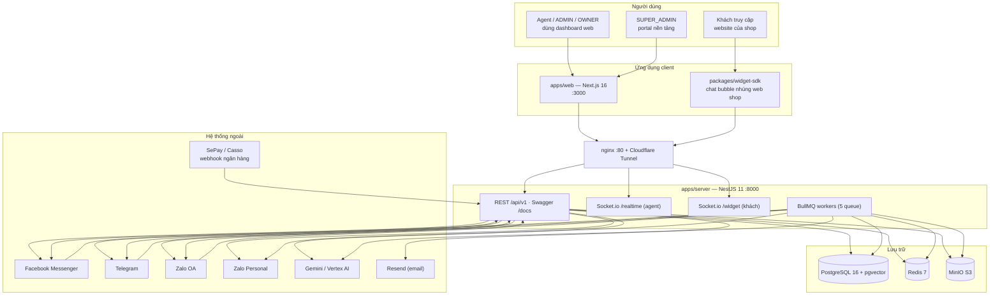

# 00 — Tổng quan hệ thống

> Mục tiêu: nhìn 5 phút nắm được Sales Copilot gồm những gì, ai dùng, các phần nối nhau ra sao. Toàn bộ nội dung derive trực tiếp từ code (cập nhật 2026-10-03) — đường dẫn file được dẫn nguồn để đối chiếu.

---

## 1. Hệ thống làm gì

Sales Copilot là nền tảng **thương mại hội thoại đa kênh (Omnichannel Conversational Commerce)** cho shop D2C: gom mọi tin nhắn (Facebook Messenger, Zalo OA, Zalo cá nhân, Telegram, Web Chat) về một inbox realtime; cho phép nhân viên tư vấn, tra kho, lên đơn và thu tiền VietQR ngay trong khung chat; và chạy AI Agent tự động bán hàng khi bật chế độ autopilot.

Ba khối nghiệp vụ chính (khớp cấu trúc module backend):

| Khối | Module backend | Làm gì |
| --- | --- | --- |
| **Omnichannel** | `omnichannel` | Kênh, hội thoại, tin nhắn, liên hệ, inbox, label, canned response, adapter từng kênh |
| **Commerce** | `commerce` | Sản phẩm/variant, kho (ledger), đơn hàng, VietQR, đối soát thanh toán |
| **Intelligence** | `intelligence` | AI Agent (Gemini), knowledge base + embedding, guardrail, comment guard |

Kèm hai lớp nền: **identity** (đăng nhập, workspace, thành viên, team, audit) và **platform-admin** (SUPER_ADMIN quản toàn hệ thống).

## 2. Sơ đồ tổng thể



Điểm mấu chốt về giao tiếp:

- **Web ↔ Server**: REST (envelope `{success, data, meta}`) + Socket.io hai namespace (`/realtime` cho agent, `/widget` cho khách).
- **Server nội bộ**: EventEmitter2 (in-process) cho domain events + BullMQ (Redis) cho việc nền — không có message bus ngoài.
- **Hệ thống ngoài → Server**: webhook HTTP, luôn ACK 200 ngay rồi xử lý nền qua queue.
- **Server → hệ thống ngoài**: gọi API kênh qua `ChannelAdapter`, gọi Gemini qua Vercel AI SDK.

## 3. Monorepo (Nx + pnpm)

```text
sales-copilot/
├── apps/
│   ├── server/                  # NestJS 11 — API, WebSocket, BullMQ worker, Prisma
│   │   ├── src/modules/         # 8 bounded context (xem 01-backend.md)
│   │   ├── src/infrastructure/  # Prisma, Redis, Queue, S3, Crypto, Email
│   │   ├── src/common/          # guards, pipes, filters, decorators dùng chung
│   │   └── prisma/              # schema.prisma (27 models, 20 enums) + migrations
│   └── web/                     # Next.js 16 App Router — dashboard + portal
│       └── src/features/        # code theo feature-slice (~298 files, xem 04-frontend.md)
├── packages/
│   ├── shared-contracts/        # Zod schema + types + event/queue constants — điểm kết nối FE/BE
│   ├── widget-sdk/              # chat widget (Vite IIFE → sdk.js, Shadow DOM)
│   └── email-templates/         # React Email template (hiện có: mời nhân viên)
├── config/nginx/                # dev.conf, prod.conf
├── config/cloudflared/          # tunnel config
├── docker-compose.dev.yml       # postgres (pgvector), redis, minio (+ profile tunnel: nginx, cloudflared)
├── docker-compose.prod.yml      # + db-migrate, server, web, nginx
└── docs/
    ├── system/                  # ← bộ tài liệu này
    ├── architecture/            # RFC đặc tả sâu từng domain (tham khảo thiết kế)
    ├── product/                 # PRD, vision
    ├── guides/                  # setup môi trường, testing, network flow
    └── audit/, backlog/         # biên bản kiểm toán, kế hoạch
```

`packages/shared-contracts` **là khớp nối trung tâm**: Zod schema (validate input backend), types (typing cho web), `DomainEvent`/`WsServerEvent` (tên event), queue names. Web import trực tiếp TS source qua tsconfig paths, không qua build step.

## 4. Runtime & hạ tầng

| Thành phần | Chi tiết |
| --- | --- |
| PostgreSQL 16 | image `pgvector/pgvector:pg16` — dữ liệu nghiệp vụ + vector 768 chiều cho knowledge |
| Redis 7 | BullMQ queues, distributed locks, presence, pub/sub cho Socket.io scaling, refresh tokens, AI debounce |
| MinIO | bucket `sales-copilot` — file đính kèm, avatar (public prefix `avatars`, `public`) |
| nginx | `/api/`, `/widget/`, `/docs`, `/socket.io/` → backend :8000; còn lại → web :3000 |
| Cloudflare Tunnel | `sales-copilot.kakadev.xyz` → nginx; `storage-sales-copilot.kakadev.xyz` → MinIO |

Chi tiết cấu hình: `docker-compose.dev.yml`, `config/nginx/dev.conf`, `config/cloudflared/config.yml`.

## 5. Ai dùng hệ thống — 2 tầng role

| Tầng | Role | Dùng gì |
| --- | --- | --- |
| Platform (`PlatformRole`) | `SUPER_ADMIN` | Portal `/platform-admin`: workspace, plan, feature flags, audit toàn nền tảng |
|  | `USER` | Đăng nhập workspace bình thường |
| Workspace (`WorkspaceRole`) | `OWNER` | Toàn quyền workspace + settings nhạy cảm (kênh, bank, thành viên, RBAC) |
|  | `ADMIN` | Quản trị nghiệp vụ, không xoá được tin nhắn (chỉ OWNER/ADMIN được `DELETE messages`) |
|  | `AGENT` | Inbox, contacts, products, orders — bị chặn khỏi `/dashboard` (redirect server-side) |

RBAC thực thi bằng chuỗi guards: `JwtAuthGuard` (global) → `WorkspaceGuard` (giải workspace + membership) → `RolesGuard` (`@Roles`). Chi tiết: [01-backend.md](./01-backend.md#6-auth--b%E1%BA%A3o-m%E1%BA%ADt).

## 6. Các luồng nghiệp vụ chính

Mỗi luồng được vẽ chi tiết bằng sequence diagram trong [02-data-flows.md](./02-data-flows.md):

1. **Tin nhắn vào** — webhook → ACK &lt;100ms → queue `channel-ingestion` → resolve contact → tạo/tìm conversation (+ auto-assign round-robin) → lưu message → bắn socket + AI + audit.
2. **Tin nhắn ra** — agent gửi từ web → transaction lưu message → listener bắn ra kênh qua adapter → cập nhật delivery status.
3. **AI autopilot** — tin khách vào → guardrail + debounce → queue `ai-autopilot` → agent Gemini gọi 10 tools (tra hàng, lên đơn, thu QR…) → trả lời với tư cách SYSTEM.
4. **Bán hàng + thu tiền** — draft order → confirm → sinh VietQR (EMVCo/NAPAS 247) → khách chuyển khoản → webhook ngân hàng → queue `commerce-reconciliation` → khớp đơn → `ORDER_PAID` → trừ kho + tin hệ thống trong chat.
5. **Comment Guard** — comment Facebook có SĐT → queue `comment-guard` → ẩn comment → private reply → kéo vào inbox.

## 7. Chỉ mục bộ tài liệu

| Tài liệu | Nội dung |
| --- | --- |
| [01-backend.md](./01-backend.md) | Kiến trúc backend: module, request pipeline, queue, event, WebSocket, auth |
| [02-data-flows.md](./02-data-flows.md) | Sequence diagram các luồng nghiệp vụ |
| [03-data-model.md](./03-data-model.md) | ERD, multi-tenancy, state machines, enums |
| [04-frontend.md](./04-frontend.md) | Cấu trúc code web, auth, data fetching, realtime |
| [05-frontend-pages.md](./05-frontend-pages.md) | Danh mục đầy đủ các page + ai truy cập |
| [06-integrations.md](./06-integrations.md) | Từng hệ thống ngoài: contract, bảo mật, quirks |
