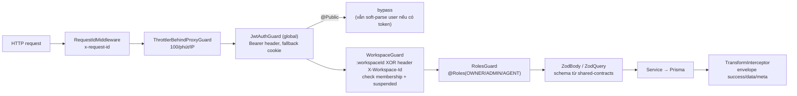
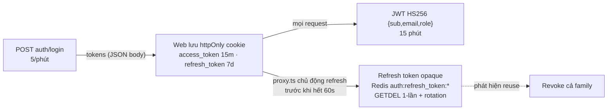

# 01 — Kiến trúc Backend (NestJS)

> Toàn bộ derive từ `apps/server` (cập nhật 2026-10-03).

---

## 1. Nguyên tắc tổ chức

- **Modular monolith** — 1 process duy nhất chứa API + WebSocket + BullMQ workers. Không có microservice; cross-instance chỉ scale qua Redis (Socket.io adapter, BullMQ).
- **Flow cứng: Controller → Service → Prisma.** Không có interface dư thừa (1 implementation = không tạo interface), trả Prisma model hoặc typed object. Validation input bằng Zod schema từ `@sales-copilot/shared-contracts`.
- **Co-location**: mỗi module gom controller/service/processor/listener trong cùng thư mục.
- Ghi tiền bạc/tồn kho **bắt buộc qua `prisma.$transaction`** — có thêm `TransactionContext` (AsyncLocalStorage) hỗ trợ post-commit/rollback hooks tại `src/infrastructure/database/prisma.service.ts`.

## 2. Bootstrap (`src/main.ts`, `src/app.module.ts`)

| Cấu hình | Giá trị | Ghi chú |
|:--|:--|:--|
| Global prefix | `api/v1` | loại trừ `widget/sdk.js` (phát widget SDK ở root) |
| Port | `PORT` (mặc định 8000) | |
| Swagger | `/docs` | chỉ khi `NODE_ENV !== 'production'` |
| Global guards | `ThrottlerBehindProxyGuard` → `JwtAuthGuard` | đăng ký qua `APP_GUARD`, thứ tự này |
| Rate limit toàn cục | 100 req/phút/IP | proxy-aware (CF-Connecting-IP → XFF) |
| Validation | `ValidationPipe` (whitelist) + `ZodBody`/`ZodQuery` per-route | Zod là cơ chế chính |
| Response | `TransformInterceptor` bọc `{success, data, meta?}`; `HttpExceptionFilter` bọc `{success:false, error:{code,message}}` | |
| Bảo mật | helmet (CSP chặt), CORS credentials, pino logger (redact token/cookie), `rawBody: true` (cần cho HMAC webhook), shutdown hooks | |
| Env | Zod-validated `src/config/env.schema.ts` — sai env là không boot | |
| WebSocket adapter | `RedisIoAdapter` (`src/infrastructure/redis/redis-io.adapter.ts`) — scale đa node, tự rớt về in-memory nếu mất Redis | |

## 3. Chuỗi xử lý một request

- **WorkspaceGuard** (`src/modules/identity/workspaces/guards/workspace.guard.ts`) là chốt multi-tenancy: nếu user thuộc đúng 1 workspace thì tự chọn, không thì báo `WORKSPACE_ID_REQUIRED`; inject `request.workspace = {workspaceId, role, workspace}`.
- Routes đa số **không** chứa `:workspaceId` trong path — tenancy chọn bằng header `X-Workspace-Id` (web luôn gửi qua `workspaceHeaders()`). Ngoại lệ: payment webhook có `:workspaceId` (nhận cả slug).

## 4. 8 module group (`src/modules/`)

| Module | Trách nhiệm | Thành phần chính |
|:--|:--|:--|
| `identity` | Đăng nhập/JWT/refresh, workspace, thành viên, team, audit-log workspace | `auth/`, `workspaces/`, `teams/`, `audit-logs/` (vừa lưu vừa nghe 10 events để tự ghi audit) |
| `omnichannel` | Toàn bộ side hội thoại + tích hợp kênh | `conversations/`, `messages/`, `contacts/`, `inboxes/`, `labels/`, `canned-responses/`, `integrations/` (adapter 5 kênh + webhook + ingestion) |
| `commerce` | Bán hàng | `products/`, `inventory/`, `orders/`, `payments/` (VietQR), `reconciliation/`, `webhooks/` (ngân hàng), `presence/` (lock soạn thảo 30s), `listeners/` (tin hệ thống trong chat khi đơn đổi trạng thái) |
| `intelligence` | AI | `ai-agent/` (service, worker, dispatcher, guardrail, discount-guard, 10 tools), `knowledge/` (RAG + embedding pgvector) |
| `platform-admin` | Portal SUPER_ADMIN | workspaces, metrics, audit-logs, system-settings — tất cả `@PlatformRoles(SUPER_ADMIN)` |
| `realtime` | Socket.io agent + presence | `realtime.gateway.ts`, `realtime-event.dispatcher.ts`, `presence.service.ts` |
| `dashboard` | KPI hôm nay theo timezone `Asia/Ho_Chi_Minh` | chỉ `GET dashboard/summary` (OWNER/ADMIN) |
| `health` | Liveness/readiness | check Prisma, Redis, S3, queue `channel-ingestion` + `comment-guard` |

Trong một module, quy ước đặt tên service theo việc: `order-writer` (ghi + event), `order-lifecycle` (chuyển trạng thái), `order-query` (đọc), `orders-calculator` (tiền), `order-status-guard` (assert transition) — tách thay vì God Method.

## 5. Bản đồ API surface (controller map)

Toàn bộ dưới `/api/v1`. Ký hiệu: 🔓 `@Public` (JWT bypass), [W] `WorkspaceGuard+RolesGuard` (tenancy), [R] giới hạn role.

| Controller | Prefix | Đặc điểm |
|:--|:--|:--|
| `AuthController` | `auth` | 🔓 register (5/phút), login (5/phút), refresh (10/phút), logout; `GET/PATCH auth/me`, change-password |
| `WorkspacesController` | `workspaces` | JWT-only list; `current` [W]; bank info [R OWNER/ADMIN] |
| `WorkspaceMembersController` | `workspaces/current/members` | [W] CRUD member [R OWNER/ADMIN khi ghi] |
| `TeamsController` | `teams` | [W] CRUD + members [R OWNER/ADMIN khi ghi] |
| `AuditLogsController` | `audit-logs` | [W][R OWNER/ADMIN] — chỉ đọc |
| `ConversationsController` | `conversations` | [W] list/counts/status/assign/priority/labels/`takeover`/`resume-ai` |
| `MessagesController` | *(rỗng — path khai ở method)* | [W] `conversations/:id/messages` GET/POST (20/phút, multipart), `messages/:id` PATCH delivery-status, DELETE [R OWNER/ADMIN] |
| `ContactsController` | `contacts` | [W] CRUD/search/identities; merge [R OWNER/ADMIN] |
| `InboxesController` (+members) | `inboxes` | [W] CRUD kênh/inbox; ghi [R OWNER/ADMIN] |
| `LabelsController` | `labels` | [W]; ghi [R OWNER/ADMIN] |
| `CannedResponsesController` | `canned-responses` | [W] CRUD |
| `WebhooksController` (kênh) | `channels` | 🔓 `GET/POST :channelId/webhook` (200/phút) — cổng ingestion mọi kênh |
| `FacebookController` | `integrations/facebook` | OAuth + 🔓 **central webhook** Meta (route từng page theo `entry[].id`) |
| `ZaloOaController` | `integrations/zalo` | OAuth OA, connect [R OWNER/ADMIN], 🔓 callback |
| `ZaloPersonalController` | `integrations/zalo-personal` | connect bằng QR login session, reauthorize [R OWNER/ADMIN] |
| `WebChatController` | `widget` | 🔓 class — `sdk.js`, `config`, `contact`, lịch sử hội thoại (auth bằng widget token) |
| `ProductsController` | `products` | [W] CRUD + nhập kho variant; DELETE [R OWNER/ADMIN] |
| `InventoryController` | `inventory` | [W] variants/summary/transactions, `adjust` |
| `OrdersController` | `orders` | [W] CRUD draft + `confirm/pay/cancel/complete` |
| `VietQrController` | `orders/:id/vietqr` | [W] sinh QR + đẩy card vào chat |
| `ReconciliationController` | `reconciliation` | [W] transactions/stats; manual-match [R OWNER/ADMIN] |
| `PaymentWebhooksController` | `workspaces/:workspaceId/webhooks/payments/:gateway` | 🔓 + `PaymentWebhooksGuard` (secret/HMAC) — SePay/Casso |
| `KnowledgeController` | `knowledge-articles` | [W] CRUD + test-search; ghi [R OWNER/ADMIN] |
| `PlatformWorkspacesController` | `platform-admin/workspaces` | [SUPER_ADMIN] list/plan/suspend |
| `PlatformAuditLogsController` | `platform-admin/audit-logs` | [SUPER_ADMIN] |
| `PlatformMetricsController` | `platform-admin/metrics` | [SUPER_ADMIN] overview toàn nền tảng |
| `SystemSettingsController` | `platform-admin/settings` | [SUPER_ADMIN] feature flags + quotas |
| `DashboardController` | `dashboard` | [W][R OWNER/ADMIN] summary |
| `HealthController` | `health` | 🔓 3 route |
| `PresenceController` | `presence` | JWT + tự check membership trong handler (REST presence hiện chết — xem gotchas) |

## 6. Auth & bảo mật

- **Access token**: JWT 15 phút, claims chỉ identity (không kèm workspace). Header `Authorization: Bearer` ưu tiên, fallback cookie `access_token`.
- **Refresh token**: không lưu DB — lưu Redis, xoay vòng mỗi lần dùng, phát hiện tái sử dụng là revoke cả family (`src/modules/identity/auth/token.service.ts`).
- **WS auth riêng**: handshake `/realtime` verify JWT thủ công trong `RealtimeGateway.handleConnection`; `/widget` dùng widget token (JWT khách, TTL 180 ngày).
- **Mã hoá**: credential kênh lưu AES-256-GCM `iv:authTag:ciphertext` (`src/infrastructure/crypto/channel-credential.service.ts`), key `CHANNEL_ENCRYPTION_KEY`; giải mã fail-closed về `{}`.
- **SystemSettings**: bảng `system_settings` + cache 3 tầng (RAM 30s → Redis 1h → DB) — chứa feature flags (`feature.ai_autopilot_enabled`) và quotas.
- **Tiện ích an toàn**: `ssrf-guard.ts` (chặn fetch IP nội bộ), `html-sanitizer.ts` (allowlist cho nội dung message), slug bỏ dấu tiếng Việt.

## 7. Việc nền — BullMQ

Tên queue là hằng số dùng chung tại `packages/shared-contracts/src/common/queues.ts`. Không có job lặp định kỳ trong BullMQ; cron duy nhất là dọn presence mỗi phút.

| Queue | Job đẩy từ | Processor | Concurrency | Việc |
|:--|:--|:--|:--|:--|
| `channel-ingestion` | `channel-webhooks/webhooks.service.ts` | `ChannelIngestionProcessor` | 5 | Chuẩn hoá webhook → contact → conversation → message (mục 3 trong 02-data-flows) |
| `comment-guard` | `facebook.controller.ts` (central webhook) | `CommentGuardProcessor` | BullMQ limit **180 job/giờ** (giới hạn API Facebook) | Ẩn comment có SĐT, private reply, tạo conversation |
| `commerce-reconciliation` | `payment-webhooks.controller.ts` | `CommerceReconciliationProcessor` | 5 | Đối soát giao dịch ngân hàng ↔ đơn (Redlock theo order) |
| `ai-autopilot` | `ai-dispatcher.listener.ts` | `AiAgentWorker` | 5 | Chạy agent Gemini (debounce 500ms theo conversation) |
| `knowledge-embedding` | `knowledge.service.ts` | `KnowledgeEmbeddingProcessor` | 3 | Embed article (text-embedding-004, vector 768) |

Job options mặc định: giữ job hoàn thành 1h/500 cái, lỗi 7 ngày/1000 cái; retries có backoff.

## 8. Event nội bộ (EventEmitter2)

Tên event **trùng chính xác** với tên WS event client nhận (cùng hằng số `DomainEvent` = `WsServerEvent` trong shared-contracts). Fan-out **in-process** — không có event bus bền; instance khác chỉ thấy qua Redis adapter của Socket.io.

| Nhóm | Events | Ai phát | Ai nghe |
|:--|:--|:--|:--|
| Message | `message.created/updated/deleted/delivery_status_updated` | `messages.service.ts` | **dispatcher → socket**, AI dispatcher, AI takeover, auto-assign (gián tiếp), outbound listener, audit |
| Conversation | `conversation.created/reopened/assigned/status_updated/priority_updated/labels_updated/updated` | `conversations.service.ts`, `messages.service.ts` | dispatcher, auto-assignment, AI takeover (reset khi RESOLVED) |
| Contact | `contact.created/updated/deleted/merged`, `channel_identity.created/deleted` | `contacts.service.ts`, `contact-resolution.service.ts` | dispatcher, audit |
| Channel | `channel.created/updated/deleted`, `channel.reauthorization_required` | `inboxes.service.ts`, `facebook.service.ts` | dispatcher, **lifecycle từng kênh** (đăng ký/hủy webhook bên provider), audit |
| Order/Tiền | `order.created/confirmed/paid/partially_paid/cancelled/completed`, `payment_transaction.*`, `inventory.updated` | `order-writer`, `order-lifecycle`, reconciliation, `stock-movement` | dispatcher, `commerce-event.listener` (đẩy tin SYSTEM vào chat) |
| WS nội bộ | `agent.connected/disconnected`, `agent.typing_*`, `workspace.suspended`, `widget.message`, `widget.visitor_typing` | gateways, presence | presence, gateway, dispatcher |

Listener then chốt: `src/modules/realtime/realtime-event.dispatcher.ts` — cầu mọi `DomainEvent` sang room Socket.io.

## 9. WebSocket — 2 gateway

| | Gateway `/realtime` | Gateway `/widget` |
|:--|:--|:--|
| File | `src/modules/realtime/realtime.gateway.ts` | `src/modules/omnichannel/integrations/web-chat/web-chat.gateway.ts` |
| Ai | Agent dashboard | Khách trên web shop |
| Auth handshake | JWT (auth.token / query / Bearer) | widget token → resolve Channel WEB_CHAT + Contact |
| Room | `user_{userId}`, `workspace_{workspaceId}`, `conversation_{conversationId}` | `widget:{channelId}:{contactId}` (và biến thể externalContactId) |
| Client → server | `join/leave_workspace`, `join/leave_conversation`, `start/stop_typing`, `heartbeat`, `commerce.editing_*` (lock soạn đơn) | `widget:send_message`, `widget:identify`, `widget:typing` |
| Server → client | `connected`, `error`, mọi `DomainEvent` (qua dispatcher), `commerce.collision_status`, `workspace_suspended` | `widget:connected/message/message_sent/identified/error` |

Payload client→server đều validate Zod từ shared-contracts; `{workspaceId}` do client gửi luôn bị verify lại quyền (chống cross-tenant).

## 10. Gotchas đáng nhớ

1. `MessagesController` khai `@Controller()` rỗng — path nằm ở method decorator; lệch với mọi controller khác.
2. REST `presence` routes đọc `@Param('workspaceId')` nhưng prefix không có param — thực chất presence chạy qua WS, 2 route đó chết.
3. `@Public()` vẫn soft-parse token — `request.user` có thể có sẵn trên route public.
4. Events phát **trong post-commit hook** của transaction — listener an toàn vì dữ liệu đã commit.
5. Zalo Personal không có webhook — chạy listener zca-js dài hạn trong process, tự đẩy tin của chính owner vào pipeline với `skipSignatureVerification`.
6. Idempotency xếp lớp: `ChannelEvent (channelId, externalEventId)` → BullMQ `jobId` deterministic → `Message (conversationId, externalId)`; payment: jobId `ws:gateway:txId` + `PaymentTransaction.idempotencyKey`.
