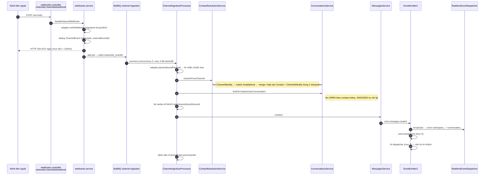
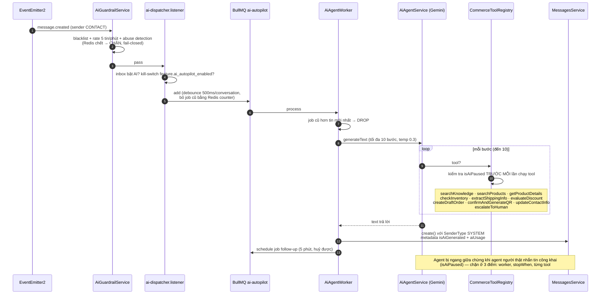
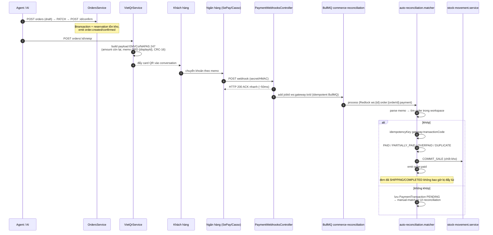
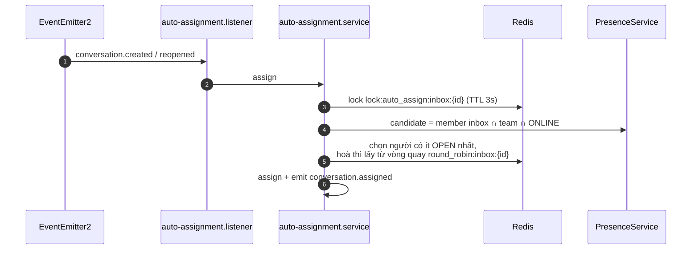
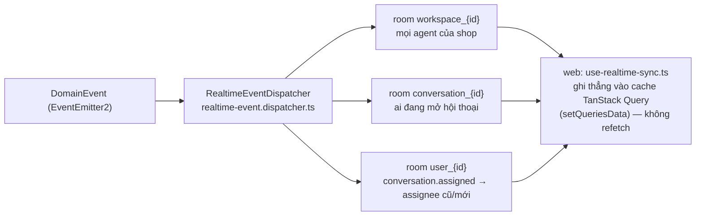

# 02 — Luồng dữ liệu & xử lý

> Sequence diagram các luồng nghiệp vụ chính, derive từ code (cập nhật 2026-10-03). Mỗi bước dẫn file trong cột actor.

---

## 1. Tin nhắn vào (inbound webhook → inbox)

Từ Facebook / Zalo OA / Telegram (webhook) — Web Chat đi đường khác (mục 6), Zalo Personal không có webhook (push từ listener nội bộ).



**Nhánh song song — Facebook Comment Guard:** central webhook `POST /integrations/facebook/webhook` (Meta yêu cầu 1 callback/app) thấy comment mới → queue `comment-guard` (limit 180/giờ) → nếu có SĐT Việt Nam: ẩn comment (`is_hidden`), private reply mời khách nhắn riêng, tạo conversation + message — `comment-guard.processor.ts`.

## 2. Tin nhắn ra (agent trả lời)

```mermaid
sequenceDiagram
    autonumber
    participant UI as Web (composer)
    participant API as messages.controller
    participant MS as MessagesService
    participant DB as PostgreSQL
    participant OL as OutboundMessageListener
    participant Q as BullMQ message-outbound
    participant P as OutboundDeliveryProcessor
    participant AD as ChannelAdapter kênh
    participant RT as Socket /realtime

    UI->>API: POST conversations/:id/messages<br/>multipart, 20/phút
    Note left of UI: UI đã chèn tin "optimistic" với clientTempId, hiển thị PENDING
    API->>MS: create()
    MS->>DB: transaction — Message (PENDING) + Attachment<br/>+ unread/auto-reopen/firstReply
    MS->>OL: emit message.created
    OL->>Q: add jobId out_{messageId}<br/>(attempts 5, backoff 5s)
    MS-->>UI: response trả về ngay (PENDING)
    Q->>P: process (concurrency 5)
    P->>P: lock lock:outbound:conv:{id} — giữ thứ tự<br/>theo conversation (contended → retry sau)
    P->>AD: sendMessage(channel, payload)<br/>attachments re-sign từ storagePath
    AD-->>P: kết quả
    P->>MS: markOutboundDelivery
    MS->>DB: externalId + SENT (hoặc FAILED + deliveryError)
    MS->>RT: emit message.delivery_status_updated<br/>→ UI chuyển PENDING → SENT/FAILED
    Note over P: lỗi provider → throw để BullMQ retry;<br/>lần cuối → FAILED (terminal)
```

Lưu ý: gửi đi là **async qua queue** — provider chậm không block request path; lỗi tạm thời được retry, lỗi chốt ghi `FAILED`. Tin AI/SYSTEM cũng đi qua `MessagesService.create()` nên vào queue như thường, trừ khi `metadata.suppressOutbound` (producer chặn).

## 3. AI autopilot



Chống lạm dụng chiết khấu: `DiscountGuardService` — `maxAllowed = min(total × maxDiscountPercent%, maxDiscountVnd)`, thiếu chính sách = cấm. Trích địa chỉ: tier 1 regex + `vietnam-divisions-js` (&lt;5ms); điểm tin cậy &lt; 70 thì tier 2 gọi LLM `generateObject` 5s, lỗi thì rớt về tier 1.

## 4. Bán hàng + thu tiền VietQR



Sau `order.paid`, `commerce-event.listener` tự nhắn tin SYSTEM vào conversation ("Đã nhận thanh toán…").

## 5. Auto-assignment (round-robin)



## 6. Web Chat (widget) — vào/ra không qua webhook

- **Khách gửi**: `widget-sdk` → Socket.io `/widget` event `widget:send_message` → `web-chat.gateway.ts` → tạo Contact/Conversation/Message như pipeline chuẩn (sender CONTACT) → ack `widget:message_sent` (echo `tempId` cho optimistic UI).
- **Shop trả lời**: tin ra qua queue `message-outbound` → `OutboundDeliveryProcessor` → `WebChatAdapter.sendMessage` *emit nội bộ* `widget:message` → gateway đẩy tới room của khách (idempotency theo `metadata.messageId` nên retry không phát trùng).
- **Auth khách**: widget token (JWT 180 ngày, `WIDGET_TOKEN_SECRET`); identify tuỳ chọn có HMAC signature.

## 7. Fan-out realtime (mọi luồng converge về đây)



Web nhận event nào phải khai ở 2 chỗ: `SocketEventPayloadMap` (shared-contracts) + `use-realtime-sync.ts` (apps/web).