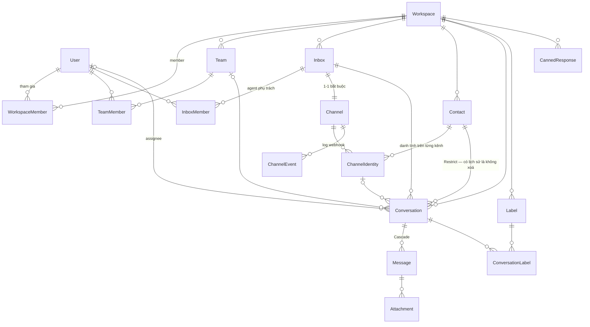
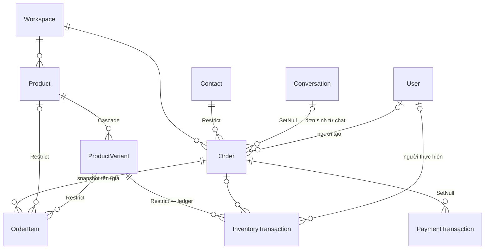
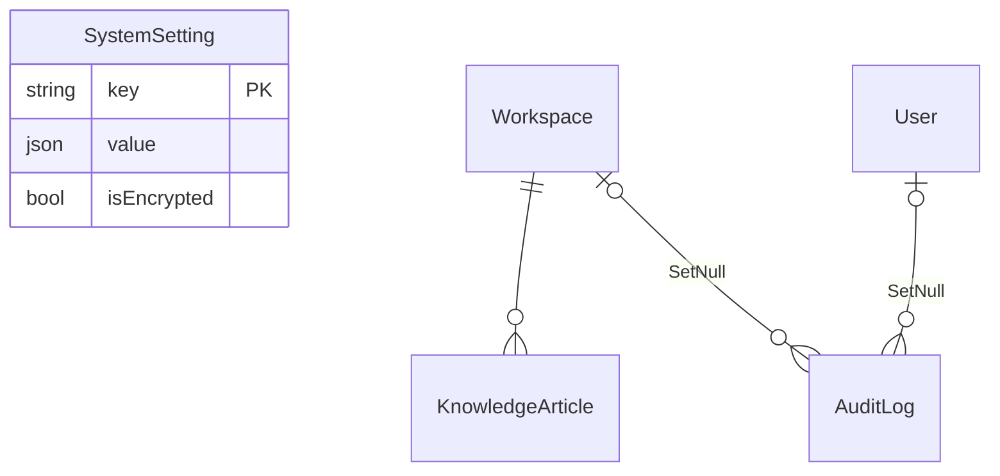
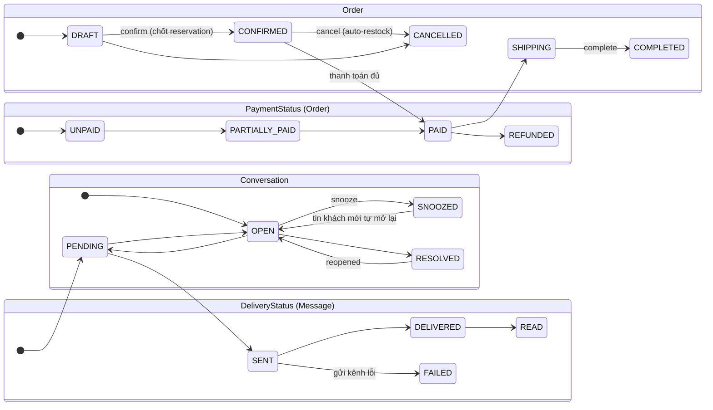

# 03 — Mô hình dữ liệu (Prisma / PostgreSQL)

> Derive từ `apps/server/prisma/schema.prisma`: **27 models, 20 enums**, PostgreSQL 16 + pgvector (cập nhật 2026-10-03).

---

## 1. ERD — Identity & Omnichannel

- `Inbox` = "hộp xử lý" có cài đặt riêng (auto-assignment, chính sách AI); `Channel` = kết nối 1 tài khoản mạng xã hội. **Inbox:Channel là 1-1** (`Channel.inboxId @unique`) — kênh không thể tồn tại thiếu inbox.
- `Contact` tách khỏi `ChannelIdentity` để hợp nhất đa kênh: 1 liên hệ, nhiều danh tính (mỗi kênh một `externalContactId`), merge bằng `ContactsService.merge`.
- `Message.senderId` **polymorphic không có FK** — ý nghĩa do `SenderType` (CONTACT/USER/SYSTEM) quyết định.
- `ChannelEvent` = log webhook append-only + dedup `@@unique([channelId, externalEventId])`, không có workspaceId (scope qua join Channel).

## 2. ERD — Commerce

- **Kho** nằm trên `ProductVariant`: `stockQuantity` + `reservedQuantity`. Mọi biến động ghi 1 dòng `InventoryTransaction` (ledger append-only, chỉ có `createdAt`) với before/after của cả stock lẫn reserved; `quantity` luôn dương, hướng tác động mã hoá trong `type`.
- `OrderItem` chụp tên + giá tại thời điểm bán (không đổi khi giá catalogue đổi).
- Tiền: `Decimal(15,2)`**, đơn vị VND nguyên bản** — không phải int cents.
- Khối địa chỉ nhận hàng nằm ngay trên `Order` (recipient + address), đi kèm `metadata`.

## 3. ERD — Platform & AI

- Không có bảng AI riêng — trạng thái AI nằm trên `Conversation` (`isAiPaused`, `lastAiMessageAt`, `lastContactMessageAt`, `waitingSince`, `firstReplyCreatedAt`, `customAttributes.aiUsage`); BYOK key nằm trong `Workspace.settings.llmCredentials`.
- `KnowledgeArticle.embedding` — vector **768 chiều** (pgvector), trạng thái embed theo `KnowledgeEmbeddingStatus`.
- Audit 2 tầng: `AuditLog` (workspace, FK nullable SetNull — log sống dai hơn user/workspace bị xoá) và `PlatformAuditLog` (toàn cục, không FK, denormalize actorEmail).

## 4. Multi-tenancy

- **18/27 models có cột** `workspaceId`. 9 model không có: `User`, `Workspace` (root), `TeamMember`/`InboxMember`/`ConversationLabel`/`Attachment` (scope qua parent FK), `ChannelEvent`, `SystemSetting`, `PlatformAuditLog` (toàn cục).
- Pattern phòng vệ: hầu hết bảng tenant có `@@unique([workspaceId, id])` — cho phép lookup tenant-scoped bằng `findUnique` thay vì `findFirst`.
- Thực thi ở app layer: `WorkspaceGuard` giải workspace mỗi request; mọi service nhận `workspaceId` từ `request.workspace` — **không** có RLS ở DB level.
- Index đều prefix workspace: ví dụ `Conversation @@index([workspaceId, status])`.

## 5. State machines

Bảo vệ chuyển trạng thái: `order-status-guard.ts` (assert trước khi confirm/sửa) + `reconciliation-shared.ts` (thanh toán đến trễ không bao giờ đẩy lùi SHIPPING/COMPLETED). Payment đối soát ngoài state Order: `PaymentTransactionStatus = PENDING | SUCCESS | FAILED | EXPIRED | CANCELLED`.

## 6. Enums chính (giá trị gốc)

| Enum | Giá trị |
| --- | --- |
| `PlatformRole` | SUPER_ADMIN, USER |
| `WorkspaceRole` | OWNER, ADMIN, AGENT |
| `BillingPlanType` | FREE, STANDARD, ENTERPRISE |
| `ChannelType` | FACEBOOK_MESSENGER, ZALO, ZALO_PERSONAL, TELEGRAM, EMAIL, WEB_CHAT |
| `ConversationStatus` | OPEN, RESOLVED, PENDING, SNOOZED |
| `ConversationPriority` | URGENT, HIGH, MEDIUM, LOW |
| `SenderType` | CONTACT, USER, SYSTEM |
| `MessageType` | INCOMING, OUTGOING, ACTIVITY *(TEMPLATE đã xoá — không có producer)* |
| `MessageContentType` | TEXT, IMAGE, VIDEO, AUDIO, FILE |
| `DeliveryStatus` | PENDING, SENT, DELIVERED, READ, FAILED |
| `OrderStatus` | DRAFT, CONFIRMED, PAID, SHIPPING, COMPLETED, CANCELLED |
| `PaymentStatus` | UNPAID, PARTIALLY_PAID, PAID, REFUNDED |
| `FulfillmentStatus` | UNFULFILLED, PROCESSING, SHIPPED, DELIVERED, RETURNED, CANCELLED |
| `PaymentMethod` | VIETQR, BANK_TRANSFER, COD, CASH, CREDIT_CARD, OTHER |
| `PaymentGateway` | SEPAY, CASSO, MANUAL *(VNPAY/MOMO đã xoá — chưa có tích hợp)* |
| `PaymentTransactionStatus` | PENDING, SUCCESS, FAILED, EXPIRED, CANCELLED |
| `InventoryTransactionType` | STOCK_IN, STOCK_OUT, RESERVATION, RELEASE_RESERVATION, COMMIT_SALE, RETURN_RESTOCK, INVENTORY_AUDIT |
| `DiscountType` | PERCENTAGE, FIXED_AMOUNT |
| `FileType` | IMAGE, AUDIO, VIDEO, FILE |
| `KnowledgeEmbeddingStatus` | PENDING, PROCESSING, READY, FAILED |

## 7. Ràng buộc unique đáng nhớ

| Mục đích | Constraint |
| --- | --- |
| Idempotency webhook kênh | `ChannelEvent (channelId, externalEventId)` |
| Idempotency tin nhắn khi retry | `Message (conversationId, externalId)` |
| Idempotency thanh toán | `PaymentTransaction (workspaceId, idempotencyKey)` — key `gateway:transactionCode` |
| Mã hiển thị | `Conversation (workspaceId, displayId)`, `Order (workspaceId, displayId)` + `(workspaceId, orderNumber)` — `displayId` là **autoincrement toàn cục**, chỉ unique trong workspace (số thứ tự rò rỉ tổng số dòng giữa các tenant) |
| Kênh | `(workspaceId, channelType, providerAccountId)`, `ChannelIdentity (channelId, externalContactId)` |
| Catalogue | `Product (workspaceId, sku)`, `(workspaceId, slug)`, `ProductVariant (workspaceId, sku)` |
| Membership | `(workspaceId, userId)`, `(teamId, userId)`, `(inboxId, userId)` |

## 8. Trường JSON được dùng thật

| Trường | Nội dung |
| --- | --- |
| `Workspace.settings` | `paymentSettings` (bankBin, accountNumber, webhookSecret…), `llmCredentials.geminiApiKey` (BYOK), `features` |
| `Channel.credentials` | credential provider **mã hoá AES-256-GCM** |
| `Channel.settings` | cài đặt kênh (vd: bật `commentGuard`) |
| `Inbox.settings` | chính sách AI theo inbox (`aiCommercePolicy`: enabled, maxDiscountPercent/Vnd, personaTone, followUp…) |
| `Conversation.customAttributes` | `aiUsage` (roll-up token usage) |
| `Message.metadata` | `clientTempId` (optimistic UI), `isAiGenerated`, `aiDebug`, `suppressOutbound`, `deliveryError` |
| `Product.images` / `ProductVariant.attributes` | danh sách ảnh / {"size","color"} |
| `PaymentTransaction.rawWebhookPayload` | payload gốc từ ngân hàng |

## 9. Quyết định mô hình (ADR rút gọn)

**displayId giữ sequence toàn cục** (chốt 2026-10-03). `Conversation.displayId` và `Order.displayId` là autoincrement toàn bảng, chỉ unique per-workspace — tenant A có thể suy ra tổng số dòng hệ thống qua số thứ tự.

- **Chấp nhận**: độ nhạy thông tin thấp (chỉ "quy mô"), đổi sang đánh số per-workspace đòi hỏi bảng counter + cấp số trong transaction, sửa parsing memo VietQR (`ORD {displayId}`, `DH${displayId}` của AI), đối soát ngân hàng và ~8 file test — rủi ro chạm luồng tiền không tương xứng lợi ích.
- **Xem lại khi**: khách hàng yêu cầu bảo mật số liệu quy mô, hoặc số tenant tăng lớn.

**MessageType × SenderType là 2 trục vuông góc, không merge.** MessageType = hướng tin (INCOMING/OUTGOING/ACTIVITY); SenderType = tác giả (CONTACT/USER/SYSTEM). AI trả lời với tư cách SYSTEM+OUTGOING — merge sẽ misclassify. `TEMPLATE` đã xoá (không có producer/consumer nào).

## 10. Gotchas

1. Tiền là `Decimal(15,2)` chứ không phải integer — VND thực tế không có số lẻ.
2. `KnowledgeArticle` là model duy nhất không `@@map` — tên bảng PascalCase giữa rừng snake_case.
3. `ZALO_PERSONAL` là ChannelType riêng, khác `ZALO` (OA/doanh nghiệp) — thêm bởi migration `20261002000000`.
4. `ChannelEvent` không có `workspaceId` — query phải join qua `Channel`.
5. Không có RLS/row-level policy ở DB: multi-tenancy là trách nhiệm của guard + service layer.