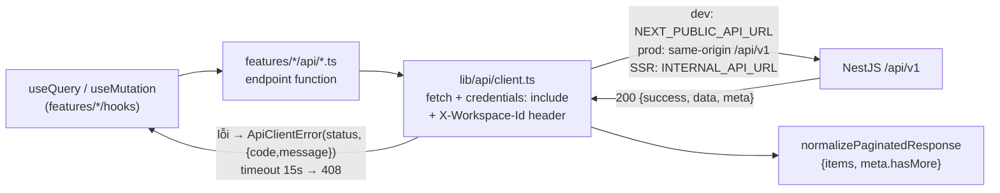
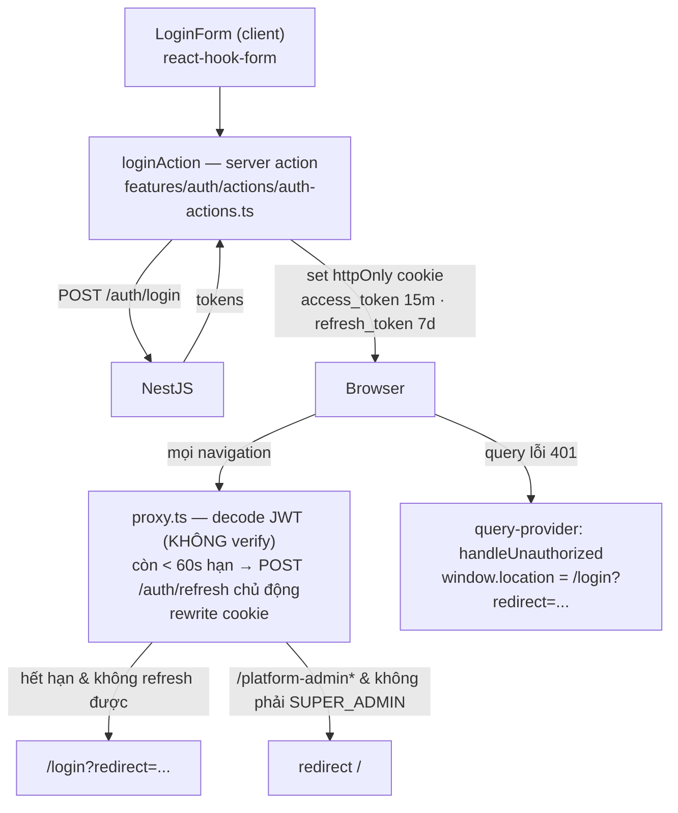
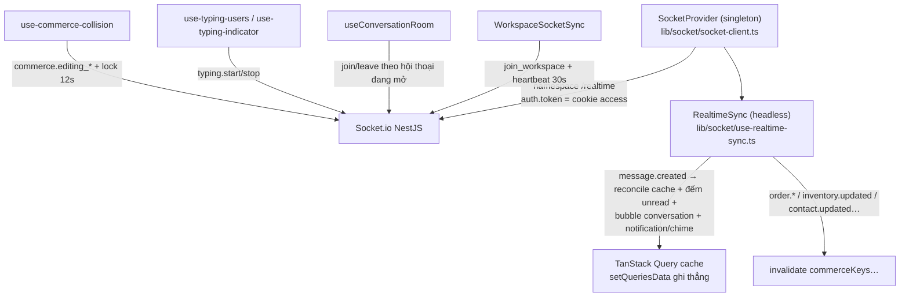
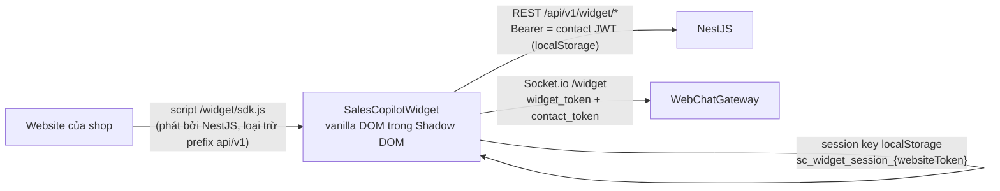

# 04 — Kiến trúc Frontend (Next.js)

> Derive từ `apps/web` (~420 file TS/TSX) và `packages/widget-sdk` (cập nhật 2026-10-03).

---

## 1. Stack & nguyên tắc

Next.js **16.3.8** App Router (standalone) · React 19 · Tailwind CSS v4 · shadcn/ui · TanStack Query v5 · socket.io-client · react-hook-form + zod. **Không có i18n** — copy tiếng Việt hardcode; **không có route handler** (`src/app/api` không tồn tại) — toàn bộ API là NestJS.

Ba nguyên tắc chi phối tổ chức code:

1. **`page.tsx` là vỏ mỏng**: server component chỉ làm (a) redirect theo auth/role, (b) render đúng 1 component `*View` client. Logic nằm ở `src/features/<domain>/`.
2. **Feature-sliced**: mỗi domain tự chứa `api/` (hàm gọi REST), `hooks/` (TanStack Query), `components/`, `__tests__/`.
3. **Server state = TanStack Query** — không useEffect fetch; **realtime-first**: socket ghi thẳng vào cache, ít refetch.

## 2. Cấu trúc thư mục `apps/web/src`

```text
src/
├── app/                      # Chỉ 3 route group: (auth) · (platform-admin) · (workspace)
│   ├── page.tsx              # Server redirector: cookie → role → /{slug}/conversations hoặc dashboard
│   ├── (auth)/               # login, register, 2 trang callback OAuth kênh
│   ├── (platform-admin)/     # 5 trang SUPER_ADMIN
│   └── (workspace)/          # [workspaceSlug]/... — toàn bộ app nghiệp vụ
├── features/                 # ~298 file — trái tim app
│   ├── auth/                 # actions/ (server action ghi cookie), hooks/, components/
│   ├── conversations/        # 59 file: api, list, thread, composer, detail, layout
│   ├── commerce/             # 56: products, inventory, orders, reconciliation, shared
│   ├── contacts/             # 11
│   ├── dashboard/            # 5
│   ├── platform-admin/       # 37
│   └── settings/             # 123: members, teams, rbac, inboxes (kênh), knowledge, bank, labels, canned-responses, general
├── components/
│   ├── ui/                   # 40 shadcn primitives + custom (message, bubble, attachment, presence-indicator…)
│   └── ...                   # data-table, layout/workspace-header, oauth callback dùng chung
├── lib/
│   ├── api/client.ts         # fetch wrapper (mục 3)
│   ├── api/pagination.ts     # normalizePaginatedResponse
│   ├── query-keys.ts         # factory query key — MỘT file duy nhất
│   ├── socket/               # singleton client, provider, use-socket, realtimesync, cache-helpers
│   └── auth/edge-jwt.ts      # decode JWT cho proxy (không verify)
├── providers/                # query-provider, theme, workspace-provider, workspace-client-providers
├── hooks/                    # use-mobile, use-copy-to-clipboard (hook UI chung)
└── proxy.ts                  # middleware của Next 16 (không phải middleware.ts)
```

## 3. Luồng một request từ UI



- Auth browser = **cookie httpOnly** (`credentials: 'include'`), không gắn Bearer thủ công. Multi-tenancy = header `X-Workspace-Id` từ `workspaceHeaders()` — quên header là nhận sai workspace data.
- Envelope: thành công `{success, data, meta?}`, lỗi `{success:false, error:{code,message}}` — parse ở `client.ts`.
- Request body gửi đi validate bằng zod schema contract (backend từ chối trước khi chạm service).

## 4. Auth & phiên đăng nhập



- `proxy.ts` là file middleware của Next 16 (export `proxy()`); JWT chỉ **decode** ở Edge — ranh giới tin cậy là NestJS API.
- Server component (`page.tsx`, `[workspaceSlug]/page.tsx`, `dashboard/page.tsx`) đọc lại cookie + role để redirect — phòng thủ tầng 2. AGENT bị đẩy khỏi `/dashboard` ở **3 chỗ**.
- Logout = `logoutAction` xoá cả 2 cookie. Session client = `useCurrentUser` (`['auth','me']`, staleTime 5 phút); workspace hiện tại = `useWorkspaceContext` (match slug từ danh sách workspace).
- OAuth Facebook/Zalo (kết nối kênh, không phải đăng nhập): popup → trang callback `(auth)/auth/*/callback` → BroadcastChannel `*_oauth_channel` + localStorage → trang gốc tự đóng popup.

## 5. Server state — TanStack Query

| Quy ước | Chi tiết |
|:--|:--|
| Defaults (`providers/query-provider.tsx`) | `staleTime` 30s, `refetchOnWindowFocus: false`, không retry 4xx/409, retry ≤ 2 lần với 5xx |
| Query keys | Một file `lib/query-keys.ts`: factory theo domain (`conversationKeys`, `commerceKeys`, `inboxKeys`, `platformAdminKeys`…) — key luôn nhúng `workspaceId` + toàn bộ DTO filter (kể cả tab/search) → cache phân theo filter |
| Pagination | `useInfiniteQuery` + `meta.hasMore`; chuẩn hoá shape cũ/mới bằng `normalizePaginatedResponse` |
| Mutation | `onSuccess`: toast + `invalidate` theo prefix key (vd `invalidateOrderQueries()` làm mới orders + products + inventory); `onError`: toast |
| Optimistic | Tin nhắn: chèn tin tạm `clientTempId` vào cache infinite → socket/ACK `reconcileOrAppendMessage` khớp theo id server / `metadata.clientTempId` / prefix `temp-` (`lib/socket/cache-helpers.ts`); lỗi → đánh dấu FAILED trong cache |
| RSC | Chỉ 3 chỗ fetch trực tiếp (workspace resolution); mọi data nghiệp vụ fetch client-side |

## 6. Realtime



- Reconnect: 10 lần backoff 1→30s; lỗi `UNAUTHORIZED` → `refreshSessionAction()` rồi connect lại (giới hạn 2 lần); hồi sinh khi tab visible/online lại.
- **Thêm event mới phải sửa 2 file**: `SocketEventPayloadMap` (shared-contracts) + `use-realtime-sync.ts` (web). Envelope `{event, data}` được unwrap trong `useSocketEvent`.
- Presence: `presence.updated` → cache `presenceKeys`; dọn dẹp khi unmount có delay 200ms chống remount churn.

## 7. Component & style conventions

- shadcn primitives ở `components/ui/` (40 file, có cả custom như `message.tsx`, `bubble.tsx`) — **kiểm tra trước khi tạo component mới** (rule AGENTS.md).
- Semantic tokens Tailwind (oklch) — không màu hardcode.
- Forms: react-hook-form + zodResolver (schema zod local, tham khảo contract types).
- Data table: wrapper TanStack Table ở `components/data-table/`.
- Danh sách hội thoại ảo hoá bằng `react-virtual`.

## 8. Widget SDK (`packages/widget-sdk`)



- Build Vite IIFE → `dist/sdk.js` — **phải `nx build widget-sdk` trước khi server phát được**.
- API public: `init`, `setUser`, `setCustomAttributes`, `sendMessage`, `open/close/toggle`, `on/off` (`ready`, `message:sent/received`, `typing:*`, `identified`…).
- Demo trang nhúng: `apps/web/public/test-chat.html`.
