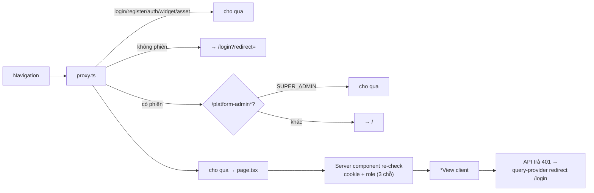

# 05 — Danh mục trang (Pages)

> Toàn bộ route của `apps/web/src/app`, resolve URL thật (route group không xuất hiện trong URL) — derive từ code (cập nhật 2026-10-03). Route group: `(auth)` · `(platform-admin)` · `(workspace)`.

---

## 1. Public & xác thực — group `(auth)`

| URL | File | Màn hình |
|:--|:--|:--|
| `/login` | `(auth)/login/page.tsx` | Đăng nhập (đọc `?redirect=` an toàn cùng origin) |
| `/register` | `(auth)/register/page.tsx` | Đăng ký shop (tạo workspace + OWNER cùng lúc) |
| `/auth/facebook/callback` | `(auth)/auth/facebook/callback/page.tsx` | Popup callback OAuth Facebook → BroadcastChannel về trang gốc |
| `/auth/zalo/callback` | `(auth)/auth/zalo/callback/page.tsx` | Popup callback OAuth Zalo OA |

## 2. Root

| URL | File | Hành vi |
|:--|:--|:--|
| `/` | `app/page.tsx` | Server component: đọc cookie → gọi `/workspaces` → redirect AGENT → `/{slug}/conversations`, còn lại → `/{slug}/dashboard`; không token → `/login` |
| 404 | `app/not-found.tsx` | Trang ghost 404 tiếng Việt |

## 3. Portal SUPER_ADMIN — group `(platform-admin)` (yêu cầu `PlatformRole.SUPER_ADMIN`)

Guard 2 lớp: `proxy.ts` chặn navigation + các trang tự check. Layout: `AdminSidebar` + `AdminHeader`.

| URL | File | Màn hình |
|:--|:--|:--|
| `/platform-admin` | `platform-admin/page.tsx` | Overview: KPI cards + shortcut (`usePlatformMetricsOverview`) |
| `/platform-admin/workspaces` | `platform-admin/workspaces/page.tsx` | Bảng mọi workspace: search/filter plan/status, suspend, đổi plan |
| `/platform-admin/workspaces/[id]` | `platform-admin/workspaces/[id]/page.tsx` | Chi tiết 1 workspace + action plan/suspend |
| `/platform-admin/audit-logs` | `platform-admin/audit-logs/page.tsx` | Audit nền tảng, filter theo URL searchParams, dialog xem diff |
| `/platform-admin/settings` | `platform-admin/settings/page.tsx` | Feature flags + quotas, nút resync cache |

## 4. App nghiệp vụ — group `(workspace)`, URL `/{workspaceSlug}/...`

`[workspaceSlug]/page.tsx` là redirector theo role. Layout workspace mount `WorkspaceProvider` + `WorkspaceSocketSync` + header; từng section có sidebar riêng.

| URL | File | Màn hình | Ai dùng |
|:--|:--|:--|:--|
| `/{slug}/dashboard` | `(overview)/dashboard/page.tsx` | KPI hôm nay (timezone `Asia/Ho_Chi_Minh`) | OWNER, ADMIN (AGENT bị redirect server-side) |
| `/{slug}/conversations` | `(conversations)/conversations/page.tsx` | Inbox: layout 2 pane (danh sách + thread) | mọi role |
| `/{slug}/conversations/[conversationId]` | `(conversations)/conversations/[conversationId]/page.tsx` | Như trên + hội thoại đang chọn | mọi role |
| `/{slug}/contacts` | `(conversations)/contacts/page.tsx` | CRM liên hệ (list, merge) | mọi role (merge cần OWNER/ADMIN ở API) |
| `/{slug}/products` | `(commerce)/products/page.tsx` | Catalogue sản phẩm + variant | mọi role (ghi cần role tương ứng ở API) |
| `/{slug}/orders` | `(commerce)/orders/page.tsx` | Danh sách đơn + luồng confirm/pay/cancel/complete | mọi role |
| `/{slug}/inventory` | `(commerce)/inventory/page.tsx` | Tồn kho variant, summary, ledger giao dịch | mọi role |
| `/{slug}/reconciliation` | `(commerce)/reconciliation/page.tsx` | Giao dịch ngân hàng + manual-match | mọi role (manual-match cần OWNER/ADMIN ở API) |
| `/{slug}/settings` | `(settings)/settings/page.tsx` | Index/redirect settings | — |
| `/{slug}/settings/general` | `.../settings/general/page.tsx` | Thông tin workspace | OWNER, ADMIN |
| `/{slug}/settings/members` | `.../settings/members/page.tsx` | Thành viên + role | OWNER, ADMIN |
| `/{slug}/settings/teams` | `.../settings/teams/page.tsx` | Team + phân công inbox | OWNER, ADMIN |
| `/{slug}/settings/labels` | `.../settings/labels/page.tsx` | Label hội thoại | OWNER, ADMIN |
| `/{slug}/settings/canned-responses` | `.../settings/canned-responses/page.tsx` | Canned response (macro `/`) | mọi role xem, ghi theo API |
| `/{slug}/settings/knowledge` | `.../settings/knowledge/page.tsx` | Knowledge base + test search AI | xem mọi role, ghi OWNER/ADMIN |
| `/{slug}/settings/bank` | `.../settings/bank/page.tsx` | Tài khoản ngân hàng (VietQR + webhook secret) | OWNER, ADMIN |
| `/{slug}/settings/inboxes` | `.../settings/inboxes/page.tsx` | Danh sách kênh/inbox | OWNER, ADMIN |
| `/{slug}/settings/inboxes/new` | `.../settings/inboxes/new/page.tsx` | Wizard kết nối kênh: facebook · telegram · web-chat · zalo · zalo-personal | OWNER, ADMIN |
| `/{slug}/settings/inboxes/[inboxId]` | `.../settings/inboxes/[inboxId]/page.tsx` | Cấu hình inbox + tab AI settings (persona, discount, follow-up) | OWNER, ADMIN |

Phân quyền chi tiết từng API ở [01-backend.md](./01-backend.md#5-bản-đồ-api-surface-controller-map).

## 5. Tài sản public & widget

| Đường | File | Ghi chú |
|:--|:--|:--|
| `/widget/sdk.js` | phát bởi **NestJS** (`WebChatController`), không phải Next | loại trừ khỏi prefix `api/v1`; build từ `packages/widget-sdk` |
| `/test-chat.html` | `apps/web/public/test-chat.html` | trang demo nhúng widget |
| `/widget`, `/brand`, `/channels`, `/sounds` | static assets | whitelist trong `proxy.ts` |

## 6. Cơ chế bảo vệ route (tổng hợp)

Lưu ý: route group nhiều tầng làm đường dẫn file dài (`(workspace)/[workspaceSlug]/(settings)/settings/...`) nhưng URL gọn; `/settings` nằm trong `[workspaceSlug]` — không phải root-level.
