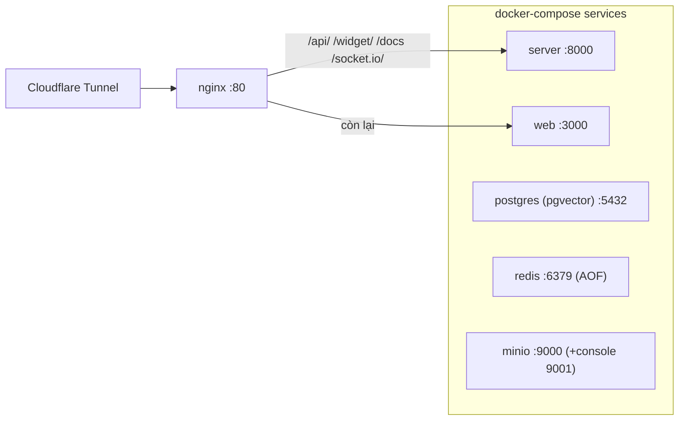

# 06 — Tích hợp hệ thống ngoài

> Derive từ `apps/server/src/modules/omnichannel/integrations/`, `commerce/`, `intelligence/` và hạ tầng (cập nhật 2026-10-03). Đây là nơi duy nhất dùng **Strategy/Adapter Pattern** bắt buộc của dự án.

---

## 1. ChannelAdapter — hợp đồng chung mọi kênh

`channel-adapter.interface.ts` + `channel-adapter.types.ts`:

| Thành viên | Vai trò |
|:--|:--|
| `channelType: ChannelType` | định danh |
| `verifyWebhook(request, credentials)` | xác thực chữ ký webhook (timing-safe) |
| `handleCallbackVerification?(rawBody)` | handshake POST kiểu echo (Zalo dùng) |
| `parseInboundPayload(rawBody, headers)` | chuẩn hoá thành `InboundMessagePayload[]` |
| `sendMessage(channel, message)` | gửi ra provider |
| `getChannelInfo(channel)` / `fetchSenderInfo?(channel, externalId)` | metadata kênh / enrich người gửi |

`ChannelAdapterRegistry` (`channel-adapter.registry.ts`) là Map runtime — mỗi channel module tự `registry.register(adapter)` trong `onModuleInit`. Thêm kênh mới = viết 1 adapter + 1 module, pipeline ingestion/không đổi.

## 2. Bảng 5 kênh đã triển khai

| | Facebook Messenger | Telegram | Zalo OA | Zalo Personal | Web Chat |
|:--|:--|:--|:--|:--|:--|
| Adapter | `facebook.adapter.ts` | `telegram.adapter.ts` | `zalo.adapter.ts` | `zalo-personal.adapter.ts` | `web-chat.adapter.ts` |
| Vào bằng | Webhook (per-channel **và** central Meta webhook) | Webhook | Webhook (route chung) | **Listener zca-js trong process** — không webhook | Socket.io `/widget` + REST widget |
| Xác thực vào | HMAC-SHA256 raw body `X-Hub-Signature-256` | Header `X-Telegram-Bot-Api-Secret-Token` — **không có secret = từ chối** | sha256(app_id+body+timestamp+secret) + freshness window + echo `oa_callback_verify` | — (luôn false, fail-closed) | widget token JWT + HMAC identify tuỳ chọn |
| Gửi ra | Text, media (Graph API), HUMAN_AGENT tag vượt cửa sổ 24h, typing/mark_seen, ẩn comment, private/public reply | Text (HTML, fallback plain), media theo `file_id`, sticker→IMAGE | Text/image/audio qua CS API (cửa sổ 7 ngày) — **file/video không hỗ trợ** | Text + media qua zca-js (tải bytes, tính kích thước ảnh), rate limiter riêng | Emit nội bộ `widget:message` → gateway đẩy khách |
| Đặc thù | 2 mặt webhook (per-channel + central theo `entry[].id`), token trang kết nối qua OAuth batch | `setWebhook` lifecycle tự động theo event `channel.*` | Refresh token **single-use xoay vòng** — `zalo-oa-token.service.ts` single-flight, mất là gãy kênh | QR login session dài hạn, tự nạp tin owner gửi (`skipSignatureVerification`), reconnect supervision | SDK build từ `packages/widget-sdk` |

## 3. Bảo mật webhook — tổng hợp

| Cổng | Cơ chế |
|:--|:--|
| `POST /channels/:channelId/webhook` | chữ ký theo adapter (bảng trên), throttle 200/phút |
| `POST /integrations/facebook/webhook` | secret nền tảng `FB_APP_SECRET`/`FB_VERIFY_TOKEN`, route từng page → channel, delegation với `skipSignatureVerification: true` (đã verify trung tâm) |
| `POST /workspaces/:id/webhooks/payments/:gateway` | `PaymentWebhooksGuard`: `secure-token`/`x-api-key`/`Authorization` hoặc HMAC `{timestamp}.{rawBody}` — timing-safe, secret có thể mã hoá AES-GCM |
| Yêu cầu hạ tầng | `rawBody: true` ở NestFactory — serialize lại body là gãy HMAC |

## 4. Idempotency (xếp lớp, mỗi tầng một lưới)

1. **Webhook**: `ChannelEvent (channelId, externalEventId)` unique; thiếu event id → hash SHA-256 payload làm id.
2. **Queue**: BullMQ jobId deterministic (`channelId_eventId`; payment `ws:gateway:txId`) — job trùng không chạy lại.
3. **DB**: `Message (conversationId, externalId)`; `PaymentTransaction (workspaceId, idempotencyKey = gateway:transactionCode)`.
4. **Concurrence**: Redlock Redis `ws:{ws}:order:{orderId}:payment` chia sẻ giữa webhook reconciliation, manual-match và payOrder.

## 5. AI — Gemini qua Vercel AI SDK

**Chọn provider** (`ai-provider.resolver.ts`): BYOK workspace → Vertex AI → platform `GEMINI_API_KEY`. Model mặc định `gemini-2.5-flash`.

**Chất điều độ (thực tế trong code):** autopilot bật/tắt **theo inbox** (`aiCommercePolicy.enabled`) + kill-switch nền tảng (`feature.ai_autopilot_enabled`); **không có enum "4 chế độ automation"** như docs cũ từng ghi — giá trị 4 gần nhất là `personaTone` (`shop_ban`, `em_anh_chi`, `minh_ban`, `chuyen_vien`); kèm follow-up delay + human takeover.

**10 tools của agent** (`tools/commerce-tool.registry.ts`, workspaceId inject qua closure, chặn takeover trước mỗi lần chạy):

| Tool | Làm gì |
|:--|:--|
| `searchKnowledge` | RAG pgvector (text-embedding-004, ngưỡng 0.65, top 3, ≤500 article/workspace) |
| `searchProducts`, `getProductDetails`, `checkInventory` | tra catalogue + tồn kho |
| `extractShippingInfo` | tier 1 regex + divisions (<5ms) → điểm tin cậy < 70 thì tier 2 LLM 5s |
| `evaluateDiscount` | qua `DiscountGuardService`: `min(total×%, maxVnd)` — thiếu policy = cấm |
| `createDraftOrder`, `confirmAndGenerateQR` | lên đơn + đẩy card VietQR |
| `updateContactInfo` | cập nhật SĐT/địa chỉ liên hệ |
| `escalateToHuman` | set `isAiPaused` + nhường agent |

**Van tay (guardrail) — fail-closed khi mất Redis** (`ai-guardrail.service.ts`): blacklist regex, 5 tin/phút (cảnh báo rồi chặn), phát hiện spam (3 tin ≤2 ký tự liên tiếp). Debounce Redis counter tăng dần — job cũ hơn tin mới nhất bị drop, không bao giờ chạy trùng.

**Comment Guard** (Facebook): queue riêng limit 180 giờ — ẩn comment có SĐT Việt Nam → private reply (template `{customer_name}`, `{page_name}`) → public reply tuỳ chọn → tạo conversation.

## 6. Thanh toán

- **VietQR** (`vietqr.service.ts`): tự dựng payload **EMVCo MPM / NAPAS 247** — Tag 38 GUID `A000000727`, Tag 53 VND, merchant name bỏ dấu ≤25 ký tự, memo ≤25 (`ORD {displayId}`; VietinBank phải prefix `SEVQR`), CRC-16/CCITT-FALSE. Số tiền = còn lại (`totalAmount - paidAmount`). Fallback ảnh QR `img.vietqr.io`.
- **Ngân hàng vào** (SePay, Casso): normalize 2 dạng envelope, bỏ giao dịch `out`/không dương, ACK ~50ms → queue đối soát. Gateway enum có `VNPAY`/`MOMO`/`MANUAL` nhưng **chưa có code tích hợp tương ứng**.
- **Đối soát**: parse memo (`ORD-YYYYMMDD-NNNN`) → Redlock → idempotency → PAID/PARTIALLY_PAID/OVERPAID/DUPLICATE/CANCELLED_NEEDS_REFUND; không khớp → `PENDING` chờ manual-match; chốt kho `COMMIT_SALE`.
- **Shipping**: **chưa có code** (GHN/GHTK/ViettelPost không tồn tại trong repo — chỉ có capture địa chỉ qua AI). Đúng với backlog Phase 3C.

## 7. Storage, Email

| | Chi tiết |
|:--|:--|
| Widget token | `WIDGET_TOKEN_SECRET` **bắt buộc** (fail boot nếu thiếu, không fallback về JWT secret) — tách secret của khách khỏi secret agent |
| MinIO/S3 (`storage.service.ts`) | 1 bucket `sales-copilot`, public-read prefix `avatars`/`public`; upload multipart trực tiếp lên API (không presigned PUT); tải file theo presigned GET 900s; 2 endpoint internal/public (tunnel MinIO riêng `storage-sales-copilot.kakadev.xyz`) |
| Email (`resend.service.ts`) | Resend; hiện 1 template duy nhất `EmployeeCredentials` (mời nhân viên) từ `packages/email-templates` (React Email); không có key → mode log giả lập |

## 8. Hạ tầng runtime

- **Prod** thêm `db-migrate` (one-shot `prisma migrate deploy`); server/web không publish port ra host — chỉ qua nginx.
- **Redis ngoài BullMQ**: lock (`lock:auto_assign:inbox:{id}`, `ws:{id}:order:{orderId}:payment`), round-robin `round_robin:inbox:{id}`, AI `ws:{ws}:ai:debounce|ratelimit|abuse:{conv}`, refresh token `auth:refresh_token:*`, settings cache `system:settings:*`, presence, Socket.io pub/sub adapter.
- **Rate limits**: toàn cục 100/phút/IP (proxy-aware); auth 5–10/phút; webhook 200/phút; message create 20/phút; comment-guard 180 job/giờ.
- **Env chính** (tên, chi tiết trong `src/config/env.schema.ts`): `DATABASE_URL`, `REDIS_URL`, `JWT_ACCESS_TOKEN_SECRET`, `CHANNEL_ENCRYPTION_KEY`, `STORAGE_*`, `WEBHOOK_BASE_URL`, `FB_APP_ID/SECRET`, `ZALO_APP_ID/SECRET`, `GEMINI_API_KEY`, `GOOGLE_VERTEX_*`, `RESEND_*`, `WIDGET_TOKEN_SECRET`, `NEXT_PUBLIC_API_URL`, `INTERNAL_API_URL`.

## 9. Gotchas

1. Mất Redis → AI guardrail fail-closed (không dispatch), Socket.io rớt về in-memory, refresh token không đăng nhập mới được.
2. Zalo OA mất refresh token đã xoay = kênh chết, phải reconnect OAuth.
3. Zalo OA gửi file/video ra ngoài không được — adapter throw `ZALO_OUTBOUND_FILE_UNSUPPORTED`, agent phải gửi link.
4. Facebook synthetic id (`watermark_*`, `read_*`) phải skip, không được để fail job.
5. SDK `onStepFinish` nuốt lỗi — vì vậy takeover AI phải chặn 3 điểm (worker / stopWhen / từng tool).
6. BullMQ jobId không chứa `:` — follow-up dùng `follow-up-{conversationId}` (queue payment dùng `:` được vì quy ước riêng).
7. Outbound message chạy qua queue `message-outbound` (attempts 5, backoff, per-conversation lock) — provider chậm không block request path; lỗi tạm thời được retry, lỗi chốt ghi `FAILED` kèm `deliveryError`.
